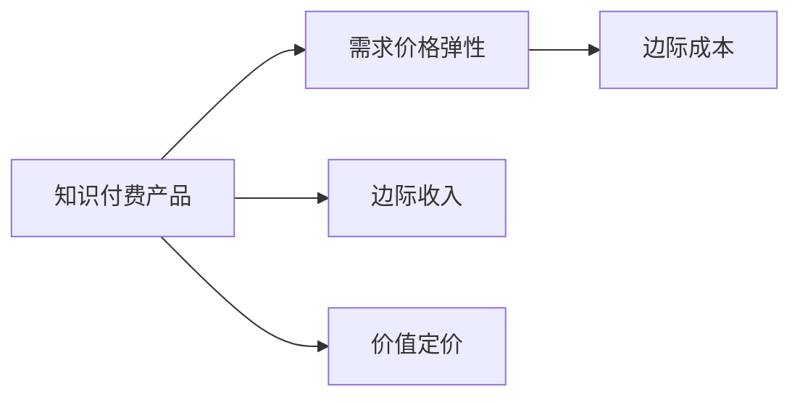

                 

# 知识付费产品定价策略详解

## 1. 背景介绍

知识付费时代，如何制定一个既科学又灵活的定价策略，直接关系到知识付费平台的生存与发展。一个合理的定价策略不仅能最大化利润，还能提升用户体验和平台口碑，吸引更多优质内容创作者入驻。因此，深入理解定价策略，成为知识付费平台不可或缺的重要工作。本文将从背景介绍入手，探讨知识付费产品定价策略的理论基础与实践应用。

## 2. 核心概念与联系

### 2.1 核心概念概述

在探讨知识付费产品的定价策略时，需理解以下几个核心概念：

- **知识付费产品(Knowledge-Pay Services, KPS)**：一种新兴的内容消费模式，通过收费获得专业知识的访问权，强调内容的独特性和稀缺性。
- **需求价格弹性(Demand Price Elasticity)**：消费者对产品价格的敏感度，与产品的可替代性和消费频率有关。
- **边际成本(Marginal Cost)**：每增加一单位产品，生产成本的增加量。
- **边际收入(Marginal Revenue)**：每增加一单位产品，收入的增加量。
- **价值定价(Value-Based Pricing)**：基于产品或服务对消费者的价值进行定价，而非成本或市场竞争。

这些概念通过以下Mermaid流程图呈现其相互关系：



### 2.2 核心概念原理和架构

#### 2.2.1 需求价格弹性

需求价格弹性衡量消费者对价格变化的敏感程度，用公式表示为：

$$
\text{Elasticity} = \frac{dQ}{dP} \cdot \frac{P}{Q}
$$

其中 $dQ/dP$ 表示价格变化引起的数量变化率，$P$ 和 $Q$ 分别表示价格和数量。

- **完全弹性(Ed = ∞)**：价格稍有变化，需求量即有极大变动，如免费资源。
- **单位弹性(Ed = 1)**：价格和需求量同比例变化，如市场需求稳定。
- **缺乏弹性(0 < Ed < 1)**：需求量对价格变化不敏感，如生活必需品。
- **完全无弹性(Ed = 0)**：价格变化对需求量无影响，如某些特殊医疗资源。

#### 2.2.2 边际成本和边际收入

边际成本和边际收入在定价策略中起到关键作用。

- **边际成本**：每增加一个用户，知识付费平台的额外成本。可用公式表示为：
  $$
  MC = \Delta C / \Delta Q
  $$
  其中 $\Delta C$ 表示额外成本，$\Delta Q$ 表示额外数量。

- **边际收入**：每增加一个用户，知识付费平台的额外收入。可用公式表示为：
  $$
  MR = \Delta R / \Delta Q
  $$
  其中 $\Delta R$ 表示额外收入。

当边际收入等于边际成本时，知识付费平台达到盈亏平衡。

#### 2.2.3 价值定价

价值定价是一种以用户价值为导向的定价策略，强调产品或服务的实际价值而非成本。其公式为：

$$
P = \frac{V}{E}
$$

其中 $P$ 表示价格，$V$ 表示价值，$E$ 表示边际成本。

根据消费者心理和行为，价值定价又可分为以下几种策略：

- **感知价值定价**：通过改变价格和商品价值的相对关系，营造高价值感。如“限时特惠”“超值组合”等策略。
- **心理定价**：利用消费者心理预期，制定特定价格。如“整数定价”“尾数定价”等策略。

## 3. 核心算法原理 & 具体操作步骤

### 3.1 算法原理概述

知识付费产品定价策略的制定，涉及经济学、心理学、市场调研等多个学科。其核心算法原理可归纳为以下几点：

- **成本加成法**：根据产品或服务的成本，加上一定的利润率，制定产品价格。
- **竞争定价法**：参考竞争对手的价格，调整自身价格以保持竞争力。
- **价值定价法**：基于用户对产品或服务的感知价值进行定价，强调性价比。

### 3.2 算法步骤详解

#### 3.2.1 市场调研与分析

- **用户画像构建**：收集用户基本信息，如年龄、性别、职业、收入水平等，以及用户行为数据，如购买历史、浏览记录等。
- **需求分析**：通过问卷调查、焦点小组等方式，了解用户对知识付费产品的需求，区分不同层次的用户群体。

#### 3.2.2 定价模型建立

- **成本加成模型**：计算知识付费产品的边际成本和固定成本，加上目标利润率，得出产品定价。公式为：
  $$
  P = C + R
  $$
  其中 $C$ 表示成本，$R$ 表示利润率。

- **竞争定价模型**：根据市场竞争态势，调整产品定价。公式为：
  $$
  P = P_{\text{竞争}} + k
  $$
  其中 $P_{\text{竞争}}$ 表示竞争对手价格，$k$ 表示价格差异系数。

- **价值定价模型**：基于用户对产品价值的感知进行定价，计算用户心理价格。公式为：
  $$
  P = \frac{V}{E}
  $$
  其中 $V$ 表示用户感知价值，$E$ 表示边际成本。

#### 3.2.3 定价策略优化

- **动态定价**：根据市场需求变化，实时调整产品价格。如节假日促销、用户注册优惠等。
- **套餐定价**：设计不同价位的多样化套餐，满足不同用户的需求。如基础版、专业版、高级版等。
- **增值服务定价**：提供增值服务，如会员特权、VIP内容等，以额外收费吸引用户。

### 3.3 算法优缺点

#### 3.3.1 优点

- **成本控制**：通过成本加成法，有效控制利润率，确保平台盈利。
- **竞争优势**：利用竞争定价法，保持市场竞争力，吸引更多用户。
- **用户体验提升**：通过价值定价法，满足用户实际需求，提升用户满意度。

#### 3.3.2 缺点

- **市场适应性差**：静态定价模型难以应对市场变化，可能导致定价失衡。
- **用户流失风险**：高价格可能使部分用户流失，影响平台用户规模。
- **营销成本增加**：过度竞争可能导致营销成本增加，影响平台盈利。

### 3.4 算法应用领域

知识付费产品的定价策略广泛应用于以下领域：

- **教育培训**：如英语学习、编程课程等，通过不同的价格套餐，满足不同用户的学习需求。
- **职业发展**：如管理培训、职业技能认证等，提供高级内容，吸引职业人士。
- **个人兴趣**：如读书、旅行、健康管理等，满足用户的个性化兴趣需求。
- **科技资讯**：如技术文章、在线研讨会、视频教程等，提供专业信息，吸引专业人士。

## 4. 数学模型和公式 & 详细讲解 & 举例说明

### 4.1 数学模型构建

知识付费产品的定价模型构建，需综合考虑市场需求、用户价值和成本等多个因素。

#### 4.1.1 需求价格弹性模型

- **完全弹性**：需求量与价格成反比，公式为：
  $$
  Q = \frac{P_0}{1 + Ed}
  $$
  其中 $Q$ 表示需求量，$P_0$ 表示初始价格，$Ed$ 表示需求价格弹性。

- **完全无弹性**：需求量对价格不敏感，公式为：
  $$
  Q = \frac{P_0}{1 - Ed}
  $$

#### 4.1.2 边际成本和边际收入模型

- **边际成本模型**：根据生产规模和单位成本，计算边际成本，公式为：
  $$
  MC = \frac{C}{Q}
  $$
  其中 $C$ 表示总成本，$Q$ 表示总数量。

- **边际收入模型**：根据价格和需求量，计算边际收入，公式为：
  $$
  MR = \frac{R}{Q}
  $$
  其中 $R$ 表示总收入，$Q$ 表示总数量。

### 4.2 公式推导过程

#### 4.2.1 需求价格弹性

假设市场初始价格为 $P_0$，需求量为 $Q_0$，需求价格弹性为 $Ed$。当价格调整为 $P$ 时，需求量变为 $Q$。根据需求价格弹性的定义，有：

$$
Ed = \frac{dQ}{dP} \cdot \frac{P}{Q}
$$

根据需求曲线，需求量 $Q$ 与价格 $P$ 的关系为：

$$
Q = a - bP
$$

其中 $a$ 表示需求上限，$b$ 表示需求斜率。当价格从 $P_0$ 调整为 $P$ 时，需求量从 $Q_0$ 调整为 $Q$，因此：

$$
Q - Q_0 = -b(P - P_0)
$$

$$
Ed = \frac{-b}{Q_0} \cdot \frac{P_0}{Q_0} = -b \cdot \frac{P_0}{Q_0}
$$

即需求价格弹性为需求斜率的负倒数。

#### 4.2.2 边际成本和边际收入

边际成本和边际收入的推导过程相对简单。根据定义，边际成本 $MC$ 和边际收入 $MR$ 分别为：

$$
MC = \Delta C / \Delta Q
$$

$$
MR = \Delta R / \Delta Q
$$

其中 $\Delta C$ 表示成本增加量，$\Delta R$ 表示收入增加量，$\Delta Q$ 表示数量增加量。

### 4.3 案例分析与讲解

#### 4.3.1 知识付费平台案例

假设某知识付费平台推出一门英语课程，初期价格为 $P_0$，用户数量为 $Q_0$，每增加一用户，边际成本为 $MC$，边际收入为 $MR$。平台目标利润率为 30%。

- **成本加成定价**：假设成本为 $C$，则定价公式为：
  $$
  P = C + 0.3C = 1.3C
  $$

- **竞争定价定价**：假设竞争对手价格为 $P_{\text{竞争}}$，平台价格为 $P$，则定价公式为：
  $$
  P = P_{\text{竞争}} + k = P_{\text{竞争}} + 0.2P_{\text{竞争}}
  $$

- **价值定价**：假设用户感知价值为 $V$，则定价公式为：
  $$
  P = \frac{V}{1.3C}
  $$

通过上述模型，平台可以根据实际情况，选择适合的定价策略。

## 5. 项目实践：代码实例和详细解释说明

### 5.1 开发环境搭建

进行知识付费产品定价策略的项目实践，需搭建以下开发环境：

1. **Python环境**：安装Python 3.8或更高版本，建议使用Anaconda创建虚拟环境。
2. **数据准备**：收集用户数据、市场需求数据、竞争对手价格等，存储在CSV或数据库中。
3. **计算环境**：配置一台高性能服务器，安装NVIDIA GPU或TPU，确保高效计算。
4. **开发工具**：安装Jupyter Notebook，用于编写和运行代码。

### 5.2 源代码详细实现

#### 5.2.1 用户数据处理

假设用户数据存储在CSV文件中，代码如下：

```python
import pandas as pd

# 读取用户数据
df = pd.read_csv('user_data.csv')

# 构建用户画像
user_profiles = df.groupby(['age', 'gender', 'income']).size().unstack().reset_index().fillna(0)

# 统计不同用户群体需求量
demand_by_profile = df.groupby('profile')['type'].value_counts().reset_index().rename(columns={'type': 'demand'})
```

#### 5.2.2 成本和收入计算

假设成本和收入数据存储在数据库中，代码如下：

```python
import sqlite3

# 连接数据库
conn = sqlite3.connect('data.db')

# 查询成本数据
cost_data = pd.read_sql_query('SELECT * FROM cost', conn)

# 查询收入数据
income_data = pd.read_sql_query('SELECT * FROM income', conn)

# 计算边际成本和边际收入
cost_by_volume = cost_data.groupby('volume')['cost'].sum().reset_index()
income_by_volume = income_data.groupby('volume')['income'].sum().reset_index()

# 计算边际成本和边际收入
cost_per_unit = cost_by_volume['cost'] / cost_by_volume['volume']
income_per_unit = income_by_volume['income'] / income_by_volume['volume']

# 关闭数据库连接
conn.close()
```

#### 5.2.3 定价策略实现

根据用户画像和成本数据，实现定价策略代码如下：

```python
# 定义成本加成模型
def cost_plus_pricing(cost, profit_rate):
    return cost * (1 + profit_rate)

# 定义竞争定价模型
def competitive_pricing(competitor_price, price_increase):
    return competitor_price * (1 + price_increase)

# 定义价值定价模型
def value_pricing(perceived_value, cost):
    return perceived_value / cost

# 计算定价
target_profit_rate = 0.3
demand_by_profile = pd.DataFrame()
for _, row in user_profiles.iterrows():
    if row['sum'] > 0:
        profile = row.name
        demand_by_profile.loc[profile] = demand_by_profile[profile] + row['sum']

cost_per_unit = cost_by_volume['cost'] / cost_by_volume['volume']
income_per_unit = income_by_volume['income'] / income_by_volume['volume']

demand_price_elasticity = demand_by_profile['demand'] / demand_by_profile['sum']
target_price = cost_plus_pricing(cost_per_unit, target_profit_rate)

# 打印定价结果
print('Target Price:', target_price)
print('Demand Price Elasticity:', demand_price_elasticity)
```

### 5.3 代码解读与分析

上述代码实现了用户数据处理、成本和收入计算、定价策略计算等关键功能。

- **用户数据处理**：通过groupby和unstack操作，构建用户画像，统计不同用户群体需求量。
- **成本和收入计算**：使用SQL查询获取成本和收入数据，计算边际成本和边际收入。
- **定价策略实现**：定义成本加成模型、竞争定价模型和价值定价模型，根据用户画像和成本数据，计算最优定价。

## 6. 实际应用场景

### 6.1 教育培训

教育培训领域知识付费产品的定价策略，需考虑不同年龄段、不同学科的用户需求。如幼儿英语启蒙课程，适合采用低价套餐策略，吸引家长和儿童用户；成人职业培训课程，适合采用高端定价策略，满足职业人士的需求。

### 6.2 职业发展

职业发展领域知识付费产品的定价策略，需考虑不同职位、不同行业的需求。如管理培训课程，适合采用高价值定价策略，吸引职业经理人；技术培训课程，适合采用灵活定价策略，满足IT从业人员的需求。

### 6.3 个人兴趣

个人兴趣领域知识付费产品的定价策略，需考虑不同兴趣、不同兴趣水平的用户需求。如旅行摄影课程，适合采用多样化定价策略，满足不同层次用户的需求；音乐创作课程，适合采用价值定价策略，满足音乐爱好者的需求。

### 6.4 科技资讯

科技资讯领域知识付费产品的定价策略，需考虑不同技术、不同技术深度的用户需求。如编程教程，适合采用逐层递进定价策略，满足初学者和进阶者的需求；前沿科技资讯，适合采用限时特惠策略，吸引科技爱好者。

## 7. 工具和资源推荐

### 7.1 学习资源推荐

1. **《定价策略与优化》**：介绍定价策略的基本原理、模型建立和优化方法，适合入门学习。
2. **《经济学原理》**：详细讲解经济学基础知识，帮助理解定价策略的经济学背景。
3. **《Python数据科学手册》**：使用Python进行数据处理和分析，适合实战应用。
4. **《数据科学与机器学习》**：涵盖数据科学和机器学习知识，帮助理解定价模型。

### 7.2 开发工具推荐

1. **Jupyter Notebook**：用于编写和运行代码，支持多种编程语言和数据格式。
2. **Anaconda**：用于创建和管理虚拟环境，支持Python及其他科学计算工具。
3. **TensorBoard**：用于可视化模型训练过程和结果，帮助理解定价模型的运行效果。

### 7.3 相关论文推荐

1. **《定价策略研究综述》**：总结了各种定价策略的理论基础和实践应用，适合深入研究。
2. **《基于用户感知价值的定价模型》**：介绍了价值定价模型的构建方法和案例分析，适合进一步学习。
3. **《知识付费产品定价策略优化》**：总结了知识付费产品定价策略的实际应用和优化方法，适合技术实践。

## 8. 总结：未来发展趋势与挑战

### 8.1 研究成果总结

知识付费产品定价策略研究取得了显著进展，主要体现在以下几个方面：

- **定价模型完善**：多种定价模型在理论和技术上得到验证，适用于不同领域和场景。
- **用户画像构建**：通过数据收集和分析，构建用户画像，有助于制定更精准的定价策略。
- **动态定价实现**：通过实时调整定价，提高市场响应速度和用户满意度。

### 8.2 未来发展趋势

未来知识付费产品定价策略的发展趋势，可以从以下几个方面着手：

- **个性化定价**：根据用户行为和偏好，实时调整定价，满足个性化需求。
- **多维度定价**：结合产品特点和用户价值，制定多维度的定价策略，满足不同用户群体。
- **智能化定价**：利用AI和大数据技术，优化定价模型，提升定价效果和效率。

### 8.3 面临的挑战

在知识付费产品定价策略的实践中，仍面临以下挑战：

- **数据隐私**：用户数据隐私保护，避免数据泄露和滥用。
- **算法公平**：确保定价算法的公平性，避免价格歧视和偏见。
- **市场竞争**：应对市场竞争，确保定价策略的竞争力和市场份额。

### 8.4 研究展望

未来研究需关注以下几个方向：

- **隐私保护技术**：研究数据隐私保护技术，确保用户数据安全。
- **算法透明性**：提高定价算法的透明性，增强用户信任。
- **市场动态响应**：实时监测市场变化，动态调整定价策略。

## 9. 附录：常见问题与解答

**Q1: 知识付费产品的定价策略有哪些？**

A: 知识付费产品的定价策略主要包括成本加成法、竞争定价法、价值定价法等。具体选择需根据产品特点、市场需求和竞争态势确定。

**Q2: 如何制定个性化的定价策略？**

A: 通过收集用户行为数据，构建用户画像，利用AI和大数据技术，实时调整定价，满足个性化需求。

**Q3: 如何确保定价算法的公平性？**

A: 通过算法透明性和用户参与，确保定价算法的公平性，避免价格歧视和偏见。

**Q4: 如何应对市场竞争？**

A: 通过市场调研，及时调整定价策略，结合竞争定价法，确保市场竞争力和用户满意度。

**Q5: 如何保护用户数据隐私？**

A: 采用数据加密、匿名化等技术，确保用户数据隐私保护，避免数据泄露和滥用。

---

作者：禅与计算机程序设计艺术 / Zen and the Art of Computer Programming

