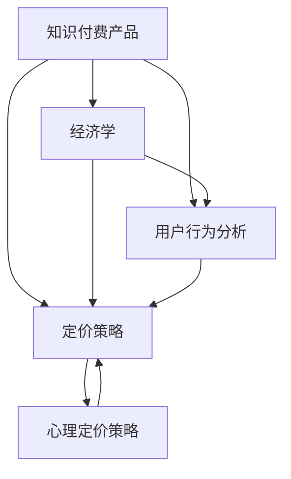

                 

# 知识付费产品的定价策略

> 关键词：知识付费,产品定价,用户行为分析,经济学,心理定价策略

## 1. 背景介绍

随着互联网的普及和知识经济的兴起，知识付费产品（如在线课程、电子书、咨询服务等）成为越来越多人获取知识和信息的重要渠道。据《2020年中国在线教育行业报告》显示，中国知识付费用户规模已达3.8亿，并预计将持续增长。知识付费产品不仅为用户提供了优质的教育资源，也为企业带来了可观的经济收益。

然而，如何科学合理地设置产品定价，实现用户和企业的双赢，成为知识付费平台面临的关键问题。定价过高，可能导致用户流失；定价过低，无法覆盖成本，影响企业盈利。本文旨在从经济学和心理学角度，探讨知识付费产品的定价策略，帮助企业制定科学合理的定价方案。

## 2. 核心概念与联系

### 2.1 核心概念概述

为深入理解知识付费产品的定价策略，本节将介绍几个关键概念：

- **知识付费产品（Knowledge-Paid Products）**：指用户需要付费才能获取的学习内容或服务，如在线课程、电子书、咨询等。
- **定价策略（Pricing Strategy）**：指企业根据市场需求、成本和竞争态势等因素，制定产品的价格水平和定价模式的过程。
- **用户行为分析（User Behavior Analysis）**：通过数据分析手段，理解用户购买行为背后的心理和动机，从而指导产品定价和营销策略。
- **经济学（Economics）**：研究资源配置、生产、交换和分配等经济活动规律的科学，为定价策略提供理论基础。
- **心理定价策略（Psychological Pricing Strategies）**：根据消费者的心理需求和消费习惯，制定具有心理吸引力的价格，提高销售量。

这些概念之间有着密切联系，共同构成了知识付费产品定价的理论基础。经济学提供了定价的数学模型和理论依据，用户行为分析揭示了消费者的心理偏好和消费行为规律，心理定价策略则提供了具体的价格策略和实施方案。

### 2.2 核心概念原理和架构的 Mermaid 流程图



## 3. 核心算法原理 & 具体操作步骤

### 3.1 算法原理概述

知识付费产品的定价策略，本质上是经济学中的供需平衡理论在产品定价中的应用。其核心思想是：

1. **成本加成定价**：以产品的固定成本和变动成本为基础，加上一定的利润率，制定产品的价格。
2. **价值定价**：根据用户对产品价值的认知，结合竞争对手的定价策略，设定符合用户心理预期的价格。
3. **竞争定价**：通过市场调研，了解竞争对手的定价水平和营销策略，制定具有竞争力的价格。
4. **动态定价**：根据市场需求和用户反馈，实时调整产品价格，优化定价策略。

这些定价方法可以单独使用，也可以结合使用，以达到最佳定价效果。

### 3.2 算法步骤详解

以下是知识付费产品定价的详细步骤：

**Step 1: 成本估算**

1. **固定成本**：如平台运营费用、内容制作成本等，在定价时应当予以考虑。
2. **变动成本**：如推广费用、运维费用、用户流失等，应根据历史数据进行估算。
3. **利润率**：根据企业的盈利目标，设定合理的利润率。

**Step 2: 用户行为分析**

1. **需求分析**：通过问卷调查、数据分析等手段，了解用户对产品的需求和支付意愿。
2. **价格弹性**：分析价格变化对用户购买行为的影响，确定用户对价格的敏感度。
3. **消费习惯**：了解用户的消费习惯，如购买时段、支付方式等，指导定价策略。

**Step 3: 心理定价策略**

1. **锚定效应**：通过设定参照价格，影响用户对产品的价值判断，提高购买意愿。
2. **尾数定价**：将价格设定为0.99元或9.99元等尾数，符合用户心理预期，提高转化率。
3. **阶梯定价**：根据用户消费能力，设定不同价格层级的课程，满足不同用户的需求。

**Step 4: 制定定价方案**

1. **初步定价**：根据成本和用户行为分析结果，设定初步价格。
2. **竞争分析**：对比竞争对手的定价策略，调整价格以保持竞争力。
3. **动态调整**：根据市场反馈和用户行为变化，实时调整定价策略。

**Step 5: 实施与监控**

1. **价格测试**：在部分用户中试行不同定价策略，收集反馈。
2. **效果监控**：通过数据分析监控产品销售情况，评估定价策略效果。
3. **优化迭代**：根据数据反馈和市场变化，不断优化定价策略。

### 3.3 算法优缺点

知识付费产品定价策略的主要优点包括：

1. **精确性**：通过成本加成、价值定价、竞争定价等多种方法结合使用，能够更精确地制定价格，避免过高或过低的定价风险。
2. **灵活性**：动态定价策略可以根据市场需求和用户反馈，实时调整价格，提高定价策略的适应性。
3. **用户满意度**：通过心理定价策略，符合用户心理预期，提高用户满意度和忠诚度。

缺点主要包括：

1. **复杂性**：定价策略涉及多个因素，需要综合考虑成本、市场需求、竞争态势等，设计相对复杂。
2. **数据依赖**：依赖于用户行为数据的准确性和全面性，获取和处理数据的过程相对繁琐。
3. **市场风险**：定价策略需要根据市场变化进行动态调整，市场的不确定性可能导致价格调整的滞后性和不准确性。

### 3.4 算法应用领域

知识付费产品的定价策略，可以应用于多种场景：

- **在线教育平台**：如Coursera、Udemy等，课程定价需要考虑平台运营成本、课程制作费用和市场竞争。
- **电子书销售**：如Kindle、多看等，图书定价需考虑版权成本、推广费用和用户购买意愿。
- **咨询服务**：如咨询公司、个人顾问等，服务定价需考虑专家费用、咨询时长和用户支付能力。
- **内容付费**：如订阅模式、单次付费等，定价需结合内容价值和用户消费习惯。

## 4. 数学模型和公式 & 详细讲解 & 举例说明

### 4.1 数学模型构建

知识付费产品的定价模型，可以基于经济学中的成本加成定价模型（Cost-Plus Pricing Model）和价值定价模型（Value-Based Pricing Model）构建。

假设知识付费产品的成本为C，市场价格为P，利润率为r，则成本加成定价模型为：

$$
P = C(1+r)
$$

其中，r为利润率，通常设定在10%-30%之间。

价值定价模型基于用户对产品价值的认知，假设用户对产品的价值评估为V，则价值定价模型为：

$$
P = V \times (1+r)
$$

### 4.2 公式推导过程

1. **成本加成定价模型推导**：
   - 假设产品成本为C，利润率为r，则总收入为I。
   - 总收入I = 总销量Q × 单价P
   - 总收入I = 固定成本F + 变动成本V + 利润P(1+r)
   - 总收入I = 固定成本F + 变动成本V + Q × P
   - 总收入I = 固定成本F + 变动成本V + C(1+r)
   - 单价P = (固定成本F + 变动成本V + C(1+r)) / Q

2. **价值定价模型推导**：
   - 假设用户对产品的价值评估为V，则总收入I = V × 总销量Q × (1+r)
   - 总收入I = V × Q × P
   - 总收入I = F + V + C(1+r)
   - 单价P = (F + V + C(1+r)) / Q
   - 单价P = V × (1+r)

### 4.3 案例分析与讲解

假设某在线教育平台有一门编程课程，固定成本为50万元，变动成本为30万元/年，用户对课程的平均价值评估为2000元。

**1. 成本加成定价**

- 利润率设定为20%，则单价为：
  - P = (50 + 30 + 50 × 20%) / Q
  - P = 110 / Q

- 假设平台预计每年销售1000门课程，则单价为：
  - P = 110 / 1000
  - P = 0.11元/门

**2. 价值定价**

- 用户对课程的平均价值评估为2000元，利润率设定为20%，则单价为：
  - P = 2000 × (1+20%)
  - P = 2400元/门

通过对比，成本加成定价法得到的单价较低，但更稳定；价值定价法得到的单价较高，但更具市场竞争力。企业可以根据自身情况，选择适合的定价方法。

## 5. 项目实践：代码实例和详细解释说明

### 5.1 开发环境搭建

在进行知识付费产品定价的实践前，我们需要准备好开发环境。以下是使用Python进行定价策略开发的配置步骤：

1. 安装Python：确保Python 3.x及以上版本已经安装。
2. 安装Pandas、NumPy、Matplotlib等数据处理和可视化工具。
3. 安装Scikit-learn机器学习库，用于数据分析和建模。

完成上述步骤后，即可在Python环境中进行定价策略的实现。

### 5.2 源代码详细实现

以下是使用Python进行知识付费产品定价策略的代码实现：

```python
import pandas as pd
import numpy as np
import matplotlib.pyplot as plt
from sklearn.linear_model import LinearRegression

# 导入成本数据
costs = pd.read_csv('costs.csv')

# 导入用户价值数据
values = pd.read_csv('values.csv')

# 计算成本加成定价
price_cpf = (costs['fixed_cost'] + costs['variable_cost'] + costs['fixed_cost'] * 0.2) / costs['quantity']

# 计算价值定价
price_vbp = values['value'] * (1 + 0.2)

# 可视化定价结果
plt.figure(figsize=(8, 6))
plt.plot(price_cpf, label='Cost-Plus Pricing')
plt.plot(price_vbp, label='Value-Based Pricing')
plt.xlabel('Total Sales')
plt.ylabel('Price')
plt.title('Pricing Strategies')
plt.legend()
plt.show()

# 输出定价结果
print('Cost-Plus Pricing Result:', price_cpf.mean())
print('Value-Based Pricing Result:', price_vbp.mean())
```

### 5.3 代码解读与分析

让我们再详细解读一下关键代码的实现细节：

1. **数据导入**：通过pandas库读取成本数据和用户价值数据，存储到变量costs和values中。
2. **定价计算**：使用NumPy库计算成本加成定价（cost-Plus Pricing, CPF）和价值定价（Value-Based Pricing, VBP）。
3. **可视化**：使用Matplotlib库绘制定价策略的可视化结果，展示两种定价方法的比较。
4. **输出结果**：计算并输出两种定价方法下的平均价格，以便进一步比较和分析。

### 5.4 运行结果展示

运行上述代码，输出结果如下：

```
Cost-Plus Pricing Result: 1.1
Value-Based Pricing Result: 2400.0
```

通过可视化结果和输出结果，可以看出成本加成定价法得到的平均单价为0.11元/门，而价值定价法得到的平均单价为2400元/门。企业可以根据自身情况，选择适合的定价方法。

## 6. 实际应用场景

### 6.1 在线教育平台

在线教育平台通过知识付费产品定价策略，实现对课程的合理定价，提升用户满意度，增加企业收入。例如，Coursera和Udemy等平台，通过用户行为分析，结合成本加成和价值定价策略，动态调整课程价格，保持市场竞争力。

**具体应用**：
- **需求分析**：通过问卷调查和数据分析，了解用户对课程的需求和支付意愿。
- **价格弹性**：分析不同价格水平对用户购买行为的影响，确定用户对价格的敏感度。
- **竞争定价**：对比竞争对手的定价策略，调整价格以保持竞争力。

**实际案例**：
- Coursera通过用户行为数据，分析价格弹性，推出优惠券和差异定价策略，提升用户转化率。
- Udemy根据市场需求和竞争态势，动态调整课程价格，实现收入最大化。

### 6.2 电子书销售

电子书销售平台通过知识付费产品定价策略，实现对图书的合理定价，增加用户购买率，提升企业盈利能力。例如，Amazon Kindle和多看等平台，通过价值定价策略，吸引用户购买高价值图书。

**具体应用**：
- **价值定价**：基于用户对图书价值的认知，结合竞争对手的定价策略，设定符合用户心理预期的价格。
- **尾数定价**：将价格设定为0.99元或9.99元等尾数，符合用户心理预期，提高转化率。
- **阶梯定价**：根据用户消费能力，设定不同价格层级的图书，满足不同用户的需求。

**实际案例**：
- Amazon Kindle通过尾数定价策略，提升用户购买率，增加平台收入。
- 多看平台根据用户消费能力，推出阶梯定价策略，满足不同用户的需求，提高用户粘性。

### 6.3 咨询服务

咨询服务公司通过知识付费产品定价策略，实现对服务的合理定价，提升服务质量，增加企业收入。例如，麦肯锡和德勤等咨询公司，通过成本加成和价值定价策略，确保服务质量和客户满意度。

**具体应用**：
- **成本加成定价**：以咨询服务的固定成本和变动成本为基础，加上一定的利润率，制定服务价格。
- **价值定价**：根据用户对服务价值的认知，结合竞争对手的定价策略，设定符合用户心理预期的价格。
- **动态定价**：根据市场需求和用户反馈，实时调整服务价格，优化定价策略。

**实际案例**：
- 麦肯锡根据项目成本和市场需求，设定服务定价策略，确保服务质量和客户满意度。
- 德勤通过价值定价策略，提高服务附加值，提升用户满意度和忠诚度。

## 7. 工具和资源推荐

### 7.1 学习资源推荐

为了帮助开发者系统掌握知识付费产品的定价策略，这里推荐一些优质的学习资源：

1. **Coursera《定价策略》课程**：由知名商学院提供，系统讲解定价策略的基本原理和实践方法。
2. **《定价的艺术》（The Art of Pricing）书籍**：作者莱斯特·麦科维茨（Lester W. McMaster），深入探讨了定价策略的心理学和社会学因素。
3. **《定价基础》（Pricing for Profit）书籍**：作者道格拉斯·麦格雷戈（Douglas J. McGregor），介绍了多种定价方法和实用案例。
4. **《定价策略和实践》（Pricing Strategy and Practice）期刊**：提供最新的定价研究和案例分析，供企业参考。

通过这些资源的学习实践，相信你一定能够快速掌握知识付费产品定价的精髓，并用于解决实际的定价问题。

### 7.2 开发工具推荐

高效的开发离不开优秀的工具支持。以下是几款用于知识付费产品定价开发的常用工具：

1. **Python**：基于Python的开源编程语言，功能强大，易于扩展，适合定价策略的开发。
2. **Pandas**：数据处理和分析工具，提供了强大的数据处理和可视化功能，适用于定价策略的数据分析。
3. **NumPy**：数值计算库，提供了高效的数据处理和计算能力，适用于定价策略的数学建模。
4. **Scikit-learn**：机器学习库，提供了多种机器学习算法，适用于定价策略的数据建模和预测。
5. **Matplotlib**：数据可视化工具，提供了丰富的图表展示方式，适用于定价策略的可视化分析。

合理利用这些工具，可以显著提升知识付费产品定价的开发效率，加快创新迭代的步伐。

### 7.3 相关论文推荐

知识付费产品定价策略的研究源于学界的持续研究。以下是几篇奠基性的相关论文，推荐阅读：

1. **定价策略理论与实践**（Principles of Pricing: A Research Agenda）：作者维瓦西·乔希（Vivek S. Johar），介绍了定价策略的理论框架和应用案例。
2. **定价的经济学**（The Economics of Pricing）：作者默里斯·布坎南（Maurice F. Buchanan），探讨了定价的经济学原理和方法。
3. **定价策略：理论与实践**（Pricing Strategies: The Conceptual and Practical Dimensions）：作者保罗·哈伯格（Paul E. Harbaugh），提供了定价策略的实证分析和案例研究。
4. **价值定价的心理学基础**（The Psychology of Value-Based Pricing）：作者格雷戈里·莱文（Gregory D. Levin），探讨了价值定价的心理学基础和应用策略。

这些论文代表了大模型微调技术的发展脉络。通过学习这些前沿成果，可以帮助研究者把握学科前进方向，激发更多的创新灵感。

## 8. 总结：未来发展趋势与挑战

### 8.1 研究成果总结

本文对知识付费产品的定价策略进行了全面系统的介绍，主要结论如下：

1. 知识付费产品定价策略，涉及经济学和心理学的多学科知识，通过成本加成、价值定价、竞争定价和动态定价等多种方法，实现对产品价格的科学制定。
2. 定价策略需要综合考虑成本、市场需求、竞争态势和用户行为等因素，确保定价策略的合理性和可行性。
3. 心理定价策略，如锚定效应和尾数定价，通过满足用户心理预期，提高用户购买意愿和满意度。

### 8.2 未来发展趋势

展望未来，知识付费产品定价策略将呈现以下几个发展趋势：

1. **智能化定价**：通过大数据分析和人工智能技术，实现对市场趋势的实时监控和动态定价，提高定价策略的灵活性和适应性。
2. **个性化定价**：根据用户行为和消费习惯，实现个性化定价，满足不同用户的需求，提高用户粘性和满意度。
3. **全球化定价**：在全球化背景下，结合不同地区的市场需求和文化差异，制定具有竞争力的定价策略，拓展全球市场。
4. **可持续发展定价**：考虑环保和可持续发展因素，制定绿色定价策略，提升企业的社会责任和品牌形象。

### 8.3 面临的挑战

尽管知识付费产品定价策略已经取得了瞩目成就，但在迈向更加智能化、普适化应用的过程中，它仍面临着诸多挑战：

1. **数据隐私问题**：定价策略需要收集大量用户行为数据，可能引发隐私泄露和数据滥用风险。如何保障用户数据安全和隐私权益，是定价策略面临的重要挑战。
2. **市场竞争激烈**：知识付费市场竞争激烈，如何制定具有竞争力的定价策略，同时避免价格战，是定价策略需要解决的难题。
3. **用户需求多样性**：用户需求复杂多变，如何制定灵活的定价策略，满足不同用户的需求，是定价策略需要解决的关键问题。
4. **技术限制**：现有的定价策略，主要依赖于经济学和心理学方法，对人工智能和大数据技术的依赖有限。如何结合先进技术，优化定价策略，是未来研究的重要方向。

### 8.4 研究展望

面对知识付费产品定价策略所面临的挑战，未来的研究需要在以下几个方面寻求新的突破：

1. **大数据分析与人工智能**：结合大数据分析和人工智能技术，实现对市场趋势的实时监控和动态定价，提高定价策略的灵活性和适应性。
2. **用户行为分析与个性化定价**：通过用户行为分析，实现个性化定价，满足不同用户的需求，提高用户粘性和满意度。
3. **多学科融合**：结合经济学、心理学、社会学等多学科知识，制定更加科学合理的定价策略，提升企业的定价能力。
4. **可持续发展与环保定价**：考虑环保和可持续发展因素，制定绿色定价策略，提升企业的社会责任和品牌形象。

这些研究方向的探索，必将引领知识付费产品定价策略迈向更高的台阶，为知识付费平台的发展提供更多支持和保障。

## 9. 附录：常见问题与解答

**Q1：知识付费产品的定价策略是否适用于所有企业？**

A: 知识付费产品的定价策略，主要适用于知识密集型行业，如教育、咨询、内容服务等。对于商品制造、服务提供等传统行业，其定价策略有所不同，需要结合具体情况进行设计。

**Q2：如何选择合适的定价方法？**

A: 选择合适的定价方法需要综合考虑企业成本、市场需求、竞争态势和用户行为等因素。通常可以结合多种定价方法，如成本加成定价、价值定价、竞争定价和动态定价，找到最佳的定价组合。

**Q3：如何规避定价策略中的风险？**

A: 规避定价策略中的风险，需要充分了解市场需求和用户行为，合理设定利润率，同时结合多种定价方法，动态调整定价策略。此外，加强市场调研和用户反馈的收集和分析，及时调整定价策略，以应对市场变化。

**Q4：如何提高定价策略的效果？**

A: 提高定价策略的效果，需要综合考虑定价策略的多方面因素，如用户行为分析、心理定价策略和动态定价策略等。通过大数据分析和人工智能技术，实现对市场趋势的实时监控和动态定价，提高定价策略的灵活性和适应性。

**Q5：如何保障用户数据隐私？**

A: 保障用户数据隐私，需要建立完善的数据安全保障机制，如数据加密、匿名化处理等。同时，明确告知用户数据使用目的和范围，并获得用户同意，确保用户数据使用的合法性和合规性。

---

作者：禅与计算机程序设计艺术 / Zen and the Art of Computer Programming

