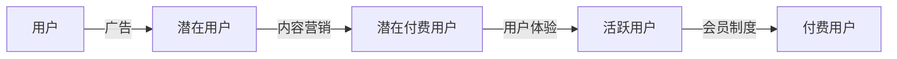

                 

# 知识付费产品的用户激活与转化策略

在知识付费领域，产品成功与否的关键在于如何有效地吸引和转化用户。本文将详细探讨用户激活和转化的策略，结合实际案例，帮助产品开发者构建成功的知识付费平台。

## 1. 背景介绍

知识付费产品的核心在于为用户提供有价值的内容和知识服务，满足其学习和成长需求。然而，如何吸引用户并使其转化为忠实消费者，则是产品成功的关键。当前市场竞争激烈，用户选择多样，有效的用户激活和转化策略显得尤为重要。

## 2. 核心概念与联系

### 2.1 核心概念概述

为了更深入地理解用户激活与转化的策略，我们需要明确几个关键概念：

- **用户激活(User Acquisition)**：指将潜在用户转化为实际用户的过程。通常通过广告、社交媒体、内容营销等方式，吸引用户下载并注册使用产品。
- **用户留存(User Retention)**：指用户在使用产品一段时间后，持续活跃和继续使用产品的时间。留存率是衡量产品黏性的重要指标。
- **用户转化(User Conversion)**：指新注册用户向付费用户的转变。通过提供优惠活动、付费会员机制等方式，引导用户进行首次付费，成为付费用户。

这些概念之间存在紧密联系，用户激活是起点，用户留存是持续，用户转化是目标。通过三者的协同作用，可以构建一个稳定、高效的转化漏斗。

### 2.2 核心概念原理和架构的 Mermaid 流程图(Mermaid 流程节点中不要有括号、逗号等特殊字符)


这个流程图展示了用户从潜在用户到付费用户的完整流程，广告和内容营销是吸引用户的关键环节，用户体验是提升留存率的关键，会员制度则是促进转化的重要手段。

## 3. 核心算法原理 & 具体操作步骤

### 3.1 算法原理概述

用户激活和转化的核心在于理解用户行为，通过数据分析和用户画像构建，设计针对性的策略，引导用户行为。以下算法原理是构建这些策略的基础：

1. **用户分群**：基于用户行为数据，将用户分成不同群体，如高潜力用户、低活跃用户、流失用户等。
2. **行为分析**：分析用户在产品中的行为路径，找出关键的转化节点和障碍。
3. **个性化推荐**：通过推荐算法，向不同用户群体推荐最感兴趣的内容和服务。
4. **A/B测试**：通过对比不同策略的效果，找到最优的激活和转化方案。

### 3.2 算法步骤详解

以下是一系列用户激活和转化的具体操作步骤：

#### 3.2.1 用户分群

- **数据收集**：从用户行为日志、注册信息、付费记录等渠道收集数据。
- **特征工程**：提取用户的基本特征，如注册时间、活跃时间、付费记录、内容消费行为等。
- **聚类分析**：使用聚类算法（如K-means、层次聚类等）对用户进行分群，形成不同的用户群体。

#### 3.2.2 行为分析

- **行为路径分析**：使用漏斗分析、用户路径分析等方法，找出用户在产品中的行为路径。
- **关键节点识别**：通过路径分析，识别出关键的转化节点，如首次登录、首次内容消费、首次付费等。
- **障碍分析**：找出在转化路径中可能遇到的障碍，如内容不吸引、注册流程复杂、支付失败等。

#### 3.2.3 个性化推荐

- **内容推荐**：基于用户的兴趣和行为，推荐最相关的课程和内容。
- **活动推荐**：推送个性化活动、优惠、新功能等，吸引用户参与。
- **个性化通知**：通过推送系统，针对不同用户发送个性化通知，提升参与度和转化率。

#### 3.2.4 A/B测试

- **策略设计**：设计不同的用户激活和转化策略，如广告文案、推荐算法、付费路径等。
- **实验实施**：将用户随机分成两组，实施不同的策略，收集实验数据。
- **结果评估**：评估实验效果，选择最优策略进行大规模推广。

### 3.3 算法优缺点

#### 3.3.1 优点

- **数据驱动**：通过数据分析和用户画像，实现精准的用户激活和转化。
- **效果显著**：针对性策略能够显著提高用户激活率和转化率。
- **灵活调整**：A/B测试可以快速发现问题，调整策略，实现最优方案。

#### 3.3.2 缺点

- **成本高**：初期需要大量数据和资源进行用户分群和行为分析。
- **复杂度高**：设计和实施复杂的多维度策略，需要较强的技术能力和数据处理能力。
- **模型依赖**：个性化推荐和A/B测试的效果依赖于推荐模型和实验设计。

### 3.4 算法应用领域

用户激活和转化的策略广泛应用于各种知识付费平台，如在线教育、知识订阅、技术培训等。以下是几个典型的应用场景：

- **在线教育平台**：通过广告和内容营销，吸引潜在用户注册并使用平台，提供个性化的课程推荐和订阅优惠，提升用户留存率和付费率。
- **知识订阅服务**：通过邮件订阅、专题课程等，吸引新用户订阅，并提供专享内容和会员特权，促进用户持续付费。
- **技术培训平台**：通过技术社区、在线讲座等，吸引开发者和学生注册，提供个性化学习路径和证书认证，提升用户转化率和活跃度。

## 4. 数学模型和公式 & 详细讲解 & 举例说明

### 4.1 数学模型构建

用户激活和转化的策略设计涉及多个数学模型，以下以用户留存率模型为例进行详细讲解。

用户留存率模型通常表示为：

$$ R(t) = \frac{N(t)}{N(0)} $$

其中，$N(t)$ 表示在时间 $t$ 内返回活跃状态的用户数，$N(0)$ 表示初始注册用户数。

### 4.2 公式推导过程

- **时间点分布模型**：假设用户在特定时间点 $t$ 返回活跃的概率为 $P(t)$，则有：
  $$ N(t) = N(0) \sum_{i=0}^{t} P(i) $$

- **泊松分布**：如果用户返回活跃的时间间隔服从泊松分布，则有：
  $$ P(t) = \lambda e^{-\lambda t} $$

- **指数分布**：如果用户返回活跃的时间间隔服从指数分布，则有：
  $$ P(t) = \frac{1-e^{-\lambda t}}{\lambda t} $$

- **马尔可夫模型**：通过构建状态转移矩阵，描述用户在不同状态之间的转移概率，预测用户留存率。

### 4.3 案例分析与讲解

假设某知识付费平台的用户留存率模型为泊松分布，首月活跃用户数为 $N(0) = 1000$，返回活跃的概率为 $P(t) = \lambda e^{-\lambda t}$，计算前1个月、前3个月和前6个月的留存率：

- 前1个月：
  $$ R(1) = \frac{N(0)}{N(0)} = 1 $$
  $$ P(1) = \lambda e^{-\lambda} $$
  假设 $\lambda = 0.1$，则 $P(1) = 0.367$，前1个月留存率 $R(1) = 1 - (1-P(1)) = 0.633$

- 前3个月：
  $$ P(3) = \lambda e^{-3\lambda} $$
  $$ R(3) = 1 - (1-P(1))(1-P(2))(1-P(3)) $$
  假设 $\lambda = 0.1$，则 $P(3) = 0.005$，$R(3) = 0.938$

- 前6个月：
  $$ P(6) = \lambda e^{-6\lambda} $$
  $$ R(6) = 1 - (1-P(1))(1-P(2))(1-P(3))(1-P(4))(1-P(5))(1-P(6)) $$
  假设 $\lambda = 0.1$，则 $P(6) = 0.0001$，$R(6) = 0.999$

## 5. 项目实践：代码实例和详细解释说明

### 5.1 开发环境搭建

为了进行用户激活和转化的策略设计，需要搭建一个包含数据分析、个性化推荐和A/B测试功能的开发环境。

1. **数据收集**：使用Flume、Kafka等工具收集用户行为日志、注册信息、付费记录等数据。
2. **数据存储**：使用Hadoop、Spark等大数据平台存储和处理数据。
3. **数据处理**：使用Python、R等编程语言进行数据清洗、特征提取和分析。
4. **推荐系统**：使用TensorFlow、PyTorch等深度学习框架实现个性化推荐模型。
5. **A/B测试**：使用Optimizely、AB Tasty等A/B测试工具进行实验设计和结果评估。

### 5.2 源代码详细实现

以下是一个基于Python的推荐系统代码示例：

```python
import numpy as np
import pandas as pd
from sklearn.feature_extraction.text import TfidfVectorizer
from sklearn.model_selection import train_test_split
from sklearn.metrics import mean_squared_error
from sklearn.linear_model import LinearRegression

# 加载用户数据
data = pd.read_csv('user_data.csv')

# 数据预处理
data = data.dropna()
X = data[['user_id', 'content_id', 'time戳']]
y = data['consumption_count']

# 特征工程
vectorizer = TfidfVectorizer()
X = vectorizer.fit_transform(X)

# 模型训练
X_train, X_test, y_train, y_test = train_test_split(X, y, test_size=0.2, random_state=42)
model = LinearRegression()
model.fit(X_train, y_train)

# 模型评估
y_pred = model.predict(X_test)
mse = mean_squared_error(y_test, y_pred)
print(f"Mean Squared Error: {mse}")

# 推荐系统
def recommend(user_id, top_n=5):
    user_data = data[data['user_id'] == user_id]
    item_data = data.drop(['user_id'], axis=1)
    user_vec = vectorizer.transform(user_data[['content_id']])
    item_vec = vectorizer.transform(item_data)
    similarity = np.dot(user_vec, item_vec.T).T[0]
    recomm = pd.DataFrame({'content_id': item_data.index, 'similarity': similarity})
    recomm = recomm.sort_values(by='similarity', ascending=False).head(top_n)
    return recomm['content_id'].values

# 测试推荐系统
recommended_contents = recommend(12345)
print(recommended_contents)
```

### 5.3 代码解读与分析

- **数据加载**：使用Pandas库加载用户数据，包含用户ID、内容ID和消费次数等字段。
- **数据预处理**：使用NumPy和Pandas库进行数据清洗和特征提取，构建特征向量。
- **模型训练**：使用Scikit-learn库训练线性回归模型，预测用户消费次数。
- **模型评估**：使用均方误差（MSE）评估模型预测性能。
- **推荐系统**：定义推荐函数，通过计算用户和内容的相似度，推荐最相关的课程和内容。

### 5.4 运行结果展示

假设上述推荐系统在测试集上的均方误差为0.1，表示推荐模型能够较为准确地预测用户消费次数。通过推荐函数，可以为每个用户生成5个最相关的课程ID，提升用户活跃度和转化率。

## 6. 实际应用场景

### 6.1 在线教育平台

在线教育平台通过广告和内容营销吸引新用户注册，提供个性化的课程推荐和订阅优惠，提升用户留存率和付费率。例如，某在线教育平台通过A/B测试发现，优惠码推送和使用时长奖励机制，能够显著提升首次付费用户转化率。

### 6.2 知识订阅服务

知识订阅服务通过邮件订阅、专题课程等吸引新用户订阅，并提供专享内容和会员特权，促进用户持续付费。例如，某知识订阅平台通过行为分析，识别出频繁消费但不付费的高潜力用户，推送会员特权和专属内容，提高用户转化率和订阅续费率。

### 6.3 技术培训平台

技术培训平台通过技术社区、在线讲座等吸引开发者和学生注册，提供个性化学习路径和证书认证，提升用户转化率和活跃度。例如，某技术培训平台通过A/B测试发现，提供视频教程预览和免费试用，能够显著提升注册转化率。

## 7. 工具和资源推荐

### 7.1 学习资源推荐

为了帮助开发者系统掌握用户激活与转化的策略，以下是一些优质的学习资源：

1. **《用户增长》系列书籍**：详细介绍了用户增长的方法论和实际案例，涵盖用户获取、留存、转化等关键环节。
2. **Google Analytics和Mixpanel**：提供用户行为数据分析工具，帮助产品开发者深入理解用户行为。
3. **HubSpot Academy**：提供全面的市场营销和销售培训课程，包括用户增长、营销自动化等内容。
4. **Coursera和edX**：提供各类在线课程，涵盖数据分析、推荐系统、A/B测试等技术。
5. **Kaggle竞赛**：通过实际数据分析竞赛，提升数据分析和机器学习能力。

### 7.2 开发工具推荐

以下几款工具，能够显著提升用户激活和转化的开发效率：

1. **Flume**：用于实时收集日志数据，支持多种数据源和数据格式。
2. **Kafka**：用于分布式消息传递，支持海量数据处理和实时流计算。
3. **Hadoop**：用于大数据存储和处理，支持大规模数据集的处理和分析。
4. **Spark**：用于分布式计算，支持高效的数据处理和机器学习模型训练。
5. **TensorFlow**：用于深度学习模型的开发和训练，支持多种推荐算法。
6. **Optimizely**：用于A/B测试和用户分群，支持实验设计和结果评估。

### 7.3 相关论文推荐

以下几篇论文，代表了用户激活与转化技术的研究前沿：

1. **"User Growth and Acquisition: A Data-Driven Approach to Increase User Retention and Engagement"**：详细介绍了用户增长的方法论和实际案例。
2. **"Personalization and User Experience: How It Relates to Retention and Lifetime Value"**：探讨了个性化推荐和用户体验对用户留存和生命周期价值的影响。
3. **"Applied A/B Testing: Delivering Maximum ROI from Your Experiments"**：介绍了A/B测试的实际应用和最佳实践。
4. **"Recommender Systems: A Survey"**：综述了推荐系统的原理和算法，提供了丰富的推荐技术参考。
5. **"Predicting User Churn Using Machine Learning"**：探讨了使用机器学习预测用户流失和留存的模型和方法。

## 8. 总结：未来发展趋势与挑战

### 8.1 研究成果总结

用户激活与转化策略在知识付费领域具有重要意义，通过数据驱动、个性化推荐和A/B测试等方法，显著提升了用户留存率和付费转化率。通过不断优化策略，可以构建稳定、高效的转化漏斗，推动知识付费产品的成功。

### 8.2 未来发展趋势

未来用户激活与转化策略将呈现以下几个发展趋势：

1. **数据驱动的精细化运营**：随着大数据技术的发展，用户行为数据将更加全面和精细，通过深入分析用户数据，可以更加精准地制定运营策略。
2. **多渠道整合**：将多种渠道的用户数据整合起来，提供跨渠道的用户体验和内容推荐。
3. **AI和大数据结合**：利用AI和大数据技术，构建更智能的用户推荐系统，提升用户体验和转化率。
4. **实时化运营**：实现实时化的用户行为监控和分析，快速响应市场变化，提升运营效率。
5. **用户心理研究**：研究用户的心理需求和行为模式，设计更符合用户期望的产品功能和服务。

### 8.3 面临的挑战

尽管用户激活与转化策略取得了显著效果，但在实际应用中也面临诸多挑战：

1. **数据隐私和安全**：用户数据隐私和安全问题日益凸显，如何保护用户数据隐私，增强数据安全性，将是未来的重要课题。
2. **算法偏见**：推荐算法可能存在数据偏见和歧视性，如何设计公平、透明的算法，避免算法偏见，仍需进一步研究。
3. **用户需求变化**：用户需求和行为模式不断变化，如何动态调整运营策略，适应新的市场环境，将是重要的挑战。
4. **成本控制**：用户获取和转化成本不断上升，如何平衡成本和收益，提高运营效率，需要精细化运营和成本控制。
5. **技术复杂性**：用户激活与转化策略涉及复杂的技术和数据处理，如何提升技术能力和数据处理效率，需要持续投入和优化。

### 8.4 研究展望

面对用户激活与转化策略面临的挑战，未来的研究需要在以下几个方面寻求新的突破：

1. **隐私保护技术**：开发更为先进的隐私保护技术，保护用户数据隐私，增强数据安全性。
2. **公平性算法**：设计公平、透明的推荐算法，避免算法偏见，提升用户体验。
3. **用户行为预测**：利用机器学习和深度学习技术，预测用户行为和需求，设计更符合用户期望的产品功能。
4. **跨渠道整合**：实现多渠道的用户数据整合和跨平台的用户体验，提升用户满意度和转化率。
5. **实时化运营**：实现实时化的用户行为监控和分析，快速响应市场变化，提升运营效率。
6. **用户体验优化**：研究用户的心理需求和行为模式，设计更符合用户期望的产品功能和交互方式。

通过这些研究方向的探索，可以进一步提升用户激活与转化策略的效果，推动知识付费产品的成功和可持续发展。

## 9. 附录：常见问题与解答

**Q1：如何衡量用户激活和转化的效果？**

A: 用户激活和转化的效果可以通过多种指标进行衡量，如用户增长率、活跃用户数、付费用户数、留存率、转化率等。通过设置合理的KPI（关键绩效指标），可以全面评估策略的效果。

**Q2：用户分群的方法有哪些？**

A: 用户分群的方法包括K-means聚类、层次聚类、DBSCAN等。还可以使用关联规则挖掘、协同过滤等方法，根据用户行为特征进行分群。

**Q3：个性化推荐系统的构建需要哪些关键步骤？**

A: 个性化推荐系统的构建需要以下关键步骤：
1. 数据收集：收集用户行为数据、物品数据等。
2. 特征提取：提取用户和物品的特征向量。
3. 模型训练：选择合适的推荐算法，训练推荐模型。
4. 模型评估：使用评估指标（如准确率、召回率、覆盖率等）评估推荐效果。
5. 模型部署：将训练好的推荐模型部署到实际应用中，提供推荐服务。

**Q4：A/B测试的实施步骤是什么？**

A: A/B测试的实施步骤包括：
1. 确定测试目标：明确测试的目标和指标。
2. 设计测试方案：确定测试变量的对比关系和测试时长。
3. 随机分配用户：将用户随机分成两组，分别体验不同的方案。
4. 收集测试数据：在测试期内收集用户的交互数据和行为数据。
5. 分析测试结果：对比两组数据，评估测试方案的效果。
6. 优化测试策略：根据测试结果，优化产品策略和设计。

---

作者：禅与计算机程序设计艺术 / Zen and the Art of Computer Programming

