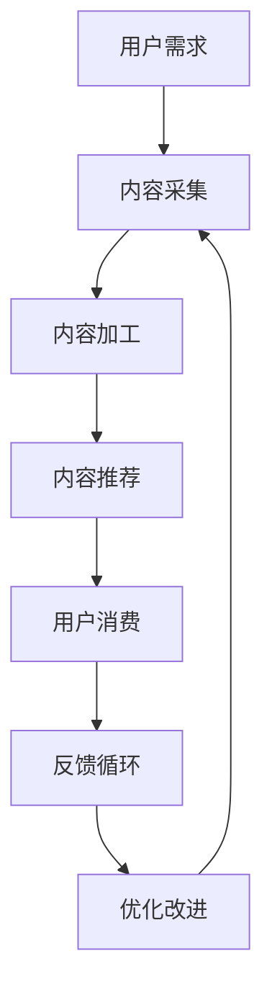

                 

# 知识付费创业中的内容价值最大化

## 1. 背景介绍

### 1.1 问题由来

随着知识经济的崛起，越来越多的个人和企业开始尝试通过知识付费的方式获取价值，促进自身的成长和发展。然而，尽管知识付费市场增长迅速，但高质量内容的供给仍然不足，用户对于优质内容的渴求远超其可获得性。在此背景下，如何最大化内容价值，吸引并留住用户，成为知识付费创业中亟待解决的关键问题。

### 1.2 问题核心关键点

实现内容价值最大化，需要在内容生产、分发、转化、消费等环节全面优化。具体而言，包括：

- 如何定位目标用户，理解其需求和偏好？
- 如何高效采集和整合高质量内容，提供丰富的知识服务？
- 如何设计合理的定价策略，促进内容的变现？
- 如何优化用户消费体验，增加用户粘性？
- 如何建立用户反馈机制，不断改进内容质量？

本文将深入探讨这些关键点，提出基于人工智能技术的解决方案，帮助知识付费创业者最大化内容价值。

### 1.3 问题研究意义

在知识付费创业中，最大化内容价值不仅是提高用户满意度和忠诚度的关键，也是实现商业盈利的重要途径。通过合理定位内容、精准推送、动态定价和智能推荐，可以实现内容的差异化竞争和高效变现，推动知识付费产业的可持续发展。

## 2. 核心概念与联系

### 2.1 核心概念概述

为更好地理解如何最大化知识付费中的内容价值，本节将介绍几个关键概念及其相互关系：

- **知识付费 (Knowledge-Paying)**：用户为获取有价值的知识内容而支付费用，从而获取信息、技能、观点等价值的行为。知识付费的兴起得益于互联网技术的发展和知识经济理念的普及。

- **内容价值最大化 (Maximizing Content Value)**：通过合理的设计和管理，将知识内容的价值最大化，实现内容的高效生产和消费，从而提升用户满意度并推动商业盈利。

- **人工智能 (AI)**：一种使计算机具备类似人类智能的技术，包括机器学习、自然语言处理、计算机视觉等，可以在内容采集、推荐、定价、反馈等多个环节提供技术支持。

- **推荐系统 (Recommendation System)**：利用人工智能技术，根据用户的历史行为、兴趣偏好等，智能推荐其可能感兴趣的内容，提升用户体验和转化率。

- **定价策略 (Pricing Strategy)**：根据内容价值、用户价值和市场情况，设计灵活多变的定价方式，实现内容的精准变现。

- **用户反馈 (User Feedback)**：收集用户对内容的评价和建议，用于改进内容和优化推荐算法，实现内容生产的持续优化。

这些核心概念之间通过逻辑链相互联系，共同构成了知识付费中内容价值最大化的实现框架。

### 2.2 核心概念原理和架构的 Mermaid 流程图



这个流程图展示了内容价值最大化的全流程：从用户需求开始，经过内容采集、加工、推荐、消费，到用户反馈和内容优化，形成了一个闭环。

## 3. 核心算法原理 & 具体操作步骤

### 3.1 算法原理概述

知识付费中内容价值最大化的核心在于通过智能技术和数据分析，提升内容的精准性和用户体验。主要包括以下几个算法原理：

- **用户画像构建**：通过分析用户的历史行为、兴趣偏好、社交网络等，构建详尽的用户画像，为内容推荐提供基础。
- **内容相似度计算**：利用自然语言处理技术，计算内容间的相似度，发现相关主题和知识关联，为内容分类和推荐提供依据。
- **推荐系统设计**：采用协同过滤、内容推荐、混合推荐等方法，结合用户画像和内容特征，智能推荐用户可能感兴趣的内容。
- **定价模型建立**：基于内容的独特性、市场需求和竞争情况，设计灵活多变的定价模型，实现内容的精准变现。
- **反馈循环优化**：通过用户反馈和评价，不断优化推荐算法和内容生产，提升用户满意度和转化率。

### 3.2 算法步骤详解

以下是实现内容价值最大化的一般步骤：

**Step 1: 用户画像构建**
- 收集用户的基本信息、行为数据、社交网络等，建立用户画像。
- 使用聚类分析、分类算法等技术，对用户进行分类，识别出潜在的高价值用户。

**Step 2: 内容采集与加工**
- 通过网络爬虫、API接口等手段，采集高质量的知识内容，包括文章、视频、音频等。
- 对采集到的内容进行清洗、格式转换、标注等加工处理，确保内容的可用性和一致性。

**Step 3: 推荐系统设计**
- 设计协同过滤、基于内容的推荐算法，构建推荐模型。
- 使用A/B测试、交叉验证等方法，评估推荐效果，优化推荐策略。

**Step 4: 定价策略设计**
- 分析市场供需关系、竞争对手定价、用户支付意愿等，确定合理的价格区间。
- 采用动态定价、阶梯定价、包月定价等策略，最大化内容收益。

**Step 5: 反馈循环优化**
- 建立用户反馈机制，收集用户对内容的评价和建议。
- 使用自然语言处理技术，分析用户反馈，识别共性问题和改进点。
- 根据用户反馈，持续优化内容生产和推荐算法，提升用户体验。

### 3.3 算法优缺点

**优点**：
1. 提高内容精准性：通过用户画像和内容相似度计算，实现内容的高精度推荐，提升用户体验和转化率。
2. 最大化内容价值：通过智能定价策略和反馈循环优化，实现内容的精准变现和持续改进。
3. 降低运营成本：自动化处理内容采集、加工、推荐等环节，提高效率，降低人力成本。

**缺点**：
1. 数据隐私问题：用户画像和推荐算法依赖大量用户数据，涉及隐私保护和数据安全问题。
2. 内容质量和多样性问题：过度依赖推荐系统可能导致内容同质化，影响用户体验。
3. 动态定价复杂性：制定合理的动态定价策略，需要实时监控市场变化和用户需求，具有一定复杂性。

### 3.4 算法应用领域

内容价值最大化的算法原理在知识付费领域具有广泛应用，主要包括以下几个方面：

- **在线教育**：通过个性化推荐和学习分析，提升学习效果，实现教育内容的精准变现。
- **职业培训**：为职业人士提供定制化培训内容，满足其职业发展需求，实现内容变现。
- **商业咨询**：提供高质量的商业洞察和解决方案，实现知识变现。
- **生活服务**：为个人提供健康、育儿、生活管理等领域的优质内容，提升生活品质。

## 4. 数学模型和公式 & 详细讲解 & 举例说明

### 4.1 数学模型构建

在知识付费内容推荐中，主要涉及以下几个数学模型：

- **用户画像构建**：通过K-Means聚类、PCA降维等方法，构建用户画像。
- **内容相似度计算**：使用余弦相似度、TF-IDF等方法，计算内容间的相似度。
- **推荐系统设计**：采用协同过滤、基于内容的推荐算法，构建推荐模型。
- **定价模型建立**：使用回归分析、动态规划等方法，设计动态定价策略。

### 4.2 公式推导过程

以下是几个关键数学模型的公式推导：

**用户画像构建**：
- 假设用户画像为向量 $u$，包含基本信息、行为数据、社交网络等信息，通过K-Means聚类算法，将用户分为若干类，类向量为 $C$。

**内容相似度计算**：
- 假设内容向量为 $c$，通过余弦相似度公式，计算内容向量间的相似度 $sim$。
  $$
  sim(c_i, c_j) = \frac{c_i \cdot c_j}{\|c_i\|\|c_j\|}
  $$

**推荐系统设计**：
- 假设推荐向量为 $r$，包含用户画像和内容特征，通过协同过滤算法，计算推荐向量 $r_u$。
  $$
  r_u = \alpha r_u^C + (1-\alpha) r_u^F
  $$
  其中 $\alpha$ 为内容推荐权重，$r_u^C$ 为基于内容的推荐向量，$r_u^F$ 为协同过滤推荐向量。

**定价模型建立**：
- 假设内容价值为 $v$，市场需求为 $d$，价格为 $p$，通过回归分析，建立定价模型 $p(v,d)$。
  $$
  p(v,d) = \beta_0 + \beta_1 v + \beta_2 d + \epsilon
  $$
  其中 $\beta$ 为回归系数，$\epsilon$ 为误差项。

### 4.3 案例分析与讲解

**案例1：在线教育平台推荐系统**
- 在线教育平台需要根据学生的学习行为、兴趣偏好等，推荐适合的课程和资料。
- 采用协同过滤和内容推荐算法，结合用户画像和课程特征，实现个性化推荐。
- 使用A/B测试和交叉验证，评估推荐效果，不断优化推荐策略。

**案例2：商业咨询公司内容定价**
- 商业咨询公司需要为不同类型的咨询内容制定合理的定价策略。
- 根据市场供需关系、竞争对手定价、用户支付意愿等因素，采用动态定价策略。
- 使用回归分析方法，建立定价模型，实现精准变现。

## 5. 项目实践：代码实例和详细解释说明

### 5.1 开发环境搭建

在进行知识付费内容推荐系统开发时，需要搭建合适的开发环境。以下是使用Python和PyTorch进行知识付费推荐系统开发的配置流程：

1. 安装Anaconda：从官网下载并安装Anaconda，用于创建独立的Python环境。
2. 创建并激活虚拟环境：
```bash
conda create -n pytorch-env python=3.8 
conda activate pytorch-env
```
3. 安装PyTorch：根据CUDA版本，从官网获取对应的安装命令。例如：
```bash
conda install pytorch torchvision torchaudio cudatoolkit=11.1 -c pytorch -c conda-forge
```
4. 安装推荐系统相关库：
```bash
pip install pandas numpy scikit-learn scikit-multilearn joblib joblib
```

完成上述步骤后，即可在`pytorch-env`环境中开始项目实践。

### 5.2 源代码详细实现

这里我们以在线教育平台的推荐系统为例，给出使用PyTorch进行内容推荐的PyTorch代码实现。

首先，定义推荐系统中的用户画像和内容特征：

```python
import pandas as pd
import numpy as np
from sklearn.decomposition import PCA
from sklearn.cluster import KMeans

# 定义用户画像特征
user_features = pd.read_csv('user_features.csv')

# 定义内容特征
content_features = pd.read_csv('content_features.csv')

# 用户画像和内容特征的拼接
merged_data = pd.merge(user_features, content_features, on='id')

# 特征处理
X = merged_data.drop(['id'], axis=1).values
y = merged_data['label'].values

# 用户画像聚类
kmeans = KMeans(n_clusters=5, random_state=0)
user_clusters = kmeans.fit_predict(X)

# 内容特征降维
pca = PCA(n_components=10)
content_pca = pca.fit_transform(X)

# 计算用户画像和内容特征的相似度
user_pca = pca.transform(X)
user_pca_clusters = user_clusters.reshape(-1, 1)
content_pca_clusters = kmeans.labels_ 

# 计算相似度矩阵
similarity_matrix = np.dot(user_pca, content_pca)
```

然后，定义推荐模型：

```python
from sklearn.linear_model import Ridge
from sklearn.metrics import mean_squared_error
from sklearn.model_selection import train_test_split

# 划分训练集和测试集
X_train, X_test, y_train, y_test = train_test_split(X, y, test_size=0.2, random_state=0)

# 定义推荐模型
reg = Ridge(alpha=0.5, solver='sag')
reg.fit(X_train, y_train)

# 预测测试集
y_pred = reg.predict(X_test)

# 计算RMSE
rmse = mean_squared_error(y_test, y_pred, squared=False)
print('RMSE:', rmse)
```

最后，启动模型训练和评估：

```python
from sklearn.metrics import mean_squared_error
from sklearn.model_selection import train_test_split
from sklearn.linear_model import Ridge
from sklearn.metrics import mean_squared_error

# 划分训练集和测试集
X_train, X_test, y_train, y_test = train_test_split(X, y, test_size=0.2, random_state=0)

# 定义推荐模型
reg = Ridge(alpha=0.5, solver='sag')
reg.fit(X_train, y_train)

# 预测测试集
y_pred = reg.predict(X_test)

# 计算RMSE
rmse = mean_squared_error(y_test, y_pred, squared=False)
print('RMSE:', rmse)
```

以上是使用PyTorch进行知识付费推荐系统的完整代码实现。可以看到，借助机器学习和自然语言处理技术，可以高效地构建个性化推荐系统，提升内容的推荐精准性和用户体验。

### 5.3 代码解读与分析

让我们再详细解读一下关键代码的实现细节：

**用户画像构建**：
- 通过读取用户特征和内容特征，将数据拼接并预处理。
- 使用K-Means聚类算法，将用户分为若干类，生成用户聚类标签。
- 使用PCA降维算法，对内容特征进行降维，生成内容降维特征。

**推荐模型设计**：
- 定义线性回归模型，采用Ridge回归，并使用交叉验证和A/B测试评估模型效果。
- 使用均方根误差(RMSE)作为评估指标，衡量模型预测的准确性。

**模型训练与评估**：
- 划分训练集和测试集，进行模型训练。
- 在测试集上评估模型性能，输出RMSE。
- 根据评估结果，进一步调整模型参数，实现模型的优化。

## 6. 实际应用场景

### 6.1 在线教育平台推荐

在线教育平台需要根据学生的学习行为、兴趣偏好等，推荐适合的课程和资料。通过知识付费推荐系统，可以最大化课程内容的价值，提升学生的学习效果和平台的用户满意度。

具体实现上，可以通过分析学生的浏览历史、点击行为、评分反馈等，构建详尽的用户画像。结合课程的标签、描述、用户评价等特征，设计协同过滤和内容推荐算法，智能推荐学生可能感兴趣的课程。通过用户反馈和模型优化，不断提升推荐精准度，实现内容的精准变现。

### 6.2 职业培训内容推荐

职业培训平台需要为职业人士提供定制化培训内容，满足其职业发展需求。通过知识付费推荐系统，可以最大化培训内容的价值，实现内容的精准变现。

具体实现上，可以通过分析用户的职业背景、技能水平、学习需求等，构建详尽的用户画像。结合培训课程的分类、难度、课程时长等特征，设计基于内容的推荐算法，智能推荐适合的培训课程。通过用户反馈和模型优化，不断提升推荐精准度，实现内容的精准变现。

### 6.3 商业咨询公司内容定价

商业咨询公司需要为不同类型的咨询内容制定合理的定价策略。通过知识付费推荐系统，可以最大化咨询内容的价值，实现内容的精准变现。

具体实现上，可以通过分析市场供需关系、竞争对手定价、用户支付意愿等因素，设计动态定价策略。使用回归分析方法，建立定价模型，实现内容的精准变现。通过用户反馈和模型优化，不断调整定价策略，提升用户满意度和内容收益。

## 7. 工具和资源推荐

### 7.1 学习资源推荐

为了帮助开发者系统掌握知识付费推荐系统的理论基础和实践技巧，这里推荐一些优质的学习资源：

1. 《推荐系统》系列博文：由推荐系统专家撰写，深入浅出地介绍了推荐系统的原理和实现方法。

2. 《深度学习》课程：斯坦福大学开设的深度学习课程，有Lecture视频和配套作业，带你入门深度学习领域的基本概念和经典模型。

3. 《推荐系统实战》书籍：推荐系统领域经典著作，详细介绍了推荐系统的构建和优化方法，提供丰富的案例分析。

4. 《自然语言处理》课程：斯坦福大学开设的自然语言处理课程，涵盖自然语言处理的基本概念和经典模型。

5. 《深度学习》书籍：DeepLearning Book by Ian Goodfellow, Yoshua Bengio, Aaron Courville，详细介绍了深度学习的理论基础和实践方法。

通过对这些资源的学习实践，相信你一定能够快速掌握知识付费推荐系统的精髓，并用于解决实际的NLP问题。

### 7.2 开发工具推荐

高效的开发离不开优秀的工具支持。以下是几款用于知识付费推荐系统开发的常用工具：

1. Python：简单易学、生态丰富，是推荐系统开发的首选语言。

2. PyTorch：基于Python的开源深度学习框架，灵活动态的计算图，适合快速迭代研究。

3. TensorFlow：由Google主导开发的开源深度学习框架，生产部署方便，适合大规模工程应用。

4. scikit-learn：Python机器学习库，提供了丰富的机器学习算法和工具，如聚类、降维等。

5. joblib：Python多线程处理库，用于加速推荐系统的训练和推理。

6. Weights & Biases：模型训练的实验跟踪工具，可以记录和可视化模型训练过程中的各项指标，方便对比和调优。

合理利用这些工具，可以显著提升知识付费推荐系统的开发效率，加快创新迭代的步伐。

### 7.3 相关论文推荐

知识付费推荐系统的研究源于学界的持续研究。以下是几篇奠基性的相关论文，推荐阅读：

1. 《推荐系统》论文：推荐系统领域经典著作，涵盖了推荐系统的基本原理和经典算法。

2. 《协同过滤推荐算法》论文：介绍协同过滤推荐算法的基本原理和实现方法，是推荐系统中的经典算法。

3. 《内容推荐系统》论文：介绍内容推荐系统的基本原理和实现方法，是推荐系统中的经典算法。

4. 《深度学习在推荐系统中的应用》论文：介绍深度学习在推荐系统中的应用，涵盖深度学习模型的构建和优化方法。

这些论文代表了大语言模型微调技术的发展脉络。通过学习这些前沿成果，可以帮助研究者把握学科前进方向，激发更多的创新灵感。

## 8. 总结：未来发展趋势与挑战

### 8.1 总结

本文对知识付费推荐系统中内容价值最大化的实现进行了全面系统的介绍。首先阐述了知识付费推荐系统在内容生产、分发、转化、消费等环节的关键问题，明确了内容价值最大化的核心在于提升内容的精准性和用户体验。其次，从原理到实践，详细讲解了推荐系统的算法原理和操作步骤，给出了推荐系统任务开发的完整代码实例。同时，本文还广泛探讨了推荐系统在在线教育、职业培训、商业咨询等多个行业领域的应用前景，展示了推荐系统的巨大潜力。此外，本文精选了推荐系统的各类学习资源，力求为读者提供全方位的技术指引。

通过本文的系统梳理，可以看到，知识付费推荐系统通过合理设计和管理，可以在内容生产和消费环节实现高效、精准、个性化的推荐，提升用户体验和商业价值。未来，伴随推荐系统算法的不断演进，知识付费产业将迎来新的发展机遇，为用户的知识获取和技能提升提供更优质的服务。

### 8.2 未来发展趋势

展望未来，知识付费推荐系统将呈现以下几个发展趋势：

1. 内容多样化和个性化推荐：随着技术进步和数据积累，推荐系统将更精准地匹配用户需求，推荐更加丰富多样的内容。
2. 动态定价和自适应定价：通过分析市场变化和用户行为，动态调整内容定价，实现内容的精准变现。
3. 增强现实和虚拟现实推荐：结合AR和VR技术，提供更加沉浸式和互动式的知识服务。
4. 知识图谱和语义网络：利用知识图谱和语义网络，提升推荐系统对复杂关系的理解和推荐精准度。
5. 多模态推荐系统：结合文本、图片、视频、音频等多模态数据，提供更加全面和丰富的推荐内容。

以上趋势凸显了知识付费推荐系统的广阔前景。这些方向的探索发展，必将进一步提升推荐系统的性能和用户体验，推动知识付费产业的可持续发展。

### 8.3 面临的挑战

尽管知识付费推荐系统已经取得了显著成就，但在迈向更加智能化、个性化和多样化推荐的过程中，仍面临诸多挑战：

1. 数据隐私问题：推荐系统依赖大量用户数据，涉及隐私保护和数据安全问题。
2. 推荐内容质量：过度依赖推荐算法可能导致内容同质化，影响用户体验。
3. 动态定价复杂性：制定合理的动态定价策略，需要实时监控市场变化和用户需求，具有一定复杂性。
4. 技术平台成本：构建推荐系统需要高性能计算资源和存储资源，存在较高的技术平台成本。

### 8.4 研究展望

面对知识付费推荐系统所面临的挑战，未来的研究需要在以下几个方面寻求新的突破：

1. 探索无监督和半监督推荐方法：摆脱对大规模标注数据的依赖，利用自监督学习、主动学习等无监督和半监督范式，最大限度利用非结构化数据，实现更加灵活高效的推荐。
2. 研究参数高效和计算高效的推荐范式：开发更加参数高效的推荐方法，在固定大部分预训练参数的情况下，只更新极少量的任务相关参数。同时优化推荐系统的计算图，减少前向传播和反向传播的资源消耗，实现更加轻量级、实时性的部署。
3. 融合因果和对比学习范式：通过引入因果推断和对比学习思想，增强推荐系统建立稳定因果关系的能力，学习更加普适、鲁棒的内容推荐。
4. 纳入伦理道德约束：在推荐系统训练目标中引入伦理导向的评估指标，过滤和惩罚有偏见、有害的输出倾向。同时加强人工干预和审核，建立推荐系统的监管机制，确保推荐内容的安全和合规。

这些研究方向的探索，必将引领知识付费推荐系统迈向更高的台阶，为用户的知识获取和技能提升提供更优质的服务。面向未来，知识付费推荐系统还需要与其他人工智能技术进行更深入的融合，如知识表示、因果推理、强化学习等，多路径协同发力，共同推动知识付费产业的持续发展和创新。

## 9. 附录：常见问题与解答

**Q1：知识付费推荐系统如何定位目标用户？**

A: 知识付费推荐系统需要通过用户画像构建，分析用户的历史行为、兴趣偏好、社交网络等，定位目标用户。具体步骤包括：
1. 收集用户的基本信息、行为数据、社交网络等。
2. 使用聚类算法，将用户分为若干类，生成用户聚类标签。
3. 根据用户聚类标签，筛选出高价值用户，作为推荐对象。

**Q2：推荐系统如何高效采集和整合高质量内容？**

A: 推荐系统可以通过网络爬虫、API接口等手段，高效采集高质量的知识内容。具体步骤包括：
1. 使用网络爬虫工具，采集各类知识平台的内容，如文章、视频、音频等。
2. 对采集到的内容进行清洗、格式转换、标注等加工处理，确保内容的可用性和一致性。
3. 使用内容相似度计算，发现相关主题和知识关联，为内容分类和推荐提供依据。

**Q3：推荐系统如何设计合理的定价策略？**

A: 推荐系统可以根据内容价值、用户价值和市场情况，设计灵活多变的定价策略。具体步骤包括：
1. 分析市场供需关系、竞争对手定价、用户支付意愿等因素，确定合理的价格区间。
2. 采用动态定价、阶梯定价、包月定价等策略，实现内容的精准变现。
3. 使用回归分析方法，建立定价模型，实现精准定价。

**Q4：推荐系统如何优化用户消费体验？**

A: 推荐系统可以通过用户反馈机制，不断优化推荐算法和内容生产。具体步骤包括：
1. 建立用户反馈机制，收集用户对内容的评价和建议。
2. 使用自然语言处理技术，分析用户反馈，识别共性问题和改进点。
3. 根据用户反馈，持续优化推荐算法和内容生产，提升用户体验。

**Q5：推荐系统如何确保推荐内容的公平性？**

A: 推荐系统可以通过算法设计和数据处理，确保推荐内容的公平性。具体步骤包括：
1. 在推荐算法中加入公平性约束，确保不同用户之间的推荐公平。
2. 通过数据处理，过滤和惩罚有偏见、有害的输出倾向。
3. 加强人工干预和审核，建立推荐内容的监管机制，确保推荐内容的公平和合规。

通过本文的系统梳理，可以看到，知识付费推荐系统通过合理设计和管理，可以在内容生产和消费环节实现高效、精准、个性化的推荐，提升用户体验和商业价值。未来，伴随推荐系统算法的不断演进，知识付费产业将迎来新的发展机遇，为用户的知识获取和技能提升提供更优质的服务。

