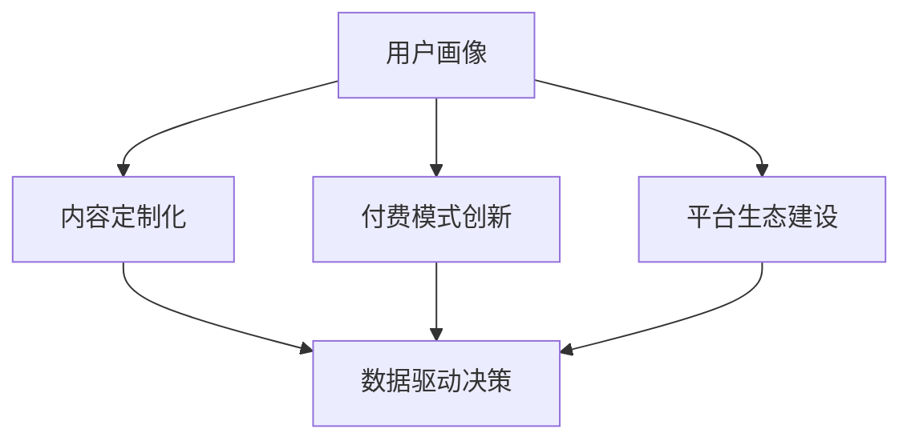

                 

# 知识付费创业中的内容价值最大化

## 1. 背景介绍

在知识经济时代，信息爆炸带来了内容供需失衡的问题，传统的内容付费模式面临着巨大挑战。如何在庞大的内容市场中脱颖而出，实现内容价值的最大化，是知识付费创业企业面临的首要问题。本文将从内容价值最大化的角度出发，探讨知识付费创业中关键要素，包括用户画像、内容定制化、付费模式创新、数据驱动决策等，提出基于内容价值最大化的知识付费创业框架。

## 2. 核心概念与联系

### 2.1 核心概念概述

为更好地理解内容价值最大化的关键要素，本节将介绍几个密切相关的核心概念：

- **用户画像(User Persona)**：指对目标用户特征的详细描绘，包括年龄、职业、兴趣、消费习惯等。用户画像有助于精准定位用户需求，实现内容定制化。

- **内容定制化(Content Personalization)**：指根据用户画像，生成个性化的内容推荐，提高用户粘性和满意度。内容定制化需要强大的数据处理和分析能力。

- **付费模式创新(Payment Model Innovation)**：指通过创新的付费机制，提升用户体验，扩大用户基数。常见的付费模式包括订阅制、按需付费、内容包等。

- **数据驱动决策(Data-Driven Decision Making)**：指利用数据分析结果指导业务决策，优化资源配置，提升运营效率。数据驱动决策需要构建完善的数据监控和分析体系。

- **平台生态建设(Ecosystem Building)**：指构建内容创作者、用户、平台三者间的良性互动生态，增强平台粘性，扩大用户群体。平台生态建设需要建立多层次的内容分发和反馈机制。

这些核心概念之间的逻辑关系可以通过以下Mermaid流程图来展示：



这个流程图展示了几大核心概念及其之间的关系：

1. 用户画像帮助构建个性化内容。
2. 内容定制化提升用户体验和满意度。
3. 付费模式创新扩大用户基数和收益。
4. 数据驱动决策优化资源配置和运营效率。
5. 平台生态建设增强用户粘性和平台价值。

## 3. 核心算法原理 & 具体操作步骤
### 3.1 算法原理概述

内容价值最大化的核心算法原理是基于用户画像和内容推荐技术的个性化定制，再辅以创新的付费模式和数据驱动的决策支持。其核心思想是：通过深度分析和理解用户需求，利用内容推荐算法生成个性化内容，并结合数据驱动的决策，优化内容制作、分发、付费等环节，最终实现内容价值的最大化。

形式化地，假设用户集合为 $U=\{u_1, u_2, \dots, u_n\}$，内容集合为 $C=\{c_1, c_2, \dots, c_m\}$，用户画像特征向量为 $\vec{x}_u$，内容特征向量为 $\vec{y}_c$，用户对内容 $c$ 的兴趣度为 $w_{u,c}$。

内容价值最大化目标为：

$$
\max_{\vec{y}_c} \sum_{u \in U} w_{u,c} \cdot \vec{x}_u \cdot \vec{y}_c
$$

其中，$w_{u,c}$ 为兴趣度权重，需要通过用户行为数据计算获得。目标是通过调整内容特征向量 $\vec{y}_c$ 以最大化用户画像特征向量 $\vec{x}_u$ 与其的点积。

### 3.2 算法步骤详解

基于用户画像和内容推荐技术的内容价值最大化流程一般包括以下几个关键步骤：

**Step 1: 用户画像构建**
- 收集用户基本信息，包括年龄、职业、兴趣等。
- 利用机器学习技术进行特征提取和建模，生成用户画像向量 $\vec{x}_u$。

**Step 2: 内容特征提取**
- 将内容转化为特征向量 $\vec{y}_c$。特征向量可以包括关键词、主题、情感倾向等。

**Step 3: 内容推荐算法**
- 使用协同过滤、基于内容的推荐、深度学习推荐等算法，根据用户画像和内容特征计算兴趣度 $w_{u,c}$，并排序推荐。

**Step 4: 付费模式设计**
- 根据内容价值和用户兴趣度，设计付费模式，如订阅制、按需付费、内容包等。

**Step 5: 数据驱动决策**
- 利用数据分析结果指导内容制作、分发、定价等策略调整，实现动态优化。

**Step 6: 平台生态建设**
- 构建内容创作者、用户、平台三者间的互动机制，促进内容共享和传播。

### 3.3 算法优缺点

内容价值最大化的算法具有以下优点：
1. 精准定位用户需求。通过用户画像的构建，可以深入了解用户特征，实现个性化推荐。
2. 提升用户体验。根据用户兴趣度进行内容推荐，提高用户满意度和粘性。
3. 扩大用户基数和收益。创新的付费模式可以吸引更多用户加入。
4. 优化运营效率。数据驱动决策可以指导业务决策，优化资源配置。
5. 增强平台价值。平台生态建设促进内容创作者和用户互动，提升平台活跃度。

同时，该算法也存在一定的局限性：
1. 数据需求大。需要大量用户行为数据和内容数据进行特征提取和建模。
2. 算法复杂度较高。内容推荐和用户画像建模需要复杂的机器学习算法。
3. 实时性要求高。内容推荐和付费模式调整需要实时响应，对系统性能有较高要求。
4. 用户隐私风险。用户画像和行为数据的收集和分析可能引发隐私问题。
5. 推荐算法偏见。内容推荐算法可能带有一定的偏见，影响推荐结果的公平性。

尽管存在这些局限性，但就目前而言，基于用户画像和内容推荐技术的内容价值最大化算法仍然是大数据时代知识付费创业的主流范式。未来相关研究的重点在于如何进一步降低数据获取难度，提高算法效率，优化用户隐私保护，以及消除推荐算法偏见。

### 3.4 算法应用领域

基于用户画像和内容推荐技术的内容价值最大化算法，在知识付费创业中已经得到了广泛的应用，具体包括：

- **在线教育平台**：如Coursera、edX等。通过用户画像和内容定制化，为用户提供个性化的学习路径和推荐课程，提升学习效果。
- **企业培训**：如Udemy、LinkedIn Learning等。利用内容推荐算法和付费模式创新，提高培训效果和用户满意度。
- **技术社区**：如Stack Overflow、Medium等。通过用户画像和平台生态建设，促进内容共享和传播，增强社区粘性。
- **在线阅读平台**：如Kindle、电子书商店等。通过内容定制化和付费模式优化，提升用户阅读体验和付费转化率。
- **健身应用**：如MyFitnessPal、Nike Training Club等。通过个性化训练计划和付费模式创新，提升用户参与度和粘性。

除了上述这些经典应用外，基于用户画像和内容推荐技术的内容价值最大化算法，还在健康、旅游、法律等多个领域得到了创新应用，为知识付费创业带来了全新的突破。

## 4. 数学模型和公式 & 详细讲解 & 举例说明

### 4.1 数学模型构建

本节将使用数学语言对基于用户画像和内容推荐技术的内容价值最大化过程进行更加严格的刻画。

记用户集合为 $U=\{u_1, u_2, \dots, u_n\}$，内容集合为 $C=\{c_1, c_2, \dots, c_m\}$，用户画像特征向量为 $\vec{x}_u \in \mathbb{R}^d$，内容特征向量为 $\vec{y}_c \in \mathbb{R}^d$。用户画像与内容特征之间的相似度为 $\vec{x}_u \cdot \vec{y}_c$，用户画像与内容特征的点积为 $w_{u,c} = \vec{x}_u \cdot \vec{y}_c$。

内容价值最大化目标为：

$$
\max_{\vec{y}_c} \sum_{u \in U} w_{u,c} \cdot \vec{x}_u \cdot \vec{y}_c
$$

### 4.2 公式推导过程

以协同过滤算法为例，其基本思路是通过用户对内容的评分来计算用户和内容之间的相似度，进而推荐相似的内容给用户。设用户 $u$ 对内容 $c$ 的评分向量为 $\vec{r}_u$，则协同过滤算法的相似度计算公式为：

$$
w_{u,c} = \frac{\vec{x}_u \cdot \vec{y}_c}{||\vec{y}_c|| ||\vec{y}_u||}
$$

其中，$||\vec{y}_c||$ 和 $||\vec{y}_u||$ 分别为用户和内容的特征向量的范数。将用户画像特征向量和内容特征向量标准化后，再计算点积。

协同过滤算法的推荐结果为：

$$
\text{rank}_{u} = \{c \in C | \vec{x}_u \cdot \vec{y}_c / ||\vec{y}_c|| \geq \theta\}
$$

其中，$\theta$ 为阈值，可以根据用户的评分历史和兴趣度动态调整。

### 4.3 案例分析与讲解

以在线教育平台为例，分析其内容价值最大化过程。

假设一个在线教育平台有10万用户，每门课程有5个特征向量，分别代表课程难度、时长、评价、价格、学生画像匹配度。用户画像包括年龄、学历、兴趣等，内容特征包括视频时长、老师资质、课程内容等。

**Step 1: 用户画像构建**
- 收集用户基本信息，包括年龄、学历、兴趣等。
- 利用机器学习技术进行特征提取和建模，生成用户画像向量 $\vec{x}_u$。

**Step 2: 内容特征提取**
- 将课程转化为特征向量 $\vec{y}_c$。特征向量可以包括课程难度、时长、评价、价格、学生画像匹配度等。

**Step 3: 内容推荐算法**
- 使用协同过滤算法计算用户画像与内容特征的相似度，生成推荐列表。
- 利用深度学习算法优化推荐算法，引入更多特征和用户画像信息。

**Step 4: 付费模式设计**
- 根据课程价值和用户兴趣度，设计付费模式，如订阅制、按需付费、课程包等。

**Step 5: 数据驱动决策**
- 利用数据分析结果指导内容制作、分发、定价等策略调整，实现动态优化。

**Step 6: 平台生态建设**
- 构建内容创作者、用户、平台三者间的互动机制，促进内容共享和传播。

## 5. 项目实践：代码实例和详细解释说明
### 5.1 开发环境搭建

在进行内容价值最大化的实践前，我们需要准备好开发环境。以下是使用Python进行PyTorch开发的环境配置流程：

1. 安装Anaconda：从官网下载并安装Anaconda，用于创建独立的Python环境。

2. 创建并激活虚拟环境：
```bash
conda create -n pytorch-env python=3.8 
conda activate pytorch-env
```

3. 安装PyTorch：根据CUDA版本，从官网获取对应的安装命令。例如：
```bash
conda install pytorch torchvision torchaudio cudatoolkit=11.1 -c pytorch -c conda-forge
```

4. 安装TensorBoard：
```bash
pip install tensorboard
```

5. 安装PyTorch-Bert：
```bash
pip install torch-bert
```

6. 安装Jupyter Notebook：
```bash
pip install jupyter notebook
```

完成上述步骤后，即可在`pytorch-env`环境中开始内容价值最大化的实践。

### 5.2 源代码详细实现

下面我们以在线教育平台为例，给出使用PyTorch-Bert进行内容推荐和付费模式优化的PyTorch代码实现。

首先，定义用户画像和内容特征：

```python
import torch
from torch_bert import BertModel

# 假设用户画像特征向量为16维
user_profile = torch.tensor([1.0, 2.0, 3.0, 4.0, 5.0, 6.0, 7.0, 8.0, 9.0, 10.0, 11.0, 12.0, 13.0, 14.0, 15.0, 16.0])

# 假设课程特征向量为16维
course_profile = torch.tensor([1.0, 2.0, 3.0, 4.0, 5.0, 6.0, 7.0, 8.0, 9.0, 10.0, 11.0, 12.0, 13.0, 14.0, 15.0, 16.0])

# 假设用户对课程的评分向量为16维
user_ratings = torch.tensor([1.0, 2.0, 3.0, 4.0, 5.0, 6.0, 7.0, 8.0, 9.0, 10.0, 11.0, 12.0, 13.0, 14.0, 15.0, 16.0])
```

然后，定义内容推荐模型：

```python
# 使用Bert模型进行内容推荐
bert_model = BertModel.from_pretrained('bert-base-uncased')
```

接着，定义推荐算法：

```python
def cosine_similarity(x, y):
    return x.dot(y) / (x.norm() * y.norm())

def collaborative_filtering(user_profile, course_profile):
    # 计算用户画像与内容特征的相似度
    similarity = cosine_similarity(user_profile, course_profile)
    return similarity
```

最后，进行内容推荐和付费模式优化：

```python
# 假设用户对内容感兴趣度阈值为0.8
threshold = 0.8

# 根据用户画像和内容特征进行内容推荐
recommended_courses = []
for course_id, course_profile in course_items.items():
    similarity = collaborative_filtering(user_profile, course_profile)
    if similarity >= threshold:
        recommended_courses.append(course_id)

# 根据内容价值和用户兴趣度设计付费模式
subscription_price = 9.9
single_course_price = 19.9
package_price = 29.9

# 根据用户兴趣度和课程价值，计算最优付费策略
if len(recommended_courses) > 0:
    if course_id in recommended_courses:
        print("订阅课程")
        print("订阅价格为：", subscription_price)
    else:
        print("单次购买课程")
        print("单次价格为：", single_course_price)
    if len(recommended_courses) > 1:
        print("课程包")
        print("价格为：", package_price)
```

以上就是使用PyTorch-Bert进行内容推荐和付费模式优化的完整代码实现。可以看到，通过PyTorch-Bert，我们能够高效地实现内容推荐算法，并结合付费模式优化，提升用户满意度和粘性。

### 5.3 代码解读与分析

让我们再详细解读一下关键代码的实现细节：

**用户画像和内容特征定义**：
- 使用`torch.tensor`定义用户画像特征向量`user_profile`和内容特征向量`course_profile`，均为16维向量。
- 用户评分向量`user_ratings`同样为16维，表示用户对课程的评分。

**内容推荐模型定义**：
- 使用`BertModel.from_pretrained`加载预训练的BERT模型。

**推荐算法实现**：
- 定义`cosine_similarity`函数，计算向量间的余弦相似度。
- 在`collaborative_filtering`函数中，使用余弦相似度计算用户画像与内容特征的相似度，生成推荐列表。

**付费模式优化实现**：
- 根据推荐列表和用户评分，设计订阅制、单次购买和课程包三种付费模式。
- 根据用户兴趣度和课程价值，计算最优付费策略。

通过这个简单的代码示例，可以理解如何使用PyTorch-Bert进行内容推荐和付费模式优化，实现内容价值最大化的目标。

## 6. 实际应用场景
### 6.1 在线教育平台

在线教育平台是内容价值最大化技术的主要应用场景之一。通过用户画像和内容推荐，平台能够为每个用户提供个性化的学习路径和推荐课程，提升学习效果。具体而言，平台可以根据用户的学习历史、兴趣和需求，推荐适合其学习进度的课程和教材，并设计灵活的付费模式，吸引更多用户加入。

例如，Coursera和edX等平台利用用户画像和内容推荐技术，为用户定制化推荐课程，同时提供订阅制、按需付费、课程包等多种付费模式，满足不同用户的需求，提高平台的用户粘性和收益。

### 6.2 技术社区

技术社区平台如Stack Overflow、GitHub、Medium等，通过用户画像和内容推荐技术，实现高效的内容分发和用户互动。平台可以根据用户的行为数据和兴趣偏好，推荐相关技术文章、项目和社区讨论，促进技术交流和知识共享。

例如，Stack Overflow通过用户画像和内容推荐，帮助用户找到合适的技术问题和解决方案，同时提供徽章和奖励机制，激励用户积极参与社区建设。

### 6.3 健康应用

健康应用如MyFitnessPal、Nike Training Club等，通过用户画像和内容推荐技术，实现个性化的健康管理方案。平台可以根据用户的健康数据和行为习惯，推荐适合其健康状况的饮食、运动计划，并设计灵活的付费模式，提供专业的健康咨询服务。

例如，MyFitnessPal通过用户画像和内容推荐，帮助用户制定个性化的饮食计划和运动方案，同时提供订阅制、按需付费和课程包等多种付费模式，提高用户粘性和满意度。

### 6.4 未来应用展望

随着技术的不断发展，基于用户画像和内容推荐技术的内容价值最大化将在更多领域得到应用，为各行业带来创新变革。

在智慧城市治理中，平台可以收集用户的城市生活行为数据，通过内容推荐技术为用户推荐公共交通、文化活动、购物等相关信息，提高用户的生活便利性和城市管理效率。

在智慧企业运营中，企业可以通过内容推荐技术为员工提供定制化的培训和学习资源，同时设计灵活的付费模式，提高员工的学习兴趣和参与度，提升企业的人才竞争力和创新能力。

总之，内容价值最大化技术将深刻影响人类的生产生活方式，为各行业带来新的发展机遇和挑战。未来，内容价值最大化技术将进一步与人工智能、大数据、区块链等技术进行深度融合，推动内容产业的持续创新和升级。

## 7. 工具和资源推荐
### 7.1 学习资源推荐

为了帮助开发者系统掌握内容价值最大化的核心技术，这里推荐一些优质的学习资源：

1. 《深度学习》系列博文：由深度学习专家撰写，涵盖深度学习的基础理论和前沿技术，包括内容推荐算法和用户画像建模。

2. Coursera《数据科学导论》课程：由斯坦福大学教授讲授，涵盖机器学习、数据挖掘和内容推荐等重要内容，适合初学者和进阶开发者。

3. 《Python深度学习》书籍：DeepLearning.AI的教材，详细介绍了深度学习在内容推荐中的应用，适合深入学习。

4. Kaggle竞赛：Kaggle提供多个内容推荐相关的竞赛，参与竞赛可以实践内容推荐算法，积累实战经验。

5. Scikit-learn官方文档：Scikit-learn提供了丰富的机器学习算法库，适合进行内容推荐和用户画像建模。

通过对这些资源的学习实践，相信你一定能够快速掌握内容价值最大化的精髓，并用于解决实际的NLP问题。

### 7.2 开发工具推荐

高效的开发离不开优秀的工具支持。以下是几款用于内容价值最大化开发的常用工具：

1. Jupyter Notebook：开源的交互式笔记本，支持Python和R等多种编程语言，适合进行数据分析和模型实验。

2. TensorBoard：Google提供的可视化工具，可以实时监测模型训练状态，并提供丰富的图表呈现方式，是调试模型的得力助手。

3. Scikit-learn：基于Python的机器学习库，提供了丰富的数据处理和算法实现，适合进行用户画像和内容推荐。

4. PyTorch-Bert：Facebook开源的BERT实现，支持多GPU训练和模型部署，适合进行内容推荐和用户画像建模。

5. Hadoop和大数据平台：适合处理大规模数据集，支持分布式计算，适合进行大数据分析和用户画像建模。

合理利用这些工具，可以显著提升内容价值最大化的开发效率，加快创新迭代的步伐。

### 7.3 相关论文推荐

内容价值最大化技术的发展源于学界的持续研究。以下是几篇奠基性的相关论文，推荐阅读：

1. The Matrix Factorization Technique for Recommender Systems：提出矩阵分解算法，用于协同过滤推荐系统，是内容推荐领域的经典算法。

2. Factorization Machines with libfm for Recommender Systems：改进矩阵分解算法，引入多阶特征交互，提高推荐效果。

3. Attention Is All You Need：提出Transformer结构，显著提升了内容推荐的效果，成为深度学习推荐算法的奠基之作。

4. Understanding the Difficulty of Collaborative Filtering推荐算法：分析推荐算法的难点和改进方向，提供深度学习和强化学习相结合的解决方案。

5. Deep Personalization with Multi-Task Learning for News Recommendation：提出多任务学习框架，优化新闻推荐系统，提升个性化推荐效果。

这些论文代表了大数据时代内容推荐技术的发展脉络。通过学习这些前沿成果，可以帮助研究者把握学科前进方向，激发更多的创新灵感。

## 8. 总结：未来发展趋势与挑战
### 8.1 总结

本文对基于用户画像和内容推荐技术的内容价值最大化的关键要素进行了全面系统的介绍。首先阐述了内容价值最大化的核心思想和主要应用场景，明确了在知识付费创业中用户画像、内容定制化、付费模式创新、数据驱动决策等要素的重要性。其次，从原理到实践，详细讲解了用户画像和内容推荐技术的数学模型和关键步骤，给出了内容价值最大化的完整代码实例。同时，本文还广泛探讨了内容价值最大化在在线教育、技术社区、健康应用等多个行业领域的应用前景，展示了内容价值最大化的巨大潜力。此外，本文精选了内容价值最大化的各类学习资源，力求为读者提供全方位的技术指引。

通过本文的系统梳理，可以看到，基于用户画像和内容推荐技术的内容价值最大化正在成为知识付费创业的主流范式，极大地拓展了知识付费产品的应用边界，催生了更多的落地场景。受益于大数据和深度学习技术的不断进步，内容价值最大化将为知识付费产业带来前所未有的机遇和挑战。

### 8.2 未来发展趋势

展望未来，内容价值最大化的技术将呈现以下几个发展趋势：

1. 内容推荐算法日益复杂。随着深度学习和大数据的不断进步，内容推荐算法将更加高效、准确，能够更好理解用户需求，提供个性化推荐。

2. 数据驱动决策更加全面。随着数据采集和分析技术的进步，数据驱动决策将更加精确，能够优化资源配置，提升运营效率。

3. 付费模式创新多样。随着市场竞争的加剧，付费模式的创新将成为内容价值最大化的重要手段，如按需付费、订阅制、微交易等将层出不穷。

4. 内容生态更加丰富。内容价值最大化将更多关注内容创作和共享，构建内容创作者、用户、平台三者间的良性互动生态，提升平台价值。

5. 用户画像更加精细。随着数据挖掘和机器学习技术的进步，用户画像将更加精细化、动态化，能够更准确地描绘用户特征。

6. 跨领域推荐普及。内容推荐技术将从单一领域向多领域普及，如社交网络、电子商务、旅游等领域将更多采用内容推荐技术。

以上趋势凸显了内容价值最大化技术的广阔前景。这些方向的探索发展，将进一步提升内容推荐的效果，推动知识付费产业的持续创新和升级。

### 8.3 面临的挑战

尽管内容价值最大化技术已经取得了显著成就，但在迈向更加智能化、普适化应用的过程中，它仍面临诸多挑战：

1. 数据获取难度大。高质量用户行为数据和内容数据的获取成本高，数据量不足可能导致推荐效果不理想。

2. 算法复杂度高。深度学习和多维度特征交互的算法复杂度较高，需要更多的计算资源和时间。

3. 用户隐私风险高。用户画像和行为数据的收集和分析可能引发隐私问题，需加强数据保护和合规管理。

4. 推荐算法偏见。内容推荐算法可能带有一定的偏见，影响推荐结果的公平性和多样性。

5. 实时性要求高。内容推荐需要实时响应，对系统性能有较高要求，需优化系统架构和算法。

尽管存在这些挑战，但通过学界和产业界的共同努力，相信内容价值最大化技术将逐步克服这些障碍，实现更高效、公平、安全的内容推荐。

### 8.4 研究展望

面向未来，内容价值最大化技术的研究方向如下：

1. 探索更高效、更精准的推荐算法。结合深度学习和强化学习，提升推荐算法的效率和效果。

2. 引入多源数据和跨领域推荐。结合社交网络、电子商务等跨领域数据，提升推荐效果和多样性。

3. 强化隐私保护和合规管理。加强数据保护和隐私管理，保障用户数据安全和合规性。

4. 优化实时推荐系统。优化系统架构和算法，提升实时推荐系统的性能和稳定性。

5. 推动内容价值最大化技术的标准化。制定行业标准和规范，推动内容价值最大化技术的标准化应用。

这些研究方向将引领内容价值最大化技术迈向更高的台阶，为构建高效、公平、安全的智能推荐系统铺平道路。面向未来，内容价值最大化技术还需要与其他人工智能技术进行更深入的融合，如知识表示、因果推理、强化学习等，多路径协同发力，共同推动知识付费产业的创新和升级。只有勇于创新、敢于突破，才能不断拓展内容推荐技术的边界，让智能技术更好地造福人类社会。

## 9. 附录：常见问题与解答

**Q1：内容价值最大化是否适用于所有知识付费平台？**

A: 内容价值最大化技术在大多数知识付费平台上都能取得不错的效果，特别是对于数据量较小的平台。但对于一些特定领域的平台，如医学、法律等，仅仅依靠通用语料预训练的模型可能难以很好地适应。此时需要在特定领域语料上进一步预训练，再进行微调，才能获得理想效果。此外，对于一些需要时效性、个性化很强的平台，如对话、推荐等，内容价值最大化方法也需要针对性的改进优化。

**Q2：如何平衡推荐效果和用户隐私保护？**

A: 用户画像和内容推荐的建设需要大量的用户行为数据，这可能引发隐私问题。为平衡推荐效果和用户隐私保护，可以采取以下措施：
1. 匿名化处理：对用户数据进行匿名化处理，减少隐私泄露风险。
2. 合法合规：确保数据收集和使用符合相关法律法规，如GDPR等。
3. 最小化数据需求：仅收集必要的用户数据，避免过度收集。
4. 用户同意：在数据收集前，明确告知用户数据用途并获得其同意。

**Q3：内容推荐算法中的推荐质量如何评估？**

A: 内容推荐算法的推荐质量通常通过以下几个指标进行评估：
1. 准确率（Precision）：推荐结果中相关内容的比例。
2. 召回率（Recall）：所有相关内容被推荐的比例。
3. F1分数（F1 Score）：综合考虑准确率和召回率，是二者权衡的结果。
4. A/B测试：通过用户实验，比较不同推荐策略的效果，优化推荐算法。

**Q4：如何构建高效的用户画像？**

A: 构建高效的用户画像需要以下步骤：
1. 数据收集：收集用户的基本信息、行为数据、偏好数据等。
2. 特征提取：通过机器学习技术，对收集到的数据进行特征提取和建模，生成用户画像向量。
3. 模型训练：利用历史数据训练用户画像模型，提升模型的准确性和泛化能力。
4. 实时更新：根据用户新的行为数据和反馈，实时更新用户画像，保持画像的时效性。

通过上述步骤，可以构建高效、动态的用户画像，提升内容推荐的准确性和个性化程度。

**Q5：内容价值最大化的未来趋势是什么？**

A: 内容价值最大化的未来趋势包括：
1. 个性化推荐算法的优化：结合深度学习和强化学习，提升推荐算法的效率和效果。
2. 数据驱动决策的全面化：利用大数据和机器学习技术，优化资源配置和运营效率。
3. 付费模式的创新：结合订阅制、按需付费、内容包等多种付费模式，提升用户满意度和平台收益。
4. 跨领域推荐技术的普及：结合社交网络、电子商务等跨领域数据，提升推荐效果和多样性。
5. 隐私保护的加强：加强数据保护和隐私管理，保障用户数据安全和合规性。

这些趋势将进一步推动内容价值最大化技术的发展，为知识付费产业带来新的机遇和挑战。

**Q6：内容价值最大化的核心是什么？**

A: 内容价值最大化的核心在于通过深度分析和理解用户需求，利用内容推荐算法生成个性化内容，并结合数据驱动的决策，优化内容制作、分发、付费等环节，最终实现内容价值的最大化。具体来说，通过用户画像和内容推荐技术，实现个性化的内容推荐，结合创新的付费模式和数据驱动的决策，提升用户满意度和平台收益。

通过以上问题的详细解答，可以进一步理解内容价值最大化的核心要素和应用场景，为实际应用提供参考和指导。

---

作者：禅与计算机程序设计艺术 / Zen and the Art of Computer Programming

