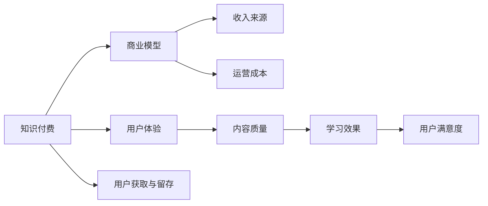

                 

# 知识付费创业中的常见误区

## 1. 背景介绍

随着互联网的快速发展，知识付费逐渐成为教育领域的一种新型商业模式。不同于传统的线下教育，知识付费主要通过线上平台，利用知识产品和服务实现教育价值交换，例如在线课程、电子书、视频讲座、专栏文章等。与传统教育相比，知识付费具有覆盖范围广、参与度高等优点，也受到越来越多用户和创业者的关注。

然而，知识付费市场也存在一些显著的误区，许多创业者在实际运营中没有充分了解和认识这些误区，导致商业模式不完善、用户体验不佳等问题。为了帮助创业者避免这些误区，本文将从多个方面，详细剖析知识付费创业中的常见问题。

## 2. 核心概念与联系

### 2.1 核心概念概述

为了更清晰地了解知识付费创业中的常见误区，我们首先介绍几个关键概念及其联系。

- **知识付费**：利用互联网平台为用户提供有价值的知识产品和服务，实现知识价值的商业化。
- **商业模型**：包括收入来源、利润分配、运营成本等方面，决定着知识付费企业的盈利模式和运营策略。
- **用户体验**：指用户在获取和使用知识产品和服务过程中的满意度，直接影响用户的粘性和转化率。
- **用户获取与留存**：衡量知识付费平台的流量和用户持续使用情况，决定着平台的生存和发展。
- **内容质量**：知识付费产品的核心，直接影响用户的学习效果和满意度。

这些概念紧密相关，共同构成了知识付费创业的框架。了解并处理好这些概念之间的关系，有助于构建更加健康、可持续的知识付费平台。

### 2.2 核心概念原理和架构的 Mermaid 流程图



这个流程图展示了知识付费创业中各个概念之间的逻辑关系。知识付费依赖于优秀的商业模型、良好的用户体验、稳定的用户获取和留存策略，而这一切都建立在高质量内容的基础之上。

## 3. 核心算法原理 & 具体操作步骤

### 3.1 算法原理概述

在知识付费创业中，算法和技术的运用十分重要，但并不涉及传统意义上的算法。相反，本文聚焦于商业和技术结合的逻辑原理，以及如何通过合理的商业模式和技术手段，提升知识付费平台的运营效果。

- **商业模式设计**：通过合理的收费策略、收益模式和成本控制，确保平台的盈利性。
- **用户分析**：利用大数据和机器学习技术，分析用户行为，优化产品推荐和个性化推荐，提升用户体验。
- **内容优化**：采用自然语言处理、图像识别等技术，提升内容质量，增强用户的学习效果。
- **用户获取与留存策略**：通过社交网络、SEO、广告投放等手段，吸引新用户，并提升现有用户粘性。

### 3.2 算法步骤详解

知识付费创业的核心算法步骤包括以下几个关键环节：

**Step 1: 市场调研与需求分析**
- 收集目标市场的用户需求数据。
- 分析用户的痛点和需求，识别潜在的用户群体。
- 调研现有竞争对手，了解他们的优劣势。

**Step 2: 商业模式设计**
- 确定核心产品与服务，包括课程、文章、视频等。
- 设计收费策略，如按需购买、订阅制、会员制等。
- 计算运营成本，包括技术开发、营销推广、客服支持等。

**Step 3: 用户画像构建**
- 利用大数据技术，收集和分析用户行为数据，构建用户画像。
- 根据用户画像，优化产品推荐策略，提升用户粘性。

**Step 4: 技术架构设计**
- 选择合适的技术栈，如Python、Node.js等。
- 设计高效的数据存储与处理架构，如云数据库、CDN等。
- 实现高效的内容推荐系统，利用协同过滤、内容标签等技术。

**Step 5: 内容质量提升**
- 采用自然语言处理技术，优化内容文本，提升可读性。
- 利用图像识别技术，优化课程视频，提升用户体验。
- 定期进行内容更新，保持内容的鲜活性和时效性。

**Step 6: 用户获取与留存**
- 通过社交网络、SEO、广告投放等手段，吸引新用户。
- 利用忠诚度计划、积分系统等手段，提升用户粘性。
- 建立良好的用户反馈机制，及时响应用户需求。

### 3.3 算法优缺点

知识付费创业中的算法和策略，具有以下优点：

- **提升用户体验**：通过个性化推荐、内容优化等技术，提升用户的学习效果和满意度。
- **优化运营效率**：利用大数据和机器学习技术，提升运营决策的科学性和精确性。
- **降低运营成本**：通过技术手段，如自动化内容生成、智能推荐等，降低人力和时间成本。

同时，这些算法和策略也存在一些局限性：

- **技术门槛较高**：需要一定的技术积累和研发投入，对创业者的技术能力要求较高。
- **数据隐私问题**：在收集和处理用户数据时，需要严格遵守数据隐私和保护法规。
- **内容质量难以保证**：尽管技术手段可以提升内容质量，但无法完全替代高质量原创内容的创作。

### 3.4 算法应用领域

知识付费创业中的算法和策略，主要应用于以下几个方面：

- **内容推荐**：利用协同过滤、内容标签等技术，提升内容推荐效果。
- **用户分析**：通过用户行为数据分析，优化用户画像，提升用户体验。
- **营销推广**：利用大数据技术，优化广告投放策略，提升用户获取效率。
- **运营决策**：利用机器学习技术，优化运营决策，提升运营效率和收益。

## 4. 数学模型和公式 & 详细讲解 & 举例说明

### 4.1 数学模型构建

知识付费创业中的算法模型构建，主要涉及以下几个方面的数学模型：

- **用户行为预测模型**：通过用户历史行为数据，预测其未来行为，如购买概率、流失概率等。
- **内容质量评估模型**：通过用户反馈数据，评估内容质量，如阅读时长、点击率等。
- **推荐系统模型**：通过用户画像和内容特征，构建推荐模型，优化推荐效果。

### 4.2 公式推导过程

以下是一些关键模型的公式推导过程：

**用户行为预测模型**
- 假设用户行为 $y$ 由用户特征 $x$ 和模型参数 $\theta$ 决定，公式为：
$$ y = f(x,\theta) $$
- 利用线性回归模型，将用户行为预测转化为回归问题：
$$ y = \theta_0 + \theta_1 x_1 + \theta_2 x_2 + ... + \theta_n x_n $$
- 通过训练集数据，最小化损失函数 $L(\theta)$，求解最优参数 $\hat{\theta}$：
$$ \hat{\theta} = \mathop{\arg\min}_{\theta} L(\theta) $$

**内容质量评估模型**
- 假设内容质量 $Q$ 由用户反馈数据 $f$ 和模型参数 $\phi$ 决定，公式为：
$$ Q = g(f,\phi) $$
- 利用softmax函数，将内容质量评估转化为多分类问题：
$$ \hat{Q} = \frac{e^{f\cdot\phi}}{\sum_j e^{f_j\cdot\phi}} $$
- 通过训练集数据，最小化损失函数 $L(\phi)$，求解最优参数 $\hat{\phi}$：
$$ \hat{\phi} = \mathop{\arg\min}_{\phi} L(\phi) $$

**推荐系统模型**
- 假设用户 $u$ 对内容 $i$ 的兴趣由用户画像 $P_u$ 和内容特征 $F_i$ 决定，公式为：
$$ r_{ui} = h(P_u, F_i, \gamma) $$
- 利用协同过滤算法，将推荐问题转化为协同矩阵 $R$ 的预测问题：
$$ R_{ui} = \hat{r}_{ui} = \alpha_u \alpha_i \beta_{ui} + \gamma_i $$
- 通过训练集数据，最小化损失函数 $L(R)$，求解最优参数 $\hat{\alpha}_u, \hat{\alpha}_i, \hat{\beta}_{ui}, \hat{\gamma}_i$：
$$ \hat{R}_{ui} = \mathop{\arg\min}_{\alpha_u, \alpha_i, \beta_{ui}, \gamma_i} L(R) $$

### 4.3 案例分析与讲解

**案例一：内容推荐系统**
- 某知识付费平台，利用协同过滤算法，构建推荐系统。
- 首先，收集用户历史行为数据 $X$，包括浏览记录、点击记录、购买记录等。
- 然后，将用户行为数据转化为向量表示 $x_u$，将内容特征数据转化为向量表示 $x_i$。
- 最后，构建推荐模型 $r_{ui} = \hat{r}_{ui} = \alpha_u \alpha_i \beta_{ui} + \gamma_i$，利用交叉验证等方法，不断优化模型参数，提升推荐效果。

**案例二：用户行为预测**
- 某在线教育平台，利用线性回归模型，预测用户是否会购买某门课程。
- 首先，收集用户历史行为数据 $X$，包括浏览记录、点击记录、购买记录等。
- 然后，将用户行为数据转化为向量表示 $x_u$，利用线性回归模型 $y = \hat{y} = \theta_0 + \theta_1 x_1 + \theta_2 x_2 + ... + \theta_n x_n$。
- 最后，利用训练集数据，最小化损失函数 $L(y)$，求解最优参数 $\hat{\theta}$，预测用户是否会购买某门课程。

**案例三：内容质量评估**
- 某视频平台，利用softmax函数，评估视频内容的质量。
- 首先，收集用户对视频的评分 $f$，包括评分 $f_1, f_2, ... , f_m$。
- 然后，利用softmax函数 $Q = \hat{Q} = \frac{e^{f\cdot\phi}}{\sum_j e^{f_j\cdot\phi}}$，评估内容质量。
- 最后，利用训练集数据，最小化损失函数 $L(Q)$，求解最优参数 $\hat{\phi}$，提升内容质量评估的准确性。

## 5. 项目实践：代码实例和详细解释说明

### 5.1 开发环境搭建

在进行知识付费创业的算法实践时，需要搭建一个稳定、高效的技术环境。以下是具体的开发环境搭建流程：

1. 安装Python：
   ```bash
   sudo apt-get update
   sudo apt-get install python3
   ```

2. 安装必要的包：
   ```bash
   pip install numpy pandas scikit-learn scikit-learn-machine-learning tensorflow keras pytorch torch torchvision transformers
   ```

3. 配置开发工具：
   ```bash
   jupyter notebook --notebook-dir=. --no-browser
   ```

### 5.2 源代码详细实现

下面以内容推荐系统为例，给出具体的代码实现：

```python
import pandas as pd
import numpy as np
from sklearn.linear_model import LogisticRegression
from sklearn.metrics import accuracy_score

# 加载用户行为数据
df = pd.read_csv('user_behavior.csv')

# 数据预处理
X = df.drop('purchase', axis=1)
y = df['purchase']

# 分割训练集和测试集
train_X = X.sample(frac=0.8, random_state=42)
train_y = y.sample(frac=0.8, random_state=42)
test_X = X.drop(train_X.index)
test_y = y.drop(train_y.index)

# 训练逻辑回归模型
clf = LogisticRegression()
clf.fit(train_X, train_y)

# 预测测试集
y_pred = clf.predict(test_X)

# 计算准确率
accuracy = accuracy_score(test_y, y_pred)
print('Accuracy:', accuracy)
```

### 5.3 代码解读与分析

以下是关键代码的详细解读：

**数据加载与预处理**
- `pd.read_csv`：使用Pandas库加载用户行为数据。
- `drop`：删除不需要的列。
- `sample`：随机分割数据集。

**模型训练**
- `LogisticRegression`：使用逻辑回归模型。
- `fit`：训练模型。

**预测与评估**
- `predict`：使用训练好的模型进行预测。
- `accuracy_score`：计算预测准确率。

## 6. 实际应用场景

### 6.1 智能推荐

智能推荐是知识付费创业中应用最为广泛的技术。通过分析用户历史行为数据，推荐系统可以精准预测用户感兴趣的内容，提升用户体验。

**案例一：电商推荐**
- 某电商平台，利用协同过滤算法，构建商品推荐系统。
- 首先，收集用户历史行为数据 $X$，包括浏览记录、点击记录、购买记录等。
- 然后，将用户行为数据转化为向量表示 $x_u$，利用协同过滤算法 $r_{ui} = \hat{r}_{ui} = \alpha_u \alpha_i \beta_{ui} + \gamma_i$。
- 最后，利用训练集数据，最小化损失函数 $L(R)$，求解最优参数 $\hat{\alpha}_u, \hat{\alpha}_i, \hat{\beta}_{ui}, \hat{\gamma}_i$，提升推荐效果。

**案例二：视频推荐**
- 某视频平台，利用协同过滤算法，构建视频推荐系统。
- 首先，收集用户历史行为数据 $X$，包括观看记录、点赞记录、评论记录等。
- 然后，将用户行为数据转化为向量表示 $x_u$，将视频特征数据转化为向量表示 $x_i$。
- 最后，构建推荐模型 $r_{ui} = \hat{r}_{ui} = \alpha_u \alpha_i \beta_{ui} + \gamma_i$，利用交叉验证等方法，不断优化模型参数，提升推荐效果。

### 6.2 用户行为预测

用户行为预测可以用于预判用户流失、提升用户粘性等。通过分析用户行为数据，可以预测用户是否会流失，及时采取措施，提升用户满意度。

**案例一：用户流失预测**
- 某在线教育平台，利用逻辑回归模型，预测用户是否会流失。
- 首先，收集用户历史行为数据 $X$，包括浏览记录、点击记录、购买记录等。
- 然后，将用户行为数据转化为向量表示 $x_u$，利用逻辑回归模型 $y = \hat{y} = \theta_0 + \theta_1 x_1 + \theta_2 x_2 + ... + \theta_n x_n$。
- 最后，利用训练集数据，最小化损失函数 $L(y)$，求解最优参数 $\hat{\theta}$，预测用户是否会流失。

**案例二：用户活跃度预测**
- 某社交平台，利用随机森林模型，预测用户活跃度。
- 首先，收集用户历史行为数据 $X$，包括点赞记录、评论记录、分享记录等。
- 然后，将用户行为数据转化为向量表示 $x_u$，利用随机森林模型 $y = \hat{y} = \alpha_u \alpha_i \beta_{ui} + \gamma_i$。
- 最后，利用训练集数据，最小化损失函数 $L(y)$，求解最优参数 $\hat{\alpha}_u, \hat{\alpha}_i, \hat{\beta}_{ui}, \hat{\gamma}_i$，提升用户活跃度预测的准确性。

### 6.3 内容质量评估

内容质量评估可以用于优化内容推荐、提升用户体验。通过分析用户反馈数据，可以评估内容质量，优化内容推荐策略。

**案例一：视频质量评估**
- 某视频平台，利用softmax函数，评估视频质量。
- 首先，收集用户对视频的评分 $f$，包括评分 $f_1, f_2, ... , f_m$。
- 然后，利用softmax函数 $Q = \hat{Q} = \frac{e^{f\cdot\phi}}{\sum_j e^{f_j\cdot\phi}}$，评估视频质量。
- 最后，利用训练集数据，最小化损失函数 $L(Q)$，求解最优参数 $\hat{\phi}$，提升内容质量评估的准确性。

**案例二：文章质量评估**
- 某新闻网站，利用支持向量机模型，评估文章质量。
- 首先，收集用户对文章的评分 $f$，包括评分 $f_1, f_2, ... , f_m$。
- 然后，将用户反馈数据转化为向量表示 $x_u$，利用支持向量机模型 $Q = \hat{Q} = \alpha_u \alpha_i \beta_{ui} + \gamma_i$。
- 最后，利用训练集数据，最小化损失函数 $L(Q)$，求解最优参数 $\hat{\alpha}_u, \hat{\alpha}_i, \hat{\beta}_{ui}, \hat{\gamma}_i$，提升文章质量评估的准确性。

### 6.4 未来应用展望

知识付费创业中的算法和技术，将在未来迎来更多创新和突破。以下是对未来应用前景的展望：

**智能客服**
- 利用自然语言处理技术，构建智能客服系统，提升用户互动体验。
- 通过用户行为数据和文本分析，快速响应用户需求，提供个性化服务。
- 集成多模态数据，提升客服系统的综合能力。

**个性化推荐**
- 利用深度学习技术，构建更精准的推荐系统。
- 通过用户画像和行为数据，实现内容推荐、商品推荐、视频推荐等多种形式。
- 引入用户反馈机制，动态优化推荐策略，提升用户体验。

**内容创作与审核**
- 利用生成对抗网络(GAN)技术，自动化内容生成。
- 通过自然语言处理技术，实现内容审核与优化。
- 引入专家知识库，提升内容质量与可信度。

## 7. 工具和资源推荐

### 7.1 学习资源推荐

为了帮助创业者深入了解知识付费创业中的算法和技术，以下是一些优质的学习资源：

1. Coursera《机器学习》课程：斯坦福大学开设的机器学习课程，涵盖各类机器学习算法和应用。
2. Kaggle机器学习竞赛：参加各类机器学习竞赛，提升实战能力。
3. 《Python数据科学手册》：全面介绍Python在数据科学中的应用，包括数据处理、模型构建、可视化等。
4. TensorFlow官方文档：TensorFlow的官方文档，提供详细的教程和示例。
5. PyTorch官方文档：PyTorch的官方文档，提供详细的教程和示例。

### 7.2 开发工具推荐

在进行知识付费创业的算法实践时，需要选择合适的开发工具。以下是一些推荐的开发工具：

1. Jupyter Notebook：常用的交互式编程工具，支持Python、R等多种编程语言。
2. Anaconda：Python的集成环境，提供丰富的科学计算和数据处理库。
3. Visual Studio Code：支持Python、JavaScript等多种编程语言，提供强大的代码编辑和调试功能。
4. Git：版本控制系统，支持团队协作开发。
5. Docker：容器化技术，提升代码部署和运行效率。

### 7.3 相关论文推荐

知识付费创业中的算法和技术，不断发展进步。以下是几篇奠基性的相关论文，推荐阅读：

1. "Collaborative Filtering for Implicit Feedback Datasets"：Gwo-Jen Wu等人，提出协同过滤算法，广泛应用于推荐系统。
2. "A Survey of Data Mining Techniques for Customer Churn Prediction"：Gururaj Bhaskaran等人，综述客户流失预测的研究进展。
3. "Deep Learning for Recommender Systems"：Zou et al.，综述深度学习在推荐系统中的应用。
4. "Semantic Accuracy of User Representations for Personalized Recommendation"：Joachim Miescke et al.，探讨用户表示在推荐系统中的应用。
5. "An Improved Approach to Modeling Customer-Content Interaction"：Tong et al.，提出改进的内容质量评估模型，提升推荐效果。

## 8. 总结：未来发展趋势与挑战

### 8.1 总结

知识付费创业中的算法和策略，对提升用户体验、优化运营效率具有重要意义。本文详细剖析了知识付费创业中的常见误区，提出了一套系统性的解决方案，帮助创业者规避这些误区，构建健康、可持续的知识付费平台。

通过本文的系统梳理，可以看到，知识付费创业中，算法和技术的应用是核心驱动力，能够显著提升平台的竞争力。然而，这些算法和技术的实现，也面临着数据隐私、技术门槛、内容质量等挑战。只有充分认识和应对这些挑战，才能真正实现知识付费的商业价值。

### 8.2 未来发展趋势

知识付费创业中的算法和技术，将在未来迎来更多创新和突破。以下是对未来发展趋势的展望：

**技术多样化**
- 未来的知识付费平台，将采用多种技术手段，提升用户体验和运营效率。
- 深度学习、自然语言处理、图像识别等技术将广泛应用，形成综合能力。

**数据驱动**
- 数据驱动的决策将成为主流，通过分析用户行为数据，实现个性化推荐、用户流失预测等。
- 数据安全和隐私保护将更加严格，要求平台具有更高的数据处理能力。

**内容智能化**
- 内容智能化将成为趋势，通过自动化生成、内容审核等技术，提升内容质量。
- 引入专家知识库，构建智能内容管理系统，优化内容创作和审核流程。

**服务泛化**
- 知识付费平台将走向泛化，涵盖更多领域和内容，提升用户粘性和平台影响力。
- 引入在线教育、在线咨询、社交网络等多种服务形式，形成综合生态系统。

**国际市场**
- 知识付费市场将走向国际化，平台需要适应不同国家和地区的文化和需求。
- 通过本地化优化，提升平台的国际竞争力和用户覆盖率。

**前沿技术**
- 前沿技术如生成对抗网络(GAN)、因果推断、强化学习等，将被引入知识付费平台，提升平台的技术水平和应用范围。

**用户体验**
- 用户体验将成为核心指标，平台将通过优化推荐系统、提升内容质量等方式，提升用户满意度。

### 8.3 面临的挑战

尽管知识付费创业中的算法和技术不断发展，但也面临着诸多挑战：

**数据隐私问题**
- 知识付费平台需要处理大量的用户数据，数据隐私和安全问题不容忽视。
- 平台需要遵循数据隐私保护法规，如GDPR、CCPA等，确保用户数据的合法使用。

**技术门槛高**
- 知识付费平台的算法和技术的实现，需要较高的技术积累和研发投入。
- 平台需要具备一定的技术实力和研发能力，才能实现高效、稳定的运营。

**内容质量难以保证**
- 虽然技术手段可以提升内容质量，但无法完全替代高质量原创内容的创作。
- 平台需要投入大量资源进行内容创作和优化，才能提供优质内容。

**用户体验瓶颈**
- 知识付费平台需要不断优化用户体验，提升用户粘性和转化率。
- 平台需要综合考虑推荐系统、内容质量、用户反馈等多方面因素，实现用户满意度的最大化。

**技术成本高**
- 知识付费平台的算法和技术的实现，需要较高的技术成本和研发投入。
- 平台需要平衡技术成本和商业价值，确保平台的盈利性。

### 8.4 研究展望

知识付费创业中的算法和技术，还有很大的发展空间。以下是对未来研究的展望：

**智能化推荐**
- 通过引入深度学习、自然语言处理等技术，构建更智能化的推荐系统。
- 利用用户画像和行为数据，实现个性化推荐、用户流失预测等，提升用户体验和运营效率。

**内容自动化**
- 利用生成对抗网络(GAN)技术，自动化内容生成和优化。
- 通过自然语言处理技术，实现内容审核与优化，提升内容质量与可信度。

**数据驱动**
- 通过数据驱动的决策，实现用户行为预测、内容质量评估等，提升平台的运营效果。
- 利用大数据和机器学习技术，优化算法模型，提升预测和评估的准确性。

**国际化**
- 通过本地化优化，适应不同国家和地区的文化和需求。
- 通过国际化的平台和服务，提升平台的全球影响力和用户覆盖率。

**前沿技术**
- 引入前沿技术如生成对抗网络(GAN)、因果推断、强化学习等，提升平台的技术水平和应用范围。
- 通过前沿技术的探索和应用，推动知识付费行业的创新和进步。

**用户体验**
- 通过优化推荐系统、提升内容质量等方式，提升用户满意度。
- 综合考虑用户反馈、推荐系统、内容质量等多方面因素，实现用户满意度的最大化。

## 9. 附录：常见问题与解答

**Q1：如何选择合适的推荐算法？**

A: 选择合适的推荐算法需要考虑数据类型、数据规模、推荐场景等因素。常用的推荐算法包括协同过滤、内容推荐、混合推荐等。协同过滤适用于数据稀疏的场景，内容推荐适用于数据稠密的场景，混合推荐则综合两种算法的优势，提升推荐效果。

**Q2：如何进行内容质量评估？**

A: 内容质量评估可以通过用户反馈数据和行为数据进行分析。常用的评估方法包括文本分析、情感分析、标签分析等。通过自然语言处理技术，可以自动化评估内容的质量，提升推荐系统的效果。

**Q3：如何提升用户粘性？**

A: 提升用户粘性可以通过个性化推荐、内容更新、用户互动等方式实现。个性化推荐可以根据用户行为数据，推荐用户感兴趣的内容。内容更新可以定期发布新内容，保持平台的活跃度。用户互动可以通过社交网络、在线交流等方式，提升用户粘性。

**Q4：如何进行用户行为预测？**

A: 用户行为预测可以通过逻辑回归、随机森林、支持向量机等算法实现。常用的预测指标包括用户流失概率、用户活跃度、用户购买概率等。通过分析用户行为数据，可以预测用户的行为，提升用户粘性和平台运营效果。

**Q5：如何进行用户画像构建？**

A: 用户画像构建可以通过大数据技术，分析用户行为数据，构建用户画像。常用的用户画像维度包括人口统计、行为特征、兴趣偏好等。通过用户画像分析，可以优化个性化推荐和用户互动，提升用户体验和运营效率。

以上是知识付费创业中的常见误区及其解决方案，希望能对创业者有所帮助。通过科学合理的应用算法和技术，知识付费平台将能够更好地满足用户需求，提升运营效果，实现商业价值。

