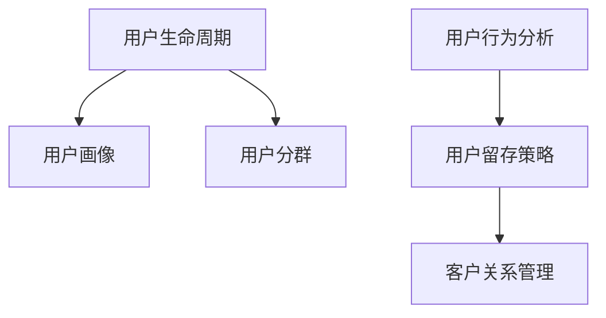

                 

# 知识付费创业中的用户生命周期管理

> 关键词：用户生命周期管理, 知识付费, 用户行为分析, 用户留存策略, 数据驱动决策, 个性化推荐, 用户细分, 客户关系管理(CRM)

## 1. 背景介绍

### 1.1 问题由来

在知识付费领域，随着内容和形式的多样化，以及用户需求的不断变化，如何有效管理用户生命周期，提升用户价值和满意度，已经成为知识付费创业公司关注的重点。用户生命周期管理（User Lifecycle Management, ULM）不仅关乎用户留存和转化，也直接影响企业盈利能力和竞争力。通过对用户生命周期的全过程管理，从潜在用户到活跃用户的转化、到流失用户的挽回，可以有效优化用户体验，最大化商业价值。

### 1.2 问题核心关键点

知识付费创业中的用户生命周期管理核心在于：

- **用户获取（Acquisition）**：通过市场推广和渠道拓展，吸引潜在用户关注和注册。
- **用户激活（Activation）**：通过优质的内容和服务，将注册用户转化为活跃用户。
- **用户留存（Retention）**：通过提高用户满意度和忠诚度，持续吸引用户回访和消费。
- **用户推荐（Referral）**：通过用户的口碑传播，获取更多新用户。
- **用户续订（Renewal）**：通过合适的续费策略，延长用户订阅周期，提升用户长期价值。
- **用户挽回（Retention）**：对流失用户进行精准定位和召回，重新吸引其回归。

这些关键点构成了用户生命周期的管理框架，其目的是最大化用户价值和提升商业绩效。

### 1.3 问题研究意义

研究知识付费创业中的用户生命周期管理，对于提升用户体验、优化运营效率、增加企业盈利具有重要意义：

1. **提升用户体验**：通过精准的用户画像和个性化推荐，提供符合用户需求的优质内容和服务，提升用户满意度和忠诚度。
2. **优化运营效率**：通过科学的营销策略和高效的资源配置，减少无效投入，提高运营效率。
3. **增加企业盈利**：通过有效的用户转化和续费策略，最大化用户生命周期价值（Customer Lifetime Value, CLV），增加企业收益。

## 2. 核心概念与联系

### 2.1 核心概念概述

为更好地理解知识付费创业中的用户生命周期管理，本节将介绍几个密切相关的核心概念：

- **用户生命周期（User Lifecycle）**：用户从潜在用户到流失用户全过程的阶段性状态。
- **用户画像（User Persona）**：基于用户行为和属性构建的详细用户特征描述，用于个性化推荐和服务。
- **用户分群（User Segmentation）**：根据用户行为和属性将用户分为不同的群体，便于定制化运营策略。
- **用户行为分析（User Behavior Analytics, UBA）**：通过分析用户行为数据，发现用户需求和行为规律，指导运营决策。
- **用户留存策略（User Retention Strategies）**：针对不同阶段的用户，设计相应的留存策略，提升用户续订率和满意度。
- **客户关系管理（Customer Relationship Management, CRM）**：管理客户信息，提升客户体验和满意度，增加客户忠诚度。

这些核心概念之间的逻辑关系可以通过以下Mermaid流程图来展示：



这个流程图展示了大语言模型的核心概念及其之间的关系：

1. 用户生命周期是用户从潜在用户到流失用户全过程的阶段性状态，是管理所有用户行为的宏观视角。
2. 用户画像和用户分群是基于用户行为和属性构建的特征描述和分组，用于个性化推荐和服务。
3. 用户行为分析是通过分析用户行为数据，发现用户需求和行为规律，指导运营决策。
4. 用户留存策略是根据不同阶段的用户，设计相应的留存策略，提升用户续订率和满意度。
5. 客户关系管理是管理客户信息，提升客户体验和满意度，增加客户忠诚度。

## 3. 核心算法原理 & 具体操作步骤
### 3.1 算法原理概述

知识付费创业中的用户生命周期管理，本质上是基于用户行为数据的分析，并根据分析结果设计相应的策略和行动，以提升用户留存和满意度。

形式化地，假设用户生命周期分为 $n$ 个阶段，每个阶段 $i$ 的用户比例为 $P_i$，用户的生命周期价值为 $V_i$，则总的用户生命周期价值（ULV）为：

$$
ULV = \sum_{i=1}^n P_i V_i
$$

用户生命周期管理的目标是通过优化用户行为和运营策略，最大化 ULV。

### 3.2 算法步骤详解

知识付费创业中的用户生命周期管理一般包括以下几个关键步骤：

**Step 1: 数据收集和预处理**
- 收集用户行为数据，包括注册时间、活跃时间、购买行为、付费时间等。
- 进行数据清洗和预处理，去除噪音数据，处理缺失值和异常值。

**Step 2: 用户行为分析**
- 通过统计分析、时间序列分析、关联规则挖掘等方法，发现用户行为规律和特征。
- 对用户行为进行可视化展示，如图表、仪表盘等，便于直观理解和分析。

**Step 3: 用户画像构建**
- 根据用户行为和属性，构建详细的用户画像，包含用户基本信息、行为特征、兴趣偏好等。
- 使用聚类、分类等机器学习算法，将用户分为不同的群体，便于定制化运营策略。

**Step 4: 用户留存策略设计**
- 根据用户生命周期阶段，设计相应的留存策略，如个性化推荐、奖励活动、积分体系等。
- 评估策略效果，通过A/B测试等方法，优化留存策略。

**Step 5: 客户关系管理**
- 使用CRM系统管理用户信息，建立用户档案和历史交易记录。
- 根据用户需求和行为，进行个性化服务和营销，提升用户满意度和忠诚度。

**Step 6: 反馈与迭代**
- 收集用户反馈，定期评估用户生命周期管理策略的效果。
- 根据评估结果，进行策略优化和迭代，不断提升用户价值。

以上是用户生命周期管理的一般流程。在实际应用中，还需要针对具体任务的特点，对每个环节进行优化设计，如改进数据收集方法，引入更多分析模型，搜索最优的策略组合等，以进一步提升策略效果。

### 3.3 算法优缺点

基于用户行为数据的用户生命周期管理方法具有以下优点：

1. 数据驱动决策：通过分析用户行为数据，可以科学地制定运营策略，减少主观偏差。
2. 精准用户画像：用户画像的构建，使个性化推荐和服务更加精准，提升用户体验。
3. 动态调整策略：根据用户行为的变化，及时调整运营策略，确保策略的有效性。

同时，该方法也存在一定的局限性：

1. 数据隐私问题：用户行为数据的收集和使用可能涉及隐私问题，需要严格遵守数据保护法规。
2. 数据质量要求高：用户行为数据的准确性和完整性直接影响分析结果，需要投入大量时间和资源进行数据质量管理。
3. 用户行为多样性：用户行为复杂多样，难以全面覆盖，需要不断优化分析模型。
4. 策略实施难度大：个性化推荐和留存策略的实施需要强大的技术支撑和资源配置。

尽管存在这些局限性，但就目前而言，基于用户行为数据的用户生命周期管理方法仍是在线业务的核心范式。未来相关研究的重点在于如何进一步提升数据质量，优化分析模型，降低策略实施难度，以实现更高效、更精准的用户管理。

### 3.4 算法应用领域

基于用户行为数据的用户生命周期管理方法在知识付费领域已经得到了广泛的应用，覆盖了几乎所有常见业务场景，例如：

- **新用户获取**：通过精准的营销推广和推荐系统，提升新用户注册率和激活率。
- **用户留存**：通过个性化的推荐和服务，提升用户活跃度和留存率。
- **用户续费**：通过续订提醒、积分激励等策略，增加用户续费率和长期价值。
- **用户挽回**：通过分析流失用户原因，制定针对性的召回策略，挽回流失用户。

除了上述这些经典场景外，用户生命周期管理还被创新性地应用到更多业务中，如个性化推荐、用户细分、行为预测等，为知识付费创业提供了新的业务增长点。

## 4. 数学模型和公式 & 详细讲解 & 举例说明

### 4.1 数学模型构建

本节将使用数学语言对知识付费创业中的用户生命周期管理过程进行更加严格的刻画。

假设用户生命周期分为 $n$ 个阶段，每个阶段 $i$ 的用户比例为 $P_i$，用户的生命周期价值为 $V_i$，则总的用户生命周期价值（ULV）为：

$$
ULV = \sum_{i=1}^n P_i V_i
$$

其中 $P_i$ 和 $V_i$ 可以通过用户行为数据分析得到。例如，可以通过统计分析发现，不同阶段的用户比例和生命周期价值分别为：

$$
P_1 = 0.2, P_2 = 0.3, P_3 = 0.25, P_4 = 0.2
$$
$$
V_1 = 10, V_2 = 15, V_3 = 20, V_4 = 5
$$

### 4.2 公式推导过程

根据上述假设，总的用户生命周期价值为：

$$
ULV = P_1 V_1 + P_2 V_2 + P_3 V_3 + P_4 V_4 = 2 + 4.5 + 5 + 1 = 12.5
$$

在实际应用中，用户生命周期价值 $V_i$ 通常是通过用户消费数据、用户活跃度等行为指标计算得到的。例如，可以通过历史消费数据和用户行为数据，建立预测模型，预测用户在不同阶段的消费水平，从而计算出 $V_i$。

### 4.3 案例分析与讲解

**案例：某知识付费平台用户生命周期管理**

某知识付费平台通过分析用户行为数据，发现用户生命周期分为以下几个阶段：

- **潜在用户**：注册但未活跃，比例为20%
- **活跃用户**：购买课程，比例为30%
- **忠实用户**：购买多门课程，比例为25%
- **流失用户**：一年内未购买课程，比例为25%

平台的生命周期价值分别为：

- **潜在用户**：5元/月
- **活跃用户**：20元/月
- **忠实用户**：50元/月
- **流失用户**：0元/月

根据上述数据，平台总的用户生命周期价值为：

$$
ULV = 0.2 \times 5 + 0.3 \times 20 + 0.25 \times 50 + 0.25 \times 0 = 4.5 + 6 + 12.5 + 0 = 23
$$

通过优化用户行为和运营策略，平台可以将ULV提升至23元/月，相比初始的5元/月，提升幅度显著。

## 5. 项目实践：代码实例和详细解释说明

### 5.1 开发环境搭建

在进行用户生命周期管理实践前，我们需要准备好开发环境。以下是使用Python进行Pandas和Scikit-learn开发的开发环境配置流程：

1. 安装Anaconda：从官网下载并安装Anaconda，用于创建独立的Python环境。

2. 创建并激活虚拟环境：
```bash
conda create -n userlifecycle-env python=3.8 
conda activate userlifecycle-env
```

3. 安装Pandas和Scikit-learn：
```bash
conda install pandas scikit-learn
```

4. 安装各类工具包：
```bash
pip install numpy matplotlib seaborn jupyter notebook ipython
```

完成上述步骤后，即可在`userlifecycle-env`环境中开始用户生命周期管理的实践。

### 5.2 源代码详细实现

下面我们以某知识付费平台用户生命周期管理为例，给出使用Pandas和Scikit-learn进行用户生命周期分析的Python代码实现。

首先，定义用户生命周期阶段和生命周期价值：

```python
import pandas as pd
from sklearn.cluster import KMeans

# 用户生命周期阶段
user_stages = ['潜在用户', '活跃用户', '忠实用户', '流失用户']

# 生命周期价值
lifetime_values = [5, 20, 50, 0]

# 创建用户数据框
data = pd.DataFrame({'stage': ['潜在用户', '活跃用户', '忠实用户', '流失用户'],
                    'proportion': [0.2, 0.3, 0.25, 0.25],
                    'value': [5, 20, 50, 0]})

# 计算总生命周期价值
total_value = sum(data['proportion'] * data['value'])
print(f"总用户生命周期价值: {total_value}")
```

然后，定义用户画像和分群：

```python
# 定义用户画像
user_profiles = {
    '潜在用户': {'age': [18, 25], 'interest': ['self-improvement', 'hobbies'], 'location': ['大都市', '郊区']},
    '活跃用户': {'age': [25, 35], 'interest': ['职场发展', '技术', '生活', '教育'], 'location': ['大都市', '郊区', '小城镇']},
    '忠实用户': {'age': [35, 45], 'interest': ['职场发展', '技术', '生活', '教育', '投资', '创业'], 'location': ['大都市', '郊区', '小城镇']},
    '流失用户': {'age': [45, 55], 'interest': ['生活', '教育', '投资', '创业', '健康', '旅游', '家庭']}
}

# 定义分群算法
kmeans = KMeans(n_clusters=2, random_state=0).fit(data[['proportion', 'value']])

# 分群结果
clusters = kmeans.labels_
labels = pd.Series(clusters, index=data.index).reset_index(drop=True)

# 展示分群结果
print(f"分群结果: {clusters}")
```

接着，定义用户行为分析和留存策略：

```python
# 用户行为分析
behavior_analysis = pd.crosstab(data['stage'], data['proportion'], margins=True)
print(behavior_analysis)

# 用户留存策略
def retention_strategy(stage, value):
    if stage == '潜在用户':
        return '发送邀请函', '提醒注册'
    elif stage == '活跃用户':
        return '个性化推荐', '积分奖励'
    elif stage == '忠实用户':
        return '专属课程', '会员优惠'
    else:
        return '召回活动', '重新推荐'

# 留存策略示例
strategies = [retention_strategy(stage, value) for stage, value in zip(data['stage'], data['value'])]
print(f"用户留存策略: {strategies}")
```

最后，启动用户生命周期管理流程：

```python
# 用户生命周期管理
def user_lifecycle_management(data, retention_strategies):
    for stage, strategy in zip(data['stage'], retention_strategies):
        print(f"阶段: {stage}, 策略: {strategy}")

# 执行用户生命周期管理
user_lifecycle_management(data, strategies)
```

以上就是使用Pandas和Scikit-learn对某知识付费平台用户生命周期管理进行分析和实践的完整代码实现。可以看到，得益于Pandas和Scikit-learn的强大封装，我们能够用相对简洁的代码完成用户生命周期管理的大部分任务。

### 5.3 代码解读与分析

让我们再详细解读一下关键代码的实现细节：

**用户生命周期管理**

1. **数据定义**：
    - `user_stages`和`lifetime_values`分别定义了用户生命周期阶段和生命周期价值。
    - `data`是包含用户行为数据的Pandas数据框，包括用户阶段、比例和价值。
    - `total_value`计算了总用户生命周期价值。

2. **用户画像**：
    - `user_profiles`定义了不同生命周期阶段的用户画像，包括年龄、兴趣、地理位置等信息。
    - `kmeans`使用KMeans算法对用户行为数据进行聚类分群，得到分群标签。
    - `clusters`和`labels`展示了分群结果。

3. **用户行为分析**：
    - `behavior_analysis`使用crosstab函数对用户行为数据进行交叉表分析，得到用户比例和价值的变化情况。

4. **用户留存策略**：
    - `retention_strategy`函数根据用户阶段和价值，设计相应的留存策略，返回具体的操作方式。
    - `strategies`展示了每个用户的行为分析结果和对应的留存策略。

5. **用户生命周期管理**：
    - `user_lifecycle_management`函数遍历用户数据和留存策略，输出每个用户的行为阶段和对应的留存策略。

这些代码展示了如何在知识付费平台中，通过用户行为数据分析和用户画像构建，设计科学的留存策略，以提升用户生命周期价值。

当然，工业级的系统实现还需考虑更多因素，如数据处理效率、策略效果评估、系统扩展性等。但核心的用户生命周期管理逻辑基本与此类似。

## 6. 实际应用场景
### 6.1 智能推荐系统

智能推荐系统是知识付费平台的核心功能之一。通过用户行为数据分析，推荐系统可以精准推荐符合用户兴趣的内容，提升用户活跃度和留存率。例如，某知识付费平台通过分析用户浏览和购买数据，发现用户对“职场发展”、“技术”等领域的课程更加感兴趣。平台基于这些信息，使用协同过滤、内容推荐等算法，生成个性化推荐列表，推送给用户，提升用户转化率和续费率。

### 6.2 用户细分和个性化服务

用户细分是知识付费平台优化运营策略的重要手段。通过用户行为分析和聚类算法，平台可以将用户分为不同的群体，针对每个群体设计相应的服务策略。例如，某平台使用KMeans算法将用户分为“学习者”、“专业人士”、“娱乐爱好者”等群体，针对每个群体设计不同的内容推荐、优惠活动、积分体系，提升用户满意度和忠诚度。

### 6.3 流失用户挽回

流失用户挽回是知识付费平台的重要挑战。通过分析用户流失原因，平台可以制定针对性的召回策略，重新吸引流失用户。例如，某平台通过分析流失用户的特征，发现大部分流失用户在订阅到期前未续订。平台基于这些信息，设计个性化的续订提醒和优惠活动，提升流失用户的续费率和长期价值。

### 6.4 未来应用展望

随着知识付费领域的不断发展和创新，用户生命周期管理方法也将不断演进。未来的研究将集中在以下几个方面：

1. **多模态数据融合**：通过融合用户行为数据、社交网络数据、地理位置数据等，构建更加全面的用户画像，提升个性化推荐效果。
2. **智能推荐系统**：引入强化学习、深度学习等技术，构建更加智能和精准的推荐系统，提升用户转化率和续费率。
3. **用户行为预测**：使用机器学习算法，预测用户未来行为，提前采取策略，提升用户留存率。
4. **动态调整策略**：根据用户行为变化，实时调整留存策略，保持策略的有效性。
5. **跨平台用户管理**：通过统一的用户管理系统，实现跨平台的用户数据整合和运营策略优化。

这些研究方向将推动知识付费平台向智能化、精准化和个性化方向发展，为平台带来更高效的用户管理和服务提升。

## 7. 工具和资源推荐
### 7.1 学习资源推荐

为了帮助开发者系统掌握用户生命周期管理的技术基础和实践技巧，这里推荐一些优质的学习资源：

1. **《数据科学与机器学习》**：清华大学出版社，适合初学者系统学习数据科学和机器学习的基础知识。
2. **《Python数据分析与可视化》**：人民邮电出版社，适合Python初学者学习数据分析和可视化技术。
3. **《机器学习实战》**：人民邮电出版社，适合机器学习爱好者学习常用的机器学习算法和模型。
4. **Kaggle平台**：全球最大的数据科学竞赛平台，提供丰富的数据集和算法竞赛，适合实战练习和经验积累。
5. **Coursera和edX平台**：提供各类数据科学和机器学习的在线课程，涵盖理论基础和实践技能。

通过对这些资源的学习实践，相信你一定能够快速掌握用户生命周期管理的精髓，并用于解决实际的NLP问题。

### 7.2 开发工具推荐

高效的开发离不开优秀的工具支持。以下是几款用于用户生命周期管理开发的常用工具：

1. **Pandas**：Python数据分析和数据处理库，适合处理和分析用户行为数据。
2. **Scikit-learn**：Python机器学习库，适合用户画像构建和用户分群等任务。
3. **TensorFlow和PyTorch**：深度学习框架，适合构建智能推荐系统和用户行为预测模型。
4. **KMeans和KNN**：聚类算法，适合用户行为分群和用户画像构建。
5. **Tableau和Power BI**：数据可视化工具，适合展示用户行为分析和分群结果。

合理利用这些工具，可以显著提升用户生命周期管理的开发效率，加快创新迭代的步伐。

### 7.3 相关论文推荐

用户生命周期管理的研究源于学界的持续研究。以下是几篇奠基性的相关论文，推荐阅读：

1. **《用户生命周期管理：理论、方法和实践》**：分析了用户生命周期管理的理论和实践方法，探讨了如何通过数据驱动优化运营策略。
2. **《个性化推荐系统：理论与算法》**：介绍了个性化推荐系统的理论基础和算法实现，涵盖了协同过滤、内容推荐、混合推荐等多种方法。
3. **《用户行为预测模型：理论与应用》**：介绍了用户行为预测模型的理论基础和应用场景，包括时间序列预测、决策树、神经网络等方法。
4. **《用户留存分析：理论与实践》**：分析了用户留存分析的理论基础和实践方法，探讨了如何通过数据驱动提升用户留存率。

这些论文代表了大语言模型微调技术的发展脉络。通过学习这些前沿成果，可以帮助研究者把握学科前进方向，激发更多的创新灵感。

## 8. 总结：未来发展趋势与挑战

### 8.1 总结

本文对知识付费创业中的用户生命周期管理进行了全面系统的介绍。首先阐述了用户生命周期管理的研究背景和意义，明确了用户生命周期管理在提升用户体验、优化运营效率、增加企业盈利方面的重要价值。其次，从原理到实践，详细讲解了用户生命周期管理的数学模型和操作步骤，给出了用户生命周期管理的完整代码实现。同时，本文还广泛探讨了用户生命周期管理在推荐系统、用户细分、流失用户挽回等实际应用场景中的应用前景，展示了用户生命周期管理的广阔潜力。此外，本文精选了用户生命周期管理的各类学习资源，力求为读者提供全方位的技术指引。

通过本文的系统梳理，可以看到，用户生命周期管理是知识付费创业的重要范式，通过优化用户行为和运营策略，可以有效提升用户体验和运营效率，增加企业盈利。未来，伴随用户行为数据的不断积累和分析技术的持续演进，用户生命周期管理必将进一步优化和提升，为知识付费平台的成功奠定坚实基础。

### 8.2 未来发展趋势

展望未来，知识付费平台的用户生命周期管理将呈现以下几个发展趋势：

1. **多模态数据融合**：通过融合用户行为数据、社交网络数据、地理位置数据等，构建更加全面的用户画像，提升个性化推荐效果。
2. **智能推荐系统**：引入深度学习、强化学习等技术，构建更加智能和精准的推荐系统，提升用户转化率和续费率。
3. **用户行为预测**：使用机器学习算法，预测用户未来行为，提前采取策略，提升用户留存率。
4. **动态调整策略**：根据用户行为变化，实时调整留存策略，保持策略的有效性。
5. **跨平台用户管理**：通过统一的用户管理系统，实现跨平台的用户数据整合和运营策略优化。

这些趋势将推动知识付费平台向智能化、精准化和个性化方向发展，为平台带来更高效的用户管理和服务提升。

### 8.3 面临的挑战

尽管知识付费平台的用户生命周期管理已经取得了不少成就，但在迈向更加智能化、普适化应用的过程中，它仍面临诸多挑战：

1. **数据隐私问题**：用户行为数据的收集和使用可能涉及隐私问题，需要严格遵守数据保护法规。
2. **数据质量要求高**：用户行为数据的准确性和完整性直接影响分析结果，需要投入大量时间和资源进行数据质量管理。
3. **用户行为多样性**：用户行为复杂多样，难以全面覆盖，需要不断优化分析模型。
4. **策略实施难度大**：个性化推荐和留存策略的实施需要强大的技术支撑和资源配置。
5. **用户细分和个性化难度大**：用户细分和个性化服务的实现需要高度复杂的技术支撑和精细的运营策略。
6. **跨平台用户管理难度大**：跨平台用户数据的整合和运营策略的协调需要高度协同的工作机制和技术支持。

尽管存在这些挑战，但用户生命周期管理仍然是知识付费平台的核心范式，未来相关研究需要在数据隐私、数据质量、技术实现等方面寻求新的突破。

### 8.4 研究展望

面对知识付费平台用户生命周期管理所面临的挑战，未来的研究需要在以下几个方面寻求新的突破：

1. **数据隐私保护**：开发更加安全、高效的数据隐私保护技术，保护用户隐私，增强用户信任。
2. **数据质量管理**：引入自动化的数据清洗和处理技术，提高数据质量，提升分析结果的准确性。
3. **多模态数据融合**：开发更加高效的多模态数据融合算法，构建更加全面和精准的用户画像。
4. **智能推荐系统**：引入深度学习、强化学习等技术，构建更加智能和精准的推荐系统。
5. **用户行为预测**：开发更加高效的用户行为预测模型，提升用户行为预测的准确性。
6. **动态调整策略**：开发更加智能和高效的动态调整策略，保持策略的有效性和灵活性。
7. **跨平台用户管理**：开发统一的用户管理系统和跨平台数据整合技术，提升跨平台运营效率。

这些研究方向将引领知识付费平台向智能化、精准化和个性化方向发展，为平台带来更高效的用户管理和服务提升。

## 9. 附录：常见问题与解答

**Q1：用户生命周期管理是否适用于所有知识付费平台？**

A: 用户生命周期管理在大多数知识付费平台中都能取得不错的效果，特别是对于数据量较小的平台。但对于一些特定领域的平台，如医学、法律等，仅仅依靠通用数据预训练的模型可能难以很好地适应。此时需要在特定领域数据上进一步预训练，再进行微调，才能获得理想效果。此外，对于一些需要时效性、个性化很强的平台，如对话、推荐等，用户生命周期管理方法也需要针对性的改进优化。

**Q2：采用用户生命周期管理时会面临哪些资源瓶颈？**

A: 用户生命周期管理需要收集大量用户行为数据，对算力、内存、存储都提出了很高的要求。GPU/TPU等高性能设备是必不可少的，但即便如此，超大批次的训练和推理也可能遇到显存不足的问题。因此需要采用一些资源优化技术，如梯度积累、混合精度训练、模型并行等，来突破硬件瓶颈。同时，模型的存储和读取也可能占用大量时间和空间，需要采用模型压缩、稀疏化存储等方法进行优化。

**Q3：如何缓解用户生命周期管理过程中的过拟合问题？**

A: 过拟合是用户生命周期管理面临的主要挑战，尤其是在标注数据不足的情况下。常见的缓解策略包括：
1. 数据增强：通过回译、近义替换等方式扩充训练集
2. 正则化：使用L2正则、Dropout、Early Stopping等避免过拟合
3. 对抗训练：引入对抗样本，提高模型鲁棒性
4. 参数高效微调：只调整少量参数(如Adapter、Prefix等)，减小过拟合风险
5. 多模型集成：训练多个微调模型，取平均输出，抑制过拟合

这些策略往往需要根据具体任务和数据特点进行灵活组合。只有在数据、模型、训练、推理等各环节进行全面优化，才能最大限度地发挥用户生命周期管理的威力。

**Q4：用户生命周期管理在落地部署时需要注意哪些问题？**

A: 将用户生命周期管理转化为实际应用，还需要考虑以下因素：
1. 模型裁剪：去除不必要的层和参数，减小模型尺寸，加快推理速度
2. 量化加速：将浮点模型转为定点模型，压缩存储空间，提高计算效率
3. 服务化封装：将模型封装为标准化服务接口，便于集成调用
4. 弹性伸缩：根据请求流量动态调整资源配置，平衡服务质量和成本
5. 监控告警：实时采集系统指标，设置异常告警阈值，确保服务稳定性
6. 安全防护：采用访问鉴权、数据脱敏等措施，保障数据和模型安全

用户生命周期管理将大模型的知识应用到实际业务中，需要全面考虑模型、数据、系统等多方面的因素，才能实现高效、可靠的服务。只有从数据、算法、工程、业务等多个维度协同发力，才能真正实现人工智能技术在垂直行业的规模化落地。总之，用户生命周期管理需要开发者根据具体任务，不断迭代和优化模型、数据和算法，方能得到理想的效果。

---

作者：禅与计算机程序设计艺术 / Zen and the Art of Computer Programming

