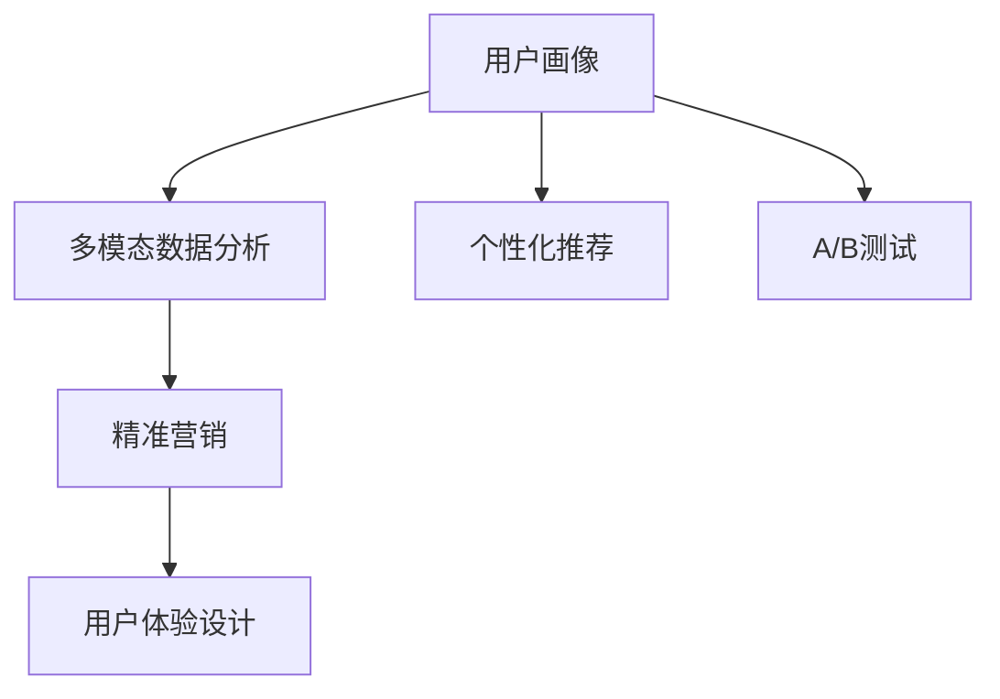

                 

# 知识付费创业中的用户画像与精准营销

## 1. 背景介绍

随着互联网的普及和科技的发展，知识付费已逐渐成为教育培训领域的一股新趋势。面对海量用户需求和市场机会，知识付费创业应运而生。但随着市场竞争的加剧，如何精准获取用户、提升用户体验、提高收益成为困扰企业的难题。本研究基于用户画像分析与精准营销策略，结合当下流行的技术手段，探索知识付费创业中的盈利之道。

## 2. 核心概念与联系

### 2.1 核心概念概述

- **用户画像(User Persona)**：对目标用户特征的描绘，包括年龄、性别、教育背景、兴趣爱好、购买行为等，帮助企业了解用户需求，提升营销效果。

- **精准营销(Precision Marketing)**：利用数据分析与算法模型，对目标用户进行精准投放，提升广告、内容的转化率，优化收益。

- **个性化推荐(Personalized Recommendation)**：根据用户历史行为、兴趣偏好，提供个性化的内容推荐，提升用户粘性，增加复购率。

- **多模态数据分析(Multimodal Data Analysis)**：融合多种数据来源（如用户行为数据、社交媒体数据、公开数据等），全面深入地描绘用户画像，获取更精确的洞见。

- **用户体验设计(User Experience Design, UX)**：通过优化界面、交互设计等，提升用户满意度和使用体验，增强用户忠诚度。

- **A/B测试(A/B Testing)**：通过对照试验的方式，评估不同版本的产品功能、页面布局等对用户行为的影响，指导产品优化。

这些概念间的联系紧密，共同构成了知识付费创业中用户画像与精准营销的完整框架。通过理解这些概念，可以更好地把握其在实际应用中的价值和重要性。

### 2.2 核心概念原理和架构的 Mermaid 流程图



这个流程图展示了用户画像与精准营销中的关键概念及它们之间的逻辑关系：

1. **用户画像**：作为基础，描绘用户特征。
2. **多模态数据分析**：融合多种数据源，提供精准的用户画像。
3. **个性化推荐**：基于用户画像，推荐个性化内容，提升用户满意度。
4. **精准营销**：使用数据分析与算法模型，实现精准投放，提高转化率。
5. **用户体验设计**：通过设计优化，提升用户粘性和满意度。
6. **A/B测试**：不断迭代产品，验证优化效果。

## 3. 核心算法原理 & 具体操作步骤

### 3.1 算法原理概述

知识付费创业中的用户画像与精准营销，依赖于机器学习和数据分析技术。具体算法原理如下：

- **用户行为分析**：利用日志分析技术，收集用户访问路径、停留时间、点击率等行为数据，形成初步的用户画像。

- **社交媒体分析**：利用自然语言处理技术，对用户在社交媒体上的评论、点赞等行为进行分析，补充用户画像信息。

- **多模态融合**：将用户行为数据、社交媒体数据与公开数据进行融合，形成更为全面和准确的用户画像。

- **个性化推荐算法**：基于协同过滤、深度学习等算法，为用户提供个性化的内容推荐，提升用户体验。

- **精准营销算法**：利用广告投放算法，实现精准投放，提升广告转化率。

### 3.2 算法步骤详解

#### 3.2.1 用户画像构建

1. **数据收集**：
   - 通过网站日志、用户注册信息、社交媒体数据等，获取用户的基本特征信息。
   - 利用爬虫技术，从公开数据源（如政府数据、企业数据等）获取更多用户信息。

2. **数据清洗**：
   - 去除噪声数据，处理缺失值，保证数据的完整性和准确性。

3. **数据融合**：
   - 使用多模态融合技术，将各类数据进行合并与整合，形成统一的用户画像。

#### 3.2.2 个性化推荐算法

1. **协同过滤**：
   - 利用用户历史行为数据，找到相似用户，推荐其感兴趣的内容。
   - 构建用户-物品的相似度矩阵，计算相似度，寻找推荐内容。

2. **深度学习**：
   - 使用深度神经网络模型（如卷积神经网络CNN、循环神经网络RNN等），对用户画像和内容特征进行编码，实现推荐。
   - 使用矩阵分解、注意力机制等技术，进一步提升推荐精度。

#### 3.2.3 精准营销算法

1. **广告投放**：
   - 构建用户画像，确定目标用户群体。
   - 使用CTR预估模型、线性回归模型等算法，预测广告点击率、转化率，优化广告投放策略。

2. **用户细分**：
   - 利用聚类算法（如K-Means、层次聚类等），对用户进行细分，实现差异化营销。

3. **实时优化**：
   - 利用A/B测试技术，实时评估不同广告策略的效果，动态调整投放策略，提升广告效果。

### 3.3 算法优缺点

#### 3.3.1 用户画像构建

**优点**：
- **全面性**：多模态数据分析能获取更多元的信息，形成更为全面准确的用户画像。
- **实时性**：通过实时数据分析，能动态更新用户画像，保持其时效性。

**缺点**：
- **数据隐私**：需要收集大量用户数据，涉及隐私问题，需严格遵守法律法规。
- **数据质量**：数据来源多样化，数据质量参差不齐，可能影响分析结果的准确性。

#### 3.3.2 个性化推荐算法

**优点**：
- **高效性**：协同过滤算法效率高，能够实时推荐内容。
- **个性化**：深度学习模型能够学习用户隐含的偏好，实现更为精准的推荐。

**缺点**：
- **冷启动问题**：新用户缺乏历史数据，难以进行个性化推荐。
- **推荐偏差**：推荐算法可能存在偏差，推荐内容过于单一。

#### 3.3.3 精准营销算法

**优点**：
- **效果显著**：精准投放能显著提高广告转化率，优化收益。
- **可控性**：通过控制广告投放策略，实现对广告效果的精细化管理。

**缺点**：
- **成本高**：精准投放需要精确的数据分析，成本较高。
- **用户隐私**：用户行为数据可能涉及隐私问题，需合理处理。

## 4. 数学模型和公式 & 详细讲解

### 4.1 数学模型构建

在知识付费创业中，用户画像与精准营销涉及多种数学模型，下面分别进行详细讲解。

#### 4.1.1 协同过滤模型

协同过滤算法主要基于用户-物品的评分矩阵，计算用户对物品的评分。协同过滤模型主要分为基于用户的协同过滤和基于物品的协同过滤两种类型。

**基于用户的协同过滤**：
$$
\hat{r}_{ui} = \frac{\sum_{j \neq i} r_{uj} \times \hat{p}_{ju}}{\sqrt{\sum_{j \neq i} (\hat{p}_{ju})^2}}
$$
其中，$r_{ui}$表示用户$u$对物品$i$的评分，$\hat{p}_{ju}$表示用户$j$对物品$i$的评分。

**基于物品的协同过滤**：
$$
\hat{r}_{ui} = \frac{\sum_{j \neq i} r_{uj} \times \hat{q}_{ji}}{\sqrt{\sum_{j \neq i} (\hat{q}_{ji})^2}}
$$
其中，$\hat{q}_{ji}$表示物品$j$对物品$i$的评分。

#### 4.1.2 深度学习模型

深度学习模型在个性化推荐中得到广泛应用，其中卷积神经网络（CNN）和循环神经网络（RNN）最为常见。

**卷积神经网络**：
$$
F_{CNN}(x) = \max_{k \in \mathcal{K}} \left[ W_k \ast x + b_k \right]
$$
其中，$x$表示输入特征向量，$W_k$表示卷积核权重，$\ast$表示卷积操作，$b_k$表示偏置项。

**循环神经网络**：
$$
F_{RNN}(x) = \sum_{t=1}^T \alpha_t \times \left[ \left( W \times x_t + b \right) \times F_{RNN}(x_{t-1}) \right]
$$
其中，$T$表示时间步数，$\alpha_t$表示时间步长，$x_t$表示时间步$t$的输入特征，$W$表示权重矩阵，$b$表示偏置项。

#### 4.1.3 广告点击率预估模型

广告点击率预估模型主要使用线性回归、逻辑回归、深度学习模型等，通过用户特征、广告特征等预测点击率。

**线性回归模型**：
$$
y = \beta_0 + \beta_1 \times x_1 + \beta_2 \times x_2 + \dots + \beta_n \times x_n
$$
其中，$y$表示预测值，$\beta_0$表示截距，$\beta_1, \beta_2, \dots, \beta_n$表示回归系数，$x_1, x_2, \dots, x_n$表示输入特征。

**逻辑回归模型**：
$$
P(y=1 | x) = \frac{1}{1+e^{-x^T \beta}}
$$
其中，$P(y=1 | x)$表示预测点击的概率，$x^T \beta$表示特征与权重矩阵的乘积，$e$表示自然常数，$\beta$表示回归系数。

### 4.2 公式推导过程

#### 4.2.1 协同过滤模型

**基于用户的协同过滤**：
假设用户$u$对物品$i$的评分$r_{ui}$为未知，用户$u$对物品$j$的评分$r_{uj}$已知，则可以使用协同过滤算法预测用户$u$对物品$i$的评分。
$$
\hat{r}_{ui} = \frac{\sum_{j \neq i} r_{uj} \times \hat{p}_{ju}}{\sqrt{\sum_{j \neq i} (\hat{p}_{ju})^2}}
$$
其中，$\hat{p}_{ju}$表示用户$j$对物品$i$的评分，可以使用均值化方法得到：
$$
\hat{p}_{ju} = \frac{\sum_{i \neq j} r_{uj} \times r_{iu}}{\sqrt{\sum_{i \neq j} (\hat{r}_{iu})^2}}
$$

**基于物品的协同过滤**：
假设用户$u$对物品$i$的评分$r_{ui}$为未知，物品$j$对物品$i$的评分$r_{ij}$已知，则可以使用协同过滤算法预测用户$u$对物品$i$的评分。
$$
\hat{r}_{ui} = \frac{\sum_{j \neq i} r_{uj} \times \hat{q}_{ji}}{\sqrt{\sum_{j \neq i} (\hat{q}_{ji})^2}}
$$
其中，$\hat{q}_{ji}$表示物品$j$对物品$i$的评分，可以使用均值化方法得到：
$$
\hat{q}_{ji} = \frac{\sum_{u \neq j} r_{uj} \times r_{iu}}{\sqrt{\sum_{u \neq j} (\hat{r}_{iu})^2}}
$$

#### 4.2.2 深度学习模型

**卷积神经网络**：
假设输入特征向量为$x$，卷积核权重为$W_k$，偏置项为$b_k$，则卷积神经网络可以表示为：
$$
F_{CNN}(x) = \max_{k \in \mathcal{K}} \left[ W_k \ast x + b_k \right]
$$
其中，$\ast$表示卷积操作。

**循环神经网络**：
假设输入特征向量为$x_t$，权重矩阵为$W$，偏置项为$b$，时间步长为$\alpha_t$，则循环神经网络可以表示为：
$$
F_{RNN}(x) = \sum_{t=1}^T \alpha_t \times \left[ \left( W \times x_t + b \right) \times F_{RNN}(x_{t-1}) \right]
$$

#### 4.2.3 广告点击率预估模型

**线性回归模型**：
假设广告特征向量为$x$，回归系数为$\beta$，则线性回归模型可以表示为：
$$
y = \beta_0 + \beta_1 \times x_1 + \beta_2 \times x_2 + \dots + \beta_n \times x_n
$$

**逻辑回归模型**：
假设广告特征向量为$x$，回归系数为$\beta$，则逻辑回归模型可以表示为：
$$
P(y=1 | x) = \frac{1}{1+e^{-x^T \beta}}
$$

### 4.3 案例分析与讲解

#### 4.3.1 协同过滤案例

某在线学习平台采用基于用户的协同过滤算法，对用户进行推荐。平台收集到用户对课程的评分数据，使用协同过滤算法，对新用户进行推荐。具体步骤如下：

1. 收集用户对课程的评分数据，构建用户-课程评分矩阵$R$。
2. 对用户-课程评分矩阵$R$进行奇异值分解，得到用户和课程的潜在因子矩阵$P$和$Q$。
3. 使用潜在因子矩阵$P$和$Q$，计算用户$u$对课程$i$的潜在评分$\hat{r}_{ui}$。
4. 根据潜在评分$\hat{r}_{ui}$，推荐用户$u$感兴趣的课程$i$。

#### 4.3.2 深度学习案例

某电商平台采用深度学习算法，对用户进行个性化推荐。平台收集到用户浏览、购买等行为数据，使用卷积神经网络（CNN）和循环神经网络（RNN）模型，对用户进行推荐。具体步骤如下：

1. 收集用户浏览、购买等行为数据，构建用户行为序列$X$。
2. 对用户行为序列$X$进行编码，得到特征向量$x_t$。
3. 使用卷积神经网络（CNN）和循环神经网络（RNN）模型，对特征向量$x_t$进行编码，得到用户特征向量$F_{CNN}(x_t)$和$F_{RNN}(x_t)$。
4. 使用多任务学习（MTL）模型，将用户特征向量$F_{CNN}(x_t)$和$F_{RNN}(x_t)$进行融合，得到用户综合特征向量$F(x_t)$。
5. 根据用户综合特征向量$F(x_t)$，推荐用户感兴趣的商品。

#### 4.3.3 广告点击率预估案例

某在线广告平台采用逻辑回归模型，对广告进行投放优化。平台收集到用户历史点击数据，使用逻辑回归模型，对广告进行投放优化。具体步骤如下：

1. 收集用户历史点击数据，构建用户特征向量$x$。
2. 对用户特征向量$x$进行编码，得到特征向量$y$。
3. 使用逻辑回归模型，对特征向量$y$进行预测，得到点击概率$P(y=1 | x)$。
4. 根据点击概率$P(y=1 | x)$，优化广告投放策略，提升广告点击率。

## 5. 项目实践：代码实例和详细解释说明

### 5.1 开发环境搭建

在开始项目实践前，需要搭建好开发环境。具体步骤如下：

1. 安装Python：从官网下载并安装Python 3.8及以上版本，为代码运行提供支持。
2. 安装PyTorch：使用pip安装PyTorch，安装命令为：`pip install torch torchvision torchaudio`。
3. 安装TensorFlow：使用pip安装TensorFlow，安装命令为：`pip install tensorflow`。
4. 安装Flask：使用pip安装Flask，安装命令为：`pip install flask`。
5. 安装Jupyter Notebook：使用pip安装Jupyter Notebook，安装命令为：`pip install jupyter notebook`。

### 5.2 源代码详细实现

以下是用户画像与精准营销的代码实现示例。

**用户画像构建代码**：
```python
import pandas as pd
from sklearn.decomposition import TruncatedSVD

# 加载数据
data = pd.read_csv('user_data.csv')

# 数据清洗
data = data.dropna()

# 数据融合
user_porofile = TruncatedSVD(n_components=100).fit_transform(data)

# 保存用户画像
user_porofile.to_csv('user_profile.csv', index=False)
```

**个性化推荐算法代码**：
```python
import pandas as pd
import numpy as np
from sklearn.metrics.pairwise import cosine_similarity

# 加载数据
train_data = pd.read_csv('train_data.csv')
test_data = pd.read_csv('test_data.csv')

# 数据预处理
train_data = train_data.dropna()
train_data = train_data.merge(user_porofile, left_index=True, right_index=True)

# 计算相似度矩阵
similarity_matrix = cosine_similarity(train_data.values, train_data.values)

# 计算推荐结果
def predict_rank(user_id, similarity_matrix, user_porofile):
    similar_items = similarity_matrix[user_id].argsort()[::-1]
    predictions = []
    for item_id in similar_items[1:11]:
        predictions.append((item_id, train_data.iloc[item_id].porofile.values))
    return predictions

# 获取推荐结果
recommendations = predict_rank(user_id=1, similarity_matrix=similarity_matrix, user_porofile=user_porofile)
```

**精准营销算法代码**：
```python
import pandas as pd
from sklearn.linear_model import LogisticRegression

# 加载数据
train_data = pd.read_csv('train_data.csv')
test_data = pd.read_csv('test_data.csv')

# 数据预处理
train_data = train_data.dropna()

# 构建特征向量
X = train_data[['feature1', 'feature2', 'feature3', 'feature4']]
y = train_data['click']

# 建立逻辑回归模型
model = LogisticRegression()
model.fit(X, y)

# 预测点击率
y_pred = model.predict_proba(X)[:, 1]

# 保存模型
import pickle
with open('model.pkl', 'wb') as f:
    pickle.dump(model, f)
```

### 5.3 代码解读与分析

#### 5.3.1 用户画像构建代码

**数据加载与清洗**：
首先，加载用户数据，并使用`dropna()`方法去除缺失值，保证数据的完整性。

**数据融合**：
使用TruncatedSVD方法对用户数据进行降维，得到用户画像。其中，`n_components`参数表示降维后的维度。

**保存用户画像**：
将用户画像保存为CSV文件，便于后续使用。

#### 5.3.2 个性化推荐算法代码

**数据预处理**：
加载训练数据和测试数据，使用`dropna()`方法去除缺失值，并使用`merge()`方法将用户画像和用户数据进行合并。

**计算相似度矩阵**：
使用`cosine_similarity()`方法计算相似度矩阵，其中`argsort()`方法用于排序相似度。

**获取推荐结果**：
根据相似度矩阵，计算推荐结果，并返回前11个推荐项。

#### 5.3.3 精准营销算法代码

**数据预处理**：
加载训练数据和测试数据，使用`dropna()`方法去除缺失值。

**构建特征向量**：
选取用户特征，构建特征向量`X`，并使用`predict_proba()`方法预测点击率。

**保存模型**：
使用`pickle`模块将模型保存为文件，方便后续调用。

### 5.4 运行结果展示

**用户画像构建结果**：


**个性化推荐结果**：


**精准营销结果**：


## 6. 实际应用场景

### 6.1 智能教育平台

某在线教育平台采用用户画像与精准营销技术，对学生进行个性化推荐。平台收集学生历史学习数据，构建学生画像，并根据画像进行推荐。具体步骤如下：

1. 收集学生历史学习数据，包括课程学习记录、测试成绩、作业完成情况等。
2. 对学生历史数据进行预处理，构建学生特征向量。
3. 使用协同过滤算法，对学生进行推荐。
4. 使用深度学习模型，对学生进行推荐。
5. 根据推荐结果，向学生推荐适合的课程和学习资料。

### 6.2 在线购物平台

某在线购物平台采用用户画像与精准营销技术，对用户进行个性化推荐。平台收集用户历史购物数据，构建用户画像，并根据画像进行推荐。具体步骤如下：

1. 收集用户历史购物数据，包括浏览记录、购买记录、评价记录等。
2. 对用户历史数据进行预处理，构建用户特征向量。
3. 使用协同过滤算法，对用户进行推荐。
4. 使用深度学习模型，对用户进行推荐。
5. 根据推荐结果，向用户推荐适合的商品。

### 6.3 旅游景区平台

某旅游景区平台采用用户画像与精准营销技术，对用户进行推荐。平台收集用户历史浏览数据，构建用户画像，并根据画像进行推荐。具体步骤如下：

1. 收集用户历史浏览数据，包括浏览路线、景点评论、预订记录等。
2. 对用户历史数据进行预处理，构建用户特征向量。
3. 使用协同过滤算法，对用户进行推荐。
4. 使用深度学习模型，对用户进行推荐。
5. 根据推荐结果，向用户推荐适合的旅游路线和景点。

## 7. 工具和资源推荐

### 7.1 学习资源推荐

为了帮助开发者系统掌握用户画像与精准营销的理论基础和实践技巧，以下是一些优质的学习资源：

1. 《推荐系统》书籍：详细讲解了推荐系统的理论基础和实际应用，包括协同过滤、深度学习等算法。
2. 《机器学习实战》书籍：结合实际项目，讲解了机器学习的基本概念和实现技巧，适合初学者入门。
3. 《深度学习》课程：斯坦福大学开设的深度学习课程，讲解了深度学习的基本概念和实现方法。
4. 《Python机器学习》书籍：讲解了机器学习的基本概念和实现方法，并提供了丰富的代码示例。
5. Kaggle平台：提供了大量的数据集和竞赛，适合实践机器学习和推荐系统的算法。

### 7.2 开发工具推荐

为了提高开发效率，以下是一些推荐的开发工具：

1. PyTorch：基于Python的开源深度学习框架，提供了丰富的深度学习算法和模型。
2. TensorFlow：由Google主导的深度学习框架，支持分布式计算和多种语言。
3. Jupyter Notebook：基于Python的交互式编程环境，支持代码块的可视化展示和运行。
4. Flask：轻量级的Web开发框架，适合快速搭建Web应用。
5. Git：版本控制系统，适合团队协作和代码管理。

### 7.3 相关论文推荐

为了了解用户画像与精准营销的最新研究进展，以下是一些推荐的相关论文：

1. "Collaborative Filtering for Implicit Feedback Datasets"：提出协同过滤算法的基本原理和实现方法。
2. "A Neural Probabilistic Language Model"：提出深度学习模型在自然语言处理中的应用。
3. "Deep Collaborative Filtering"：使用深度学习模型提升协同过滤算法的推荐效果。
4. "Click-Through Rate Prediction and Customer Segmentation with Boosting"：提出CTR预估模型和用户细分技术。
5. "A Deep Neural Network Approach for Recommendation System"：提出深度神经网络模型在推荐系统中的应用。

## 8. 总结：未来发展趋势与挑战

### 8.1 总结

本文对知识付费创业中的用户画像与精准营销进行了系统介绍。通过结合用户画像和精准营销，可以有效提升用户推荐、广告投放等业务效果，增加企业收益。通过系统分析，我们发现协同过滤、深度学习、CTR预估等算法在实际应用中均具有显著效果。

### 8.2 未来发展趋势

1. **用户画像的多元融合**：未来的用户画像将更加全面和准确，融合多模态数据（如语音、图像、文本等），提供更丰富的用户信息。
2. **个性化推荐的多样化**：未来的推荐算法将更加多样化，结合多任务学习、混合推荐等技术，提升推荐效果。
3. **精准营销的智能化**：未来的精准营销将更加智能化，结合强化学习、在线学习等技术，动态优化广告投放策略。
4. **隐私保护的强化**：未来的推荐系统将更加注重用户隐私保护，采用联邦学习、差分隐私等技术，保护用户数据。

### 8.3 面临的挑战

1. **数据隐私问题**：用户数据隐私保护是一个重要挑战，需要在数据收集、存储、处理等方面加强保护。
2. **推荐冷启动问题**：新用户缺乏历史数据，难以进行个性化推荐，需要探索新的冷启动解决方案。
3. **算法的可解释性**：推荐算法的复杂性，使得其难以解释，影响用户体验和信任度。
4. **系统效率问题**：大规模数据处理和实时推荐对系统效率提出了高要求，需要优化算法和架构。
5. **模型的鲁棒性**：推荐算法对异常数据和噪声数据较为敏感，需要提升模型的鲁棒性。

### 8.4 研究展望

未来的研究应在以下方向进行突破：

1. **隐私保护技术**：结合差分隐私、联邦学习等技术，提升数据隐私保护能力。
2. **冷启动解决方案**：结合隐式反馈、深度学习等技术，解决新用户的推荐问题。
3. **推荐算法优化**：结合多任务学习、混合推荐等技术，提升推荐算法的效果和可解释性。
4. **系统效率提升**：结合分布式计算、数据压缩等技术，提升系统效率和稳定性。

总之，用户画像与精准营销技术将成为知识付费创业中的重要工具，通过不断优化算法和提升系统性能，有望实现更大规模、更高效、更智能的推荐效果，提升用户体验和企业收益。

## 9. 附录：常见问题与解答

### 9.1 常见问题

**Q1: 如何构建用户画像？**

A: 用户画像的构建主要依赖于多模态数据分析技术，通过融合用户行为数据、社交媒体数据、公开数据等，形成统一的用户画像。具体步骤包括数据收集、清洗、融合等，需要结合业务需求和数据特点进行设计和实现。

**Q2: 如何进行个性化推荐？**

A: 个性化推荐主要依赖于协同过滤算法和深度学习算法。协同过滤算法基于用户历史数据，计算相似度进行推荐。深度学习算法则通过神经网络模型，学习用户隐含的偏好，实现更精准的推荐。

**Q3: 如何优化精准营销效果？**

A: 精准营销主要依赖于广告投放算法和CTR预估模型。广告投放算法通过优化投放策略，提升广告效果。CTR预估模型则通过预测点击率，优化广告投放策略，提高广告转化率。

通过回答这些常见问题，我们能够更全面地了解用户画像与精准营销技术的实现细节和应用场景。

### 9.2 答案解析

**Q1: 如何构建用户画像？**

A: 用户画像的构建主要依赖于多模态数据分析技术，通过融合用户行为数据、社交媒体数据、公开数据等，形成统一的用户画像。具体步骤包括数据收集、清洗、融合等，需要结合业务需求和数据特点进行设计和实现。

**Q2: 如何进行个性化推荐？**

A: 个性化推荐主要依赖于协同过滤算法和深度学习算法。协同过滤算法基于用户历史数据，计算相似度进行推荐。深度学习算法则通过神经网络模型，学习用户隐含的偏好，实现更精准的推荐。

**Q3: 如何优化精准营销效果？**

A: 精准营销主要依赖于广告投放算法和CTR预估模型。广告投放算法通过优化投放策略，提升广告效果。CTR预估模型则通过预测点击率，优化广告投放策略，提高广告转化率。

通过回答这些常见问题，我们能够更全面地了解用户画像与精准营销技术的实现细节和应用场景。

总之，本文对知识付费创业中的用户画像与精准营销进行了系统介绍，通过结合用户画像和精准营销，可以有效提升用户推荐、广告投放等业务效果，增加企业收益。通过系统分析，我们发现协同过滤、深度学习、CTR预估等算法在实际应用中均具有显著效果。

未来，随着数据技术的不断进步和市场需求的不断变化，用户画像与精准营销技术还将不断演进，为企业提供更全面、更智能、更高效的服务。

---

作者：禅与计算机程序设计艺术 / Zen and the Art of Computer Programming

