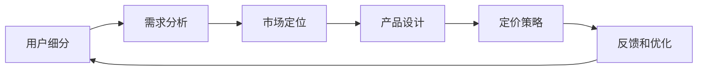

                 

# 知识付费创业的用户群体细分

在知识付费领域，找到正确的用户群体是成功商业模式的关键。本文将详细分析不同用户群体的特征和需求，探讨如何针对性地制定营销策略和产品功能，以实现知识的有效传播和价值的最大化利用。

## 1. 背景介绍

### 1.1 知识付费市场概述

随着互联网的发展和知识经济的崛起，知识付费逐渐成为信息获取的新趋势。用户对高质量、个性化、高效化的信息需求不断增加，催生了多种知识付费产品和服务。

知识付费市场的用户群体涵盖了各年龄层、各行业、各背景的消费者，但不同用户群体的特征、需求和行为差异显著，只有精准细分才能更好地满足用户需求，提升转化率和留存率。

## 2. 核心概念与联系

### 2.1 核心概念概述

在知识付费领域，关键概念包括用户细分、需求分析、市场定位、产品设计和定价策略等。

- **用户细分**：将用户按照特定维度进行分组，如年龄、性别、职业、教育水平、兴趣等，以便针对性地制定策略。
- **需求分析**：识别用户的核心需求和痛点，了解用户购买知识付费产品的动机和期望。
- **市场定位**：明确产品和服务在市场中的位置，找到目标用户并满足其特定需求。
- **产品设计**：根据用户需求设计内容形式、呈现方式、互动体验等，提升用户满意度和黏性。
- **定价策略**：根据用户需求和市场竞争，合理制定价格，平衡利润和用户支付意愿。

这些概念通过逻辑链条连接起来，形成一个完整的用户研究和产品开发的闭环。

### 2.2 核心概念原理和架构的 Mermaid 流程图



## 3. 核心算法原理 & 具体操作步骤

### 3.1 算法原理概述

用户群体细分的核心算法基于聚类和分类技术，通过数据挖掘和机器学习模型，将用户按照相似特征进行分组。核心步骤包括：

1. **数据收集**：从注册、购买、互动等渠道收集用户数据。
2. **特征工程**：选择和构造反映用户特征的指标，如年龄、职业、消费习惯、学习偏好等。
3. **模型训练**：利用聚类或分类算法，如K-means、PCA、LDA、RFM等，将用户分为不同的群体。
4. **评估优化**：通过指标如准确率、召回率、F1-score等，评估模型的效果，进行优化。

### 3.2 算法步骤详解

#### 3.2.1 数据收集

收集数据是用户群体细分的第一步。常用的数据来源包括：

- **注册信息**：用户的姓名、性别、年龄、邮箱、电话等基础信息。
- **行为数据**：用户在平台上的浏览记录、购买历史、点击率、停留时间、评分反馈等。
- **互动数据**：用户与内容互动的记录，如评论、分享、点赞、提问等。
- **社交数据**：用户的社交网络信息，如好友关系、兴趣标签、讨论主题等。

数据收集应遵循隐私保护原则，明确告知用户数据收集的目的，并获得用户同意。

#### 3.2.2 特征工程

特征工程是用户群体分类的核心，需要选取和构造反映用户特征的关键指标。以下示例数据来源：

1. **基本信息**：
   - 年龄：分为青少年、中青年、中老年、老年等。
   - 性别：男、女、未注明。
   - 职业：公务员、教师、医生、工程师等。
2. **行为数据**：
   - 活跃度：浏览次数、停留时间、互动频率等。
   - 消费数据：购买频率、平均消费金额、单次消费金额等。
3. **学习数据**：
   - 兴趣偏好：阅读量较高的领域如科技、金融、文学等。
   - 学习方式：视频、音频、图文等。
4. **社交数据**：
   - 社交网络：社交平台好友数、兴趣群体标签等。

特征工程的关键在于选择有区分度的指标，并通过预处理如归一化、标准化、特征选择等提高数据质量。

#### 3.2.3 模型训练

模型训练是用户群体分类的关键步骤。常用的聚类算法包括K-means、层次聚类、DBSCAN等，常用的分类算法包括RFM、LDA等。

以K-means算法为例，其步骤包括：

1. **初始化聚类中心**：随机选择K个点作为初始聚类中心。
2. **分配数据点**：将每个数据点分配到最近的聚类中心。
3. **更新聚类中心**：重新计算每个聚类的质心。
4. **迭代过程**：重复步骤2和步骤3，直到聚类中心不再改变或达到预设迭代次数。

### 3.3 算法优缺点

#### 3.3.1 优点

- **精准细分**：通过聚类或分类模型，实现对用户的精准细分，满足不同用户群体的个性化需求。
- **高效分析**：利用数据挖掘和机器学习技术，能够快速分析和处理大量数据，提升分析效率。
- **市场洞察**：通过用户群体细分，获得市场分布、用户偏好、行为规律等洞察，帮助制定有效策略。

#### 3.3.2 缺点

- **数据依赖**：数据质量和数据量的完整性直接影响分类的准确性。
- **模型复杂**：选择和构造合适的特征指标复杂，需要多次试验和调整。
- **动态更新**：用户行为和需求会随时间变化，需要定期更新模型以保持准确性。

### 3.4 算法应用领域

用户群体细分在知识付费领域有广泛应用，如：

- **内容推荐**：通过用户细分，实现个性化推荐，提升用户满意度和平台黏性。
- **定价策略**：根据用户细分结果，制定差异化定价策略，优化收入结构。
- **市场推广**：针对不同用户群体，制定有效的市场推广策略，提高转化率。
- **用户留存**：通过细分用户群体，提供定制化服务和内容，提升用户留存率。

## 4. 数学模型和公式 & 详细讲解 & 举例说明

### 4.1 数学模型构建

用户群体细分可以通过聚类和分类模型进行构建。以K-means算法为例，其数学模型为：

$$
\min_{\mu_k,\eta_k} \sum_{i=1}^n\sum_{k=1}^K d_i(x_i,\mu_k)^2 \quad \text{s.t.} \quad \sum_{x_i\in\eta_k}1=|\eta_k|=N_k
$$

其中，$\mu_k$表示第k个聚类中心的坐标，$\eta_k$表示第k个聚类的样本集合，$d_i(x_i,\mu_k)$表示样本$x_i$到聚类中心$\mu_k$的距离。

### 4.2 公式推导过程

以K-means算法为例，公式推导过程如下：

1. **初始化聚类中心**：
   $$
   \mu_k = \frac{1}{N_k}\sum_{x_i\in\eta_k}x_i
   $$
2. **分配数据点**：
   $$
   \gamma_i = \min_k d_i(x_i,\mu_k)
   $$
3. **更新聚类中心**：
   $$
   \mu_k = \frac{1}{N_k}\sum_{x_i\in\eta_k}\gamma_i
   $$
4. **迭代过程**：重复步骤2和步骤3，直到聚类中心不再改变或达到预设迭代次数。

### 4.3 案例分析与讲解

以K-means算法为例，假设有一个知识付费平台，通过用户数据收集到以下基本信息：

| 用户ID | 年龄 | 性别 | 职业 | 活跃度 | 消费金额 |
|--------|------|------|------|--------|----------|
| 1      | 25   | 男   | 学生 | 高     | 100      |
| 2      | 30   | 女   | 白领 | 中     | 50       |
| 3      | 35   | 男   | 工程师 | 低     | 50       |
| ...    | ...  | ...  | ...  | ...     | ...      |

通过特征工程构造年龄、职业、活跃度、消费金额四个特征，使用K-means算法进行聚类，得到三个聚类结果：

1. **聚类1**：
   - 年龄：18-30岁
   - 职业：学生、自由职业者
   - 活跃度：高
   - 消费金额：低-中
2. **聚类2**：
   - 年龄：30-45岁
   - 职业：白领、教师
   - 活跃度：中
   - 消费金额：中
3. **聚类3**：
   - 年龄：45岁以上
   - 职业：高管、医生
   - 活跃度：低
   - 消费金额：高

## 5. 项目实践：代码实例和详细解释说明

### 5.1 开发环境搭建

#### 5.1.1 环境配置

- **Python版本**：推荐使用Python 3.6及以上版本。
- **库文件**：
  - numpy：用于数值计算。
  - pandas：用于数据处理。
  - scikit-learn：用于机器学习算法实现。
  - matplotlib：用于数据可视化。

#### 5.1.2 数据准备

假设数据存储在CSV文件中，包含以下列：

| 用户ID | 年龄 | 性别 | 职业 | 活跃度 | 消费金额 |
|--------|------|------|------|--------|----------|
| 1      | 25   | 男   | 学生 | 高     | 100      |
| 2      | 30   | 女   | 白领 | 中     | 50       |
| 3      | 35   | 男   | 工程师 | 低     | 50       |
| ...    | ...  | ...  | ...  | ...     | ...      |

通过以下代码将数据读入Pandas DataFrame：

```python
import pandas as pd

df = pd.read_csv('user_data.csv')
```

### 5.2 源代码详细实现

#### 5.2.1 K-means算法实现

以下是一个简单的K-means算法实现：

```python
from sklearn.cluster import KMeans

# 假设df为用户数据，包含以下列：年龄、职业、活跃度、消费金额
# 选择前四个特征进行聚类

features = ['年龄', '职业', '活跃度', '消费金额']
X = df[features]

# 初始化聚类中心
kmeans = KMeans(n_clusters=3, random_state=0)

# 训练模型
kmeans.fit(X)

# 输出聚类结果
labels = kmeans.labels_
```

### 5.3 代码解读与分析

#### 5.3.1 特征工程

通过选择和构造反映用户特征的关键指标，如年龄、职业、活跃度、消费金额等，能够更好地进行用户群体细分。

#### 5.3.2 模型训练

使用K-means算法进行聚类，将用户分为不同的群体。n_clusters参数指定聚类数量，random_state参数用于随机初始化聚类中心。

## 6. 实际应用场景

### 6.1 内容推荐

通过用户细分，可以实现个性化推荐，提升用户满意度和平台黏性。例如，针对不同用户群体推荐不同的课程内容，满足其特定需求。

### 6.2 定价策略

根据用户细分结果，制定差异化定价策略，优化收入结构。例如，对高活跃度、高消费群体的用户提供会员特权，提升用户粘性。

### 6.3 市场推广

针对不同用户群体，制定有效的市场推广策略，提高转化率。例如，通过社交媒体广告，针对特定用户群体推送相关课程，吸引其关注和购买。

### 6.4 用户留存

通过细分用户群体，提供定制化服务和内容，提升用户留存率。例如，定期推送个性化推荐内容，及时解决用户问题，提高用户满意度。

## 7. 工具和资源推荐

### 7.1 学习资源推荐

1. **《Python数据科学手册》**：详细介绍Python数据科学库的使用，涵盖Pandas、NumPy、Scikit-Learn等。
2. **Coursera《机器学习》课程**：斯坦福大学Andrew Ng主讲的机器学习课程，涵盖聚类、分类等算法。
3. **《K-means算法详解》**：详细讲解K-means算法的原理和实现，适合初学者学习。
4. **Kaggle数据集**：提供多种机器学习算法竞赛数据集，练习和验证算法效果。

### 7.2 开发工具推荐

1. **PyCharm**：Python开发环境，提供高效代码编辑、调试工具。
2. **Jupyter Notebook**：交互式编程环境，便于代码调试和数据可视化。
3. **Pandas**：数据处理库，便于数据清洗、分析。
4. **Scikit-learn**：机器学习库，提供多种算法实现，如K-means、LDA等。

### 7.3 相关论文推荐

1. **《K-means算法及其改进》**：详细介绍K-means算法的原理和应用，适合基础学习。
2. **《聚类算法综述》**：总结各种聚类算法及其优缺点，适合深入学习。
3. **《用户细分与个性化推荐》**：探讨用户细分和个性化推荐的具体实现方法，适合应用开发。

## 8. 总结：未来发展趋势与挑战

### 8.1 研究成果总结

用户群体细分是知识付费领域的重要研究课题，通过对用户数据的细致分析，能够实现精准的细分，提升产品和服务的市场竞争力。

### 8.2 未来发展趋势

1. **数据智能**：利用人工智能和大数据技术，实现更精准的用户行为分析。
2. **多维细分**：通过多维度特征，实现更细致的用户细分。
3. **动态更新**：通过实时数据分析，动态更新用户群体，适应用户需求变化。
4. **个性化推荐**：利用用户细分结果，实现更精准的内容推荐。

### 8.3 面临的挑战

1. **数据隐私**：用户数据隐私保护成为重要挑战，需要制定严格的数据使用和保护策略。
2. **算法复杂**：选择和构造合适的特征指标复杂，需要多次试验和调整。
3. **模型鲁棒性**：用户行为和需求会随时间变化，需要定期更新模型以保持准确性。

### 8.4 研究展望

未来研究将进一步探索更加高效、精准、动态的用户群体细分方法，提升知识付费平台的竞争力和用户体验。

## 9. 附录：常见问题与解答

**Q1：如何选择合适的聚类算法？**

A: 选择合适的聚类算法应考虑数据特征、聚类数量和应用场景。例如，K-means适合处理大规模数据，而层次聚类适合处理小规模数据。

**Q2：如何优化K-means算法的聚类效果？**

A: 可以通过以下方式优化K-means算法：
1. 初始化聚类中心：随机选择K个点作为初始聚类中心，可以减少迭代次数。
2. 参数调整：调整K值、迭代次数等参数，优化聚类效果。
3. 特征工程：选择和构造有区分度的特征指标，提高聚类效果。

**Q3：用户群体细分后如何应用到产品开发？**

A: 用户群体细分后，可以通过以下方式应用到产品开发：
1. 内容推荐：根据用户细分结果，推荐相关课程内容。
2. 市场推广：针对不同用户群体，制定市场推广策略。
3. 定价策略：制定差异化定价策略，优化收入结构。

**Q4：用户群体细分对知识付费平台的重要性？**

A: 用户群体细分是知识付费平台的重要组成部分，通过对用户数据的细致分析，能够实现精准的细分，提升产品和服务的市场竞争力。

---

作者：禅与计算机程序设计艺术 / Zen and the Art of Computer Programming

