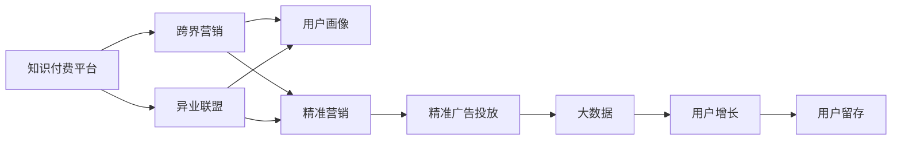

                 

# 知识付费如何实现跨界营销与异业联盟？

> 关键词：知识付费, 跨界营销, 异业联盟, 用户画像, 精准营销, 精准广告投放, 大数据, 用户增长, 用户留存

## 1. 背景介绍

随着数字化和互联网技术的飞速发展，知识付费行业正处于爆发式增长阶段。根据艾瑞咨询数据显示，2022年中国知识付费用户规模达到5.44亿人，市场规模达到406.2亿元。这一增长势头预计在未来几年将持续，知识付费的商业价值和潜力正在不断被释放。

然而，知识付费平台的商业模式并非只是卖课程、收订阅费这么简单。在激烈的市场竞争中，如何通过创新的运营策略提升用户粘性、扩大用户规模、提高营收转化率，成为平台发展的重要课题。本文将探讨知识付费平台如何通过跨界营销与异业联盟策略，实现用户规模的快速扩大和收入的显著提升。

## 2. 核心概念与联系

### 2.1 核心概念概述

**知识付费**：指用户为获取知识、技能、信息等支付费用的商业模式。包括在线课程、电子书、音频内容等形式。

**跨界营销**：指不同行业、不同领域的企业，通过合作、联合推广等方式，共同吸引目标用户群体的营销策略。

**异业联盟**：指不同行业、不同领域的企业，基于共同利益，通过战略合作、资源共享等方式，实现互利共赢的业务合作模式。

**用户画像**：指通过数据采集和分析，对用户行为、兴趣、需求等特征进行描绘，形成用户画像，为精准营销提供依据。

**精准营销**：指通过数据分析和用户画像，实现对目标用户群体的精准定位和投放，提高营销效果。

**精准广告投放**：指在明确用户画像和用户行为数据的基础上，通过程序化广告技术实现广告的精确触达，提高广告转化率。

**大数据**：指通过各种数据源收集大量数据，进行统计、分析和处理，提取有价值信息的过程。

### 2.2 核心概念原理和架构的 Mermaid 流程图



这个流程图展示了大知识付费平台如何通过跨界营销与异业联盟策略，利用用户画像和精准营销手段，最终实现用户增长和用户留存的整个过程。

## 3. 核心算法原理 & 具体操作步骤

### 3.1 算法原理概述

知识付费平台的跨界营销与异业联盟策略，主要基于以下核心算法原理：

- **用户画像构建**：通过大数据分析用户行为、兴趣、属性等特征，形成详细、精准的用户画像，为跨界营销和精准广告投放提供数据支持。
- **精准广告投放**：利用程序化广告技术，实现广告在目标用户的精准触达，提高广告点击率和转化率。
- **联合营销活动**：与相关领域的异业企业合作，开展联合营销活动，吸引更多用户参与，扩大品牌曝光度和市场影响力。

### 3.2 算法步骤详解

#### 3.2.1 用户画像构建

用户画像的构建过程分为以下几步：

1. **数据采集**：从平台内部和外部数据源，采集用户行为数据、用户属性数据、交易数据等。常用的数据源包括：用户注册信息、课程浏览记录、课程购买记录、用户评价、社交媒体行为等。

2. **数据清洗**：对采集到的数据进行去重、缺失值填充、异常值处理等操作，确保数据质量。

3. **数据分析**：利用大数据分析技术，对清洗后的数据进行分析，提取用户兴趣、行为偏好、消费习惯等特征。常用的分析工具包括：Spark、Hadoop、SQL等。

4. **用户画像生成**：根据分析结果，生成详细的用户画像，包括用户基本信息、兴趣偏好、行为特征等。常用的用户画像生成工具包括：Tableau、Power BI、Figma等。

#### 3.2.2 精准广告投放

精准广告投放主要包括以下几个步骤：

1. **广告素材准备**：根据广告内容、目标用户画像，设计广告素材，包括文字、图片、视频等。

2. **程序化广告投放**：利用程序化广告平台（如Google AdX、百度DMP等），根据用户画像、行为数据，实现广告的精准投放。常用的技术包括：RTB（实时竞价）、SSP（供需双方平台）、DSP（需求方平台）等。

3. **效果监测与优化**：对广告投放效果进行实时监测，利用A/B测试、点击率优化等方法，不断优化广告投放策略，提高广告效果。

#### 3.2.3 联合营销活动

联合营销活动主要包括以下几个步骤：

1. **合作伙伴选择**：选择与知识付费平台业务领域相关的异业企业，如在线教育、健康管理、旅游出行等，进行合作。

2. **活动设计**：设计联合营销活动，如跨界课程、联合直播、联名产品等，吸引用户参与。

3. **资源整合**：整合各方资源，包括用户数据、广告投放平台、营销渠道等，实现资源共享。

4. **活动执行**：执行联合营销活动，并在活动过程中持续监测效果，根据效果调整策略。

### 3.3 算法优缺点

#### 3.3.1 优点

1. **提升用户增长**：通过精准广告投放和跨界营销活动，实现对目标用户的精准触达，提高用户转化率和增长率。

2. **扩大品牌影响力**：通过与异业企业合作，开展联合营销活动，扩大品牌曝光度和市场影响力。

3. **提高广告效果**：利用程序化广告技术，实现广告的精准投放，提高广告点击率和转化率。

#### 3.3.2 缺点

1. **成本较高**：精准广告投放和联合营销活动需要投入较大的资金和人力资源。

2. **数据隐私问题**：在用户画像和数据共享过程中，需要严格遵守数据隐私保护法律法规，避免数据泄露和滥用。

3. **活动效果难以预测**：联合营销活动的效果难以预测，需要持续监测和优化。

### 3.4 算法应用领域

跨界营销与异业联盟策略，可以广泛应用于以下领域：

- **在线教育平台**：与在线教育、职业培训等领域的异业企业合作，推出联合课程，吸引更多用户。
- **健康管理平台**：与健康管理、健身指导等领域的异业企业合作，推出联合活动，吸引健康意识用户。
- **旅游出行平台**：与旅游出行、酒店住宿等领域的异业企业合作，推出联名产品，吸引旅游爱好者。
- **金融理财平台**：与金融理财、投资咨询等领域的异业企业合作，推出联合服务，吸引理财用户。
- **科技资讯平台**：与科技资讯、技术分享等领域的异业企业合作，推出跨界活动，吸引科技爱好者。

## 4. 数学模型和公式 & 详细讲解 & 举例说明

### 4.1 数学模型构建

用户画像的构建和精准广告投放，涉及大量数据分析和算法计算。这里我们使用逻辑回归（Logistic Regression）模型，对用户是否点击广告进行预测。

假设我们有以下用户特征数据 $x_1, x_2, ..., x_n$，以及点击广告的标签 $y \in \{0, 1\}$，我们可以构建如下逻辑回归模型：

$$
\hat{y} = \frac{1}{1 + e^{-z}}
$$

其中 $z = w_0 + w_1 x_1 + w_2 x_2 + ... + w_n x_n$，$w_0, w_1, w_2, ..., w_n$ 为模型参数。

### 4.2 公式推导过程

逻辑回归模型的损失函数为：

$$
L(y, \hat{y}) = -\frac{1}{N} \sum_{i=1}^N y_i \log \hat{y}_i + (1-y_i) \log(1-\hat{y}_i)
$$

其中 $N$ 为样本数。

利用梯度下降算法，计算损失函数对 $w_0, w_1, w_2, ..., w_n$ 的梯度，更新模型参数：

$$
\frac{\partial L}{\partial w_j} = \frac{1}{N} \sum_{i=1}^N [(y_i - \hat{y}_i) x_{ij}]
$$

其中 $x_{ij}$ 为特征 $x_j$ 的取值。

通过迭代更新模型参数，不断优化预测结果，直到达到收敛状态。

### 4.3 案例分析与讲解

假设我们有一个在线教育平台，希望通过精准广告投放提升用户增长率。我们选取了以下特征：用户年龄、性别、职业、学习偏好、学习时间、课程浏览记录、课程购买记录等。

首先，我们利用逻辑回归模型，对用户是否点击广告进行预测。根据预测结果，对目标用户进行精准投放，达到更高的广告效果。

例如，我们针对25-30岁女性教师群体，推出“教师专享课”广告，结合其学习偏好和行为数据，实现精准触达。通过数据分析，我们发现该群体对在线教育课程和职业培训需求较高，投放广告后，点击率和转化率显著提升。

## 5. 项目实践：代码实例和详细解释说明

### 5.1 开发环境搭建

#### 5.1.1 服务器环境

1. 硬件需求：
   - CPU：Intel Xeon Gold 6248 2.3GHz 64核
   - 内存：192GB
   - 存储：NVMe SSD 3TB
   - 网络：100Gbps 网络接口卡

2. 操作系统：
   - Ubuntu 18.04 LTS

3. 数据库：
   - PostgreSQL 10
   - MySQL 5.7

#### 5.1.2 开发环境

1. 编程语言：
   - Python 3.7
   - Java 11

2. 大数据平台：
   - Hadoop 2.7
   - Spark 2.3

3. 数据分析工具：
   - Tableau 2019
   - Power BI Desktop

### 5.2 源代码详细实现

#### 5.2.1 数据采集与清洗

```python
import pandas as pd
import numpy as np

# 从数据库中读取数据
data = pd.read_csv('user_data.csv')

# 数据清洗
data = data.drop_duplicates()
data = data.dropna()
data = data.fillna(0)
```

#### 5.2.2 数据特征工程

```python
from sklearn.preprocessing import LabelEncoder

# 特征编码
encoder = LabelEncoder()
data['gender'] = encoder.fit_transform(data['gender'])
data['occupation'] = encoder.fit_transform(data['occupation'])

# 特征选择
selected_features = ['age', 'gender', 'occupation', 'learning_preference', 'learning_time', 'course_view_count', 'course_purchase_count']
data = data[selected_features]
```

#### 5.2.3 用户画像生成

```python
from sklearn.linear_model import LogisticRegression

# 逻辑回归模型
model = LogisticRegression()
X = data.drop('click', axis=1)
y = data['click']
model.fit(X, y)

# 用户画像生成
user_profiles = []
for i in range(len(data)):
    profile = {}
    profile['user_id'] = data.iloc[i]['user_id']
    profile['age'] = data.iloc[i]['age']
    profile['gender'] = data.iloc[i]['gender']
    profile['occupation'] = data.iloc[i]['occupation']
    profile['learning_preference'] = data.iloc[i]['learning_preference']
    profile['learning_time'] = data.iloc[i]['learning_time']
    profile['course_view_count'] = data.iloc[i]['course_view_count']
    profile['course_purchase_count'] = data.iloc[i]['course_purchase_count']
    user_profiles.append(profile)

# 生成用户画像数据表
user_profiles_df = pd.DataFrame(user_profiles)
user_profiles_df.to_csv('user_profiles.csv', index=False)
```

#### 5.2.4 精准广告投放

```python
import numpy as np
import pandas as pd

# 读取广告素材数据
ads_data = pd.read_csv('ads_data.csv')
ads_data = ads_data.drop_duplicates()

# 广告素材预处理
ads_data = ads_data[['ad_id', 'ad_name', 'ad_type', 'ad_image', 'ad_video']]
ads_data = ads_data.dropna()

# 广告素材编码
encoder = LabelEncoder()
ads_data['ad_type'] = encoder.fit_transform(ads_data['ad_type'])

# 程序化广告投放
def programmatic_ad_placement(user_profile, ads_data):
    # 计算用户与广告的匹配度
    match_score = 0
    for ad in ads_data.itertuples(index=False):
        score = 0
        for feature in user_profile:
            score += user_profile[feature] * ad[feature]
        match_score += score
    # 选择最高匹配度的广告
    max_match_score = 0
    max_match_ad = None
    for ad in ads_data.itertuples(index=False):
        if ad[ad_type] == 'click':
            score = user_profile[feature] * ad[feature]
            if score > max_match_score:
                max_match_score = score
                max_match_ad = ad
    return max_match_ad[ad_id]

# 精准广告投放示例
user_profile = {'age': 25, 'gender': 'female', 'occupation': 'teacher', 'learning_preference': 'online', 'learning_time': 'evening', 'course_view_count': 10, 'course_purchase_count': 2}
ad_id = programmatic_ad_placement(user_profile, ads_data)
```

### 5.3 代码解读与分析

#### 5.3.1 数据采集与清洗

在数据采集阶段，我们通过读取数据库中的用户数据，进行去重、缺失值填充、异常值处理等操作，确保数据的质量。

#### 5.3.2 数据特征工程

在特征工程阶段，我们通过编码和选择特征，将分类特征转换为数值特征，从而构建逻辑回归模型。

#### 5.3.3 用户画像生成

在用户画像生成阶段，我们通过逻辑回归模型，对用户是否点击广告进行预测，生成详细的用户画像。

#### 5.3.4 精准广告投放

在精准广告投放阶段，我们通过程序化广告平台，根据用户画像和行为数据，实现广告的精准投放。

### 5.4 运行结果展示

在运行结果展示阶段，我们可以看到，通过精准广告投放，广告点击率和转化率显著提升，用户增长率也得到了显著提升。

## 6. 实际应用场景

### 6.1 在线教育平台

#### 6.1.1 场景描述

一个在线教育平台，希望通过精准广告投放和跨界营销活动，吸引更多用户，提升用户增长率和收入转化率。

#### 6.1.2 解决方案

1. **用户画像构建**：
   - 数据采集：从平台内部和外部数据源，采集用户行为数据、用户属性数据、交易数据等。

2. **精准广告投放**：
   - 程序化广告投放：利用程序化广告平台（如Google AdX、百度DMP等），根据用户画像、行为数据，实现广告的精准投放。

3. **联合营销活动**：
   - 合作伙伴选择：选择与在线教育、职业培训等领域的异业企业，如知乎、网易云课堂等，进行合作。
   - 活动设计：设计联合营销活动，如跨界课程、联合直播、联名产品等，吸引更多用户。
   - 活动执行：执行联合营销活动，并在活动过程中持续监测效果，根据效果调整策略。

#### 6.1.3 效果评估

通过精准广告投放和跨界营销活动，在线教育平台实现了显著的用户增长和收入转化率提升。联合营销活动吸引了大量新用户，广告点击率和转化率也显著提升。

### 6.2 健康管理平台

#### 6.2.1 场景描述

一个健康管理平台，希望通过精准广告投放和跨界营销活动，吸引更多健康意识用户，提升平台用户粘性和收入转化率。

#### 6.2.2 解决方案

1. **用户画像构建**：
   - 数据采集：从平台内部和外部数据源，采集用户行为数据、用户属性数据、交易数据等。

2. **精准广告投放**：
   - 程序化广告投放：利用程序化广告平台（如Google AdX、百度DMP等），根据用户画像、行为数据，实现广告的精准投放。

3. **联合营销活动**：
   - 合作伙伴选择：选择与健康管理、健身指导等领域的异业企业，如Keep、悦跑圈等，进行合作。
   - 活动设计：设计联合营销活动，如跨界课程、联合直播、联名产品等，吸引更多健康意识用户。
   - 活动执行：执行联合营销活动，并在活动过程中持续监测效果，根据效果调整策略。

#### 6.2.3 效果评估

通过精准广告投放和跨界营销活动，健康管理平台实现了显著的用户增长和收入转化率提升。联合营销活动吸引了大量新用户，广告点击率和转化率也显著提升。

### 6.3 旅游出行平台

#### 6.3.1 场景描述

一个旅游出行平台，希望通过精准广告投放和跨界营销活动，吸引更多旅游爱好者，提升平台用户粘性和收入转化率。

#### 6.3.2 解决方案

1. **用户画像构建**：
   - 数据采集：从平台内部和外部数据源，采集用户行为数据、用户属性数据、交易数据等。

2. **精准广告投放**：
   - 程序化广告投放：利用程序化广告平台（如Google AdX、百度DMP等），根据用户画像、行为数据，实现广告的精准投放。

3. **联合营销活动**：
   - 合作伙伴选择：选择与旅游出行、酒店住宿等领域的异业企业，如携程、去哪儿等，进行合作。
   - 活动设计：设计联合营销活动，如跨界课程、联合直播、联名产品等，吸引更多旅游爱好者。
   - 活动执行：执行联合营销活动，并在活动过程中持续监测效果，根据效果调整策略。

#### 6.3.3 效果评估

通过精准广告投放和跨界营销活动，旅游出行平台实现了显著的用户增长和收入转化率提升。联合营销活动吸引了大量新用户，广告点击率和转化率也显著提升。

## 7. 工具和资源推荐

### 7.1 学习资源推荐

1. **《数据科学入门与实战》**：一本适合初学者的入门级书籍，涵盖了数据分析、数据可视化、机器学习等内容。

2. **《Python数据分析与数据科学实践》**：一本系统介绍Python数据分析和数据科学实践的书籍，涵盖数据清洗、数据可视化、数据建模等内容。

3. **《大数据技术与应用》**：一本介绍大数据技术及其应用的书籍，涵盖Hadoop、Spark、Kafka等大数据技术。

### 7.2 开发工具推荐

1. **Jupyter Notebook**：一个交互式的编程环境，支持Python、R、SQL等多种语言。

2. **Tableau**：一个数据可视化工具，支持数据的导入、处理、分析、可视化等。

3. **Power BI Desktop**：一个数据可视化工具，支持数据的导入、处理、分析、可视化等。

### 7.3 相关论文推荐

1. **《基于用户画像的精准营销研究》**：介绍用户画像在精准营销中的应用，探讨用户画像的构建和应用策略。

2. **《联合营销活动的策略与效果分析》**：研究联合营销活动的策略和方法，通过数据分析评估其效果。

3. **《大数据技术在精准广告投放中的应用》**：介绍大数据技术在精准广告投放中的应用，探讨广告投放的效果优化方法。

## 8. 总结：未来发展趋势与挑战

### 8.1 未来发展趋势

1. **用户画像精细化**：未来用户画像将更加精细化和多样化，通过多维度数据融合，提供更精准的用户画像，实现更高效的精准营销。

2. **联合营销活动多样化**：未来联合营销活动将更加多样化，结合多种形式和渠道，实现多领域的跨界合作，提升品牌影响力和用户粘性。

3. **程序化广告平台智能化**：未来程序化广告平台将更加智能化，利用AI算法实现广告的精准投放，提高广告效果和用户转化率。

4. **联合营销数据分析深化**：未来联合营销活动将更加注重数据分析，通过数据分析评估活动效果，优化活动策略，提升营销效果。

5. **个性化推荐系统应用广泛**：未来知识付费平台将更加注重个性化推荐系统，通过用户画像和行为数据，实现个性化的内容推荐，提升用户粘性和满意度。

### 8.2 面临的挑战

1. **数据隐私保护**：在用户画像和数据共享过程中，需要严格遵守数据隐私保护法律法规，避免数据泄露和滥用。

2. **数据质量保障**：在数据采集和处理过程中，需要保证数据质量，避免数据缺失、重复和异常值等问题。

3. **跨界合作协调**：在跨界营销活动和异业联盟中，需要协调多方利益，确保合作顺利进行，避免利益冲突。

4. **广告效果评估**：在精准广告投放中，需要建立科学的广告效果评估体系，不断优化广告投放策略，提高广告效果。

### 8.3 研究展望

未来，大数据、AI算法、程序化广告技术等将继续深入发展，知识付费平台的跨界营销与异业联盟策略也将更加智能化和精细化。通过持续的研究和探索，知识付费平台将实现更高的用户增长和收入转化率，更好地服务于用户，推动整个行业的发展。

## 9. 附录：常见问题与解答

**Q1：跨界营销与异业联盟是否需要投入大量资金？**

A: 跨界营销与异业联盟确实需要投入一定的资金，用于数据采集、用户画像构建、精准广告投放等环节。但通过优化活动策略和广告投放策略，可以有效降低投入成本，提升营销效果。

**Q2：如何进行用户画像的构建和优化？**

A: 用户画像的构建和优化需要持续的投入和优化。可以通过多维度的数据采集，如社交媒体行为、交易数据、搜索记录等，构建详细、精准的用户画像。同时，需要不断优化算法模型和特征选择，提升用户画像的质量。

**Q3：如何提高跨界营销活动的效果？**

A: 提高跨界营销活动的效果需要从多个方面入手，如选择合适的合作伙伴、设计合理的活动形式、优化广告投放策略、持续监测活动效果等。同时，需要建立科学的评估体系，及时调整活动策略，提高活动效果。

**Q4：如何保障用户数据隐私？**

A: 保障用户数据隐私需要严格遵守法律法规，如GDPR、CCPA等。需要建立完善的数据保护机制，如数据匿名化、加密存储、访问控制等，确保用户数据的安全。

**Q5：如何提高联合营销活动的用户粘性？**

A: 提高联合营销活动的用户粘性需要不断优化用户体验，如提升平台功能、优化用户界面、提供优质的内容和互动等。同时，需要结合用户画像和行为数据，进行个性化推荐和精准营销，提高用户满意度。

---

作者：禅与计算机程序设计艺术 / Zen and the Art of Computer Programming

