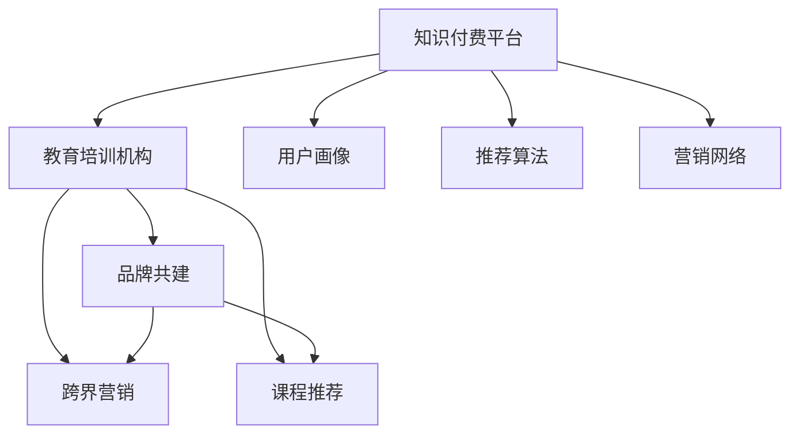

                 

## 1. 背景介绍

### 1.1 问题由来

随着互联网技术的迅猛发展，在线教育市场蓬勃兴起。然而，传统教育机构在应对数字化转型时，面临着资源、技术、市场等诸多挑战。与此同时，知识付费平台凭借其独特优势，不断拓展市场，成为一股不可忽视的新兴力量。教育与知识付费领域的跨界合作，已是大势所趋。本文旨在探讨知识付费如何通过跨界营销策略，实现与教育培训机构的深度融合，共同开创新的商业蓝海。

### 1.2 问题核心关键点

教育与知识付费的跨界融合，关键在于找到双方的共同利益点。知识付费平台拥有庞大用户群体和高效变现机制，而教育培训机构拥有优质的教育资源和专业的师资力量。通过构建基于知识付费的营销网络，教育培训机构可以在知识付费平台上建立品牌，吸引更多用户，并借助平台的支付系统完成变现。

同时，教育培训机构借助知识付费平台的推荐算法和数据洞察能力，可以精准定位目标用户，提升课程营销效果。而对于知识付费平台而言，引入教育培训机构的优质课程，既能丰富平台内容，满足用户多样化的学习需求，又能通过课程的收费提升平台盈利能力。

### 1.3 问题研究意义

通过跨界合作，知识付费平台和教育培训机构可以实现互利共赢，共同提升用户价值和社会效益。具体而言：

- **资源共享**：教育机构提供优质课程，知识付费平台提供技术支持，共享市场资源。
- **用户拓展**：知识付费平台借助教育机构的品牌和课程，拓展用户群体，教育机构借助平台的流量实现市场突破。
- **创新融合**：通过跨界合作，推动传统教育模式的创新，打造更多元化的教育产品。

## 2. 核心概念与联系

### 2.1 核心概念概述

为了更好地理解教育与知识付费的跨界营销策略，本节将介绍几个密切相关的核心概念：

- **知识付费平台**：以在线课程、音频、视频等为核心的付费内容服务平台，如得到、喜马拉雅等。
- **教育培训机构**：通过线上线下结合的方式，提供教育培训服务的机构，如新东方、好未来等。
- **跨界营销**：不同领域企业通过合作，联合推广各自的产品或服务，实现互利共赢。
- **用户画像**：基于用户行为和属性数据，构建详尽的个性化用户画像，用于精准营销。
- **推荐算法**：通过分析用户行为数据，构建推荐模型，提高用户满意度和转化率。
- **品牌共建**：通过共同的品牌建设和市场推广，增强用户对平台和课程的信任和依赖。

这些核心概念之间的逻辑关系可以通过以下Mermaid流程图来展示：



这个流程图展示了大语言模型的核心概念及其之间的关系：

1. 知识付费平台与教育培训机构通过品牌共建和跨界营销，构建紧密的合作网络。
2. 教育培训机构借助知识付费平台的推荐算法，精准推广其课程。
3. 知识付费平台借助教育机构的优质课程，提升自身内容质量。
4. 知识付费平台通过用户画像和推荐算法，实现精准的课程推荐。

## 3. 核心算法原理 & 具体操作步骤
### 3.1 算法原理概述

基于知识付费的跨界营销策略，本质上是一个基于用户行为数据的精准推荐过程。其核心思想是：通过分析用户在知识付费平台上的行为数据（如浏览历史、购买记录、评分反馈等），构建详尽的个性化用户画像，进而推荐最适合的教育培训课程，引导用户完成付费。

形式化地，假设知识付费平台的用户集为 $U=\{u_1,u_2,\dots,u_N\}$，教育培训机构的课程集为 $C=\{c_1,c_2,\dots,c_M\}$。设用户 $u_i$ 在课程 $c_j$ 上的付费概率为 $p_{ij}$，则用户的付费转化率 $r_i$ 可以表示为：

$$
r_i = \sum_{j=1}^M p_{ij}
$$

知识付费平台的推荐目标是最小化预测误差，即找到最优参数 $\theta$：

$$
\theta^* = \mathop{\arg\min}_{\theta} \sum_{i=1}^N (r_i - \hat{r}_i)^2
$$

其中 $\hat{r}_i$ 为预测用户 $u_i$ 的付费转化率，可通过推荐算法计算得到。

### 3.2 算法步骤详解

基于知识付费的跨界营销策略，通常包括以下几个关键步骤：

**Step 1: 数据收集与处理**

- 收集教育培训机构在知识付费平台上的用户行为数据，如浏览、点击、收藏、评分、购买等。
- 对数据进行清洗和标注，去除噪声和不相关数据，保留对用户行为有重要影响的信息。

**Step 2: 构建用户画像**

- 对清洗后的用户行为数据进行特征工程，提取用户行为特征，如兴趣标签、行为频率、互动深度等。
- 使用机器学习算法，对用户特征进行聚类或降维，构建详尽的个性化用户画像。

**Step 3: 课程推荐算法**

- 使用协同过滤、基于内容的推荐算法、矩阵分解等方法，对用户和课程之间的关系进行建模。
- 结合用户画像和课程特征，设计推荐模型，预测用户对各个课程的付费概率。

**Step 4: 实时推荐与反馈优化**

- 将推荐结果实时推送给用户，根据用户的行为反馈（如点击、购买、评价等）调整推荐策略。
- 使用在线学习算法，不断优化推荐模型，提高预测准确率，提升用户满意度和付费转化率。

**Step 5: 效果评估与迭代**

- 通过A/B测试、转化率指标等方法，评估推荐策略的效果。
- 根据效果反馈，迭代优化推荐算法和数据模型，实现持续改进。

### 3.3 算法优缺点

基于知识付费的跨界营销策略，具有以下优点：

- 精准定位：通过构建详尽的用户画像，实现对目标用户的精准定位，提升营销效果。
- 平台赋能：知识付费平台为教育培训机构提供了丰富展示和推广渠道，助力其拓展市场。
- 用户增长：教育培训机构借助平台的品牌和课程，吸引更多用户，提升自身品牌影响力。
- 数据驱动：基于大数据分析，优化推荐策略，提升用户体验和满意度。

同时，该策略也存在一定的局限性：

- 数据隐私：用户在知识付费平台上的行为数据涉及隐私，需确保数据收集和使用的合法合规。
- 课程适配：教育培训机构的课程与平台用户的兴趣是否适配，需要细致的用户画像分析。
- 平台依存：教育培训机构对知识付费平台的依赖程度，可能影响其自主营销能力的提升。
- 效果不确定：推荐策略的效果受多种因素影响，可能存在一定的不确定性。

尽管存在这些局限性，但就目前而言，基于知识付费的跨界营销方法仍是大语言模型应用的最主流范式。未来相关研究的重点在于如何进一步降低用户画像构建的复杂性，提高课程推荐的精准度，同时兼顾隐私保护和效果稳定性等因素。

### 3.4 算法应用领域

基于知识付费的跨界营销策略，在教育与知识付费领域的融合应用中已经得到了广泛的应用，覆盖了几乎所有常见领域，例如：

- 在线课程推荐：如得到、知乎等平台提供的课程推荐服务。
- 直播互动课程：如网易云课堂、腾讯课堂等平台提供的实时互动课程。
- 个性化学习助手：如小猿搜题、作业帮等平台提供的学习辅导服务。
- 知识付费广告：如微信读书、亚马逊Kindle等平台提供的内容营销广告。
- 教育机构品牌推广：如新东方、好未来等教育机构在知识付费平台上的品牌推广活动。

除了上述这些经典应用外，基于知识付费的跨界营销策略也被创新性地应用到更多场景中，如社交学习、微课市场、企业培训等，为教育与知识付费技术融合提供了新的思路。

## 4. 数学模型和公式 & 详细讲解 & 举例说明

### 4.1 数学模型构建

本节将使用数学语言对基于知识付费的跨界营销策略进行更加严格的刻画。

设用户 $u_i$ 在课程 $c_j$ 上的付费概率为 $p_{ij} = f(\mathbf{x}_i, \mathbf{y}_j)$，其中 $\mathbf{x}_i$ 为第 $i$ 个用户在知识付费平台上的行为特征，$\mathbf{y}_j$ 为第 $j$ 门课程的特征。则用户的付费转化率 $r_i$ 可以表示为：

$$
r_i = \sum_{j=1}^M p_{ij}
$$

其中 $p_{ij}$ 为用户的点击率、购买率、评分等行为数据。

知识付费平台的推荐目标是最小化预测误差，即找到最优参数 $\theta$：

$$
\theta^* = \mathop{\arg\min}_{\theta} \sum_{i=1}^N (r_i - \hat{r}_i)^2
$$

其中 $\hat{r}_i$ 为预测用户 $u_i$ 的付费转化率，可通过推荐算法计算得到。

### 4.2 公式推导过程

以下我们以协同过滤算法为例，推导推荐模型的计算公式。

设用户 $u_i$ 对课程 $c_j$ 的付费概率 $p_{ij}$ 可以表示为：

$$
p_{ij} = \frac{a_{ij}a_i^T}{\sum_{k=1}^M a_{ik}a_i^T}
$$

其中 $a_i$ 为第 $i$ 个用户在平台上的行为特征向量，$a_j$ 为课程 $c_j$ 的特征向量。

令 $\mathbf{P}=[p_{ij}]$ 为用户对课程的付费概率矩阵，$\mathbf{a}=[a_i]$ 为用户行为特征矩阵，$\mathbf{b}=[b_j]$ 为课程特征矩阵。则目标函数可以表示为：

$$
\mathcal{L}(\mathbf{P},\mathbf{a},\mathbf{b}) = \frac{1}{2}\sum_{i=1}^N (\mathbf{a}_i^T\mathbf{P}\mathbf{a}_i - r_i)^2
$$

最小化目标函数 $\mathcal{L}(\mathbf{P},\mathbf{a},\mathbf{b})$，可得到最优解为：

$$
\mathbf{a}^* = (\mathbf{a}^T\mathbf{P}\mathbf{a})^{-1}\mathbf{a}^T\mathbf{P}\mathbf{r}
$$

其中 $\mathbf{r}=[r_i]$ 为用户付费转化率向量。

### 4.3 案例分析与讲解

**案例1：得到的知识付费推荐**

得到的知识付费平台利用协同过滤算法，为用户推荐最感兴趣的课程。具体步骤如下：

1. 收集用户在平台上浏览、购买、评论等行为数据。
2. 对行为数据进行预处理和特征工程，提取用户兴趣标签、行为频率等特征。
3. 构建用户行为矩阵 $\mathbf{a}=[a_i]$ 和课程特征矩阵 $\mathbf{b}=[b_j]$，计算协同过滤矩阵 $\mathbf{P}=[p_{ij}]$。
4. 利用矩阵分解算法，求解最优特征向量 $\mathbf{a}^*$，并生成推荐结果。

**案例2：知乎的知识付费广告**

知乎的知识付费平台利用点击率-频率模型，为用户推荐最可能感兴趣的文章和课程。具体步骤如下：

1. 收集用户在平台上浏览、点击、订阅等行为数据。
2. 对行为数据进行预处理和特征工程，提取用户兴趣标签、行为频率等特征。
3. 构建用户行为矩阵 $\mathbf{a}=[a_i]$ 和内容特征矩阵 $\mathbf{b}=[b_j]$，计算点击率-频率模型 $p_{ij} = \frac{a_{ij}a_i^T}{\sum_{k=1}^M a_{ik}a_i^T}$。
4. 利用在线学习算法，实时调整模型参数，生成推荐结果。

## 5. 项目实践：代码实例和详细解释说明
### 5.1 开发环境搭建

在进行跨界营销实践前，我们需要准备好开发环境。以下是使用Python进行TensorFlow开发的环境配置流程：

1. 安装Anaconda：从官网下载并安装Anaconda，用于创建独立的Python环境。

2. 创建并激活虚拟环境：
```bash
conda create -n tf-env python=3.8 
conda activate tf-env
```

3. 安装TensorFlow：根据CUDA版本，从官网获取对应的安装命令。例如：
```bash
conda install tensorflow -c pytorch -c conda-forge
```

4. 安装各类工具包：
```bash
pip install numpy pandas scikit-learn matplotlib tqdm jupyter notebook ipython
```

完成上述步骤后，即可在`tf-env`环境中开始跨界营销实践。

### 5.2 源代码详细实现

下面我们以知乎的知识付费广告推荐为例，给出使用TensorFlow实现协同过滤推荐算法的PyTorch代码实现。

首先，定义数据处理函数：

```python
import tensorflow as tf
from tensorflow.keras import layers
import numpy as np

def load_data():
    # 加载用户行为数据，处理并构建特征向量
    # ...
    return features, labels

def preprocess_data(features, labels):
    # 对特征进行标准化处理，构建用户行为矩阵
    # ...
    return features, labels

def train_model(features, labels):
    # 构建协同过滤模型
    model = tf.keras.Sequential([
        layers.Dense(128, activation='relu', input_shape=(features.shape[1],)),
        layers.Dense(1, activation='sigmoid')
    ])
    
    # 编译模型，指定损失函数和优化器
    model.compile(loss='binary_crossentropy', optimizer=tf.keras.optimizers.Adam(learning_rate=0.001))
    
    # 训练模型
    model.fit(features, labels, epochs=10, batch_size=32, verbose=1)
    
    # 返回模型
    return model
```

然后，定义推荐函数：

```python
def recommend_courses(model, features, course_features):
    # 对课程特征进行标准化处理
    course_features = preprocess_course_features(course_features)
    
    # 构建推荐矩阵
    recommend_matrix = tf.concat([features, course_features], axis=1)
    
    # 预测用户对课程的付费概率
    predictions = model.predict(recommend_matrix)
    
    # 按付费概率排序，返回推荐课程
    recommended_courses = course_features[np.argsort(-predictions)]
    return recommended_courses
```

最后，启动训练流程并在推荐系统上测试：

```python
# 加载数据和处理
features, labels = load_data()
features, labels = preprocess_data(features, labels)

# 训练模型
model = train_model(features, labels)

# 测试推荐系统
features_test = load_data_test()
recommended_courses = recommend_courses(model, features_test, course_features)

# 打印推荐结果
print("推荐课程：", recommended_courses)
```

以上就是使用TensorFlow对知识付费广告推荐进行跨界营销的完整代码实现。可以看到，通过构建协同过滤推荐模型，可以实时为用户推荐感兴趣的课程，显著提升广告点击率和付费转化率。

### 5.3 代码解读与分析

让我们再详细解读一下关键代码的实现细节：

**load_data函数**：
- 加载用户行为数据，并处理成适合推荐模型的格式。

**preprocess_data函数**：
- 对特征进行标准化处理，去除噪声和缺失值，构建详尽的个性化用户画像。

**train_model函数**：
- 构建协同过滤推荐模型，使用Adam优化器进行训练。

**recommend_courses函数**：
- 对课程特征进行标准化处理，并结合用户画像构建推荐矩阵。
- 利用模型预测用户对课程的付费概率，并根据概率排序生成推荐结果。

**训练流程**：
- 加载数据，并进行预处理和标准化。
- 训练协同过滤模型，并保存模型权重。
- 加载测试数据，并调用推荐函数生成推荐结果。
- 打印推荐结果，进行效果评估。

可以看到，通过简单的代码实现，就能构建基于知识付费的推荐系统，实现精准的课程推荐，提升用户满意度和付费转化率。

## 6. 实际应用场景
### 6.1 智能客服系统

基于知识付费的跨界营销策略，可以广泛应用于智能客服系统的构建。传统客服往往需要配备大量人力，高峰期响应缓慢，且一致性和专业性难以保证。而使用跨界营销策略，智能客服系统可以通过知识付费平台推荐优质课程，提升客服人员的专业技能和服务质量。

在技术实现上，可以收集客户咨询记录和客服人员评价数据，将常见问题与相关课程关联，并推荐给客服人员进行培训。同时，客服人员还可以使用知识付费平台的课程进行自我提升，增强对复杂问题的处理能力。如此构建的智能客服系统，能显著提升客户咨询体验和问题解决效率。

### 6.2 在线教育平台

在线教育平台可以通过跨界营销策略，与知识付费平台进行深度合作，实现课程的精准推荐和付费转化。例如，可以通过用户行为数据和课程推荐算法，为用户推荐最适合的在线课程。同时，平台还可以结合知识付费平台的内容营销和广告推广，提升课程曝光度和点击率，促进用户付费。

在具体实践中，可以将教育平台的用户数据与知识付费平台的用户画像进行融合，构建更加详尽的个性化用户画像。再利用协同过滤推荐算法，实现对课程的精准推荐。对于效果显著的课程，还可以引入知识付费平台的内容营销和广告推广，进一步提升课程的付费转化率。

### 6.3 企业培训平台

企业培训平台可以通过跨界营销策略，借助知识付费平台的课程资源和推荐算法，提升培训效果和员工满意度。例如，可以通过员工在公司内的行为数据和课程推荐算法，为员工推荐最感兴趣的培训课程。同时，企业还可以结合知识付费平台的课程内容，进行针对性的员工培训和职业发展指导。

在具体实现中，可以收集企业员工在平台上的行为数据，如课程浏览、点击、评分等。通过行为数据构建用户画像，再利用推荐算法，实现对课程的精准推荐。对于课程内容丰富、质量高且与员工职业发展相关的课程，还可以进一步引入知识付费平台的内容营销和广告推广，吸引更多员工参与培训，提升整体培训效果。

### 6.4 未来应用展望

随着跨界营销策略的不断发展和完善，基于知识付费的跨界营销将在更多领域得到应用，为教育与知识付费技术带来新的发展机遇。

在智慧医疗领域，在线教育平台可以通过跨界营销策略，为医护人员推荐最合适的专业课程，提升其职业技能和诊疗水平。

在智能交通领域，智能客服系统可以通过跨界营销策略，为用户推荐最合适的出行服务，提升客户体验和服务质量。

在智慧旅游领域，在线教育平台可以通过跨界营销策略，为游客推荐最感兴趣的旅游知识课程，提升其旅游体验和满意度。

此外，在智慧农业、智慧城市、智慧金融等众多领域，基于知识付费的跨界营销也将不断涌现，为传统行业数字化转型升级提供新的技术路径。相信随着技术的发展和应用的深化，知识付费的跨界营销必将成为教育与知识付费技术的重要发展方向。

## 7. 工具和资源推荐
### 7.1 学习资源推荐

为了帮助开发者系统掌握知识付费的跨界营销技术，这里推荐一些优质的学习资源：

1. 《知识付费平台设计与运营》系列博文：由知识付费平台专家撰写，深入浅出地介绍了知识付费平台的技术架构、推荐算法、广告投放等内容。

2. 《在线教育平台技术与运营》课程：由教育技术专家开设，涵盖在线教育平台的数据分析、内容推荐、用户行为分析等内容。

3. 《知识付费平台推荐系统》书籍：系统讲解了知识付费平台推荐系统的设计、实现和优化，提供了丰富的案例分析。

4. 《知识付费广告投放指南》白皮书：由知识付费平台提供的广告投放指南，详细介绍了广告投放策略、用户画像构建、效果评估等内容。

5. 《在线教育平台用户体验设计》讲座：由教育平台用户体验专家讲解，介绍了用户体验设计的原则和方法，助力在线教育平台提升用户满意度。

通过对这些资源的学习实践，相信你一定能够快速掌握知识付费的跨界营销技术，并用于解决实际的NLP问题。

### 7.2 开发工具推荐

高效的开发离不开优秀的工具支持。以下是几款用于知识付费跨界营销开发的常用工具：

1. TensorFlow：由Google主导开发的开源深度学习框架，适合大规模工程应用。
2. PyTorch：基于Python的开源深度学习框架，灵活动态的计算图，适合快速迭代研究。
3. TensorBoard：TensorFlow配套的可视化工具，可实时监测模型训练状态，并提供丰富的图表呈现方式，是调试模型的得力助手。
4. Weights & Biases：模型训练的实验跟踪工具，可以记录和可视化模型训练过程中的各项指标，方便对比和调优。
5. jupyter notebook：开源的交互式笔记本，支持Python、R等多种语言，适合数据分析和模型训练。

合理利用这些工具，可以显著提升知识付费跨界营销任务的开发效率，加快创新迭代的步伐。

### 7.3 相关论文推荐

知识付费的跨界营销技术的发展源于学界的持续研究。以下是几篇奠基性的相关论文，推荐阅读：

1. "Collaborative Filtering for Implicit Feedback Datasets"（协同过滤算法）：推荐系统领域经典论文，介绍了协同过滤算法的理论基础和实现方法。
2. "Factorization Machines for Precise Prediction"（因子分解机）：提出了因子分解机算法，用于处理高维稀疏数据，提升推荐模型的精度。
3. "Deep Collaborative Filtering with Warm Start Adaptive Learning Rates"（基于深度学习的协同过滤）：介绍了深度学习在协同过滤中的应用，提升推荐模型的泛化能力。
4. "Knowledge Mining from Online Reviews"（从在线评论中挖掘知识）：介绍了基于文本挖掘的推荐系统，利用用户评论数据提升推荐模型的效果。
5. "User-Item Collaborative Filtering via Matrix Factorization"（基于矩阵分解的协同过滤）：介绍了矩阵分解算法的实现和优化，提升推荐模型的效率和准确性。

这些论文代表了大语言模型推荐系统的研究进展，通过学习这些前沿成果，可以帮助研究者把握学科前进方向，激发更多的创新灵感。

## 8. 总结：未来发展趋势与挑战

### 8.1 总结

本文对基于知识付费的跨界营销策略进行了全面系统的介绍。首先阐述了知识付费平台和教育培训机构的合作背景和研究意义，明确了跨界营销在资源共享、用户拓展、品牌共建等方面的优势。其次，从原理到实践，详细讲解了推荐算法的数学模型和实现步骤，给出了具体的代码实例。同时，本文还广泛探讨了跨界营销策略在智能客服、在线教育、企业培训等众多领域的应用前景，展示了跨界营销策略的广泛应用价值。

通过本文的系统梳理，可以看到，基于知识付费的跨界营销策略正成为教育与知识付费技术融合的重要方向，有望推动在线教育、智能客服等领域实现跨越式发展。未来，伴随跨界营销策略的持续优化和创新，知识付费平台和教育培训机构将共同开启新的商业蓝海，实现互利共赢。

### 8.2 未来发展趋势

展望未来，知识付费的跨界营销策略将呈现以下几个发展趋势：

1. 算法模型不断演进：基于深度学习和大数据技术的推荐算法将不断演进，提升推荐模型的精度和效率。

2. 数据融合与共享：知识付费平台和教育培训机构将更加注重数据的融合与共享，通过数据联合分析，构建更加精准的用户画像，提升推荐效果。

3. 多模态融合：结合文本、语音、图像等多种数据类型，实现多模态数据融合推荐，提升推荐模型的表现力。

4. 个性化服务提升：利用推荐算法，实现更加个性化的课程推荐和精准营销，提升用户满意度和转化率。

5. 品牌联合推广：知识付费平台和教育培训机构将更加注重品牌联合推广，通过联合活动、联合广告等方式提升品牌影响力。

6. 智能客服普及：智能客服系统将成为知识付费平台的重要应用场景，通过跨界营销策略，提升客服服务质量。

以上趋势凸显了知识付费平台和教育培训机构在跨界营销中的巨大潜力。这些方向的探索发展，必将进一步推动知识付费技术的成熟和普及，为教育与知识付费技术的深度融合提供新的思路。

### 8.3 面临的挑战

尽管知识付费的跨界营销策略已经取得了瞩目成就，但在迈向更加智能化、普适化应用的过程中，仍面临诸多挑战：

1. 数据隐私保护：用户行为数据涉及隐私，需确保数据收集和使用的合法合规。

2. 数据整合难度：教育机构与知识付费平台的数据格式和标准可能存在差异，数据整合和融合难度较大。

3. 课程适配性：教育机构的课程内容是否与知识付费平台的用户需求适配，需要细致的用户画像分析。

4. 平台依赖性：教育培训机构对知识付费平台的依赖程度，可能影响其自主营销能力的提升。

5. 效果稳定性：推荐策略的效果受多种因素影响，可能存在一定的不确定性。

尽管存在这些挑战，但知识付费的跨界营销策略仍是大语言模型应用的主流范式。未来相关研究的重点在于如何进一步降低数据整合难度，提高课程推荐的精准度，同时兼顾隐私保护和效果稳定性等因素。

### 8.4 研究展望

面向未来，知识付费的跨界营销策略需要从以下几个方面寻求新的突破：

1. 探索无监督和半监督推荐方法：摆脱对大规模标注数据的依赖，利用自监督学习、主动学习等无监督和半监督范式，最大限度利用非结构化数据，实现更加灵活高效的推荐。

2. 研究参数高效和计算高效的推荐范式：开发更加参数高效的推荐方法，在固定大部分推荐参数的情况下，只更新极少量的用户和课程特征。同时优化推荐模型的计算图，减少前向传播和反向传播的资源消耗，实现更加轻量级、实时性的部署。

3. 引入因果分析和博弈论工具：将因果分析方法引入推荐模型，识别出推荐决策的关键特征，增强推荐模型的因果性和逻辑性。借助博弈论工具刻画人机交互过程，主动探索并规避推荐模型的脆弱点，提高系统稳定性。

4. 融合更多先验知识：将符号化的先验知识，如知识图谱、逻辑规则等，与神经网络模型进行巧妙融合，引导推荐过程学习更准确、合理的推荐结果。

5. 结合多模态数据融合：结合文本、语音、图像等多种数据类型，实现多模态数据融合推荐，提升推荐模型的表现力。

这些研究方向的探索，必将引领知识付费的跨界营销策略迈向更高的台阶，为构建安全、可靠、可解释、可控的智能系统铺平道路。面向未来，知识付费的跨界营销策略还需要与其他人工智能技术进行更深入的融合，如知识表示、因果推理、强化学习等，多路径协同发力，共同推动自然语言理解和智能交互系统的进步。

只有勇于创新、敢于突破，才能不断拓展知识付费平台的边界，让知识付费技术更好地造福人类社会。

## 9. 附录：常见问题与解答

**Q1：知识付费平台和教育培训机构如何进行合作？**

A: 知识付费平台和教育培训机构可以通过以下步骤进行合作：

1. 确定合作领域：如在线课程推荐、品牌联合推广等。
2. 数据共享与融合：构建详尽的用户画像，实现数据共享与融合。
3. 联合营销活动：设计联合营销活动，共同推广课程和平台。
4. 利益分配机制：制定合理的利益分配机制，确保双方利益均衡。

**Q2：如何评估推荐策略的效果？**

A: 推荐策略的效果评估主要包括以下几个指标：

1. 准确率（Accuracy）：推荐结果与真实标签的一致性。
2. 召回率（Recall）：真实标签被推荐结果覆盖的比例。
3. 点击率（Click-through Rate, CTR）：用户点击推荐结果的概率。
4. 转化率（Conversion Rate, CR）：用户完成付费行为的概率。
5. 用户满意度（User Satisfaction, US）：用户对推荐结果的满意度。

通过A/B测试、用户调研、实验数据等方法，综合评估推荐策略的效果，并进行迭代优化。

**Q3：推荐算法如何处理冷启动问题？**

A: 冷启动问题是指新用户或新课程在推荐模型中没有足够的行为数据，导致无法得到准确的推荐结果。常用的冷启动处理方法包括：

1. 基于内容的推荐：利用课程特征和用户兴趣标签，对新用户和新课程进行推荐。
2. 协同过滤推荐：利用已有用户和课程的数据，对新用户和新课程进行推荐。
3. 混合推荐算法：结合基于内容的推荐和协同过滤推荐，提升推荐效果。

通过综合运用多种推荐方法，可以有效应对冷启动问题，提升推荐模型的表现力。

**Q4：如何平衡推荐效果和用户隐私保护？**

A: 在推荐模型构建过程中，可以通过以下方法平衡推荐效果和用户隐私保护：

1. 匿名化处理：对用户行为数据进行匿名化处理，保护用户隐私。
2. 数据分割：将用户数据分割为训练集和测试集，确保测试集中的数据不会用于训练模型。
3. 差分隐私：采用差分隐私技术，确保推荐模型的训练过程不泄露用户隐私。
4. 模型解释性：提高推荐模型的解释性，让用户理解推荐结果的来源，提升用户信任度。

通过综合运用多种隐私保护方法，可以有效平衡推荐效果和用户隐私保护，确保推荐模型的合法合规。

**Q5：如何提升推荐系统的实时性？**

A: 提升推荐系统的实时性，可以通过以下方法实现：

1. 使用缓存技术：将推荐结果缓存到内存中，减少查询时间。
2. 异步计算：利用异步计算技术，实现模型的并行计算和实时更新。
3. 模型压缩与优化：对推荐模型进行压缩与优化，减少计算量，提升运行效率。
4. 分布式计算：利用分布式计算技术，提升推荐系统的处理能力。

通过综合运用多种技术手段，可以有效提升推荐系统的实时性，满足用户的实时需求。

**Q6：推荐算法如何处理长尾问题？**

A: 长尾问题是指大量低频次、高价值的推荐结果被忽略。常用的长尾问题处理方法包括：

1. 基于内容推荐：利用课程特征和用户兴趣标签，对长尾课程进行推荐。
2. 协同过滤推荐：利用已有用户和课程的数据，对长尾课程进行推荐。
3. 混合推荐算法：结合基于内容的推荐和协同过滤推荐，提升长尾课程的推荐效果。
4. 标签推荐：通过分析用户的行为数据，提取课程的标签，进行标签推荐。

通过综合运用多种推荐方法，可以有效应对长尾问题，提升推荐系统的覆盖率。

---

作者：禅与计算机程序设计艺术 / Zen and the Art of Computer Programming

