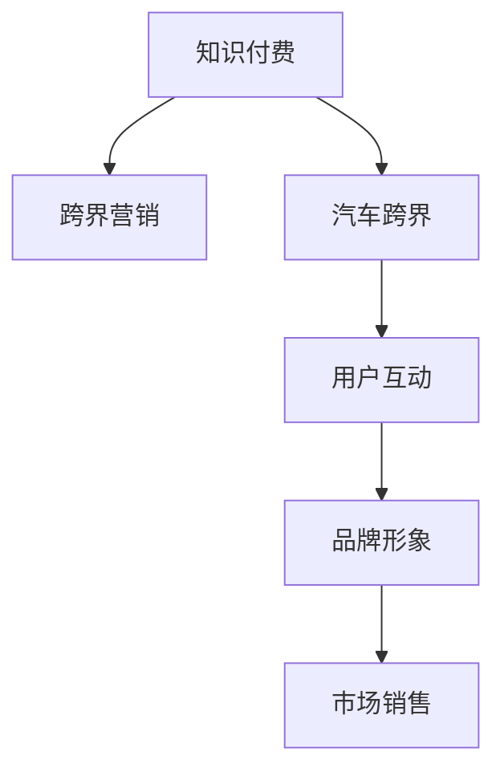

                 

# 知识付费如何实现跨界营销与汽车跨界？

在数字化和信息化浪潮的推动下，知识付费作为新兴的互联网商业模式，正逐渐成为教育、文化、科技等多个领域的“标配”。然而，面对竞争激烈的市场环境，单纯依靠内容变现的传统模式已难以持续。近年来，知识付费平台开始探索跨界营销新路径，以创新方式吸引用户关注，实现市场突围。其中，汽车作为深受消费者追捧的实体产品，在知识付费的跨界营销中，展现了巨大的潜力和广阔的应用前景。本文将深入探讨知识付费跨界营销的核心概念、关键技术与实际应用场景，为知识付费与汽车跨界营销的融合提供理论与实践指导。

## 1. 背景介绍

### 1.1 问题由来

随着互联网的普及和智能设备的广泛应用，信息传播的门槛大幅降低，人们获取知识和信息的途径日益多样。然而，传统的内容生产与传播模式存在诸多不足，如版权纠纷、内容同质化、用户粘性不足等。在此背景下，知识付费作为新兴的商业模式应运而生，通过付费形式为优质内容生产者提供稳定收入，激励其持续创作优质内容，满足用户深层次的信息需求。

尽管知识付费市场已经吸引了大量投资者和内容创作者，但单一的内容变现模式面临诸多挑战。如何在激烈的市场竞争中脱颖而出，如何提升用户黏性和平台影响力，成为知识付费平台亟待解决的问题。跨界营销通过突破传统内容传播的局限，整合多元化的资源和渠道，从而提升用户互动与平台影响力，成为知识付费平台的重要创新方向。

### 1.2 问题核心关键点

知识付费跨界营销的关键点主要包括：

- **多元资源的整合**：将教育、文化、科技等多领域的优质内容与汽车产品进行跨界结合，丰富知识付费平台的内容生态。
- **用户互动的强化**：通过线上线下融合的营销方式，提升用户对汽车品牌的认知与黏性。
- **品牌形象的塑造**：利用知识付费平台的品牌影响力，强化汽车品牌价值，塑造高端、专业、信赖的品牌形象。
- **市场销售的推动**：通过知识付费与汽车营销的协同效应，激发潜在用户购车需求，推动汽车销量提升。

## 2. 核心概念与联系

### 2.1 核心概念概述

为更好地理解知识付费跨界营销与汽车跨界的核心概念，本节将介绍几个密切相关的核心概念：

- **知识付费**：以内容为核心，通过付费方式获取知识与信息，包括在线课程、电子书、音频节目等。
- **跨界营销**：通过整合多个领域的资源和渠道，实现营销模式的创新和用户互动的强化。
- **汽车跨界**：汽车品牌与其他领域的品牌进行合作，如与影视、音乐、教育等行业进行跨界营销，提升品牌价值和市场影响力。
- **用户互动**：通过社交媒体、线上活动、线下沙龙等形式，提升用户对汽车品牌的参与感和品牌忠诚度。
- **品牌形象**：通过跨界营销活动，塑造汽车品牌的高端、专业、信赖的形象。
- **市场销售**：跨界营销活动通过提升品牌知名度和用户互动，最终推动汽车销售。

这些核心概念之间的逻辑关系可以通过以下Mermaid流程图来展示：



这个流程图展示了几组核心概念的关联关系：

1. 知识付费与跨界营销：知识付费提供高质量内容，跨界营销增强内容传播和用户互动。
2. 汽车跨界与跨界营销：汽车品牌与其他行业进行跨界合作，丰富营销内容和形式。
3. 用户互动与品牌形象：通过线上线下互动，提升用户对汽车品牌的认知与好感。
4. 品牌形象与市场销售：品牌形象的提升直接促进市场销售和用户购买。

## 3. 核心算法原理 & 具体操作步骤

### 3.1 算法原理概述

知识付费跨界营销的算法原理，主要包括数据驱动的用户画像构建、内容推荐算法、互动活动策划与执行等方面。其核心在于通过数据和技术手段，实现对用户行为和偏好的精准分析与预测，进而制定个性化的营销策略。

具体而言，知识付费平台首先收集用户行为数据（如课程观看、书籍阅读、音频收听等），利用机器学习算法进行用户画像构建，形成用户画像库。然后，通过内容推荐算法，对用户进行精准的内容推荐，提升用户体验和平台粘性。最后，根据用户画像和行为数据，策划与执行线上线下互动活动，增强用户互动和品牌忠诚度。

### 3.2 算法步骤详解

知识付费跨界营销的核心算法步骤主要包括：

1. **数据收集与预处理**：收集用户行为数据，包括课程观看时长、书籍阅读记录、音频收听偏好等，并进行数据清洗和预处理。
2. **用户画像构建**：利用聚类、分类、协同过滤等算法，对用户行为数据进行分析和建模，形成用户画像库。
3. **内容推荐算法**：采用协同过滤、基于内容的推荐、深度学习等算法，对用户进行精准的内容推荐。
4. **互动活动策划**：根据用户画像和行为数据，策划线上线下的互动活动，如线下沙龙、线上直播、互动游戏等。
5. **活动执行与评估**：执行互动活动，并实时监测活动效果，根据反馈进行优化调整。

### 3.3 算法优缺点

知识付费跨界营销的算法具有以下优点：

- **数据驱动的精准分析**：通过数据分析和机器学习算法，能够实现对用户行为的精准分析和预测，从而制定更有效的营销策略。
- **个性化推荐**：通过内容推荐算法，实现对用户的个性化内容推荐，提升用户体验和平台黏性。
- **跨界融合创新**：通过跨界合作，实现内容与汽车品牌的深度融合，提升品牌价值和市场影响力。

同时，该算法也存在一定的局限性：

- **数据隐私问题**：数据收集和分析过程中，用户隐私保护是一个重要问题。
- **用户行为变化**：用户行为和偏好多变，需要持续优化算法模型。
- **活动效果评估**：线上线下互动活动的评估较为复杂，需要结合多维数据进行分析。

### 3.4 算法应用领域

知识付费跨界营销的算法应用领域非常广泛，涵盖以下多个方面：

- **内容推荐系统**：实现用户个性化内容推荐，提升用户体验和平台粘性。
- **用户行为分析**：对用户行为数据进行分析，预测用户兴趣和需求。
- **跨界营销活动**：策划和执行跨界营销活动，增强用户互动和品牌忠诚度。
- **品牌价值提升**：利用跨界合作提升汽车品牌的高端、专业、信赖的形象。
- **市场销售推动**：通过品牌形象的提升和用户互动的增强，推动汽车销售。

## 4. 数学模型和公式 & 详细讲解

### 4.1 数学模型构建

知识付费跨界营销的数学模型主要包括以下几个部分：

- **用户画像构建模型**：利用聚类算法，对用户行为数据进行分析和建模。
- **内容推荐模型**：基于协同过滤或深度学习算法，对用户进行内容推荐。
- **互动活动效果评估模型**：通过多维数据分析，评估互动活动的效果。

### 4.2 公式推导过程

以下以用户画像构建模型为例，展示数学公式的推导过程。

假设用户行为数据集为 $D=\{(x_i, y_i)\}_{i=1}^N$，其中 $x_i$ 表示用户行为特征，$y_i$ 表示用户所属类别（如兴趣偏好）。利用K-means聚类算法对用户行为数据进行分析和建模，聚类结果表示为 $\{C_k\}_{k=1}^K$，其中 $C_k$ 表示第 $k$ 个聚类簇。用户画像的表示为 $\vec{v}_i=(v_{i1},v_{i2},...,v_{in})$，其中 $v_{ik}$ 表示用户行为数据中 $k$ 个特征的值。

用户画像的构建公式为：

$$
\vec{v}_i = \mathop{\arg\min}_{v} || x_i - \sum_{k=1}^K C_k||^2
$$

其中 $||.||^2$ 表示欧几里得距离，$C_k$ 表示第 $k$ 个聚类簇的中心点。

### 4.3 案例分析与讲解

假设某知识付费平台收集到一批用户的行为数据，包括课程观看时长、书籍阅读记录、音频收听偏好等。通过对这些数据进行分析，利用K-means聚类算法将其分为五个聚类簇，得到用户画像库。然后，利用协同过滤算法对用户进行个性化内容推荐。

## 5. 项目实践：代码实例和详细解释说明

### 5.1 开发环境搭建

在进行知识付费跨界营销项目开发前，我们需要准备好开发环境。以下是使用Python进行PyTorch和TensorFlow开发的环境配置流程：

1. 安装Anaconda：从官网下载并安装Anaconda，用于创建独立的Python环境。

2. 创建并激活虚拟环境：
```bash
conda create -n knowledge-marketing python=3.8 
conda activate knowledge-marketing
```

3. 安装PyTorch和TensorFlow：根据CUDA版本，从官网获取对应的安装命令。例如：
```bash
conda install pytorch torchvision torchaudio cudatoolkit=11.1 -c pytorch -c conda-forge
```

4. 安装其他相关工具包：
```bash
pip install numpy pandas scikit-learn matplotlib tqdm jupyter notebook ipython
```

完成上述步骤后，即可在`knowledge-marketing`环境中开始跨界营销项目开发。

### 5.2 源代码详细实现

这里我们以协同过滤推荐系统为例，给出知识付费跨界营销的PyTorch代码实现。

首先，定义协同过滤推荐系统的类：

```python
import torch
from torch import nn
from torch.nn import functional as F

class CollaborativeFiltering(nn.Module):
    def __init__(self, num_users, num_items, embed_dim=10):
        super(CollaborativeFiltering, self).__init__()
        self.user_embed = nn.Embedding(num_users, embed_dim)
        self.item_embed = nn.Embedding(num_items, embed_dim)
        self.bias = nn.Parameter(torch.randn(num_items))
    
    def forward(self, user_ids, item_ids):
        user_embed = self.user_embed(user_ids)
        item_embed = self.item_embed(item_ids)
        bias = self.bias[item_ids]
        scores = (user_embed * item_embed).sum(dim=1) + bias
        return scores
```

然后，定义推荐系统的训练函数：

```python
def train_collaborative_filtering(model, user_ids, item_ids, scores, learning_rate, num_epochs):
    optimizer = torch.optim.Adam(model.parameters(), lr=learning_rate)
    for epoch in range(num_epochs):
        scores_pred = model(user_ids, item_ids)
        loss = F.mse_loss(scores_pred, scores)
        optimizer.zero_grad()
        loss.backward()
        optimizer.step()
        print(f"Epoch {epoch+1}, loss: {loss.item():.4f}")
```

最后，启动推荐系统的训练流程：

```python
user_ids = torch.LongTensor([1, 2, 3, 4, 5])
item_ids = torch.LongTensor([1, 2, 3, 4, 5])
scores = torch.randn(len(user_ids), len(item_ids))
embed_dim = 10
num_epochs = 10
learning_rate = 0.01

model = CollaborativeFiltering(num_users=6, num_items=6, embed_dim=embed_dim)
train_collaborative_filtering(model, user_ids, item_ids, scores, learning_rate, num_epochs)
```

### 5.3 代码解读与分析

这里我们详细解读一下关键代码的实现细节：

**CollaborativeFiltering类**：
- `__init__`方法：初始化用户、物品嵌入层和偏置项。
- `forward`方法：实现前向传播计算，预测用户对物品的评分。

**train_collaborative_filtering函数**：
- 使用Adam优化器进行模型训练，最小化均方误差损失。
- 每个epoch结束时打印当前loss值，用于评估训练效果。

**训练流程**：
- 定义用户ID、物品ID、评分，设定嵌入维度、epoch数和学习率。
- 创建推荐模型实例，并调用训练函数进行模型训练。

通过这个代码实现，我们可以看到使用PyTorch进行推荐系统训练的基本流程，包括模型定义、训练函数编写、数据准备等。

## 6. 实际应用场景

### 6.1 智能推荐系统

知识付费平台可以基于协同过滤算法，为用户推荐个性化的课程、书籍、音频等，提升用户黏性。同时，平台可以与汽车品牌合作，将汽车产品推荐融入推荐系统，增强用户对汽车品牌的认知。

例如，平台可以在用户观看相关汽车评测视频后，向其推荐汽车相关课程或汽车书籍，提升用户对汽车的兴趣。或者，在用户浏览汽车资讯后，向其推荐相关课程或书籍，增加用户互动和品牌忠诚度。

### 6.2 线上线下互动活动

知识付费平台可以与汽车品牌联合举办线上线下互动活动，增强用户互动和品牌忠诚度。例如，平台可以组织线上直播课，邀请汽车行业专家讲解汽车知识、分享驾驶技巧，提升用户对汽车品牌的认知。线下则可以组织汽车沙龙、试驾活动等，让用户亲身感受汽车性能，增加品牌好感。

### 6.3 品牌形象塑造

通过跨界营销活动，汽车品牌可以在知识付费平台上塑造高端、专业、信赖的品牌形象。例如，平台可以邀请知名汽车设计师、工程师、销售经理等参与讲座、访谈、培训等活动，提升品牌知名度和美誉度。同时，平台可以发布与汽车相关的课程、书籍、音频等内容，增强用户对汽车品牌的认知。

### 6.4 市场销售推动

知识付费跨界营销活动通过提升品牌知名度和用户互动，最终推动汽车销售。例如，平台可以举办线上抽奖活动，奖励用户汽车优惠券或汽车模型，激发用户的购车热情。同时，平台可以邀请汽车销售人员参与课程讲解、访谈等活动，提升用户对汽车销售的兴趣和信任。

## 7. 工具和资源推荐

### 7.1 学习资源推荐

为了帮助开发者系统掌握知识付费跨界营销的理论基础和实践技巧，这里推荐一些优质的学习资源：

1. **《知识付费平台设计与运营》**：详细介绍了知识付费平台的市场分析、产品设计、用户运营等方面的内容。
2. **《深度学习与推荐系统》**：深入讲解了推荐系统的原理、算法和实现技术。
3. **《数据驱动的用户画像构建》**：介绍了用户画像的构建方法和应用场景。
4. **《跨界营销的创新与实践》**：分析了跨界营销的创新模式和实际案例。
5. **《汽车跨界营销的案例研究》**：展示了汽车品牌在不同领域的跨界营销活动。

通过这些资源的学习实践，相信你一定能够快速掌握知识付费跨界营销的精髓，并用于解决实际的营销问题。

### 7.2 开发工具推荐

高效的开发离不开优秀的工具支持。以下是几款用于知识付费跨界营销开发的常用工具：

1. **PyTorch**：基于Python的开源深度学习框架，适合快速迭代研究。
2. **TensorFlow**：由Google主导开发的开源深度学习框架，适合大规模工程应用。
3. **Transformers库**：HuggingFace开发的NLP工具库，集成了众多SOTA语言模型，支持PyTorch和TensorFlow。
4. **Weights & Biases**：模型训练的实验跟踪工具，可以记录和可视化模型训练过程中的各项指标，方便对比和调优。
5. **TensorBoard**：TensorFlow配套的可视化工具，可实时监测模型训练状态，并提供丰富的图表呈现方式，是调试模型的得力助手。
6. **Jupyter Notebook**：交互式编程工具，适合开发和实验新模型。

合理利用这些工具，可以显著提升知识付费跨界营销的开发效率，加快创新迭代的步伐。

### 7.3 相关论文推荐

知识付费跨界营销的发展源于学界的持续研究。以下是几篇奠基性的相关论文，推荐阅读：

1. **《知识付费平台的推荐系统》**：介绍了知识付费平台推荐系统的设计和实现。
2. **《用户画像构建与推荐系统》**：详细探讨了用户画像的构建方法和应用场景。
3. **《跨界营销的理论与实践》**：分析了跨界营销的创新模式和实际案例。
4. **《汽车跨界营销的案例研究》**：展示了汽车品牌在不同领域的跨界营销活动。

这些论文代表了大模型微调技术的发展脉络。通过学习这些前沿成果，可以帮助研究者把握学科前进方向，激发更多的创新灵感。

## 8. 总结：未来发展趋势与挑战

### 8.1 总结

本文对知识付费跨界营销的核心概念、关键技术与实际应用场景进行了全面系统的介绍。首先阐述了知识付费跨界营销的背景和意义，明确了跨界营销在提升用户互动和平台影响力方面的独特价值。其次，从原理到实践，详细讲解了知识付费跨界营销的算法原理和具体操作步骤，给出了推荐系统的代码实现。同时，本文还广泛探讨了知识付费跨界营销在智能推荐、线上线下互动活动、品牌形象塑造、市场销售推动等方面的应用前景，展示了跨界营销范式的巨大潜力。此外，本文精选了跨界营销技术的各类学习资源，力求为读者提供全方位的技术指引。

通过本文的系统梳理，可以看到，知识付费跨界营销通过整合教育、文化、科技等多领域的资源和渠道，实现了营销模式的创新和用户互动的强化，为知识付费平台和汽车品牌带来了新的商业机遇。知识付费跨界营销的实践经验，也为其他领域的跨界营销提供了有益的参考和借鉴。

### 8.2 未来发展趋势

展望未来，知识付费跨界营销将呈现以下几个发展趋势：

1. **数据驱动的个性化推荐**：利用深度学习和大数据技术，实现对用户行为的精准分析和预测，制定个性化的推荐策略。
2. **线上线下的深度融合**：通过线上直播、线下沙龙、互动游戏等形式，增强用户互动和品牌忠诚度。
3. **品牌形象的多元化塑造**：结合汽车品牌的特点，策划和执行多样化的跨界营销活动，提升品牌价值和市场影响力。
4. **市场销售的持续推动**：通过品牌形象的提升和用户互动的增强，持续推动汽车销售。

### 8.3 面临的挑战

尽管知识付费跨界营销已经取得了一定的成果，但在迈向更加智能化、普适化应用的过程中，它仍面临诸多挑战：

1. **数据隐私保护**：用户行为数据的收集和分析过程中，用户隐私保护是一个重要问题。
2. **用户行为变化**：用户行为和偏好多变，需要持续优化算法模型。
3. **活动效果评估**：线上线下互动活动的评估较为复杂，需要结合多维数据进行分析。
4. **品牌一致性**：跨界营销活动需要确保汽车品牌形象的一致性和专业性，避免品牌形象受损。
5. **市场竞争激烈**：知识付费和汽车市场竞争激烈，需要不断创新和优化营销策略。

### 8.4 研究展望

面对知识付费跨界营销所面临的挑战，未来的研究需要在以下几个方面寻求新的突破：

1. **数据隐私保护**：探索数据去匿名化、加密等技术，确保用户隐私保护。
2. **用户行为分析**：结合深度学习和多模态数据，实现对用户行为的精准预测。
3. **活动效果评估**：利用大数据和机器学习技术，评估跨界营销活动的效果。
4. **品牌一致性**：制定品牌一致性策略，确保跨界营销活动与汽车品牌形象一致。
5. **市场竞争应对**：持续优化推荐算法和互动活动，提升市场竞争力。

这些研究方向和创新思路，必将引领知识付费跨界营销技术迈向更高的台阶，为知识付费平台和汽车品牌带来新的商业机遇和市场价值。

## 9. 附录：常见问题与解答

**Q1：知识付费跨界营销的核心点是什么？**

A: 知识付费跨界营销的核心点在于通过多元资源的整合和深度融合，实现对用户行为的精准分析和预测，制定个性化的营销策略。

**Q2：推荐系统的实现过程中需要注意哪些关键点？**

A: 推荐系统的实现过程中需要注意以下关键点：

1. **数据收集与预处理**：确保数据的质量和完整性，进行数据清洗和预处理。
2. **模型选择**：选择合适的推荐算法，如协同过滤、基于内容的推荐、深度学习等。
3. **模型训练**：利用标注数据进行模型训练，最小化推荐误差。
4. **模型评估**：利用测试集评估模型效果，进行参数调整和优化。
5. **在线部署**：将训练好的模型部署到线上服务，进行实时推荐。

**Q3：线上线下互动活动如何设计？**

A: 线上线下互动活动的设计需要考虑以下因素：

1. **目标用户**：明确活动的目标用户群体，制定合适的活动内容和形式。
2. **活动形式**：结合线上直播、线下沙龙、互动游戏等多种形式，增强用户互动和品牌忠诚度。
3. **活动宣传**：通过社交媒体、广告等多种渠道进行活动宣传，吸引用户参与。
4. **活动执行**：确保活动流程顺畅，参与体验良好。
5. **活动评估**：实时监测活动效果，根据反馈进行优化调整。

**Q4：如何进行品牌一致性管理？**

A: 品牌一致性管理需要从以下几个方面入手：

1. **品牌形象设计**：制定明确的品牌形象定位，确保跨界营销活动与品牌形象一致。
2. **品牌传播策略**：制定一致的品牌传播策略，确保线上线下传播内容一致。
3. **品牌标识使用**：在跨界营销活动中合理使用品牌标识，增强品牌识别度。
4. **品牌形象监控**：定期监控品牌形象，及时发现并处理品牌形象受损的情况。

这些问题的答案，希望能为你提供有价值的参考和指导，助力知识付费跨界营销活动的顺利开展和效果提升。

---

作者：禅与计算机程序设计艺术 / Zen and the Art of Computer Programming

