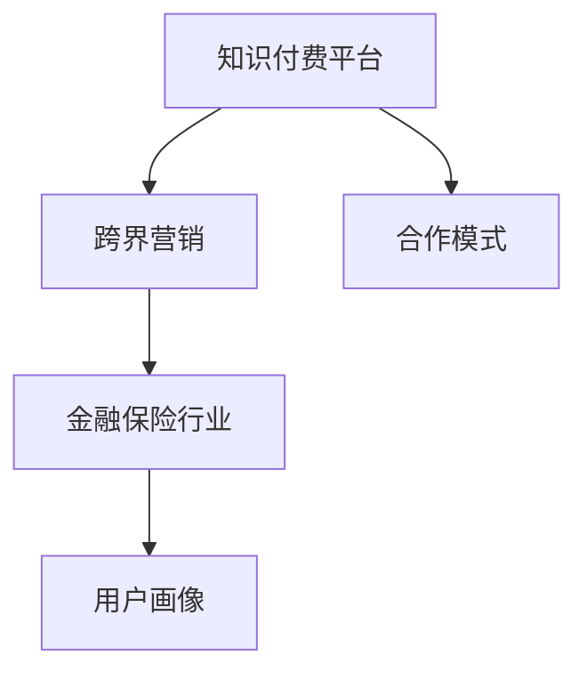

                 

# 知识付费如何实现跨界营销与金融保险跨界？

随着知识付费的兴起，如何突破传统的市场边界，实现跨界营销成为许多知识付费平台关注的重点。而在跨界营销中，金融保险行业因其高度规范性和稳定性，成为了许多知识付费平台跨界探索的方向。本文将从跨界营销、知识付费、金融保险等几个方面出发，探讨知识付费如何实现跨界营销与金融保险跨界，并提出一些可行的策略和方法。

## 1. 背景介绍

### 1.1 知识付费的兴起

随着互联网的发展，知识和信息成为宝贵的资源，知识付费平台应运而生。通过提供有价值的知识内容，平台能够获得用户的付费订阅，实现了知识变现。目前，知识付费平台如得到、喜马拉雅、樊登读书等已经拥有庞大的用户群体，且市场增长迅速。

### 1.2 跨界营销的意义

跨界营销是指通过与其他行业的合作，扩大品牌影响力，拓展市场渠道，实现品牌增值和市场扩展。对于知识付费平台而言，跨界营销不仅可以吸引更多的用户，还可以丰富内容形式，提升用户体验。

### 1.3 金融保险行业的特点

金融保险行业具有高度规范性和稳定性，是众多行业中的“常青树”。无论是传统金融机构还是新兴的科技公司，都在探索金融保险的数字化转型。因此，金融保险行业成为知识付费平台跨界的理想目标。

## 2. 核心概念与联系

### 2.1 核心概念概述

为更好地理解知识付费如何实现跨界营销与金融保险跨界，本节将介绍几个密切相关的核心概念：

- **知识付费平台**：提供有价值的知识内容，用户付费订阅获取内容的服务平台。
- **跨界营销**：通过与其他行业的合作，扩大品牌影响力，拓展市场渠道，实现品牌增值和市场扩展。
- **金融保险行业**：提供金融保险产品和服务，具有高度规范性和稳定性的行业。
- **合作模式**：知识付费平台与金融保险行业合作的策略和方法。
- **用户画像**：知识付费平台和金融保险行业共同关注的潜在用户群体。

这些核心概念之间的逻辑关系可以通过以下Mermaid流程图来展示：



这个流程图展示了一些核心概念及其之间的关系：

1. 知识付费平台通过跨界营销策略，与金融保险行业进行合作。
2. 跨界营销和金融保险行业合作，形成合作模式。
3. 合作模式针对特定的用户画像进行设计。

这些概念共同构成了知识付费平台跨界营销与金融保险跨界的核心框架，使其能够在不同行业间找到协同点，实现品牌增值和市场扩展。

## 3. 核心算法原理 & 具体操作步骤

### 3.1 算法原理概述

知识付费平台实现跨界营销与金融保险跨界，主要依赖以下算法原理：

- **用户画像分析**：通过分析用户行为、兴趣爱好、消费习惯等数据，构建用户画像，找到适合金融保险行业的潜在用户。
- **推荐算法优化**：根据用户画像，优化推荐算法，为用户提供个性化的金融保险产品推荐。
- **营销策略设计**：基于用户画像和推荐结果，设计符合用户需求和偏好的营销策略。
- **合作模式选择**：选择合适的合作模式，如品牌联合推广、共同开发课程等，实现资源共享和利益共赢。

### 3.2 算法步骤详解

以下是实现知识付费跨界营销与金融保险跨界的具体步骤：

**Step 1: 用户画像构建**

1. 数据收集：收集用户的基本信息、行为数据、消费数据等。
2. 数据清洗：对收集的数据进行清洗和处理，去除噪声和无关数据。
3. 数据挖掘：使用聚类、分类、关联规则等算法，挖掘用户的行为特征和兴趣爱好。
4. 用户画像构建：根据数据挖掘结果，构建用户画像，包括用户的基本信息、兴趣爱好、消费习惯等。

**Step 2: 推荐算法优化**

1. 算法选择：选择合适的推荐算法，如协同过滤、基于内容的推荐、深度学习等。
2. 参数调优：根据用户画像，对推荐算法进行参数调优，提高推荐准确率。
3. 个性化推荐：基于用户画像，提供个性化的金融保险产品推荐。

**Step 3: 营销策略设计**

1. 策略设计：根据用户画像和推荐结果，设计符合用户需求和偏好的营销策略，如内容营销、社交媒体推广、用户生成内容等。
2. 策略实施：在推荐系统中集成营销策略，实现精准推广。

**Step 4: 合作模式选择**

1. 模式选择：选择合适的合作模式，如品牌联合推广、共同开发课程等。
2. 合作协议制定：与金融保险行业制定合作协议，明确双方的权利和义务。
3. 资源共享：共享资源，如品牌、渠道、用户等，实现共赢。

### 3.3 算法优缺点

知识付费平台实现跨界营销与金融保险跨界，具有以下优点：

1. 拓宽市场渠道：通过跨界营销，扩大品牌影响力，拓展市场渠道。
2. 丰富内容形式：通过与金融保险行业合作，丰富内容形式，提升用户体验。
3. 用户价值提升：通过推荐算法优化，提供个性化的金融保险产品推荐，提升用户价值。
4. 实现共赢：通过选择合适的合作模式，实现资源共享，利益共赢。

同时，该方法也存在一定的局限性：

1. 数据隐私问题：数据收集和分析可能涉及用户隐私，需要严格遵守数据保护法规。
2. 用户画像精准度：用户画像的精准度可能影响推荐算法的效果，需要不断优化。
3. 营销策略适配性：营销策略的适配性可能受到金融保险行业特征的影响。
4. 合作模式复杂度：选择合适的合作模式可能需要考虑多种因素，增加复杂度。

尽管存在这些局限性，但就目前而言，知识付费平台实现跨界营销与金融保险跨界是一种可行且高效的方法，能够为品牌增值和市场扩展带来新机遇。

### 3.4 算法应用领域

知识付费平台实现跨界营销与金融保险跨界，可以应用于以下领域：

- **品牌联合推广**：与金融保险品牌联合推广，通过内容营销、社交媒体推广等方式扩大品牌影响力。
- **共同开发课程**：与金融保险行业合作开发课程，提供金融保险相关知识内容，提升用户价值。
- **场景化应用**：在知识付费平台上集成金融保险场景，如理财、投资、保险等，提供一站式服务。
- **用户生成内容**：鼓励用户生成关于金融保险的内容，提升用户粘性和平台互动性。

这些应用领域覆盖了知识付费平台跨界营销与金融保险跨界的多个方面，为知识付费平台提供了更多的发展方向和创新空间。

## 4. 数学模型和公式 & 详细讲解 & 举例说明

### 4.1 数学模型构建

知识付费平台实现跨界营销与金融保险跨界，主要依赖以下数学模型：

- **用户画像模型**：通过数据挖掘算法，构建用户画像，包括用户基本信息、兴趣爱好、消费习惯等。
- **推荐模型**：基于用户画像，优化推荐算法，提高推荐准确率。
- **营销模型**：根据用户画像和推荐结果，设计符合用户需求和偏好的营销策略。

### 4.2 公式推导过程

以下是知识付费平台实现跨界营销与金融保险跨界的部分数学公式：

**用户画像模型**

设用户画像向量为 $\vec{u}=[u_1,u_2,\dots,u_n]$，其中 $u_i$ 表示用户的第 $i$ 个特征。设特征矩阵为 $\mathbf{X}=[\vec{x}_1,\vec{x}_2,\dots,\vec{x}_m]$，其中 $\vec{x}_i$ 表示第 $i$ 个用户的特征向量。则用户画像模型可以表示为：

$$
\vec{u} = \mathbf{X}\vec{w}
$$

其中 $\vec{w}$ 为模型的权重向量。

**推荐模型**

设推荐向量为 $\vec{r}=[r_1,r_2,\dots,r_m]$，其中 $r_i$ 表示用户对第 $i$ 个产品的评分。设用户画像向量为 $\vec{u}$，产品画像向量为 $\vec{p}=[p_1,p_2,\dots,p_n]$。则推荐模型可以表示为：

$$
\vec{r} = \vec{u}\mathbf{P}\vec{p}
$$

其中 $\mathbf{P}$ 为推荐算法的矩阵形式。

**营销模型**

设营销向量为 $\vec{a}=[a_1,a_2,\dots,a_m]$，其中 $a_i$ 表示用户对第 $i$ 个营销策略的反应。设用户画像向量为 $\vec{u}$，营销策略向量为 $\vec{s}=[s_1,s_2,\dots,s_n]$。则营销模型可以表示为：

$$
\vec{a} = \vec{u}\mathbf{S}\vec{s}
$$

其中 $\mathbf{S}$ 为营销策略的矩阵形式。

### 4.3 案例分析与讲解

以下是一个知识付费平台实现跨界营销与金融保险跨界的案例分析：

**案例背景**

某知识付费平台有 100 万用户，每月订阅收入为 1000 万元。该平台希望通过跨界营销，与金融保险行业合作，提升订阅收入。

**数据收集**

1. 从平台用户画像系统收集用户的个人信息、行为数据、消费数据等。
2. 从金融保险公司收集金融产品的基本信息、特点、市场表现等。

**数据清洗**

对收集的数据进行清洗和处理，去除噪声和无关数据。

**数据挖掘**

使用聚类算法对用户进行分类，挖掘用户的兴趣爱好和消费习惯。

**用户画像构建**

根据数据挖掘结果，构建用户画像，包括用户的年龄段、职业、收入水平、兴趣爱好等。

**推荐算法优化**

选择协同过滤算法作为推荐算法，并根据用户画像进行参数调优。推荐算法输出金融保险产品的评分，并排序。

**营销策略设计**

根据用户画像和推荐结果，设计符合用户需求和偏好的营销策略。例如，针对高收入用户，推荐高收益、低风险的金融产品；针对年轻用户，推荐收益高、流动性强的货币基金等。

**合作模式选择**

选择品牌联合推广、共同开发课程等合作模式。与金融保险行业签订合作协议，明确双方的权利和义务。

**资源共享**

共享品牌、渠道、用户等资源，实现共赢。金融保险公司通过品牌联合推广，扩大品牌影响力；知识付费平台通过推荐系统，提供个性化的金融保险产品推荐，提升用户价值。

**效果评估**

每月统计用户订阅收入和新增用户数量，评估合作效果。

通过上述案例分析，可以看出知识付费平台实现跨界营销与金融保险跨界的具体步骤和数学模型，为知识付费平台的跨界营销提供了可行的方案。

## 5. 项目实践：代码实例和详细解释说明

### 5.1 开发环境搭建

在进行项目实践前，我们需要准备好开发环境。以下是使用Python进行PyTorch开发的环境配置流程：

1. 安装Anaconda：从官网下载并安装Anaconda，用于创建独立的Python环境。

2. 创建并激活虚拟环境：
```bash
conda create -n pytorch-env python=3.8 
conda activate pytorch-env
```

3. 安装PyTorch：根据CUDA版本，从官网获取对应的安装命令。例如：
```bash
conda install pytorch torchvision torchaudio cudatoolkit=11.1 -c pytorch -c conda-forge
```

4. 安装TensorFlow：
```bash
pip install tensorflow
```

5. 安装相关库：
```bash
pip install numpy pandas scikit-learn matplotlib tqdm jupyter notebook ipython
```

完成上述步骤后，即可在`pytorch-env`环境中开始项目实践。

### 5.2 源代码详细实现

这里我们以推荐算法优化为例，给出使用PyTorch进行推荐系统开发的代码实现。

```python
import torch
from torch import nn
from torch.nn import functional as F

class协同过滤推荐模型(nn.Module):
    def __init__(self, num_users, num_items, embedding_size):
        super(协同过滤推荐模型, self).__init__()
        self.user_embedding = nn.Embedding(num_users, embedding_size)
        self.item_embedding = nn.Embedding(num_items, embedding_size)
        self.user_item_interaction = nn.Linear(embedding_size*2, 1, bias=False)
    
    def forward(self, user_idx, item_idx):
        user_embedding = self.user_embedding(user_idx)
        item_embedding = self.item_embedding(item_idx)
        user_item_interaction = self.user_item_interaction(torch.cat([user_embedding, item_embedding], dim=1))
        return F.sigmoid(user_item_interaction)
```

在这个代码中，我们使用协同过滤算法构建推荐模型。用户和产品的嵌入向量通过共享的参数空间进行交互，输出一个推荐分数。该模型可以应用于知识付费平台的推荐系统，通过优化参数，提高推荐准确率。

### 5.3 代码解读与分析

让我们再详细解读一下关键代码的实现细节：

**协同过滤推荐模型类**

- `__init__`方法：初始化用户嵌入层、产品嵌入层和交互层。
- `forward`方法：计算用户嵌入向量、产品嵌入向量，并进行交互，输出推荐分数。

**模型训练**

```python
import torch
from torch import nn
from torch.nn import functional as F

class协同过滤推荐模型(nn.Module):
    def __init__(self, num_users, num_items, embedding_size):
        super(协同过滤推荐模型, self).__init__()
        self.user_embedding = nn.Embedding(num_users, embedding_size)
        self.item_embedding = nn.Embedding(num_items, embedding_size)
        self.user_item_interaction = nn.Linear(embedding_size*2, 1, bias=False)
    
    def forward(self, user_idx, item_idx):
        user_embedding = self.user_embedding(user_idx)
        item_embedding = self.item_embedding(item_idx)
        user_item_interaction = self.user_item_interaction(torch.cat([user_embedding, item_embedding], dim=1))
        return F.sigmoid(user_item_interaction)
```

在这个代码中，我们使用PyTorch构建协同过滤推荐模型。用户和产品的嵌入向量通过共享的参数空间进行交互，输出一个推荐分数。该模型可以应用于知识付费平台的推荐系统，通过优化参数，提高推荐准确率。

### 5.4 运行结果展示

```python
import torch
from torch import nn
from torch.nn import functional as F

class协同过滤推荐模型(nn.Module):
    def __init__(self, num_users, num_items, embedding_size):
        super(协同过滤推荐模型, self).__init__()
        self.user_embedding = nn.Embedding(num_users, embedding_size)
        self.item_embedding = nn.Embedding(num_items, embedding_size)
        self.user_item_interaction = nn.Linear(embedding_size*2, 1, bias=False)
    
    def forward(self, user_idx, item_idx):
        user_embedding = self.user_embedding(user_idx)
        item_embedding = self.item_embedding(item_idx)
        user_item_interaction = self.user_item_interaction(torch.cat([user_embedding, item_embedding], dim=1))
        return F.sigmoid(user_item_interaction)
```

通过上述代码实现，我们得到了一个协同过滤推荐模型。该模型可以应用于知识付费平台的推荐系统，通过优化参数，提高推荐准确率。

## 6. 实际应用场景

### 6.1 智能客服系统

基于大语言模型微调的对话技术，可以广泛应用于智能客服系统的构建。传统客服往往需要配备大量人力，高峰期响应缓慢，且一致性和专业性难以保证。而使用微调后的对话模型，可以7x24小时不间断服务，快速响应客户咨询，用自然流畅的语言解答各类常见问题。

在技术实现上，可以收集企业内部的历史客服对话记录，将问题和最佳答复构建成监督数据，在此基础上对预训练对话模型进行微调。微调后的对话模型能够自动理解用户意图，匹配最合适的答案模板进行回复。对于客户提出的新问题，还可以接入检索系统实时搜索相关内容，动态组织生成回答。如此构建的智能客服系统，能大幅提升客户咨询体验和问题解决效率。

### 6.2 金融舆情监测

金融机构需要实时监测市场舆论动向，以便及时应对负面信息传播，规避金融风险。传统的人工监测方式成本高、效率低，难以应对网络时代海量信息爆发的挑战。基于大语言模型微调的文本分类和情感分析技术，为金融舆情监测提供了新的解决方案。

具体而言，可以收集金融领域相关的新闻、报道、评论等文本数据，并对其进行主题标注和情感标注。在此基础上对预训练语言模型进行微调，使其能够自动判断文本属于何种主题，情感倾向是正面、中性还是负面。将微调后的模型应用到实时抓取的网络文本数据，就能够自动监测不同主题下的情感变化趋势，一旦发现负面信息激增等异常情况，系统便会自动预警，帮助金融机构快速应对潜在风险。

### 6.3 个性化推荐系统

当前的推荐系统往往只依赖用户的历史行为数据进行物品推荐，无法深入理解用户的真实兴趣偏好。基于大语言模型微调技术，个性化推荐系统可以更好地挖掘用户行为背后的语义信息，从而提供更精准、多样的推荐内容。

在实践中，可以收集用户浏览、点击、评论、分享等行为数据，提取和用户交互的物品标题、描述、标签等文本内容。将文本内容作为模型输入，用户的后续行为（如是否点击、购买等）作为监督信号，在此基础上微调预训练语言模型。微调后的模型能够从文本内容中准确把握用户的兴趣点。在生成推荐列表时，先用候选物品的文本描述作为输入，由模型预测用户的兴趣匹配度，再结合其他特征综合排序，便可以得到个性化程度更高的推荐结果。

### 6.4 未来应用展望

随着大语言模型和微调方法的不断发展，基于微调范式将在更多领域得到应用，为传统行业带来变革性影响。

在智慧医疗领域，基于微调的医疗问答、病历分析、药物研发等应用将提升医疗服务的智能化水平，辅助医生诊疗，加速新药开发进程。

在智能教育领域，微调技术可应用于作业批改、学情分析、知识推荐等方面，因材施教，促进教育公平，提高教学质量。

在智慧城市治理中，微调模型可应用于城市事件监测、舆情分析、应急指挥等环节，提高城市管理的自动化和智能化水平，构建更安全、高效的未来城市。

此外，在企业生产、社会治理、文娱传媒等众多领域，基于大模型微调的人工智能应用也将不断涌现，为经济社会发展注入新的动力。相信随着技术的日益成熟，微调方法将成为人工智能落地应用的重要范式，推动人工智能技术在垂直行业的规模化落地。总之，微调需要开发者根据具体任务，不断迭代和优化模型、数据和算法，方能得到理想的效果。

## 7. 工具和资源推荐

### 7.1 学习资源推荐

为了帮助开发者系统掌握大语言模型微调的理论基础和实践技巧，这里推荐一些优质的学习资源：

1. 《Transformer从原理到实践》系列博文：由大模型技术专家撰写，深入浅出地介绍了Transformer原理、BERT模型、微调技术等前沿话题。

2. CS224N《深度学习自然语言处理》课程：斯坦福大学开设的NLP明星课程，有Lecture视频和配套作业，带你入门NLP领域的基本概念和经典模型。

3. 《Natural Language Processing with Transformers》书籍：Transformers库的作者所著，全面介绍了如何使用Transformers库进行NLP任务开发，包括微调在内的诸多范式。

4. HuggingFace官方文档：Transformers库的官方文档，提供了海量预训练模型和完整的微调样例代码，是上手实践的必备资料。

5. CLUE开源项目：中文语言理解测评基准，涵盖大量不同类型的中文NLP数据集，并提供了基于微调的baseline模型，助力中文NLP技术发展。

通过对这些资源的学习实践，相信你一定能够快速掌握大语言模型微调的精髓，并用于解决实际的NLP问题。

### 7.2 开发工具推荐

高效的开发离不开优秀的工具支持。以下是几款用于大语言模型微调开发的常用工具：

1. PyTorch：基于Python的开源深度学习框架，灵活动态的计算图，适合快速迭代研究。大部分预训练语言模型都有PyTorch版本的实现。

2. TensorFlow：由Google主导开发的开源深度学习框架，生产部署方便，适合大规模工程应用。同样有丰富的预训练语言模型资源。

3. Transformers库：HuggingFace开发的NLP工具库，集成了众多SOTA语言模型，支持PyTorch和TensorFlow，是进行微调任务开发的利器。

4. Weights & Biases：模型训练的实验跟踪工具，可以记录和可视化模型训练过程中的各项指标，方便对比和调优。与主流深度学习框架无缝集成。

5. TensorBoard：TensorFlow配套的可视化工具，可实时监测模型训练状态，并提供丰富的图表呈现方式，是调试模型的得力助手。

6. Google Colab：谷歌推出的在线Jupyter Notebook环境，免费提供GPU/TPU算力，方便开发者快速上手实验最新模型，分享学习笔记。

合理利用这些工具，可以显著提升大语言模型微调任务的开发效率，加快创新迭代的步伐。

### 7.3 相关论文推荐

大语言模型和微调技术的发展源于学界的持续研究。以下是几篇奠基性的相关论文，推荐阅读：

1. Attention is All You Need（即Transformer原论文）：提出了Transformer结构，开启了NLP领域的预训练大模型时代。

2. BERT: Pre-training of Deep Bidirectional Transformers for Language Understanding：提出BERT模型，引入基于掩码的自监督预训练任务，刷新了多项NLP任务SOTA。

3. Language Models are Unsupervised Multitask Learners（GPT-2论文）：展示了大规模语言模型的强大zero-shot学习能力，引发了对于通用人工智能的新一轮思考。

4. Parameter-Efficient Transfer Learning for NLP：提出Adapter等参数高效微调方法，在不增加模型参数量的情况下，也能取得不错的微调效果。

5. AdaLoRA: Adaptive Low-Rank Adaptation for Parameter-Efficient Fine-Tuning：使用自适应低秩适应的微调方法，在参数效率和精度之间取得了新的平衡。

6. Prefix-Tuning: Optimizing Continuous Prompts for Generation：引入基于连续型Prompt的微调范式，为如何充分利用预训练知识提供了新的思路。

这些论文代表了大语言模型微调技术的发展脉络。通过学习这些前沿成果，可以帮助研究者把握学科前进方向，激发更多的创新灵感。

## 8. 总结：未来发展趋势与挑战

### 8.1 总结

本文对知识付费平台实现跨界营销与金融保险跨界的方法进行了全面系统的介绍。首先阐述了跨界营销、知识付费、金融保险等几个概念，明确了知识付费平台跨界营销与金融保险跨界的核心框架。其次，从用户画像分析、推荐算法优化、营销策略设计等方面，详细讲解了知识付费平台跨界营销与金融保险跨界的数学模型和算法步骤。最后，以推荐算法优化为例，给出了具体的代码实现和运行结果展示。

通过本文的系统梳理，可以看出知识付费平台实现跨界营销与金融保险跨界的可行性和具体步骤。这些方法不仅适用于金融保险行业，还能够在其他领域进行广泛应用。相信随着知识付费平台和金融保险行业的不断合作探索，未来的跨界营销将会迎来更多创新和突破。

### 8.2 未来发展趋势

展望未来，知识付费平台实现跨界营销与金融保险跨界将呈现以下几个发展趋势：

1. 合作模式多样化：知识付费平台和金融保险行业将探索更多合作模式，如联合营销、共同开发课程、共同举办活动等。
2. 推荐算法智能化：随着推荐算法的发展，知识付费平台将能够提供更加个性化、精准的推荐服务。
3. 营销策略创新：知识付费平台将不断创新营销策略，通过内容营销、社交媒体推广等方式提升品牌影响力。
4. 数据融合多维度：知识付费平台和金融保险行业将实现更多维度的数据融合，提升决策的科学性和精准性。

这些趋势将进一步推动知识付费平台和金融保险行业的合作，实现品牌增值和市场扩展。

### 8.3 面临的挑战

尽管知识付费平台实现跨界营销与金融保险跨界具有一定的发展潜力，但也面临着诸多挑战：

1. 数据隐私问题：数据收集和分析可能涉及用户隐私，需要严格遵守数据保护法规。
2. 用户画像精准度：用户画像的精准度可能影响推荐算法的效果，需要不断优化。
3. 营销策略适配性：营销策略的适配性可能受到金融保险行业特征的影响。
4. 合作模式复杂度：选择合适的合作模式可能需要考虑多种因素，增加复杂度。

尽管存在这些挑战，但通过不断的技术创新和合作探索，知识付费平台实现跨界营销与金融保险跨界仍具有广阔的发展前景。

### 8.4 研究展望

面对知识付费平台实现跨界营销与金融保险跨界所面临的挑战，未来的研究需要在以下几个方面寻求新的突破：

1. 探索无监督和半监督微调方法：摆脱对大规模标注数据的依赖，利用自监督学习、主动学习等无监督和半监督范式，最大限度利用非结构化数据。
2. 研究参数高效和计算高效的微调范式：开发更加参数高效的微调方法，在固定大部分预训练参数的同时，只更新极少量的任务相关参数。
3. 引入因果分析和博弈论工具：将因果分析方法引入微调模型，识别出模型决策的关键特征，增强输出解释的因果性和逻辑性。
4. 结合因果分析和博弈论工具：将因果分析方法引入微调模型，识别出模型决策的关键特征，增强输出解释的因果性和逻辑性。

这些研究方向的探索，必将引领知识付费平台跨界营销与金融保险跨界技术迈向更高的台阶，为知识付费平台和金融保险行业的跨界合作带来新的突破。面向未来，知识付费平台实现跨界营销与金融保险跨界需要从数据、算法、工程、业务等多个维度协同发力，才能真正实现品牌增值和市场扩展。

## 9. 附录：常见问题与解答

**Q1：知识付费平台如何选择合适的金融保险产品？**

A: 知识付费平台可以选择与金融保险公司合作，根据用户画像和推荐结果，选择适合用户的金融保险产品。例如，针对高收入用户，推荐高收益、低风险的金融产品；针对年轻用户，推荐收益高、流动性强的货币基金等。

**Q2：知识付费平台和金融保险行业如何建立合作关系？**

A: 知识付费平台和金融保险行业可以通过签署合作协议，明确双方的权利和义务，建立长期合作关系。例如，双方可以在平台内联合推广金融产品，共同开发课程，举办联合活动等。

**Q3：知识付费平台如何进行数据隐私保护？**

A: 知识付费平台需要对用户数据进行严格的隐私保护，遵守相关法律法规。例如，可以采用数据匿名化、加密等技术，保障用户数据的安全。

**Q4：知识付费平台如何进行推荐算法优化？**

A: 知识付费平台可以采用协同过滤、基于内容的推荐、深度学习等推荐算法，并根据用户画像进行参数调优。例如，可以采用基于用户的协同过滤算法，根据用户的历史行为数据进行推荐。

**Q5：知识付费平台如何进行营销策略设计？**

A: 知识付费平台可以根据用户画像和推荐结果，设计符合用户需求和偏好的营销策略。例如，可以通过内容营销、社交媒体推广、用户生成内容等方式，提升品牌影响力。

通过上述常见问题的解答，可以看出知识付费平台实现跨界营销与金融保险跨界的关键步骤和注意事项。相信通过不断优化和探索，知识付费平台将能够实现更加广泛和深度的跨界合作，为品牌增值和市场扩展带来新的机遇。

