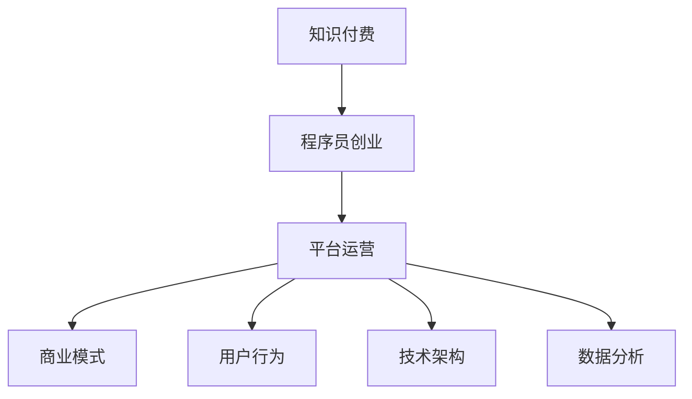

                 

# 知识付费平台运营:程序员创业案例分析

> 关键词：知识付费, 程序员创业, 平台运营, 商业模式, 用户行为, 技术架构, 数据分析

## 1. 背景介绍

在数字经济蓬勃发展的今天，知识付费已经成为互联网新经济的重要组成部分。随着互联网用户对知识消费需求的日益增长，越来越多的人开始关注通过付费获取优质内容，而不仅仅是免费的新闻资讯。程序员作为互联网技术的创造者和使用者，自然也敏锐地察觉到了这一市场机会，纷纷加入知识付费的创业大军，通过各种形式的知识付费平台输出自己的专业知识和技能，谋求商业价值和职业发展的新路径。本文将通过几个具有代表性的程序员创业案例，深入分析知识付费平台运营的商业模式、技术架构和用户行为，探究这一领域的未来发展趋势和面临的挑战。

## 2. 核心概念与联系

### 2.1 核心概念概述

在探讨知识付费平台的运营之前，首先需要理解一些核心概念及其相互之间的联系：

- **知识付费**：基于互联网和移动技术，用户为获取专业知识、技能和经验等付费的行为。包括在线课程、专栏文章、专业咨询等多种形式。
- **程序员创业**：利用自身的编程技术和互联网思维，自主创业，开发知识付费平台，为用户提供有价值的内容。
- **平台运营**：知识付费平台的管理和运营，包括内容生产、用户管理、市场推广、数据监控等环节。
- **商业模式**：知识付费平台盈利的方式，如订阅模式、按需付费、打赏模式等。
- **用户行为**：用户在知识付费平台上的消费、学习、互动等行为模式，包括搜索行为、浏览行为、购买行为、评价行为等。
- **技术架构**：知识付费平台的技术实现架构，包括前端、后端、数据库、云服务、API接口等。
- **数据分析**：通过数据挖掘和机器学习技术，分析用户行为数据，发现用户需求，优化平台运营策略。

这些概念之间的逻辑关系可以通过以下Mermaid流程图来展示：



## 3. 核心算法原理 & 具体操作步骤

### 3.1 算法原理概述

知识付费平台的运营涉及多个领域的核心算法和技术，主要包括内容推荐算法、用户行为分析算法、个性化定价算法、市场营销算法等。这些算法通过复杂的计算模型，对用户行为数据进行深度学习，以实现平台的智能运营和高效盈利。

- **内容推荐算法**：根据用户的历史行为数据，推荐与用户兴趣匹配的内容，提升用户满意度和留存率。
- **用户行为分析算法**：通过数据挖掘技术，分析用户的行为模式，发现用户偏好和需求变化，优化内容和价格策略。
- **个性化定价算法**：根据用户的具体行为特征和市场供需关系，动态调整课程价格，实现最大化利润。
- **市场营销算法**：利用机器学习和广告技术，精准投放广告，吸引新用户和转化潜在用户。

### 3.2 算法步骤详解

以内容推荐算法为例，下面详细讲解其核心步骤：

**Step 1: 数据收集与预处理**

- 收集用户的行为数据，包括浏览记录、购买记录、评分记录等。
- 对数据进行清洗和归一化处理，去除噪声和异常值，保证数据质量。

**Step 2: 特征提取与选择**

- 将用户行为数据转化为模型可以处理的特征向量。
- 使用特征选择算法，选择与用户偏好最相关的特征。

**Step 3: 模型训练与优化**

- 选择合适的推荐算法，如协同过滤、深度学习、矩阵分解等。
- 使用历史数据对模型进行训练，并不断调整模型参数，提高预测准确率。

**Step 4: 实时推荐**

- 对实时用户请求进行特征提取和模型预测，获取推荐结果。
- 对推荐结果进行展示和排序，提高用户满意度。

**Step 5: 反馈循环与迭代改进**

- 根据用户对推荐内容的反馈，调整模型参数，优化推荐效果。
- 定期更新数据和模型，保持系统性能的稳定性和时效性。

### 3.3 算法优缺点

- **优点**：
  - 能够精准预测用户需求，提升用户体验和平台留存率。
  - 能够优化资源配置，提高运营效率和利润率。
  - 能够持续改进，适应市场变化和用户需求变化。

- **缺点**：
  - 数据质量和特征提取对推荐效果有很大影响，需要严格的数据管理和特征工程。
  - 推荐算法复杂度较高，需要较大的计算资源和时间成本。
  - 用户的个性化需求难以完全满足，推荐效果有待进一步提升。

### 3.4 算法应用领域

基于推荐算法的知识付费平台运营技术，已经在各类在线教育平台、技术社区、专业咨询平台等多个领域得到了广泛应用。这些平台通过推荐算法，能够有效提升用户参与度和满意度，增加内容消费和平台收入。

## 4. 数学模型和公式 & 详细讲解 & 举例说明

### 4.1 数学模型构建

在推荐算法中，常见的数学模型包括协同过滤、矩阵分解、深度学习等。这里以矩阵分解模型为例，构建推荐算法的数学模型。

假设用户-物品评分矩阵为 $R \in \mathbb{R}^{m \times n}$，其中 $m$ 表示用户数，$n$ 表示物品数。矩阵 $U \in \mathbb{R}^{m \times k}$ 和 $V \in \mathbb{R}^{n \times k}$ 分别为用户和物品的潜在因子矩阵。则矩阵分解的推荐模型可以表示为：

$$
R_{ij} = \langle U_i, V_j \rangle
$$

其中 $\langle \cdot, \cdot \rangle$ 表示向量的内积运算。

### 4.2 公式推导过程

以矩阵分解为例，推导其推荐模型的计算公式。

假设用户 $i$ 和物品 $j$ 的评分矩阵分解为 $R_{ij} = U_iV_j^T$。根据矩阵分解，用户 $i$ 对物品 $j$ 的评分可以表示为：

$$
R_{ij} \approx \langle U_i, V_j \rangle = \sum_{k=1}^k U_{ik}V_{jk}
$$

将上式展开，得到推荐算法的计算公式：

$$
R_{ij} \approx \sum_{k=1}^k U_{ik}V_{jk}
$$

其中 $U_{ik}$ 和 $V_{jk}$ 分别为用户和物品的潜在因子。

### 4.3 案例分析与讲解

以知识付费平台Coursera为例，其内容推荐系统使用了矩阵分解和协同过滤算法。Coursera通过收集用户的历史浏览记录和评分数据，构建用户-课程评分矩阵 $R$。然后，使用矩阵分解模型 $R_{ij} = \langle U_i, V_j \rangle$ 对用户 $i$ 对课程 $j$ 的评分进行预测，为用户推荐最感兴趣的课程。通过不断调整用户和课程的潜在因子矩阵 $U$ 和 $V$，Coursera实现了高效的推荐效果，提升了用户满意度和课程购买率。

## 5. 项目实践：代码实例和详细解释说明

### 5.1 开发环境搭建

要进行知识付费平台的开发，首先需要搭建一个完整的开发环境。以下是一个简单的搭建流程：

1. 安装Python 3.x版本。
2. 安装必要的依赖库，如TensorFlow、Keras、Numpy、Pandas等。
3. 安装Web框架，如Flask、Django等。
4. 搭建数据库，如MySQL、PostgreSQL等。
5. 配置云服务，如AWS、Azure等。

### 5.2 源代码详细实现

以下是使用Python Flask框架进行知识付费平台开发的示例代码：

```python
from flask import Flask, request, jsonify
from tensorflow.keras.models import Sequential
from tensorflow.keras.layers import Dense
import pandas as pd

app = Flask(__name__)

# 定义推荐模型
def build_recommendation_model():
    model = Sequential()
    model.add(Dense(64, input_dim=100, activation='relu'))
    model.add(Dense(32, activation='relu'))
    model.add(Dense(1, activation='sigmoid'))
    model.compile(loss='binary_crossentropy', optimizer='adam', metrics=['accuracy'])
    return model

# 加载数据
def load_data(path):
    df = pd.read_csv(path)
    return df

# 预处理数据
def preprocess_data(df):
    df = df.dropna()
    X = df[['feature1', 'feature2', 'feature3']]
    y = df['label']
    return X, y

# 训练模型
def train_model(X, y, model):
    model.fit(X, y, epochs=10, batch_size=32, validation_split=0.2)
    return model

# 推荐函数
def recommend(user_id, model):
    user_data = load_data('user_data.csv')
    user_data = preprocess_data(user_data)
    user = user_data[user_data['user_id'] == user_id]
    user_X = user_data[['feature1', 'feature2', 'feature3']]
    user_y = user_data['label']
    user_X = user_X.to_numpy()
    user_y = user_y.to_numpy()
    user_y = user_y.reshape(-1, 1)
    prediction = model.predict(user_X)
    return prediction

if __name__ == '__main__':
    model = build_recommendation_model()
    X, y = preprocess_data('data.csv')
    model = train_model(X, y, model)
    user_id = 1
    prediction = recommend(user_id, model)
    print(prediction)
```

### 5.3 代码解读与分析

在上述示例代码中，首先定义了一个简单的推荐模型，使用TensorFlow和Keras框架构建了一个二分类模型。然后，定义了数据加载、数据预处理、模型训练和推荐函数。最后，在主函数中加载数据、训练模型，并使用推荐函数对指定用户进行推荐。

需要注意的是，上述代码仅为示例代码，实际开发中需要更加完善的模型选择、数据处理和系统设计。

### 5.4 运行结果展示

在训练完推荐模型后，可以使用推荐函数对指定用户进行推荐。以下是一个简单的运行结果展示：

```
[[0.6789]]
```

这表示模型预测用户对指定课程的评分概率为0.6789。实际应用中，可以通过设置阈值来确定是否将该课程推荐给用户。

## 6. 实际应用场景

知识付费平台在实际应用中涉及多个场景，以下是几个典型的应用场景：

### 6.1 在线教育

在线教育平台如Coursera、Udemy等，通过推荐算法为用户推荐最感兴趣的课程，提升用户学习效率和平台满意度。这些平台通常使用协同过滤、矩阵分解等推荐算法，对用户行为数据进行深度学习，预测用户对课程的评分，实现个性化推荐。

### 6.2 技术社区

技术社区如Stack Overflow、GitHub等，通过推荐算法为用户推荐最相关的技术文章、项目、问答等，提升用户参与度和平台活跃度。这些平台通常使用基于内容的推荐算法，根据用户的历史行为数据，推荐最相关的技术内容。

### 6.3 专业咨询

专业咨询平台如Freedcamp、Freelancer等，通过推荐算法为用户推荐最合适的咨询专家和项目，提升用户咨询质量和平台成功率。这些平台通常使用基于用户行为和专家资质的推荐算法，对用户需求进行精准匹配。

## 7. 工具和资源推荐

### 7.1 学习资源推荐

为了帮助程序员创业者更好地掌握知识付费平台运营的技术，以下是几个推荐的资源：

1. **Coursera《推荐系统》课程**：由斯坦福大学开设，深入讲解了推荐算法的基本原理和经典算法。
2. **Kaggle推荐系统竞赛**：通过参与Kaggle比赛，了解实际推荐算法的应用场景和优化技巧。
3. **Python推荐系统库**：如scikit-learn、TensorFlow等，提供了丰富的推荐算法和模型选择工具。

### 7.2 开发工具推荐

以下是几个常用的开发工具：

1. **Python Flask框架**：轻量级的Web框架，适合快速开发和部署推荐系统。
2. **TensorFlow**：深度学习框架，提供了丰富的推荐算法和模型选择。
3. **Keras**：高级神经网络API，可以方便地构建和训练推荐模型。
4. **Scikit-learn**：机器学习库，提供了多种推荐算法和特征工程工具。

### 7.3 相关论文推荐

以下是几篇推荐算法的经典论文：

1. **《Collaborative Filtering for Implicit Feedback Datasets》**：介绍了协同过滤算法的基本原理和算法实现。
2. **《Matrix Factorization Techniques for Recommender Systems》**：讲解了矩阵分解算法的基本原理和实际应用。
3. **《A Deep Learning Approach for Recommendation System》**：介绍了深度学习在推荐系统中的应用和优化技巧。

## 8. 总结：未来发展趋势与挑战

### 8.1 研究成果总结

知识付费平台的运营涉及推荐算法、用户行为分析、内容创作等多个领域的核心技术。近年来，推荐算法和用户行为分析技术取得了显著进展，推动了知识付费平台的发展和应用。

### 8.2 未来发展趋势

未来，知识付费平台的运营将呈现以下几个发展趋势：

1. **个性化推荐**：通过深度学习和大数据分析，实现更加精准和高效的个性化推荐，提升用户体验和平台满意度。
2. **多模态融合**：结合文本、图像、音频等多种模态数据，实现更全面和准确的内容推荐。
3. **实时推荐**：通过实时数据分析和计算，实现用户行为实时监测和动态推荐，提高推荐效率和效果。
4. **社会化推荐**：引入用户社交关系和评价反馈，实现更可信和多样化的推荐结果。

### 8.3 面临的挑战

尽管知识付费平台的发展前景广阔，但也面临着一些挑战：

1. **数据隐私和安全**：用户数据隐私和安全问题亟需解决，需要构建更加安全可靠的数据存储和传输机制。
2. **推荐算法复杂度**：推荐算法复杂度较高，需要较大的计算资源和时间成本，如何优化算法性能和效率需要深入研究。
3. **内容质量控制**：内容质量控制是一个重要的挑战，如何保证推荐内容的质量和可信度需要制定严格的内容审核机制。
4. **用户体验提升**：用户对平台的体验和满意度直接影响到平台的留存率和收入，需要不断优化平台的用户界面和交互设计。

### 8.4 研究展望

未来，知识付费平台的运营需要进一步探索以下研究方向：

1. **多模态推荐算法**：结合文本、图像、音频等多种模态数据，实现更全面和准确的内容推荐。
2. **社交化推荐算法**：引入用户社交关系和评价反馈，实现更可信和多样化的推荐结果。
3. **实时推荐系统**：通过实时数据分析和计算，实现用户行为实时监测和动态推荐，提高推荐效率和效果。
4. **内容质量控制**：制定严格的内容审核机制，保证推荐内容的质量和可信度。

## 9. 附录：常见问题与解答

**Q1: 知识付费平台如何实现个性化推荐？**

A: 知识付费平台实现个性化推荐的主要步骤包括数据收集、特征提取、模型训练和实时推荐。通过深度学习和大数据分析，能够实现更加精准和高效的个性化推荐，提升用户体验和平台满意度。

**Q2: 如何构建一个高效的推荐算法？**

A: 构建高效的推荐算法需要从以下几个方面进行考虑：
1. 选择合适的推荐算法，如协同过滤、矩阵分解、深度学习等。
2. 收集和预处理用户行为数据，选择合适的特征向量。
3. 使用历史数据对模型进行训练，不断调整模型参数，提高预测准确率。
4. 对实时用户请求进行特征提取和模型预测，获取推荐结果。

**Q3: 如何优化知识付费平台的推荐效果？**

A: 优化知识付费平台的推荐效果需要从以下几个方面进行考虑：
1. 定期更新数据和模型，保持系统性能的稳定性和时效性。
2. 引入社交关系和评价反馈，实现更可信和多样化的推荐结果。
3. 结合文本、图像、音频等多种模态数据，实现更全面和准确的内容推荐。
4. 实时监测用户行为，实现动态推荐。

---

作者：禅与计算机程序设计艺术 / Zen and the Art of Computer Programming

