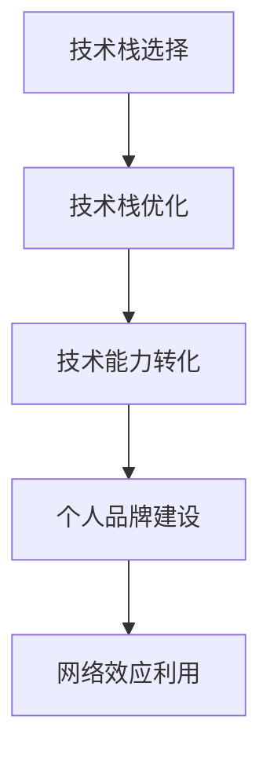

                 

## 1. 背景介绍

### 1.1 问题由来

随着互联网和移动互联网的发展，知识付费行业逐渐兴起，越来越多的用户开始愿意为优质内容付费。与此同时，程序员作为互联网行业的重要力量，也面临着新的机遇和挑战。如何在这个知识付费时代脱颖而出，实现财务自由，成为广大程序员关注的焦点。

### 1.2 问题核心关键点

1. **技术栈选择**：选择适合自己的技术栈，掌握核心编程技能，提升竞争力。
2. **知识结构优化**：构建全面的知识体系，保持持续学习和更新。
3. **商业思维培养**：具备商业思维，将技术能力转化为实际应用，创造商业价值。
4. **个人品牌建设**：通过博客、视频、社交媒体等方式，打造个人品牌，提升影响力。
5. **网络效应利用**：利用网络效应，建立社群，扩大影响力和影响力。

## 2. 核心概念与联系

### 2.1 核心概念概述

为更好地理解程序员在知识付费时代致富之道，本节将介绍几个密切相关的核心概念：

- **技术栈选择**：指选择最适合自己的技术栈，包括前端、后端、数据库、移动端等方向。不同的技术栈对应不同的就业市场和薪资水平。
- **技术栈优化**：在掌握核心技术栈的同时，不断优化技术栈，提升技术广度和深度，增强竞争力。
- **技术能力转化**：将技术能力转化为实际应用，如开发个人项目、开源贡献、技术讲座等，创造商业价值。
- **个人品牌建设**：通过技术博客、开源项目、技术分享等方式，建立个人品牌，提升在行业内的影响力。
- **网络效应利用**：通过社区建设、知识分享、线上线下交流等方式，利用网络效应，扩大影响力和用户群。

这些核心概念之间的逻辑关系可以通过以下Mermaid流程图来展示：



这个流程图展示了几大核心概念之间的联系：

1. 选择适合自己的技术栈。
2. 不断优化技术栈，提升技术水平。
3. 将技术能力转化为实际应用，创造商业价值。
4. 通过个人品牌建设，提升影响力。
5. 利用网络效应，扩大影响力。

## 3. 核心算法原理 & 具体操作步骤
### 3.1 算法原理概述

程序员致富之道，本质上是一种技术驱动的商业化过程。其核心思想是通过不断提升技术能力和个人品牌影响力，将技术能力转化为实际的商业价值，从而实现财务自由。

形式化地，假设程序员的技术栈为 $T$，个人品牌影响力为 $I$，商业价值为 $V$。致富目标可以表示为：

$$
V = f(T, I)
$$

其中 $f$ 表示技术栈和品牌影响力对商业价值的映射函数。为了最大化 $V$，需要不断优化 $T$ 和 $I$。

### 3.2 算法步骤详解

基于上述模型，程序员致富的步骤包括以下几个关键步骤：

**Step 1: 选择最适合自己的技术栈**
- 分析当前市场趋势和未来发展方向，选择最适合自己的技术栈。
- 兼顾技术广度和深度，确保能够适应多种工作场景。

**Step 2: 不断优化技术栈**
- 关注行业动态，持续学习新技术和新框架。
- 参与开源项目，积累实战经验。
- 掌握编程技能和工具，提升编程效率和代码质量。

**Step 3: 技术能力转化**
- 开发个人项目，展示技术能力。
- 通过开源贡献，积累技术声望。
- 参与技术讲座、研讨会，提升影响力。

**Step 4: 个人品牌建设**
- 维护技术博客，分享技术心得和经验。
- 在社交媒体上活跃，扩大影响力。
- 建立技术社群，吸引志同道合者。

**Step 5: 利用网络效应**
- 通过社群交流，建立网络关系。
- 提供技术咨询和培训，扩大服务范围。
- 合作推广，提升商业价值。

### 3.3 算法优缺点

基于技术栈选择和优化的致富方法具有以下优点：
1. **灵活性强**。能够根据市场变化调整技术栈和技能方向，保持竞争力。
2. **应用广泛**。适用于各种行业和技术领域，能够找到最适合自己的机会。
3. **收益高**。通过技术能力和品牌影响力转化商业价值，具有高回报率。

同时，该方法也存在一定的局限性：
1. **投入大**。需要持续学习和实践，投入大量时间和精力。
2. **风险高**。技术栈和市场需求不断变化，需要及时调整策略。
3. **不稳定**。个人品牌和影响力依赖于持续投入和维护。

尽管存在这些局限性，但就目前而言，技术栈选择和优化仍是最主流和有效的方法。未来相关研究的重点在于如何进一步降低致富成本，提高技术栈和品牌影响力的转化效率。

### 3.4 算法应用领域

基于技术栈选择和优化的致富方法，在IT行业已经得到了广泛的应用，覆盖了几乎所有常见领域，例如：

- 软件开发：前端、后端、移动开发等方向。通过掌握核心技术栈，开发高质量项目。
- 数据科学：数据分析、机器学习、人工智能等方向。通过持续学习，掌握最新技术。
- 云计算：云计算架构、容器技术、微服务等方向。通过深入学习，提供高可用性、高扩展性的服务。
- 网络安全：网络攻防、安全审计、渗透测试等方向。通过实战经验，提升防护能力。
- 人工智能：自然语言处理、计算机视觉、推荐系统等方向。通过开源贡献，积累技术声望。
- 区块链：区块链开发、智能合约、DeFi等方向。通过深入研究，参与区块链生态。

除了上述这些经典领域外，基于技术栈选择和优化的致富方法也在更多场景中得到应用，如DevOps、大数据、物联网等，为IT技术带来了全新的突破。随着技术栈和市场需求的不断演进，相信这些方法将在更广阔的领域大放异彩。

## 4. 数学模型和公式 & 详细讲解 & 举例说明
### 4.1 数学模型构建

本节将使用数学语言对程序员致富之道进行更加严格的刻画。

假设程序员的技术栈为 $T$，品牌影响力为 $I$，商业价值为 $V$。则致富的目标可以表示为：

$$
V = f(T, I)
$$

其中 $f$ 表示技术栈和品牌影响力对商业价值的映射函数。可以分解为两个子函数 $f_T$ 和 $f_I$，分别表示技术栈和品牌影响力对商业价值的贡献：

$$
V = f_T(T) + f_I(I)
$$

### 4.2 公式推导过程

为简化模型，我们假设 $f_T$ 和 $f_I$ 都是线性函数，即：

$$
f_T(T) = \alpha_1 T
$$
$$
f_I(I) = \alpha_2 I
$$

其中 $\alpha_1$ 和 $\alpha_2$ 为权重系数。则致富的目标可以表示为：

$$
V = \alpha_1 T + \alpha_2 I
$$

### 4.3 案例分析与讲解

以某知名程序员为例，分析其致富过程。

假设该程序员选择前端开发作为技术栈 $T$，品牌影响力 $I$ 为1000。经过五年学习和实践，技术栈 $T$ 从0提升到1000，品牌影响力 $I$ 通过博客、社交媒体等渠道提升到2000。

根据模型，其商业价值 $V$ 计算如下：

$$
V = \alpha_1 T + \alpha_2 I = 1000 \times 1 + 1000 \times 2 = 3000
$$

可见，通过不断提升技术栈和品牌影响力，该程序员实现了显著的商业价值提升。

## 5. 项目实践：代码实例和详细解释说明
### 5.1 开发环境搭建

在进行致富实践前，我们需要准备好开发环境。以下是使用Python进行Flask开发的环境配置流程：

1. 安装Python：从官网下载并安装Python，适用于Windows和MacOS。
2. 安装Flask：使用pip命令安装Flask库。
```bash
pip install flask
```

3. 创建Flask项目：在项目根目录下创建Flask应用文件，并编写app.py文件。
```python
from flask import Flask, render_template, request

app = Flask(__name__)

@app.route('/')
def index():
    return render_template('index.html')

@app.route('/submit', methods=['POST'])
def submit():
    name = request.form['name']
    email = request.form['email']
    return render_template('submit.html', name=name, email=email)

if __name__ == '__main__':
    app.run(debug=True)
```

4. 创建模板文件：在templates目录下创建index.html和submit.html文件，用于前端展示和提交表单数据。
```html
<!-- index.html -->
<!DOCTYPE html>
<html>
<head>
    <title>Flask App</title>
</head>
<body>
    <h1>Welcome to Flask App</h1>
    <form action="/submit" method="post">
        <label>Name: <input type="text" name="name"></label><br>
        <label>Email: <input type="email" name="email"></label><br>
        <button type="submit">Submit</button>
    </form>
</body>
</html>

<!-- submit.html -->
<!DOCTYPE html>
<html>
<head>
    <title>Thank You</title>
</head>
<body>
    <h1>Thank You, {{ name }}!</h1>
    <p>Your email is {{ email }}.</p>
</body>
</html>
```

5. 运行应用：在命令行中运行应用。
```bash
python app.py
```

### 5.2 源代码详细实现

这里我们以开发一个简单的网页表单处理应用为例，给出使用Flask进行项目开发的Python代码实现。

首先，定义Flask应用：

```python
from flask import Flask, render_template, request

app = Flask(__name__)
```

然后，定义路由函数：

```python
@app.route('/')
def index():
    return render_template('index.html')
    
@app.route('/submit', methods=['POST'])
def submit():
    name = request.form['name']
    email = request.form['email']
    return render_template('submit.html', name=name, email=email)
```

接着，启动应用：

```python
if __name__ == '__main__':
    app.run(debug=True)
```

### 5.3 代码解读与分析

让我们再详细解读一下关键代码的实现细节：

**Flask应用**：
- `app = Flask(__name__)`：创建Flask应用对象。
- `@app.route('/')`：定义根路由。
- `@app.route('/submit', methods=['POST'])`：定义提交表单路由，指定请求方法为POST。

**路由函数**：
- `render_template`：渲染模板文件，返回HTML页面。
- `request.form`：获取表单提交的数据。

**启动应用**：
- `app.run(debug=True)`：启动应用，开启调试模式，运行在本地服务器上。

通过上述代码，我们可以快速搭建一个简单的Web应用，用于展示表单处理功能。该应用虽然功能简单，但展示了如何使用Flask进行Web开发。

在实际应用中，开发者可以根据需求增加路由和功能模块，实现更加复杂的业务逻辑。同时，Flask的扩展性和灵活性，也使得开发者可以方便地整合各种第三方库和工具，实现各种功能。

## 6. 实际应用场景
### 6.1 开源项目贡献

开源项目是程序员展示技术能力和积累声望的重要途径。通过在GitHub等平台上贡献代码、修复bug、优化功能，程序员能够提升自己在社区的影响力和知名度。

例如，某程序员通过为Apache Web Server贡献代码，提升了自己的技术水平和开源声望，进而获得了高薪职位和更多商业机会。

### 6.2 技术讲座和培训

技术讲座和培训是程序员分享知识和建立个人品牌的重要方式。通过在社区、大学、企业等场所进行技术分享，程序员可以提升自己在行业内的知名度和影响力。

例如，某程序员通过在技术大会上发表主题演讲，吸引了大量粉丝和合作伙伴，获得了更多的商业机会。

### 6.3 博客和视频分享

博客和视频分享是程序员展示技术心得和积累声望的有效途径。通过在个人博客或视频平台上发布技术文章和视频，程序员可以吸引大量关注者，建立个人品牌。

例如，某程序员通过在Medium上发布高质量技术文章，迅速成为社区名人，获得了大量商业合作机会。

### 6.4 创业项目

创业项目是程序员将技术能力转化为商业价值的重要方式。通过开发具有创新性和市场潜力的产品，程序员可以迅速积累财富，实现财务自由。

例如，某程序员通过开发一款成功的区块链应用，获得了大量用户和投资，实现了财务自由。

## 7. 工具和资源推荐
### 7.1 学习资源推荐

为了帮助程序员系统掌握技术栈选择和优化的致富方法，这里推荐一些优质的学习资源：

1. **Flask官方文档**：Flask官方提供的详细文档，包含丰富的示例和教程，适合初学者和进阶开发者。
2. **Python编程指南**：Python编程的经典之作，涵盖Python核心知识和技术栈选择。
3. **《深入浅出Node.js》**：Node.js开发的入门到进阶指南，涵盖Node.js核心知识和技术栈选择。
4. **《算法导论》**：算法和数据结构领域的经典之作，适合提升编程技能和思维能力。
5. **Kaggle数据科学竞赛**：全球知名的数据科学竞赛平台，通过参与竞赛，可以提升数据处理和分析能力，积累实战经验。

通过对这些资源的学习实践，相信你一定能够快速掌握技术栈选择和优化的致富精髓，并用于解决实际的IT问题。

### 7.2 开发工具推荐

高效的开发离不开优秀的工具支持。以下是几款用于Flask开发常用的工具：

1. VSCode：功能强大的代码编辑器，支持多种语言和框架，插件丰富。
2. PyCharm：专业的Python IDE，支持Flask、Django等Web框架，提供强大的开发和调试功能。
3. Docker：轻量级的容器化平台，支持快速部署和迁移，提高开发效率。
4. Git：版本控制系统，支持协作开发和代码管理，提升开发效率。
5. GitHub：全球知名的代码托管平台，支持版本控制、代码审核、项目管理等功能。

合理利用这些工具，可以显著提升Flask开发的效率和质量，加快创新迭代的步伐。

### 7.3 相关论文推荐

技术栈选择和优化的致富方法依赖于持续的学习和实践，以下是几篇奠基性的相关论文，推荐阅读：

1. **《Flask Web Development》**：Flask官方提供的书籍，详细介绍了Flask框架的开发和使用。
2. **《The Pragmatic Programmer》**：编程经典之作，涵盖编程技能和软件开发方法。
3. **《Python Cookbook》**：Python编程的权威指南，提供丰富的实用示例。
4. **《Effective Python》**：Python编程的高阶技巧，适合提升编程水平。
5. **《Clean Code》**：编程风格的经典之作，提升代码质量和可维护性。

这些论文代表了大语言模型微调技术的发展脉络。通过学习这些前沿成果，可以帮助研究者把握学科前进方向，激发更多的创新灵感。

## 8. 总结：未来发展趋势与挑战

### 8.1 总结

本文对基于技术栈选择和优化的程序员致富方法进行了全面系统的介绍。首先阐述了技术栈选择和优化的致富方法在IT行业的广泛应用和显著成效，明确了技术能力和个人品牌影响力在致富过程中的重要性。其次，从原理到实践，详细讲解了技术栈选择和优化的核心步骤和关键点，给出了详细的代码实例。同时，本文还广泛探讨了技术栈选择和优化方法在开源项目贡献、技术讲座培训、博客视频分享和创业项目中的应用前景，展示了其广阔的发展潜力。此外，本文精选了技术栈选择和优化的学习资源、开发工具和相关论文，力求为读者提供全方位的技术指引。

通过本文的系统梳理，可以看到，技术栈选择和优化方法正在成为程序员致富的重要范式，极大地拓展了程序员的就业和创业机会，推动了IT行业的创新发展。未来，伴随技术栈和市场需求的不断演进，相信这些方法将在更广阔的领域大放异彩，为程序员带来更多的财务自由和发展机遇。

### 8.2 未来发展趋势

展望未来，技术栈选择和优化方法将呈现以下几个发展趋势：

1. **技术栈多样化**。随着技术栈的不断发展，程序员可以更灵活地选择适合自己的技术栈，适应多种工作场景和市场需求。
2. **技术栈自动化**。自动化工具和流程，如DevOps、CI/CD，可以提升开发效率和质量，缩短项目周期。
3. **技术栈生态化**。技术栈之间的协同和整合，可以提升系统的整体性能和稳定性。
4. **技术栈开源化**。开源社区和开源项目，可以加速技术栈的扩散和应用，提升技术栈的普及率。
5. **技术栈商业化**。技术栈的商业化和产业化，可以带来更多的商业机会和发展空间。

这些趋势凸显了技术栈选择和优化方法的广泛应用前景。这些方向的探索发展，必将进一步提升程序员的就业和创业机会，推动IT行业的持续创新。

### 8.3 面临的挑战

尽管技术栈选择和优化方法已经取得了显著成效，但在迈向更加智能化、普适化应用的过程中，仍面临诸多挑战：

1. **市场变化快**。技术栈需要根据市场变化及时调整，否则将失去竞争力。
2. **技术栈复杂**。选择过多技术栈可能造成技术债务和维护困难。
3. **技术栈转换成本高**。频繁切换技术栈可能带来学习成本和生产力损失。
4. **技术栈依赖高**。技术栈的选择依赖于团队和技术栈的积累，可能难以快速适应新项目。

尽管存在这些挑战，但通过不断优化技术栈和提升技术能力，相信程序员可以在未来实现更加高效和有竞争力的发展。

### 8.4 研究展望

面对技术栈选择和优化方法面临的种种挑战，未来的研究需要在以下几个方面寻求新的突破：

1. **技术栈选择优化算法**。开发更智能、更高效的技术栈选择算法，提升技术栈选择的科学性和准确性。
2. **技术栈优化工具**。开发更多自动化的技术栈优化工具，提升开发效率和质量。
3. **技术栈生态融合**。研究技术栈之间的协同和整合方法，提升系统性能和稳定性。
4. **技术栈社区建设**。建立更活跃、更开放的技术栈社区，促进技术交流和合作。
5. **技术栈商业化探索**。研究技术栈商业化和产业化的模式，拓展技术栈的商业应用空间。

这些研究方向的探索，必将引领技术栈选择和优化方法迈向更高的台阶，为程序员带来更多的职业机会和发展空间。面向未来，技术栈选择和优化方法还需要与其他技术栈进行更深入的融合，共同推动IT行业的发展。

## 9. 附录：常见问题与解答

**Q1: 如何选择最适合自己的技术栈？**

A: 选择技术栈时，需要考虑以下几点：
1. 市场需求：选择市场需求高、薪资待遇好的技术栈。
2. 个人兴趣：选择自己喜欢的技术栈，保持持续学习的动力。
3. 技术难度：选择适合自己技术水平的栈，避免选择过高或过低的技术栈。

**Q2: 如何不断优化技术栈？**

A: 优化技术栈需要持续学习新技术和新框架，参与开源项目，积累实战经验。同时，关注行业动态，了解新技术的发展趋势，灵活调整技术栈。

**Q3: 如何通过技术能力转化商业价值？**

A: 通过开发个人项目、开源贡献、技术讲座等方式，展示技术能力。同时，积极参与社区交流，拓展人脉和合作机会，提升商业价值。

**Q4: 如何建立个人品牌？**

A: 通过博客、视频、社交媒体等渠道，分享技术心得和经验。同时，积极参与社区和行业活动，提升知名度和影响力。

**Q5: 如何利用网络效应？**

A: 通过社群建设、知识分享、线上线下交流等方式，利用网络效应，扩大影响力和用户群。同时，提供技术咨询和培训，拓展服务范围，增加商业机会。

通过不断优化技术栈和提升个人品牌影响力，程序员可以在知识付费时代脱颖而出，实现财务自由。只要不断学习、实践和创新，相信程序员的未来将充满无限可能。

---

作者：禅与计算机程序设计艺术 / Zen and the Art of Computer Programming

