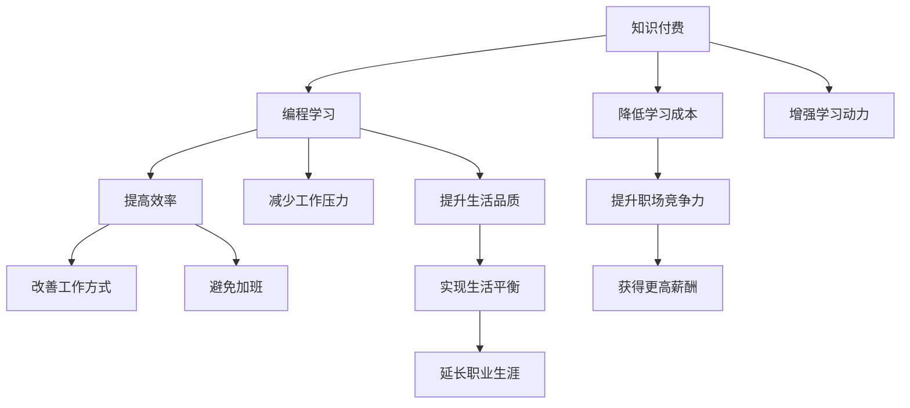

                 

# 知识付费让程序员告别996的生活方式

> 关键词：知识付费, 程序员, 人工智能, 编程学习, 工作压力, 生活平衡

## 1. 背景介绍

在当今这个信息爆炸的时代，IT行业正以令人难以置信的速度发展和变化。技术的不断进步不仅要求程序员不断学习新的技能和工具，还要求他们在工作中保持高效和创新。然而，随着需求的增加和竞争的加剧，程序员常常面临着过度工作（特别是996工作制）带来的身心压力。这种情况不仅影响了他们的生活质量，还可能威胁到他们的健康。

为了解决这个问题，知识付费作为一种新的学习和获取信息的方式应运而生。它不仅提供了丰富的资源和工具，帮助程序员提高工作效率，还为他们提供了更好的工作-生活平衡，进而真正帮助他们告别996的生活方式。本文将详细探讨知识付费如何改变程序员的生活和工作方式，并提供一个全面的技术解决方案。

## 2. 核心概念与联系

### 2.1 核心概念概述

- **知识付费**：指通过支付一定费用，获取高质量的课程、资料、技术博客等知识资源的服务。这种模式强调了知识的重要性，促进了知识的流通和创新。
- **程序员**：使用编程语言编写代码，开发软件系统的专业人士，在IT行业中扮演着重要的角色。
- **人工智能**：通过机器学习、深度学习等技术实现智能系统的学科，正在深刻改变各行各业。
- **编程学习**：通过课程、书籍、视频等资源，学习编程知识和技能的过程。
- **工作压力**：由于工作量过大、工作强度高、工作环境压力大等因素导致的身心负担。
- **生活平衡**：在工作和个人生活之间找到平衡点，确保身心健康和个人时间的合理分配。

这些核心概念之间的联系可以通过以下Mermaid流程图来展示：



这个流程图展示了知识付费对程序员生活和工作方式的深远影响：

1. 知识付费提供了高质量的编程学习资源，帮助程序员提高效率，减少工作压力，提升生活品质。
2. 提高效率和减少工作压力可以改善工作方式，避免加班。
3. 降低学习成本和增强学习动力可以提升职场竞争力，获得更高的薪酬。
4. 提高生活品质可以实现生活平衡，延长职业生涯。

## 3. 核心算法原理 & 具体操作步骤

### 3.1 算法原理概述

知识付费本质上是一种基于内容付费的商业模式。通过支付一定费用，用户可以获得高质量的课程、文档、工具等，从而提升自身的知识和技能。这种模式的核心在于内容的质量和价值，而不在于访问的便利性。因此，如何设计合理的付费策略，确保内容的质量和价值，是知识付费成功的关键。

### 3.2 算法步骤详解

1. **需求分析**：识别用户的具体需求和痛点，确定哪些内容需要付费。例如，针对加班过多的程序员，可以提供时间管理和工作效率提升的课程。

2. **内容生产**：根据需求，开发高质量的内容。这些内容可以是视频教程、在线课程、电子书、技术博客等形式。

3. **价格制定**：根据内容的质量、深度、稀缺性等因素，制定合理的价格。这需要平衡内容提供者、平台和用户的利益。

4. **平台建设**：搭建一个高效的在线平台，让用户可以方便地查找和购买所需内容。平台应提供搜索、推荐、评论等用户友好的功能。

5. **市场推广**：通过各种渠道宣传平台和内容，吸引用户订阅和使用。可以通过SEO、社交媒体、KOL合作等方式推广。

6. **用户反馈**：收集用户反馈，持续优化内容和服务，提升用户体验。

7. **持续更新**：保持内容的更新和迭代，确保用户总能获得最新、最有价值的信息。

### 3.3 算法优缺点

**优点**：
- **内容质量高**：付费模式可以确保内容的高质量和深度。
- **用户粘性强**：用户为付费内容投入了真金白银，会更加认真地学习和使用。
- **市场规模大**：程序员市场庞大，潜在用户众多，市场前景广阔。

**缺点**：
- **用户门槛高**：需要一定的经济基础才能订阅高质量内容，可能限制了一部分用户。
- **内容价格高**：高质量内容的生产成本较高，价格可能偏高，用户难以负担。
- **内容质量不一**：一些内容提供者可能生产低质量内容，影响整体用户体验。

### 3.4 算法应用领域

知识付费模式不仅适用于编程学习，还可以应用于其他技术领域。例如，数据分析、人工智能、前端开发、后端开发等。这种模式也可以扩展到其他行业，如财务、法律、教育等。

## 4. 数学模型和公式 & 详细讲解 & 举例说明

### 4.1 数学模型构建

我们可以使用一个简单的数学模型来描述知识付费平台的用户满意度：

$$
S = \alpha C + \beta Q + \gamma T - \delta P
$$

其中，$S$表示用户满意度，$C$表示内容质量，$Q$表示平台服务质量，$T$表示技术支持，$P$表示价格。$\alpha, \beta, \gamma, \delta$为系数，代表各项因素对用户满意度的影响权重。

### 4.2 公式推导过程

通过线性回归等方法，我们可以推导出各项因素对用户满意度的具体影响。例如，如果内容质量和平台服务质量对用户满意度的影响权重较大，那么平台应重点提升这两项指标，以增加用户粘性和满意度。

### 4.3 案例分析与讲解

某知识付费平台通过对用户满意度数据的分析，发现内容质量和平台服务质量是用户满意度的主要驱动因素。为了提升用户满意度，平台增加了视频课程的互动性，优化了平台的搜索算法，最终实现了用户满意度的显著提升。

## 5. 项目实践：代码实例和详细解释说明

### 5.1 开发环境搭建

1. **选择编程语言**：Python是最常用的编程语言之一，拥有丰富的库和框架，适用于知识付费平台的开发。
2. **搭建服务器**：可以选择AWS、阿里云、腾讯云等云服务提供商，搭建稳定可靠的服务器环境。
3. **选择数据库**：选择MySQL、MongoDB等数据库，用于存储用户数据和内容数据。

### 5.2 源代码详细实现

以下是一个简单的Python Flask应用示例，用于搭建一个知识付费平台的基本功能：

```python
from flask import Flask, render_template, request

app = Flask(__name__)

@app.route('/')
def index():
    return render_template('index.html')

@app.route('/purchase', methods=['POST'])
def purchase():
    content_id = request.form['content_id']
    user_id = request.form['user_id']
    # 处理购买逻辑
    return 'Purchase successful'

@app.route('/dashboard')
def dashboard():
    user_id = request.args.get('user_id')
    # 查询用户购买的内容
    return render_template('dashboard.html', content_list=user_content_list)

if __name__ == '__main__':
    app.run(debug=True)
```

### 5.3 代码解读与分析

- **Flask框架**：Flask是一个轻量级的Python Web框架，适合搭建简单的Web应用。
- **路由处理**：使用@app.route装饰器定义路由，处理不同URL的请求。
- **模板渲染**：使用render_template函数渲染HTML模板，提供友好的用户界面。
- **用户数据管理**：通过用户ID和内容ID，查询和管理用户购买的内容。

### 5.4 运行结果展示

- **前端界面**：用户可以通过简单的界面选择课程、完成购买、查看已购买内容。
- **后台管理**：管理员可以添加新课程、管理用户数据、监控系统状态。

## 6. 实际应用场景

### 6.1 编程学习

知识付费平台可以为程序员提供高质量的编程学习资源，帮助他们掌握最新技术、提高工作效率。例如，Python、Java、C++等编程语言的高质量课程，数据结构和算法的经典教材，前沿技术（如人工智能、机器学习）的最新研究。

### 6.2 工作效率提升

通过学习时间管理、项目管理、代码审查等课程，程序员可以提升工作效率，避免加班。例如，使用JIRA进行项目管理，使用Git进行版本控制，使用代码审查工具（如Linter）提高代码质量。

### 6.3 健康生活

知识付费平台可以提供心理健康、健身指导等课程，帮助程序员保持健康的生活习惯，缓解工作压力。例如，定期健身计划、冥想课程、心理健康讲座等。

### 6.4 未来应用展望

未来，知识付费平台可以进一步扩展应用场景，提供更多元的知识和服务。例如，针对新员工进行入职培训，提供职业发展规划，为高级程序员提供更高层次的技术支持。

## 7. 工具和资源推荐

### 7.1 学习资源推荐

1. **Coursera**：提供全球顶尖大学和企业的课程，涵盖计算机科学、数据科学、人工智能等。
2. **Udacity**：专注于技术和创业领域的课程，提供项目驱动的学习体验。
3. **edX**：提供开放课程，涵盖计算机科学、编程、数据科学等领域。
4. **LeetCode**：提供编程练习和面试题库，帮助程序员提升编程技能。
5. **Kaggle**：提供数据科学竞赛和数据集，促进数据挖掘和机器学习技术的发展。

### 7.2 开发工具推荐

1. **Jupyter Notebook**：一个交互式的开发环境，适合编写、运行Python代码，并实时查看结果。
2. **Git**：版本控制系统，适用于代码管理、协作开发。
3. **Visual Studio Code**：一个轻量级的代码编辑器，支持多种编程语言和插件。
4. **Docker**：容器化平台，方便构建、部署和管理应用程序。
5. **AWS**：云计算服务平台，提供丰富的资源和工具，支持应用程序的快速部署和扩展。

### 7.3 相关论文推荐

1. **A Survey on Knowledge Platforms**：一篇关于知识付费平台的综述论文，总结了现有的研究方法和应用案例。
2. **AI in the Workplace: A Survey**：讨论了人工智能在职场中的应用，包括知识付费平台的潜力。
3. **Machine Learning for Personalized Learning**：探讨了机器学习在个性化学习中的应用，如何通过推荐系统提升学习效果。
4. **Blockchain-Based Platforms for Online Learning**：研究了区块链技术在在线学习平台中的应用，提高了学习数据的透明性和安全性。

## 8. 总结：未来发展趋势与挑战

### 8.1 研究成果总结

知识付费平台为程序员提供了高质量的学习资源，帮助他们提升技能，提高工作效率，缓解工作压力，实现更好的工作-生活平衡。通过合理的设计和运营，知识付费平台可以成为程序员不可或缺的学习工具。

### 8.2 未来发展趋势

1. **个性化推荐**：通过推荐系统，根据用户的学习历史和兴趣推荐课程，提升学习效果。
2. **人工智能辅助**：利用人工智能技术，分析用户行为，提供更精准的课程推荐和学习路径。
3. **跨平台整合**：知识付费平台可以与其他教育平台、职业培训平台整合，提供一站式服务。
4. **内容社区化**：鼓励用户分享课程和学习心得，形成社区，促进知识交流。
5. **微支付功能**：引入微支付功能，降低购买门槛，吸引更多用户。

### 8.3 面临的挑战

1. **内容质量控制**：如何确保内容的高质量和真实性，避免误导用户。
2. **用户隐私保护**：如何保护用户数据隐私，防止数据泄露。
3. **技术门槛高**：如何降低技术门槛，让更多用户使用平台。
4. **市场竞争激烈**：如何在激烈的市场竞争中脱颖而出，保持平台的用户粘性。
5. **付费意愿低**：如何提高用户的付费意愿，增加平台收益。

### 8.4 研究展望

知识付费平台具有巨大的市场潜力和发展空间。未来的研究需要关注以下几个方面：
1. **用户行为分析**：通过数据分析，了解用户需求和行为，提供更精准的个性化推荐。
2. **知识共享机制**：建立社区化平台，鼓励用户分享知识，形成良性循环。
3. **跨平台集成**：与其他教育和培训平台整合，提供一站式学习解决方案。
4. **技术创新**：利用前沿技术（如AI、区块链）提升平台的性能和安全性。
5. **社会责任**：在平台运营中注重社会责任，确保平台内容的健康性和合法性。

## 9. 附录：常见问题与解答

**Q1: 知识付费平台如何确保内容质量？**

A: 知识付费平台需要制定严格的内容审核机制，引入专家评审和用户评价体系，确保内容的高质量和真实性。例如，通过用户反馈和专家评审，及时发现和删除低质量内容。

**Q2: 如何降低知识付费平台的入门门槛？**

A: 引入微支付功能，让用户在享受优质内容的同时，只需支付少量费用。此外，可以提供免费试用期、免费课程，吸引更多用户尝试平台。

**Q3: 知识付费平台如何保护用户隐私？**

A: 在平台设计和运营中，应严格遵守数据保护法规，采用数据加密、匿名化等技术手段，确保用户数据的安全。

**Q4: 知识付费平台如何提高用户付费意愿？**

A: 提供高价值、高品质的课程，并通过用户评价、专家推荐等方式提升课程可信度。此外，可以提供丰富的课程试听、免费试用等功能，让用户更愿意尝试和付费。

**Q5: 知识付费平台如何提高用户粘性？**

A: 通过个性化推荐、社区互动、专家讲座等形式，增强用户粘性。例如，定期组织线上线下活动，吸引用户参与。

---

作者：禅与计算机程序设计艺术 / Zen and the Art of Computer Programming

