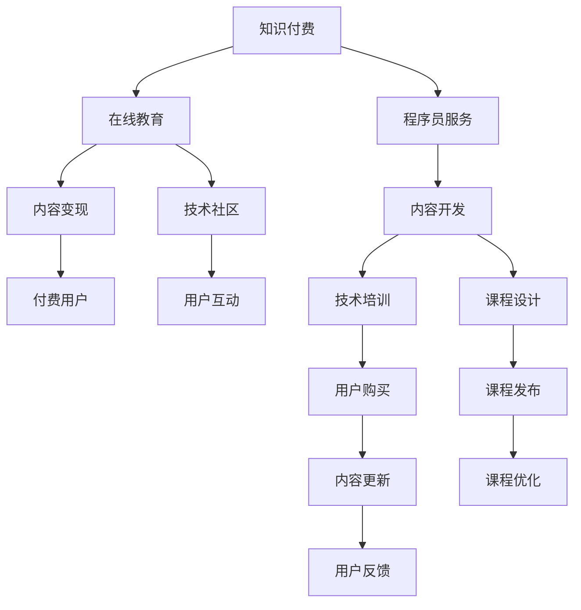

                 

# 知识付费让程序员实现财富自由的途径

## 1. 背景介绍

### 1.1 问题由来

随着互联网和移动设备的普及，知识付费市场迎来了爆发式增长。无论是技术的传播、娱乐内容的分享，还是专家知识的输出，都逐步向收费模式转变。程序员作为互联网的推动者和受益者，其专业技能和服务价值在知识付费领域内越来越受到重视。如何在这一趋势中抓住机遇，实现财务自由，是程序员需要认真思考的问题。

### 1.2 问题核心关键点

知识付费的核心在于如何通过高质量内容吸引用户付费，从而实现知识变现。对于程序员来说，具备高技能、高效率、高性价比的内容，才能在竞争激烈的市场上脱颖而出。具体来说：

- 技术含量高：所提供的技术资料必须具有深度，能够帮助用户真正解决问题。
- 更新及时：技术领域更新快，及时更新的内容更能满足用户需求。
- 实战性强：以实际项目为依托，提供可复现的代码和案例分析，提高用户学习效率。
- 互动性高：通过社区、评论等互动方式，增强用户粘性，提升内容价值。
- 多样化服务：除了付费课程，还可以通过技术咨询、项目合作、书籍编写等方式多元化变现。

## 2. 核心概念与联系

### 2.1 核心概念概述

为更好地理解知识付费，本节将介绍几个密切相关的核心概念：

- **知识付费**：通过有偿服务方式，向用户提供优质、系统、实用的知识产品，包括视频教程、博客文章、技术问答等。
- **程序员服务**：程序员基于自身技术专长，提供软件开发、技术咨询、系统架构设计等专业知识服务。
- **在线教育**：借助互联网平台，通过线上课程、互动视频等方式，实现知识的传授与共享。
- **内容变现**：将优质的技术内容通过收费、广告、赞助等方式进行商业化运作，实现知识资本的增值。
- **技术社区**：利用网络平台，建立以程序员为中心的技术交流社区，增强用户互动，提升内容价值。

这些概念之间逻辑关系紧密，共同构成了知识付费和程序员服务的产业链条。

### 2.2 核心概念原理和架构的 Mermaid 流程图



## 3. 核心算法原理 & 具体操作步骤

### 3.1 算法原理概述

知识付费的成功，离不开算法驱动的内容推荐与个性化定制。以下介绍一些核心算法原理：

- **协同过滤**：通过用户行为数据，推荐相关课程，增加用户粘性。
- **自然语言处理(NLP)**：利用语言模型和分类算法，对用户评论、提问进行情感分析和主题分类，提升内容质量。
- **机器学习推荐系统**：通过训练模型，对用户行为数据进行分析，实现更精准的内容推荐。
- **A/B测试**：通过对比不同内容的接受度和用户转化率，优化课程内容和形式。
- **数据挖掘**：从大规模数据中提取知识，发现课程关联，实现内容优化。

### 3.2 算法步骤详解

- **步骤1: 收集数据**：收集用户行为数据、课程内容、用户评价等，用于后续的数据分析与算法训练。
- **步骤2: 数据分析**：利用数据挖掘技术，从数据中提取用户兴趣、课程标签等信息。
- **步骤3: 模型训练**：基于收集到的数据，训练协同过滤、NLP、推荐系统等算法模型。
- **步骤4: 内容推荐**：将训练好的模型应用于用户推荐，提供个性化的课程选择。
- **步骤5: 持续优化**：根据用户反馈不断调整算法模型，提升推荐准确性。

### 3.3 算法优缺点

知识付费平台的算法具有以下优点：

- 个性化推荐：通过数据挖掘与算法驱动，实现高效的内容推荐，提升用户体验。
- 精准内容定位：基于用户行为数据，实现用户画像与课程内容的精准匹配。
- 用户粘性提升：通过互动与反馈，增强用户粘性，提高课程参与率。

但同时，这些算法也存在以下局限：

- 数据依赖：算法效果高度依赖于用户数据的丰富性与准确性，用户数据不足或质量不佳会影响推荐效果。
- 隐私问题：用户数据的收集、存储与处理可能存在隐私风险，需严格遵守相关法律法规。
- 动态变化：用户兴趣与需求会随时间变化，静态模型难以及时适应这种变化。
- 成本较高：算法模型的训练与维护需要较大的计算资源，且需要不断更新以适应新内容。

### 3.4 算法应用领域

知识付费算法主要应用于以下几个领域：

- **在线教育平台**：如Coursera、Udacity等，提供系统化的课程推荐与学习路径规划。
- **技术社区**：如Stack Overflow、GitHub等，提供问题解决与代码协作。
- **知识服务工具**：如Upwork、Freelancer等，提供专家服务的对接与推荐。
- **内容聚合平台**：如知乎、Medium等，提供个性化内容订阅与推荐。

## 4. 数学模型和公式 & 详细讲解 & 举例说明

### 4.1 数学模型构建

知识付费平台的数学模型主要包括以下几个部分：

- **用户画像模型**：通过协同过滤、NLP等技术，构建用户兴趣图谱，实现精准的个性化推荐。
- **课程关联模型**：基于用户行为数据，建立课程内容与用户兴趣之间的关联矩阵。
- **内容评价模型**：通过评分系统，计算课程的综合评价，作为课程排序与推荐的重要依据。

### 4.2 公式推导过程

#### 用户画像模型

用户画像模型的推导过程如下：

1. 收集用户行为数据：用户观看课程时长、评分、评论等。
2. 构建用户行为矩阵：$A_{ij} = \text{观看时长}_{i,j}$，$i$ 表示用户，$j$ 表示课程。
3. 计算用户兴趣向量：$u_i = \frac{1}{\sum_k A_{ik}} A_{ik}$。

#### 课程关联模型

课程关联模型的推导如下：

1. 收集用户对课程的评分数据：$R_{ij} = \text{评分}_{i,j}$。
2. 构建评分矩阵：$R$。
3. 计算课程向量：$v_j = \frac{1}{\sum_i R_{ij}} R_{ij}$。

#### 内容评价模型

内容评价模型通过计算课程的综合评分来评估课程质量：

1. 收集用户评分数据：$R_{ij} = \text{评分}_{i,j}$。
2. 计算课程平均评分：$v_j = \frac{1}{N}\sum_{i=1}^N R_{ij}$。

### 4.3 案例分析与讲解

#### 用户画像模型案例

某在线教育平台，收集用户观看课程时长、评分、评论等数据，利用协同过滤和NLP技术，构建用户画像模型。模型首先通过协同过滤算法，得到每个用户对课程的兴趣权重，然后通过NLP技术，分析用户评论中的情感倾向，得到情感得分，最终生成用户画像，用于推荐系统的优化。

#### 课程关联模型案例

某技术社区，通过用户对课程的评分数据，构建课程关联模型。模型首先通过奇异值分解(SVD)，将评分矩阵$R$分解为$R = U \Sigma V^T$，得到用户和课程的向量表示$u_i$和$v_j$。然后，通过余弦相似度计算，得到用户与课程的相似度得分，用于课程推荐。

#### 内容评价模型案例

某内容聚合平台，通过评分数据计算课程的综合评分。模型首先对评分数据进行标准化处理，然后通过均值和标准差计算，得到课程的综合评分$v_j$。最后，根据综合评分，对课程进行排序与推荐，提升用户满意度和课程质量。

## 5. 项目实践：代码实例和详细解释说明

### 5.1 开发环境搭建

在进行知识付费项目开发前，需要搭建好开发环境。以下是使用Python进行项目开发的环境配置流程：

1. 安装Python：从官网下载并安装Python 3.x版本。
2. 安装虚拟环境：使用`virtualenv`或`conda`创建虚拟环境，确保各项目之间的依赖隔离。
3. 安装必要的库：使用`pip`安装`numpy`、`pandas`、`scikit-learn`、`flask`、`tensorflow`等库，用于数据处理、机器学习、后端服务等。
4. 安装数据库：安装SQLite或MySQL等关系型数据库，用于存储用户数据、课程数据、评分数据等。

### 5.2 源代码详细实现

以下给出使用Flask框架实现知识付费平台的示例代码：

```python
from flask import Flask, request, jsonify
from sklearn.metrics.pairwise import cosine_similarity

app = Flask(__name__)

# 课程数据
courses = [
    {'id': 1, 'name': 'Python基础', 'description': 'Python语言基础入门', 'tags': ['Python', '基础', '入门']},
    {'id': 2, 'name': '机器学习', 'description': '机器学习算法与实践', 'tags': ['机器学习', '算法', '实践']},
    # ...
]

# 用户数据
users = [
    {'id': 1, 'name': 'Alice', 'age': 25, 'interests': ['Python', '数据分析', '深度学习']},
    # ...
]

# 评分数据
ratings = [
    {'score': 4.5, 'user_id': 1, 'course_id': 1},
    {'score': 5.0, 'user_id': 1, 'course_id': 2},
    # ...
]

@app.route('/recommend', methods=['POST'])
def recommend():
    user_id = request.json['user_id']
    num_recommendations = request.json['num_recommendations']
    
    # 计算用户兴趣向量
    user_interests = [tag for tag in users[user_id]['interests']]
    user_vector = [0] * len(courses)
    for i, course in enumerate(courses):
        if any(tag in course['tags'] for tag in user_interests):
            user_vector[i] = 1
    
    # 计算课程向量
    course_vectors = [cosine_similarity(user_vector, course['tags']) for course in courses]
    course_vectors = [v[0] for v in course_vectors]
    
    # 排序课程向量，推荐前n个
    top_courses = sorted(range(len(course_vectors)), key=lambda x: course_vectors[x])[::-1][:num_recommendations]
    
    return jsonify({'recommendations': [courses[i]['name'] for i in top_courses]})

if __name__ == '__main__':
    app.run(debug=True)
```

### 5.3 代码解读与分析

上述代码实现了基本的知识推荐服务，包括以下几个关键部分：

- 使用Flask框架搭建后端服务，通过HTTP请求接收用户ID和推荐数量。
- 读取课程、用户、评分等数据，并进行数据预处理。
- 基于用户兴趣和课程标签，构建用户向量与课程向量，计算余弦相似度，排序并返回推荐课程列表。

### 5.4 运行结果展示

运行上述代码，访问`http://localhost:5000/recommend`接口，通过POST请求传入用户ID和推荐数量，即可获取推荐课程列表。例如，输入用户ID为1，推荐数量为3，返回结果可能为：

```json
{
    "recommendations": [
        "机器学习",
        "Python基础",
        "深度学习"
    ]
}
```

## 6. 实际应用场景

### 6.1 教育培训

在线教育培训是知识付费的重要应用场景。学生通过付费课程学习新知识，提升职业竞争力。许多在线教育平台，如Coursera、Udacity等，已经通过知识付费获得了巨大的成功。例如，Coursera联合顶尖高校和公司，推出大量高质量课程，吸引了全球数百万学习者。

在实际应用中，平台需采集用户观看时长、评分、评论等数据，构建用户画像和课程关联模型，提供个性化推荐，增加用户粘性和课程参与率。同时，通过智能导师与内容更新，不断优化课程质量，满足用户需求。

### 6.2 技术咨询

技术咨询是知识付费的另一种重要应用场景。程序员作为技术专家，可以为用户提供专业的技术支持与咨询服务，解决复杂问题，提供定制化解决方案。

例如，某企业需要优化其核心业务系统，通过知识付费平台，邀请具备相关经验的程序员提供技术咨询。平台利用用户行为数据和课程内容，推荐相关专家，提供视频讲解、代码演示、问题解答等多样化服务，提升用户满意度。

### 6.3 代码托管

代码托管是知识付费的重要业务形式。程序员通过提供代码托管服务，帮助企业或个人实现高效的软件开发与协作。

例如，GitHub利用知识付费平台，提供代码托管、项目管理、协作编辑等多样化服务，吸引了全球数千万开发者使用。平台通过知识付费激励开发者上传优质代码，提升社区内容质量，促进开源技术的共享与交流。

### 6.4 未来应用展望

随着人工智能和数据科学的发展，知识付费平台将逐渐智能化、个性化、多样化。以下展望基于当前技术趋势：

- **AI辅助推荐**：利用深度学习与自然语言处理技术，提供更精准的个性化推荐，提升用户体验。
- **互动式学习**：通过虚拟现实、增强现实技术，提供沉浸式学习体验，增强用户互动。
- **内容众包**：引入AI辅助的内容审核与编辑技术，促进内容的多元化与高质量化。
- **知识图谱**：利用知识图谱技术，构建全面的知识网络，实现知识的深度整合与关联。
- **区块链技术**：利用区块链技术，保护用户数据与知识版权，构建可信的信任体系。

## 7. 工具和资源推荐

### 7.1 学习资源推荐

为了帮助开发者系统掌握知识付费的理论基础和实践技巧，这里推荐一些优质的学习资源：

1. **《知识付费商业模式：从0到1》**：全面讲解知识付费的商业模式、市场需求与用户行为，适合入门学习。
2. **Coursera与Udacity课程**：提供高质量的在线课程，涵盖各种技术技能与知识领域。
3. **《从0到1，打造知识付费平台》**：详细讲解知识付费平台的设计、开发与运营，适合实战演练。
4. **Flask官方文档**：Flask框架的官方文档，提供完整的开发指南与实例代码，适合快速上手。
5. **Python官方教程**：Python语言的官方教程，适合学习基础知识与编程技能，适合全栈开发。

### 7.2 开发工具推荐

以下是几款用于知识付费项目开发的常用工具：

1. **Flask**：轻量级的Web框架，灵活高效，易于上手。
2. **Django**：全功能的Web框架，适合开发复杂的业务逻辑与数据库交互。
3. **SQLite**：轻量级关系型数据库，适合小型应用开发。
4. **MySQL**：流行的关系型数据库，适合中大型应用开发。
5. **TensorFlow**：深度学习框架，适合构建AI辅助推荐系统。

### 7.3 相关论文推荐

知识付费平台的成功离不开技术驱动与算法优化。以下是几篇奠基性的相关论文，推荐阅读：

1. **《协同过滤推荐算法》**：详细讲解协同过滤推荐算法的工作原理与实现方法。
2. **《基于深度学习的个性化推荐系统》**：介绍深度学习在推荐系统中的应用，提升推荐精度与用户体验。
3. **《自然语言处理与知识图谱》**：探讨自然语言处理与知识图谱技术在知识付费中的应用，实现内容的深度整合与关联。
4. **《知识付费平台的商业模式分析》**：分析知识付费平台的商业模式，提出可行的运营策略。
5. **《区块链技术在知识版权保护中的应用》**：探讨区块链技术在知识付费中的作用，保护用户数据与知识版权。

## 8. 总结：未来发展趋势与挑战

### 8.1 总结

本文对知识付费及其技术实践进行了全面系统的介绍。首先阐述了知识付费的背景与核心关键点，明确了知识付费在程序员服务中的重要价值。其次，从算法原理到具体操作步骤，详细讲解了知识付费平台的开发流程与技术细节，给出了完整的代码实例与运行结果展示。同时，本文还广泛探讨了知识付费平台在教育培训、技术咨询、代码托管等众多领域的应用前景，展示了知识付费的广阔发展空间。最后，本文精选了知识付费相关的学习资源、开发工具与论文推荐，力求为读者提供全方位的技术指引。

通过本文的系统梳理，可以看到，知识付费平台通过高质量内容吸引用户付费，已成为程序员服务的重要途径。随着技术的不断进步与应用的深入探索，知识付费必将在更多领域大放异彩，为程序员带来更多的机会与挑战。

### 8.2 未来发展趋势

展望未来，知识付费平台将呈现以下几个发展趋势：

1. **智能化**：利用AI技术，提供更精准的个性化推荐，提升用户体验。
2. **互动化**：引入虚拟现实、增强现实技术，提供沉浸式学习体验，增强用户互动。
3. **多样化**：拓展知识付费的范围，涵盖更多技术领域与知识形式，满足用户多样化需求。
4. **社区化**：建立技术社区，增强用户粘性，促进知识交流与共享。
5. **国际化**：通过多语言支持与全球化布局，拓展国际市场，提升知识付费平台的影响力。

### 8.3 面临的挑战

尽管知识付费平台取得了一定的成功，但在迈向更加智能化、普适化应用的过程中，它仍面临着诸多挑战：

1. **内容质量**：高质量内容是知识付费的核心，如何持续产出优质内容，保持平台竞争力，是主要挑战之一。
2. **用户粘性**：用户流失率高，如何通过个性化推荐、互动体验等手段，提高用户粘性，增加长期用户，是另一大挑战。
3. **成本控制**：高质量内容与智能算法的开发与维护需要较高成本，如何平衡成本与收益，是平台运营的关键。
4. **技术难题**：内容推荐、用户画像、用户行为分析等技术的复杂度较高，如何克服技术难题，提升算法效果，是平台发展的难题。
5. **监管合规**：知识付费平台需遵守相关法律法规，如何处理用户数据隐私与版权问题，确保合规运营，是重要挑战。

### 8.4 研究展望

面对知识付费平台面临的挑战，未来的研究需要在以下几个方面寻求新的突破：

1. **AI辅助内容创作**：利用AI技术，自动生成高质量文章、视频、课程等内容，提高内容产出效率。
2. **用户行为分析**：深入分析用户行为数据，挖掘用户兴趣与需求，优化推荐系统与用户体验。
3. **互动化技术**：引入虚拟现实、增强现实技术，提供沉浸式学习体验，增强用户互动。
4. **区块链技术**：利用区块链技术，保护用户数据与知识版权，构建可信的信任体系。
5. **全球化布局**：拓展国际市场，提供多语言支持与全球化服务，提升知识付费平台的影响力。

这些研究方向的探索，将引领知识付费平台迈向更加智能化、普适化应用，为程序员带来更多的机会与挑战。只有勇于创新、敢于突破，才能不断拓展知识付费的边界，让知识与技术更好地服务于用户。

## 9. 附录：常见问题与解答

**Q1：知识付费平台如何确保内容质量？**

A: 知识付费平台通过严格的审核机制，确保内容质量。平台需要组建专业团队，对内容进行多维度评估，包括知识准确性、内容原创性、用户反馈等。同时，引入社区评审机制，鼓励用户对内容进行评价与反馈，形成良好的内容生态。

**Q2：知识付费平台如何提升用户粘性？**

A: 提升用户粘性是知识付费平台的关键。平台需通过个性化推荐、互动体验、社群活动等方式，增强用户参与度与满意度。同时，定期推出新课程、新活动，保持内容的新鲜度与多样化，吸引用户持续关注与参与。

**Q3：知识付费平台如何平衡成本与收益？**

A: 平台需通过有效的成本控制与收益优化，实现平衡。优化内容生产流程，利用AI辅助内容创作，提高内容产出效率。同时，通过用户分级、流量优化、广告投放等方式，提升收益。

**Q4：知识付费平台如何处理用户数据隐私与版权问题？**

A: 平台需遵守相关法律法规，确保用户数据隐私与版权保护。建立严格的数据保护措施，保障用户数据安全。同时，引入区块链技术，构建可信的信任体系，保护用户数据与知识版权。

**Q5：知识付费平台如何拓展国际市场？**

A: 拓展国际市场是知识付费平台的长期目标。平台需提供多语言支持，提供符合不同文化与市场需求的优质内容。同时，通过全球化布局，建立国际合作伙伴关系，提升平台影响力与市场份额。

---

作者：禅与计算机程序设计艺术 / Zen and the Art of Computer Programming

