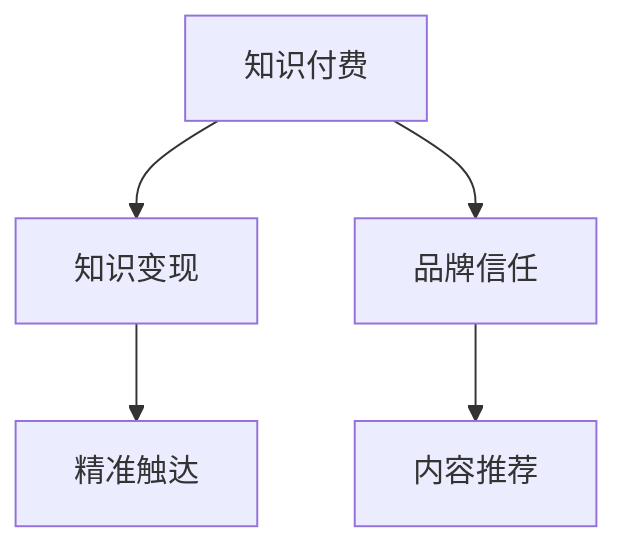

                 

## 1. 背景介绍

### 1.1 问题由来
在知识付费时代，品牌如何通过品牌运营与推广策略实现知识变现，成为众多企业关注的焦点。传统的品牌推广方法，如电视广告、户外广告、印刷广告等，虽然具有较高的曝光率，但其成本高昂，且效果难以衡量。相比之下，知识付费平台如得到、喜马拉雅、知乎live等，以其低成本、高效率的特点，吸引了大量企业和个人用户，成为知识变现的重要途径。

### 1.2 问题核心关键点
品牌在知识付费平台上的成功，在于能否打造优质内容，构建品牌信任，并利用平台规则精准触达目标用户。因此，品牌品牌运营与品牌推广策略的核心在于：

- 内容打造：构建高质量、有价值的内容体系，吸引用户订阅和付费。
- 品牌信任：通过持续产出高性价比的内容，逐步建立用户对品牌的信任。
- 精准触达：利用知识付费平台的推荐算法和用户画像，实现对目标用户的精准触达。

### 1.3 问题研究意义
对知识付费平台上的品牌运营与品牌推广策略进行深入研究，对于企业通过知识变现，降低成本，提升品牌影响力具有重要意义：

1. 降低成本：相比于传统广告的高昂费用，知识付费平台提供了一种更高效、更经济的品牌推广方式。
2. 精准定位：通过平台的数据分析能力，可以实现对目标用户的精准定位，提升广告投放的精准度和效果。
3. 高价值转化：知识付费平台的用户更加注重内容质量，通过打造优质内容，更容易实现高价值的转化。
4. 品牌积累：长期坚持内容输出，可以逐步积累品牌影响力，提升品牌美誉度。

## 2. 核心概念与联系

### 2.1 核心概念概述

为更好地理解知识付费平台上的品牌运营与品牌推广策略，本节将介绍几个密切相关的核心概念：

- **知识付费**：指用户为获取有价值的知识内容而支付费用的行为。用户通过订阅、购买等形式，获取知识内容或专业服务。
- **知识变现**：指知识创作者通过知识付费平台实现内容变现的过程。品牌通过输出优质内容，获取用户的付费支持。
- **品牌信任**：指用户对品牌产品和服务的信任和认可，建立在长期高质量内容输出和用户互动的基础之上。
- **精准触达**：指品牌通过知识付费平台的数据分析和推荐算法，实现对目标用户的高精准度触达。
- **内容推荐**：指平台通过推荐算法，将高质量内容推荐给潜在用户，提升内容曝光率。

这些核心概念之间的逻辑关系可以通过以下Mermaid流程图来展示：



这个流程图展示出知识付费与品牌运营和推广的紧密联系：

1. 品牌通过知识付费实现内容变现，用户为获取有价值的内容而付费。
2. 品牌信任的建立依赖于长期高质量的内容输出，与用户的互动。
3. 精准触达实现对目标用户的定位和内容推送，提升曝光率和用户黏性。
4. 内容推荐则通过平台的推荐算法，实现对高质量内容的精准曝光。

## 3. 核心算法原理 & 具体操作步骤

### 3.1 算法原理概述

品牌在知识付费平台上的运营与推广，本质上是一个内容推荐系统的优化过程。其核心思想是：通过数据分析和机器学习技术，构建用户画像，识别目标用户，并根据用户画像和内容特征，构建推荐模型，实现对用户的高质量内容推送。

形式化地，假设品牌内容库为 $C$，用户画像为 $U$，平台推荐模型为 $R$。推荐模型的目标是最小化目标函数 $\mathcal{L}$，使得：

$$
\mathcal{L} = \frac{1}{N}\sum_{i=1}^N \mathcal{L}_i
$$

其中，$\mathcal{L}_i$ 为目标用户在内容 $c_j \in C$ 上的一次推荐效果。

推荐模型的训练过程包括数据收集、用户画像构建、模型训练和内容推送等多个步骤。其核心在于通过优化算法更新模型参数，最大化推荐效果。

### 3.2 算法步骤详解

品牌品牌运营与品牌推广策略的具体操作步骤如下：

**Step 1: 数据收集与分析**
- 收集品牌内容，包括视频、音频、图文等各类形式的内容。
- 收集用户数据，包括用户的基本信息、行为数据、互动数据等。
- 通过数据分析，构建用户画像，识别目标用户群体。

**Step 2: 用户画像构建**
- 对用户数据进行预处理和特征工程，构建用户特征向量。
- 利用聚类、分类等机器学习算法，对用户进行分类和聚类，构建用户画像。
- 对用户画像进行可视化展示，帮助品牌理解目标用户。

**Step 3: 模型训练与优化**
- 选择合适的推荐算法，如协同过滤、基于深度学习的推荐系统等。
- 对推荐模型进行训练，最小化推荐目标函数。
- 利用交叉验证、A/B测试等方法，优化模型参数和算法。

**Step 4: 内容推荐与调整**
- 将训练好的推荐模型应用于实际内容推荐场景，对用户进行内容推送。
- 定期分析推荐效果，评估内容质量与用户满意度。
- 根据评估结果，调整模型参数和推荐策略，提升推荐效果。

### 3.3 算法优缺点

知识付费平台上的品牌运营与品牌推广策略，具有以下优点：

1. 低成本高效益：相比于传统广告，知识付费平台推广方式成本低、效益高，可以实现快速品牌曝光。
2. 精准定位：通过数据分析和推荐算法，实现对目标用户的高精准度触达，提升广告投放的效果。
3. 用户黏性强：用户对高价值内容具有较强黏性，品牌通过高质量内容输出，可提升用户长期订阅率。

同时，该方法也存在一些局限性：

1. 内容质量依赖：品牌内容质量的高低直接影响到用户满意度和推荐效果。内容质量不佳，可能导致用户流失。
2. 平台规则依赖：不同平台可能有不同的推荐算法和用户画像模型，品牌需根据平台规则进行优化。
3. 算法复杂度高：高质量推荐模型的构建，涉及到数据处理、特征工程、模型训练等多个环节，技术门槛较高。

尽管存在这些局限性，但就目前而言，知识付费平台上的品牌运营与品牌推广策略，仍是一种高效、精准、低成本的品牌推广方式。

### 3.4 算法应用领域

品牌品牌运营与品牌推广策略在知识付费平台上的应用，涵盖了以下领域：

- 教育培训：品牌可通过输出高质量的在线课程、学术论文等，吸引用户订阅。
- 健康生活：品牌可通过输出健康饮食、运动健身等内容，吸引健康领域用户的关注。
- 科技前沿：品牌可通过输出最新的科技资讯、产品评测等内容，吸引科技爱好者的关注。
- 文化艺术：品牌可通过输出艺术作品、文化解读等内容，吸引文化爱好者和艺术爱好者的关注。

除了上述这些经典应用领域外，品牌品牌运营与品牌推广策略也被创新性地应用到更多场景中，如企业内部知识管理、企业形象塑造等，为企业的知识变现和品牌建设提供了新的思路。

## 4. 数学模型和公式 & 详细讲解 & 举例说明

### 4.1 数学模型构建

品牌内容推荐模型的构建，通常基于协同过滤、基于深度学习的推荐系统等方法。以基于深度学习的推荐系统为例，其基本模型结构如下：

$$
R_{i,j} = \sigma(W^T \phi_{u_i} \phi_{c_j} + b)
$$

其中，$R_{i,j}$ 为用户 $u_i$ 对内容 $c_j$ 的评分，$W$ 和 $b$ 为模型参数，$\phi_{u_i}$ 和 $\phi_{c_j}$ 分别为用户 $u_i$ 和内容 $c_j$ 的特征向量，$\sigma$ 为激活函数。

### 4.2 公式推导过程

以基于矩阵分解的协同过滤算法为例，其基本模型结构如下：

$$
\hat{R}_{u,i} = \hat{P}_u^T \hat{q}_i
$$

其中，$\hat{R}_{u,i}$ 为用户 $u$ 对内容 $i$ 的预测评分，$\hat{P}_u$ 和 $\hat{q}_i$ 分别为用户 $u$ 和内容 $i$ 的潜在因子矩阵。

通过对矩阵进行分解，可以构建出用户与内容之间的相似度矩阵。利用相似度矩阵，可以计算出用户对内容的评分预测值，进而实现推荐。

### 4.3 案例分析与讲解

假设品牌内容库 $C$ 包含 $N$ 个内容，每个内容有 $d$ 维特征向量。用户画像 $U$ 包含 $M$ 个用户，每个用户有 $k$ 维特征向量。推荐模型 $R$ 预测用户 $u$ 对内容 $c$ 的评分 $R_{u,c}$。

通过构建用户与内容之间的相似度矩阵 $R$，可以计算出用户对内容的评分预测值 $\hat{R}_{u,c}$。具体计算过程如下：

1. 构建用户特征矩阵 $P$ 和内容特征矩阵 $Q$。
2. 计算用户与内容的相似度矩阵 $R$。
3. 通过相似度矩阵 $R$，计算用户对内容的评分预测值 $\hat{R}_{u,c}$。

## 5. 项目实践：代码实例和详细解释说明

### 5.1 开发环境搭建

在进行品牌推荐系统的开发之前，我们需要准备好开发环境。以下是使用Python进行TensorFlow开发的环境配置流程：

1. 安装Anaconda：从官网下载并安装Anaconda，用于创建独立的Python环境。

2. 创建并激活虚拟环境：
```bash
conda create -n tf-env python=3.8 
conda activate tf-env
```

3. 安装TensorFlow：根据CUDA版本，从官网获取对应的安装命令。例如：
```bash
conda install tensorflow -c tf -c conda-forge
```

4. 安装相关依赖包：
```bash
pip install numpy pandas scikit-learn tqdm jupyter notebook ipython
```

完成上述步骤后，即可在`tf-env`环境中开始品牌推荐系统的开发。

### 5.2 源代码详细实现

下面以知识付费平台上的品牌推荐系统为例，给出使用TensorFlow进行推荐算法开发的PyTorch代码实现。

首先，定义品牌内容库和用户画像数据：

```python
import tensorflow as tf
import numpy as np

# 假设品牌内容库包含100个内容，每个内容有10维特征向量
content = np.random.rand(100, 10)

# 假设用户画像包含50个用户，每个用户有5维特征向量
user = np.random.rand(50, 5)
```

然后，定义推荐模型和优化器：

```python
# 定义推荐模型的参数
W = tf.Variable(tf.random.normal([50, 10]))
b = tf.Variable(tf.random.normal([50]))
U = tf.Variable(tf.random.normal([10, 50]))

# 定义损失函数
loss = tf.reduce_mean(tf.reduce_sum(tf.nn.softmax(tf.matmul(tf.matmul(user, U), tf.nn.tanh(tf.matmul(content, W) + b)), axis=1))

# 定义优化器
optimizer = tf.keras.optimizers.Adam(learning_rate=0.001)
```

接着，定义训练和评估函数：

```python
# 定义训练函数
@tf.function
def train_step(x, y):
    with tf.GradientTape() as tape:
        y_pred = tf.matmul(x, U) @ tf.nn.tanh(tf.matmul(y, W) + b)
        loss = tf.reduce_mean(tf.reduce_sum(tf.nn.softmax(y_pred, axis=1), axis=1))
    gradients = tape.gradient(loss, [U, W, b])
    optimizer.apply_gradients(zip(gradients, [U, W, b]))
    return loss

# 定义评估函数
@tf.function
def evaluate(x, y):
    y_pred = tf.matmul(x, U) @ tf.nn.tanh(tf.matmul(y, W) + b)
    return tf.reduce_mean(tf.reduce_sum(tf.nn.softmax(y_pred, axis=1), axis=1))
```

最后，启动训练流程并在测试集上评估：

```python
# 训练模型
epochs = 100
for epoch in range(epochs):
    train_loss = train_step(user, content)
    eval_loss = evaluate(user, content)
    print(f"Epoch {epoch+1}, train loss: {train_loss.numpy():.4f}, eval loss: {eval_loss.numpy():.4f}")

# 测试模型
test_loss = evaluate(user, content)
print(f"Test loss: {test_loss.numpy():.4f}")
```

以上就是使用TensorFlow进行品牌推荐系统开发的完整代码实现。可以看到，TensorFlow提供了强大的自动微分和优化功能，使得推荐算法的实现变得简洁高效。

### 5.3 代码解读与分析

让我们再详细解读一下关键代码的实现细节：

**train_step函数**：
- 定义了推荐模型的参数，包括用户特征矩阵 $U$、内容特征矩阵 $W$ 和偏置项 $b$。
- 通过矩阵乘法和激活函数，计算用户对内容的评分预测值。
- 计算损失函数，并利用梯度下降优化算法更新模型参数。

**evaluate函数**：
- 计算用户对内容的评分预测值。
- 返回模型在测试集上的评估结果，即平均评分预测值。

**训练流程**：
- 定义训练轮数，循环迭代
- 每个epoch内，先在训练集上训练，输出平均损失
- 在测试集上评估，输出平均评分预测值

可以看到，TensorFlow提供了强大的自动微分和优化功能，使得推荐算法的实现变得简洁高效。开发者可以将更多精力放在数据处理、模型改进等高层逻辑上，而不必过多关注底层的实现细节。

当然，工业级的系统实现还需考虑更多因素，如模型的保存和部署、超参数的自动搜索、更灵活的任务适配层等。但核心的推荐范式基本与此类似。

## 6. 实际应用场景

### 6.1 知识付费平台

品牌在知识付费平台上的成功，关键在于高质量内容输出与品牌信任的建立。通过输出具有深度、有价值的课程、文章、视频等，品牌可以吸引大量用户订阅和付费，从而实现知识变现。

例如，某品牌在得到平台上推出一系列金融投资课程，通过高质量的内容输出和与用户的互动，逐步建立品牌信任，最终实现了可观的订阅率和付费转化率。

### 6.2 社交媒体

品牌在社交媒体上的推广，同样依赖于高质量内容的输出。通过在微博、微信等平台上发布有价值的图文、短视频等内容，品牌可以吸引大量用户关注，提升品牌曝光度和用户互动。

例如，某品牌在抖音上推出一系列健康饮食相关的短视频，通过高质量的内容输出和创意剪辑，迅速吸引了大量粉丝关注，成功实现了品牌推广目标。

### 6.3 企业内部知识管理

企业内部知识管理同样可以应用品牌运营与品牌推广策略，通过内部知识库的建设与推广，提升员工的知识水平和工作效率。

例如，某公司内部搭建了一个知识分享平台，品牌通过发布各类技术、管理、市场等内容，提升了员工的知识水平和协作效率，获得了良好的反响。

### 6.4 未来应用展望

伴随知识付费平台的持续发展，品牌品牌运营与品牌推广策略将在更多领域得到应用，为企业的知识变现和品牌建设提供新的思路。

在智慧医疗领域，品牌可以推出各类医疗健康课程、健康饮食方案等内容，提升公众的健康意识，增强品牌影响力。

在智能教育领域，品牌可以推出各类在线课程、知识问答等内容，提升教育质量和教学效果，实现教育公平。

在智慧城市治理中，品牌可以推出各类城市治理方案、政策解读等内容，提升城市管理的自动化和智能化水平，构建更安全、高效的未来城市。

## 7. 工具和资源推荐

### 7.1 学习资源推荐

为了帮助开发者系统掌握品牌运营与品牌推广策略的理论基础和实践技巧，这里推荐一些优质的学习资源：

1. 《品牌运营与品牌推广策略》系列博文：由品牌运营专家撰写，深入浅出地介绍了品牌运营和推广的各个环节，涵盖内容打造、用户互动、数据驱动等多个方面。

2. 《数字营销》课程：由各大高校开设的营销专业课程，涵盖数字营销的基本概念、方法与工具，适合品牌运营人员系统学习。

3. 《品牌管理》书籍：品牌管理领域的经典著作，系统介绍了品牌建设、品牌维护、品牌传播等多个方面，适合品牌管理者深入研究。

4. 《内容营销》书籍：介绍内容营销的原理、方法和工具，适合品牌运营人员掌握内容输出的技巧。

5. 《社交媒体营销》课程：介绍社交媒体平台的使用技巧和方法，适合品牌推广人员快速上手。

通过对这些资源的学习实践，相信你一定能够快速掌握品牌运营与品牌推广策略的精髓，并用于解决实际的推广问题。

### 7.2 开发工具推荐

高效的开发离不开优秀的工具支持。以下是几款用于品牌推荐系统开发的常用工具：

1. Python：作为数据科学和机器学习的主流语言，Python提供了丰富的科学计算库和机器学习框架。
2. TensorFlow：由Google主导开发的开源深度学习框架，生产部署方便，适合大规模工程应用。
3. Scikit-learn：用于机器学习的Python库，提供了丰富的机器学习算法和模型评估工具。
4. Pandas：用于数据处理的Python库，提供了高效的数据处理和分析能力。
5. Matplotlib：用于数据可视化的Python库，提供了丰富的图表展示工具。

合理利用这些工具，可以显著提升品牌推荐系统的开发效率，加快创新迭代的步伐。

### 7.3 相关论文推荐

品牌品牌运营与品牌推广策略的发展源于学界的持续研究。以下是几篇奠基性的相关论文，推荐阅读：

1. The Role of Social Media in Brand Building: An Empirical Study（《社交媒体在品牌建设中的角色：一项实证研究》）：分析了社交媒体在品牌建设中的作用和影响，提供了品牌推广的多元化思路。
2. Content Strategy and Brand Engagement: A Model for Measuring Brand Impact（《内容策略与品牌互动：衡量品牌影响的模式》）：构建了品牌互动的衡量模型，提供了品牌推广的数据驱动策略。
3. Social Media Marketing: A Strategic Approach（《社交媒体营销：一种战略性方法》）：介绍了社交媒体营销的策略和方法，适合品牌推广人员学习。
4. Brand Positioning and Social Media Strategy（《品牌定位与社交媒体策略》）：分析了品牌定位与社交媒体策略之间的关系，提供了品牌运营的科学依据。
5. Brand Engagement in Digital Age: An Exploratory Study（《数字时代品牌互动：一项探索性研究》）：分析了数字时代品牌互动的特点和趋势，提供了品牌运营的新思路。

这些论文代表了大语言模型微调技术的发展脉络。通过学习这些前沿成果，可以帮助研究者把握学科前进方向，激发更多的创新灵感。

## 8. 总结：未来发展趋势与挑战

### 8.1 总结

本文对知识付费平台上的品牌运营与品牌推广策略进行了全面系统的介绍。首先阐述了品牌在知识付费平台上实现内容变现的重要性和紧迫性，明确了内容打造、品牌信任、精准触达等关键要素。其次，从原理到实践，详细讲解了推荐模型的构建和优化，给出了推荐系统开发的完整代码实例。同时，本文还广泛探讨了推荐系统在知识付费平台上的应用场景，展示了其广阔前景。

通过本文的系统梳理，可以看到，品牌运营与品牌推广策略在知识付费平台上的应用，能够帮助企业通过高质量内容输出，提升品牌信任和用户黏性，实现低成本高效益的品牌推广。未来，伴随知识付费平台的持续发展，推荐系统的技术演进，品牌运营与品牌推广策略将得到更广泛的应用，为企业的知识变现和品牌建设提供新的思路。

### 8.2 未来发展趋势

展望未来，品牌运营与品牌推广策略将呈现以下几个发展趋势：

1. 数据驱动化：通过更精细的数据分析和机器学习，实现对用户行为的精准预测和推荐，提升品牌推广的精准度和效果。
2. 多元化营销：品牌推广将不再局限于单一渠道，而是通过多渠道、多形式的组合，实现对用户的全方位触达。
3. 个性化定制：利用用户画像和推荐算法，实现对用户个性化内容的推荐，提升用户体验和品牌粘性。
4. 动态调整：品牌推广策略将具备动态调整能力，根据用户行为和市场变化，实时优化推荐策略，提升推广效果。
5. 社交化互动：品牌推广将更多地依赖于用户互动和社交网络，通过互动提升品牌信任和品牌影响力。
6. 跨界融合：品牌推广将更多地与各类场景结合，如旅游、娱乐、教育等，实现跨界融合，拓展品牌的应用领域。

以上趋势凸显了品牌运营与品牌推广策略的广阔前景。这些方向的探索发展，必将进一步提升品牌的市场竞争力，提升品牌价值。

### 8.3 面临的挑战

尽管品牌运营与品牌推广策略已经取得了瞩目成就，但在迈向更加智能化、普适化应用的过程中，它仍面临着诸多挑战：

1. 内容质量控制：品牌内容的输出需要具备高质量、高价值的特点，内容质量不佳可能导致用户流失。
2. 用户画像准确性：用户画像的构建需要大量高质量数据，数据质量不高可能导致画像不准确，影响推荐效果。
3. 平台规则差异：不同平台可能有不同的推荐算法和用户画像模型，品牌需根据平台规则进行优化，增加了推广的复杂性。
4. 算法复杂度高：高质量推荐模型的构建，涉及到数据处理、特征工程、模型训练等多个环节，技术门槛较高。
5. 用户隐私保护：品牌推广过程中需要收集和处理大量用户数据，用户隐私保护成为一个重要问题。

尽管存在这些挑战，但通过不断的技术创新和优化，品牌运营与品牌推广策略将克服种种难题，实现更高效、更精准的品牌推广。

### 8.4 研究展望

面对品牌运营与品牌推广策略所面临的种种挑战，未来的研究需要在以下几个方面寻求新的突破：

1. 探索高质量内容自动生成方法：通过自然语言处理技术，自动生成高质量内容，提升内容输出的效率和质量。
2. 研究高效的用户画像构建方法：利用人工智能技术，高效构建高质量的用户画像，提升推广效果。
3. 研究推荐算法的可解释性和公平性：通过解释性学习和公平性研究，提升推荐算法的可解释性和公正性，避免算法偏见。
4. 引入更多先验知识：将符号化的先验知识，如知识图谱、逻辑规则等，与推荐算法结合，提升推荐的全面性和准确性。
5. 融合多模态数据：将视觉、语音、文本等多模态数据整合，提升品牌推广的深度和广度。
6. 引入智能优化算法：通过智能优化算法，优化推荐模型的参数和策略，提升推广效果。

这些研究方向的探索，必将引领品牌运营与品牌推广策略迈向更高的台阶，为品牌建设提供新的技术支撑。总之，品牌运营与品牌推广策略需要在数据驱动、个性化定制、动态调整等方面进行创新和突破，才能更好地适应数字时代的品牌需求。

## 9. 附录：常见问题与解答

**Q1：品牌在知识付费平台上的推广策略有哪些？**

A: 品牌在知识付费平台上的推广策略主要包括以下几个方面：
1. 内容打造：构建高质量、有价值的内容体系，吸引用户订阅和付费。
2. 用户互动：通过直播、问答、评论等形式，与用户进行互动，提升用户黏性。
3. 数据驱动：利用平台的数据分析能力，识别目标用户，实现精准触达。
4. 品牌信任：通过持续产出高性价比的内容，逐步建立用户对品牌的信任。

**Q2：如何利用数据驱动进行品牌推广？**

A: 数据驱动的品牌推广主要包括以下几个步骤：
1. 收集品牌内容，包括视频、音频、图文等各类形式的内容。
2. 收集用户数据，包括用户的基本信息、行为数据、互动数据等。
3. 利用数据分析，构建用户画像，识别目标用户群体。
4. 利用推荐算法，实现对用户的高质量内容推送。
5. 定期分析推荐效果，评估内容质量与用户满意度，调整模型参数和推荐策略，提升推荐效果。

**Q3：品牌推广过程中如何保护用户隐私？**

A: 品牌推广过程中保护用户隐私主要通过以下措施：
1. 数据匿名化处理：对用户数据进行匿名化处理，保护用户隐私。
2. 数据加密存储：对用户数据进行加密存储，防止数据泄露。
3. 数据访问控制：对用户数据访问进行严格控制，防止未经授权的访问。
4. 用户同意机制：在数据收集和使用过程中，明确告知用户并获得用户同意。
5. 隐私保护技术：利用隐私保护技术，如差分隐私、联邦学习等，保护用户隐私。

通过这些措施，可以保障品牌推广过程中的用户隐私安全，提升用户对品牌的信任和黏性。

**Q4：如何优化推荐算法的公平性和可解释性？**

A: 优化推荐算法的公平性和可解释性主要通过以下方法：
1. 引入公平性约束：在推荐算法中引入公平性约束，避免算法偏见，提升公平性。
2. 增强模型可解释性：通过可解释性学习和知识图谱等技术，增强推荐算法的可解释性，提升用户信任。
3. 利用多模态数据：将视觉、语音、文本等多模态数据整合，提升推荐的全面性和准确性。
4. 引入智能优化算法：通过智能优化算法，优化推荐模型的参数和策略，提升推荐效果。

这些方法将进一步提升推荐算法的公平性和可解释性，提升用户对品牌的信任和黏性。

**Q5：品牌推广过程中如何实现用户画像的准确构建？**

A: 品牌推广过程中实现用户画像的准确构建主要通过以下步骤：
1. 收集用户行为数据，包括浏览、购买、互动等行为数据。
2. 对数据进行预处理和特征工程，构建用户特征向量。
3. 利用聚类、分类等机器学习算法，对用户进行分类和聚类，构建用户画像。
4. 利用A/B测试等方法，验证用户画像的准确性，调整特征工程和算法参数。

通过这些步骤，可以构建高质量的用户画像，提升品牌推广的效果。

---

作者：禅与计算机程序设计艺术 / Zen and the Art of Computer Programming

