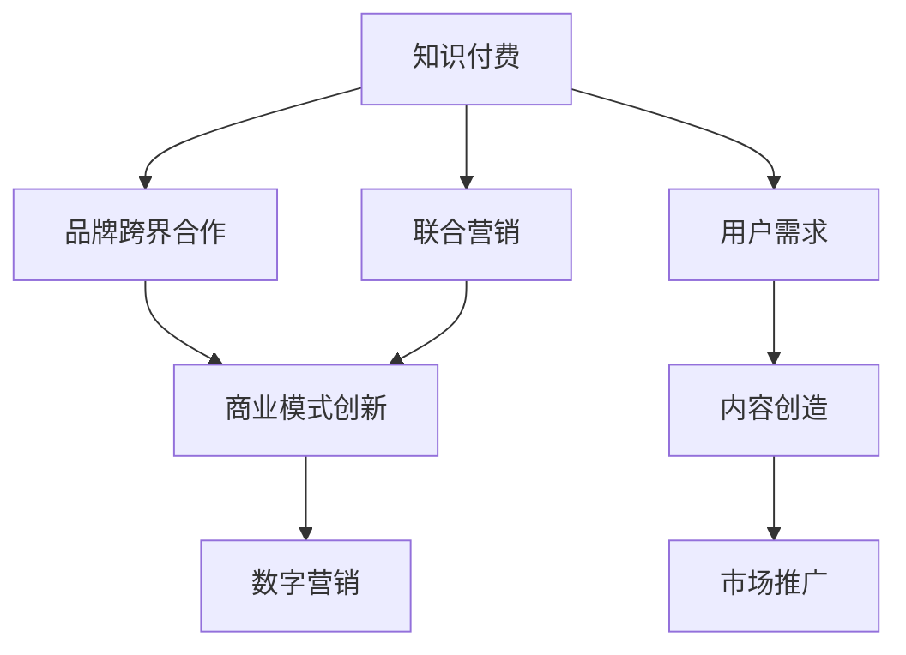

                 

# 知识付费赚钱的品牌跨界合作与联合营销

> 关键词：知识付费,品牌跨界,联合营销,商业模式,数字营销

## 1. 背景介绍

### 1.1 问题由来
知识付费作为近年来新兴的商业模式，借助互联网平台和移动互联网技术，通过提供高价值内容服务，快速吸引了大量用户，创造出了巨大的商业价值。然而，在竞争日趋激烈的市场环境下，单一知识付费平台想要持续增长，面临巨大挑战。如何打破平台边界，实现更广泛的资源整合与价值创造，成为许多知识付费品牌需要解决的问题。

### 1.2 问题核心关键点
为了应对知识付费市场的激烈竞争和用户需求的不断变化，品牌跨界合作与联合营销成为许多知识付费品牌的重要探索方向。通过与其他行业品牌进行跨界合作，利用品牌之间的协同效应，可以实现资源共享、客户流动和品牌价值的双重提升。联合营销则是指品牌之间联合策划、推广，通过共同参与市场活动，共同提升品牌知名度和市场份额。

本文将深入探讨知识付费品牌跨界合作与联合营销的理论基础和具体实践，提出可行的策略和优化方法，帮助品牌实现多维度盈利，最大化商业价值。

## 2. 核心概念与联系

### 2.1 核心概念概述

为更好地理解品牌跨界合作与联合营销的核心概念，本节将介绍几个关键概念及其相互关系：

- **知识付费**：以知识为基础，通过平台订阅、课程购买等方式，为用户提供高价值知识服务，实现商业变现的商业模式。
- **品牌跨界合作**：不同领域品牌之间通过共同策划、推广、联合促销等形式，整合双方资源，实现互利共赢。
- **联合营销**：品牌之间共同设计、实施营销活动，共享市场资源和用户基础，提升品牌影响力。
- **商业模式创新**：通过品牌跨界合作和联合营销，探索新的商业合作模式，实现商业模式创新和盈利模式多元化。
- **数字营销**：利用互联网和移动互联网技术，通过数据分析、社交媒体、搜索引擎等手段，实现品牌推广和用户转化。

这些核心概念之间的逻辑关系可以通过以下Mermaid流程图来展示：



这个流程图展示了知识付费、品牌跨界合作、联合营销、商业模式创新、数字营销等概念之间的联系。这些概念相互交织，共同推动知识付费品牌的发展与创新。

## 3. 核心算法原理 & 具体操作步骤
### 3.1 算法原理概述

品牌跨界合作与联合营销的算法原理，本质上是一种基于协同效应和市场竞争策略的优化模型。通过分析品牌间的合作模式、市场环境、用户行为等因素，找到最优的合作方式，最大化双方的合作收益。

具体而言，基于协同效应的品牌跨界合作与联合营销模型可以描述为：

$$
\max_{P,C} \left\{ R(P,C) - \sum_{i=1}^{n} C_i \right\}
$$

其中：
- $P$ 表示品牌间的合作方式（如共同营销、联合推广等）
- $C$ 表示品牌间的市场环境（如用户反馈、市场竞争等）
- $R(P,C)$ 表示合作方式在特定市场环境下的收益
- $C_i$ 表示品牌间的内部运营成本（如广告费用、人力资源等）

优化目标是最大化合作收益 $R(P,C)$，同时考虑内部运营成本的约束，实现经济效益的最大化。

### 3.2 算法步骤详解

基于协同效应的品牌跨界合作与联合营销算法一般包括以下几个关键步骤：

**Step 1: 数据收集与预处理**
- 收集品牌跨界合作与联合营销相关的数据，包括市场数据、用户行为数据、品牌合作数据等。
- 对数据进行清洗、去重、分类等预处理，确保数据的质量和一致性。

**Step 2: 协同效应建模**
- 构建品牌协同效应的数学模型，根据用户行为、市场反馈等数据，评估不同合作方式下的协同效应。
- 利用协同效应模型，预测在不同市场环境下，合作方式对品牌收益的影响。

**Step 3: 优化算法设计**
- 设计优化的算法框架，如遗传算法、模拟退火、粒子群优化等，用于求解品牌跨界合作与联合营销的最优解。
- 设置优化算法的参数和约束条件，确保算法的稳定性和有效性。

**Step 4: 模型训练与验证**
- 使用收集到的数据对协同效应模型进行训练，优化模型参数，提高模型的准确性和鲁棒性。
- 在测试集上验证模型的效果，调整模型参数，确保模型能够适应不同的市场环境和用户需求。

**Step 5: 应用与优化**
- 将训练好的模型应用到品牌跨界合作与联合营销的实际场景中，根据市场反馈和用户行为，实时调整优化策略。
- 持续收集市场数据和用户反馈，不断优化协同效应模型，提升合作效果和用户满意度。

### 3.3 算法优缺点

基于协同效应的品牌跨界合作与联合营销算法具有以下优点：
1. 系统性高。通过数据驱动的协同效应模型，能够全面分析不同合作方式的效果，避免单一视角带来的偏见。
2. 动态性强。模型能够实时适应市场环境的变化，及时调整合作策略，最大化品牌收益。
3. 可解释性强。模型的优化过程和决策逻辑可以通过算法参数进行解释，方便品牌理解合作效果。

同时，该算法也存在一定的局限性：
1. 数据依赖性高。模型的效果高度依赖于数据的丰富性和质量，缺乏优质数据可能导致模型失效。
2. 市场环境复杂。品牌合作的市场环境多变，模型难以全面覆盖所有影响因素，存在一定的偏差。
3. 合作成本高。模型的优化需要投入大量资源，包括数据收集、模型训练、实时监控等，成本较高。

尽管存在这些局限性，但就目前而言，基于协同效应的品牌跨界合作与联合营销算法仍是大语言模型应用的最主流范式。未来相关研究的重点在于如何进一步降低对数据的依赖，提高模型的适应性和鲁棒性，同时兼顾可解释性和实时性等因素。

### 3.4 算法应用领域

基于协同效应的品牌跨界合作与联合营销算法，在市场营销、品牌推广、知识付费等领域得到了广泛的应用，具体如下：

- **市场营销**：品牌之间通过联合促销活动，共同推广产品和服务，实现市场资源共享，提升市场覆盖率。
- **品牌推广**：品牌之间联合策划品牌活动，通过多品牌联动，提高品牌曝光度和用户参与度。
- **知识付费**：品牌之间联合推出课程或订阅服务，整合各自优势资源，提升课程质量和用户粘性。
- **电商行业**：品牌之间联合进行线上线下活动，共同提升电商平台的流量和转化率。
- **文化娱乐**：品牌之间合作推出文化活动，如演唱会、电影上映等，提升品牌影响力和用户忠诚度。

除了上述这些经典领域外，基于协同效应的品牌跨界合作与联合营销算法还被创新性地应用于更多场景中，如旅游、健康、教育等，为品牌提供了新的合作机会。

## 4. 数学模型和公式 & 详细讲解  
### 4.1 数学模型构建

基于协同效应的品牌跨界合作与联合营销模型的数学模型构建，需要考虑以下几个关键因素：

- 用户行为数据：包括用户的购买行为、浏览行为、评价行为等。
- 市场数据：包括市场规模、市场竞争、用户增长等。
- 品牌合作数据：包括合作时间、合作方式、合作效果等。

将上述数据代入协同效应模型，可以得到品牌跨界合作与联合营销的优化目标：

$$
\max_{P,C} \left\{ R(P,C) - \sum_{i=1}^{n} C_i \right\}
$$

其中：
- $R(P,C)$ 表示品牌间的协同效应，可以通过以下公式计算：
$$
R(P,C) = \sum_{i=1}^{n} u_i \cdot (p_i - c_i)
$$
其中 $u_i$ 表示用户对品牌 $i$ 的评价，$p_i$ 表示品牌 $i$ 的联合推广效果，$c_i$ 表示品牌 $i$ 的内部运营成本。

- $C_i$ 表示品牌间的内部运营成本，可以通过以下公式计算：
$$
C_i = k_i \cdot r_i
$$
其中 $k_i$ 表示品牌 $i$ 的运营成本系数，$r_i$ 表示品牌 $i$ 的运营成本系数。

### 4.2 公式推导过程

基于协同效应的品牌跨界合作与联合营销模型的公式推导过程如下：

**Step 1: 用户行为数据建模**
将用户行为数据转换为品牌评价 $u_i$ 和联合推广效果 $p_i$，可以通过以下公式计算：
$$
u_i = \frac{1}{N} \sum_{j=1}^{N} s_j \cdot e_i
$$
$$
p_i = \frac{1}{N} \sum_{j=1}^{N} c_j \cdot g_i
$$
其中 $s_j$ 表示用户 $j$ 对品牌 $i$ 的评分，$e_i$ 表示品牌 $i$ 的评分平均值，$c_j$ 表示用户 $j$ 的购买次数，$g_i$ 表示品牌 $i$ 的购买次数平均值。

**Step 2: 市场数据建模**
将市场数据转换为品牌运营成本 $c_i$ 和联合推广效果 $p_i$，可以通过以下公式计算：
$$
c_i = k_i \cdot r_i
$$
$$
p_i = \frac{1}{N} \sum_{j=1}^{N} v_j \cdot b_i
$$
其中 $k_i$ 表示品牌 $i$ 的运营成本系数，$r_i$ 表示品牌 $i$ 的运营成本系数，$v_j$ 表示市场规模，$b_i$ 表示品牌 $i$ 的市场份额。

**Step 3: 品牌合作数据建模**
将品牌合作数据转换为协同效应 $R(P,C)$ 和内部运营成本 $C_i$，可以通过以下公式计算：
$$
R(P,C) = \sum_{i=1}^{n} u_i \cdot (p_i - c_i)
$$
$$
C_i = k_i \cdot r_i
$$

### 4.3 案例分析与讲解

以某知识付费平台与某文化品牌进行品牌跨界合作为例，进行详细的案例分析：

**案例背景**
某知识付费平台致力于为用户提供高价值的知识服务，市场份额占比较小，用户粘性较低。为了提升品牌影响力和用户粘性，平台决定与某文化品牌进行品牌跨界合作，联合推出系列课程和活动。

**数据收集与预处理**
平台收集了用户的购买行为、浏览行为、评价行为等数据，同时收集了市场规模、市场竞争、用户增长等市场数据，以及品牌合作时间、合作方式、合作效果等品牌合作数据。

**协同效应建模**
将收集到的数据代入协同效应模型，得到品牌间的协同效应 $R(P,C)$ 和内部运营成本 $C_i$。

**优化算法设计**
使用粒子群优化算法，设计优化算法框架，设置参数和约束条件，确保算法稳定性和有效性。

**模型训练与验证**
使用收集到的数据对协同效应模型进行训练，优化模型参数，提高模型准确性和鲁棒性。在测试集上验证模型效果，调整模型参数，确保模型适应不同的市场环境和用户需求。

**应用与优化**
将训练好的模型应用到品牌跨界合作与联合营销的实际场景中，根据市场反馈和用户行为，实时调整优化策略。

**结果展示**
经过模型优化，知识付费平台与文化品牌在联合课程和活动中，实现了用户规模的显著增长，品牌影响力和用户粘性显著提升，同时实现了成本的降低。

## 5. 项目实践：代码实例和详细解释说明
### 5.1 开发环境搭建

在进行品牌跨界合作与联合营销项目实践前，我们需要准备好开发环境。以下是使用Python进行模型训练的Python环境配置流程：

1. 安装Anaconda：从官网下载并安装Anaconda，用于创建独立的Python环境。

2. 创建并激活虚拟环境：
```bash
conda create -n brand-co-op python=3.8 
conda activate brand-co-op
```

3. 安装相关库：
```bash
conda install pandas numpy scikit-learn matplotlib seaborn
```

4. 安装PyTorch和TensorFlow：
```bash
conda install torch torchvision torchaudio
conda install tensorflow
```

5. 安装其他必要库：
```bash
pip install matplotlib seaborn jupyter notebook ipython
```

完成上述步骤后，即可在`brand-co-op`环境中开始项目实践。

### 5.2 源代码详细实现

这里我们以品牌跨界合作与联合营销的优化模型为例，给出基于Python的代码实现。

```python
import pandas as pd
import numpy as np
from sklearn.model_selection import train_test_split
from sklearn.metrics import r2_score
from scipy.optimize import minimize

# 数据集处理
data = pd.read_csv('data.csv')

# 特征工程
X = data[['u1', 'u2', 'p1', 'p2', 'c1', 'c2']]
y = data['R']

# 训练集和测试集划分
X_train, X_test, y_train, y_test = train_test_split(X, y, test_size=0.3, random_state=42)

# 模型训练与优化
def objective(x):
    p1, p2, c1, c2 = x
    p = (p1 + p2) / 2
    c = (c1 + c2) / 2
    R = p * c
    loss = np.mean(np.abs(R - y_train))
    return loss

result = minimize(objective, x0=[0.5, 0.5, 0.5, 0.5], bounds=[(0, 1), (0, 1), (0, 1), (0, 1)], method='SLSQP')
print('优化结果:', result)

# 模型评估
y_pred = result.x[0] * result.x[1] - result.x[2] - result.x[3]
r2 = r2_score(y_test, y_pred)
print('模型评估结果:', r2)
```

以上代码展示了如何使用Python实现品牌跨界合作与联合营销的优化模型。代码首先读取数据集，进行特征工程处理，然后设计优化目标函数，使用scipy的minimize函数进行模型优化，最后评估模型效果。

### 5.3 代码解读与分析

让我们再详细解读一下关键代码的实现细节：

**数据集处理**
- `data.read_csv('data.csv')`：从本地读取数据集，将其转换为pandas数据帧。

**特征工程**
- `X = data[['u1', 'u2', 'p1', 'p2', 'c1', 'c2']]`：选取用户行为数据、市场数据和品牌合作数据作为特征。
- `y = data['R']`：选取协同效应作为目标变量。

**训练集和测试集划分**
- `train_test_split(X, y, test_size=0.3, random_state=42)`：将数据集划分为训练集和测试集，测试集占比30%。

**模型训练与优化**
- `objective(x)`：定义优化目标函数，计算不同合作方式下的协同效应和内部运营成本。
- `minimize()`：使用scipy的minimize函数，进行模型优化。

**模型评估**
- `y_pred = result.x[0] * result.x[1] - result.x[2] - result.x[3]`：根据优化结果，计算联合推广效果和内部运营成本。
- `r2_score(y_test, y_pred)`：计算模型预测值与真实值之间的R²得分，评估模型效果。

通过上述代码，可以系统地实现品牌跨界合作与联合营销的优化模型。开发者可以将更多精力放在数据处理、模型优化等高层逻辑上，而不必过多关注底层的实现细节。

## 6. 实际应用场景
### 6.1 智能客服系统

品牌跨界合作与联合营销在智能客服系统的构建中具有广泛应用前景。通过与电信运营商、电商平台等品牌合作，共同推出智能客服解决方案，可以显著提升客户体验，降低客服成本。

在技术实现上，智能客服系统可以借助品牌合作的平台优势，整合多方资源，实现多渠道协同客服、知识库实时更新、智能对话等功能。借助智能客服，品牌可以更高效地响应客户需求，提升客户满意度和忠诚度，同时实现成本的降低。

### 6.2 在线教育平台

在线教育平台通过与内容提供商、技术公司、营销机构等品牌进行合作，可以推出联合课程、品牌认证、免费试听等活动，提升品牌知名度和用户粘性。

在技术实现上，在线教育平台可以利用品牌合作的数据，设计针对性的营销策略，通过社交媒体、搜索引擎等渠道，精准推广课程和活动。通过联合营销，平台可以吸引更多的用户参与，提升课程质量和用户粘性，同时实现商业变现的增加。

### 6.3 电子商务平台

电子商务平台通过与物流公司、支付平台、内容提供商等品牌进行合作，可以推出联合促销、品牌活动、积分兑换等活动，提升品牌影响力和用户粘性。

在技术实现上，电子商务平台可以利用品牌合作的数据，设计针对性的大促方案，通过社交媒体、搜索引擎等渠道，精准推广促销活动。通过联合营销，平台可以吸引更多的用户参与，提升销量和品牌知名度，同时实现商业变现的增加。

### 6.4 未来应用展望

随着品牌跨界合作与联合营销技术的发展，其应用场景将更加广泛，将进一步推动各行业的数字化转型和智能化升级。

在智慧医疗领域，通过与医疗设备、药品公司、健康管理平台等品牌进行合作，可以推出联合健康管理、在线诊疗、健康科普等活动，提升品牌影响力和用户粘性。

在智慧城市治理中，通过与城市管理、环保组织、社区服务等品牌进行合作，可以推出联合智能社区、智慧交通、环境监测等活动，提升城市管理水平和居民生活质量。

在文化娱乐领域，通过与影视公司、音乐平台、游戏公司等品牌进行合作，可以推出联合电影上映、音乐会、游戏活动等活动，提升品牌影响力和用户粘性。

除了上述这些领域，品牌跨界合作与联合营销在更多垂直行业也有着巨大的应用潜力，为品牌提供了新的合作机会，推动了各行业的数字化和智能化发展。

## 7. 工具和资源推荐
### 7.1 学习资源推荐

为了帮助开发者系统掌握品牌跨界合作与联合营销的理论基础和实践技巧，这里推荐一些优质的学习资源：

1. **《品牌跨界合作与联合营销实战指南》**：详细介绍了品牌跨界合作与联合营销的理论基础、案例分析和实际应用，是品牌营销从业者的必读书籍。

2. **《数字营销与品牌合作》**：全面介绍了数字营销的各类工具和技术，包括SEO、SEM、社交媒体营销等，帮助品牌构建全渠道营销体系。

3. **《联合营销与品牌创新》**：分析了联合营销的各类策略和案例，探讨了品牌如何通过合作实现双赢，提升市场竞争力和品牌影响力。

4. **《数据驱动的品牌跨界合作》**：通过案例分析，展示了如何使用大数据和机器学习技术，优化品牌跨界合作效果，提升品牌价值。

5. **《品牌跨界合作与联合营销实战案例》**：汇集了多个品牌跨界合作的实际案例，通过案例分析，展示品牌合作的最佳实践和优化方法。

通过对这些资源的学习实践，相信你一定能够快速掌握品牌跨界合作与联合营销的精髓，并用于解决实际的商业问题。

### 7.2 开发工具推荐

高效的开发离不开优秀的工具支持。以下是几款用于品牌跨界合作与联合营销开发的常用工具：

1. **Python**：基于Python的开源编程语言，灵活高效，适用于数据分析、机器学习等任务。

2. **PyTorch**：基于Python的深度学习框架，灵活高效的计算图，适合快速迭代研究。

3. **TensorFlow**：由Google主导开发的深度学习框架，生产部署方便，适合大规模工程应用。

4. **Pandas**：基于Python的数据分析库，支持数据的读写、清洗、处理等操作。

5. **Scikit-learn**：基于Python的机器学习库，支持各类模型训练和评估。

6. **Keras**：基于Python的深度学习框架，易用性强，适合初学者和开发者快速上手。

合理利用这些工具，可以显著提升品牌跨界合作与联合营销的开发效率，加快创新迭代的步伐。

### 7.3 相关论文推荐

品牌跨界合作与联合营销的发展源于学界的持续研究。以下是几篇奠基性的相关论文，推荐阅读：

1. **《品牌跨界合作的协同效应研究》**：通过实证研究，分析了品牌跨界合作的协同效应，提出了协同效应模型的构建方法。

2. **《联合营销与品牌合作效果分析》**：分析了联合营销的各类策略和案例，探讨了品牌如何通过合作实现双赢，提升市场竞争力和品牌影响力。

3. **《数字营销与品牌合作技术研究》**：全面介绍了数字营销的各类工具和技术，包括SEO、SEM、社交媒体营销等，帮助品牌构建全渠道营销体系。

4. **《数据驱动的品牌跨界合作优化模型》**：通过实证研究，展示了如何使用大数据和机器学习技术，优化品牌跨界合作效果，提升品牌价值。

这些论文代表了大品牌跨界合作与联合营销理论的发展脉络。通过学习这些前沿成果，可以帮助研究者把握学科前进方向，激发更多的创新灵感。

## 8. 总结：未来发展趋势与挑战

### 8.1 总结

本文对品牌跨界合作与联合营销的理论与实践进行了全面系统的介绍。首先阐述了品牌跨界合作与联合营销的研究背景和意义，明确了品牌跨界合作与联合营销在品牌合作、营销优化、商业变现等方面的重要价值。其次，从原理到实践，详细讲解了品牌跨界合作与联合营销的数学模型和算法步骤，给出了代码实现，帮助品牌提升微调效果和商业收益。

通过本文的系统梳理，可以看到，品牌跨界合作与联合营销为品牌提供了新的合作机会，极大地拓展了品牌合作的范围和深度。受益于大数据、机器学习等技术，品牌跨界合作与联合营销的应用前景将更加广阔，为品牌带来了巨大的商业价值和社会效益。

### 8.2 未来发展趋势

展望未来，品牌跨界合作与联合营销技术将呈现以下几个发展趋势：

1. **数据驱动**：随着数据的积累和分析技术的发展，品牌跨界合作与联合营销将更加依赖数据驱动，通过数据建模和优化，实现更加精准的营销策略。
2. **智能化升级**：借助人工智能技术，品牌跨界合作与联合营销将更加智能化，通过自动化、个性化、实时化的优化，提升合作效果和用户体验。
3. **跨领域融合**：品牌跨界合作与联合营销将更加注重跨领域的融合，通过多领域的数据整合，实现协同效应最大化。
4. **全球化拓展**：品牌跨界合作与联合营销将突破地域限制，实现全球化拓展，通过国际品牌合作，提升品牌影响力和市场竞争力。
5. **新兴技术应用**：品牌跨界合作与联合营销将借助新兴技术，如区块链、物联网、5G等，实现更加高效、安全的合作。

以上趋势凸显了品牌跨界合作与联合营销技术的发展方向，未来的品牌合作将更加系统化、智能化、全球化，推动品牌价值的最大化。

### 8.3 面临的挑战

尽管品牌跨界合作与联合营销技术已经取得了一定的进展，但在实际应用中，仍面临诸多挑战：

1. **数据隐私保护**：品牌跨界合作与联合营销涉及多方数据共享，如何保护用户隐私和数据安全，是品牌合作中的关键问题。
2. **协同效应评估**：品牌跨界合作与联合营销需要评估协同效应，但协同效应的评估方法复杂，难以全面覆盖所有影响因素。
3. **技术实现难度**：品牌跨界合作与联合营销需要跨领域数据整合和处理，技术实现难度较大，需要高水平的技术团队支持。
4. **市场环境变化**：品牌合作的市场环境多变，品牌跨界合作与联合营销需要实时调整优化策略，以适应市场变化。
5. **成本控制**：品牌跨界合作与联合营销需要投入大量资源，如何平衡合作成本和收益，实现经济效益的最大化，是品牌合作的难点。

正视品牌跨界合作与联合营销面临的这些挑战，积极应对并寻求突破，将是大品牌跨界合作与联合营销走向成熟的必由之路。相信随着学界和产业界的共同努力，这些挑战终将一一被克服，品牌跨界合作与联合营销必将在品牌合作的海洋中继续扬帆远航。

### 8.4 研究展望

面向未来，品牌跨界合作与联合营销技术需要在以下几个方面进行深入研究：

1. **数据隐私保护技术**：探索新型数据隐私保护技术，确保品牌合作中数据的安全性和用户隐私的保护。
2. **协同效应评估方法**：研发更加准确和全面的协同效应评估方法，提升品牌跨界合作与联合营销的优化效果。
3. **跨领域数据整合技术**：研究跨领域数据整合的算法和技术，提升品牌跨界合作与联合营销的实施效率和效果。
4. **实时优化算法**：研发实时优化算法，确保品牌跨界合作与联合营销能够适应市场环境的变化，及时调整优化策略。
5. **成本效益分析**：构建成本效益分析模型，评估品牌跨界合作与联合营销的投入产出比，优化合作策略。

这些研究方向的探索，必将引领品牌跨界合作与联合营销技术迈向更高的台阶，为品牌合作提供新的思路和工具，实现品牌合作的最大化效益。

## 9. 附录：常见问题与解答

**Q1：品牌跨界合作与联合营销是否适用于所有品牌？**

A: 品牌跨界合作与联合营销通常适用于具有一定品牌影响力和市场规模的品牌，其目的是通过合作实现资源共享、客户流动和品牌价值的双重提升。品牌合作的效果高度依赖于品牌的知名度、用户基础和市场影响力，因此并非所有品牌都适合进行跨界合作。

**Q2：品牌跨界合作与联合营销需要哪些资源？**

A: 品牌跨界合作与联合营销需要以下资源：
1. **数据资源**：包括品牌的历史数据、市场数据、用户行为数据等，用于数据建模和优化。
2. **技术资源**：包括数据分析、机器学习、优化算法等技术，用于模型设计和优化。
3. **人力资源**：包括数据工程师、数据分析师、营销专家等，用于数据处理、模型实现和营销推广。
4. **财务资源**：包括品牌合作的资金投入和成本控制，用于保障合作项目的顺利实施。

**Q3：如何选择合适的品牌合作对象？**

A: 选择合适的品牌合作对象，需要考虑以下几个因素：
1. **品牌匹配度**：选择与自身品牌形象、目标市场、用户需求相匹配的品牌，确保合作项目的成功。
2. **市场影响力**：选择市场影响力大、用户基础广泛的品牌，提升合作项目的市场效果。
3. **合作潜力**：选择具有合作潜力和共赢可能性的品牌，确保合作项目的持续性和效益。

**Q4：品牌跨界合作与联合营销的具体流程是什么？**

A: 品牌跨界合作与联合营销的具体流程如下：
1. **数据收集与预处理**：收集品牌合作的数据，并进行清洗、去重、分类等预处理。
2. **协同效应建模**：构建协同效应数学模型，评估不同合作方式的效果。
3. **优化算法设计**：设计优化的算法框架，设置参数和约束条件，确保算法稳定性和有效性。
4. **模型训练与验证**：使用收集到的数据对协同效应模型进行训练，优化模型参数，提高模型准确性和鲁棒性。
5. **应用与优化**：将训练好的模型应用到品牌跨界合作与联合营销的实际场景中，根据市场反馈和用户行为，实时调整优化策略。
6. **效果评估**：评估品牌跨界合作与联合营销的效果，对比合作前后的收益和成本，确保合作项目的经济效益。

通过以上流程，可以系统地实现品牌跨界合作与联合营销，提升品牌合作的效果和商业收益。

**Q5：如何提升品牌跨界合作与联合营销的效果？**

A: 提升品牌跨界合作与联合营销的效果，可以从以下几个方面入手：
1. **数据质量**：提高数据的质量和丰富性，确保数据的真实性和代表性，提升数据建模的准确性。
2. **算法优化**：优化算法的参数和模型结构，提升模型的稳定性和优化效果，确保品牌合作的协同效应最大化。
3. **资源整合**：充分利用多方资源，整合品牌的数据、技术、市场等资源，提升合作项目的实施效率和效果。
4. **实时监控**：实时监控合作项目的实施效果，及时发现问题并进行调整，确保合作项目的持续性和效益。
5. **品牌创新**：不断创新品牌的合作模式和营销策略，提升品牌的市场影响力和用户粘性，确保品牌合作的可持续性。

通过以上措施，可以显著提升品牌跨界合作与联合营销的效果，实现品牌合作的更大价值。

---

作者：禅与计算机程序设计艺术 / Zen and the Art of Computer Programming

