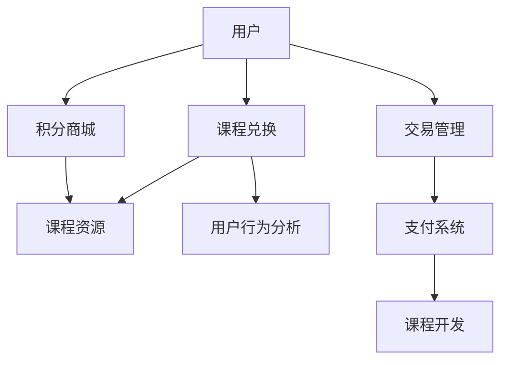

                 

# 知识付费赚钱的用户课程兑换与积分商城运营

## 1. 背景介绍

随着互联网技术的发展和教育模式的创新，知识付费成为了一种新兴的教育消费方式。用户通过订阅、购买课程，获得对知识的学习和掌握。知识付费平台如雨后春笋般涌现，为知识生产者和消费者搭建了一个桥梁，实现了知识商品的数字化和商品化。用户课程兑换与积分商城运营作为知识付费平台的重要功能，是平台盈利的重要来源，也是提升用户体验和粘性的关键。本文将对知识付费平台上用户课程兑换与积分商城运营的原理、核心概念与联系、核心算法、模型构建与优化、项目实践、实际应用、工具与资源、总结与展望等内容进行详细阐述，为知识付费平台的运营提供全面的指导。

## 2. 核心概念与联系

### 2.1 核心概念概述

在知识付费平台上，用户课程兑换与积分商城运营涉及多个核心概念：

- **用户课程**：指平台提供的各类付费课程，通常以视频、音频或文本形式呈现。
- **课程兑换**：指用户使用积分、现金或其他支付方式，将购买的课程兑换成实际的课程资源，以便随时访问学习。
- **积分商城**：指用户通过参与平台活动、完成任务等方式获取积分，并在商城中兑换商品或课程。
- **交易管理**：指平台对用户与课程、积分之间进行交易管理的系统模块。
- **用户行为分析**：指通过对用户行为数据的收集和分析，优化课程推荐、积分获取等策略，提升用户满意度和粘性。

这些概念通过交易、积分、行为分析等机制相互关联，共同构建了一个完整的知识付费生态系统。

### 2.2 核心概念原理和架构的 Mermaid 流程图



这个流程图展示了用户课程兑换与积分商城运营的核心流程和关联关系：

1. **用户**：是知识付费平台的最终服务对象。
2. **课程兑换**：用户通过积分或支付，将课程兑换为实际可访问的课程资源。
3. **积分商城**：用户通过参与平台活动获取积分，并在商城中兑换商品或课程。
4. **交易管理**：平台对用户与课程、积分之间的交易进行管理，确保交易的合法性和安全性。
5. **用户行为分析**：通过对用户行为数据进行分析，优化课程推荐、积分获取等策略，提升用户满意度。
6. **支付系统**：为用户提供支付渠道，确保交易的顺利进行。
7. **课程开发**：提供高质量的课程内容，满足用户的学习需求。

## 3. 核心算法原理 & 具体操作步骤

### 3.1 算法原理概述

知识付费平台的用户课程兑换与积分商城运营涉及多种算法和模型，主要包括以下几个方面：

- **推荐算法**：通过分析用户行为数据，推荐用户可能感兴趣的课程。
- **积分计算模型**：根据用户参与平台活动的表现，计算其获得的积分数量。
- **课程定价模型**：根据课程内容和市场定位，设定课程的价格。
- **支付算法**：实现用户与平台之间的支付结算，确保交易的准确性和安全性。

### 3.2 算法步骤详解

#### 3.2.1 推荐算法

推荐算法旨在根据用户的历史行为和偏好，推荐可能感兴趣的课程。常用的推荐算法包括协同过滤、基于内容的推荐、混合推荐等。以协同过滤为例，算法步骤如下：

1. **数据准备**：收集用户的历史行为数据，如浏览、观看、购买等。
2. **相似度计算**：计算用户之间的相似度，可以使用余弦相似度、皮尔逊相关系数等。
3. **推荐计算**：根据相似度计算结果，推荐用户可能感兴趣的课程。

#### 3.2.2 积分计算模型

积分计算模型用于根据用户参与平台活动的表现，计算其获得的积分数量。积分计算模型的核心是设定积分获取的条件和权重。以任务积分为例，算法步骤如下：

1. **任务设定**：设定平台任务，如每日打卡、邀请好友等。
2. **积分获取**：根据任务完成情况，计算用户获得的积分数量。
3. **积分兑换**：用户可以通过积分在商城中兑换商品或课程。

#### 3.2.3 课程定价模型

课程定价模型用于根据课程内容和市场定位，设定课程的价格。常用的课程定价模型包括动态定价、固定定价、套餐定价等。以动态定价为例，算法步骤如下：

1. **市场需求分析**：分析课程的市场需求和用户支付能力。
2. **价格设定**：根据市场需求和成本，设定课程的动态价格。
3. **价格调整**：根据市场需求变化，调整课程价格。

#### 3.2.4 支付算法

支付算法用于实现用户与平台之间的支付结算，确保交易的准确性和安全性。常用的支付算法包括第三方支付、信用卡支付、余额支付等。以第三方支付为例，算法步骤如下：

1. **支付通道选择**：选择适合的第三方支付通道，如支付宝、微信支付等。
2. **支付信息验证**：验证支付信息，确保交易的真实性。
3. **交易结算**：完成支付，更新用户账户余额和课程状态。

### 3.3 算法优缺点

**推荐算法的优缺点**：
- **优点**：能够根据用户行为数据，推荐可能感兴趣的课程，提高用户粘性。
- **缺点**：推荐的准确性受限于数据质量和算法模型，可能导致推荐结果偏差。

**积分计算模型的优缺点**：
- **优点**：通过积分激励用户参与平台活动，提升用户活跃度和粘性。
- **缺点**：积分计算过于简单可能导致用户对积分的积极性下降，积分兑换机制不合理可能导致用户流失。

**课程定价模型的优缺点**：
- **优点**：根据市场定位和用户需求，设定合理的课程价格，满足不同用户的需求。
- **缺点**：定价过高可能导致用户流失，定价过低可能导致平台收益不足。

**支付算法的优缺点**：
- **优点**：实现用户与平台之间的安全支付，保障交易的准确性和安全性。
- **缺点**：支付算法的复杂度较高，可能导致支付失败或支付延迟。

### 3.4 算法应用领域

用户课程兑换与积分商城运营在知识付费平台的应用领域广泛，包括但不限于以下几个方面：

- **教育培训**：如K12教育、职业培训等，用户可以通过积分或支付兑换课程资源，提升技能水平。
- **个人发展**：如职业技能提升、健康管理等，用户可以通过积分或支付获取课程，实现自我提升。
- **企业培训**：如企业员工培训、企业内训等，企业可以通过批量购买课程，提升员工素质。

## 4. 数学模型和公式 & 详细讲解

### 4.1 数学模型构建

在知识付费平台的用户课程兑换与积分商城运营中，数学模型主要涉及以下几个方面：

- **推荐模型**：常用的推荐模型包括协同过滤、基于内容的推荐、混合推荐等。以协同过滤为例，数学模型如下：

$$
similarity(u, v) = \frac{\sum_{i=1}^{n} x_{ui} \cdot x_{vi}}{\sqrt{\sum_{i=1}^{n} x_{ui}^2} \cdot \sqrt{\sum_{i=1}^{n} x_{vi}^2}}
$$

其中，$x_{ui}$ 表示用户 $u$ 对课程 $i$ 的评分，$x_{vi}$ 表示课程 $i$ 的评分，$similarity(u, v)$ 表示用户 $u$ 和用户 $v$ 之间的相似度。

- **积分计算模型**：常用的积分计算模型包括任务积分、行为积分等。以任务积分为例，数学模型如下：

$$
积分 = \sum_{i=1}^{n} (任务完成情况 \cdot 权重)
$$

其中，$n$ 表示任务的个数，$任务完成情况$ 表示用户完成每个任务的情况，$权重$ 表示任务的权重。

- **课程定价模型**：常用的课程定价模型包括动态定价、固定定价、套餐定价等。以动态定价为例，数学模型如下：

$$
价格 = 成本 + 市场需求 \cdot 利润率
$$

其中，$成本$ 表示课程的开发成本，$市场需求$ 表示课程的市场需求，$利润率$ 表示平台的利润率。

- **支付算法**：常用的支付算法包括第三方支付、信用卡支付、余额支付等。以第三方支付为例，数学模型如下：

$$
交易金额 = 订单金额 - 支付金额
$$

其中，$订单金额$ 表示订单的总金额，$支付金额$ 表示用户支付的金额。

### 4.2 公式推导过程

#### 4.2.1 推荐模型推导

以协同过滤为例，推荐模型的推导过程如下：

1. **相似度计算**：
   - 用户 $u$ 与课程 $i$ 的评分矩阵为 $X$，$X$ 的形式为：
   - $$
   X = \begin{bmatrix}
   x_{11} & x_{12} & \cdots & x_{1n} \\
   x_{21} & x_{22} & \cdots & x_{2n} \\
   \vdots & \vdots & \ddots & \vdots \\
   x_{m1} & x_{m2} & \cdots & x_{mn}
   \end{bmatrix}
   $$
   - 用户 $u$ 与用户 $v$ 之间的相似度计算公式为：
   - $$
   similarity(u, v) = \frac{\sum_{i=1}^{n} x_{ui} \cdot x_{vi}}{\sqrt{\sum_{i=1}^{n} x_{ui}^2} \cdot \sqrt{\sum_{i=1}^{n} x_{vi}^2}}
   $$

2. **推荐计算**：
   - 根据用户 $u$ 与课程 $i$ 的评分矩阵 $X$ 和用户 $v$ 与课程 $i$ 的评分矩阵 $Y$，计算用户 $u$ 对课程 $i$ 的推荐分数 $R_{ui}$，公式为：
   - $$
   R_{ui} = \frac{\sum_{j=1}^{m} similarity(u, j) \cdot x_{ji}}{\sqrt{\sum_{j=1}^{m} similarity(u, j)^2} \cdot \sqrt{\sum_{j=1}^{m} x_{ji}^2}}
   $$
   - 根据推荐分数 $R_{ui}$ 进行排序，推荐用户可能感兴趣的课程。

#### 4.2.2 积分计算模型推导

以任务积分为例，积分计算模型的推导过程如下：

1. **任务设定**：
   - 任务为 $T_1, T_2, \cdots, T_n$，每个任务的权重为 $w_1, w_2, \cdots, w_n$，用户完成每个任务的情况为 $C_1, C_2, \cdots, C_n$。

2. **积分计算**：
   - 用户 $u$ 的任务积分计算公式为：
   - $$
   积分 = \sum_{i=1}^{n} (C_i \cdot w_i)
   $$

#### 4.2.3 课程定价模型推导

以动态定价为例，课程定价模型的推导过程如下：

1. **市场需求分析**：
   - 市场需求为 $D$，用户支付能力为 $C$，平台利润率为 $r$。

2. **价格设定**：
   - 课程 $i$ 的动态价格 $P_i$ 为：
   - $$
   P_i = C_i + D_i \cdot r
   $$

3. **价格调整**：
   - 根据市场需求变化，调整课程价格，公式为：
   - $$
   P_i = C_i + \delta(D_i) \cdot r
   $$
   - 其中，$\delta(D_i)$ 表示市场需求的变动量。

#### 4.2.4 支付算法推导

以第三方支付为例，支付算法的推导过程如下：

1. **支付通道选择**：
   - 选择适合的第三方支付通道，如支付宝、微信支付等。

2. **支付信息验证**：
   - 验证支付信息，确保交易的真实性。

3. **交易结算**：
   - 完成支付，更新用户账户余额和课程状态，公式为：
   - $$
   交易金额 = 订单金额 - 支付金额
   $$

## 5. 项目实践：代码实例和详细解释说明

### 5.1 开发环境搭建

在知识付费平台的用户课程兑换与积分商城运营项目中，开发环境搭建的步骤如下：

1. **安装开发环境**：
   - 安装Python环境，建议使用Anaconda。
   - 安装必要的第三方库，如Flask、SQLAlchemy、Numpy等。

2. **数据库搭建**：
   - 搭建SQL数据库，如MySQL、PostgreSQL等，用于存储用户数据、课程数据、交易数据等。

3. **前端开发**：
   - 使用前端框架如React、Vue等，开发用户界面，提供课程兑换、积分商城等功能。

4. **后端开发**：
   - 使用后端框架如Flask、Django等，开发API接口，实现用户注册、课程兑换、积分商城等功能。

5. **测试和部署**：
   - 进行单元测试、集成测试等，确保代码质量。
   - 部署到生产环境，确保系统的稳定性和安全性。

### 5.2 源代码详细实现

以下是一个简单的用户课程兑换与积分商城运营项目的Python代码实现：

```python
from flask import Flask, request, jsonify
from flask_sqlalchemy import SQLAlchemy
from sqlalchemy import create_engine
from sqlalchemy.orm import sessionmaker
from models import User, Course, Transaction

app = Flask(__name__)

# 配置数据库连接
app.config['SQLALCHEMY_DATABASE_URI'] = 'sqlite:///users.db'
app.config['SQLALCHEMY_TRACK_MODIFICATIONS'] = False

# 初始化数据库
db = SQLAlchemy(app)
Session = sessionmaker(bind=db, autoflush=False)

# 定义用户模型
class User(db.Model):
    id = db.Column(db.Integer, primary_key=True)
    name = db.Column(db.String(50), nullable=False)
    balance = db.Column(db.Float, default=0)

# 定义课程模型
class Course(db.Model):
    id = db.Column(db.Integer, primary_key=True)
    title = db.Column(db.String(100), nullable=False)
    price = db.Column(db.Float, nullable=False)

# 定义交易模型
class Transaction(db.Model):
    id = db.Column(db.Integer, primary_key=True)
    user_id = db.Column(db.Integer, db.ForeignKey('user.id'))
    course_id = db.Column(db.Integer, db.ForeignKey('course.id'))
    amount = db.Column(db.Float, nullable=False)
    timestamp = db.Column(db.DateTime, default=datetime.utcnow)

# 用户注册接口
@app.route('/register', methods=['POST'])
def register():
    data = request.get_json()
    user = User(name=data['name'])
    db.session.add(user)
    db.session.commit()
    return jsonify({'message': 'User registered successfully'})

# 用户课程兑换接口
@app.route('/exchange', methods=['POST'])
def exchange():
    data = request.get_json()
    user = User.query.get(data['user_id'])
    course = Course.query.get(data['course_id'])
    amount = data['amount']
    if user.balance >= amount:
        transaction = Transaction(user=user, course=course, amount=amount)
        db.session.add(transaction)
        user.balance -= amount
        db.session.commit()
        return jsonify({'message': 'Course exchanged successfully'})
    else:
        return jsonify({'message': 'Insufficient balance'})

# 用户积分商城接口
@app.route('/market', methods=['GET'])
def market():
    courses = Course.query.all()
    courses_with_price = [(course.title, course.price) for course in courses]
    return jsonify(courses_with_price)

if __name__ == '__main__':
    app.run(debug=True)
```

### 5.3 代码解读与分析

在上述代码中，我们定义了用户、课程、交易等模型，并实现了用户注册、课程兑换、积分商城等功能。以下是代码的详细解读：

- **用户注册**：通过`/register`接口，接收用户注册信息，创建用户模型，并更新数据库。
- **课程兑换**：通过`/exchange`接口，接收用户兑换课程的信息，检查用户余额，若余额充足则创建交易记录，更新用户余额。
- **积分商城**：通过`/market`接口，获取所有课程的信息，返回课程标题和价格。

### 5.4 运行结果展示

运行上述代码后，可以通过访问`/register`、`/exchange`、`/market`等接口，测试用户注册、课程兑换、积分商城等功能。例如，使用POST请求发送如下JSON数据：

```json
{
    "name": "Alice",
    "user_id": 1,
    "course_id": 1,
    "amount": 100
}
```

到`/exchange`接口，可以完成课程兑换。使用GET请求访问`/market`接口，可以查看所有课程信息。

## 6. 实际应用场景

用户课程兑换与积分商城运营在知识付费平台上有着广泛的应用场景，主要包括以下几个方面：

### 6.1 教育培训

在教育培训领域，用户可以通过积分或支付兑换课程资源，提升技能水平。例如，K12教育平台上的数学、英语、编程等课程，用户可以通过完成作业、参加测试等方式获得积分，兑换课程学习。

### 6.2 个人发展

在个人发展领域，用户可以通过积分或支付获取课程，实现自我提升。例如，职业发展平台上的人力资源管理、项目管理、财务分析等课程，用户可以通过参加课程、完成项目等方式获得积分，兑换课程学习。

### 6.3 企业培训

在企业培训领域，企业可以通过批量购买课程，提升员工素质。例如，企业内训平台上的人力资源管理、项目管理、企业文化等课程，企业可以批量购买，为员工提供系统培训。

## 7. 工具和资源推荐

### 7.1 学习资源推荐

为帮助开发者掌握用户课程兑换与积分商城运营的原理与实践，以下是一些优质的学习资源：

1. **《Python Web开发实战》**：本书介绍了Python Web开发的基础知识和实战技巧，包括Flask、SQLAlchemy等库的使用。

2. **《Flask Web开发实战》**：本书介绍了Flask Web开发的详细实战案例，涵盖用户注册、课程兑换等功能实现。

3. **《SQLAlchemy实战教程》**：本书介绍了SQLAlchemy的使用方法，涵盖数据库连接、模型定义、事务管理等。

4. **《用户行为分析与推荐系统实战》**：本书介绍了用户行为分析与推荐系统的实现方法，涵盖协同过滤、基于内容的推荐等算法。

5. **《Python网络爬虫与数据采集实战》**：本书介绍了Python网络爬虫的实现方法，涵盖爬虫框架、数据处理等。

### 7.2 开发工具推荐

以下是一些常用的开发工具，可以帮助开发者快速实现用户课程兑换与积分商城运营项目：

1. **PyCharm**：一款功能强大的Python IDE，支持多语言开发、调试、测试等功能。

2. **Visual Studio Code**：一款轻量级的代码编辑器，支持多种语言和插件扩展。

3. **Git**：一款常用的版本控制工具，支持分布式协作开发。

4. **JIRA**：一款项目管理工具，支持任务分配、进度跟踪等功能。

5. **Slack**：一款团队协作工具，支持实时通讯、文件共享等功能。

### 7.3 相关论文推荐

用户课程兑换与积分商城运营涉及多个领域的最新研究进展，以下是一些相关的论文：

1. **《协同过滤推荐算法综述》**：论文介绍了协同过滤推荐算法的基本原理和实现方法，涵盖了矩阵分解、奇异值分解等算法。

2. **《动态定价模型的研究综述》**：论文介绍了动态定价模型的基本原理和应用场景，包括收益管理、拍卖机制等。

3. **《用户行为分析与推荐系统研究综述》**：论文介绍了用户行为分析与推荐系统的基本原理和实现方法，涵盖了协同过滤、基于内容的推荐等算法。

## 8. 总结：未来发展趋势与挑战

### 8.1 研究成果总结

本文详细介绍了用户课程兑换与积分商城运营的原理、核心概念与联系、核心算法、模型构建与优化、项目实践、实际应用、工具与资源等内容，为知识付费平台的运营提供了全面的指导。

### 8.2 未来发展趋势

未来，用户课程兑换与积分商城运营在知识付费平台的应用将更加广泛，涉及更多的领域和应用场景。以下是一些未来的发展趋势：

1. **多模态推荐**：将文本、图像、视频等多模态数据进行融合，实现更加全面和准确的推荐。
2. **个性化推荐**：基于用户行为数据，实现更加个性化的推荐，提高用户满意度。
3. **实时推荐**：实现实时推荐，提升用户体验和粘性。
4. **动态定价**：实现动态定价，优化用户支付和平台收益。

### 8.3 面临的挑战

尽管用户课程兑换与积分商城运营在知识付费平台的应用前景广阔，但仍面临一些挑战：

1. **数据质量**：推荐算法和定价模型的准确性依赖于高质量的用户行为数据，数据质量较差可能导致推荐结果偏差和定价不合理。
2. **技术复杂度**：推荐算法和定价模型的实现较为复杂，需要深入的技术积累和实践经验。
3. **用户体验**：用户行为分析与推荐系统需要考虑用户体验，避免过度干扰用户。

### 8.4 研究展望

未来的研究可以从以下几个方面进行：

1. **多模态融合**：将文本、图像、视频等多模态数据进行融合，实现更加全面和准确的推荐。
2. **个性化推荐**：基于用户行为数据，实现更加个性化的推荐，提高用户满意度。
3. **动态定价**：实现动态定价，优化用户支付和平台收益。
4. **实时推荐**：实现实时推荐，提升用户体验和粘性。

## 9. 附录：常见问题与解答

### Q1: 知识付费平台用户课程兑换与积分商城运营的主要功能有哪些？

A: 知识付费平台用户课程兑换与积分商城运营的主要功能包括：

1. 用户注册：用户可以通过注册账号，获取课程资源。

2. 课程兑换：用户可以通过积分或支付，将购买的课程兑换为实际的课程资源，以便随时访问学习。

3. 积分商城：用户可以通过参与平台活动获取积分，并在商城中兑换商品或课程。

4. 用户行为分析：平台通过对用户行为数据的收集和分析，优化课程推荐、积分获取等策略，提升用户满意度和粘性。

### Q2: 如何优化推荐算法的准确性？

A: 推荐算法的准确性受限于数据质量和算法模型。以下是一些优化推荐算法准确性的方法：

1. 数据预处理：对用户行为数据进行清洗、去重、标准化等预处理操作，确保数据质量。

2. 特征工程：选择合适的特征，进行特征提取和特征组合，提高模型的表达能力。

3. 模型选择：选择合适的推荐算法，如协同过滤、基于内容的推荐、混合推荐等，根据实际场景进行选择。

4. 模型调优：对推荐模型进行调优，选择合适的超参数和正则化方法，避免过拟合和欠拟合。

### Q3: 积分商城中商品或课程的定价策略有哪些？

A: 积分商城中商品或课程的定价策略主要包括：

1. 动态定价：根据市场需求和用户支付能力，设定动态价格，优化用户支付和平台收益。

2. 固定定价：根据课程内容和市场定位，设定固定价格，满足不同用户的需求。

3. 套餐定价：将多门课程打包成套餐，设定合理的价格，吸引用户购买。

### Q4: 用户积分商城的积分如何计算？

A: 用户积分商城的积分计算主要基于用户参与平台活动的表现。以下是一些积分计算的方法：

1. 任务积分：用户通过完成平台任务，如每日打卡、邀请好友等，获得积分。

2. 行为积分：用户通过浏览、观看、购买课程等行为，获得积分。

3. 推荐积分：用户通过推荐课程给其他用户，获得积分。

4. 分享积分：用户通过分享课程到社交媒体，获得积分。

### Q5: 推荐算法和定价模型的常见问题有哪些？

A: 推荐算法和定价模型的常见问题主要包括：

1. 推荐结果偏差：由于数据质量较差或模型选择不当，导致推荐结果偏差。

2. 定价不合理：由于定价策略不合理，导致用户支付和平台收益不均衡。

3. 过拟合和欠拟合：由于模型复杂度过高或过低，导致模型过拟合或欠拟合。

4. 用户体验差：由于推荐算法和定价模型过于复杂，导致用户体验较差，用户流失。

### Q6: 用户课程兑换与积分商城运营的未来发展方向有哪些？

A: 用户课程兑换与积分商城运营的未来发展方向主要包括：

1. 多模态融合：将文本、图像、视频等多模态数据进行融合，实现更加全面和准确的推荐。

2. 个性化推荐：基于用户行为数据，实现更加个性化的推荐，提高用户满意度。

3. 动态定价：实现动态定价，优化用户支付和平台收益。

4. 实时推荐：实现实时推荐，提升用户体验和粘性。

### Q7: 如何优化用户课程兑换与积分商城运营的性能？

A: 优化用户课程兑换与积分商城运营的性能，可以从以下几个方面进行：

1. 数据库优化：优化数据库连接池、索引、缓存等，提高查询效率。

2. 模型压缩：对推荐模型进行压缩和优化，减少计算资源消耗。

3. 缓存策略：使用缓存技术，减少重复查询和计算。

4. 负载均衡：使用负载均衡技术，分布式处理用户请求，提高系统稳定性和可扩展性。

### Q8: 用户课程兑换与积分商城运营面临的主要挑战有哪些？

A: 用户课程兑换与积分商城运营面临的主要挑战包括：

1. 数据质量：推荐算法和定价模型的准确性依赖于高质量的用户行为数据，数据质量较差可能导致推荐结果偏差和定价不合理。

2. 技术复杂度：推荐算法和定价模型的实现较为复杂，需要深入的技术积累和实践经验。

3. 用户体验：用户行为分析与推荐系统需要考虑用户体验，避免过度干扰用户。

4. 安全性：用户行为数据和交易数据需要保障安全性，避免数据泄露和欺诈风险。

### Q9: 用户课程兑换与积分商城运营的实际应用有哪些？

A: 用户课程兑换与积分商城运营在知识付费平台上的实际应用主要包括：

1. 教育培训：用户可以通过积分或支付兑换课程资源，提升技能水平。

2. 个人发展：用户可以通过积分或支付获取课程，实现自我提升。

3. 企业培训：企业可以通过批量购买课程，提升员工素质。

4. 其他应用：如智能推荐、个性化推荐等，提升用户满意度和粘性。

### Q10: 用户课程兑换与积分商城运营的未来应用展望有哪些？

A: 用户课程兑换与积分商城运营的未来应用展望主要包括：

1. 多模态推荐：将文本、图像、视频等多模态数据进行融合，实现更加全面和准确的推荐。

2. 个性化推荐：基于用户行为数据，实现更加个性化的推荐，提高用户满意度。

3. 动态定价：实现动态定价，优化用户支付和平台收益。

4. 实时推荐：实现实时推荐，提升用户体验和粘性。

### Q11: 用户课程兑换与积分商城运营的工具和资源推荐有哪些？

A: 用户课程兑换与积分商城运营的工具和资源推荐包括：

1. Python Web开发实战：介绍Flask、SQLAlchemy等库的使用方法。

2. Flask Web开发实战：介绍Flask Web开发的详细实战案例，涵盖用户注册、课程兑换等功能实现。

3. SQLAlchemy实战教程：介绍SQLAlchemy的使用方法，涵盖数据库连接、模型定义、事务管理等。

4. 用户行为分析与推荐系统实战：介绍用户行为分析与推荐系统的实现方法，涵盖协同过滤、基于内容的推荐等算法。

5. Python网络爬虫与数据采集实战：介绍Python网络爬虫的实现方法，涵盖爬虫框架、数据处理等。

### Q12: 用户课程兑换与积分商城运营的常见问题与解答有哪些？

A: 用户课程兑换与积分商城运营的常见问题与解答包括：

1. 用户课程兑换与积分商城运营的主要功能有哪些？

2. 如何优化推荐算法的准确性？

3. 积分商城中商品或课程的定价策略有哪些？

4. 用户积分商城的积分如何计算？

5. 推荐算法和定价模型的常见问题有哪些？

6. 用户课程兑换与积分商城运营的未来发展方向有哪些？

7. 如何优化用户课程兑换与积分商城运营的性能？

8. 用户课程兑换与积分商城运营面临的主要挑战有哪些？

9. 用户课程兑换与积分商城运营的实际应用有哪些？

10. 用户课程兑换与积分商城运营的未来应用展望有哪些？

11. 用户课程兑换与积分商城运营的工具和资源推荐有哪些？

12. 用户课程兑换与积分商城运营的常见问题与解答有哪些？

---

作者：禅与计算机程序设计艺术 / Zen and the Art of Computer Programming

