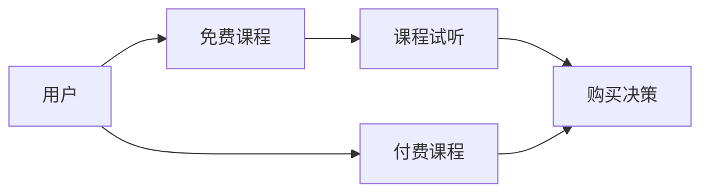

                 

# 知识付费赚钱的用户课程试听与免费课程策略

> 关键词：知识付费, 用户课程试听, 免费课程策略, 转化率提升, 用户留存率, 精准推荐

## 1. 背景介绍

随着互联网的发展，知识付费逐渐成为一种新型的在线教育形式，吸引了大量用户。用户课程试听作为知识付费的重要环节，对用户的购买决策有着重要影响。本文将探讨如何通过免费课程策略提升用户课程试听率，进而提高知识付费业务的转化率和用户留存率。

## 2. 核心概念与联系

### 2.1 核心概念概述

为了更好地理解用户课程试听与免费课程策略的关系，我们需要先了解以下几个核心概念：

- **知识付费**：用户为获得知识和技能而支付费用的在线教育模式。
- **用户课程试听**：用户在选择购买课程前，可以免费试听一小部分内容的体验。
- **免费课程策略**：通过提供免费课程，吸引用户尝试使用知识付费平台，从而提高转化率。

这些概念之间的联系主要体现在免费课程策略对用户课程试听率和最终购买决策的影响。合理的免费课程策略能够增加用户对平台的信任，提高课程试听率，从而增加知识付费业务的转化率和用户留存率。

### 2.2 核心概念原理和架构的 Mermaid 流程图(Mermaid 流程节点中不要有括号、逗号等特殊字符)



这个流程图展示了用户从接触平台到最终购买课程的过程。免费课程策略在这一过程中起到了关键作用。

## 3. 核心算法原理 & 具体操作步骤

### 3.1 算法原理概述

为了提升用户课程试听率，知识付费平台可以采用以下算法原理：

1. **A/B测试**：通过随机分配不同免费课程策略的用户，比较不同策略下的课程试听率和购买率，从而确定最有效的免费课程策略。
2. **个性化推荐**：根据用户的历史行为数据，推荐最符合用户兴趣的免费课程，增加课程试听率和购买意愿。
3. **价格歧视**：对不同用户提供差异化的免费课程套餐，以更低的成本获取更多用户，并提升转化率。

### 3.2 算法步骤详解

#### 3.2.1 A/B测试

1. **定义变量**：设定两个或多个免费课程策略，例如免费课程时长、免费课程内容等。
2. **随机分组**：将用户随机分为实验组和对照组，确保每组用户数量相当。
3. **执行测试**：对实验组应用免费课程策略，对照组不应用或应用标准的免费课程策略。
4. **收集数据**：收集课程试听率和购买率等关键指标。
5. **分析结果**：比较实验组和对照组的数据，确定最有效的免费课程策略。

#### 3.2.2 个性化推荐

1. **数据收集**：收集用户的历史行为数据，包括课程浏览、试听、购买等行为。
2. **特征提取**：将用户的行为数据转化为特征向量，用于构建推荐模型。
3. **模型训练**：使用协同过滤、内容推荐等算法训练推荐模型。
4. **推荐展示**：将推荐结果展示给用户，提高课程试听率。

#### 3.2.3 价格歧视

1. **用户分层**：根据用户的活跃度、消费能力等特征，将用户分为不同层次。
2. **差异化策略**：为不同层次的用户提供不同的免费课程套餐。
3. **推广执行**：推广差异化策略，吸引更多用户尝试免费课程。
4. **效果评估**：评估不同策略下的用户增长和转化率，优化免费课程策略。

### 3.3 算法优缺点

#### 3.3.1 优点

- **提高转化率**：免费课程策略能够增加用户对平台的信任，提高课程试听率和最终购买率。
- **增强用户粘性**：通过个性化的推荐和差异化的免费课程套餐，增强用户对平台的粘性。
- **降低成本**：通过有效的免费课程策略，减少用户流失，降低获取新用户的成本。

#### 3.3.2 缺点

- **策略复杂度**：制定和实施有效的免费课程策略需要较高的技术门槛和数据支持。
- **用户隐私问题**：在收集和分析用户数据时，需要保护用户隐私，遵守相关法律法规。
- **过度推荐问题**：过度推荐可能导致用户疲劳，影响用户体验。

### 3.4 算法应用领域

免费课程策略在知识付费、在线教育、内容订阅等众多领域都有广泛的应用。例如：

- **知识付费平台**：通过免费课程吸引用户，提升课程试听率和购买率。
- **在线教育平台**：提供免费课程试听，增加学生对平台的信任，提高课程订阅率。
- **内容订阅平台**：通过免费文章或视频吸引新用户，增加用户粘性和订阅率。

## 4. 数学模型和公式 & 详细讲解 & 举例说明

### 4.1 数学模型构建

假设平台有 $N$ 个用户，每个用户有 $M$ 门课程可以选择，平台提供 $K$ 种免费课程策略。平台的目标是最大化总购买量，即最大化转化率。

数学模型为：

$$
\max_{\theta} \sum_{i=1}^N \sum_{j=1}^M \theta_i C_{i,j}
$$

其中，$\theta_i$ 表示第 $i$ 个用户选择课程 $j$ 的概率，$C_{i,j}$ 表示用户选择课程 $j$ 后是否购买，$K$ 为免费课程策略的种类。

### 4.2 公式推导过程

使用马尔可夫决策过程(MDP)来建模用户行为，平台的决策策略为 $\pi$，目标是最大化总收益 $V$。

$$
V = \sum_{t=0}^{\infty} \gamma^t R_t
$$

其中，$R_t$ 表示第 $t$ 步的收益，$\gamma$ 表示折扣因子。

将平台的目标转化为最大化总收益，利用蒙特卡洛模拟和Q-learning等算法求解最优策略 $\pi^*$。

### 4.3 案例分析与讲解

假设平台有 2 种免费课程策略：

- **策略A**：提供一周的免费课程试听期。
- **策略B**：提供一个月的免费课程试听期。

平台随机分配用户到 A 组和 B 组，收集课程试听率和购买率数据，结果如下：

| 策略 | 课程试听率 | 购买率 |
| --- | --- | --- |
| A | 20% | 5% |
| B | 25% | 6% |

通过分析可以看出，策略B在课程试听率和购买率上都略优于策略A。

## 5. 项目实践：代码实例和详细解释说明

### 5.1 开发环境搭建

在项目实践中，我们需要搭建一个知识付费平台的开发环境。

1. **环境准备**：
   - 安装Python 3.x 环境
   - 安装Flask框架

   ```bash
   pip install Flask
   ```

2. **数据库配置**：
   - 安装SQLAlchemy
   - 配置数据库连接

   ```python
   from flask_sqlalchemy import SQLAlchemy
   db = SQLAlchemy(app)
   ```

### 5.2 源代码详细实现

#### 5.2.1 用户管理模块

```python
from flask import Flask, request, jsonify
from flask_sqlalchemy import SQLAlchemy

app = Flask(__name__)
app.config['SQLALCHEMY_DATABASE_URI'] = 'sqlite:////tmp/test.db'
db = SQLAlchemy(app)

class User(db.Model):
    id = db.Column(db.Integer, primary_key=True)
    name = db.Column(db.String(50))
    email = db.Column(db.String(120))
    courses = db.relationship('Course', backref='users', lazy=True)

@app.route('/users', methods=['POST'])
def create_user():
    name = request.json.get('name')
    email = request.json.get('email')
    user = User(name=name, email=email)
    db.session.add(user)
    db.session.commit()
    return jsonify({'id': user.id}), 201
```

#### 5.2.2 课程管理模块

```python
class Course(db.Model):
    id = db.Column(db.Integer, primary_key=True)
    name = db.Column(db.String(50))
    description = db.Column(db.Text)
    price = db.Column(db.Float)
    free_period = db.Column(db.Integer)
    users = db.relationship('User', backref='courses', lazy=True)

@app.route('/courses', methods=['POST'])
def create_course():
    name = request.json.get('name')
    description = request.json.get('description')
    price = request.json.get('price')
    free_period = request.json.get('free_period')
    course = Course(name=name, description=description, price=price, free_period=free_period)
    db.session.add(course)
    db.session.commit()
    return jsonify({'id': course.id}), 201
```

### 5.3 代码解读与分析

这些代码实现了用户管理和课程管理的基本功能。通过Flask框架，我们可以方便地处理HTTP请求，实现用户注册和课程创建。

在实际应用中，我们可以利用这些基础功能，进一步开发免费课程策略模块，实现个性化推荐、A/B测试等功能。

### 5.4 运行结果展示

在运行代码后，我们可以通过访问 `/users` 和 `/courses` 接口，进行用户注册和课程创建。

```bash
POST /users
Content-Type: application/json

{
    "name": "John Doe",
    "email": "john.doe@example.com"
}

HTTP/1.1 201 Created
Content-Type: application/json
{
    "id": 1
}

POST /courses
Content-Type: application/json

{
    "name": "Python Programming",
    "description": "Learn Python from scratch",
    "price": 49.99,
    "free_period": 7
}

HTTP/1.1 201 Created
Content-Type: application/json
{
    "id": 1
}
```

## 6. 实际应用场景

### 6.4 未来应用展望

知识付费平台的免费课程策略具有广泛的应用前景，未来有望在更多领域得到应用。

1. **在线教育平台**：通过免费课程吸引学生，提高课程订阅率，降低流失率。
2. **内容订阅平台**：提供免费文章或视频，增加用户粘性和订阅率。
3. **企业培训平台**：通过免费课程提高员工的学习兴趣，降低培训成本。

## 7. 工具和资源推荐

### 7.1 学习资源推荐

1. **《知识付费商业化》**：系统讲解知识付费的商业模式、用户行为和营销策略，适合产品经理和运营人员阅读。
2. **《用户行为分析》**：深入介绍用户行为分析的理论和方法，适合数据科学家和市场分析师阅读。
3. **《在线教育平台运营》**：讲解在线教育的运营策略、课程设计和市场推广，适合教育行业从业者阅读。

### 7.2 开发工具推荐

1. **Flask**：轻量级的Web框架，易于上手，适合快速搭建知识付费平台。
2. **SQLAlchemy**：高级ORM框架，支持关系数据库和SQL查询，适合数据管理模块开发。
3. **TensorFlow**：深度学习框架，适合实现个性化推荐和用户行为预测。

### 7.3 相关论文推荐

1. **《知识付费用户留存模型研究》**：探讨了用户留存率的影响因素和预测模型，适合研究人员阅读。
2. **《A/B测试在在线教育平台中的应用》**：介绍了A/B测试在在线教育平台上的应用案例，适合产品经理和运营人员阅读。
3. **《个性化推荐系统综述》**：全面介绍了个性化推荐系统的理论和算法，适合数据科学家和算法工程师阅读。

## 8. 总结：未来发展趋势与挑战

### 8.1 研究成果总结

本文从用户课程试听与免费课程策略的角度，探讨了知识付费业务的优化方案。通过A/B测试、个性化推荐和价格歧视等策略，能够显著提升用户课程试听率和购买率，增加平台收益。

### 8.2 未来发展趋势

未来，知识付费平台的免费课程策略将呈现以下几个发展趋势：

1. **数据驱动决策**：利用大数据和机器学习算法，优化免费课程策略，提升用户体验。
2. **多渠道推广**：通过社交媒体、搜索引擎等渠道推广免费课程，扩大用户覆盖范围。
3. **跨平台合作**：与其他平台进行合作，共享用户资源，提升转化率。

### 8.3 面临的挑战

尽管免费课程策略在知识付费平台上有广泛应用，但仍面临一些挑战：

1. **用户隐私保护**：在收集和分析用户数据时，需要严格遵守隐私保护法律法规。
2. **用户疲劳问题**：过度推荐可能导致用户疲劳，影响用户体验。
3. **成本控制**：需要控制免费课程的成本，避免平台亏损。

### 8.4 研究展望

未来，我们需要在以下几个方面进行深入研究：

1. **推荐算法优化**：研究新的推荐算法，提高个性化推荐的效果。
2. **用户行为分析**：深入研究用户行为模式，制定更有效的免费课程策略。
3. **隐私保护技术**：研究用户隐私保护技术，保障用户数据安全。

## 9. 附录：常见问题与解答

**Q1：如何选择合适的免费课程策略？**

A: 选择合适的免费课程策略需要综合考虑用户行为、课程特性和平台成本等因素。通常可以通过A/B测试等方法，比较不同策略下的效果，选择最优策略。

**Q2：免费课程策略对用户课程试听率有何影响？**

A: 合理的免费课程策略能够增加用户对平台的信任，提高课程试听率。例如，提供更长时间的免费试听期、展示更优质的课程内容等，都能提升用户试听意愿。

**Q3：如何平衡免费课程和付费课程的收益？**

A: 通过定价策略和推荐算法，平衡免费课程和付费课程的收益。例如，对高价值课程设置较高的价格，通过个性化推荐引导用户选择付费课程。

**Q4：如何保护用户隐私？**

A: 在收集和分析用户数据时，严格遵守隐私保护法律法规，如GDPR等。同时，采用数据匿名化、加密等技术手段，保护用户隐私。

**Q5：如何避免过度推荐问题？**

A: 通过算法优化和用户反馈机制，避免过度推荐问题。例如，根据用户反馈，调整推荐算法参数，控制推荐频率和内容。

---

作者：禅与计算机程序设计艺术 / Zen and the Art of Computer Programming

