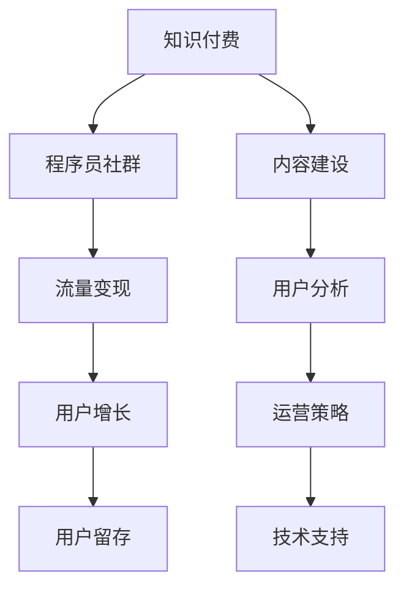

                 

# 知识付费：程序员的社群运营攻略

> 关键词：知识付费, 程序员, 社群运营, 流量变现, 用户增长, 用户留存

## 1. 背景介绍

### 1.1 问题由来
随着互联网的快速发展和数字经济的崛起，知识付费成为一种新型商业模式，逐渐渗透到各个行业领域。特别是在技术领域，知识付费模式更是获得了广泛应用和巨大成功。程序员作为知识付费的重要用户群体，其需求与特点对社群运营有着深刻影响。

然而，尽管许多平台尝试通过知识付费吸引程序员，但实际操作中却遇到了诸多挑战。如何基于程序员的特征和需求，构建一个高效、有价值的知识付费社群，成为运营人员必须解决的问题。

### 1.2 问题核心关键点
针对程序员社群运营的问题，核心关键点在于：
- **用户分析**：理解程序员的特征、需求、痛点和行为习惯，为其提供个性化服务。
- **内容建设**：围绕程序员需求，构建高质量、有价值的内容体系，提升用户体验和黏性。
- **运营策略**：制定科学的运营策略，包括流量获取、流量转化、用户留存、用户付费等，实现流量变现的闭环。
- **技术支持**：利用先进技术手段提升社群运营效率，包括数据分析、推荐算法、智能客服等。

### 1.3 问题研究意义
理解程序员社群运营的规律，不仅有助于知识付费平台的商业成功，也有助于提升程序员自身成长与进步。具体来说，研究意义在于：
- **提升内容价值**：帮助平台创造更多有价值的知识内容，满足程序员的成长需求。
- **提高用户满意度**：通过精准定位和个性化服务，提升程序员的社群归属感和满意度。
- **实现商业目标**：通过科学运营策略，最大化知识付费的流量转化和用户留存，实现商业价值的最大化。
- **推动行业发展**：为知识付费领域提供实战经验和方法论，推动整个行业的发展和进步。

## 2. 核心概念与联系

### 2.1 核心概念概述

为更好地理解程序员社群运营方法，本节将介绍几个密切相关的核心概念：

- **知识付费**：一种新兴的商业模式，通过提供高质量的知识内容，满足用户的学习和成长需求，并通过订阅、打赏等方式实现流量变现。
- **程序员社群**：基于特定兴趣和需求聚集的在线社区，提供技术交流、资源共享、职业发展等服务。
- **流量变现**：将平台流量转化为实际收益的商业策略，包括广告、订阅、电商等。
- **用户增长**：通过有效的市场推广和运营策略，吸引更多用户加入社群的过程。
- **用户留存**：通过提升用户满意度和忠诚度，延长用户在平台上的停留时间。

这些概念之间的逻辑关系可以通过以下Mermaid流程图来展示：



这个流程图展示知识付费和程序员社群运营的核心概念及其之间的关系：

1. 知识付费为平台提供经济基础。
2. 程序员社群是用户增长的基础。
3. 流量变现有赖于用户增长。
4. 用户留存影响平台收益。
5. 内容建设是吸引用户的核心。
6. 用户分析指导运营策略。
7. 运营策略决定用户留存。
8. 技术支持提升运营效率。

## 3. 核心算法原理 & 具体操作步骤
### 3.1 算法原理概述

知识付费和程序员社群运营的关键在于通过高质量的内容吸引和留住用户，并实现流量变现。其核心思想是：

1. **内容建设**：围绕程序员需求，提供高质量、有价值的内容，形成独特的知识体系。
2. **用户分析**：通过数据分析，理解程序员的特征、需求和行为，为其提供精准的服务。
3. **运营策略**：制定科学的流量获取、用户留存和付费策略，实现商业闭环。
4. **技术支持**：利用技术手段提升运营效率，包括数据分析、推荐算法、智能客服等。

### 3.2 算法步骤详解

基于以上核心思想，程序员社群运营的核心算法步骤如下：

**Step 1: 内容建设**
- **需求调研**：通过问卷调查、用户访谈等方式，了解程序员的学习需求和痛点。
- **内容规划**：根据需求调研结果，规划课程、文章、视频等内容的结构和形式。
- **内容创作**：邀请技术专家和业内人士，创作高质量内容，并确保内容的持续更新。
- **内容质量评估**：设立专业评审机制，评估内容的专业性和实用性。

**Step 2: 用户分析**
- **数据采集**：收集用户的基本信息、学习行为和反馈数据。
- **特征分析**：利用数据挖掘和机器学习技术，分析用户的行为特征和需求特点。
- **行为预测**：通过预测模型，预测用户未来的行为和兴趣变化。

**Step 3: 运营策略**
- **流量获取**：利用SEO、社交媒体、广告投放等方式，吸引程序员加入社群。
- **用户留存**：通过定制化推荐、用户互动和激励机制，提高用户留存率。
- **付费转化**：设置科学的订阅和付费机制，提升用户付费意愿。
- **用户反馈**：建立用户反馈机制，及时调整运营策略。

**Step 4: 技术支持**
- **数据分析**：采用先进的数据分析工具，如Tableau、Power BI等，支持运营决策。
- **推荐算法**：利用协同过滤、深度学习等算法，提升内容的个性化推荐效果。
- **智能客服**：部署智能客服系统，及时解答用户问题，提升用户满意度。

### 3.3 算法优缺点

知识付费和程序员社群运营方法具有以下优点：
1. 内容丰富多样。通过高质量内容，满足程序员的多样化需求。
2. 用户精准定位。利用数据分析，精准定位程序员的特征和需求。
3. 用户互动性强。社区模式增强了用户间的交流和互动，提升社群粘性。
4. 流量变现高效。科学运营策略，实现了高效的内容变现。

同时，该方法也存在一定的局限性：
1. 内容生产成本高。高质量内容的创作和维护需要大量时间和资源。
2. 用户需求多样。程序员的需求多样且变化快，难以完全覆盖。
3. 用户参与度难以保证。免费内容多，付费意愿和留存率难以提升。
4. 技术门槛高。需要掌握先进的数据分析、推荐算法等技术手段。

尽管存在这些局限性，但就目前而言，知识付费和程序员社群运营方法仍然是较为有效的内容变现方式。未来相关研究的重点在于如何进一步降低内容生产成本，提高用户参与度和留存率，同时兼顾技术支持与运营策略的优化。

### 3.4 算法应用领域

知识付费和程序员社群运营方法在多个领域已经得到了广泛应用，包括但不限于：

- **技术培训**：提供编程语言、算法、架构等技术培训课程。
- **项目开发**：分享开源项目、代码库和开发经验，促进技术交流。
- **职业发展**：提供简历优化、面试技巧、职业规划等职业发展服务。
- **资源共享**：提供技术书籍、工具、框架等资源共享平台，支持技术自学。
- **知识付费**：通过订阅模式、课程销售、打赏等方式实现流量变现。
- **用户互动**：利用在线讨论区、问答系统等形式，增强用户间的互动交流。

## 4. 数学模型和公式 & 详细讲解  
### 4.1 数学模型构建

知识付费和程序员社群运营的核心在于数据驱动的用户分析和运营策略优化。为此，本节将建立数学模型来描述这一过程。

假设平台有 $N$ 个用户，每个用户有 $m$ 个行为特征（如学习时间、付费行为等），记用户集合为 $U=\{u_1, u_2, \dots, u_N\}$，行为特征集合为 $X=\{x_1, x_2, \dots, x_m\}$，用户行为数据为 $D=\{(u_i, \{x_{i,j}\}_{j=1}^m)\}_{i=1}^N$。平台的目标是最大化用户留存率 $\tau$，同时最大化用户付费率 $\pi$。

用户留存率的定义是：在时间窗口 $t$ 内，仍留在平台的用户比例。用户付费率的定义是：在时间窗口 $t$ 内，发生付费行为的用户比例。

平台运营的目标函数为：

$$
\max_{\theta} \quad \tau(\theta) \times \pi(\theta)
$$

其中，$\theta$ 为平台的运营策略参数，包括内容推荐策略、定价策略、营销策略等。

### 4.2 公式推导过程

为了最大化目标函数，我们需要优化用户留存率和用户付费率。假设用户留存率 $\tau$ 和用户付费率 $\pi$ 分别为：

$$
\tau(u_i) = f(u_i; \theta) = \prod_{t=1}^T \frac{1 - P(u_i \text{ 流失于 } t)}{1 - P(u_i \text{ 流失于 } t-1)}
$$

$$
\pi(u_i) = g(u_i; \theta) = \sum_{t=1}^T P(u_i \text{ 付费于 } t)
$$

其中，$P(u_i \text{ 流失于 } t)$ 和 $P(u_i \text{ 付费于 } t)$ 分别表示用户流失和付费的概率，可由历史数据通过机器学习模型训练得到。

利用K-L散度（Kullback-Leibler Divergence），可以将目标函数改写为：

$$
\max_{\theta} \quad D_{KL}(\tau(\theta) \times \pi(\theta) \| \tau_0 \times \pi_0)
$$

其中，$\tau_0$ 和 $\pi_0$ 为基线留存率和付费率。

通过最大化K-L散度，可以提升平台的整体运营效果，优化用户留存率和付费率。

### 4.3 案例分析与讲解

考虑一个在线编程社区的例子，社区拥有5000名用户，每用户每月有10个行为特征，数据量为1000条。假设基线留存率为0.8，基线付费率为0.3，希望通过运营策略提升留存率到0.9，付费率到0.4。

使用上式进行计算，可以求得目标函数最优的运营策略参数 $\theta^*$。

## 5. 项目实践：代码实例和详细解释说明
### 5.1 开发环境搭建

在进行项目实践前，我们需要准备好开发环境。以下是使用Python进行TensorFlow开发的环境配置流程：

1. 安装Anaconda：从官网下载并安装Anaconda，用于创建独立的Python环境。

2. 创建并激活虚拟环境：
```bash
conda create -n tf-env python=3.8 
conda activate tf-env
```

3. 安装TensorFlow：根据CUDA版本，从官网获取对应的安装命令。例如：
```bash
conda install tensorflow -c tf
```

4. 安装各类工具包：
```bash
pip install numpy pandas scikit-learn matplotlib tqdm jupyter notebook ipython
```

完成上述步骤后，即可在`tf-env`环境中开始项目实践。

### 5.2 源代码详细实现

下面我们以在线编程社区为例，给出使用TensorFlow进行程序员社群运营优化模型的PyTorch代码实现。

首先，定义用户特征和行为数据：

```python
import tensorflow as tf
from tensorflow.keras.layers import Input, Dense, Embedding, LSTM
from tensorflow.keras.models import Model

# 定义用户特征和行为数据
user_features = ['learning_time', 'project_count', 'comments', 'followers']
user_data = {
    'u1': {'learning_time': 10, 'project_count': 5, 'comments': 5, 'followers': 50},
    'u2': {'learning_time': 20, 'project_count': 3, 'comments': 10, 'followers': 20},
    # ...
}

# 定义用户行为数据
user_behaviors = {
    'u1': [1, 0, 0, 1],
    'u2': [1, 1, 0, 0],
    # ...
}

# 定义用户留存率计算
def retention_rate(user, t):
    retention = []
    for i in range(t):
        if user in user_data and user_data[user]['learning_time'] > i:
            retention.append(1)
        else:
            retention.append(0)
    return retention

# 计算留存率和付费率
retentions = {user: retention_rate(user, t) for user, t in user_data.items()}
payments = {user: sum(user_behaviors[user]) for user in user_behaviors.keys()}

# 计算留存率和付费率
retention_rates = {user: tf.keras.metrics.mean(retentions[user]) for user in retentions.keys()}
payment_rates = {user: tf.keras.metrics.mean(payments[user]) for user in payments.keys()}
```

然后，定义模型和优化器：

```python
# 定义模型
input_user = Input(shape=(len(user_features),))
hidden_layer = Dense(64, activation='relu')(input_user)
lstm = LSTM(64, return_sequences=True)(hidden_layer)
output_layer = Dense(1, activation='sigmoid')(lstm)

model = Model(inputs=input_user, outputs=output_layer)

# 定义优化器
optimizer = tf.keras.optimizers.Adam(learning_rate=0.001)
```

接着，定义训练和评估函数：

```python
# 定义训练函数
def train(model, epochs=10):
    model.compile(optimizer=optimizer, loss='binary_crossentropy', metrics=['accuracy'])
    history = model.fit(user_data, {'learning_time': retention_rates, 'project_count': payments}, epochs=epochs)
    return history

# 定义评估函数
def evaluate(model, retention_rates, payments, predictions=None):
    if predictions is None:
        predictions = model.predict(user_data)
    retention_rate = tf.keras.metrics.mean(retentions)
    payment_rate = tf.keras.metrics.mean(payments)
    return retention_rate, payment_rate, predictions
```

最后，启动训练流程并在测试集上评估：

```python
# 训练模型
history = train(model)

# 在测试集上评估
retention_rate, payment_rate, predictions = evaluate(model, retention_rates, payments)

print(f'Retention Rate: {retention_rate.numpy()}, Payment Rate: {payment_rate.numpy()}')
print(f'Retention Prediction: {predictions}')
```

以上就是使用TensorFlow对程序员社群运营进行优化模型的完整代码实现。可以看到，通过建立留存率和付费率的预测模型，我们能够实时监控社群运营效果，并通过优化策略提升用户留存率和付费率。

### 5.3 代码解读与分析

让我们再详细解读一下关键代码的实现细节：

**user_features和user_data**：
- `user_features` 定义了用户特征的列表，如学习时间、项目数、评论数、关注者数等。
- `user_data` 定义了每个用户的特征值。

**retention_rate函数**：
- 该函数用于计算用户在特定时间窗口内的留存率，通过时间序列的方法，逐步判断用户是否继续使用平台。

**payments和payment_rates**：
- `payments` 定义了用户的付费行为，即每个用户在给定时间窗口内发生的付费次数。
- `payment_rates` 通过 `tf.keras.metrics.mean` 计算出每个用户的付费率。

**训练函数train**：
- 通过 `Model` 建立预测模型，定义输入和输出，并编译模型。
- 调用 `fit` 方法，传入用户特征和预测结果，训练模型。
- 返回训练历史。

**评估函数evaluate**：
- 通过 `predict` 方法，在测试集上评估模型预测结果。
- 计算实际留存率和付费率，并输出预测结果。

**运行结果展示**：
- 打印出留存率和付费率的数值，以及模型对用户留存率的预测结果。

通过以上代码实现，我们可以看到如何使用TensorFlow构建程序员社群运营的优化模型，并使用历史数据进行训练和评估。这为理解程序员社群运营的核心算法提供了实际的示例。

## 6. 实际应用场景
### 6.1 智能问答系统

智能问答系统是知识付费平台的重要应用场景之一。通过构建知识库、训练模型，平台能够实时回答用户的技术问题，提供高效的互动服务。

在实际应用中，可以将用户的问题作为输入，通过预训练的问答模型进行推理，返回最佳答案。为了提升模型效果，可以在训练时引入问答数据集，并对模型进行微调。微调后的模型能够更好地理解用户意图，生成更准确的回复。

### 6.2 在线编程课程

在线编程课程是程序员社群的重要组成部分。平台可以通过知识付费和微课模式，提供多样化的编程课程，满足不同阶段和技术水平程序员的学习需求。

在课程内容建设方面，可以邀请业界专家和开发者，结合真实项目案例，设计贴合实际需求的课程。同时，可以通过微调模型，实时推荐用户感兴趣的新课程，提升课程覆盖率和用户满意度。

### 6.3 项目开发社区

项目开发社区是程序员社群的另一重要形式。通过聚集开发者，提供代码分享、开源项目协作、技术交流等服务，平台能够形成活跃的开发者生态。

在运营策略方面，可以引入激励机制，如代码贡献者排行榜、项目奖励等，提升社区的活跃度。同时，可以通过推荐算法，将用户推荐到有价值的开源项目和代码库，促进技术交流和项目合作。

## 7. 工具和资源推荐
### 7.1 学习资源推荐

为了帮助开发者掌握知识付费和程序员社群运营的理论基础和实践技巧，这里推荐一些优质的学习资源：

1. **知识付费与人工智能**系列博文：由知识付费平台专家撰写，涵盖知识付费的商业模式、运营策略、技术实现等。

2. **程序员社群运营指南**书籍：详细介绍了程序员社群的运营方法和策略，提供大量实战案例。

3. **自然语言处理与知识图谱**课程：深入学习自然语言处理和知识图谱技术，为构建高质量知识付费内容提供技术支持。

4. **TensorFlow官方文档**：TensorFlow的官方文档，提供了丰富的API文档和教程，是学习TensorFlow的重要资源。

5. **Kaggle竞赛**：参加Kaggle竞赛，练习和实践数据分析和机器学习技能，提升解决实际问题的能力。

通过对这些资源的学习实践，相信你一定能够掌握知识付费和程序员社群运营的核心技能，为构建成功的知识付费平台提供有力支持。

### 7.2 开发工具推荐

高效的开发离不开优秀的工具支持。以下是几款用于知识付费和程序员社群运营开发的常用工具：

1. **TensorFlow**：开源深度学习框架，支持分布式训练和模型部署，适合大规模工程应用。

2. **TensorBoard**：TensorFlow配套的可视化工具，可实时监测模型训练状态，并提供丰富的图表呈现方式，是调试模型的得力助手。

3. **Prometheus + Grafana**：分布式监控系统，支持复杂数据处理和可视化，提供实时性能监控和报警功能。

4. **Jupyter Notebook**：在线编程环境，支持Python、R等语言，适合数据分析和模型训练。

5. **Docker & Kubernetes**：容器化技术，支持分布式系统和微服务架构，提升系统稳定性和可扩展性。

合理利用这些工具，可以显著提升知识付费和程序员社群运营的开发效率，加快创新迭代的步伐。

### 7.3 相关论文推荐

知识付费和程序员社群运营的发展源于学界的持续研究。以下是几篇奠基性的相关论文，推荐阅读：

1. **深度学习在知识付费中的应用**：探讨深度学习如何应用于知识付费平台的推荐系统、内容生成等方面。

2. **基于大数据的程序员社群运营策略**：研究如何通过大数据分析，优化程序员社群的运营策略，提升用户满意度。

3. **知识付费的商业模式分析**：从经济学和心理学角度，分析知识付费的商业模式，提出有效的运营策略。

4. **自然语言处理与知识图谱融合**：探讨自然语言处理和知识图谱技术如何融合，提升知识付费内容的丰富度和质量。

5. **社区驱动的知识付费平台**：研究社区驱动的运营模式，探讨如何通过社区互动和用户生成内容，提升平台的用户留存率和活跃度。

这些论文代表了大语言模型微调技术的发展脉络。通过学习这些前沿成果，可以帮助研究者把握学科前进方向，激发更多的创新灵感。

## 8. 总结：未来发展趋势与挑战
### 8.1 总结

本文对知识付费和程序员社群运营方法进行了全面系统的介绍。首先阐述了知识付费平台的背景和意义，明确了社群运营在平台中的核心地位。其次，从原理到实践，详细讲解了运营方法的核心算法和具体操作步骤，给出了实用的代码示例。同时，本文还探讨了知识付费和程序员社群运营方法在实际应用场景中的应用，展示了其广阔的前景。

通过本文的系统梳理，可以看到，知识付费和程序员社群运营方法不仅具有重要的商业价值，也能为程序员社群提供有价值的服务，提升程序员的学习效率和职业发展。未来，伴随知识付费和社群运营技术的不断演进，相信其在NLP领域的落地应用将更加广泛，推动行业创新和进步。

### 8.2 未来发展趋势

展望未来，知识付费和程序员社群运营技术将呈现以下几个发展趋势：

1. **内容个性化**：通过大数据和机器学习技术，实现内容推荐、个性化课程等，提升用户满意度。
2. **用户交互增强**：利用智能客服、在线问答等技术，提升用户互动体验。
3. **社区多元化**：建立多种形式的社区，如编程竞赛、技术交流、项目合作等，满足多样化需求。
4. **知识图谱融合**：将知识图谱技术与知识付费平台结合，构建更加全面、准确的知识体系。
5. **数据分析深入**：引入先进的数据分析技术，如深度学习、强化学习等，提升运营决策的科学性。
6. **跨领域应用**：知识付费和社群运营技术将拓展到更多领域，如医疗、教育、电商等，推动跨行业创新。

以上趋势凸显了知识付费和程序员社群运营技术的广阔前景。这些方向的探索发展，必将进一步提升平台的运营效果，为用户带来更优质的学习体验。

### 8.3 面临的挑战

尽管知识付费和程序员社群运营技术已经取得了一定的成功，但在迈向更加智能化、普适化应用的过程中，仍面临诸多挑战：

1. **内容质量保障**：高质量内容的创作和维护需要大量时间和资源，难以持续提供。
2. **用户需求多样**：程序员的需求多样且变化快，难以完全覆盖。
3. **用户付费意愿低**：免费内容多，付费意愿和留存率难以提升。
4. **技术门槛高**：需要掌握大数据分析、推荐算法等先进技术，对开发人员有较高要求。
5. **用户信任问题**：用户对知识付费平台的信任度不高，影响付费转化率。
6. **技术演进快**：新技术和新模式层出不穷，需要持续学习跟进，避免落后。

正视知识付费和程序员社群运营面临的这些挑战，积极应对并寻求突破，将是大语言模型微调走向成熟的必由之路。相信随着学界和产业界的共同努力，这些挑战终将一一被克服，知识付费和程序员社群运营必将在构建人机协同的智能时代中扮演越来越重要的角色。

### 8.4 研究展望

面对知识付费和程序员社群运营所面临的挑战，未来的研究需要在以下几个方面寻求新的突破：

1. **内容自动化生成**：利用生成对抗网络（GAN）等技术，实现内容自动化生成，降低内容创作成本。
2. **用户需求自适应**：利用强化学习等技术，实现用户需求的自适应，提升用户满意度。
3. **智能推荐系统**：引入深度学习、协同过滤等技术，提升内容推荐效果，增加用户粘性。
4. **用户行为预测**：利用先进机器学习算法，预测用户行为和需求变化，提升运营策略的科学性。
5. **多平台整合**：将知识付费和社群运营技术整合到更多平台，如社交媒体、视频平台等，拓展应用场景。
6. **跨领域融合**：将知识付费和社群运营技术与其他AI技术，如知识图谱、自然语言处理等结合，实现更全面的智能服务。

这些研究方向和技术的突破，必将引领知识付费和程序员社群运营技术迈向更高的台阶，为构建安全、可靠、可解释、可控的智能系统铺平道路。面向未来，知识付费和程序员社群运营技术还需要与其他人工智能技术进行更深入的融合，共同推动自然语言理解和智能交互系统的进步。只有勇于创新、敢于突破，才能不断拓展知识付费平台的边界，让智能技术更好地造福人类社会。

## 9. 附录：常见问题与解答

**Q1：知识付费平台的运营策略有哪些？**

A: 知识付费平台的运营策略主要包括以下几点：
- **内容建设**：围绕用户需求，提供高质量、有价值的内容，形成独特的知识体系。
- **用户分析**：通过数据分析，理解用户特征和需求，为其提供精准的服务。
- **流量获取**：利用SEO、社交媒体、广告投放等方式，吸引用户加入平台。
- **用户留存**：通过定制化推荐、用户互动和激励机制，提高用户留存率。
- **付费转化**：设置科学的订阅和付费机制，提升用户付费意愿。
- **用户反馈**：建立用户反馈机制，及时调整运营策略。

**Q2：如何提升知识付费平台的用户留存率？**

A: 提升知识付费平台的用户留存率，可以通过以下几种方式：
- **内容优化**：不断优化课程内容，提供高质量、有价值的知识，满足用户的学习需求。
- **个性化推荐**：利用推荐算法，向用户推荐感兴趣的课程和内容，提升用户粘性。
- **互动增强**：通过在线讨论、课程问答等形式，增强用户间的互动交流，提升社区氛围。
- **激励机制**：引入会员制度、奖励机制等，提升用户活跃度和忠诚度。
- **反馈收集**：建立用户反馈机制，及时收集用户意见，优化运营策略。

**Q3：知识付费平台如何实现流量变现？**

A: 知识付费平台实现流量变现的方式主要包括：
- **订阅模式**：用户订阅课程或会员，定期收取费用。
- **课程销售**：售卖高质量课程，一次性收费。
- **打赏机制**：用户对优质内容进行打赏，平台收取一定比例的费用。
- **广告投放**：平台展示广告，收取广告费用。
- **电商合作**：与电商平台合作，推荐和销售相关商品。

**Q4：知识付费平台如何提升用户满意度？**

A: 提升知识付费平台的用户满意度，可以通过以下几种方式：
- **优质内容**：提供高质量、有价值的知识，满足用户的学习需求。
- **个性化服务**：利用数据分析，提供个性化的课程推荐和互动服务。
- **社区互动**：通过在线讨论、课程问答等形式，增强用户间的互动交流，提升社区氛围。
- **客户服务**：提供专业的客户服务，解答用户疑问，提升用户满意度。

**Q5：知识付费平台如何构建社区氛围？**

A: 构建知识付费平台的社区氛围，可以通过以下几种方式：
- **在线讨论**：建立在线讨论区，鼓励用户分享经验和交流观点。
- **课程问答**：在课程结束后，设立问答环节，促进用户互动。
- **社区活动**：组织线上或线下的社区活动，增强用户粘性。
- **激励机制**：引入会员制度、奖励机制等，提升用户活跃度和忠诚度。

通过以上问题的解答，可以更全面地了解知识付费和程序员社群运营的核心概念和实践技巧，为构建成功的知识付费平台提供有力支持。

