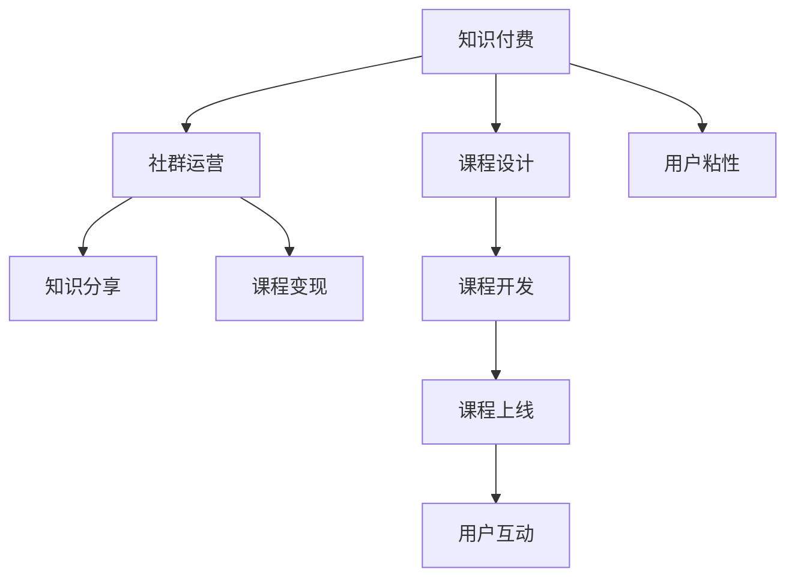

                 

# 知识付费：程序员的社群运营攻略

## 1. 背景介绍

### 1.1 问题由来
随着互联网和移动互联网的快速发展，知识的传播方式也在发生根本性的变化。传统的线下教育、书籍出版等形式正在逐渐被在线教育、网络课程所取代。知识付费作为新兴的教育模式，凭借其便捷性、互动性和专业性，迅速崛起。尤其在程序员社区，知识付费市场更是异常火爆，成为了程序员学习技术、提升技能的重要渠道。然而，程序员社群中的知识付费模式仍存在诸多问题和挑战，需要进一步探索和优化。

### 1.2 问题核心关键点
本文聚焦于程序员社群中的知识付费模式，从社群运营的角度，探讨如何通过有效的运营策略，提升知识付费平台的吸引力和影响力。我们认为，优秀的运营策略不仅能带来更多的用户和收益，还能营造良好的学习氛围，促进程序员之间的交流与合作，从而更好地实现知识传递和创新。

### 1.3 问题研究意义
研究程序员社群中的知识付费模式，对于拓展知识付费市场的应用范围，提升程序员社区的学习效率，加速技术知识在社群中的传播，具有重要意义：

1. 降低知识获取成本。知识付费模式通过专业化、系统化的课程和培训，降低了程序员学习新技术的门槛，节省了时间成本。
2. 提升学习质量。在线课程和课程内容由专业教师设计，具有更高的质量和系统性，有助于程序员更高效地掌握新技能。
3. 促进社群互动。知识付费平台集学习、讨论、交流于一体，程序员可以通过学习课程、参与讨论、共享资源等方式，加深彼此间的了解和合作。
4. 实现知识变现。通过付费课程和培训，知识付费平台不仅能实现知识变现，还能提升教师和内容创作者的收入，激发更多的优质内容产出。
5. 推动技术进步。知识付费平台聚集了大量的技术爱好者和专家，他们通过分享知识和经验，推动技术创新和应用，加速行业发展。

## 2. 核心概念与联系

### 2.1 核心概念概述

为更好地理解程序员社群中的知识付费模式，本节将介绍几个密切相关的核心概念：

- 知识付费(Knowledge Paywall)：通过在线课程、培训、咨询等形式，为用户提供有价值的学习内容，用户需要支付一定费用获取知识。
- 社群运营(Social Media Management)：利用网络平台，组织和运营社群，提升社群的用户粘性、活跃度和满意度。
- 课程设计(Course Design)：通过精心设计课程内容和结构，满足用户的学习需求，提升课程的吸引力和效果。
- 知识分享(Knowledge Sharing)：鼓励用户将自身掌握的知识、经验和见解分享到社群中，促进知识的传播和共享。
- 用户粘性(User Engagement)：通过提供优质的内容和互动机会，增加用户对社群的依赖性和忠诚度。
- 课程变现(Course Monetization)：通过课程订阅、付费访问、广告等形式，实现课程的商业变现。

这些核心概念之间的逻辑关系可以通过以下Mermaid流程图来展示：



这个流程图展示的知识付费和社群运营的核心概念及其之间的关系：

1. 知识付费作为起点，通过课程设计提供有价值的学习内容。
2. 课程上线后，社群运营策略提升用户互动，增加用户粘性。
3. 课程变现策略，实现商业价值。
4. 知识分享环节，激发用户参与和贡献，提升社群质量。
5. 用户粘性通过多种运营手段保持，形成良性循环。

这些概念共同构成了程序员社群中知识付费的完整生态系统，帮助社群实现知识的有效传播和变现。

## 3. 核心算法原理 & 具体操作步骤
### 3.1 算法原理概述

程序员社群中的知识付费模式，本质上是一种需求匹配和资源分配的算法。其核心思想是通过优化课程内容和运营策略，提升用户的学习体验和满意度，从而实现用户粘性和商业变现。

形式化地，假设课程内容为 $C$，用户需求为 $U$，课程价格为 $P$。课程推荐的算法目标是最小化用户需求与课程内容之间的匹配误差，同时最大化课程价格与用户支付意愿之间的差异，即：

$$
\mathop{\arg\min}_{C,U} \mathcal{L}(C,U)
$$

其中 $\mathcal{L}$ 为匹配误差函数，衡量课程内容和用户需求之间的差异。匹配误差越小，说明课程越符合用户需求；用户支付意愿越大，说明课程越具有吸引力。

### 3.2 算法步骤详解

程序员社群中的知识付费模式，一般包括以下几个关键步骤：

**Step 1: 数据收集与分析**
- 收集程序员社群中的课程数据，包括课程内容、教师资质、用户评价等。
- 分析用户行为数据，如课程浏览量、访问时长、购买记录等，了解用户的学习偏好和需求。

**Step 2: 课程推荐算法设计**
- 根据用户行为数据和课程特征，设计课程推荐算法。常用的算法包括协同过滤、基于内容的推荐、深度学习推荐等。
- 通过A/B测试等手段，评估不同推荐策略的效果，选择最优算法。

**Step 3: 课程内容优化**
- 根据课程推荐算法的结果，对课程内容进行优化，提高课程的吸引力。
- 引入学员反馈机制，定期更新课程内容，确保课程始终保持高质量。

**Step 4: 社群运营策略实施**
- 设计并实施社群运营策略，如新用户注册奖励、课程推荐折扣、知识分享奖励等，提升用户粘性。
- 组织线上线下活动，促进用户互动和交流，增强社群凝聚力。

**Step 5: 课程变现策略**
- 设计合理的课程价格策略，根据课程难度、教师资质等因素进行定价。
- 提供多样化的付费方式，如月卡、季卡、年卡等，满足不同用户的需求。
- 利用数据分析，精准定位潜在用户，提高课程销售率。

### 3.3 算法优缺点

知识付费平台通过优化课程内容和运营策略，显著提升了用户的学习体验和满意度，但也存在以下缺点：

**优点：**
1. 精准匹配需求：课程推荐算法能够根据用户行为数据，精准推荐符合用户需求的课程，提升学习效果。
2. 资源高效利用：课程内容优化和社群运营策略，使得课程资源得到最大化利用，提升社群的整体价值。
3. 用户粘性提升：通过多样化的运营手段，增加用户对社群的依赖性和忠诚度，实现良性循环。
4. 变现能力强：课程变现策略能够实现课程的商业化运营，带动社群整体收益增长。

**缺点：**
1. 数据隐私问题：课程推荐和用户分析需要大量用户数据，可能存在数据隐私泄露的风险。
2. 运营成本高：社群运营和课程开发需要投入大量人力、物力和财力，运营成本较高。
3. 课程同质化：过多的同质化课程可能导致用户疲劳，降低用户粘性。
4. 用户付费意愿低：部分用户对课程价格敏感，可能影响课程销售。
5. 市场竞争激烈：知识付费市场竞争激烈，需要不断创新，才能保持市场竞争力。

尽管存在这些缺点，但知识付费模式在提升程序员社群的学习效率、促进技术知识传播方面具有重要价值。未来相关研究的方向在于如何进一步降低运营成本、提升用户粘性、保障数据隐私等方面进行优化和改进。

### 3.4 算法应用领域

知识付费模式在程序员社群中，已经被广泛应用于课程开发、用户运营、内容变现等多个领域，具体应用如下：

- 课程开发：通过知识付费平台，程序员可以学习最新的编程语言、框架、工具等技术，提升自身技能。
- 用户运营：知识付费平台通过提供优质的课程内容、互动机会，增加用户粘性，提升用户满意度。
- 内容变现：知识付费平台通过课程销售、广告投放、知识付费等方式，实现商业变现，支持平台的可持续发展。

此外，知识付费模式还广泛应用于线上教育、技术社区、技术咨询等多个领域，为知识传播和技术交流提供了新的途径。

## 4. 数学模型和公式 & 详细讲解 & 举例说明（备注：数学公式请使用latex格式，latex嵌入文中独立段落使用 $$，段落内使用 $)
### 4.1 数学模型构建

在程序员社群中，知识付费模式可以视为一个多目标优化问题，目标函数为最大化课程销售收入和用户满意度，约束条件为用户的学习需求和课程内容。我们可以将其形式化表示为以下数学模型：

$$
\max \begin{cases} 
P \times S \\
\sum_{i=1}^{N} U_i \\
\end{cases}
$$

其中，$P$ 为课程价格，$S$ 为课程销售数量，$U_i$ 为第 $i$ 个用户的学习满意度。约束条件包括课程内容和用户需求的匹配，课程内容的优化和用户行为数据的限制。

### 4.2 公式推导过程

以下我们以协同过滤推荐算法为例，推导推荐结果的计算公式。

协同过滤推荐算法基于用户行为数据，推荐符合用户兴趣的课程。设 $U$ 为用户集合，$I$ 为课程集合，$R_{ui}$ 表示用户 $u$ 对课程 $i$ 的评分，$X_{ui}$ 表示用户 $u$ 对课程 $i$ 的评分向量，$Y_{ui}$ 表示课程 $i$ 的评分向量，$X_{ui}$ 和 $Y_{ui}$ 可以通过下式计算：

$$
X_{ui} = \frac{R_{ui} - \bar{R}_u}{\sigma_u}
$$

$$
Y_{ui} = \frac{R_{ui} - \bar{R}_i}{\sigma_i}
$$

其中 $\bar{R}_u$ 和 $\sigma_u$ 为用户 $u$ 的评分均值和标准差，$\bar{R}_i$ 和 $\sigma_i$ 为课程 $i$ 的评分均值和标准差。

基于上述向量，协同过滤算法通过计算用户向量与课程向量的余弦相似度，得到推荐结果：

$$
\text{similarity}_{iu} = \frac{\vec{X}_u \cdot \vec{Y}_i}{||\vec{X}_u|| ||\vec{Y}_i||}
$$

$$
\text{prediction}_{iu} = \vec{X}_u \cdot \vec{Y}_i / (\vec{X}_u \cdot \vec{X}_u)
$$

$$
\text{rank}_{iu} = \frac{\text{prediction}_{iu}}{\sigma_u}
$$

根据排名结果，推荐用户 $u$ 对课程 $i$ 的评分，即可得到推荐结果。

### 4.3 案例分析与讲解

假设程序员社群中有10个课程 $I = \{i_1, i_2, ..., i_{10}\}$，每个课程的评分向量 $Y_{ui}$ 如表所示：

| 课程编号 | 课程评分向量 |
|---|---|
| $i_1$ | [0.5, 0.8, 0.3, 0.4, 0.6] |
| $i_2$ | [0.7, 0.2, 0.4, 0.9, 0.5] |
| ... | ... |
| $i_{10}$ | [0.4, 0.1, 0.2, 0.7, 0.5] |

设用户 $u$ 的评分向量为 $X_{ui} = [0.4, 0.5, 0.3, 0.7, 0.6]$。

根据协同过滤算法，计算用户 $u$ 对每个课程的评分，得到排名结果：

| 课程编号 | 排名 |
|---|---|
| $i_1$ | 1 |
| $i_2$ | 2 |
| ... | ... |
| $i_{10}$ | 10 |

最终，推荐排名靠前的课程给用户 $u$。

## 5. 项目实践：代码实例和详细解释说明
### 5.1 开发环境搭建

在进行知识付费平台开发前，我们需要准备好开发环境。以下是使用Python进行Flask开发的环境配置流程：

1. 安装Python：从官网下载并安装Python 3.8。
2. 安装Flask：通过pip安装Flask框架。
```bash
pip install Flask
```

3. 安装Flask-SQLAlchemy：Flask与SQLAlchemy结合使用的扩展库，用于数据库操作。
```bash
pip install Flask-SQLAlchemy
```

4. 安装Flask-WTF：Flask与WTForms结合使用的扩展库，用于表单验证。
```bash
pip install Flask-WTF
```

5. 安装Flask-Admin：Flask与Admin Interfaces结合使用的扩展库，用于后台管理。
```bash
pip install Flask-Admin
```

完成上述步骤后，即可在开发环境上进行知识付费平台的开发。

### 5.2 源代码详细实现

下面以知识付费平台的用户注册和课程推荐为例，给出使用Flask框架开发的代码实现。

**用户注册**

首先，定义用户模型和注册表单类：

```python
from flask_sqlalchemy import SQLAlchemy
from flask_wtf import FlaskForm
from wtforms import StringField, PasswordField, SubmitField

db = SQLAlchemy()
class User(db.Model):
    id = db.Column(db.Integer, primary_key=True)
    username = db.Column(db.String(20), unique=True, nullable=False)
    password = db.Column(db.String(100), nullable=False)
class UserForm(FlaskForm):
    username = StringField('Username', render_kw={'placeholder': 'Username'})
    password = PasswordField('Password', render_kw={'placeholder': 'Password'})
    submit = SubmitField('Register')
```

然后，定义注册路由和视图：

```python
from flask import render_template, redirect, url_for
@app.route('/register', methods=['GET', 'POST'])
def register():
    form = UserForm()
    if form.validate_on_submit():
        user = User(username=form.username.data, password=form.password.data)
        db.session.add(user)
        db.session.commit()
        return redirect(url_for('login'))
    return render_template('register.html', form=form)
```

最后，定义模板和样式：

```html
<!--register.html-->
<form method="POST">
    {{ form.username.label }}
    {{ form.username() }}
    {{ form.password.label }}
    {{ form.password() }}
    {{ form.submit() }}
</form>
```

**课程推荐**

首先，定义课程模型和推荐算法：

```python
class Course(db.Model):
    id = db.Column(db.Integer, primary_key=True)
    title = db.Column(db.String(100), nullable=False)
    description = db.Column(db.String(255), nullable=False)
    price = db.Column(db.Float, nullable=False)
class RecommendationEngine:
    def __init__(self, courses):
        self.courses = courses
        
    def similar_user(self, user, courses):
        # 计算用户与课程的相似度
        pass
    
    def recommend(self, user):
        # 根据用户和课程的相似度，推荐课程
        pass
```

然后，定义推荐路由和视图：

```python
@app.route('/recommend', methods=['GET'])
def recommend():
    user = User.query.get_or_404(current_user.id)
    recommender = RecommendationEngine(courses)
    recommendations = recommender.recommend(user)
    return render_template('recommend.html', recommendations=recommendations)
```

最后，定义模板和样式：

```html
<!--recommend.html-->

    <h2>{{ course.title }}</h2>
    <p>{{ course.description }}</p>
    <p>Price: {{ course.price }}</p>

```

以上代码实现了用户注册和课程推荐的基本功能。通过Flask框架，我们可以方便地管理和操作用户和课程数据，为用户提供高质量的课程推荐服务。

### 5.3 代码解读与分析

**用户注册**

- 定义了`User`模型，用于存储用户信息。
- 定义了`UserForm`表单，用于收集用户输入的信息。
- 定义了注册表单路由和视图，用于处理用户提交的注册请求。

**课程推荐**

- 定义了`Course`模型，用于存储课程信息。
- 定义了`RecommendationEngine`类，用于实现课程推荐算法。
- 定义了推荐路由和视图，用于根据用户信息推荐课程。

## 6. 实际应用场景

### 6.1 智能学习平台

知识付费平台在智能学习平台中，可以与智能推荐引擎、智能教学系统等技术结合，提供个性化的学习路径和课程推荐，提升学习效率和效果。例如，在线教育平台可以根据用户的知识背景、学习偏好和历史行为数据，动态调整课程内容和难度，实现自适应学习。

### 6.2 技术交流社区

在技术交流社区中，知识付费平台可以提供高质量的课程和培训，促进程序员之间的交流与合作。例如，开源社区可以提供开源项目的学习路径、代码实践和团队合作，提升开发者的技术水平和经验积累。

### 6.3 企业培训

知识付费平台在企业培训中，可以提供针对岗位技能、业务流程、管理知识等课程，帮助企业员工快速掌握新技能，提升工作效率。例如，企业可以通过知识付费平台组织内部培训，制定学习计划和评估机制，实现员工技能的系统化提升。

### 6.4 未来应用展望

随着知识付费平台的发展，未来将会有更多的应用场景涌现。例如，未来可能会出现针对特定技术领域的知识付费平台，如大数据、人工智能、区块链等，提供更为专业化的课程和培训。

## 7. 工具和资源推荐

### 7.1 学习资源推荐

为了帮助开发者系统掌握知识付费平台的技术和实践，这里推荐一些优质的学习资源：

1. Flask官方文档：提供详细的Flask框架教程和API文档，帮助开发者快速上手Flask开发。
2. SQLAlchemy官方文档：提供SQLAlchemy数据库操作教程和API文档，帮助开发者高效管理数据库。
3. Flask-SQLAlchemy官方文档：提供Flask-SQLAlchemy扩展的教程和API文档，帮助开发者实现Flask和SQLAlchemy的结合使用。
4. Flask-WTF官方文档：提供Flask-WTF扩展的教程和API文档，帮助开发者实现表单验证。
5. Flask-Admin官方文档：提供Flask-Admin扩展的教程和API文档，帮助开发者实现后台管理。
6. 《Flask Web Development》书籍：深入浅出地介绍了Flask框架的开发实践，是Flask开发的必备参考资料。

通过对这些资源的学习实践，相信你一定能够快速掌握知识付费平台的开发技术和实践方法，并将其应用到实际项目中。

### 7.2 开发工具推荐

高效的开发离不开优秀的工具支持。以下是几款用于知识付费平台开发的常用工具：

1. PyCharm：一款功能强大的Python开发环境，提供代码高亮、调试、测试、版本控制等功能，是Flask开发的得力助手。
2. VSCode：一款轻量级的代码编辑器，支持多种语言和扩展，适合快速迭代开发。
3. Docker：提供容器化的开发环境，方便开发者在不同平台上进行代码部署和测试。
4. Git：提供分布式版本控制系统，方便开发者进行代码管理和协作开发。
5. GitHub：提供代码托管和版本控制服务，方便开发者发布、管理和分享代码。

合理利用这些工具，可以显著提升知识付费平台开发的效率，加速项目的迭代和交付。

### 7.3 相关论文推荐

知识付费模式在学术界和工业界的研究已经逐步展开，以下是几篇奠基性的相关论文，推荐阅读：

1. "Platform Business Models"（平台商业模式）：Lindgreen和Swan在2011年提出平台商业模式的概念，并探讨了平台生态系统的特点和演化路径。
2. "Information Needs of Users in Knowledge-Sharing Communities"（知识共享社区用户的信息需求）：Szabo和Van Noord在2015年分析了知识共享社区中用户的信息需求和信息行为，提出了基于用户信息需求的知识共享策略。
3. "Innovation Ecosystems for Platforms"（平台生态系统的创新生态）：Håkansson和Fusaroli在2017年探讨了平台生态系统中的创新过程和创新生态，提出了促进创新的平台设计思路。
4. "Knowledge Creation, Diffusion, and Economic Development: An Overview"（知识创造、扩散和经济发展的综述）：Saxenian和Crook在2017年回顾了知识创造和扩散的理论和实践，探讨了知识创造对经济发展的推动作用。

这些论文代表了大语言模型微调技术的发展脉络。通过学习这些前沿成果，可以帮助研究者把握学科前进方向，激发更多的创新灵感。

## 8. 总结：未来发展趋势与挑战

### 8.1 总结

本文对程序员社群中的知识付费模式进行了全面系统的介绍。首先阐述了知识付费模式的基本概念和在程序员社群中的应用背景，明确了知识付费模式在提升程序员学习效率、促进技术传播方面的重要价值。其次，从运营策略的角度，详细讲解了知识付费模式的设计思路和实现步骤，给出了微调和优化课程内容的具体方法。同时，本文还广泛探讨了知识付费模式在智能学习平台、技术交流社区、企业培训等多个领域的应用前景，展示了知识付费模式的巨大潜力。此外，本文精选了知识付费模式的相关学习资源，力求为读者提供全方位的技术指引。

通过本文的系统梳理，可以看到，知识付费模式正在成为程序员社群的重要教育模式，极大地拓展了程序员学习的途径和方式，提升了学习效率和效果。未来，伴随知识付费平台的不断创新和优化，知识付费模式必将在更多领域得到应用，为程序员的学习和技术传播带来更多便利和价值。

### 8.2 未来发展趋势

展望未来，知识付费模式在程序员社群中的应用将呈现以下几个发展趋势：

1. 智能推荐引擎的普及。未来的知识付费平台将引入智能推荐引擎，通过数据分析和机器学习，实现更加精准的课程推荐，提升用户学习体验。
2. 个性化学习路径的优化。知识付费平台将根据用户的学习行为和偏好，动态调整学习路径和课程内容，实现个性化学习。
3. 用户粘性机制的增强。知识付费平台将引入更多互动和社交功能，如讨论区、问答区、学习小组等，增强用户粘性和社群互动。
4. 课程内容的系统化升级。知识付费平台将引入更多优质课程，提供更加系统化、结构化的学习内容，满足用户深层次的学习需求。
5. 知识变现模式的创新。知识付费平台将探索更多知识变现模式，如众筹课程、会员订阅、知识分享等，拓展平台的盈利空间。
6. 跨平台整合和生态构建。知识付费平台将与其他学习平台和知识平台整合，构建跨平台的知识生态系统，实现知识共享和协同创新。

以上趋势凸显了知识付费模式的广阔前景。这些方向的探索发展，必将进一步提升程序员社群的知识传播和应用，推动技术知识的创新和传播。

### 8.3 面临的挑战

尽管知识付费模式在程序员社群中的应用已经取得了显著成效，但在迈向更加智能化、普适化应用的过程中，它仍面临着诸多挑战：

1. 数据隐私问题。知识付费平台需要处理大量用户数据，可能存在数据隐私泄露的风险。如何保障用户隐私，增强用户信任，是平台运营的重要课题。
2. 运营成本高。知识付费平台的开发和运营需要投入大量人力、物力和财力，如何降低运营成本，提高平台盈利能力，是平台可持续发展的关键。
3. 课程内容同质化。过多的同质化课程可能导致用户疲劳，降低用户粘性。如何增加课程多样性，满足用户多样化需求，是平台内容管理的难点。
4. 用户付费意愿低。部分用户对课程价格敏感，可能影响课程销售。如何降低课程价格，增加课程吸引力，是平台营收的挑战。
5. 市场竞争激烈。知识付费平台市场竞争激烈，需要不断创新，才能保持市场竞争力。如何差异化运营，提升平台特色，是平台运营的重要策略。

尽管存在这些挑战，但知识付费模式在程序员社群中的应用仍具有重要价值。未来相关研究的方向在于如何进一步降低运营成本、提升用户粘性、保障数据隐私等方面进行优化和改进。

### 8.4 研究展望

面对知识付费平台面临的挑战，未来的研究需要在以下几个方面寻求新的突破：

1. 探索无监督和半监督推荐算法。摆脱对大量用户数据和标注数据的依赖，利用无监督和半监督学习技术，提升推荐算法的效果。
2. 开发参数高效和计算高效的推荐系统。通过优化推荐系统结构，减少计算量，提高推荐效率。
3. 引入因果推断和对比学习。通过因果推断和对比学习思想，提高推荐结果的稳定性，增强推荐系统的鲁棒性。
4. 结合外部数据源和专家知识。将外部数据源和专家知识与推荐系统结合，提升推荐结果的准确性和合理性。
5. 引入伦理和社会价值导向。在推荐系统设计中加入伦理和社会价值导向，避免推荐系统带来的负面影响，提升社会责任。

这些研究方向将为知识付费平台的发展提供新的思路和方法，推动知识付费模式的进一步优化和创新。面向未来，知识付费平台需要结合技术进步和社会需求，不断探索和优化，才能实现长期可持续发展。

## 9. 附录：常见问题与解答

**Q1：知识付费平台如何提升用户粘性？**

A: 知识付费平台可以通过以下方法提升用户粘性：

1. 提供高质量的课程内容：确保课程内容系统化、结构化，满足用户深层次的学习需求。
2. 引入互动和社交功能：提供讨论区、问答区、学习小组等互动功能，增强用户粘性和社群互动。
3. 组织线上线下活动：定期组织线上线下活动，促进用户交流和合作，提升用户满意度。
4. 设计合理的激励机制：通过积分、优惠券、徽章等激励机制，激发用户参与和贡献。
5. 引入用户反馈机制：定期收集用户反馈，及时调整和优化课程内容，提升用户满意度。

**Q2：知识付费平台如何降低运营成本？**

A: 知识付费平台可以通过以下方法降低运营成本：

1. 采用免费模式吸引用户：通过免费试用、免费课程等方式吸引用户注册，提高用户数量和活跃度。
2. 优化课程开发流程：引入敏捷开发和快速迭代，缩短课程开发周期，降低开发成本。
3. 利用开源课程：引入开源课程，减少课程开发成本，提高课程多样性。
4. 优化资源配置：通过负载均衡和资源池管理，优化服务器资源配置，降低硬件成本。
5. 引入广告和赞助：引入广告和赞助，实现商业变现，支持平台运营。

**Q3：知识付费平台如何应对数据隐私问题？**

A: 知识付费平台可以通过以下方法应对数据隐私问题：

1. 数据匿名化处理：对用户数据进行匿名化处理，保护用户隐私。
2. 引入加密技术：采用数据加密技术，保障数据传输和存储的安全性。
3. 严格数据访问控制：对数据访问进行严格的权限控制，确保数据安全。
4. 引入隐私保护技术：引入隐私保护技术，如差分隐私、联邦学习等，保障用户隐私。

**Q4：知识付费平台如何增加课程多样性？**

A: 知识付费平台可以通过以下方法增加课程多样性：

1. 引入外部数据源：引入外部数据源，如开源项目、学术论文、技术博客等，丰富课程内容。
2. 引入多样化的课程类型：提供视频课程、文本课程、实战项目等多种形式的课程，满足用户多样化需求。
3. 引入多样化的课程内容：提供技术栈、架构设计、编程语言、工具框架等多种内容的课程，拓展课程领域。

**Q5：知识付费平台如何提升课程销售率？**

A: 知识付费平台可以通过以下方法提升课程销售率：

1. 提供高质量的课程内容：确保课程内容系统化、结构化，满足用户深层次的学习需求。
2. 设计合理的课程定价：根据课程难度、教师资质等因素进行定价，确保课程价格合理。
3. 提供多样化的付费方式：提供月卡、季卡、年卡等多种付费方式，满足不同用户的需求。
4. 利用数据分析：通过数据分析，精准定位潜在用户，提高课程销售率。

---

作者：禅与计算机程序设计艺术 / Zen and the Art of Computer Programming

