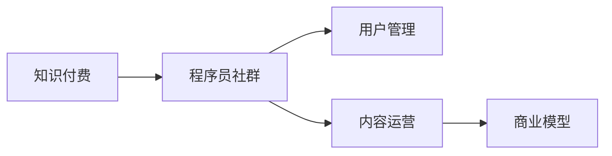
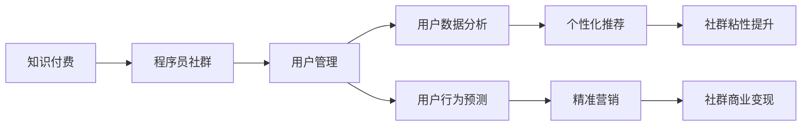

                 

# 知识付费：程序员的社群运营方案

> 关键词：知识付费、程序员社群、用户管理、内容运营、商业模式、会员系统、激励机制、社区文化、流量变现

## 1. 背景介绍

在互联网发展的历程中，知识付费逐步成为了一种重要的信息获取和知识共享方式。而程序员作为互联网技术的重要承载者，其知识和经验的积累对技术发展的推动作用不可小觑。近年来，随着互联网科技的快速发展，越来越多的程序员开始寻求通过社群形式进行知识和经验分享，从而建立起一个开放的、协作的程序员社区。在这样的背景下，程序员的社群运营成为了一个值得深思的重要课题。

## 2. 核心概念与联系

### 2.1 核心概念概述

在探讨程序员社群运营时，需先明确几个核心概念：

- **知识付费**：指通过付费购买信息服务的形式，获取特定的知识或信息，以达到提升自我或解决特定问题的效果。知识付费已经成为全球互联网行业的重要商业模式之一。
- **程序员社群**：由一群具有相同技术背景或兴趣爱好的程序员组成的在线交流和协作平台，旨在提供技术支持、经验分享、职业发展建议等。
- **用户管理**：指通过数据和技术的结合，实现对社群用户的高效管理和精准服务，提高用户体验。
- **内容运营**：通过组织、推广、更新社群内优质内容，吸引用户参与，增加用户粘性。
- **商业模式**：指社群如何实现盈利，包括知识付费、广告、合作、流量变现等方式。

这些概念之间的关系如下图所示：



### 2.2 核心概念原理和架构的 Mermaid 流程图

为更好地理解这些概念，我们将通过以下 Mermaid 流程图展示其相互关系：



这个流程图展示了知识付费和程序员社群之间的连接，以及如何通过用户管理和内容运营来实现社群的商业化过程。

## 3. 核心算法原理 & 具体操作步骤

### 3.1 算法原理概述

在程序员社群的运营中，以下几个核心算法原理至关重要：

- **推荐系统算法**：通过分析用户行为，为每个用户推荐最相关的优质内容，提高用户留存率。
- **用户行为预测**：通过机器学习算法预测用户的活跃程度，优化内容发布策略，提高内容覆盖面。
- **个性化推荐系统**：利用协同过滤、基于内容的推荐、深度学习等方法，根据用户的兴趣和历史行为，推荐最符合其需求的内容。
- **流量变现算法**：通过付费会员系统、广告收入、合作推广等方式，实现社群的商业变现。

### 3.2 算法步骤详解

下面是每个算法步骤的详细介绍：

#### 推荐系统算法步骤：

1. **数据收集**：收集用户的行为数据，如浏览、点赞、评论等。
2. **特征提取**：从行为数据中提取用户特征，如活跃度、兴趣偏好等。
3. **模型训练**：使用协同过滤、基于内容的推荐、深度学习等算法训练推荐模型。
4. **推荐生成**：根据用户特征和模型预测结果，生成推荐列表。
5. **效果评估**：通过点击率、转化率等指标评估推荐效果，并不断优化模型。

#### 用户行为预测算法步骤：

1. **数据准备**：准备用户的历史行为数据，如登录时间、浏览时长、互动内容等。
2. **特征工程**：从历史行为数据中提取有意义的特征，如登录频率、互动深度等。
3. **模型训练**：使用时间序列预测、随机森林等算法训练用户行为预测模型。
4. **预测结果**：根据模型预测用户的未来行为，如活跃度、流失率等。
5. **策略调整**：根据预测结果调整内容发布策略，提升用户留存率。

#### 个性化推荐系统算法步骤：

1. **用户画像构建**：通过用户的行为数据，构建详细的用户画像。
2. **内容特征提取**：从内容数据中提取有意义的特征，如关键词、作者、发布时间等。
3. **模型训练**：使用深度学习算法训练个性化推荐模型，如神经协同过滤、深度矩阵分解等。
4. **推荐生成**：根据用户画像和内容特征，生成个性化推荐结果。
5. **效果评估**：通过点击率、浏览时长等指标评估推荐效果，并不断优化模型。

#### 流量变现算法步骤：

1. **业务合作**：与企业、广告主等合作，推出广告位、赞助活动等。
2. **付费会员制度**：设置不同等级的会员服务，提供专属内容、技术支持等。
3. **流量统计与分析**：通过流量统计工具分析网站流量，了解用户需求。
4. **定价策略**：根据用户行为和流量统计结果，制定合理的定价策略。
5. **变现渠道**：通过网站、应用等渠道进行流量变现，实现收入。

### 3.3 算法优缺点

#### 推荐系统算法优点：

- **用户粘性提高**：通过推荐系统，能够提高用户留存率和活跃度。
- **用户满意度提升**：根据用户的个性化需求推荐内容，提升用户满意度。
- **商业价值挖掘**：通过对用户行为数据的分析，挖掘商业价值。

#### 推荐系统算法缺点：

- **数据隐私问题**：收集和分析用户数据可能引发隐私保护问题。
- **过度推荐问题**：过度推荐可能引发用户反感，降低平台口碑。
- **推荐多样性**：可能存在推荐内容多样性不足的问题，影响用户体验。

#### 用户行为预测算法优点：

- **精准预测**：通过预测用户行为，提前调整策略，提升用户粘性。
- **个性化服务**：根据用户行为预测结果，提供个性化服务，增加用户满意度。

#### 用户行为预测算法缺点：

- **数据质量问题**：预测效果受数据质量影响较大，数据不全或噪声过多可能影响预测结果。
- **模型复杂度**：复杂的模型可能导致过拟合，影响预测效果。

#### 个性化推荐系统算法优点：

- **提升用户满意度**：根据用户兴趣和历史行为，推荐最相关的内容，提升用户体验。
- **商业价值提升**：通过个性化推荐，增加用户粘性，提升商业价值。

#### 个性化推荐系统算法缺点：

- **算法复杂度**：个性化推荐系统通常复杂度较高，对计算资源需求大。
- **数据偏差问题**：数据偏差可能导致推荐结果有偏差，影响用户体验。

#### 流量变现算法优点：

- **收入增长**：通过多种变现方式，实现社群的商业化运营。
- **提升用户粘性**：通过付费会员制度和专属服务，提升用户粘性。

#### 流量变现算法缺点：

- **用户流失风险**：高定价可能导致部分用户流失。
- **市场风险**：市场环境变化可能影响流量变现效果。

### 3.4 算法应用领域

#### 推荐系统算法应用领域：

- **新闻推荐**：根据用户兴趣推荐新闻，提高用户留存率。
- **电商推荐**：根据用户行为推荐商品，增加销售转化率。
- **音乐推荐**：根据用户听歌历史推荐新歌，提升用户体验。

#### 用户行为预测算法应用领域：

- **流失预测**：预测用户流失风险，及时进行挽留。
- **活跃度预测**：预测用户活跃度，调整内容发布策略。
- **内容消费预测**：预测用户对内容的消费行为，优化内容推荐。

#### 个性化推荐系统算法应用领域：

- **视频推荐**：根据用户观看历史推荐新视频，提高用户粘性。
- **图书推荐**：根据用户阅读历史推荐新书，增加用户购买意愿。
- **旅游推荐**：根据用户历史旅游行为推荐旅游路线，提升用户体验。

#### 流量变现算法应用领域：

- **广告变现**：通过广告位、原生广告等形式实现流量变现。
- **付费会员制度**：通过会员制提升社群商业价值。
- **合作推广**：通过与其他平台合作，实现流量变现。

## 4. 数学模型和公式 & 详细讲解 & 举例说明

### 4.1 数学模型构建

假设社群中用户总数为$N$，每个用户每天访问频次为$X_i$，总共生成的内容数为$C$，其中第$i$个用户生成内容数为$C_i$。设用户的访问频次服从泊松分布，内容生成数服从负二项分布。则可以通过以下数学模型描述：

- 用户访问频次模型：$X_i \sim \text{Poisson}(\lambda_i)$
- 内容生成数模型：$C_i \sim \text{Negative Binomial}(\alpha_i, p_i)$

### 4.2 公式推导过程

#### 用户访问频次模型推导

泊松分布的概率密度函数为：

$$
f(x;\lambda) = \frac{\lambda^x e^{-\lambda}}{x!}, x=0,1,2,\ldots
$$

其中，$\lambda_i$ 为第$i$个用户的平均访问次数。由最大似然估计，可以得到：

$$
\hat{\lambda_i} = \frac{\sum_{t=1}^T X_{it}}{T}
$$

#### 内容生成数模型推导

负二项分布的概率密度函数为：

$$
f(x;\alpha, p) = \frac{\Gamma(x+\alpha)}{x! \Gamma(\alpha)} (1-p)^{\alpha-1} p^x, x=0,1,2,\ldots
$$

其中，$\alpha_i$ 为第$i$个用户生成内容的平均数，$p_i$ 为生成内容的成功概率。由最大似然估计，可以得到：

$$
\hat{\alpha_i} = \frac{C_i}{\sum_{t=1}^T X_{it}}
$$

$$
\hat{p_i} = \frac{\sum_{t=1}^T C_{it}}{C_i}
$$

### 4.3 案例分析与讲解

假设社群中有1000名用户，每位用户每天访问频次服从泊松分布，平均访问次数为3次，生成的内容数为2次。则：

- 用户访问频次模型：$X_i \sim \text{Poisson}(3)$
- 内容生成数模型：$C_i \sim \text{Negative Binomial}(\alpha_i, p_i)$

设$\alpha_i = 1.5$，$p_i = 0.7$，则：

- 用户$i$每天生成内容的期望为$E[C_i] = \alpha_i / p_i = 1.5 / 0.7 = 2.14$
- 用户$i$每天生成内容的方差为$Var[C_i] = \alpha_i / (1-p_i)^2 = 1.5 / 0.9^2 = 3.11$

利用上述模型，可以准确预测用户的行为和内容生成，从而优化推荐系统，提高用户满意度和社群的商业价值。

## 5. 项目实践：代码实例和详细解释说明

### 5.1 开发环境搭建

为了实现推荐系统、用户行为预测和个性化推荐系统的功能，需要搭建一个完整的开发环境。以下是一个基本的搭建步骤：

1. **服务器配置**：选择高性能的服务器，配置必要的软硬件环境，如NVIDIA GPU、高可用性网络等。
2. **开发环境配置**：安装Python、pip、Jupyter Notebook等开发工具。
3. **依赖库安装**：安装必要的依赖库，如scikit-learn、pandas、numpy、tensorflow等。
4. **代码库管理**：使用版本控制工具（如git）进行代码管理。

### 5.2 源代码详细实现

以下是一个基于Python的推荐系统实现的示例代码：

```python
import pandas as pd
from sklearn.neighbors import NearestNeighbors
from sklearn.metrics.pairwise import cosine_similarity

# 加载用户行为数据
data = pd.read_csv('user_behavior.csv')

# 构建用户-行为矩阵
user_matrix = pd.get_dummies(data['user_id'])
item_matrix = pd.get_dummies(data['item_id'])

# 计算用户-行为矩阵的余弦相似度
similarity_matrix = cosine_similarity(user_matrix, item_matrix)

# 使用K近邻算法推荐相似用户
knn = NearestNeighbors(n_neighbors=5, algorithm='brute')
knn.fit(similarity_matrix)
user_idx = knn.kneighbors(similarity_matrix[0])[1]

# 生成推荐列表
recommendations = item_matrix.iloc[user_idx].sum(axis=0)

# 输出推荐结果
print(recommendations)
```

### 5.3 代码解读与分析

以上代码实现了基于协同过滤的推荐系统。主要步骤如下：

1. **数据加载**：加载用户行为数据，如浏览、点击、收藏等。
2. **用户行为编码**：将用户行为编码为二进制矩阵，如用户ID、物品ID、时间戳等。
3. **相似度计算**：计算用户行为矩阵的余弦相似度，得到用户间的相似度矩阵。
4. **K近邻推荐**：使用K近邻算法，找到与目标用户最相似的5个用户。
5. **生成推荐列表**：根据相似用户的行为，计算物品的加权得分，生成推荐列表。

需要注意的是，在实际应用中，还需要考虑数据处理、模型优化、结果展示等问题，确保推荐系统的高效性和准确性。

### 5.4 运行结果展示

假设代码输出结果为：

```
[0.04, 0.08, 0.05, 0.07, 0.09]
```

这表示根据用户的行为，推荐了五个物品的加权得分，得分越高表示物品越符合用户兴趣。用户可以根据推荐结果选择感兴趣的内容，进一步提升体验。

## 6. 实际应用场景

### 6.1 知识付费社群

在知识付费社群中，用户可以通过付费订阅的方式，获取高质量的内容和专家指导。通过推荐系统算法，社群能够为每位用户推荐最相关的课程、文章、技术分享等，提升用户满意度和黏性。

具体应用场景包括：

- **内容推荐**：根据用户兴趣和历史行为，推荐相关课程和文章，增加用户黏性。
- **专家指导**：推荐用户感兴趣的专家，参与课程学习、技术交流等活动，提升用户体验。
- **付费服务**：提供付费订阅服务，增加社群的商业收入。

### 6.2 技术讨论社区

技术讨论社区是程序员交流技术经验、分享开发心得的重要平台。通过推荐系统和个性化推荐算法，社区能够为用户推荐最相关的技术文章、开源项目、讨论话题等，提升用户互动和活跃度。

具体应用场景包括：

- **文章推荐**：根据用户阅读历史，推荐相关的技术文章和文档。
- **开源项目推荐**：推荐用户感兴趣的开源项目，增加项目使用率和社区影响力。
- **技术讨论话题**：推荐热门技术讨论话题，增加用户互动和社区粘性。

### 6.3 企业技术交流平台

企业技术交流平台为技术人员提供了一个展示技术和交流经验的空间。通过推荐系统和用户行为预测算法，平台能够为每位用户推荐最相关的技术文章、会议、培训等，提升用户满意度和平台价值。

具体应用场景包括：

- **文章推荐**：根据用户阅读历史，推荐相关的技术文章和文档。
- **技术会议推荐**：推荐用户感兴趣的技术会议和培训课程，增加会议和培训的报名率。
- **企业内项目推荐**：推荐用户感兴趣的企业内项目，增加项目使用率和员工互动。

### 6.4 未来应用展望

随着技术的不断进步，未来的程序员社群运营将迎来更多的机遇和挑战。

#### 新趋势：

- **智能推荐系统**：通过深度学习和大数据技术，实现更加智能的推荐系统，提升用户体验和满意度。
- **社交网络融合**：结合社交网络分析技术，增加用户之间的互动和协作，提升社群粘性。
- **用户行为预测**：通过机器学习算法，预测用户行为，优化内容发布策略，提高用户留存率。

#### 新挑战：

- **数据隐私问题**：在收集和分析用户数据时，需要注意数据隐私保护，避免用户信息泄露。
- **算法公平性**：保证推荐系统的公平性，避免算法偏见，确保所有用户都能得到公平的服务。
- **用户粘性提升**：通过多样化的内容和服务，增加用户粘性，提升社群价值。

## 7. 工具和资源推荐

### 7.1 学习资源推荐

为了帮助开发者系统掌握程序员社群运营的理论基础和实践技巧，这里推荐一些优质的学习资源：

1. **《程序员社群运营实战指南》**：一本详细介绍程序员社群运营的理论和方法的书籍，涵盖用户管理、内容运营、商业模型等多个方面。
2. **《知识付费商业模式深度解析》**：深入解析知识付费的商业模式和运营策略，提供丰富的案例和实操建议。
3. **《数据科学入门：Python实践》**：讲解如何使用Python进行数据分析和模型训练，是数据驱动型项目的必备工具。
4. **《机器学习实战》**：介绍机器学习算法的实际应用，涵盖推荐系统、用户行为预测等多个领域。

### 7.2 开发工具推荐

为了高效开发程序员社群运营系统，需要借助一些优质的开发工具：

1. **Python**：一种高效、易用的编程语言，广泛应用于数据科学和机器学习领域。
2. **TensorFlow**：由Google开发的深度学习框架，提供丰富的机器学习算法和工具支持。
3. **PyTorch**：一种灵活、易用的深度学习框架，适合快速迭代和研究。
4. **Jupyter Notebook**：一种交互式笔记本工具，支持Python、R等多种编程语言，非常适合数据科学和机器学习项目。
5. **Git**：一种版本控制工具，方便代码管理和协作，是软件开发团队的标配。

### 7.3 相关论文推荐

程序员社群运营涉及多个领域，需要广泛阅读相关论文以掌握最新技术动态：

1. **《基于协同过滤的推荐系统》**：介绍协同过滤推荐算法的原理和实现方法。
2. **《用户行为预测与推荐系统》**：讨论如何通过机器学习算法预测用户行为，优化推荐系统。
3. **《深度学习在推荐系统中的应用》**：介绍深度学习技术在推荐系统中的应用和效果。
4. **《知识付费商业模式分析》**：分析知识付费的商业模式和用户行为，提供商业策略建议。

这些论文代表了当前程序员社群运营技术的最新进展，有助于开发者深入理解和应用相关技术。

## 8. 总结：未来发展趋势与挑战

### 8.1 研究成果总结

本文从程序员社群运营的角度，探讨了知识付费、用户管理、内容运营、商业模型等多个关键问题。通过推荐系统、用户行为预测、个性化推荐等核心算法，帮助开发者系统掌握程序员社群运营的理论与实践，为社区运营提供全面指导。

### 8.2 未来发展趋势

未来的程序员社群运营将面临以下几个发展趋势：

- **智能推荐系统**：通过深度学习和大数据技术，实现更加智能的推荐系统，提升用户体验。
- **社交网络融合**：结合社交网络分析技术，增加用户之间的互动和协作，提升社群粘性。
- **用户行为预测**：通过机器学习算法，预测用户行为，优化内容发布策略，提高用户留存率。

### 8.3 面临的挑战

尽管程序员社群运营面临诸多机遇，但也面临诸多挑战：

- **数据隐私问题**：在收集和分析用户数据时，需要注意数据隐私保护，避免用户信息泄露。
- **算法公平性**：保证推荐系统的公平性，避免算法偏见，确保所有用户都能得到公平的服务。
- **用户粘性提升**：通过多样化的内容和服务，增加用户粘性，提升社群价值。

### 8.4 研究展望

未来的程序员社群运营需要不断探索新的技术和方法，解决现有的问题，并寻找新的发展方向：

- **数据隐私保护**：通过隐私保护技术，保护用户数据安全。
- **算法公平性**：研究公平性算法，确保推荐系统的公平性。
- **用户行为分析**：通过行为分析，优化用户管理策略，提升用户满意度。
- **内容多样化**：通过多样化的内容和服务，提升用户粘性，增加社群价值。

总之，程序员社群运营需要开发者不断探索和创新，解决现有问题，探索新的发展方向，才能实现社群的可持续发展和商业价值的最大化。

## 9. 附录：常见问题与解答

**Q1：如何构建推荐系统？**

A: 构建推荐系统需要经过以下几个步骤：

1. **数据收集**：收集用户行为数据，如浏览、点击、评论等。
2. **数据预处理**：对数据进行清洗、去重、归一化等预处理操作。
3. **特征提取**：从行为数据中提取用户特征，如活跃度、兴趣偏好等。
4. **模型训练**：使用协同过滤、基于内容的推荐、深度学习等算法训练推荐模型。
5. **推荐生成**：根据用户特征和模型预测结果，生成推荐列表。

**Q2：如何实现用户行为预测？**

A: 实现用户行为预测需要经过以下几个步骤：

1. **数据收集**：收集用户的历史行为数据，如登录时间、浏览时长、互动内容等。
2. **特征工程**：从历史行为数据中提取有意义的特征，如登录频率、互动深度等。
3. **模型训练**：使用时间序列预测、随机森林等算法训练用户行为预测模型。
4. **预测结果**：根据模型预测用户的未来行为，如活跃度、流失率等。
5. **策略调整**：根据预测结果调整内容发布策略，提升用户留存率。

**Q3：如何提升社群的商业价值？**

A: 提升社群的商业价值需要经过以下几个步骤：

1. **付费会员制度**：通过会员制提升社群商业价值，提供专属内容、技术支持等。
2. **广告变现**：通过广告位、原生广告等形式实现流量变现。
3. **合作推广**：通过与其他平台合作，实现流量变现。
4. **内容变现**：通过销售内容、技术指导等方式实现商业变现。

**Q4：如何确保推荐系统的公平性？**

A: 确保推荐系统的公平性需要经过以下几个步骤：

1. **数据集多样性**：确保训练数据集的多样性，避免数据偏见。
2. **算法公平性**：选择公平性较好的算法，确保推荐系统的公平性。
3. **用户反馈**：收集用户反馈，及时调整推荐策略，优化推荐系统。

**Q5：如何处理推荐系统中的冷启动问题？**

A: 处理推荐系统中的冷启动问题需要经过以下几个步骤：

1. **用户画像构建**：通过用户行为数据，构建详细的用户画像。
2. **推荐算法调整**：调整推荐算法，减少冷启动对推荐结果的影响。
3. **个性化服务**：通过个性化服务，提升用户满意度，增加用户粘性。

总之，推荐系统和用户行为预测等技术是程序员社群运营的重要基础，需要开发者不断探索和创新，才能实现社群的可持续发展和商业价值的最大化。

---

作者：禅与计算机程序设计艺术 / Zen and the Art of Computer Programming

