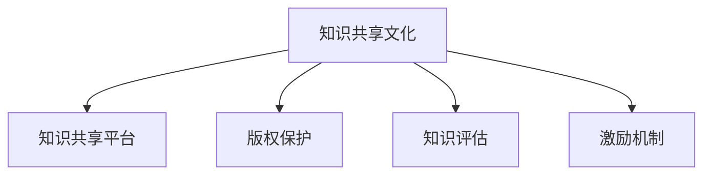

                 

# 知识共享文化的构建策略

## 1. 背景介绍

### 1.1 问题由来
在全球化和技术进步的推动下，知识共享文化在各行各业迅速兴起，成为推动创新、提高效率的重要驱动力。然而，知识共享也面临诸多挑战，如版权保护、信息过载、质量不一等问题。如何构建一个既开放又安全的知识共享环境，成为当前学术界和企业界共同关注的焦点。本文将深入探讨知识共享文化的构建策略，旨在为各领域知识共享提供有力支持。

### 1.2 问题核心关键点
知识共享文化的构建涉及多个方面，包括制定合理的版权保护机制、选择合适的知识分享平台、制定明确的使用和共享规则、以及建立有效的激励和评估机制等。本节将从这些核心关键点出发，逐一分析其重要性和具体实现方法。

### 1.3 问题研究意义
构建良好的知识共享文化，对促进创新、提升工作效率、推动经济社会发展具有重要意义：

1. 促进创新：知识共享打破了信息孤岛，使各类知识和智慧得以融合，激发创新潜力。
2. 提升效率：知识共享降低了信息获取的门槛，使更多人能够快速掌握所需知识，提高工作效率。
3. 推动经济发展：知识共享促进了知识价值的商业化应用，带动了知识密集型产业的发展。
4. 促进教育公平：通过开放教育资源，使更多人尤其是偏远地区和弱势群体能够享受到高质量教育。
5. 增强文化软实力：知识共享提升了国民整体的知识素养和文化素质，增强了国家的文化软实力。

## 2. 核心概念与联系

### 2.1 核心概念概述

为更好地理解知识共享文化的构建策略，本节将介绍几个关键概念：

- **知识共享文化**：指一种鼓励知识和信息公开共享的社会文化，强调知识的传播与交流。
- **知识共享平台**：提供知识共享服务的网络平台，如GitHub、OpenDOAR、arXiv等。
- **版权保护**：通过法律和技术手段，保护创作者和作品拥有者对作品的独占权和使用权。
- **知识评估**：通过同行评审、引用率等指标对知识作品进行质量评估，确保其可靠性。
- **激励机制**：通过经济、名誉等手段，激励知识创作者和分享者参与知识共享。

这些核心概念之间的逻辑关系可以通过以下Mermaid流程图来展示：



这个流程图展示出知识共享文化构建过程中各个要素之间的相互依赖和相互促进的关系。

## 3. 核心算法原理 & 具体操作步骤
### 3.1 算法原理概述

知识共享文化的构建过程，可以通过以下步骤来实现：

1. **数据收集与整理**：收集各类知识资源，进行分类整理，建立知识库。
2. **制定共享规则**：根据知识特点和需求，制定合理的共享规则，明确权利和义务。
3. **平台建设与运营**：选择合适的知识共享平台，建立平台管理体系，确保知识流畅流通。
4. **版权保护与激励**：完善版权保护机制，建立激励机制，鼓励创作者参与共享。
5. **质量评估与反馈**：建立评估体系，进行同行评审，及时反馈共享效果，优化知识库。

### 3.2 算法步骤详解

以下是知识共享文化构建的具体操作步骤：

**Step 1: 数据收集与整理**

- 广泛收集各类知识资源，包括文本、视频、音频等。
- 对收集到的资源进行分类整理，建立结构化的知识库，方便检索和共享。

**Step 2: 制定共享规则**

- 根据知识类型和特点，制定合理的共享规则，包括但不限于：
  - 定义知识共享的权限，明确哪些部分可以公开访问，哪些部分需要特定权限。
  - 制定知识使用的规范，如注明出处、不得用于商业用途等。
  - 建立知识共享的反馈机制，便于用户对共享资源进行评价和修改。

**Step 3: 平台建设与运营**

- 选择合适的知识共享平台，如GitHub、OpenDOAR、arXiv等。
- 建立平台管理体系，包括用户认证、资源审核、质量监控等功能。
- 定期更新和维护平台，确保知识库的实时性和有效性。

**Step 4: 版权保护与激励**

- 完善版权保护机制，如使用DRM技术保护数字版权，使用区块链技术进行版权登记。
- 建立激励机制，如提供经济奖励、名誉荣誉等，激励创作者和分享者参与知识共享。

**Step 5: 质量评估与反馈**

- 建立知识评估体系，如同行评审、引用率等指标，对知识作品进行质量评估。
- 根据用户反馈，及时调整和优化知识库，确保其高质量和实用性。

### 3.3 算法优缺点

知识共享文化的构建具有以下优点：

1. 促进创新：知识共享打破了信息孤岛，使各类知识和智慧得以融合，激发创新潜力。
2. 提升效率：知识共享降低了信息获取的门槛，使更多人能够快速掌握所需知识，提高工作效率。
3. 推动经济发展：知识共享促进了知识价值的商业化应用，带动了知识密集型产业的发展。
4. 促进教育公平：通过开放教育资源，使更多人尤其是偏远地区和弱势群体能够享受到高质量教育。
5. 增强文化软实力：知识共享提升了国民整体的知识素养和文化素质，增强了国家的文化软实力。

同时，该方法也存在一定的局限性：

1. 版权保护复杂：知识共享需要平衡创作者权益和公众利益，版权保护机制的实施较为复杂。
2. 信息过载：知识库规模扩大，用户面临信息过载的风险，难以快速定位所需知识。
3. 质量不一：知识作品的质量参差不齐，用户难以判断其可靠性，可能误用错误或不成熟的信息。
4. 激励不足：缺乏有效的激励机制，知识创作者和分享者的积极性可能不足。
5. 平台依赖度高：知识共享平台的服务中断或故障，可能影响知识共享的正常进行。

尽管存在这些局限性，但就目前而言，知识共享文化的构建方法仍是大规模知识共享的重要基础。未来相关研究的重点在于如何进一步优化版权保护机制，提升知识库的质量，设计更有效的激励和评估体系，以实现知识共享的可持续和高效发展。

### 3.4 算法应用领域

知识共享文化的应用领域非常广泛，涵盖学术研究、企业创新、教育培训、政府决策等多个方面：

- **学术研究**：通过开放科学数据和文献，促进科研合作和知识传播，推动科学进步。
- **企业创新**：企业可以通过共享内部研发成果和技术标准，加速技术迭代和新产品开发。
- **教育培训**：开放教育资源，提供高质量的教学材料，促进教育公平和终身学习。
- **政府决策**：通过公开政策数据和统计信息，促进透明度和公民参与，提升决策质量。
- **社会治理**：开放公共数据和资源，提升社会治理的智能化和精准化水平，促进公共服务均等化。

除了上述这些经典应用外，知识共享文化还被创新性地应用于更多的场景中，如智能制造、智慧医疗、环保监测等，为各行各业提供了新的发展机遇。随着知识共享的不断深化，知识共享文化必将在更广阔的领域发挥重要作用。

## 4. 数学模型和公式 & 详细讲解 & 举例说明

### 4.1 数学模型构建

本节将使用数学语言对知识共享文化的构建过程进行更加严格的刻画。

记知识共享平台为 $K=\{D, R, S, P\}$，其中 $D$ 表示知识资源，$R$ 表示知识共享规则，$S$ 表示知识评估体系，$P$ 表示平台管理体系。

知识共享的构建目标是最小化信息不对称，最大化知识共享的价值。形式化地，假设知识共享平台 $K$ 的构建目标函数为：

$$
\mathcal{L}(K) = \min_{D, R, S, P} \mathcal{I}(D, R, S, P) - \mathcal{V}(D, R, S, P)
$$

其中 $\mathcal{I}(D, R, S, P)$ 为知识共享的互信息，表示共享前后的信息不对称程度。$\mathcal{V}(D, R, S, P)$ 为知识共享的价值，表示共享后知识利用的实际效果。

### 4.2 公式推导过程

以下我们以知识共享平台的用户满意度为具体目标，推导目标函数的计算方法。

定义用户满意度 $U$ 为知识共享平台的用户评价分数，其计算公式为：

$$
U = \frac{\sum_{i=1}^N u_i}{N}
$$

其中 $u_i$ 表示用户 $i$ 对平台的评价，$N$ 表示用户总数。

假设平台用户数为 $N$，知识共享的互信息 $\mathcal{I}$ 可以通过用户满意度 $U$ 和知识质量 $Q$ 来衡量，计算公式为：

$$
\mathcal{I} = \log (1 + \frac{U}{Q})
$$

知识共享的价值 $\mathcal{V}$ 可以通过知识利用率 $R$ 和知识准确率 $A$ 来衡量，计算公式为：

$$
\mathcal{V} = R \cdot A
$$

因此，知识共享平台的构建目标函数为：

$$
\mathcal{L}(K) = \log (1 + \frac{U}{Q}) - R \cdot A
$$

该函数为目标函数 $\mathcal{L}(K)$ 对知识共享平台 $K$ 的优化目标。优化目标最小化信息不对称，同时最大化知识共享的价值。

### 4.3 案例分析与讲解

假设某知识共享平台的用户数为 $N=10000$，知识质量 $Q=90$，知识利用率 $R=80\%$，知识准确率 $A=95\%$。代入公式计算目标函数：

$$
\mathcal{L}(K) = \log (1 + \frac{U}{Q}) - R \cdot A = \log (1 + \frac{U}{90}) - 0.8 \cdot 0.95
$$

为了最大化 $\mathcal{L}(K)$，需要最大化用户满意度 $U$，最小化知识质量 $Q$，提高知识利用率 $R$ 和知识准确率 $A$。因此，平台需要不断优化知识资源，制定合理的共享规则，建立有效的评估体系，提升用户体验和知识质量。

## 5. 项目实践：代码实例和详细解释说明

### 5.1 开发环境搭建

在进行知识共享平台构建实践前，我们需要准备好开发环境。以下是使用Python进行Flask开发的环境配置流程：

1. 安装Anaconda：从官网下载并安装Anaconda，用于创建独立的Python环境。

2. 创建并激活虚拟环境：
```bash
conda create -n flask-env python=3.8 
conda activate flask-env
```

3. 安装Flask：
```bash
pip install flask
```

4. 安装SQLAlchemy：
```bash
pip install sqlalchemy
```

5. 安装WTForms：
```bash
pip install wtforms
```

6. 安装Flask-WTF：
```bash
pip install flask-wtf
```

7. 安装Jinja2：
```bash
pip install jinja2
```

完成上述步骤后，即可在`flask-env`环境中开始知识共享平台构建的实践。

### 5.2 源代码详细实现

下面我们以构建一个简单的知识共享平台为例，给出使用Flask框架开发的Python代码实现。

首先，定义知识共享平台的数据模型：

```python
from flask_sqlalchemy import SQLAlchemy
from flask_wtf import FlaskForm
from wtforms import StringField, SubmitField
from wtforms.validators import DataRequired

db = SQLAlchemy()

class KnowledgeForm(FlaskForm):
    title = StringField('Title', validators=[DataRequired()])
    author = StringField('Author', validators=[DataRequired()])
    content = StringField('Content', validators=[DataRequired()])
    submit = SubmitField('Submit')
```

然后，定义知识共享平台的视图函数：

```python
from flask import render_template, request, redirect, url_for

@app.route('/')
def index():
    all_knowledge = Knowledge.query.all()
    return render_template('index.html', knowledge=all_knowledge)

@app.route('/submit', methods=['GET', 'POST'])
def submit():
    form = KnowledgeForm()
    if form.validate_on_submit():
        new_knowledge = Knowledge(title=form.title.data, author=form.author.data, content=form.content.data)
        db.session.add(new_knowledge)
        db.session.commit()
        return redirect(url_for('index'))
    return render_template('submit.html', form=form)
```

最后，定义知识共享平台的路由和模板：

```html
<!-- index.html -->
<html>
  <head>
    <title>Knowledge Sharing Platform</title>
  </head>
  <body>
    <h1>Knowledge Sharing Platform</h1>
    
      <h2>{{ knowledge.title }}</h2>
      <p>Author: {{ knowledge.author }}</p>
      <p>{{ knowledge.content }}</p>
      <a href="{{ url_for('submit', title=knowledge.title) }}">Edit</a>
      <a href="{{ url_for('delete', id=knowledge.id) }}">Delete</a>
    
    <form method="POST">
      {{ form.hidden_tag() }}
      {{ form.title.label }} {{ form.title() }}
      {{ form.author.label }} {{ form.author() }}
      {{ form.content.label }} {{ form.content() }}
      {{ form.submit() }}
    </form>
  </body>
</html>

<!-- submit.html -->
<html>
  <head>
    <title>Submit New Knowledge</title>
  </head>
  <body>
    <h1>Submit New Knowledge</h1>
    <form method="POST">
      {{ form.hidden_tag() }}
      {{ form.title.label }} {{ form.title() }}
      {{ form.author.label }} {{ form.author() }}
      {{ form.content.label }} {{ form.content() }}
      {{ form.submit() }}
    </form>
  </body>
</html>
```

可以看到，使用Flask框架可以方便地构建知识共享平台。开发者可以根据具体需求，灵活扩展功能，如用户认证、权限控制、知识搜索、推荐系统等。

### 5.3 代码解读与分析

让我们再详细解读一下关键代码的实现细节：

**KnowledgeForm类**：
- 定义了一个知识共享平台的表单，包括标题、作者、内容等字段，使用WTForms库进行验证。
- 表单中提交按钮的点击事件，会触发视图函数`submit`，将表单数据保存到数据库中。

**submit视图函数**：
- 根据提交按钮的点击事件，调用表单验证函数`validate_on_submit`，确保表单数据正确无误。
- 如果表单数据验证通过，创建一个新的知识记录，保存到数据库中，并重新加载页面。
- 如果表单数据验证未通过，渲染提交页面，提示用户检查输入字段。

**index视图函数**：
- 从数据库中查询所有知识记录，并将它们渲染到页面中。
- 用户可以单击每个知识的编辑和删除按钮，重新加载页面以进行修改或删除操作。

**知识共享平台的路由和模板**：
- 使用Flask的路由装饰器，定义了根路径`/`和提交路径`/submit`的请求处理函数。
- 在模板中使用Flask的渲染函数`render_template`，动态生成HTML页面，展示所有知识记录，并提供编辑和删除操作。
- 提交页面使用WTForms表单，获取用户输入，并发送到服务器进行处理。

## 6. 实际应用场景
### 6.1 科学数据共享

科学研究是知识共享的重要领域，科学数据共享平台可以提供实验结果、实验数据、模型参数等公开数据，促进科研合作和数据再利用。

### 6.2 教育资源共享

教育资源共享平台可以提供各类教学材料、案例分析、作业题解等，提升教学质量和效率。通过开放教育资源，促进教育公平，提高全民素质。

### 6.3 政府数据开放

政府数据开放平台可以提供公共政策、统计信息、环保数据等公开数据，提升政府透明度和公共参与度，促进社会治理。

### 6.4 企业知识共享

企业知识共享平台可以提供技术文档、项目案例、培训资料等，促进内部知识传播和经验积累，加速企业创新和发展。

### 6.5 社会公益项目

社会公益项目知识共享平台可以提供各类社会公益项目的信息，促进社会各界对公益事业的关注和参与，提升社会公益项目的透明度和参与度。

## 7. 工具和资源推荐
### 7.1 学习资源推荐

为了帮助开发者系统掌握知识共享文化的构建方法，这里推荐一些优质的学习资源：

1. 《知识共享文化：构建与实践》系列博文：由知识共享领域专家撰写，深入浅出地介绍了知识共享文化的基本概念和构建策略。

2. CS401《互联网与社会》课程：哈佛大学开设的关于互联网与社会影响的课程，探讨了知识共享对社会的影响和应用。

3. 《知识共享：全球视角》书籍：系统地介绍了全球范围内的知识共享实践和经验，为知识共享提供有益的借鉴。

4. OpenDOAR开源项目：开放科研数据和文献的平台，展示了知识共享的成功案例和实践经验。

5. W3C知识共享标准：W3C发布的知识共享标准，如CC协议、RDFS等，为知识共享提供了技术保障。

通过对这些资源的学习实践，相信你一定能够快速掌握知识共享文化的构建精髓，并用于解决实际的共享问题。

### 7.2 开发工具推荐

高效的开发离不开优秀的工具支持。以下是几款用于知识共享平台开发的常用工具：

1. Flask：轻量级的Web框架，易于扩展和维护，适合开发中小型知识共享平台。

2. Django：功能强大的Web框架，适合开发大中型知识共享平台，具有完善的ORM和模板引擎。

3. SQLAlchemy：基于Python的ORM框架，用于管理数据库，支持多种数据库。

4. Apache Kafka：高吞吐量的分布式消息系统，适合处理大规模的知识共享数据流。

5. Elasticsearch：基于Lucene的开源搜索引擎，适合构建高性能的知识搜索和检索系统。

6. TensorFlow和PyTorch：强大的机器学习框架，用于处理知识资源的分类、推荐等智能应用。

合理利用这些工具，可以显著提升知识共享平台的开发效率，加快创新迭代的步伐。

### 7.3 相关论文推荐

知识共享文化的研究源于学界的持续研究。以下是几篇奠基性的相关论文，推荐阅读：

1. "The Economics of Knowledge Sharing"（知识共享的经济性）：探讨了知识共享的经济原理和模型。

2. "Collaborative Filtering for Knowledge Discovery in Databases"（基于协同过滤的知识发现）：介绍了协同过滤算法在知识共享中的应用。

3. "Sharing Knowledge in Online Communities"（在线社区的知识共享）：分析了在线社区中知识共享的行为和影响。

4. "Open Access to Public Sector Information: Empowering the Public Sector for a Digital Age"（公共部门信息的开放访问）：探讨了公共部门信息开放的政策和实践。

5. "Knowledge Sharing in Software Development"（软件开发中的知识共享）：研究了软件开发过程中知识共享的技术和策略。

这些论文代表了大规模知识共享研究的发展脉络。通过学习这些前沿成果，可以帮助研究者把握学科前进方向，激发更多的创新灵感。

## 8. 总结：未来发展趋势与挑战

### 8.1 总结

本文对知识共享文化的构建策略进行了全面系统的介绍。首先阐述了知识共享文化的背景和意义，明确了构建知识共享文化的各个要素和步骤。其次，从算法原理到实际操作，详细讲解了知识共享平台构建的具体流程，给出了代码实例和详细解释说明。同时，本文还广泛探讨了知识共享在科学数据、教育资源、政府数据等多个领域的应用前景，展示了知识共享文化的广泛价值。此外，本文精选了知识共享文化的各类学习资源，力求为读者提供全方位的技术指引。

通过本文的系统梳理，可以看到，构建良好的知识共享文化，对促进创新、提升工作效率、推动经济社会发展具有重要意义。未来，伴随知识共享的不断深化和扩展，必将在更广阔的领域发挥重要作用。

### 8.2 未来发展趋势

展望未来，知识共享文化将呈现以下几个发展趋势：

1. 数据共享方式多样化：未来的知识共享将不再局限于文本和文档，而是拓展到视频、音频、代码等多模态数据。
2. 知识共享平台智能化：利用人工智能技术，实现知识的自动化生成、推荐和搜索，提升知识共享的效率和质量。
3. 知识共享规则灵活化：根据不同领域和应用场景，灵活调整知识共享规则，平衡创作者权益和公众利益。
4. 知识共享价值多元化：将知识共享与伦理、社会责任相结合，推动知识共享的价值最大化。
5. 知识共享系统集成化：将知识共享与大数据、云计算等技术集成，构建一体化的知识共享生态系统。

以上趋势凸显了知识共享文化的广阔前景。这些方向的探索发展，必将进一步提升知识共享的广泛性和深入性，为构建人机协同的智能系统铺平道路。

### 8.3 面临的挑战

尽管知识共享文化已经取得了瞩目成就，但在迈向更加智能化、普适化应用的过程中，它仍面临着诸多挑战：

1. 数据质量参差不齐：知识共享平台上的数据质量参差不齐，如何确保数据的准确性和完整性，是一个重要问题。
2. 数据隐私和安全：知识共享平台需要处理大量敏感数据，如何保护用户隐私和数据安全，是一个亟待解决的难题。
3. 知识共享机制复杂：知识共享涉及多方利益，如何建立公平、透明的知识共享机制，是一个复杂的系统工程。
4. 知识共享平台依赖度高：知识共享平台的服务中断或故障，可能影响知识共享的正常进行。
5. 知识共享规则模糊：知识共享规则的不明确，可能导致用户对规则理解不一致，影响知识共享的公平性和有效性。

尽管存在这些挑战，但就目前而言，知识共享文化的构建方法仍是大规模知识共享的重要基础。未来相关研究的重点在于如何进一步优化数据质量，提升数据隐私保护，设计更灵活、公平的知识共享规则，以实现知识共享的可持续和高效发展。

### 8.4 研究展望

面对知识共享文化所面临的种种挑战，未来的研究需要在以下几个方面寻求新的突破：

1. 数据质量保障机制：建立数据质量保障机制，通过数据校验、数据清洗等手段，确保共享数据的高质量和高可用性。

2. 数据隐私保护技术：采用隐私保护技术，如差分隐私、联邦学习等，保护用户隐私和数据安全。

3. 知识共享规则优化：优化知识共享规则，确保规则的公平性和透明性，提升知识共享的效率和效果。

4. 知识共享平台集成化：将知识共享平台与大数据、云计算等技术集成，构建一体化的知识共享生态系统。

5. 知识共享价值最大化：将知识共享与伦理、社会责任相结合，推动知识共享的价值最大化，促进知识共享文化的可持续发展。

这些研究方向的探索，必将引领知识共享文化迈向更高的台阶，为构建安全、可靠、可解释、可控的智能系统铺平道路。面向未来，知识共享文化需要与其他人工智能技术进行更深入的融合，如知识表示、因果推理、强化学习等，多路径协同发力，共同推动自然语言理解和智能交互系统的进步。只有勇于创新、敢于突破，才能不断拓展知识共享文化的边界，让智能技术更好地造福人类社会。

## 9. 附录：常见问题与解答

**Q1：知识共享平台如何处理大规模数据？**

A: 知识共享平台处理大规模数据需要采用分布式存储和计算技术，如Hadoop、Spark等。同时，可以采用数据分片和数据索引等技术，提升数据的检索和处理效率。

**Q2：知识共享平台如何确保数据质量？**

A: 知识共享平台需要建立数据质量保障机制，包括数据校验、数据清洗、数据标注等手段，确保共享数据的高质量和高可用性。

**Q3：知识共享平台如何保护用户隐私？**

A: 知识共享平台需要采用隐私保护技术，如差分隐私、联邦学习等，确保用户隐私和数据安全。同时，需要明确用户数据的权限和使用范围，保障用户知情权和选择权。

**Q4：知识共享平台如何处理知识版权问题？**

A: 知识共享平台需要完善版权保护机制，如使用DRM技术保护数字版权，使用区块链技术进行版权登记。同时，需要建立明确的版权声明和使用规范，引导创作者和用户遵守。

**Q5：知识共享平台如何吸引创作者参与？**

A: 知识共享平台需要建立激励机制，如提供经济奖励、名誉荣誉等，激励创作者参与知识共享。同时，需要建立开放包容的文化氛围，鼓励创作者和用户积极贡献和分享知识。

**Q6：知识共享平台如何处理知识冲突？**

A: 知识共享平台需要建立公平透明的知识共享规则，明确知识共享的权限和使用范围，保障各方权益。同时，需要建立有效的争议解决机制，及时处理知识冲突。

---

作者：禅与计算机程序设计艺术 / Zen and the Art of Computer Programming

