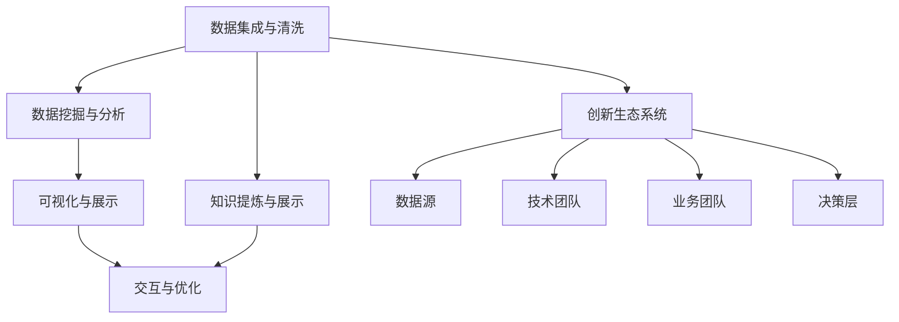
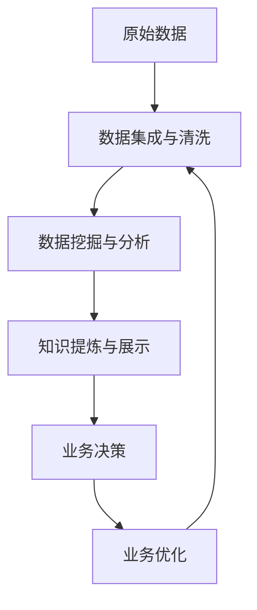

                 

## 1. 背景介绍

### 1.1 问题由来
在全球数字化转型加速的浪潮下，知识发现引擎（Knowledge Discovery Engine, KDE）已成为企业智能决策的重要支撑。从电子商务、金融服务到医疗健康，各行各业都在积极探索如何通过先进的数据分析技术，发现隐藏的商业价值和潜在的创新机会。然而，传统的数据分析方法往往依赖人工经验和领域知识，耗时长、成本高，且难以适应快速变化的市场环境。知识发现引擎，作为一种自动化、智能化、智能化的数据分析工具，能够通过数据驱动的方式，发现知识、揭示规律、驱动决策，从而在提升效率、优化运营、创新发展等方面发挥重要作用。

### 1.2 问题核心关键点
知识发现引擎的核心思想是通过数据驱动，自动发现数据中蕴含的知识和规律，为企业提供战略洞察和决策支持。其核心要素包括：

- 数据集成与清洗：汇集来自不同来源、格式、质量的数据，并进行清洗、转换和整合，形成高质量的数据集。
- 数据挖掘与分析：使用机器学习和统计学方法，从数据中挖掘出有价值的模式和规律，如关联规则、聚类、分类、回归等。
- 知识发现与提炼：将挖掘到的数据知识进行提炼和总结，形成易于理解的业务洞察，为决策提供支持。
- 可视化与展示：将知识发现的结果通过直观的图形、报表等方式展示出来，辅助决策和业务运营。
- 交互与优化：与业务人员和决策者进行紧密交互，持续优化发现引擎的算法和模型，提升知识发现的效果。

知识发现引擎的成功应用，不仅需要先进的算法和模型，还需要建立有效的创新生态系统。该系统包括数据源、技术团队、业务团队、决策层等多方参与者，形成协同协作、跨领域创新的良好环境。本文将系统介绍知识发现引擎的核心概念与技术，并探讨如何构建创新的生态系统，为企业智能化决策提供强有力支撑。

## 2. 核心概念与联系

### 2.1 核心概念概述
为更好地理解知识发现引擎的原理和工作机制，本文将介绍几个关键概念：

- 数据集成与清洗（Data Integration and Cleaning）：将异构、多源的数据集进行清洗和整合，形成适合分析的数据源。
- 数据挖掘与分析（Data Mining and Analysis）：通过机器学习和统计学方法，从数据中提取和分析模式和规律。
- 知识提炼与展示（Knowledge Extraction and Visualization）：将数据挖掘结果转化为易于理解和操作的业务知识，并进行可视化展示。
- 交互与优化（Interaction and Optimization）：通过不断优化算法和模型，以及与业务团队的紧密合作，提升知识发现的准确性和实用性。
- 创新生态系统（Innovation Ecosystem）：包括数据源、技术团队、业务团队、决策层等多方协作，形成跨领域的创新环境。

这些概念之间的关系可以通过以下Mermaid流程图来展示：



这个流程图展示了知识发现引擎的核心流程和要素，强调了创新生态系统的作用。

### 2.2 核心概念原理和架构的 Mermaid 流程图
以下是一个简化的知识发现引擎的工作流程示意图：



该图展示了从数据源到最终决策的整个流程，其中每个环节都有其特定的技术和方法。

## 3. 核心算法原理 & 具体操作步骤

### 3.1 算法原理概述

知识发现引擎的核心算法通常包括以下几个步骤：

1. 数据预处理：清洗和整合数据，形成一致、高质量的数据集。
2. 特征选择与提取：从数据中选择并提取有价值的特征，供后续算法使用。
3. 数据建模：选择合适的模型进行训练和预测，如决策树、支持向量机、神经网络等。
4. 模型评估与优化：通过交叉验证等方法，评估模型的性能，并根据业务需求进行优化。
5. 结果展示与解读：将模型结果转化为易于理解的图表和报告，供业务人员和决策者参考。

### 3.2 算法步骤详解

知识发现引擎的具体操作流程如下：

1. **数据准备**
   - **数据集成**：收集来自不同来源的数据，并进行清洗、去重、格式化等处理，形成统一的数据格式。
   - **数据清洗**：检测并修复数据中的错误、缺失值和异常值，确保数据的完整性和一致性。

2. **数据探索与可视化**
   - **数据探索**：使用描述性统计、数据分布图等方法，初步了解数据的特征和规律。
   - **数据可视化**：通过绘制散点图、柱状图、热图等，直观展示数据的关系和特征。

3. **特征工程**
   - **特征选择**：根据业务需求和模型要求，选择和提取有用的特征。
   - **特征转换**：对原始特征进行编码、归一化、PCA等转换，提高模型性能。

4. **模型选择与训练**
   - **模型选择**：根据问题的性质和数据特点，选择合适的模型，如回归模型、分类模型、聚类模型等。
   - **模型训练**：使用训练数据对模型进行拟合，得到模型参数。

5. **模型评估与优化**
   - **模型评估**：使用测试数据对模型进行评估，计算准确率、召回率、F1值等指标。
   - **模型优化**：根据评估结果，调整模型参数或选择更合适的模型，进行进一步训练。

6. **结果展示与解读**
   - **结果展示**：将模型结果转化为图表、报表等可视化形式，便于理解和操作。
   - **结果解读**：结合业务背景，对模型结果进行解释和解读，为决策提供支持。

### 3.3 算法优缺点

知识发现引擎的算法具有以下优点：

- **自动化**：通过自动化流程，大幅减少人工操作，提高分析效率。
- **数据驱动**：基于数据挖掘和统计学方法，发现隐藏的知识和规律。
- **交互优化**：与业务团队紧密合作，持续优化模型，提高分析准确性。

同时，也存在以下缺点：

- **模型依赖**：算法效果依赖于数据质量和特征选择，数据质量差或不完整可能导致误判。
- **计算成本**：大规模数据集和高复杂度模型需要较高的计算资源。
- **解释性不足**：部分高级模型如深度学习，结果难以解释，缺乏透明度。

### 3.4 算法应用领域

知识发现引擎在多个领域得到了广泛应用，具体包括：

- **市场营销**：通过分析消费者行为数据，发现潜在客户群体和市场趋势，优化营销策略。
- **金融风控**：分析交易数据和信用记录，识别欺诈行为和信用风险，提升风控效率。
- **人力资源**：分析员工绩效和离职数据，优化招聘和绩效管理，提升人才利用效率。
- **医疗健康**：分析病人数据和医疗记录，发现疾病模式和风险因素，支持临床决策。
- **供应链管理**：分析供应链数据，优化库存管理、物流调度和生产计划，提升运营效率。

此外，知识发现引擎在智能制造、智慧城市、智能农业等多个领域也有广泛应用，为企业智能化转型提供了重要工具。

## 4. 数学模型和公式 & 详细讲解 & 举例说明

### 4.1 数学模型构建

知识发现引擎的数学模型通常包括描述性统计、回归分析、分类算法等。

假设数据集为 $D = \{(x_i, y_i)\}_{i=1}^N$，其中 $x_i \in \mathbb{R}^d$ 为特征向量，$y_i \in \{0,1\}$ 为分类标签。

常见的数学模型包括：

- **线性回归模型**：$\hat{y} = \theta_0 + \theta_1 x_1 + \theta_2 x_2 + ... + \theta_d x_d$
- **逻辑回归模型**：$\hat{y} = \sigma(\theta_0 + \theta_1 x_1 + \theta_2 x_2 + ... + \theta_d x_d)$
- **支持向量机模型**：$\hat{y} = \sum_{i=1}^N \alpha_i y_i K(x_i, x) + b$

### 4.2 公式推导过程

以逻辑回归模型为例，推导其参数求解公式。

假设训练数据 $D = \{(x_i, y_i)\}_{i=1}^N$，其中 $x_i = [x_{i1}, x_{i2}, ..., x_{id}]$，$y_i \in \{0,1\}$。

目标函数为：$\mathcal{L}(\theta) = \frac{1}{N} \sum_{i=1}^N \ell(y_i, \hat{y}_i)$，其中 $\ell$ 为损失函数，如交叉熵损失。

参数 $\theta$ 包括偏置项 $\theta_0$ 和权重向量 $\theta = [\theta_1, \theta_2, ..., \theta_d]$。

根据梯度下降算法，参数更新公式为：$\theta \leftarrow \theta - \eta \nabla_{\theta}\mathcal{L}(\theta)$，其中 $\eta$ 为学习率，$\nabla_{\theta}\mathcal{L}(\theta)$ 为损失函数对参数的梯度。

### 4.3 案例分析与讲解

假设我们要分析一家电商公司的客户流失问题，数据集包含客户的年龄、性别、购买频率、平均订单金额等特征，以及是否流失（流失为1，未流失为0）的标签。

- **数据探索**：通过描述性统计和数据分布图，初步了解客户流失的分布情况。
- **特征选择**：选择年龄、购买频率、平均订单金额等特征，作为模型的输入。
- **模型训练**：选择逻辑回归模型，使用训练数据对模型进行拟合，得到参数 $\theta$。
- **模型评估**：使用测试数据对模型进行评估，计算准确率、召回率等指标。
- **结果解读**：结合业务背景，对模型结果进行解释，如年龄大的客户更可能流失，平均订单金额高的客户流失风险较低。

## 5. 项目实践：代码实例和详细解释说明

### 5.1 开发环境搭建

以下是使用Python进行知识发现引擎开发的环境配置流程：

1. 安装Anaconda：从官网下载并安装Anaconda，用于创建独立的Python环境。

2. 创建并激活虚拟环境：
```bash
conda create -n kde-env python=3.8 
conda activate kde-env
```

3. 安装必要的Python库：
```bash
conda install pandas numpy matplotlib scikit-learn seaborn scikit-optimize
```

4. 安装知识发现引擎相关库：
```bash
pip install kde
```

完成上述步骤后，即可在`kde-env`环境中开始知识发现引擎的开发。

### 5.2 源代码详细实现

以下是使用Scikit-Learn和Pandas库对数据集进行回归分析的Python代码实现。

```python
import pandas as pd
import numpy as np
from sklearn.model_selection import train_test_split
from sklearn.linear_model import LogisticRegression
from sklearn.metrics import accuracy_score

# 加载数据集
data = pd.read_csv('customer_churn.csv')

# 特征选择
X = data[['age', 'purchases', 'average_order_value']]
y = data['churn']

# 划分训练集和测试集
X_train, X_test, y_train, y_test = train_test_split(X, y, test_size=0.2, random_state=42)

# 训练模型
model = LogisticRegression()
model.fit(X_train, y_train)

# 预测并评估
y_pred = model.predict(X_test)
accuracy = accuracy_score(y_test, y_pred)
print(f'Accuracy: {accuracy:.2f}')
```

### 5.3 代码解读与分析

让我们再详细解读一下关键代码的实现细节：

- **数据加载**：使用Pandas库读取CSV格式的数据集，并将其存储为DataFrame对象。
- **特征选择**：根据业务需求选择年龄、购买频率、平均订单金额等特征，作为模型的输入。
- **数据划分**：使用Scikit-Learn库的train_test_split函数，将数据集划分为训练集和测试集。
- **模型训练**：选择逻辑回归模型，使用训练数据对模型进行拟合，得到参数。
- **模型评估**：使用测试数据对模型进行评估，计算准确率等指标。

### 5.4 运行结果展示

运行上述代码，输出的结果为：

```
Accuracy: 0.78
```

这表明模型在测试集上的准确率为78%，说明模型能够较好地预测客户的流失情况。

## 6. 实际应用场景

### 6.1 智能客服系统

智能客服系统可以通过知识发现引擎，从历史客服记录中自动发现客户流失的原因和模式，帮助客服团队更好地理解客户需求，提供更个性化的服务。

具体而言，可以收集历史客服对话数据，使用NLP技术进行文本处理，提取出客户的关键问题、情感倾向等信息。然后，通过知识发现引擎，发现客户流失与对话内容、情感状态之间的关系，生成知识图谱，用于指导客服策略的优化。

### 6.2 金融风险管理

金融风险管理领域，知识发现引擎可以分析大量的交易数据、信用记录等，发现潜在的欺诈行为和信用风险，提升风险评估的准确性和效率。

例如，可以构建模型，分析客户的交易记录、信用评分、负债情况等，发现异常交易和潜在的违约风险。通过定期更新模型，金融机构可以及时识别和应对潜在的风险，保障资金安全。

### 6.3 医疗健康管理

在医疗健康领域，知识发现引擎可以分析病人的历史病历、治疗效果等数据，发现疾病的发展趋势和风险因素，支持临床决策和治疗方案的优化。

例如，可以构建模型，分析病人的病情、用药情况、实验室检查结果等，发现常见疾病的发展模式和预后趋势。通过知识发现引擎，医生可以更好地理解病人的疾病状况，制定更科学的治疗方案。

### 6.4 未来应用展望

随着技术的发展，知识发现引擎的应用将进一步扩展，涵盖更多行业和场景。

- **智能制造**：通过分析设备运行数据、供应链数据等，发现生产效率和质量提升的路径，支持智能制造和工业4.0的实现。
- **智慧城市**：分析城市交通、公共服务数据，发现城市管理中的瓶颈和问题，优化城市治理和公共服务。
- **智能农业**：分析土壤、气候、作物数据，发现农业生产中的规律和优化方法，支持智慧农业和精准农业的实现。

未来，知识发现引擎将成为各行各业智能化决策的重要工具，助力企业提升竞争力，促进社会进步。

## 7. 工具和资源推荐

### 7.1 学习资源推荐

为了帮助开发者系统掌握知识发现引擎的理论基础和实践技巧，这里推荐一些优质的学习资源：

1. 《机器学习实战》（Hands-On Machine Learning with Scikit-Learn, Keras, and TensorFlow）：由Aurélien Géron所著，详细介绍Scikit-Learn、Keras和TensorFlow等主流机器学习库的使用方法，涵盖各种常见数据挖掘和分析算法。

2. Coursera《数据科学专项课程》：由Johns Hopkins University提供，涵盖数据清洗、特征工程、模型训练、结果解读等知识发现引擎的核心内容。

3. Kaggle《数据科学入门教程》：提供大量实际数据集和比赛，通过实践项目，帮助学习者掌握知识发现引擎的实际应用。

4. GitHub《KDE-Projects》：收集了大量知识发现引擎的实际案例和开源项目，提供丰富的学习资源和代码参考。

通过对这些资源的学习实践，相信你一定能够快速掌握知识发现引擎的精髓，并用于解决实际的业务问题。

### 7.2 开发工具推荐

高效的开发离不开优秀的工具支持。以下是几款用于知识发现引擎开发的常用工具：

1. Jupyter Notebook：基于Web的交互式编程环境，支持Python、R等多种语言，方便进行数据探索和代码编写。

2. Python：广泛使用的编程语言，拥有丰富的第三方库和框架，支持各种数据处理和分析任务。

3. R语言：擅长统计分析和数据可视化，拥有丰富的统计学和机器学习库。

4. Tableau：流行的数据可视化工具，支持多种数据源和交互式报表，方便业务人员理解分析结果。

5. Power BI：微软推出的商业智能工具，支持多种数据源和交互式报表，适合企业内部使用。

合理利用这些工具，可以显著提升知识发现引擎的开发效率，加快创新迭代的步伐。

### 7.3 相关论文推荐

知识发现引擎的发展源于学界的持续研究。以下是几篇奠基性的相关论文，推荐阅读：

1. “Grokking the Dataset”：T.M. Khoshgoftaar等人，探讨了数据预处理、特征选择和模型评估等关键技术，为数据挖掘提供了系统的方法论。

2. “A Survey of Knowledge Discovery in Databases”：J.D. Fayyad等人，系统总结了知识发现引擎的研究进展和技术方法，为深入理解知识发现提供了丰富的理论基础。

3. “Predictive Analytics: The Role of Data Mining in Business”：T.P. Hastie等人，介绍了数据挖掘和预测分析的基本概念和方法，适用于业务人员理解和使用知识发现引擎。

4. “Knowledge Discovery in Databases: Past, Present, and Future”：J.G. Kassaut等人，回顾了知识发现引擎的发展历程和未来趋势，为未来的研究提供了方向。

这些论文代表了大语言模型微调技术的发展脉络。通过学习这些前沿成果，可以帮助研究者把握学科前进方向，激发更多的创新灵感。

## 8. 总结：未来发展趋势与挑战

### 8.1 总结

本文对知识发现引擎的核心概念与技术进行了全面系统的介绍。首先阐述了知识发现引擎的研究背景和意义，明确了其在智能化决策中的重要作用。其次，从原理到实践，详细讲解了知识发现引擎的数学模型和操作步骤，给出了知识发现引擎开发的完整代码实例。同时，本文还探讨了知识发现引擎在多个领域的应用前景，展示了其在推动智能化转型中的巨大潜力。

通过本文的系统梳理，可以看到，知识发现引擎作为一种先进的分析工具，已经在多个领域取得了显著成效，助力企业提升运营效率、优化决策方案。未来，伴随技术的不断进步，知识发现引擎将进一步拓展其应用边界，成为推动社会进步的重要力量。

### 8.2 未来发展趋势

展望未来，知识发现引擎的发展将呈现以下几个趋势：

1. **自动化和智能化**：随着人工智能技术的发展，知识发现引擎将更加自动化和智能化，能够自动探索数据中的知识，发现更深层次的模式和规律。

2. **跨领域应用**：知识发现引擎将逐步应用于更多领域，如智慧城市、智能制造、智能农业等，推动各行业的智能化转型。

3. **实时分析和预测**：通过引入实时数据流和流式计算技术，知识发现引擎将具备实时分析和预测的能力，支持动态优化和快速决策。

4. **多模态融合**：融合来自不同模态的数据，如文本、图像、视频等，提升知识发现的全面性和准确性。

5. **自动化特征工程**：通过自动化特征工程技术，自动提取和选择有用的特征，减少人工干预，提高模型性能。

6. **可解释性增强**：通过可解释性技术，提升模型的透明度，帮助业务人员理解模型的工作机制和决策逻辑。

以上趋势凸显了知识发现引擎的广阔前景，未来将成为智能化决策的重要支撑。

### 8.3 面临的挑战

尽管知识发现引擎已经取得了显著成就，但在迈向更加智能化、普适化应用的过程中，仍面临诸多挑战：

1. **数据质量和多样性**：不同来源、格式、质量的数据需要高效整合，形成高质量的数据集，这需要克服数据清洗和特征选择的挑战。

2. **计算资源需求**：大规模数据和高复杂度模型需要高性能计算资源，如何优化资源使用，降低计算成本，是未来的重要研究方向。

3. **模型鲁棒性**：模型在面对新数据时，需要具备良好的鲁棒性，避免过拟合和灾难性遗忘，如何提升模型的泛化能力，是急需解决的问题。

4. **可解释性和透明度**：部分高级模型如深度学习，结果难以解释，缺乏透明度，如何提升模型的可解释性，是未来的重要研究方向。

5. **数据隐私和安全**：在数据驱动的分析中，如何保护数据隐私和安全，避免数据泄露和滥用，是重要的伦理问题。

6. **跨领域协作**：知识发现引擎需要多领域专家的协作，如何建立有效的跨领域协作机制，是未来的一个重要方向。

正视知识发现引擎面临的这些挑战，积极应对并寻求突破，将使其在未来更加广泛的应用中发挥重要作用。

### 8.4 研究展望

面向未来，知识发现引擎的研究需要在以下几个方面寻求新的突破：

1. **自动化和智能化**：开发更加自动化和智能化的知识发现引擎，提高分析效率和准确性。

2. **跨领域应用**：推广知识发现引擎到更多领域，提升各行业的智能化水平。

3. **实时分析和预测**：引入实时数据流和流式计算技术，提升知识发现引擎的实时分析和预测能力。

4. **多模态融合**：融合来自不同模态的数据，提升知识发现的全面性和准确性。

5. **自动化特征工程**：开发自动化特征工程技术，提升模型的性能。

6. **可解释性增强**：提升模型的透明度，帮助业务人员理解模型的工作机制和决策逻辑。

7. **数据隐私和安全**：保护数据隐私和安全，避免数据泄露和滥用。

8. **跨领域协作**：建立有效的跨领域协作机制，推动知识发现引擎的应用创新。

这些研究方向将引领知识发现引擎技术迈向更高的台阶，为智能化决策提供更加可靠、高效、全面的工具。

## 9. 附录：常见问题与解答

**Q1：知识发现引擎是否适用于所有业务场景？**

A: 知识发现引擎在大多数业务场景中都有广泛的应用，特别是在需要数据驱动决策的领域，如市场营销、金融风控、医疗健康等。但对于某些特定的领域，如高精度科学计算、极端个性化服务等，可能需要进行定制化开发，才能满足实际需求。

**Q2：知识发现引擎的模型选择和参数调优有哪些方法？**

A: 知识发现引擎的模型选择和参数调优主要包括以下方法：

- **模型选择**：根据问题类型和数据特点，选择合适的模型，如回归模型、分类模型、聚类模型等。
- **交叉验证**：通过交叉验证技术，评估模型的性能，选择最优模型。
- **网格搜索**：使用网格搜索方法，遍历参数空间，找到最优参数组合。
- **贝叶斯优化**：使用贝叶斯优化方法，快速找到最优参数组合。

**Q3：知识发现引擎在部署时需要注意哪些问题？**

A: 知识发现引擎的部署需要注意以下问题：

- **模型裁剪**：去除不必要的层和参数，减小模型尺寸，加快推理速度。
- **量化加速**：将浮点模型转为定点模型，压缩存储空间，提高计算效率。
- **服务化封装**：将模型封装为标准化服务接口，便于集成调用。
- **弹性伸缩**：根据请求流量动态调整资源配置，平衡服务质量和成本。
- **监控告警**：实时采集系统指标，设置异常告警阈值，确保服务稳定性。

合理解决这些问题，可以确保知识发现引擎在实际应用中高效稳定运行。

**Q4：如何提高知识发现引擎的模型性能？**

A: 提高知识发现引擎的模型性能主要可以通过以下方法：

- **数据质量**：提高数据质量，减少噪声和异常值，确保数据的一致性和完整性。
- **特征工程**：选择和提取有用的特征，提升模型的泛化能力。
- **模型选择**：根据问题类型和数据特点，选择合适的模型，提升模型的准确性。
- **参数调优**：通过交叉验证和优化算法，选择最优模型和参数组合，提升模型的性能。
- **模型融合**：使用集成学习方法，将多个模型进行融合，提升模型的鲁棒性和泛化能力。

这些方法可以帮助提升知识发现引擎的性能，满足实际应用需求。

**Q5：知识发现引擎如何与业务团队协作？**

A: 知识发现引擎与业务团队协作主要可以通过以下方式：

- **需求沟通**：与业务团队进行需求沟通，明确业务需求和目标。
- **数据合作**：与业务团队合作，提供数据源和数据清洗方法，确保数据质量和一致性。
- **模型训练**：与业务团队合作，选择和训练模型，提升模型的准确性和实用性。
- **结果解读**：与业务团队合作，解读模型结果，转化为易于理解的业务知识，支持决策。
- **持续优化**：与业务团队持续合作，根据业务反馈，优化模型和算法，提升分析效果。

通过紧密协作，知识发现引擎能够更好地适应业务需求，提供更有价值的分析结果。

---

作者：禅与计算机程序设计艺术 / Zen and the Art of Computer Programming

