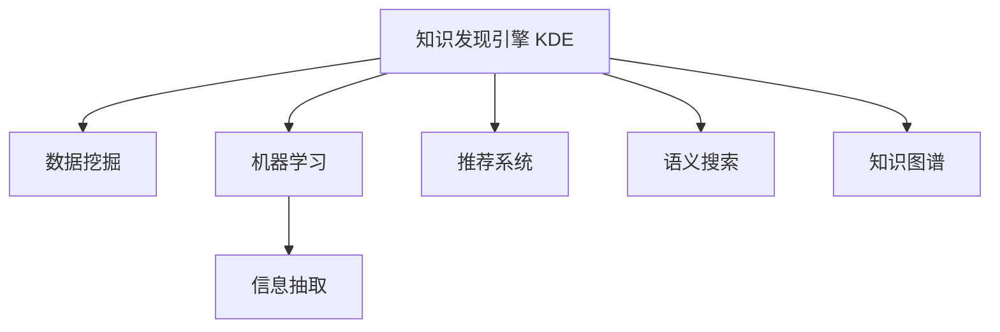

                 

## 1. 背景介绍

### 1.1 问题由来
在当今快速变化的科技环境中，软件工程师需要不断学习和适应新技术，以保持竞争力。然而，技术的更新迭代速度快、信息量大，使得程序员面临极大的知识负担和学习挑战。如何高效地发现、获取和应用知识，成为程序员成长的关键。

### 1.2 问题核心关键点
知识发现引擎(Knowledge Discovery Engine, KDE)作为解决这一问题的利器，通过对大规模数据源的分析和挖掘，帮助程序员发现并应用最新的技术、最佳实践和解决方案。关键点包括：
- **数据采集与预处理**：从多个来源采集数据，并进行清洗和整理。
- **数据分析与建模**：使用机器学习和数据挖掘技术，发现知识模式和关联。
- **知识呈现与推荐**：将发现的知识以可视化的形式呈现，并推荐给程序员。

### 1.3 问题研究意义
知识发现引擎能够显著提升程序员的学习效率，加速技能提升，缩短项目开发周期。它不仅帮助程序员及时掌握最新技术动态，还能通过数据驱动的方式，发现并解决编程中的疑难问题，优化代码质量，减少错误率。通过知识发现引擎，程序员可以更好地应对技术栈变化、项目需求变动等挑战，确保软件质量和项目成功。

## 2. 核心概念与联系

### 2.1 核心概念概述

为更好地理解知识发现引擎的核心原理和应用，本节将介绍几个关键概念：

- **知识发现引擎(KDE)**：使用数据挖掘、机器学习等技术，从海量数据中提取和发现知识模式，为决策提供支持。

- **数据挖掘(Data Mining)**：从数据中自动发现模式、规律和关联，支持数据分析和决策。

- **机器学习(Machine Learning, ML)**：利用算法和统计模型，从数据中学习和提取规律，用于预测和决策。

- **信息抽取(Information Extraction)**：从非结构化数据中提取有价值的信息，如实体识别、关系抽取等。

- **推荐系统(Recommendation System)**：通过分析用户行为，为用户推荐个性化的信息或产品。

- **语义搜索(Semantic Search)**：基于自然语言处理技术，提升搜索的准确性和相关性。

- **知识图谱(Knowledge Graph)**：构建知识节点和边的图形表示，用于知识管理和查询。

这些概念之间的逻辑关系可以通过以下Mermaid流程图来展示：



这个流程图展示了几大核心概念的相互关系：

1. 知识发现引擎利用数据挖掘、机器学习和信息抽取技术，从海量数据中提取知识。
2. 推荐系统和语义搜索用于知识呈现和推荐。
3. 知识图谱提供结构化的知识管理和查询。

这些技术共同构成了知识发现引擎的核心组件，使其能够高效地发现和呈现知识。

## 3. 核心算法原理 & 具体操作步骤
### 3.1 算法原理概述

知识发现引擎的原理可概括为数据收集、预处理、特征提取、模型训练和结果呈现几个步骤。其核心算法包括数据挖掘、机器学习和自然语言处理等技术。

**步骤1: 数据采集与预处理**
- 从软件开发论坛、代码托管平台、技术博客、论文库等渠道收集数据。
- 对数据进行清洗和标准化处理，如去除噪音、处理缺失值等。

**步骤2: 特征提取与建模**
- 利用文本挖掘和自然语言处理技术，从代码、文档、评论中提取关键特征。
- 使用机器学习算法（如决策树、随机森林、神经网络等）对提取的特征进行建模，发现数据中的知识模式和关联。

**步骤3: 结果呈现与推荐**
- 将发现的知识点以可视化的形式呈现，如知识图谱、推荐列表、摘要等。
- 使用推荐系统算法（如协同过滤、矩阵分解等）为程序员推荐个性化的知识内容。

### 3.2 算法步骤详解

**Step 1: 数据采集与预处理**
- 使用网络爬虫、API接口等方式，从GitHub、Stack Overflow、Medium、arXiv等平台采集数据。
- 对采集的数据进行预处理，包括去重、分词、词性标注、情感分析等步骤，为后续分析做准备。

**Step 2: 特征提取与建模**
- 使用Python的NLTK、SpaCy等库进行文本处理和特征提取。
- 使用Scikit-learn、TensorFlow等工具进行模型训练，发现知识模式和关联。例如，可以使用LDA主题模型进行文本分类，发现热门技术主题；或使用神经网络进行实体抽取，识别出重要组件和技术。

**Step 3: 结果呈现与推荐**
- 将发现的知识以知识图谱形式呈现，使用GraphViz等工具进行可视化。
- 利用推荐算法，如协同过滤和矩阵分解，为程序员推荐个性化的知识内容。例如，根据程序员的历史行为数据，推荐相关的技术博客、代码片段和工具库。

### 3.3 算法优缺点

知识发现引擎具有以下优点：
1. **高效性**：通过自动化的数据分析和模型训练，可以快速发现知识，减少人工干预。
2. **个性化**：根据程序员的兴趣和行为数据，推荐个性化的知识内容，提升学习效率。
3. **全面性**：从多个渠道和数据源中获取信息，保证知识发现的多样性和全面性。

但同时，知识发现引擎也存在一些局限性：
1. **数据依赖性强**：知识发现的效果高度依赖于数据的质量和数量，数据采集和处理成本较高。
2. **知识理解深度有限**：当前算法可能难以完全理解代码中的细微细节和特定场景的复杂性。
3. **误导风险**：推荐系统可能因算法偏差或数据偏差，推荐不相关或不准确的知识，影响学习效果。

### 3.4 算法应用领域

知识发现引擎已广泛应用于以下领域：

- **软件开发工具**：如GitHub、Stack Overflow等平台，通过推荐系统为用户推荐代码片段、教程和工具库。
- **技术博客与论文**：利用语义搜索技术，用户可以更高效地找到相关论文和技术博客，提升阅读效率。
- **在线学习平台**：如Coursera、Udacity等，通过推荐系统为用户推荐个性化的课程和资源，优化学习路径。
- **项目开发**：为开发团队提供技术趋势分析、问题诊断和解决方案推荐，提升项目开发效率。
- **知识图谱构建**：将发现的知识以知识图谱的形式组织和呈现，方便用户查询和应用。

## 4. 数学模型和公式 & 详细讲解
### 4.1 数学模型构建

知识发现引擎的数学模型主要包括数据挖掘、机器学习和自然语言处理等多个部分。以下以文本挖掘为例，介绍其中的核心模型。

**LDA主题模型**：
LDA（Latent Dirichlet Allocation）是一种用于文本挖掘的主题模型，可以自动发现文本中的主题分布。其数学模型如下：

设文档集 $D$ 包含 $n$ 篇文档，每篇文档 $d_i$ 由 $k$ 个词语 $w_{ij}$ 组成。假设文档和词语由隐含的主题分布生成，每个主题由一组词语生成。记主题数为 $K$，则：

- 文档主题分布 $\theta_{d_i}$，即文档 $d_i$ 中各主题的分布概率。
- 主题词语分布 $\phi_{kj}$，即主题 $k$ 中各词语的分布概率。
- 文档-主题生成概率 $p_{ik}$，即文档 $d_i$ 中包含主题 $k$ 的概率。

根据贝叶斯公式，LDA模型的条件概率分布为：

$$
p(d_i|\theta) = \prod_{k=1}^K \theta_{d_i,k}^{p_{ik}}
$$

其中 $\theta_{d_i,k}$ 为文档 $d_i$ 中包含主题 $k$ 的概率。

**随机森林**：
随机森林是一种集成学习算法，通过对多个决策树进行投票，提升分类器的准确性和鲁棒性。其数学模型如下：

设训练集为 $D=\{(x_1,y_1),(x_2,y_2),\cdots,(x_n,y_n)\}$，其中 $x_i \in R^d$ 为特征向量，$y_i \in \{0,1\}$ 为标签。随机森林由 $m$ 棵决策树组成，每棵树的训练集通过有放回的抽样得到。对于新样本 $x'$，随机森林的预测结果为：

$$
\hat{y}' = \frac{1}{m} \sum_{j=1}^m T_j(x')
$$

其中 $T_j$ 为第 $j$ 棵决策树的预测结果。

**协同过滤算法**：
协同过滤是一种基于用户和物品相似度的推荐算法，用于推荐系统。其数学模型如下：

设用户集为 $U$，物品集为 $I$，用户对物品的评分矩阵为 $R \in R^{m\times n}$，其中 $R_{ij}$ 为用户 $i$ 对物品 $j$ 的评分。假设用户 $u$ 和物品 $v$ 的相似度为 $S(u,v)$，则协同过滤算法的预测结果为：

$$
\hat{R}_{ij} = \alpha_{u,i} \sum_{k=1}^n S(v,k) R_{kj}
$$

其中 $\alpha_{u,i}$ 为用户 $u$ 对物品 $j$ 的偏好系数。

### 4.2 公式推导过程

**LDA主题模型推导**：
- 文档主题分布概率 $p(d_i|\theta) = \prod_{k=1}^K \theta_{d_i,k}^{p_{ik}}$：
  - $p_{ik}$ 为文档 $d_i$ 包含主题 $k$ 的概率。
  - $\theta_{d_i,k}$ 为文档 $d_i$ 中包含主题 $k$ 的概率。

- 主题词语分布概率 $p(w_{ij}|\theta) = \prod_{k=1}^K \phi_{kj}^{p_{ik}}$：
  - $p_{ik}$ 为文档 $d_i$ 包含主题 $k$ 的概率。
  - $\phi_{kj}$ 为主题 $k$ 中包含词语 $w_{ij}$ 的概率。

**随机森林推导**：
- 决策树的预测结果 $T_j(x')$：
  - 根据决策树对新样本 $x'$ 的预测结果 $T_j(x') = 1$ 或 $0$。
  - 随机森林的预测结果为所有决策树的投票结果。

**协同过滤推导**：
- 用户物品相似度 $S(u,v)$：
  - 计算用户 $u$ 和物品 $v$ 的相似度。
  - 使用欧氏距离、余弦相似度等方法计算相似度。

- 预测评分 $\hat{R}_{ij}$：
  - 使用用户对物品的相似度 $S(v,k)$ 和评分矩阵 $R_{kj}$ 计算预测评分。
  - 利用偏好系数 $\alpha_{u,i}$ 调整预测结果的权重。

### 4.3 案例分析与讲解

**案例1: 技术趋势分析**

使用LDA主题模型，对开源社区如GitHub的代码评论进行主题分析，发现当前热门技术主题。具体步骤如下：

1. 从GitHub收集代码评论数据，提取评论文本。
2. 使用NLTK库对评论文本进行预处理，包括分词、词性标注、去除停用词等。
3. 使用LDA主题模型对预处理后的文本进行主题分析，得到主题分布。
4. 根据主题分布，识别出当前热门技术主题，如区块链、人工智能、云计算等。

**案例2: 代码片段推荐**

使用协同过滤算法，为用户推荐常用的代码片段。具体步骤如下：

1. 从代码托管平台如GitHub收集用户提交的代码片段，提取代码信息。
2. 将代码片段标准化，提取关键特征如语言、库、框架等。
3. 使用协同过滤算法，根据用户的历史代码片段使用情况，推荐与其相似的其他代码片段。

## 5. 项目实践：代码实例和详细解释说明
### 5.1 开发环境搭建

在开始项目实践前，我们需要准备好开发环境。以下是使用Python进行PyTorch开发的环境配置流程：

1. 安装Anaconda：从官网下载并安装Anaconda，用于创建独立的Python环境。

2. 创建并激活虚拟环境：
```bash
conda create -n pytorch-env python=3.8 
conda activate pytorch-env
```

3. 安装PyTorch：根据CUDA版本，从官网获取对应的安装命令。例如：
```bash
conda install pytorch torchvision torchaudio cudatoolkit=11.1 -c pytorch -c conda-forge
```

4. 安装NLTK、SpaCy等自然语言处理库：
```bash
pip install nltk spacy
```

5. 安装Scikit-learn、TensorFlow等机器学习库：
```bash
pip install scikit-learn tensorflow
```

6. 安装GraphViz用于知识图谱可视化：
```bash
pip install graphviz
```

完成上述步骤后，即可在`pytorch-env`环境中开始项目实践。

### 5.2 源代码详细实现

这里以技术趋势分析为例，给出使用LDA主题模型进行知识发现和呈现的PyTorch代码实现。

首先，定义LDA主题模型类：

```python
from gensim.models.ldamodel import LdaModel
import gensim.corpora as corpora
import gensim.matutils as matutils
import gensim.utils as utils

class LdaTopicModel:
    def __init__(self, data, num_topics=10, id2word=None):
        self.data = data
        self.num_topics = num_topics
        self.id2word = id2word
        self.topic_model = None

    def fit(self):
        corpus = corpora.Dictionary(self.data)
        corpus = [corpus.doc2bow(text) for text in self.data]
        self.topic_model = LdaModel(corpus, self.num_topics, id2word=self.id2word)
        return self.topic_model

    def predict_topics(self, text):
        doc = self.id2word.doc2bow(text.split())
        topics = self.topic_model.get_document_topics(doc)
        return topics

# 示例数据
data = [
    "Python is a high-level programming language",
    "JavaScript is a scripting language for web development",
    "Java is an object-oriented programming language"
]
id2word = corpora.Dictionary(data)
model = LdaTopicModel(data, num_topics=2, id2word=id2word)
model.fit()
topics = model.predict_topics("Python is a popular language for data science")
print(topics)
```

接下来，使用Scikit-learn进行协同过滤推荐：

```python
from sklearn.metrics.pairwise import cosine_similarity

def recommend_similar_codes(code):
    # 代码片段集合
    codes = [
        "def function():\n  # 代码片段1",
        "import pandas as pd\n  # 代码片段2",
        "from requests import get\n  # 代码片段3"
    ]
    
    # 计算代码片段之间的相似度
    similarity_matrix = cosine_similarity([code], codes)
    
    # 选择最相似的代码片段
    top_codes = codes[similarity_matrix.argmax(axis=1)]
    
    return top_codes

# 示例代码片段
code = "def function():\n  # 代码片段1"
top_codes = recommend_similar_codes(code)
print(top_codes)
```

最后，使用GraphViz进行知识图谱可视化：

```python
import graphviz
import networkx as nx

# 构建知识图谱
G = nx.Graph()
G.add_node("Python", label="语言")
G.add_node("JavaScript", label="语言")
G.add_edge("Python", "JavaScript", label="相似")
G.add_node("Java", label="语言")
G.add_node("Web开发", label="领域")
G.add_edge("JavaScript", "Web开发", label="应用")
G.add_edge("Python", "Web开发", label="应用")

# 绘制知识图谱
dot = graphviz.Digraph()
dot.node_attr["shape"] = "box"
dot.node_attr["label"] = ["Python", "JavaScript", "Java", "Web开发"]
dot.edge_attr["label"] = ["相似", "应用"]
dot.add_nodes_from(G.nodes())
dot.add_edges_from(G.edges())
dot.render("graph.gv", format="png")
```

### 5.3 代码解读与分析

让我们再详细解读一下关键代码的实现细节：

**LdaTopicModel类**：
- `__init__`方法：初始化数据、主题数和词典。
- `fit`方法：使用LDA模型进行主题建模，得到主题分布。
- `predict_topics`方法：对新文本进行主题预测。

**recommend_similar_codes函数**：
- 使用Scikit-learn的cosine_similarity计算代码片段之间的相似度。
- 选择相似度最高的代码片段进行推荐。

**Graphviz绘制知识图谱**：
- 使用networkx构建知识图谱，包括节点和边。
- 使用Graphviz将知识图谱可视化，生成图谱文件。

代码实现的难点在于如何高效地处理大规模数据，并进行有效的特征提取和模型训练。通过合理使用机器学习和自然语言处理技术，可以将复杂问题分解为多个小任务，逐步解决。

## 6. 实际应用场景
### 6.1 软件开发工具

知识发现引擎在软件开发工具中的应用广泛，如GitHub、Stack Overflow等平台，通过推荐系统为用户推荐代码片段、教程和工具库，提升开发效率。

**案例：GitHub推荐系统**

GitHub使用协同过滤和知识图谱等技术，为用户推荐项目、代码片段和文档。具体步骤如下：

1. 从GitHub收集用户行为数据，如代码提交、评论、点赞等。
2. 使用协同过滤算法，根据用户的历史行为数据，推荐相关项目和代码片段。
3. 使用知识图谱，将用户和项目、代码片段关联起来，提供更丰富的推荐信息。

**案例：Stack Overflow问题推荐**

Stack Overflow使用语义搜索和知识图谱技术，为用户推荐相关问题。具体步骤如下：

1. 从Stack Overflow收集用户搜索行为数据，如问题、标签、评论等。
2. 使用语义搜索技术，分析用户的问题意图，找到相关问题。
3. 使用知识图谱，将问题、标签和代码片段关联起来，提供更全面的答案和代码示例。

### 6.2 技术博客与论文

知识发现引擎在技术博客与论文中的应用，如Medium、arXiv等平台，通过推荐系统和语义搜索技术，提升用户阅读体验和信息获取效率。

**案例：Medium推荐系统**

Medium使用协同过滤和LDA主题模型等技术，为用户推荐相关文章和作者。具体步骤如下：

1. 从Medium收集用户阅读行为数据，如文章、评论、点赞等。
2. 使用协同过滤算法，根据用户的历史行为数据，推荐相关文章和作者。
3. 使用LDA主题模型，对文章进行主题分析，找到热门技术主题。

**案例：arXiv论文推荐**

arXiv使用语义搜索和知识图谱技术，为研究人员推荐相关论文和作者。具体步骤如下：

1. 从arXiv收集论文和作者信息，提取摘要、关键词等特征。
2. 使用语义搜索技术，分析研究者的研究方向，找到相关论文。
3. 使用知识图谱，将论文、作者和研究方向关联起来，提供更全面的研究资料。

### 6.3 在线学习平台

知识发现引擎在在线学习平台中的应用，如Coursera、Udacity等，通过推荐系统和语义搜索技术，提升用户学习体验和知识获取效率。

**案例：Coursera课程推荐**

Coursera使用协同过滤和LDA主题模型等技术，为用户推荐相关课程和资源。具体步骤如下：

1. 从Coursera收集用户学习行为数据，如课程选择、学习时长等。
2. 使用协同过滤算法，根据用户的历史行为数据，推荐相关课程和资源。
3. 使用LDA主题模型，对课程内容进行主题分析，找到热门技术主题。

**案例：Udacity项目推荐**

Udacity使用协同过滤和知识图谱等技术，为用户推荐相关项目和课程。具体步骤如下：

1. 从Udacity收集用户学习行为数据，如项目选择、学习进度等。
2. 使用协同过滤算法，根据用户的历史行为数据，推荐相关项目和课程。
3. 使用知识图谱，将项目、课程和技能关联起来，提供更全面的学习路径。

### 6.4 项目开发

知识发现引擎在项目开发中的应用，为开发团队提供技术趋势分析、问题诊断和解决方案推荐，提升开发效率。

**案例：项目开发支持**

某软件开发公司使用知识发现引擎，为开发团队提供技术趋势分析和代码片段推荐。具体步骤如下：

1. 从公司内部和开源社区收集代码片段和文档，提取关键信息。
2. 使用LDA主题模型和协同过滤算法，分析技术趋势和代码片段相似度。
3. 将发现的知识以知识图谱形式呈现，供开发团队查询和使用。

## 7. 工具和资源推荐
### 7.1 学习资源推荐

为了帮助开发者系统掌握知识发现引擎的理论基础和实践技巧，这里推荐一些优质的学习资源：

1. 《Python数据科学手册》：介绍Python在数据科学和机器学习中的应用，包括数据处理、特征提取和模型训练。

2. 《深度学习入门》：介绍深度学习的基本概念和实现方法，包括卷积神经网络、循环神经网络和自编码器等。

3. 《数据挖掘与统计学习》：介绍数据挖掘和统计学习的基本方法和技术，包括分类、聚类、关联规则等。

4. 《机器学习实战》：通过实际项目案例，讲解机器学习的应用方法和技巧，包括决策树、随机森林和协同过滤等。

5. 《NLP实战：使用PyTorch构建自然语言处理模型》：介绍如何使用PyTorch进行自然语言处理和知识发现，包括分词、词性标注、命名实体识别等。

6. 《TensorFlow实战》：介绍TensorFlow的基本概念和实现方法，包括图构建、变量管理、模型训练等。

通过对这些资源的学习实践，相信你一定能够快速掌握知识发现引擎的理论基础和实践技巧，并用于解决实际的NLP问题。

### 7.2 开发工具推荐

高效的开发离不开优秀的工具支持。以下是几款用于知识发现引擎开发的常用工具：

1. Python：Python是知识发现引擎开发的主流语言，具有丰富的第三方库和框架，支持数据处理、特征提取和模型训练。

2. PyTorch：基于Python的开源深度学习框架，灵活动态的计算图，适合快速迭代研究。

3. TensorFlow：由Google主导开发的开源深度学习框架，生产部署方便，适合大规模工程应用。

4. Scikit-learn：开源的Python机器学习库，提供了丰富的数据挖掘和机器学习算法。

5. NLTK：自然语言处理工具包，支持分词、词性标注、情感分析等。

6. SpaCy：自然语言处理工具包，支持实体识别、依存句法分析等。

7. Graphviz：用于知识图谱可视化的工具，支持多种图表类型和布局。

合理利用这些工具，可以显著提升知识发现引擎的开发效率，加快创新迭代的步伐。

### 7.3 相关论文推荐

知识发现引擎的研究始于学界的持续研究。以下是几篇奠基性的相关论文，推荐阅读：

1. "Latent Dirichlet Allocation"：LDA主题模型的提出，开创了文本挖掘和主题分析的新篇章。

2. "Random Forests"：随机森林算法的提出，提升了集成学习的准确性和鲁棒性。

3. "Collaborative Filtering"：协同过滤算法的提出，为推荐系统提供了基本思路。

4. "Learning to Recommend"：利用神经网络进行推荐，推动了推荐系统向深度学习方向发展。

5. "Knowledge Discovery and Data Mining: Parallel and Distributed Approaches"：介绍知识发现和数据挖掘的最新研究成果，涵盖多个前沿方向。

这些论文代表了大语言模型微调技术的发展脉络。通过学习这些前沿成果，可以帮助研究者把握学科前进方向，激发更多的创新灵感。

## 8. 总结：未来发展趋势与挑战

### 8.1 总结

本文对知识发现引擎的核心原理和应用实践进行了全面系统的介绍。首先阐述了知识发现引擎在程序员成长中的重要性，明确了其在发现、获取和应用知识方面的独特价值。其次，从原理到实践，详细讲解了知识发现引擎的数学模型和关键算法，给出了知识发现和呈现的完整代码实例。同时，本文还探讨了知识发现引擎在软件开发工具、技术博客、在线学习平台和项目开发等多个领域的应用前景，展示了其在实际应用中的广泛价值。最后，本文精选了知识发现引擎的学习资源、开发工具和相关论文，力求为读者提供全方位的技术指引。

通过本文的系统梳理，可以看到，知识发现引擎在大规模数据处理和知识发现方面展现了强大的能力，能够显著提升程序员的学习效率和技能水平。未来，随着技术的不断进步和应用的深入拓展，知识发现引擎必将在更多领域发挥更大的作用，助力程序员实现持续成长和职业提升。

### 8.2 未来发展趋势

展望未来，知识发现引擎将呈现以下几个发展趋势：

1. **大规模数据处理能力提升**：随着硬件计算能力的提升和大数据技术的不断发展，知识发现引擎能够处理更大规模的数据集，发现更丰富的知识模式。

2. **个性化推荐优化**：利用深度学习技术，优化协同过滤算法，提高推荐系统的准确性和多样性，提升用户的学习体验。

3. **多模态数据融合**：将文本、图像、视频等多模态数据进行融合分析，提升知识发现的全面性和准确性。

4. **知识图谱的深度应用**：构建更加复杂和丰富的知识图谱，提供更高效的知识查询和应用服务。

5. **跨领域知识整合**：将不同领域的知识进行整合，构建通用的知识库，提升知识发现的应用范围。

6. **智能化决策支持**：结合自然语言处理和因果推理技术，提升知识发现引擎的智能化水平，辅助决策支持。

以上趋势凸显了知识发现引擎的广阔前景，为程序员的知识发现和应用提供了更多可能性。这些方向的探索发展，必将进一步提升程序员的学习效率和技能水平，助力其在快速变化的科技环境中持续成长。

### 8.3 面临的挑战

尽管知识发现引擎已取得了显著进展，但在迈向更加智能化、普适化应用的过程中，仍面临诸多挑战：

1. **数据采集与处理成本高**：大规模数据采集和处理需要大量的计算资源和时间成本，限制了知识发现的效率。

2. **算法复杂度高**：知识发现算法通常需要复杂的计算过程，难以实时处理大规模数据。

3. **知识理解深度有限**：当前的算法可能难以完全理解代码中的细微细节和特定场景的复杂性，影响知识发现的效果。

4. **误导风险**：推荐系统可能因算法偏差或数据偏差，推荐不相关或不准确的知识，影响学习效果。

5. **可解释性不足**：知识发现引擎的决策过程通常缺乏可解释性，难以对其推理逻辑进行分析和调试。

6. **安全性和隐私保护**：在处理用户数据时，需要严格遵守数据隐私保护法规，避免数据泄露和滥用。

正视知识发现引擎面临的这些挑战，积极应对并寻求突破，将是大语言模型微调走向成熟的必由之路。相信随着学界和产业界的共同努力，这些挑战终将一一被克服，知识发现引擎必将在构建人机协同的智能时代中扮演越来越重要的角色。

### 8.4 研究展望

未来，知识发现引擎的研究方向将包括以下几个方面：

1. **无监督学习和半监督学习**：探索无监督和半监督学习方法，摆脱对大规模标注数据的依赖，利用更多非结构化数据进行知识发现。

2. **跨领域知识迁移**：研究跨领域知识迁移的方法，提升知识发现引擎在不同领域的应用效果。

3. **知识图谱与语义搜索**：结合知识图谱和语义搜索技术，提升知识发现的全面性和准确性，提供更高效的知识查询和应用服务。

4. **数据隐私保护**：研究数据隐私保护技术，保障用户数据的安全性和隐私性，避免数据泄露和滥用。

5. **可解释性与透明性**：提高知识发现引擎的决策可解释性和透明性，增强模型的可信度和可控性。

6. **多模态数据融合**：研究多模态数据的融合分析方法，提升知识发现的全面性和多样性。

这些研究方向将推动知识发现引擎技术的不断进步，为程序员的知识发现和应用提供更多高效、可靠的工具和解决方案。通过多学科的交叉融合，知识发现引擎必将在构建智能化的学习和发展环境中发挥更大的作用，助力程序员实现持续成长和职业提升。

## 9. 附录：常见问题与解答

**Q1：知识发现引擎如何提高程序员的学习效率？**

A: 知识发现引擎通过自动化地从大规模数据中提取和发现知识，帮助程序员快速获取最新的技术动态和最佳实践。它可以根据程序员的学习兴趣和行为数据，推荐个性化的学习资源和代码片段，优化学习路径，提升学习效率。

**Q2：如何选择合适的知识发现引擎算法？**

A: 选择合适的算法需要考虑多个因素，如数据规模、任务类型、性能要求等。常用的算法包括LDA主题模型、协同过滤、随机森林等。对于大规模数据，建议使用分布式计算技术，如Spark、Hadoop等，提高处理效率。

**Q3：知识发现引擎在数据隐私保护方面有哪些措施？**

A: 知识发现引擎在处理用户数据时，需要严格遵守数据隐私保护法规，如GDPR、CCPA等。常用的措施包括数据匿名化、差分隐私、数据加密等，确保用户数据的安全性和隐私性。

**Q4：知识发现引擎在实际应用中需要注意哪些问题？**

A: 知识发现引擎在实际应用中，需要注意数据采集与处理成本高、算法复杂度高、知识理解深度有限、误导风险等问题。解决这些问题需要结合实际应用场景，选择合适的算法和工具，优化系统性能和安全性。

**Q5：知识发现引擎的开发和部署流程有哪些步骤？**

A: 知识发现引擎的开发和部署流程包括以下几个步骤：数据采集与预处理、特征提取与建模、结果呈现与推荐、系统集成与部署。每个步骤需要细致的设计和实现，确保系统高效、稳定、安全地运行。

通过合理使用知识发现引擎，程序员可以更高效地获取知识和应用技术，提升开发效率和学习效果。未来，随着技术的不断进步和应用的深入拓展，知识发现引擎必将在更多领域发挥更大的作用，助力程序员实现持续成长和职业提升。

