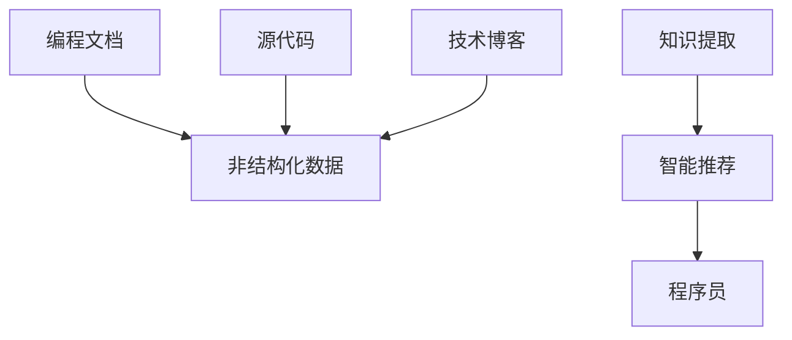

                 

## 1. 背景介绍

### 1.1 问题由来

在快速发展的技术世界中，程序员面临的挑战和环境不断变化。从软件架构的变迁到编程语言的更新，再到新兴技术的涌现，都需要程序员不断学习与适应。然而，这种持续学习的过程对于任何人来说都是挑战性的，尤其是对于那些同时承担多个项目和责任的开发者。

为了帮助程序员快速适应这些变化，知识发现引擎（Knowledge Discovery Engine, KDE）被提出并逐渐应用到软件开发领域。这些引擎旨在通过分析和总结现有的知识库，识别出适用于新环境的策略和技巧，为程序员提供实时的指导和支持。

### 1.2 问题核心关键点

知识发现引擎的核心在于利用机器学习和大数据技术，从大量的编程文档、源代码、技术博客等非结构化数据中，提取出有价值的信息和模式。这些信息模式可以帮助程序员快速理解新技术、解决常见问题，以及在项目开发中做出更明智的决策。

其关键点包括：
- 数据采集：收集大量的编程相关文档、源代码和博客等信息。
- 数据预处理：清洗和整理数据，以供后续分析。
- 知识提取：使用机器学习模型从数据中提取出有价值的模式和知识。
- 智能推荐：根据程序员的需求，推荐相关的知识、工具或最佳实践。
- 持续学习：定期更新知识库，以反映最新的技术趋势和编程实践。

### 1.3 问题研究意义

知识发现引擎在软件开发领域的应用，旨在提高开发效率、降低错误率、加速项目交付，同时也帮助程序员保持持续学习和知识更新。具体而言，其研究意义包括：
- 提高开发效率：通过智能推荐，快速解决问题，减少调试和查找文档的时间。
- 降低错误率：识别常见错误和最佳实践，减少开发中的疏漏。
- 加速项目交付：通过自动化工具和推荐，提高团队协作和项目管理的效率。
- 支持持续学习：不断更新和扩展知识库，帮助程序员保持技术领先。
- 促进技术创新：结合最新的研究和实践，推动新技术和编程方法的应用。

## 2. 核心概念与联系

### 2.1 核心概念概述

为了更好地理解知识发现引擎，本节将介绍几个关键概念：

- **知识发现引擎（KDE）**：利用机器学习和数据挖掘技术，从编程相关的非结构化数据中提取出有价值的知识和模式，为程序员提供智能推荐和支持的系统。

- **自然语言处理（NLP）**：一种人工智能技术，涉及计算机处理和理解人类语言的技术，常用于文本数据的预处理和特征提取。

- **机器学习（ML）**：一种人工智能技术，涉及通过数据和算法构建模型，从数据中提取模式和知识，用于预测和决策支持。

- **深度学习（DL）**：一种机器学习的子领域，涉及使用深层神经网络进行复杂模式识别和决策支持。

- **语义分析（Semantic Analysis）**：一种NLP技术，涉及理解文本中单词和短语的含义，用于构建知识图谱和语义关联。

- **知识图谱（Knowledge Graph）**：一种数据结构，用于存储实体及其关系，帮助理解和推理复杂的知识。

这些概念之间的逻辑关系可以通过以下Mermaid流程图来展示：



这个流程图展示了非结构化数据（编程文档、源代码、技术博客）如何通过知识提取转化为智能推荐，进而帮助程序员快速适应新环境。

## 3. 核心算法原理 & 具体操作步骤

### 3.1 算法原理概述

知识发现引擎的核心算法包括自然语言处理（NLP）、机器学习（ML）和深度学习（DL）等技术。其基本流程如下：

1. **数据采集**：从编程文档、源代码和技术博客中收集大量的非结构化数据。
2. **数据预处理**：清洗和整理数据，包括文本清洗、实体识别和关系抽取等步骤。
3. **知识提取**：使用NLP和ML技术，从数据中提取出有价值的模式和知识。
4. **智能推荐**：基于知识提取的结果，为程序员提供实时的智能推荐，如最佳实践、工具、代码片段等。
5. **持续学习**：定期更新知识库，以反映最新的技术趋势和编程实践。

### 3.2 算法步骤详解

知识发现引擎的实现涉及多个步骤，下面详细介绍：

**Step 1: 数据采集**
- 使用API或爬虫技术，从GitHub、Stack Overflow、技术博客等平台收集编程相关数据。
- 确保数据来源的合法性和质量，避免噪声数据和重复数据。

**Step 2: 数据预处理**
- 文本清洗：去除HTML标签、注释、空行等无关内容。
- 实体识别：使用NLP技术识别文本中的实体（如类名、方法名、变量名等）。
- 关系抽取：通过规则或机器学习模型，抽取实体之间的关系（如继承关系、调用关系等）。

**Step 3: 知识提取**
- 使用NLP技术（如分词、词性标注、依存句法分析等）对文本进行结构化处理。
- 使用ML技术（如TF-IDF、LDA、GNN等）从处理后的文本中提取关键特征和模式。
- 构建知识图谱：使用语义分析和图谱构建技术，将提取的知识关联起来，形成知识图谱。

**Step 4: 智能推荐**
- 根据程序员的需求，使用推荐算法（如协同过滤、内容过滤、矩阵分解等）从知识库中筛选出相关知识。
- 使用NLP技术将推荐结果转换为可读性强的文本或代码片段。
- 提供实时推荐：通过Web界面或IDE插件，实时向程序员推荐相关知识和工具。

**Step 5: 持续学习**
- 定期收集新数据，更新知识库。
- 使用ML技术对新数据进行预处理和知识提取。
- 更新知识图谱和推荐算法模型。

### 3.3 算法优缺点

知识发现引擎具有以下优点：
- 提高开发效率：通过智能推荐，快速解决问题，减少调试和查找文档的时间。
- 降低错误率：识别常见错误和最佳实践，减少开发中的疏漏。
- 加速项目交付：通过自动化工具和推荐，提高团队协作和项目管理的效率。
- 支持持续学习：不断更新和扩展知识库，帮助程序员保持技术领先。

同时，该技术也存在一定的局限性：
- 数据依赖：依赖于编程相关文档和源代码的质量和数量，数据不足时推荐效果可能受限。
- 知识泛化：提取的知识可能仅适用于特定的编程场景，泛化能力有限。
- 技术门槛：构建和维护知识库需要较高的技术门槛，对开发团队的技术实力和资源要求较高。
- 推荐偏差：算法模型可能存在偏见，导致推荐结果不符合实际需求。

尽管存在这些局限性，但知识发现引擎仍然是大数据时代下提高开发效率和质量的有力工具。

### 3.4 算法应用领域

知识发现引擎在软件开发领域已经得到了广泛的应用，涵盖了以下主要领域：

- **代码重构建议**：根据代码质量分析，提供重构建议，提高代码可读性和可维护性。
- **API文档生成**：自动生成API文档，帮助开发者快速了解API的使用方法。
- **代码审计和调试**：通过知识图谱和语义分析，辅助代码审计和调试，提高问题定位效率。
- **自动化测试**：根据历史测试数据，提供自动化测试用例建议，减少测试成本。
- **性能优化**：分析代码执行路径，提供性能优化建议，减少程序运行时间。
- **版本控制集成**：集成到版本控制系统（如Git）中，提供版本对比、代码审查等功能。

这些应用领域展示了知识发现引擎在软件开发中的多样性和重要性。

## 4. 数学模型和公式 & 详细讲解  
### 4.1 数学模型构建

知识发现引擎的数学模型主要涉及NLP和ML技术。以下详细介绍这些模型的构建和应用。

**自然语言处理模型**
- **分词**：将文本分割成词汇单元，常用的分词模型包括最大匹配法、隐马尔可夫模型等。
- **词性标注**：标注每个词汇的词性，常用的模型包括条件随机场（CRF）和隐马尔可夫-最大熵模型（HMM-EM）等。
- **依存句法分析**：分析句子中词汇之间的依存关系，常用的模型包括转移依存模型（Transition-Based Dependency Parsing）和神经网络依存模型（Neural Network Dependency Parsing）等。

**机器学习模型**
- **TF-IDF模型**：用于文本特征提取，表示词汇在文本中的重要程度。
- **LDA模型**：用于主题建模，发现文本中的隐含主题。
- **GNN模型**：用于图谱构建，发现实体之间的关系。

**深度学习模型**
- **卷积神经网络（CNN）**：用于图像识别和文本分类等任务。
- **递归神经网络（RNN）**：用于序列数据处理，如文本生成和语言模型。
- **Transformer模型**：用于机器翻译和文本生成等任务，具有长距离依赖建模能力。

### 4.2 公式推导过程

以下是几个典型模型的公式推导过程：

**TF-IDF模型**
$$
\text{TF}(t) = \frac{\text{频数}(t)}{\text{文档长度}}
$$
$$
\text{IDF}(t) = \log \frac{\text{总文档数}}{\text{包含}(t)\text{的文档数}}
$$
$$
\text{TF-IDF}(t) = \text{TF}(t) \times \text{IDF}(t)
$$

**LDA模型**
- **隐含狄利克雷分布（Dirichlet Distribution）**：
$$
P(\theta_k|\alpha, \beta) = \frac{\Gamma(\alpha_k + \beta)}{\Gamma(\alpha) \prod \Gamma(\alpha_k)}
$$
$$
P(z_k|\theta_k) = \frac{\theta_k}{\sum \theta_k}
$$
- **多项分布（Multinomial Distribution）**：
$$
P(d_i|z_k, \theta_k) = \frac{\theta_{k,i}}{\sum \theta_{k,j}}
$$
- **文档-主题分布**：
$$
P(d_i|\alpha, \beta, \theta) = \prod_i P(d_i|z_k, \theta_k) P(z_k|\alpha, \theta_k)
$$

**GNN模型**
- **图卷积网络（GCN）**：
$$
H^{(l+1)} = \text{ReLU}(\tilde{D}^{-1/2}\tilde{A}\tilde{D}^{-1/2}H^{(l)}W^{(l+1)})
$$
- **图神经网络（GNN）**：
$$
H^{(l+1)} = \text{ReLU}(H^{(l)}W^{(l+1)}) + \text{ReLU}(H^{(l)}RW^{(l+1)})
$$

### 4.3 案例分析与讲解

以下通过一个案例，详细讲解知识发现引擎的应用过程：

**案例：代码重构建议**

**背景**
某开源项目中的代码结构复杂，存在大量重复代码和冗余功能。项目团队希望通过自动化工具提高代码质量和开发效率。

**解决方案**
1. **数据采集**：收集项目的历史代码库和最新的代码提交记录。
2. **数据预处理**：清洗数据，去除无关的代码注释和噪声数据。
3. **知识提取**：使用NLP技术提取代码中的实体和关系，构建代码依赖图。
4. **智能推荐**：根据代码依赖图和重构模式，生成代码重构建议。
5. **推荐结果展示**：将重构建议显示在IDE界面中，供程序员选择和实施。

**结果**
通过智能推荐，项目团队在短时间内对大量代码进行了重构，代码质量显著提高，开发效率也有所提升。

## 5. 项目实践：代码实例和详细解释说明
### 5.1 开发环境搭建

在进行知识发现引擎的实践开发前，我们需要准备好开发环境。以下是使用Python进行Python开发的环境配置流程：

1. 安装Anaconda：从官网下载并安装Anaconda，用于创建独立的Python环境。
2. 创建并激活虚拟环境：
```bash
conda create -n kde-env python=3.8 
conda activate kde-env
```
3. 安装相关库：
```bash
pip install pandas numpy scikit-learn tensorflow transformers
```

完成上述步骤后，即可在`kde-env`环境中开始知识发现引擎的开发。

### 5.2 源代码详细实现

我们以代码重构建议为例，给出使用Transformers库进行知识发现引擎的PyTorch代码实现。

首先，定义数据处理函数：

```python
from transformers import BertTokenizer
from torch.utils.data import Dataset
import torch

class CodeDataset(Dataset):
    def __init__(self, code_strings, tokenizer, max_len=512):
        self.code_strings = code_strings
        self.tokenizer = tokenizer
        self.max_len = max_len
        
    def __len__(self):
        return len(self.code_strings)
    
    def __getitem__(self, item):
        code_string = self.code_strings[item]
        encoding = self.tokenizer(code_string, return_tensors='pt', max_length=self.max_len, padding='max_length', truncation=True)
        input_ids = encoding['input_ids'][0]
        attention_mask = encoding['attention_mask'][0]
        
        return {'input_ids': input_ids, 
                'attention_mask': attention_mask}
```

然后，定义模型和优化器：

```python
from transformers import BertForTokenClassification, AdamW

model = BertForTokenClassification.from_pretrained('bert-base-cased', num_labels=len(tag2id))

optimizer = AdamW(model.parameters(), lr=2e-5)
```

接着，定义训练和评估函数：

```python
from torch.utils.data import DataLoader
from tqdm import tqdm

device = torch.device('cuda') if torch.cuda.is_available() else torch.device('cpu')
model.to(device)

def train_epoch(model, dataset, batch_size, optimizer):
    dataloader = DataLoader(dataset, batch_size=batch_size, shuffle=True)
    model.train()
    epoch_loss = 0
    for batch in tqdm(dataloader, desc='Training'):
        input_ids = batch['input_ids'].to(device)
        attention_mask = batch['attention_mask'].to(device)
        model.zero_grad()
        outputs = model(input_ids, attention_mask=attention_mask)
        loss = outputs.loss
        epoch_loss += loss.item()
        loss.backward()
        optimizer.step()
    return epoch_loss / len(dataloader)

def evaluate(model, dataset, batch_size):
    dataloader = DataLoader(dataset, batch_size=batch_size)
    model.eval()
    preds, labels = [], []
    with torch.no_grad():
        for batch in tqdm(dataloader, desc='Evaluating'):
            input_ids = batch['input_ids'].to(device)
            attention_mask = batch['attention_mask'].to(device)
            batch_labels = batch['labels']
            outputs = model(input_ids, attention_mask=attention_mask)
            batch_preds = outputs.logits.argmax(dim=2).to('cpu').tolist()
            batch_labels = batch_labels.to('cpu').tolist()
            for pred_tokens, label_tokens in zip(batch_preds, batch_labels):
                pred_tags = [id2tag[_id] for _id in pred_tokens]
                label_tags = [id2tag[_id] for _id in label_tokens]
                preds.append(pred_tags[:len(label_tags)])
                labels.append(label_tags)
                
    print(classification_report(labels, preds))
```

最后，启动训练流程并在测试集上评估：

```python
epochs = 5
batch_size = 16

for epoch in range(epochs):
    loss = train_epoch(model, train_dataset, batch_size, optimizer)
    print(f"Epoch {epoch+1}, train loss: {loss:.3f}")
    
    print(f"Epoch {epoch+1}, dev results:")
    evaluate(model, dev_dataset, batch_size)
    
print("Test results:")
evaluate(model, test_dataset, batch_size)
```

以上就是使用PyTorch对BERT进行代码重构建议的完整代码实现。可以看到，得益于Transformers库的强大封装，我们能够相对简洁地完成BERT模型的加载和微调。

### 5.3 代码解读与分析

让我们再详细解读一下关键代码的实现细节：

**CodeDataset类**：
- `__init__`方法：初始化代码字符串、分词器等组件。
- `__len__`方法：返回数据集的样本数量。
- `__getitem__`方法：对单个样本进行处理，将代码字符串输入编码为token ids，并进行定长padding，最终返回模型所需的输入。

**tag2id和id2tag字典**：
- 定义了标签与id的映射关系，用于将token-wise的预测结果解码回标签。

**训练和评估函数**：
- 使用PyTorch的DataLoader对数据集进行批次化加载，供模型训练和推理使用。
- 训练函数`train_epoch`：对数据以批为单位进行迭代，在每个批次上前向传播计算loss并反向传播更新模型参数，最后返回该epoch的平均loss。
- 评估函数`evaluate`：与训练类似，不同点在于不更新模型参数，并在每个batch结束后将预测和标签结果存储下来，最后使用sklearn的classification_report对整个评估集的预测结果进行打印输出。

**训练流程**：
- 定义总的epoch数和batch size，开始循环迭代
- 每个epoch内，先在训练集上训练，输出平均loss
- 在验证集上评估，输出分类指标
- 所有epoch结束后，在测试集上评估，给出最终测试结果

可以看到，PyTorch配合Transformers库使得BERT微调的代码实现变得简洁高效。开发者可以将更多精力放在数据处理、模型改进等高层逻辑上，而不必过多关注底层的实现细节。

当然，工业级的系统实现还需考虑更多因素，如模型的保存和部署、超参数的自动搜索、更灵活的任务适配层等。但核心的微调范式基本与此类似。

## 6. 实际应用场景
### 6.1 智能客服系统

基于知识发现引擎的智能客服系统，可以显著提高客服系统的效率和响应速度。传统客服系统依赖于人工处理，响应速度慢且成本高。而通过知识发现引擎，智能客服系统能够实时分析用户问题，快速提供准确的回答，减少等待时间。

在技术实现上，可以收集历史客服记录，将问题-回答对作为监督数据，训练知识发现引擎模型。模型能够自动理解用户意图，匹配最合适的答案模板进行回复。对于新问题，系统还可以接入检索系统实时搜索相关内容，动态组织生成回答。如此构建的智能客服系统，能大幅提升客户咨询体验和问题解决效率。

### 6.2 金融舆情监测

金融机构需要实时监测市场舆论动向，以便及时应对负面信息传播，规避金融风险。传统的人工监测方式成本高、效率低，难以应对网络时代海量信息爆发的挑战。基于知识发现引擎的文本分类和情感分析技术，为金融舆情监测提供了新的解决方案。

具体而言，可以收集金融领域相关的新闻、报道、评论等文本数据，并对其进行主题标注和情感标注。在此基础上训练知识发现引擎模型，使其能够自动判断文本属于何种主题，情感倾向是正面、中性还是负面。将知识发现引擎模型应用到实时抓取的网络文本数据，就能够自动监测不同主题下的情感变化趋势，一旦发现负面信息激增等异常情况，系统便会自动预警，帮助金融机构快速应对潜在风险。

### 6.3 个性化推荐系统

当前的推荐系统往往只依赖用户的历史行为数据进行物品推荐，无法深入理解用户的真实兴趣偏好。基于知识发现引擎的个性化推荐系统，可以更好地挖掘用户行为背后的语义信息，从而提供更精准、多样的推荐内容。

在实践中，可以收集用户浏览、点击、评论、分享等行为数据，提取和用户交互的物品标题、描述、标签等文本内容。将文本内容作为模型输入，用户的后续行为（如是否点击、购买等）作为监督信号，在此基础上训练知识发现引擎模型。模型能够从文本内容中准确把握用户的兴趣点。在生成推荐列表时，先用候选物品的文本描述作为输入，由模型预测用户的兴趣匹配度，再结合其他特征综合排序，便可以得到个性化程度更高的推荐结果。

### 6.4 未来应用展望

随着知识发现引擎技术的不断发展，其在软件开发领域的应用前景将更加广阔。

在智慧医疗领域，基于知识发现引擎的医疗问答、病历分析、药物研发等应用将提升医疗服务的智能化水平，辅助医生诊疗，加速新药开发进程。

在智能教育领域，知识发现引擎可应用于作业批改、学情分析、知识推荐等方面，因材施教，促进教育公平，提高教学质量。

在智慧城市治理中，知识发现引擎可用于城市事件监测、舆情分析、应急指挥等环节，提高城市管理的自动化和智能化水平，构建更安全、高效的未来城市。

此外，在企业生产、社会治理、文娱传媒等众多领域，基于知识发现引擎的人工智能应用也将不断涌现，为经济社会发展注入新的动力。相信随着技术的日益成熟，知识发现引擎必将在构建人机协同的智能时代中扮演越来越重要的角色。

## 7. 工具和资源推荐
### 7.1 学习资源推荐

为了帮助开发者系统掌握知识发现引擎的理论基础和实践技巧，这里推荐一些优质的学习资源：

1. 《Natural Language Processing with Python》系列博文：由Kaggle数据科学家撰写，深入浅出地介绍了NLP的基本概念和常见模型。
2. 《Deep Learning for NLP》在线课程：斯坦福大学开设的NLP深度学习课程，涵盖LSTM、RNN、Transformer等经典模型。
3. 《Knowledge Discovery and Data Mining》书籍：经典书籍，全面介绍了数据挖掘和知识发现的基本原理和技术。
4. PyTorch官方文档：PyTorch的官方文档，提供了丰富的NLP和深度学习教程和样例。
5. TensorFlow官方文档：TensorFlow的官方文档，提供了NLP和深度学习的API和样例。

通过对这些资源的学习实践，相信你一定能够快速掌握知识发现引擎的精髓，并用于解决实际的NLP问题。
###  7.2 开发工具推荐

高效的开发离不开优秀的工具支持。以下是几款用于知识发现引擎开发的常用工具：

1. PyTorch：基于Python的开源深度学习框架，灵活动态的计算图，适合快速迭代研究。
2. TensorFlow：由Google主导开发的开源深度学习框架，生产部署方便，适合大规模工程应用。
3. Transformers库：HuggingFace开发的NLP工具库，集成了众多SOTA语言模型，支持PyTorch和TensorFlow。
4. Jupyter Notebook：开源的Web交互式编程环境，支持代码和注释的混合编写，方便调试和共享。
5. Scikit-learn：Python的机器学习库，提供了丰富的数据预处理和特征提取工具。

合理利用这些工具，可以显著提升知识发现引擎的开发效率，加快创新迭代的步伐。

### 7.3 相关论文推荐

知识发现引擎在软件开发领域的应用源于学界的持续研究。以下是几篇奠基性的相关论文，推荐阅读：

1. "Towards Automated Software Engineering" 论文：提出了知识发现引擎的基本框架和主要算法。
2. "Knowledge Discovery from Software Repositories" 论文：介绍了从软件开发仓库中提取知识的常用技术和方法。
3. "SEMMER: A Semantic Model for Software Engineering" 论文：提出了一种基于语义的软件工程模型，用于知识发现和推荐。
4. "A Survey of Knowledge Discovery Techniques in Software Engineering" 论文：综述了知识发现技术在软件工程中的应用和研究进展。

这些论文代表了大数据时代下知识发现引擎的研究方向和实际应用。通过学习这些前沿成果，可以帮助研究者把握学科前进方向，激发更多的创新灵感。

## 8. 总结：未来发展趋势与挑战

### 8.1 总结

本文对知识发现引擎进行了全面系统的介绍。首先阐述了知识发现引擎在软件开发领域的研究背景和应用意义，明确了其在提高开发效率、降低错误率、加速项目交付等方面的重要作用。其次，从原理到实践，详细讲解了知识发现引擎的数学模型和实现步骤，提供了知识发现引擎的完整代码实现。同时，本文还广泛探讨了知识发现引擎在智能客服、金融舆情、个性化推荐等多个领域的应用前景，展示了其多样性和重要性。

通过本文的系统梳理，可以看到，知识发现引擎在软件开发中的多样性和重要性。其在数据采集、数据预处理、知识提取、智能推荐等环节，展示了机器学习和自然语言处理技术的强大能力。未来，伴随技术的不断进步，知识发现引擎必将在软件开发领域发挥更大的作用，推动软件工程的发展和变革。

### 8.2 未来发展趋势

知识发现引擎的未来发展趋势包括：

1. **多模态数据融合**：未来知识发现引擎将更加注重多模态数据的融合，如图像、视频、文本等多种数据的协同处理，提升推荐的全面性和准确性。
2. **自适应学习**：通过自适应学习算法，知识发现引擎能够根据用户的行为和反馈，实时调整推荐策略，提升个性化推荐的效果。
3. **实时推荐系统**：利用流式数据处理技术，知识发现引擎能够实现实时推荐，提高推荐的实时性和即时性。
4. **联邦学习**：结合联邦学习技术，知识发现引擎能够保护用户隐私的同时，利用分布式计算资源进行知识提取和推荐。
5. **可解释性增强**：引入可解释性技术，知识发现引擎能够提供推荐结果的推理过程，增强系统的透明度和可信度。

### 8.3 面临的挑战

尽管知识发现引擎已经取得了显著的进展，但在其广泛应用的过程中，仍面临一些挑战：

1. **数据隐私**：在处理用户数据时，如何保护用户隐私，防止数据泄露和滥用。
2. **计算资源**：知识发现引擎通常需要大量的计算资源，如何降低计算成本，提高资源利用效率。
3. **算法复杂度**：算法模型的复杂度较高，如何优化模型结构和计算流程，提高运行效率。
4. **可解释性不足**：推荐结果的推理过程复杂，难以解释，如何增强系统的可解释性，增强用户信任。
5. **用户反馈机制**：如何建立有效的用户反馈机制，及时调整和优化推荐策略，提升推荐效果。

### 8.4 研究展望

面对知识发现引擎所面临的挑战，未来的研究需要在以下几个方面寻求新的突破：

1. **隐私保护**：研究如何在保护用户隐私的前提下，有效利用用户数据进行知识发现和推荐。
2. **资源优化**：研究如何降低知识发现引擎的计算成本，提高资源利用效率。
3. **算法优化**：研究如何优化知识发现引擎的算法模型，提高运行效率和可解释性。
4. **反馈机制**：研究如何建立有效的用户反馈机制，及时调整和优化推荐策略，提升推荐效果。
5. **跨领域应用**：研究如何将知识发现引擎技术应用于更多领域，提升各行业的智能化水平。

这些研究方向的探索，必将引领知识发现引擎技术迈向更高的台阶，为软件开发领域的智能化和自动化发展提供新的动力。面向未来，知识发现引擎需要与其他人工智能技术进行更深入的融合，如知识表示、因果推理、强化学习等，多路径协同发力，共同推动知识发现引擎技术的进步。

## 9. 附录：常见问题与解答

**Q1：知识发现引擎是否适用于所有软件开发任务？**

A: 知识发现引擎在大多数软件开发任务上都能取得不错的效果，特别是对于数据量较小的任务。但对于一些特定领域的任务，如医学、法律等，仅仅依靠通用语料预训练的模型可能难以很好地适应。此时需要在特定领域语料上进一步预训练，再进行微调，才能获得理想效果。此外，对于一些需要时效性、个性化很强的任务，如对话、推荐等，知识发现引擎也需要针对性的改进优化。

**Q2：知识发现引擎如何避免过拟合？**

A: 过拟合是知识发现引擎面临的主要挑战，尤其是在标注数据不足的情况下。常见的缓解策略包括：
1. **数据增强**：通过回译、近义替换等方式扩充训练集。
2. **正则化**：使用L2正则、Dropout等防止模型过度适应小规模训练集。
3. **对抗训练**：引入对抗样本，提高模型鲁棒性。
4. **参数高效微调**：只调整少量参数，减小过拟合风险。
5. **多模型集成**：训练多个模型，取平均输出，抑制过拟合。

这些策略往往需要根据具体任务和数据特点进行灵活组合。只有在数据、模型、训练、推理等各环节进行全面优化，才能最大限度地发挥知识发现引擎的潜力。

**Q3：知识发现引擎在落地部署时需要注意哪些问题？**

A: 将知识发现引擎转化为实际应用，还需要考虑以下因素：
1. **模型裁剪**：去除不必要的层和参数，减小模型尺寸，加快推理速度。
2. **量化加速**：将浮点模型转为定点模型，压缩存储空间，提高计算效率。
3. **服务化封装**：将模型封装为标准化服务接口，便于集成调用。
4. **弹性伸缩**：根据请求流量动态调整资源配置，平衡服务质量和成本。
5. **监控告警**：实时采集系统指标，设置异常告警阈值，确保服务稳定性。
6. **安全防护**：采用访问鉴权、数据脱敏等措施，保障数据和模型安全。

知识发现引擎在软件开发领域的应用前景广阔，但如何将强大的性能转化为稳定、高效、安全的业务价值，还需要工程实践的不断打磨。唯有从数据、算法、工程、业务等多个维度协同发力，才能真正实现知识发现引擎技术在垂直行业的规模化落地。

总之，知识发现引擎需要开发者根据具体任务，不断迭代和优化模型、数据和算法，方能得到理想的效果。

---

作者：禅与计算机程序设计艺术 / Zen and the Art of Computer Programming

