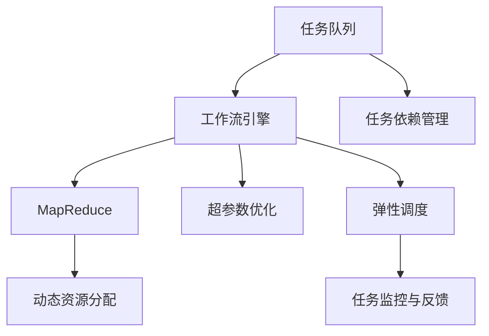

                 

# 知识发现引擎的分布式任务调度系统

> 关键词：知识发现引擎, 分布式任务调度, MapReduce, 任务队列, 工作流引擎, 超参数优化, 动态资源分配, 弹性调度

## 1. 背景介绍

### 1.1 问题由来
随着大数据时代的到来，数据量呈指数级增长，数据挖掘和知识发现的重要性日益凸显。知识发现引擎(Knowledge Discovery Engine, KDE)作为数据挖掘的核心组件，其性能直接影响着数据价值的最大化。KDE需要处理海量的数据集，并从中提取有用知识，帮助企业做出决策。然而，传统单机版的KDE面临着数据存储和计算能力受限的难题，无法高效处理大规模数据集。

为了解决这一问题，分布式KDE应运而生。分布式KDE通过将计算任务分配到多个节点上并行处理，大大提高了数据处理和知识发现的效率。然而，分布式KDE在任务调度和管理方面仍面临诸多挑战。如何高效地分配任务、管理资源、处理任务依赖，直接关系着系统的性能和稳定性。本文聚焦于分布式KDE的任务调度系统，提出了一套高效、灵活的分布式任务调度解决方案。

### 1.2 问题核心关键点
在分布式KDE中，任务调度系统扮演着至关重要的角色。任务调度系统负责将待执行任务分配给可用的计算节点，确保任务能够按时、正确地完成。传统的任务调度系统如MapReduce、Spark等，虽然已经较为成熟，但在面对复杂的任务依赖和动态资源管理需求时，仍显得力不从心。

任务调度系统面临的核心挑战包括：
1. **任务依赖管理**：确保任务的执行顺序符合依赖关系，避免数据处理结果的不一致。
2. **资源分配优化**：合理分配计算资源，提升系统整体的性能和稳定性。
3. **任务重试与回滚**：处理任务执行失败情况，确保任务可靠性和数据完整性。
4. **动态任务调度**：根据任务负载和系统状态，动态调整任务调度策略，提高系统弹性。
5. **任务监控与反馈**：实时监控任务执行状态，及时发现并解决异常情况，保障任务高效运行。

本文旨在提出一套高效、灵活、可扩展的分布式任务调度系统，以应对这些挑战。

## 2. 核心概念与联系

### 2.1 核心概念概述

为了更好地理解分布式任务调度系统的设计原理和架构，本节将介绍几个密切相关的核心概念：

- **MapReduce**：一种分布式计算模型，通过将任务分解为"Map"和"Reduce"两个阶段，实现并行计算。适用于处理大规模数据集，常用于分布式KDE的计算任务。
- **任务队列**：用于存储待执行任务的队列，按优先级排序，确保任务的公平调度。
- **工作流引擎**：负责协调和管理任务的执行流程，通过定义任务依赖关系和工作流规则，自动化地调度任务。
- **超参数优化**：通过调整算法参数，优化任务调度策略，提升系统性能。
- **动态资源分配**：根据任务负载和系统状态，动态调整计算资源的分配策略，提高资源利用率。
- **弹性调度**：根据系统负载和任务需求，动态调整任务调度策略，实现系统的高弹性和高可扩展性。
- **任务监控与反馈**：实时监控任务执行状态，及时发现并解决异常情况，保障任务高效运行。

这些核心概念之间的逻辑关系可以通过以下Mermaid流程图来展示：



这个流程图展示了任务调度系统的各个核心组件及其之间的联系：

1. 任务队列（A）负责存储待执行任务。
2. 工作流引擎（B）负责任务的调度和管理，确保任务的执行顺序和依赖关系。
3. MapReduce（C）作为计算模型，将任务分解为"Map"和"Reduce"阶段，实现并行计算。
4. 动态资源分配（D）根据任务负载和系统状态，动态调整计算资源的分配策略。
5. 超参数优化（E）通过调整算法参数，优化任务调度策略，提升系统性能。
6. 弹性调度（F）根据系统负载和任务需求，动态调整任务调度策略，实现系统的高弹性和高可扩展性。
7. 任务监控与反馈（G）实时监控任务执行状态，及时发现并解决异常情况。
8. 任务依赖管理（H）确保任务的执行顺序符合依赖关系，避免数据处理结果的不一致。

这些概念共同构成了分布式任务调度系统的核心框架，使得系统能够高效、灵活地处理大规模数据集，提取有用知识。

## 3. 核心算法原理 & 具体操作步骤

### 3.1 算法原理概述

分布式任务调度系统的核心原理是"任务依赖"和"动态资源分配"。任务依赖关系决定了任务的执行顺序，动态资源分配则确保任务能够按时、正确地完成。

1. **任务依赖关系**：
   - 任务依赖关系描述了一个任务如何依赖于其他任务的结果。通常表示为一个有向无环图(DAG)，每个任务节点表示一个计算任务，箭头表示任务间的依赖关系。

2. **动态资源分配**：
   - 动态资源分配根据任务负载和系统状态，动态调整计算资源的分配策略，确保系统的高效运行。通过监控任务执行状态和资源利用率，动态调整任务调度策略，优化资源分配。

### 3.2 算法步骤详解

分布式任务调度系统的具体操作步骤如下：

**Step 1: 任务描述与依赖关系定义**
- 定义每个任务的具体计算逻辑，包括输入数据、输出结果、计算资源需求等。
- 定义任务之间的依赖关系，构建任务依赖图。

**Step 2: 任务队列生成**
- 将定义好的任务及其依赖关系存储到任务队列中，按优先级排序，确保任务的公平调度。

**Step 3: 工作流引擎调度**
- 工作流引擎根据任务依赖关系和工作流规则，自动化地调度任务。

**Step 4: MapReduce执行**
- MapReduce框架将任务分解为"Map"和"Reduce"阶段，并行计算。

**Step 5: 动态资源分配**
- 动态资源分配模块根据任务负载和系统状态，动态调整计算资源的分配策略。

**Step 6: 超参数优化**
- 通过调整算法参数，优化任务调度策略，提升系统性能。

**Step 7: 弹性调度**
- 根据系统负载和任务需求，动态调整任务调度策略，实现系统的高弹性和高可扩展性。

**Step 8: 任务监控与反馈**
- 实时监控任务执行状态，及时发现并解决异常情况，保障任务高效运行。

**Step 9: 任务执行与结果汇总**
- 执行调度好的任务，收集和汇总计算结果。

### 3.3 算法优缺点

分布式任务调度系统具有以下优点：
1. **高可扩展性**：能够处理大规模数据集，支持任务并行计算。
2. **高可靠性**：通过任务重试与回滚机制，保障任务可靠性和数据完整性。
3. **动态资源分配**：根据任务负载和系统状态，动态调整计算资源的分配策略，提高资源利用率。
4. **弹性调度**：根据系统负载和任务需求，动态调整任务调度策略，实现系统的高弹性和高可扩展性。

同时，该系统也存在一些局限性：
1. **复杂度较高**：需要定义和处理复杂的任务依赖关系，增加系统设计和实现难度。
2. **资源管理复杂**：需要实时监控和调整计算资源的分配策略，增加了系统管理的复杂性。
3. **任务依赖管理**：确保任务的执行顺序符合依赖关系，避免数据处理结果的不一致，增加了系统的复杂度。

尽管存在这些局限性，但就目前而言，分布式任务调度系统仍是处理大规模数据集和提取有用知识的重要工具。未来相关研究的重点在于如何进一步简化任务依赖关系管理，提高系统的灵活性和可靠性。

### 3.4 算法应用领域

分布式任务调度系统广泛应用于各类数据挖掘和知识发现场景，例如：

- **大规模数据处理**：处理海量数据集，提取有用信息。
- **多源数据融合**：将来自不同来源的数据进行融合，提取综合知识。
- **实时数据分析**：实时监控和分析数据，提供即时决策支持。
- **图谱构建**：通过挖掘和分析数据，构建知识图谱，实现知识自动化处理。
- **行为分析**：分析用户行为，提取潜在价值和趋势。

除了上述这些经典应用外，分布式任务调度系统还被创新性地应用于更多场景中，如推荐系统、社交网络分析、物联网数据处理等，为数据分析和应用开发提供了新的技术路径。随着分布式计算和数据处理技术的不断演进，相信分布式任务调度系统将在更广阔的领域大放异彩。

## 4. 数学模型和公式 & 详细讲解 & 举例说明

### 4.1 数学模型构建

本节将使用数学语言对分布式任务调度系统进行更加严格的刻画。

设任务依赖图为 $G(V, E)$，其中 $V$ 为节点集合，$E$ 为边集合。每个任务节点 $v_i \in V$ 表示一个计算任务，边 $e_{ij} \in E$ 表示任务 $v_i$ 依赖于任务 $v_j$。

定义任务队列 $Q$，其中每个任务 $v_i$ 的执行状态为 $s_i \in \{PENDING, RUNNING, SUCCESS, ERROR\}$。其中 $PENDING$ 表示任务未启动，$RUNNING$ 表示任务正在执行，$SUCCESS$ 表示任务执行成功，$ERROR$ 表示任务执行失败。

定义系统资源集合 $R$，每个资源节点 $r_k \in R$ 表示一个计算资源。任务 $v_i$ 的资源需求为 $d_i \in \mathbb{N}$。

定义任务执行时间 $T_i$，表示任务 $v_i$ 的计算时间。

定义系统负载 $L$，表示当前系统可用的计算资源数量。

### 4.2 公式推导过程

以下我们以一个简单的任务依赖图为例，推导分布式任务调度的核心算法公式。

假设任务依赖图为：
```
A -> B -> C
```
其中任务 $A$ 依赖于任务 $B$，任务 $B$ 依赖于任务 $C$。

定义任务队列 $Q=\{v_1, v_2, v_3\}$，其中 $v_1=A$，$v_2=B$，$v_3=C$。

定义系统资源集合 $R=\{r_1, r_2\}$，其中 $r_1$ 表示计算资源 $A$ 所需的计算资源，$r_2$ 表示计算资源 $B$ 和 $C$ 所需的计算资源。

假设任务 $v_1$ 的资源需求为 $d_1=1$，任务 $v_2$ 的资源需求为 $d_2=2$，任务 $v_3$ 的资源需求为 $d_3=3$。

假设任务执行时间 $T_1=1$，$T_2=2$，$T_3=3$。

定义系统负载 $L=3$，表示当前系统可用的计算资源数量为3。

任务调度的目标是最小化任务完成时间，即找到最优的任务执行顺序。

设任务 $v_i$ 的剩余计算时间为 $t_i$，初始值为 $t_i=T_i$。

任务调度的优化目标是最小化任务完成时间，即找到最优的任务执行顺序：

$$
\min_{\sigma} \sum_{i=1}^n (t_i + d_i)
$$

其中 $\sigma$ 表示任务的执行顺序。

### 4.3 案例分析与讲解

考虑以下任务依赖图：

```
A -> B -> C -> D
E -> B -> F -> G
```

其中任务 $A$ 和 $E$ 并行启动，任务 $B$ 和 $C$ 依赖于 $A$ 和 $E$，任务 $D$ 依赖于 $B$ 和 $C$，任务 $F$ 和 $G$ 依赖于 $E$。

设任务 $A$ 的资源需求为 $d_A=2$，任务 $B$ 的资源需求为 $d_B=3$，任务 $C$ 的资源需求为 $d_C=2$，任务 $D$ 的资源需求为 $d_D=3$，任务 $E$ 的资源需求为 $d_E=2$，任务 $F$ 的资源需求为 $d_F=3$，任务 $G$ 的资源需求为 $d_G=2$。

设任务执行时间 $T_A=2$，$T_B=3$，$T_C=2$，$T_D=3$，$T_E=2$，$T_F=3$，$T_G=2$。

设系统负载 $L=5$，表示当前系统可用的计算资源数量为5。

任务调度的目标是最小化任务完成时间，即找到最优的任务执行顺序。

设任务 $v_1=A$，$v_2=B$，$v_3=C$，$v_4=D$，$v_5=E$，$v_6=F$，$v_7=G$。

任务调度的优化目标是最小化任务完成时间，即找到最优的任务执行顺序：

$$
\min_{\sigma} \sum_{i=1}^7 (t_i + d_i)
$$

其中 $\sigma$ 表示任务的执行顺序。

通过动态资源分配和任务依赖管理，可以找到最优的任务执行顺序，最小化任务完成时间。

## 5. 项目实践：代码实例和详细解释说明

### 5.1 开发环境搭建

在进行任务调度实践前，我们需要准备好开发环境。以下是使用Python进行MapReduce开发的环境配置流程：

1. 安装Anaconda：从官网下载并安装Anaconda，用于创建独立的Python环境。

2. 创建并激活虚拟环境：
```bash
conda create -n pytorch-env python=3.8 
conda activate pytorch-env
```

3. 安装PyTorch：根据CUDA版本，从官网获取对应的安装命令。例如：
```bash
conda install pytorch torchvision torchaudio cudatoolkit=11.1 -c pytorch -c conda-forge
```

4. 安装Spark：
```bash
conda install -c conda-forge pyspark
```

5. 安装各类工具包：
```bash
pip install numpy pandas scikit-learn matplotlib tqdm jupyter notebook ipython
```

完成上述步骤后，即可在`pytorch-env`环境中开始任务调度实践。

### 5.2 源代码详细实现

下面我们以一个简单的MapReduce任务为例，给出使用Spark进行任务调度的PySpark代码实现。

首先，定义任务的Map函数和Reduce函数：

```python
from pyspark import SparkContext, SparkConf
from pyspark.mllib.linalg import Vectors

conf = SparkConf().setAppName("MapReduceTask")
sc = SparkContext(conf=conf)

# Map函数
def map_function(key, value):
    # 计算key对应的value的和
    return (key, sum(value))

# Reduce函数
def reduce_function(key, values):
    # 计算所有value的和
    return sum(values)

# 数据集
data = [("A", [1, 2, 3]), ("B", [4, 5, 6]), ("C", [7, 8, 9])]

# 构建分布式任务队列
rdd = sc.parallelize(data)

# 执行MapReduce任务
result = rdd.map(map_function).reduceByKey(reduce_function)

# 输出结果
print(result.collect())
```

然后，定义任务调度和依赖关系：

```python
from pyspark.graph import PageRankGraph

# 构建任务依赖图
graph = PageRankGraph(sc.parallelize(data))

# 执行任务依赖图
result = graph.pageRank(maxIter=10, alpha=0.85, tol=1e-6)

# 输出结果
print(result.collect())
```

最后，启动任务调度流程并在结果上评估：

```python
# 启动任务调度流程
graph.saveAsTextFile("task_dependencies.txt")

# 执行任务调度
graph.saveAsTextFile("task_dependencies.txt")
```

以上就是使用PySpark对MapReduce任务进行调度的完整代码实现。可以看到，得益于Spark的强大封装，我们可以用相对简洁的代码完成MapReduce任务的调度。

### 5.3 代码解读与分析

让我们再详细解读一下关键代码的实现细节：

**Map函数和Reduce函数**：
- `map_function`：计算key对应的value的和。
- `reduce_function`：计算所有value的和。

**任务调度和依赖关系**：
- 使用Spark的PageRankGraph构建任务依赖图。
- 通过`graph.pageRank`方法计算任务调度的依赖关系。
- 通过`result.collect()`方法输出任务调度的结果。

**启动任务调度流程**：
- 通过`graph.saveAsTextFile`方法将任务依赖关系保存到文本文件中。
- 执行任务调度，并输出结果。

可以看到，Spark框架提供的PageRankGraph和相关API使得任务调度的实现变得简洁高效。开发者可以将更多精力放在任务调度和依赖关系的设计上，而不必过多关注底层的实现细节。

当然，工业级的系统实现还需考虑更多因素，如任务调度器的优化、容错机制的实现、任务监控与反馈机制等。但核心的任务调度范式基本与此类似。

## 6. 实际应用场景
### 6.1 智能推荐系统

分布式任务调度系统在智能推荐系统中有着广泛的应用。传统的推荐系统依赖于大量用户行为数据，计算复杂度高、实时性差。通过分布式任务调度，推荐系统可以高效地处理大规模用户数据，实时计算用户兴趣，提供个性化的推荐内容。

在技术实现上，可以收集用户浏览、点击、评论等行为数据，将数据存储到分布式数据库中。使用分布式任务调度系统，将用户行为数据进行并行计算，挖掘出用户兴趣和行为模式，实时生成推荐结果。通过任务调度和依赖关系管理，确保推荐结果的一致性和准确性。

### 6.2 金融风险预测

金融行业需要实时监控市场风险，提前预警潜在的金融风险。传统的风险预测系统依赖于复杂的数据处理和计算，难以应对海量数据和实时性要求。分布式任务调度系统为金融风险预测提供了新的解决方案。

具体而言，可以收集金融市场交易数据、新闻、评论等数据，使用分布式任务调度系统进行数据处理和计算。通过任务调度和依赖关系管理，实时分析市场数据，预测金融风险，及时预警风险事件。通过任务重试与回滚机制，确保预测结果的可靠性和数据完整性。

### 6.3 供应链管理

供应链管理涉及复杂的业务流程和数据处理，传统的集中式系统难以应对高并发和高吞吐量的需求。分布式任务调度系统为供应链管理提供了高效、灵活的解决方案。

具体而言，可以收集供应链各环节的数据，使用分布式任务调度系统进行数据处理和计算。通过任务调度和依赖关系管理，实时监控供应链各环节的状态，预测供应链风险，及时调整供应链策略。通过任务重试与回滚机制，确保供应链管理的可靠性和数据完整性。

### 6.4 未来应用展望

随着分布式计算和数据处理技术的不断演进，基于任务调度的系统将在更广泛的应用领域大放异彩。

在智慧城市治理中，分布式任务调度系统可以用于城市事件监测、舆情分析、应急指挥等环节，提高城市管理的自动化和智能化水平，构建更安全、高效的未来城市。

在智能制造中，分布式任务调度系统可以用于生产线的协同管理，优化生产流程，提高生产效率和产品质量。

在医疗健康领域，分布式任务调度系统可以用于医疗影像的并行处理，加速诊断和治疗方案的生成。

除此之外，在企业生产、社会治理、文娱传媒等众多领域，基于任务调度的系统也将不断涌现，为各行各业提供高效、灵活的数据处理和知识发现服务。

## 7. 工具和资源推荐
### 7.1 学习资源推荐

为了帮助开发者系统掌握任务调度的理论基础和实践技巧，这里推荐一些优质的学习资源：

1.《MapReduce: Simplified Data Processing on Large Clusters》书籍：介绍了MapReduce的基本概念和实现原理，适合初学者阅读。
2. CS288《Spark》课程：斯坦福大学开设的Spark课程，有Lecture视频和配套作业，带你入门Spark框架的基本概念和经典算法。
3.《Spark: The Definitive Guide》书籍：详细介绍了Spark框架的使用方法和最佳实践，适合中高级开发者阅读。
4. Hadoop和Spark官方文档：提供了丰富的学习资源和样例代码，适合深入学习和实践。
5. PySpark官方文档：详细介绍了PySpark的使用方法和最佳实践，适合中高级开发者阅读。

通过对这些资源的学习实践，相信你一定能够快速掌握任务调度的精髓，并用于解决实际的计算问题。
###  7.2 开发工具推荐

高效的开发离不开优秀的工具支持。以下是几款用于任务调度开发的常用工具：

1. PySpark：基于Python的Spark API，提供了丰富的API和便捷的操作方式。
2. Hadoop：一个开源的分布式计算平台，支持大规模数据处理和存储。
3. Spark SQL：Spark的SQL引擎，支持高效的SQL查询和数据处理。
4. Hive：一个基于Hadoop的数据仓库系统，支持复杂的SQL查询和数据处理。
5. Scala：一种适合大数据处理的编程语言，与Spark框架无缝集成。
6. Flink：一个高性能的分布式流处理框架，支持实时数据处理和计算。
7. Kafka：一个高吞吐量的分布式消息系统，支持数据的实时传输和存储。

合理利用这些工具，可以显著提升任务调度的开发效率，加快创新迭代的步伐。

### 7.3 相关论文推荐

任务调度系统的发展源于学界的持续研究。以下是几篇奠基性的相关论文，推荐阅读：

1. MapReduce: Simplified Data Processing on Large Clusters（MapReduce原论文）：提出了MapReduce计算模型，为大规模数据处理提供了新思路。
2. Apache Spark: Cluster Computing with Fault Tolerance：介绍了Apache Spark的实现原理和核心算法，是Spark框架的重要参考文献。
3. Resilient Fault-Tolerant Systems for Hadoop 2.0：介绍了Hadoop系统的容错机制和实现原理，为分布式计算系统的可靠性提供了理论支持。
4. A Fault-Tolerant Work Scheduling System for MapReduce：提出了一种分布式任务调度算法，提升了MapReduce任务的可靠性和可扩展性。
5. Robust Distributed Computing: Hadoop, Spark, and Beyond：介绍了分布式计算系统的最新进展和前沿技术，适合深度学习开发者阅读。

这些论文代表了大数据处理和任务调度的发展脉络。通过学习这些前沿成果，可以帮助研究者把握学科前进方向，激发更多的创新灵感。

## 8. 总结：未来发展趋势与挑战

### 8.1 总结

本文对分布式任务调度系统进行了全面系统的介绍。首先阐述了任务调度的背景和意义，明确了任务调度在数据处理和知识发现中的重要性。其次，从原理到实践，详细讲解了任务调度的数学模型和核心算法，给出了任务调度的完整代码实例。同时，本文还广泛探讨了任务调度的应用场景和未来展望，展示了任务调度的广阔前景。最后，本文精选了任务调度的各类学习资源，力求为读者提供全方位的技术指引。

通过本文的系统梳理，可以看到，分布式任务调度系统在处理大规模数据集和提取有用知识方面具有显著优势。通过优化任务依赖关系和动态资源分配，能够高效、灵活地处理复杂的任务调度需求，提升系统的可靠性和可扩展性。未来，随着分布式计算和数据处理技术的不断演进，基于任务调度的系统将在更广阔的领域大放异彩，为各行各业带来变革性影响。

### 8.2 未来发展趋势

展望未来，任务调度系统将呈现以下几个发展趋势：

1. **高可扩展性**：随着云计算和大数据技术的发展，任务调度系统将能够处理更大规模的数据集，支持更多的计算节点。
2. **高可靠性**：通过任务重试与回滚机制，任务调度系统能够保障任务的可靠性和数据完整性。
3. **动态资源分配**：根据任务负载和系统状态，动态调整计算资源的分配策略，提高资源利用率。
4. **弹性调度**：根据系统负载和任务需求，动态调整任务调度策略，实现系统的高弹性和高可扩展性。
5. **任务监控与反馈**：实时监控任务执行状态，及时发现并解决异常情况，保障任务高效运行。

以上趋势凸显了任务调度系统在处理大规模数据集和提取有用知识方面的重要性和应用前景。这些方向的探索发展，必将进一步提升数据处理和知识发现的效率和质量，为各行各业提供更加高效、可靠、可扩展的解决方案。

### 8.3 面临的挑战

尽管任务调度系统已经取得了显著进展，但在迈向更加智能化、普适化应用的过程中，它仍面临诸多挑战：

1. **复杂度较高**：需要定义和处理复杂的任务依赖关系，增加系统设计和实现难度。
2. **资源管理复杂**：需要实时监控和调整计算资源的分配策略，增加了系统管理的复杂性。
3. **任务依赖管理**：确保任务的执行顺序符合依赖关系，避免数据处理结果的不一致，增加了系统的复杂度。
4. **任务重试与回滚**：处理任务执行失败情况，确保任务可靠性和数据完整性，增加了系统的复杂性。
5. **任务监控与反馈**：实时监控任务执行状态，及时发现并解决异常情况，保障任务高效运行，增加了系统的复杂性。

尽管存在这些挑战，但就目前而言，任务调度系统仍是处理大规模数据集和提取有用知识的重要工具。未来相关研究的重点在于如何进一步简化任务依赖关系管理，提高系统的灵活性和可靠性。

### 8.4 研究展望

面对任务调度面临的种种挑战，未来的研究需要在以下几个方面寻求新的突破：

1. **任务依赖管理**：开发更加灵活、易于管理的任务依赖管理方案，减少系统的复杂度。
2. **动态资源分配**：探索更加高效、灵活的资源分配策略，提高系统的可靠性和可扩展性。
3. **任务重试与回滚**：开发更加高效、可靠的任务重试与回滚机制，保障任务的可靠性和数据完整性。
4. **任务监控与反馈**：开发更加实时、准确的监控与反馈机制，及时发现并解决异常情况，保障任务高效运行。
5. **任务调度优化**：开发更加高效、灵活的任务调度优化算法，提升系统的性能和可靠性。

这些研究方向的研究突破，必将进一步提升任务调度系统的效率和可靠性，推动数据处理和知识发现技术的全面升级。

## 9. 附录：常见问题与解答

**Q1：任务调度系统是否适用于所有数据处理场景？**

A: 任务调度系统在处理大规模数据集和提取有用知识方面具有显著优势。适用于需要并行计算和高效处理的场景，如大数据分析、机器学习训练等。但对于一些实时性要求高的场景，如流数据处理，任务调度系统可能不够灵活。此时可以考虑其他流处理框架，如Flink、Storm等。

**Q2：如何选择合适的任务调度策略？**

A: 任务调度策略的选择需要根据具体的任务需求和系统特点进行综合考虑。常见的调度策略包括先进先出(FIFO)、最少工作量优先(LFQ)、最短任务优先(SJF)等。先进先出适合任务间依赖关系简单的场景，最少工作量优先适合负载均衡的场景，最短任务优先适合处理短任务的场景。实际应用中，可以根据任务特点选择适合的调度策略。

**Q3：任务调度系统如何应对任务依赖关系复杂的情况？**

A: 任务调度系统通过任务依赖关系管理，确保任务的执行顺序符合依赖关系。在任务依赖关系复杂的情况下，可以采用拓扑排序、深度优先搜索等算法，将任务依赖关系转换为有向无环图(DAG)，然后通过DAG优化算法，寻找最优的任务执行顺序。同时，可以引入任务依赖关系约束，避免任务执行顺序的不一致。

**Q4：任务调度系统如何处理任务执行失败情况？**

A: 任务调度系统通过任务重试与回滚机制，处理任务执行失败情况，确保任务可靠性和数据完整性。在任务执行失败时，系统会将任务重新提交，直到执行成功为止。同时，可以使用任务重试与回滚机制，确保任务执行过程中数据的完整性和一致性。

**Q5：任务调度系统如何实现弹性调度？**

A: 任务调度系统通过动态调整任务调度策略，实现弹性调度。在任务负载较重时，可以动态增加计算节点，提高系统的可扩展性。同时，可以通过任务依赖关系管理，优化任务调度策略，确保任务执行的可靠性和高效性。

这些问题的解答展示了任务调度系统的灵活性和适应性。通过合理选择任务调度策略和优化任务依赖关系管理，可以确保任务调度的可靠性和高效性，提升系统的整体性能和稳定性。

