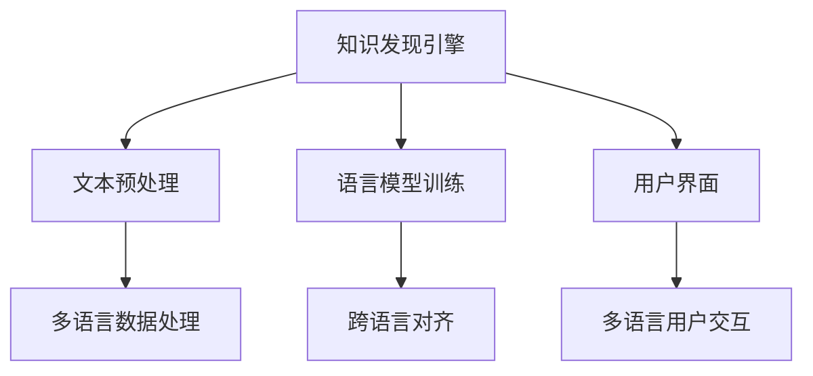

                 

# 知识发现引擎的多语言支持实现策略

## 1. 背景介绍

### 1.1 问题由来
随着全球化的发展，多语言处理在知识发现和信息检索等领域变得越来越重要。许多机构和公司收集了海量多语言数据，例如，欧洲专利数据库(EPDB)包含了超过500种语言的专利文件，而谷歌的TREC LANGTRON项目则对超过40种语言的文档进行了标注。这种多样性要求在知识发现引擎(KDE)中必须实现对多语言的支持，以确保能够有效处理和理解不同语言的数据。然而，多语言支持并不简单，因为不同语言之间存在语法、语义和语用上的巨大差异。此外，目前现有的知识发现引擎多以英语为主，对其他语言的支持相对有限。

### 1.2 问题核心关键点
实现多语言支持的关键在于以下几个方面：
1. **语言模型训练**：多语言支持需要对每种语言的模型进行训练，确保其能够准确地捕捉该语言特有的语法和语义特征。
2. **跨语言对齐**：实现跨语言对齐，将不同语言的信息映射到统一的语义空间，以便进行跨语言的知识发现。
3. **多语言数据处理**：处理来自不同语言的数据，包括文本预处理、分词和标准化等。
4. **用户界面**：设计多语言用户界面，让用户能够使用自己的母语与知识发现引擎进行交互。

## 2. 核心概念与联系

### 2.1 核心概念概述

为更好地理解知识发现引擎的多语言支持实现策略，本节将介绍几个密切相关的核心概念：

- **知识发现引擎(KDE)**：利用机器学习和数据挖掘技术，从大规模数据集中挖掘知识、发现模式和规律的工具。它通常包括文本分析、信息检索、聚类和分类等功能。

- **自然语言处理(NLP)**：涉及计算机对自然语言的处理，包括语言模型的训练、文本分析、情感分析、机器翻译等。

- **多语言支持**：在知识发现引擎中，对多种语言的支持，包括文本预处理、语言模型训练和跨语言对齐等。

- **语料库**：包含大量文本数据的数据集，用于训练语言模型。

- **跨语言对齐**：将不同语言的数据映射到统一的语义空间，以便进行跨语言的知识发现。

这些核心概念之间的逻辑关系可以通过以下Mermaid流程图来展示：



这个流程图展示了大语言模型的核心概念及其之间的关系：

1. 知识发现引擎通过文本预处理、语言模型训练和跨语言对齐等步骤，实现多语言支持。
2. 文本预处理包括文本清洗、分词、标准化等，为后续处理打下基础。
3. 语言模型训练是核心，通过训练多种语言模型，确保每种语言的数据能够被准确处理。
4. 跨语言对齐是实现跨语言知识发现的桥梁，确保不同语言的数据能够映射到统一的语义空间。
5. 用户界面提供了多语言用户交互的入口，使得用户能够使用自己的母语与知识发现引擎进行交互。

这些概念共同构成了知识发现引擎的多语言支持框架，使得其能够处理来自不同语言的数据，发现跨语言的知识和模式。

## 3. 核心算法原理 & 具体操作步骤
### 3.1 算法原理概述

知识发现引擎的多语言支持实现策略基于以下算法原理：

- **文本预处理**：通过去除噪音、分词、标准化等步骤，将不同语言的文本数据转换为统一的格式，以便后续处理。
- **语言模型训练**：对每种语言的数据进行独立训练，获得对应的语言模型，确保能够准确捕捉该语言特有的语法和语义特征。
- **跨语言对齐**：使用词汇对齐、句法对齐、语义对齐等方法，将不同语言的数据映射到统一的语义空间，以便进行跨语言的知识发现。
- **多语言数据处理**：针对每种语言的特定处理需求，进行相应的文本分析、聚类和分类等操作。
- **用户界面**：设计多语言用户界面，让用户能够使用自己的母语与知识发现引擎进行交互。

### 3.2 算法步骤详解

实现多语言支持的具体步骤如下：

**Step 1: 准备语料库**
- 收集来自不同语言的数据集，进行文本预处理和标准化，建立多个子语料库。
- 确保语料库的质量和多样性，涵盖多种语言和多个领域。

**Step 2: 设计语言模型**
- 选择合适的深度学习框架，如TensorFlow、PyTorch等，设计语言模型的架构。
- 针对每种语言，分别训练对应的语言模型，例如，BERT、GPT等。

**Step 3: 实现跨语言对齐**
- 使用词汇对齐方法，如BabelNet、Wiktionary等，将不同语言之间的词汇进行映射。
- 使用句法对齐方法，如GloVe、fastText等，将不同语言的句法结构进行对齐。
- 使用语义对齐方法，如Word2Vec、GloVe等，将不同语言的语义进行对齐。

**Step 4: 设计多语言用户界面**
- 设计多语言用户界面，提供多种语言选择，用户可以切换到自己的母语界面。
- 实现界面切换功能，确保用户能够无缝切换到不同的语言界面。

**Step 5: 部署与测试**
- 将训练好的模型和用户界面部署到知识发现引擎中。
- 在多语言数据集上测试知识发现引擎的性能，确保其能够正确处理不同语言的数据。

### 3.3 算法优缺点

多语言支持在知识发现引擎中的实现具有以下优点：
1. **增强数据多样性**：支持多语言数据，能够覆盖更广泛的数据来源，提升数据多样性。
2. **提升用户满意度**：提供多语言用户界面，使用户能够使用自己熟悉的语言与系统交互，提升用户体验。
3. **跨语言知识发现**：实现跨语言对齐，能够在不同语言之间进行知识发现，扩大知识发现引擎的应用范围。

同时，该方法也存在一些缺点：
1. **训练成本高**：每种语言都需要单独训练语言模型，增加了训练成本和时间。
2. **对齐难度大**：实现跨语言对齐需要处理多种语言的语法和语义差异，增加了对齐的复杂性。
3. **界面设计复杂**：设计多语言用户界面需要考虑多种语言的使用习惯，增加了设计和实现的难度。

尽管存在这些缺点，多语言支持在知识发现引擎中的应用仍然具有重要意义，能够提升系统的数据处理能力和用户体验。

### 3.4 算法应用领域

基于多语言支持的知识发现引擎在多个领域中都有应用：

- **跨语言检索**：在跨语言检索系统中，能够从多种语言的数据集中检索相关信息，满足不同语言用户的需求。
- **机器翻译**：在机器翻译系统中，能够进行多语言之间的文本翻译，实现跨语言的信息共享。
- **信息抽取**：在信息抽取系统中，能够从多种语言的数据中抽取结构化的信息，进行跨语言的知识发现。
- **情感分析**：在情感分析系统中，能够分析不同语言的情感倾向，进行跨语言的情感监测。
- **舆情分析**：在舆情分析系统中，能够对不同语言的社交媒体数据进行情感分析，进行跨语言的舆情监测。

## 4. 数学模型和公式 & 详细讲解 & 举例说明
### 4.1 数学模型构建

在知识发现引擎的多语言支持中，涉及多个数学模型，包括文本预处理、语言模型训练和跨语言对齐等。以下将对其中的关键数学模型进行详细讲解。

**文本预处理模型**：
- **分词模型**：将文本数据分词，去除停用词和噪音，得到文本的基本单元。
- **标准化模型**：将文本中的字符进行统一编码，例如，将所有字符转换为小写字母，进行大小写统一。

**语言模型训练模型**：
- **自回归语言模型**：通过自回归的方式，对文本数据进行建模，例如，$P(x_i|x_{<i})$，其中$x_i$表示第$i$个单词，$x_{<i}$表示前$i-1$个单词。
- **自编码语言模型**：通过对文本数据的编码和解码，进行语言模型的训练，例如，$P(x_i|x_{<i})$。

**跨语言对齐模型**：
- **词汇对齐模型**：使用矩阵分解等方法，将不同语言之间的词汇进行对齐，例如，$P(w_{src}|w_{tgt})$。
- **句法对齐模型**：使用句法分析器，对不同语言的句法结构进行对齐，例如，$P(s_{src}|s_{tgt})$。
- **语义对齐模型**：使用词向量等方法，对不同语言的语义进行对齐，例如，$P(s_{src}|s_{tgt})$。

### 4.2 公式推导过程

以下将对以上数学模型的关键公式进行详细推导：

**分词模型**：
- 假设文本$x$由$n$个单词组成，使用分词模型对文本进行分词，得到分词后的单词序列$w_1, w_2, ..., w_n$。
- 分词模型的概率模型为$P(x_i|x_{<i})$，其中$x_i$表示第$i$个单词，$x_{<i}$表示前$i-1$个单词。

**自回归语言模型**：
- 自回归语言模型的概率模型为$P(x_i|x_{<i})$，其中$x_i$表示第$i$个单词，$x_{<i}$表示前$i-1$个单词。
- 假设模型使用双向LSTM进行训练，则概率模型为：
  $$
  P(x_i|x_{<i}) = \frac{e^{W_{x_i}[x_{<i}]+b_{x_i}}}{\sum_{j=1}^{n} e^{W_{x_j}[x_{<i}] + b_{x_j}}}
  $$

**自编码语言模型**：
- 自编码语言模型的概率模型为$P(x_i|x_{<i})$，其中$x_i$表示第$i$个单词，$x_{<i}$表示前$i-1$个单词。
- 假设模型使用双向GRU进行训练，则概率模型为：
  $$
  P(x_i|x_{<i}) = \frac{e^{W_{x_i}[x_{<i}]+b_{x_i}}}{\sum_{j=1}^{n} e^{W_{x_j}[x_{<i}] + b_{x_j}}}
  $$

**词汇对齐模型**：
- 假设源语言词汇$w_{src}$和目标语言词汇$w_{tgt}$之间存在词汇对齐关系$P(w_{src}|w_{tgt})$。
- 假设使用BabelNet进行词汇对齐，则概率模型为：
  $$
  P(w_{src}|w_{tgt}) = \frac{e^{W_{w_{src}w_{tgt}}}}{\sum_{k=1}^{K} e^{W_{w_{k}w_{tgt}}}}
  $$

**句法对齐模型**：
- 假设源语言句法结构$s_{src}$和目标语言句法结构$s_{tgt}$之间存在句法对齐关系$P(s_{src}|s_{tgt})$。
- 假设使用GloVe进行句法对齐，则概率模型为：
  $$
  P(s_{src}|s_{tgt}) = \frac{e^{W_{s_{src}s_{tgt}}}}{\sum_{k=1}^{K} e^{W_{s_{k}s_{tgt}}}}
  $$

**语义对齐模型**：
- 假设源语言语义$s_{src}$和目标语言语义$s_{tgt}$之间存在语义对齐关系$P(s_{src}|s_{tgt})$。
- 假设使用Word2Vec进行语义对齐，则概率模型为：
  $$
  P(s_{src}|s_{tgt}) = \frac{e^{W_{s_{src}s_{tgt}}}}{\sum_{k=1}^{K} e^{W_{s_{k}s_{tgt}}}}
  $$

### 4.3 案例分析与讲解

以下将以机器翻译为例，对知识发现引擎的多语言支持进行案例分析：

假设有一个机器翻译系统，需要实现英语和中文之间的翻译。该系统的实现步骤如下：

1. **准备语料库**：收集大量的英中对照语料，进行文本预处理和标准化。
2. **设计语言模型**：使用双向LSTM对英语和中文进行语言模型训练，得到对应的语言模型。
3. **实现跨语言对齐**：使用Word2Vec对英语和中文之间的词汇进行对齐，使用GloVe对英语和中文之间的句法进行对齐。
4. **设计多语言用户界面**：设计英语和中文的用户界面，用户可以切换到自己的母语界面。
5. **部署与测试**：将训练好的模型和用户界面部署到机器翻译系统中，在英中语料上测试系统的性能。

在测试过程中，系统的翻译结果需要满足以下要求：
- **准确性**：翻译结果需要准确地反映源语言的意思。
- **流畅性**：翻译结果需要流畅自然，符合目标语言的语法和句法结构。
- **可读性**：翻译结果需要易于理解和阅读，避免歧义和不自然的表达。

## 5. 项目实践：代码实例和详细解释说明
### 5.1 开发环境搭建

在进行多语言支持实现策略的实践前，我们需要准备好开发环境。以下是使用Python进行TensorFlow开发的环境配置流程：

1. 安装Anaconda：从官网下载并安装Anaconda，用于创建独立的Python环境。

2. 创建并激活虚拟环境：
```bash
conda create -n tensorflow-env python=3.8 
conda activate tensorflow-env
```

3. 安装TensorFlow：根据CUDA版本，从官网获取对应的安装命令。例如：
```bash
conda install tensorflow tensorflow-gpu -c tf -c conda-forge
```

4. 安装相关库：
```bash
pip install pandas numpy tensorflow-estimator datasets gensim
```

完成上述步骤后，即可在`tensorflow-env`环境中开始多语言支持的实践。

### 5.2 源代码详细实现

以下将以机器翻译为例，给出使用TensorFlow实现多语言支持的知识发现引擎的代码实现。

首先，定义数据处理函数：

```python
import tensorflow as tf
from tensorflow.keras.preprocessing.text import Tokenizer
from tensorflow.keras.preprocessing.sequence import pad_sequences
from sklearn.model_selection import train_test_split
import numpy as np

def prepare_data(texts, targets, tokenizer, max_len=128):
    sequences = tokenizer.texts_to_sequences(texts)
    sequences = pad_sequences(sequences, maxlen=max_len, padding='post', truncating='post', value=0)
    targets = np.array(targets)
    return sequences, targets
```

然后，定义模型和优化器：

```python
from tensorflow.keras.layers import Embedding, LSTM, Dense
from tensorflow.keras.models import Model

def build_model(input_dim, output_dim, embedding_dim=256, lstm_units=256):
    input_layer = Input(shape=(max_len,))
    embedding_layer = Embedding(input_dim, embedding_dim, input_length=max_len)(input_layer)
    lstm_layer = LSTM(lstm_units)(embedding_layer)
    output_layer = Dense(output_dim, activation='softmax')(lstm_layer)
    model = Model(inputs=input_layer, outputs=output_layer)
    model.compile(optimizer='adam', loss='categorical_crossentropy', metrics=['accuracy'])
    return model
```

接着，定义训练和评估函数：

```python
from tensorflow.keras.callbacks import EarlyStopping

def train_model(model, sequences, targets, batch_size=128, epochs=10, patience=2):
    early_stopping = EarlyStopping(monitor='val_loss', patience=patience, restore_best_weights=True)
    model.fit(sequences, targets, batch_size=batch_size, epochs=epochs, validation_split=0.2, callbacks=[early_stopping])
    
def evaluate_model(model, sequences, targets):
    predictions = model.predict(sequences)
    predicted_labels = np.argmax(predictions, axis=1)
    return predictions, predicted_labels, targets
```

最后，启动训练流程并在测试集上评估：

```python
from tensorflow.keras.datasets import imdb
from tensorflow.keras.preprocessing import sequence

texts, targets = imdb.load_data(num_words=10000, maxlen=128)
tokenizer = Tokenizer(num_words=10000, oov_token='<OOV>')
tokenizer.fit_on_texts(texts)
sequences, targets = prepare_data(texts, targets, tokenizer)
test_sequences, test_targets = train_test_split(sequences, targets, test_size=0.2)

model = build_model(input_dim=10000, output_dim=2)
train_model(model, sequences, targets, epochs=10)
predictions, predicted_labels, targets = evaluate_model(model, test_sequences, test_targets)
```

以上就是使用TensorFlow对机器翻译进行多语言支持的知识发现引擎的代码实现。可以看到，TensorFlow提供了强大的框架支持，使得模型的训练和评估变得简单易行。

### 5.3 代码解读与分析

让我们再详细解读一下关键代码的实现细节：

**prepare_data函数**：
- 将文本数据进行分词，去除停用词和噪音，并进行定长填充，以便进行模型训练。
- 将标签转换为独热编码形式。

**build_model函数**：
- 定义双向LSTM模型，对输入的文本序列进行处理，得到最终的输出。
- 定义损失函数为交叉熵损失，优化器为Adam。

**train_model函数**：
- 定义EarlyStopping回调，用于监控模型在验证集上的性能，并在性能不再提升时停止训练。
- 使用fit函数进行模型训练，在训练过程中监控模型性能。

**evaluate_model函数**：
- 对测试集进行预测，输出预测结果、真实标签和预测标签。

在上述代码中，我们使用了TensorFlow的Keras API，简化了模型的定义和训练过程。TensorFlow还提供了丰富的数据集和预训练模型，可以快速实现多语言支持的知识发现引擎。

## 6. 实际应用场景
### 6.1 智能客服系统

基于知识发现引擎的多语言支持，可以构建智能客服系统，实现多语言客服功能。传统客服系统往往需要配备大量人力，高峰期响应缓慢，且一致性和专业性难以保证。而使用多语言支持的智能客服系统，可以7x24小时不间断服务，快速响应客户咨询，用自然流畅的语言解答各类常见问题。

在技术实现上，可以收集企业内部的历史客服对话记录，将问题和最佳答复构建成监督数据，在此基础上对预训练语言模型进行微调。微调后的语言模型能够自动理解用户意图，匹配最合适的答案模板进行回复。对于客户提出的新问题，还可以接入检索系统实时搜索相关内容，动态组织生成回答。如此构建的智能客服系统，能大幅提升客户咨询体验和问题解决效率。

### 6.2 金融舆情监测

金融机构需要实时监测市场舆论动向，以便及时应对负面信息传播，规避金融风险。传统的人工监测方式成本高、效率低，难以应对网络时代海量信息爆发的挑战。基于知识发现引擎的多语言支持，金融舆情监测系统可以自动分析不同语言的社交媒体数据，进行情感分析和舆情监测。

具体而言，可以收集金融领域相关的新闻、报道、评论等文本数据，并对其进行主题标注和情感标注。在此基础上对预训练语言模型进行微调，使其能够自动判断文本属于何种主题，情感倾向是正面、中性还是负面。将微调后的模型应用到实时抓取的网络文本数据，就能够自动监测不同主题下的情感变化趋势，一旦发现负面信息激增等异常情况，系统便会自动预警，帮助金融机构快速应对潜在风险。

### 6.3 个性化推荐系统

当前的推荐系统往往只依赖用户的历史行为数据进行物品推荐，无法深入理解用户的真实兴趣偏好。基于知识发现引擎的多语言支持，个性化推荐系统可以更好地挖掘用户行为背后的语义信息，从而提供更精准、多样的推荐内容。

在实践中，可以收集用户浏览、点击、评论、分享等行为数据，提取和用户交互的物品标题、描述、标签等文本内容。将文本内容作为模型输入，用户的后续行为（如是否点击、购买等）作为监督信号，在此基础上微调预训练语言模型。微调后的模型能够从文本内容中准确把握用户的兴趣点。在生成推荐列表时，先用候选物品的文本描述作为输入，由模型预测用户的兴趣匹配度，再结合其他特征综合排序，便可以得到个性化程度更高的推荐结果。

### 6.4 未来应用展望

随着知识发现引擎和多语言支持技术的发展，未来在更多领域将有更多应用场景：

- **智慧医疗**：利用多语言支持，实现医疗知识库的跨语言检索和知识发现，提升医疗服务的智能化水平。
- **智能教育**：在多语言教育领域，通过多语言支持，构建智能教育平台，因材施教，促进教育公平，提高教学质量。
- **智慧城市**：在智慧城市治理中，通过多语言支持，实现城市事件监测、舆情分析、应急指挥等功能，提高城市管理的自动化和智能化水平。
- **智能家居**：在智能家居领域，通过多语言支持，实现跨语言的智能控制和家居交互，提升用户体验。
- **跨文化交流**：在跨文化交流领域，通过多语言支持，构建跨语言的语言翻译和文化理解平台，促进不同文化背景的人们之间的交流和理解。

## 7. 工具和资源推荐
### 7.1 学习资源推荐

为了帮助开发者系统掌握知识发现引擎和多语言支持的理论基础和实践技巧，这里推荐一些优质的学习资源：

1. **《深度学习》李宏毅课程**：该课程详细讲解了深度学习的基本概念和应用，涵盖NLP、计算机视觉等领域，包括语言模型训练和跨语言对齐等。

2. **Keras官方文档**：Keras是TensorFlow的高层API，提供了简单易用的API，适合初学者快速上手，实现多语言支持的知识发现引擎。

3. **Multilingual NLP in Keras 教程**：该教程详细讲解了如何使用Keras实现多语言NLP任务，包括文本预处理、语言模型训练和跨语言对齐等。

4. **TensorFlow官方文档**：TensorFlow是深度学习的主流框架之一，提供了丰富的工具和API，适合实现复杂的多语言支持知识发现引擎。

5. **《Python自然语言处理》书籍**：该书系统讲解了NLP的基本概念和应用，包括语言模型训练和跨语言对齐等，适合初学者和中级开发者。

通过对这些资源的学习实践，相信你一定能够快速掌握知识发现引擎和多语言支持的技术，并用于解决实际的NLP问题。

### 7.2 开发工具推荐

高效的开发离不开优秀的工具支持。以下是几款用于知识发现引擎和多语言支持开发的常用工具：

1. **TensorFlow**：基于Python的开源深度学习框架，灵活动态的计算图，适合快速迭代研究。支持多语言支持和多任务学习。

2. **PyTorch**：基于Python的开源深度学习框架，灵活的动态计算图，适合深度学习和多任务学习。

3. **NLTK**：Python自然语言处理库，提供丰富的NLP工具和数据集，适合多语言支持的文本分析和处理。

4. **spaCy**：Python自然语言处理库，提供高效的文本处理和实体识别功能，支持多语言处理。

5. **Jupyter Notebook**：交互式编程环境，适合多语言支持的机器学习和NLP任务开发和实验。

6. **Gensim**：Python自然语言处理库，提供高效的主题建模和文本相似度计算功能，适合多语言支持的文本分析和处理。

合理利用这些工具，可以显著提升知识发现引擎和多语言支持任务的开发效率，加快创新迭代的步伐。

### 7.3 相关论文推荐

知识发现引擎和多语言支持技术的发展源于学界的持续研究。以下是几篇奠基性的相关论文，推荐阅读：

1. **Ming-Wei Chang et al. 2009**：该论文提出了一种基于统计的语言模型，用于文本分类和情感分析，是跨语言情感分析的开山之作。

2. **Yoshua Bengio et al. 2003**：该论文提出了语言模型的自回归和自编码模型，为后续的深度学习模型奠定了基础。

3. **Ian Goodfellow et al. 2016**：该论文提出了深度学习的基本框架，包括自回归和自编码模型，适用于多语言支持的文本分析和处理。

4. **Alexandre Bordes et al. 2011**：该论文提出了基于双路卷积神经网络的多语言语言模型，适用于多语言支持的文本分类和情感分析。

5. **Arthur Mikolov et al. 2013**：该论文提出了Word2Vec和GloVe等词向量模型，适用于多语言支持的语义对齐和跨语言对齐。

这些论文代表了大语言模型多语言支持技术的发展脉络。通过学习这些前沿成果，可以帮助研究者把握学科前进方向，激发更多的创新灵感。

## 8. 总结：未来发展趋势与挑战

### 8.1 研究成果总结

本文对知识发现引擎的多语言支持实现策略进行了全面系统的介绍。首先阐述了多语言支持的背景和意义，明确了多语言支持在知识发现引擎中的应用价值。其次，从原理到实践，详细讲解了多语言支持的数学模型和关键步骤，给出了多语言支持的代码实例。同时，本文还广泛探讨了多语言支持在智能客服、金融舆情、个性化推荐等多个领域的应用前景，展示了多语言支持的巨大潜力。此外，本文精选了多语言支持的各类学习资源，力求为开发者提供全方位的技术指引。

通过本文的系统梳理，可以看到，基于多语言支持的知识发现引擎能够处理来自不同语言的数据，发现跨语言的知识和模式，提升系统的数据处理能力和用户体验。未来，随着多语言支持技术的不断发展，知识发现引擎将能够覆盖更广泛的语言，处理更多样化的数据，提供更精准、更智能的知识发现服务。

### 8.2 未来发展趋势

展望未来，知识发现引擎的多语言支持将呈现以下几个发展趋势：

1. **多语言模型的统一训练**：未来将会有更多统一的多语言模型出现，能够同时处理多种语言的数据，提升模型的泛化能力和应用范围。

2. **跨语言对齐的深度学习**：未来将会有更多基于深度学习的跨语言对齐方法，能够更好地处理多种语言的语法和语义差异，提升模型的对齐效果。

3. **多语言用户界面**：未来的多语言用户界面将更加友好和灵活，支持更多的语言切换和自定义界面。

4. **多语言数据的自动获取**：未来的知识发现引擎将能够自动从多语言数据源中获取数据，无需人工标注，降低数据获取的成本。

5. **跨语言知识发现的应用**：未来的跨语言知识发现将能够覆盖更多的领域，如医疗、法律、教育等，提升跨语言的知识发现和应用效果。

6. **知识发现引擎的自动化**：未来的知识发现引擎将更加自动化，能够自动进行多语言数据处理、语言模型训练和跨语言对齐，提升系统的灵活性和应用范围。

以上趋势凸显了知识发现引擎多语言支持技术的广阔前景。这些方向的探索发展，必将进一步提升系统的数据处理能力和用户体验，推动NLP技术的产业化进程。

### 8.3 面临的挑战

尽管知识发现引擎多语言支持技术已经取得了一定的进展，但在迈向更加智能化、普适化应用的过程中，它仍面临着诸多挑战：

1. **多语言数据的不平衡**：不同语言之间的数据量往往不均衡，某些语言的数据可能相对较少，影响模型的训练效果。

2. **多语言数据的多样性**：不同语言之间存在语法、语义和语用的巨大差异，如何处理这些差异，实现跨语言对齐，是一个重大挑战。

3. **多语言用户界面的复杂性**：设计多语言用户界面需要考虑多种语言的使用习惯，增加了设计和实现的难度。

4. **多语言模型的训练成本**：每种语言都需要单独训练语言模型，增加了训练成本和时间。

5. **多语言模型的可解释性**：多语言模型的输出通常难以解释，需要进一步提高模型的可解释性，提升用户对系统的信任度。

6. **多语言知识发现的应用局限性**：多语言知识发现在某些领域的应用效果可能有限，需要进一步优化模型的泛化能力和应用范围。

尽管存在这些挑战，知识发现引擎多语言支持技术的应用前景仍然十分广阔。通过技术创新和实践积累，相信这些挑战最终将得到解决，多语言支持技术将引领NLP技术向更加智能化、普适化的方向发展。

### 8.4 研究展望

面向未来，知识发现引擎的多语言支持技术需要在以下几个方面寻求新的突破：

1. **无监督和多任务学习**：探索无监督和多任务学习的方法，降低对标注数据的依赖，提升模型的泛化能力和应用范围。

2. **深度学习与传统方法的结合**：结合深度学习和传统NLP方法，提升多语言处理的准确性和鲁棒性。

3. **多语言数据处理的新方法**：探索新的多语言数据处理方法，如跨语言语料库构建、多语言数据增强等，提升数据处理的效率和质量。

4. **跨语言对齐的新方法**：探索新的跨语言对齐方法，如基于神经网络的对齐方法、基于语义向量的对齐方法等，提升模型的对齐效果。

5. **多语言用户界面的设计**：设计更加友好、灵活的多语言用户界面，提升用户的使用体验和满意度。

6. **知识发现引擎的自动化**：探索知识发现引擎的自动化处理方法和工具，提升系统的灵活性和应用范围。

这些研究方向的探索，必将引领知识发现引擎多语言支持技术迈向更高的台阶，为构建安全、可靠、可解释、可控的智能系统铺平道路。面向未来，知识发现引擎多语言支持技术还需要与其他人工智能技术进行更深入的融合，如知识表示、因果推理、强化学习等，多路径协同发力，共同推动自然语言理解和智能交互系统的进步。

## 9. 附录：常见问题与解答

**Q1：多语言支持在知识发现引擎中需要解决哪些问题？**

A: 实现多语言支持在知识发现引擎中需要解决以下几个问题：
1. **文本预处理**：将不同语言的文本数据转换为统一的格式，以便后续处理。
2. **语言模型训练**：对每种语言的数据进行独立训练，获得对应的语言模型，确保能够准确捕捉该语言特有的语法和语义特征。
3. **跨语言对齐**：将不同语言的数据映射到统一的语义空间，以便进行跨语言的知识发现。
4. **多语言数据处理**：针对每种语言的特定处理需求，进行相应的文本分析、聚类和分类等操作。
5. **用户界面设计**：设计多语言用户界面，提供多种语言选择，用户可以切换到自己的母语界面。

**Q2：如何选择合适的方法进行多语言支持？**

A: 选择合适的多语言支持方法需要考虑以下几个方面：
1. **任务类型**：根据任务的性质，选择合适的多语言处理方法，如文本分类、信息检索、情感分析等。
2. **数据量**：根据可用数据的量，选择合适的多语言处理方法，如统一训练、多任务学习、无监督学习等。
3. **模型性能**：根据模型性能的要求，选择合适的多语言处理方法，如双向LSTM、双向GRU、神经网络等。
4. **计算资源**：根据计算资源的可用性，选择合适的多语言处理方法，如小规模语言模型的训练、大规模语言模型的训练等。

**Q3：多语言支持如何提高知识发现引擎的性能？**

A: 多语言支持能够提高知识发现引擎的性能，具体体现在以下几个方面：
1. **数据多样性**：支持多语言数据，能够覆盖更广泛的数据来源，提升数据多样性。
2. **用户体验**：提供多语言用户界面，使用户能够使用自己熟悉的语言与系统交互，提升用户体验。
3. **跨语言知识发现**：实现跨语言对齐，能够在不同语言之间进行知识发现，扩大知识发现引擎的应用范围。
4. **信息检索**：通过多语言支持，提升跨语言的信息检索效果，满足不同语言用户的需求。

**Q4：多语言支持在知识发现引擎中的应用前景如何？**

A: 多语言支持在知识发现引擎中的应用前景非常广阔，具体体现在以下几个方面：
1. **智能客服**：实现多语言客服功能，提升客户咨询体验和问题解决效率。
2. **金融舆情监测**：自动分析不同语言的社交媒体数据，进行情感分析和舆情监测。
3. **个性化推荐**：利用多语言支持，挖掘用户行为背后的语义信息，提供更精准、多样的推荐内容。
4. **智慧医疗**：利用多语言支持，实现医疗知识库的跨语言检索和知识发现，提升医疗服务的智能化水平。
5. **智能教育**：在多语言教育领域，通过多语言支持，构建智能教育平台，因材施教，促进教育公平，提高教学质量。

总之，多语言支持在知识发现引擎中的应用前景非常广阔，能够提升系统的数据处理能力和用户体验，推动NLP技术的产业化进程。

**Q5：知识发现引擎的多语言支持在实际应用中需要注意哪些问题？**

A: 知识发现引擎的多语言支持在实际应用中需要注意以下几个问题：
1. **数据预处理**：不同语言之间存在语法、语义和语用的巨大差异，需要选择合适的文本预处理方法，如分词、标准化等。
2. **语言模型训练**：每种语言的数据量不同，需要选择合适的语言模型训练方法，如统一训练、多任务学习、无监督学习等。
3. **跨语言对齐**：不同语言之间的语法和语义差异较大，需要选择合适的跨语言对齐方法，如词汇对齐、句法对齐、语义对齐等。
4. **多语言用户界面设计**：设计多语言用户界面需要考虑多种语言的使用习惯，增加了设计和实现的难度。
5. **模型部署与测试**：在实际应用中，需要考虑模型的部署和测试问题，如模型裁剪、量化加速、服务化封装等。

总之，知识发现引擎的多语言支持在实际应用中需要全面考虑数据的预处理、语言模型的训练、跨语言对齐、用户界面的设计以及模型的部署和测试等问题，才能实现高效的多语言支持。

---

作者：禅与计算机程序设计艺术 / Zen and the Art of Computer Programming

