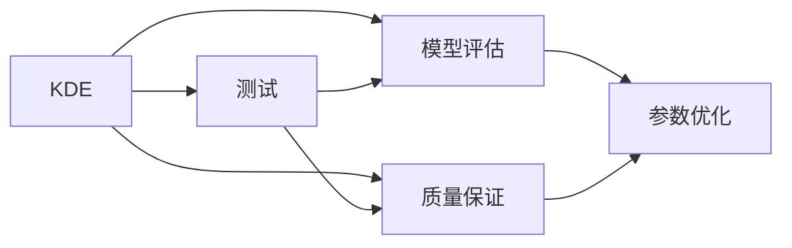
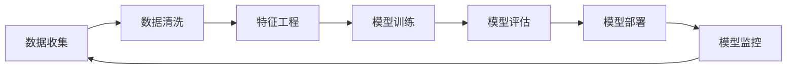

                 

## 1. 背景介绍

在当今数据驱动的时代，知识发现引擎(Knowledge Discovery Engine, KDE)成为了企业决策和智能化运营的核心工具。KDE通过对大量结构化和非结构化数据的整合、分析和挖掘，为决策者提供了深度的洞察和智能支持。然而，为了保证知识发现引擎的输出结果准确可靠，进行有效的测试与质量保证成为一项至关重要的任务。本文将系统介绍KDE的测试与质量保证方法，帮助您理解并实施这一过程。

## 2. 核心概念与联系

### 2.1 核心概念概述

为更深入理解KDE的测试与质量保证，我们首先梳理以下核心概念：

- **知识发现引擎(KDE)**：通过对大规模数据进行分析和挖掘，自动发现隐藏在数据中的知识模式，如关联规则、分类规则等。常见的KDE包括Apriori算法、FP-Growth算法、C4.5算法、支持向量机(SVM)、随机森林(Random Forest)等。

- **测试(Testing)**：通过一系列测试用例和测试方法，验证KDE模型能否正确处理数据，并满足预期的功能需求。测试的目的是发现并修复模型中的缺陷和错误。

- **质量保证(Quality Assurance, QA)**：在KDE的开发和部署过程中，通过质量评估、测试和持续改进，确保模型输出的准确性、鲁棒性和可解释性。QA包括测试、验证、复审、验证等环节，贯穿于KDE的全生命周期。

- **模型评估与优化**：通过对模型在测试集上的表现进行评估，识别模型的优势和不足，进行必要的参数调整和优化，以提高模型的预测精度和泛化能力。

- **鲁棒性和可解释性**：KDE的输出应具备对异常数据、噪声数据的鲁棒性，并能够提供明确的解释，帮助决策者理解模型的工作机制和结果依据。

这些核心概念之间的联系可以通过以下Mermaid流程图来展示：



这个流程图展示了KDE系统各个组件间的逻辑关系：

1. KDE通过数据挖掘自动发现知识模式。
2. 测试和模型评估对KDE的输出进行验证和优化。
3. 质量保证确保模型的准确性和鲁棒性。
4. 参数优化通过调整模型参数提高性能。

### 2.2 核心概念原理和架构的 Mermaid 流程图



此图展示了KDE从数据收集到模型监控的完整流程：

1. 数据收集：获取各类数据源，包括结构化和非结构化数据。
2. 数据清洗：处理缺失、异常数据，提高数据质量。
3. 特征工程：提取、转换和选择特征，构建模型输入。
4. 模型训练：使用训练数据拟合模型。
5. 模型评估：对模型进行验证和测试，评估性能。
6. 模型部署：将模型应用到实际环境中，进行推理。
7. 模型监控：实时监控模型性能，及时调整和优化。

## 3. 核心算法原理 & 具体操作步骤

### 3.1 算法原理概述

KDE的测试与质量保证过程涉及多个步骤，包括数据准备、模型训练、测试评估和质量保证。其核心原理和操作步骤如下：

1. **数据准备**：收集、清洗和预处理数据，提取特征，构建模型输入。
2. **模型训练**：使用训练数据拟合模型，包括选择合适的算法、设定超参数、优化算法等。
3. **测试评估**：对模型在测试集上的表现进行评估，包括精度、召回率、F1分数、AUC等指标。
4. **质量保证**：对模型进行持续监控和优化，确保其准确性、鲁棒性和可解释性。

### 3.2 算法步骤详解

#### 数据准备

1. **数据收集**：从不同数据源获取数据，确保数据多样性和完整性。
2. **数据清洗**：处理缺失值、异常值和噪声，保证数据质量。
3. **特征工程**：选择和构建特征，包括工程特征、衍生特征和元数据等。
4. **数据划分**：将数据集划分为训练集、验证集和测试集，确保模型的公平性和泛化能力。

#### 模型训练

1. **选择合适的算法**：根据问题类型和数据特点，选择合适的算法，如分类算法、聚类算法、关联规则算法等。
2. **设定超参数**：选择合适的超参数，如学习率、正则化系数、特征选择方法等。
3. **优化算法**：使用梯度下降、遗传算法等优化算法，最小化损失函数，提高模型性能。
4. **交叉验证**：使用交叉验证技术，确保模型泛化能力。

#### 测试评估

1. **选择合适的评估指标**：根据任务类型，选择合适的评估指标，如准确率、召回率、F1分数、AUC等。
2. **划分测试集**：将数据集划分为训练集、验证集和测试集，确保评估结果的可靠性。
3. **评估模型**：使用测试集评估模型性能，识别模型的优势和不足。

#### 质量保证

1. **持续监控**：实时监控模型性能，确保其鲁棒性和准确性。
2. **版本管理**：对模型版本进行管理，确保回溯和复现。
3. **文档记录**：记录模型设计、开发和测试过程，便于后续优化和复现。
4. **定期复审**：对模型进行定期复审，确保其符合业务需求和性能要求。

### 3.3 算法优缺点

#### 优点

- **自动化程度高**：通过自动化测试和质量保证流程，可以大大减少人工干预，提高效率。
- **模型泛化能力强**：通过选择合适的算法和超参数，模型在新的数据集上表现良好。
- **鲁棒性好**：通过持续监控和优化，模型对异常数据和噪声数据具有较强的鲁棒性。

#### 缺点

- **数据依赖性强**：测试和质量保证的效果依赖于数据的质量和多样性。
- **超参数调优复杂**：选择合适的超参数是一个复杂且耗时的过程。
- **模型可解释性不足**：某些复杂的KDE算法，如深度学习模型，其决策过程难以解释。

### 3.4 算法应用领域

KDE的测试与质量保证方法广泛应用于多个领域，包括：

- **金融风险管理**：通过KDE发现交易数据中的异常模式，及时识别和防范金融风险。
- **零售客户行为分析**：分析客户购买行为，发现关联规则，进行个性化推荐。
- **医疗疾病诊断**：通过KDE分析患者数据，发现潜在疾病风险，进行早期预警。
- **市场趋势预测**：通过KDE分析市场数据，发现市场趋势，指导投资决策。

## 4. 数学模型和公式 & 详细讲解 & 举例说明

### 4.1 数学模型构建

知识发现引擎通常使用统计学和机器学习的方法进行建模。以分类任务为例，构建KDE的数学模型如下：

1. **输入特征**：$x_i \in \mathbb{R}^n$，其中$n$为特征维度。
2. **模型参数**：$\theta$，包括特征权重、分类阈值等。
3. **损失函数**：$L(\theta)$，用于衡量模型预测结果与真实标签的差异。
4. **评估指标**：$M(x_i)$，用于衡量模型在不同数据上的表现，如准确率、召回率、F1分数、AUC等。

### 4.2 公式推导过程

以分类任务为例，假设模型预测结果为$y_i \in \{0, 1\}$，真实标签为$z_i \in \{0, 1\}$，则模型的损失函数可以表示为：

$$
L(\theta) = \frac{1}{N} \sum_{i=1}^N \ell(y_i, z_i)
$$

其中$\ell(y_i, z_i)$为损失函数，如交叉熵损失函数：

$$
\ell(y_i, z_i) = -z_i\log(y_i) - (1-z_i)\log(1-y_i)
$$

通过最小化损失函数，得到模型参数$\theta$：

$$
\theta = \mathop{\arg\min}_{\theta} L(\theta)
$$

### 4.3 案例分析与讲解

#### 案例1：基于支持向量机(SVM)的信用评分模型

1. **数据准备**：收集客户的信用评分数据，进行数据清洗和特征工程。
2. **模型训练**：使用支持向量机算法，选择合适的核函数和正则化参数。
3. **测试评估**：使用测试集评估模型性能，识别模型的优势和不足。
4. **质量保证**：持续监控模型性能，及时调整和优化。

#### 案例2：基于随机森林(Random Forest)的客户流失预测模型

1. **数据准备**：收集客户的流失数据，进行数据清洗和特征工程。
2. **模型训练**：使用随机森林算法，选择合适的特征选择方法和决策树深度。
3. **测试评估**：使用测试集评估模型性能，识别模型的优势和不足。
4. **质量保证**：持续监控模型性能，及时调整和优化。

## 5. 项目实践：代码实例和详细解释说明

### 5.1 开发环境搭建

在开始项目实践前，我们需要准备好开发环境。以下是使用Python进行Scikit-learn开发的环境配置流程：

1. 安装Anaconda：从官网下载并安装Anaconda，用于创建独立的Python环境。

2. 创建并激活虚拟环境：
```bash
conda create -n sklearn-env python=3.8 
conda activate sklearn-env
```

3. 安装Scikit-learn：
```bash
conda install scikit-learn
```

4. 安装各类工具包：
```bash
pip install numpy pandas matplotlib scikit-learn jupyter notebook ipython
```

完成上述步骤后，即可在`sklearn-env`环境中开始项目实践。

### 5.2 源代码详细实现

下面我们以信用评分预测任务为例，给出使用Scikit-learn进行信用评分模型的PyTorch代码实现。

首先，定义数据处理函数：

```python
import pandas as pd
from sklearn.model_selection import train_test_split
from sklearn.preprocessing import StandardScaler
from sklearn.metrics import accuracy_score, roc_auc_score

def preprocess_data(data_path):
    # 读取数据
    data = pd.read_csv(data_path)
    # 数据清洗
    data = data.dropna()
    # 特征选择
    features = ['age', 'income', 'debt', 'credit_score', 'default']
    X = data[features]
    y = data['default']
    # 数据标准化
    scaler = StandardScaler()
    X = scaler.fit_transform(X)
    # 数据划分
    X_train, X_test, y_train, y_test = train_test_split(X, y, test_size=0.2, random_state=42)
    return X_train, X_test, y_train, y_test
```

然后，定义模型和评估函数：

```python
from sklearn.ensemble import RandomForestClassifier
from sklearn.model_selection import GridSearchCV

def train_model(X_train, y_train):
    # 随机森林模型
    model = RandomForestClassifier()
    # 交叉验证
    param_grid = {
        'n_estimators': [50, 100, 200],
        'max_depth': [None, 5, 10],
        'min_samples_split': [2, 5, 10],
        'min_samples_leaf': [1, 2, 4],
    }
    grid_search = GridSearchCV(model, param_grid, cv=5)
    grid_search.fit(X_train, y_train)
    # 评估模型
    y_pred = grid_search.predict(X_test)
    acc = accuracy_score(y_test, y_pred)
    roc_auc = roc_auc_score(y_test, y_pred)
    return grid_search.best_params_, acc, roc_auc

def evaluate_model(model, X_test, y_test):
    # 评估模型
    y_pred = model.predict(X_test)
    acc = accuracy_score(y_test, y_pred)
    roc_auc = roc_auc_score(y_test, y_pred)
    return acc, roc_auc
```

最后，启动训练流程并在测试集上评估：

```python
# 数据准备
X_train, X_test, y_train, y_test = preprocess_data('credit_data.csv')

# 模型训练
params, acc, roc_auc = train_model(X_train, y_train)
print(f'Best parameters: {params}')
print(f'Accuracy: {acc:.2f}')
print(f'ROC-AUC: {roc_auc:.2f}')

# 模型评估
acc, roc_auc = evaluate_model(RandomForestClassifier(**params), X_test, y_test)
print(f'Accuracy: {acc:.2f}')
print(f'ROC-AUC: {roc_auc:.2f}')
```

以上就是使用Scikit-learn对随机森林模型进行信用评分预测任务微调的完整代码实现。可以看到，得益于Scikit-learn的强大封装，我们可以用相对简洁的代码完成随机森林模型的加载和微调。

### 5.3 代码解读与分析

让我们再详细解读一下关键代码的实现细节：

**preprocess_data函数**：
- `pd.read_csv`方法：从文件中读取数据。
- `dropna`方法：删除含有缺失值的行。
- `features`变量：选择特征列。
- `StandardScaler`方法：对特征进行标准化。
- `train_test_split`方法：将数据划分为训练集和测试集。

**train_model函数**：
- `RandomForestClassifier`方法：构建随机森林模型。
- `GridSearchCV`方法：使用交叉验证选择最优参数。
- `predict`方法：预测新数据。
- `accuracy_score`和`roc_auc_score`方法：评估模型性能。

**evaluate_model函数**：
- `predict`方法：预测新数据。
- `accuracy_score`和`roc_auc_score`方法：评估模型性能。

**训练流程**：
- `preprocess_data`函数：预处理数据。
- `train_model`函数：训练模型，获取最优参数。
- `evaluate_model`函数：在测试集上评估模型性能。

## 6. 实际应用场景

### 6.1 金融风险管理

在金融风险管理领域，KDE可以帮助银行和金融机构识别和防范潜在的信用风险。通过收集和分析客户的历史信用数据，使用KDE发现高风险客户的特征模式，进行精准的风险预警和客户管理。例如，使用支持向量机或随机森林等算法，可以构建精准的信用评分模型，及时识别和防范不良贷款风险。

### 6.2 零售客户行为分析

零售企业可以通过KDE分析客户行为数据，发现客户的购买偏好和消费模式，进行精准的个性化推荐和营销活动。例如，使用关联规则算法，可以从交易数据中发现不同商品之间的关联性，进行交叉销售和捆绑销售。通过聚类算法，可以将客户分为不同的群体，进行针对性营销。

### 6.3 医疗疾病诊断

在医疗领域，KDE可以用于疾病的早期预警和诊断。通过收集和分析患者的历史病历数据，使用KDE发现疾病的潜在风险和特征模式，进行精准的疾病预测和预警。例如，使用决策树算法，可以从病历数据中发现不同疾病的关联特征，进行早期诊断和治疗。通过支持向量机算法，可以从基因数据中发现疾病的潜在基因特征，进行精准的基因诊断。

### 6.4 市场趋势预测

在市场预测领域，KDE可以用于分析市场数据，发现市场趋势和价格波动规律。通过收集和分析股票、期货等市场数据，使用KDE发现市场趋势和规律，进行精准的趋势预测和投资决策。例如，使用时间序列算法，可以从历史数据中发现市场趋势，进行精准的趋势预测。通过回归算法，可以从经济指标中发现市场规律，进行精准的市场预测。

## 7. 工具和资源推荐

### 7.1 学习资源推荐

为了帮助开发者系统掌握KDE的理论基础和实践技巧，这里推荐一些优质的学习资源：

1. 《机器学习实战》系列书籍：由李宏毅等专家撰写，深入浅出地介绍了机器学习的基本概念和算法，包括KDE的基本原理和应用。

2. Coursera《机器学习》课程：由斯坦福大学Andrew Ng教授主讲，涵盖机器学习的基本概念和算法，是入门学习的好资源。

3. Kaggle：Kaggle是一个数据科学竞赛平台，提供了大量的KDE应用案例和数据集，可以深入学习和实践KDE。

4. KDE开源项目：如Python的sklearn库，提供了丰富的KDE算法和工具，是KDE开发的必备资源。

通过对这些资源的学习实践，相信你一定能够快速掌握KDE的精髓，并用于解决实际的NLP问题。

### 7.2 开发工具推荐

高效的开发离不开优秀的工具支持。以下是几款用于KDE开发的常用工具：

1. Python：Python是一种易学易用的编程语言，具有丰富的库和框架，适合数据分析和机器学习。
2. Scikit-learn：Scikit-learn是一个流行的Python机器学习库，提供了丰富的KDE算法和工具，是KDE开发的必备资源。
3. Weights & Biases：模型训练的实验跟踪工具，可以记录和可视化模型训练过程中的各项指标，方便对比和调优。
4. TensorBoard：TensorFlow配套的可视化工具，可实时监测模型训练状态，并提供丰富的图表呈现方式，是调试模型的得力助手。

合理利用这些工具，可以显著提升KDE开发的效率，加快创新迭代的步伐。

### 7.3 相关论文推荐

KDE的研究源于学界的持续研究。以下是几篇奠基性的相关论文，推荐阅读：

1. 《机器学习》（周志华）：介绍了机器学习的基本概念和算法，包括KDE的基本原理和应用。

2. 《K-Means: Algorithms and Applications》：介绍了K-Means算法的基本原理和应用，是KDE的基础算法之一。

3. 《Association Rules for Large Databases》：介绍了关联规则算法的基本原理和应用，是KDE的基础算法之一。

4. 《Random Forests for Classification》：介绍了随机森林算法的基本原理和应用，是KDE的经典算法之一。

5. 《Support Vector Machines》：介绍了支持向量机的基本原理和应用，是KDE的经典算法之一。

这些论文代表了大数据挖掘技术的发展脉络。通过学习这些前沿成果，可以帮助研究者把握学科前进方向，激发更多的创新灵感。

## 8. 总结：未来发展趋势与挑战

### 8.1 总结

本文对KDE的测试与质量保证方法进行了全面系统的介绍。首先阐述了KDE的测试与质量保证的重要性，明确了测试与质量保证在KDE系统中的关键地位。其次，从原理到实践，详细讲解了KDE测试与质量保证的数学原理和操作步骤，给出了KDE任务开发的完整代码实例。同时，本文还广泛探讨了KDE方法在金融风险管理、零售客户行为分析、医疗疾病诊断等多个行业领域的应用前景，展示了KDE范式的巨大潜力。此外，本文精选了KDE技术的各类学习资源，力求为读者提供全方位的技术指引。

通过本文的系统梳理，可以看到，KDE测试与质量保证方法正在成为大数据挖掘技术的重要范式，极大地拓展了KDE系统的应用边界，催生了更多的落地场景。受益于大数据挖掘技术的不断发展，KDE技术必将在更广阔的应用领域大放异彩，深刻影响人类的生产生活方式。

### 8.2 未来发展趋势

展望未来，KDE测试与质量保证技术将呈现以下几个发展趋势：

1. **自动化程度提升**：通过自动化测试和质量保证流程，可以大大减少人工干预，提高效率。
2. **模型泛化能力增强**：通过选择合适的算法和超参数，模型在新的数据集上表现良好。
3. **模型鲁棒性提升**：通过持续监控和优化，模型对异常数据和噪声数据具有较强的鲁棒性。
4. **模型可解释性增强**：通过引入更多的可解释性算法和工具，增强模型的解释性和可理解性。
5. **跨领域应用拓展**：KDE技术将在更多领域得到应用，如医疗、金融、教育等，为各行各业带来新的价值。

以上趋势凸显了KDE测试与质量保证技术的广阔前景。这些方向的探索发展，必将进一步提升KDE系统的性能和应用范围，为大数据挖掘技术的产业化进程提供新的推动力。

### 8.3 面临的挑战

尽管KDE测试与质量保证技术已经取得了瞩目成就，但在迈向更加智能化、普适化应用的过程中，它仍面临着诸多挑战：

1. **数据质量问题**：测试与质量保证的效果依赖于数据的质量和多样性，如何获取和处理高质量数据是一大难题。
2. **模型复杂性**：KDE模型通常较为复杂，如何简化模型结构，提高模型效率是一大挑战。
3. **模型可解释性不足**：某些复杂的KDE算法，如深度学习模型，其决策过程难以解释。
4. **跨领域应用难度**：KDE技术在不同领域的应用需要根据领域特点进行优化和调整。
5. **性能优化难度**：KDE模型在大规模数据上的性能优化难度较大，如何提高模型训练和推理效率是一大挑战。

### 8.4 研究展望

面对KDE测试与质量保证面临的挑战，未来的研究需要在以下几个方面寻求新的突破：

1. **自动化测试流程优化**：通过引入自动化测试工具和框架，优化测试流程，提高效率。
2. **模型简化与优化**：开发更加简单和高效的KDE算法，减少计算资源消耗。
3. **可解释性增强**：引入更多的可解释性算法和工具，增强模型的解释性和可理解性。
4. **跨领域应用优化**：针对不同领域的特点，优化KDE模型，提高其应用效果。
5. **性能优化技术**：引入分布式计算、并行计算等技术，提高模型训练和推理效率。

这些研究方向的探索，必将引领KDE技术迈向更高的台阶，为大数据挖掘技术的产业化进程提供新的推动力。相信随着学界和产业界的共同努力，KDE技术必将在更广阔的应用领域大放异彩，深刻影响人类的生产生活方式。

## 9. 附录：常见问题与解答

**Q1：KDE测试与质量保证是否适用于所有大数据挖掘任务？**

A: KDE测试与质量保证在大多数大数据挖掘任务上都能取得不错的效果，特别是对于数据量较大的任务。但对于一些特定领域的任务，如医学、法律等，仅仅依靠通用数据预训练的模型可能难以很好地适应。此时需要在特定领域数据上进一步预训练，再进行测试与质量保证，才能获得理想效果。

**Q2：如何选择合适的测试指标？**

A: 测试指标的选择应根据任务类型和业务需求确定。常见的测试指标包括准确率、召回率、F1分数、AUC等。对于分类任务，可以使用准确率、召回率、F1分数等指标；对于回归任务，可以使用均方误差、均方根误差等指标；对于聚类任务，可以使用轮廓系数、Calinski-Harabasz指数等指标。

**Q3：如何提高KDE模型的可解释性？**

A: 提高KDE模型的可解释性可以从以下几个方面入手：
1. 引入可解释性算法，如LIME、SHAP等，解释模型决策过程。
2. 提供模型参数和特征重要性，帮助用户理解模型内部工作机制。
3. 通过可视化工具，展示模型预测结果和特征分布。
4. 提供模型训练和评估的详细文档，帮助用户理解模型训练过程和评估结果。

**Q4：KDE模型在部署时需要注意哪些问题？**

A: KDE模型在部署时需要注意以下几个问题：
1. 模型裁剪：去除不必要的层和参数，减小模型尺寸，加快推理速度。
2. 量化加速：将浮点模型转为定点模型，压缩存储空间，提高计算效率。
3. 服务化封装：将模型封装为标准化服务接口，便于集成调用。
4. 弹性伸缩：根据请求流量动态调整资源配置，平衡服务质量和成本。
5. 监控告警：实时采集系统指标，设置异常告警阈值，确保服务稳定性。
6. 安全防护：采用访问鉴权、数据脱敏等措施，保障数据和模型安全。

通过合理解决这些问题，可以确保KDE模型的稳定性和可靠性，提升其应用价值。

**Q5：如何处理KDE模型中的偏差问题？**

A: 处理KDE模型中的偏差问题可以从以下几个方面入手：
1. 数据收集：收集更多领域内数据，增加数据多样性，减小偏差。
2. 数据清洗：处理异常数据和噪声数据，提高数据质量。
3. 特征工程：选择有代表性的特征，避免特征偏差。
4. 模型选择：选择合适的算法和超参数，减小模型偏差。
5. 验证和测试：使用交叉验证和测试集验证模型性能，识别偏差。
6. 模型优化：通过参数调整和模型优化，减小模型偏差。

通过这些方法，可以有效地减小KDE模型中的偏差问题，提高模型的泛化能力和稳定性。

---

作者：禅与计算机程序设计艺术 / Zen and the Art of Computer Programming

