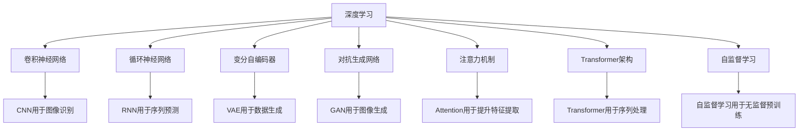

                 

# 知识发现引擎的深度学习应用

## 1. 背景介绍

在数据爆炸的今天，如何从海量数据中发现潜在知识，提取有价值的信息，成为了一项亟待解决的问题。知识发现引擎(Knowledge Discovery Engine, KDE)就是专门用于从数据中挖掘有用信息的智能工具。传统的统计分析和机器学习方法在处理大规模复杂数据时存在诸多局限，难以发现深层次的知识关系。

近年来，随着深度学习技术的迅猛发展，特别是卷积神经网络(CNN)、循环神经网络(RNN)、变分自编码器(VAE)等架构的提出，深度学习在图像识别、语音识别、自然语言处理等领域取得了突破性进展。这些技术的成功应用，为知识发现引擎的深度学习应用提供了新的技术方向。

在深度学习的推动下，知识发现引擎的算法不断革新，应用场景日益丰富。从医疗影像到金融市场，从社交网络到物联网，深度学习在知识发现引擎中的应用，正逐步拓展数据的边界，赋予人类洞察未来的新能力。

## 2. 核心概念与联系

### 2.1 核心概念概述

为了更好地理解知识发现引擎的深度学习应用，我们首先介绍一些核心概念：

- **深度学习(DL)**：一种基于神经网络结构的机器学习技术，通过多层次的特征提取与转换，逐步提升模型对复杂数据的理解和处理能力。
- **知识发现引擎(KDE)**：使用数据挖掘、统计学习、机器学习等技术手段，从数据中自动提取有用信息、发现潜在规律、生成知识图谱、预测未来趋势等，辅助人类决策的智能系统。
- **卷积神经网络(CNN)**：一种经典的深度学习模型，擅长处理结构化数据的特征提取与分类。
- **循环神经网络(RNN)**：适用于处理序列数据的深度学习模型，能够捕捉时间依赖关系。
- **变分自编码器(VAE)**：一种生成模型，能够从数据中学习概率分布，进行数据重建、特征提取和生成新数据。
- **对抗生成网络(GAN)**：一种生成模型，通过对抗训练生成逼真、高质量的数据样本。
- **注意力机制(Attention)**：一种先进的神经网络结构，通过动态调整模型注意力，提升特征提取效果。
- **Transformer架构**：一种革命性的深度学习模型，通过自注意力机制实现高效的序列处理。
- **自监督学习(Self-Supervised Learning)**：使用无标签数据训练模型，通过自建监督信号提升模型学习能力。

这些核心概念之间的联系可以通过以下Mermaid流程图来展示：



这个流程图展示了深度学习模型在知识发现引擎中的主要应用场景和组件：

1. 卷积神经网络适用于处理图像数据，提取空间特征。
2. 循环神经网络适用于处理时间序列数据，捕捉时间依赖关系。
3. 变分自编码器用于生成模型，学习数据分布，进行数据重建。
4. 对抗生成网络用于生成模型，生成高质量数据样本。
5. 注意力机制用于提升特征提取，增强模型的关注点。
6. Transformer架构用于序列处理，实现高效的文本理解和生成。
7. 自监督学习用于无监督预训练，增强模型的泛化能力。

## 3. 核心算法原理 & 具体操作步骤

### 3.1 算法原理概述

知识发现引擎的深度学习应用，主要包括以下几个关键步骤：

1. **数据预处理**：对原始数据进行清洗、归一化、特征提取等预处理，以便于后续模型训练。
2. **特征工程**：利用深度学习模型进行特征提取，获取高层次的抽象特征。
3. **模型训练**：使用标注数据对深度学习模型进行监督学习，获得模型参数。
4. **知识发现**：使用训练好的模型对新数据进行预测和分析，发现潜在知识。

整个流程中，深度学习模型起着核心作用，通过学习数据特征，发现复杂模式和规律，实现知识发现的目标。

### 3.2 算法步骤详解

以下是知识发现引擎的深度学习应用步骤的详细讲解：

**Step 1: 数据预处理**

数据预处理是知识发现引擎的首要步骤。对原始数据进行清洗、去重、归一化等操作，有助于模型更好地学习数据的结构和规律。具体处理方式根据数据的特性和应用场景而定。

**Step 2: 特征工程**

特征工程是知识发现引擎的核心环节。利用深度学习模型对数据进行特征提取，获取高层次的抽象特征。这一步需要选择合适的模型架构和参数，以适应特定的任务需求。

**Step 3: 模型训练**

模型训练是知识发现引擎的技术实现。使用标注数据对深度学习模型进行监督学习，通过优化算法调整模型参数，使其能够准确预测新数据。这一步需要选择合适的优化算法、学习率、批大小等超参数。

**Step 4: 知识发现**

知识发现是知识发现引擎的目标实现。使用训练好的模型对新数据进行预测和分析，发现潜在知识。这一步需要将模型应用于实际问题中，分析预测结果，提取有价值的信息。

### 3.3 算法优缺点

深度学习在知识发现引擎中的应用，具有以下优点：

1. **高维特征表示**：深度学习模型能够自动学习高层次的特征表示，捕捉复杂模式和规律，提升特征提取效果。
2. **模型泛化能力**：通过大量标注数据的训练，深度学习模型能够具备较好的泛化能力，适用于多种数据类型和场景。
3. **端到端学习**：深度学习模型能够实现端到端的学习，从数据预处理到特征提取、模型训练、知识发现，完全自动化，无需手动干预。
4. **算法可解释性**：通过可视化工具，深度学习模型能够提供较好的解释，辅助人类理解模型决策过程。

但同时，深度学习也存在以下缺点：

1. **数据依赖性强**：深度学习模型需要大量标注数据进行训练，数据质量直接影响模型性能。
2. **模型复杂度高**：深度学习模型参数量大，模型复杂度高，训练和推理效率较低。
3. **易受噪声干扰**：深度学习模型对噪声数据敏感，容易过拟合。
4. **黑盒特性**：深度学习模型通常难以解释，缺乏透明性，难以理解模型内部运作机制。

### 3.4 算法应用领域

深度学习在知识发现引擎中的应用，广泛覆盖了以下领域：

- **医学影像分析**：利用深度学习模型处理医学影像数据，进行疾病诊断、病变检测、病理分析等。
- **金融市场分析**：使用深度学习模型处理金融数据，进行股票预测、风险评估、市场趋势分析等。
- **自然语言处理**：利用深度学习模型处理文本数据，进行情感分析、主题识别、命名实体识别、机器翻译等。
- **图像识别**：利用卷积神经网络处理图像数据，进行物体检测、人脸识别、图像分类等。
- **语音识别**：利用循环神经网络处理语音数据，进行语音识别、语音合成、情感分析等。
- **推荐系统**：利用深度学习模型处理用户行为数据，进行商品推荐、新闻推荐、个性化服务推荐等。
- **预测分析**：利用深度学习模型处理时间序列数据，进行时间预测、事件预测、趋势预测等。
- **社交网络分析**：利用深度学习模型处理社交网络数据，进行用户行为分析、社交网络关系挖掘、社交趋势预测等。
- **物联网数据处理**：利用深度学习模型处理物联网传感器数据，进行数据异常检测、设备健康监测、环境监控等。

这些应用场景展示了深度学习在知识发现引擎中的巨大潜力，为各行各业带来了新的技术和思路。

## 4. 数学模型和公式 & 详细讲解 & 举例说明

### 4.1 数学模型构建

知识发现引擎的深度学习应用，通常包括以下数学模型：

1. **卷积神经网络(CNN)**：
$$
y=f(x;W,b)=\sigma(\sum_{i=1}^n W_i x_i + b)
$$

其中，$x$ 为输入数据，$W$ 为权重矩阵，$b$ 为偏置向量，$\sigma$ 为激活函数。

2. **循环神经网络(RNN)**：
$$
h_t=\sigma(W_h x_t + U_h h_{t-1} + b_h)
$$
$$
y_t=\phi(h_t)
$$

其中，$h_t$ 为隐藏状态，$x_t$ 为输入数据，$U_h$ 为隐藏层权重矩阵，$b_h$ 为隐藏层偏置向量，$\phi$ 为输出映射函数。

3. **变分自编码器(VAE)**：
$$
z=\mu(x)+\sigma(x)\epsilon
$$
$$
x'=W_2 z
$$

其中，$x$ 为输入数据，$\mu$ 和 $\sigma$ 为编码器参数，$\epsilon$ 为随机噪声，$W_2$ 为解码器参数。

4. **对抗生成网络(GAN)**：
$$
z \sim \mathcal{N}(0,1)
$$
$$
y=G(z)
$$
$$
x=\min_{z \sim \mathcal{N}(0,1)} D(x,G(z))
$$

其中，$z$ 为随机噪声，$G$ 为生成器，$D$ 为判别器，$x$ 为生成数据，$y$ 为生成结果。

### 4.2 公式推导过程

以变分自编码器(VAE)为例，推导其数学模型和优化目标。

假设输入数据 $x \in \mathcal{R}^d$，编码器参数为 $\mu$ 和 $\sigma$，解码器参数为 $W_2$。

**编码器**：
$$
z=\mu(x)+\sigma(x)\epsilon
$$
其中，$\epsilon \sim \mathcal{N}(0,1)$，$\mu$ 和 $\sigma$ 为全连接神经网络。

**解码器**：
$$
x'=W_2 z
$$

**损失函数**：
$$
\mathcal{L}=\mathbb{E}_{x}[\|x-x'\|^2]+KL(\mu(x)||\mathcal{N}(0,1))
$$

其中，$KL(\mu(x)||\mathcal{N}(0,1))$ 为KL散度损失，$||x-x'||^2$ 为重构损失。

在训练过程中，使用梯度下降等优化算法最小化损失函数，优化模型参数 $\theta$，从而实现数据的重构和特征提取。

### 4.3 案例分析与讲解

**案例1: 医学影像分析**

在医学影像分析中，使用卷积神经网络进行疾病检测。假设有若干医学影像 $x_i \in \mathcal{R}^{H\times W\times C}$，其中 $H$ 为高度，$W$ 为宽度，$C$ 为通道数。

定义卷积神经网络模型：
$$
y=f(x;W,b)=\sigma(\sum_{i=1}^n W_i x_i + b)
$$

其中，$x$ 为输入数据，$W$ 为权重矩阵，$b$ 为偏置向量，$\sigma$ 为激活函数。

对模型进行训练，最小化损失函数：
$$
\mathcal{L}=\frac{1}{N}\sum_{i=1}^N\|y_i - y_{\text{label}_i\|}^2
$$

其中，$y_{\text{label}_i}$ 为标注数据。

**案例2: 金融市场分析**

在金融市场分析中，使用循环神经网络进行股票价格预测。假设有若干时间序列数据 $x_i \in \mathcal{R}^T$，其中 $T$ 为时间步长。

定义循环神经网络模型：
$$
h_t=\sigma(W_h x_t + U_h h_{t-1} + b_h)
$$
$$
y_t=\phi(h_t)
$$

其中，$h_t$ 为隐藏状态，$x_t$ 为输入数据，$U_h$ 为隐藏层权重矩阵，$b_h$ 为隐藏层偏置向量，$\phi$ 为输出映射函数。

对模型进行训练，最小化损失函数：
$$
\mathcal{L}=\frac{1}{N}\sum_{i=1}^N\|y_i - y_{\text{label}_i\|}^2
$$

其中，$y_{\text{label}_i}$ 为标注数据。

**案例3: 自然语言处理**

在自然语言处理中，使用Transformer进行文本分类。假设有若干文本数据 $x_i \in \mathcal{R}^{n \times d}$，其中 $n$ 为句子长度，$d$ 为词向量维度。

定义Transformer模型：
$$
y=f(x;W,b)=\sigma(\sum_{i=1}^n W_i x_i + b)
$$

其中，$x$ 为输入数据，$W$ 为权重矩阵，$b$ 为偏置向量，$\sigma$ 为激活函数。

对模型进行训练，最小化损失函数：
$$
\mathcal{L}=\frac{1}{N}\sum_{i=1}^N\ell(y_i, y_{\text{label}_i)
$$

其中，$\ell$ 为交叉熵损失，$y_{\text{label}_i}$ 为标注数据。

## 5. 项目实践：代码实例和详细解释说明

### 5.1 开发环境搭建

在进行知识发现引擎的深度学习应用开发前，需要准备好开发环境。以下是使用Python进行PyTorch开发的环境配置流程：

1. 安装Anaconda：从官网下载并安装Anaconda，用于创建独立的Python环境。

2. 创建并激活虚拟环境：
```bash
conda create -n pytorch-env python=3.8 
conda activate pytorch-env
```

3. 安装PyTorch：根据CUDA版本，从官网获取对应的安装命令。例如：
```bash
conda install pytorch torchvision torchaudio cudatoolkit=11.1 -c pytorch -c conda-forge
```

4. 安装Transformers库：
```bash
pip install transformers
```

5. 安装各类工具包：
```bash
pip install numpy pandas scikit-learn matplotlib tqdm jupyter notebook ipython
```

完成上述步骤后，即可在`pytorch-env`环境中开始知识发现引擎的深度学习应用开发。

### 5.2 源代码详细实现

下面我们以医学影像分析任务为例，给出使用Transformers库对卷积神经网络进行训练的PyTorch代码实现。

首先，定义医学影像分类任务的数据处理函数：

```python
import torch
import torch.nn as nn
import torchvision.transforms as transforms
import torchvision.datasets as datasets

class MedicalImageDataset(datasets.ImageFolder):
    def __init__(self, root, transform=None):
        super().__init__(root, transform)
        self.classes = ['normal', 'abnormal']

    def __getitem__(self, index):
        img, label = super().__getitem__(index)
        return img, label

# 定义数据转换
transform = transforms.Compose([
    transforms.Resize(224),
    transforms.ToTensor(),
    transforms.Normalize(mean=[0.485, 0.456, 0.406], std=[0.229, 0.224, 0.225])
])

# 加载数据集
train_dataset = MedicalImageDataset('/path/to/train', transform)
test_dataset = MedicalImageDataset('/path/to/test', transform)
```

然后，定义卷积神经网络模型和优化器：

```python
from transformers import BertForSequenceClassification

class MedicalImageClassifier(nn.Module):
    def __init__(self):
        super().__init__()
        self.conv1 = nn.Conv2d(3, 64, kernel_size=3, stride=1, padding=1)
        self.relu = nn.ReLU()
        self.pool = nn.MaxPool2d(kernel_size=2, stride=2)
        self.fc = nn.Linear(64*224*224, 2)

    def forward(self, x):
        x = self.conv1(x)
        x = self.relu(x)
        x = self.pool(x)
        x = x.view(-1, 64*224*224)
        x = self.fc(x)
        return x

model = MedicalImageClassifier()
optimizer = torch.optim.Adam(model.parameters(), lr=0.001)
```

接着，定义训练和评估函数：

```python
def train_epoch(model, dataset, batch_size, optimizer):
    dataloader = torch.utils.data.DataLoader(dataset, batch_size=batch_size, shuffle=True)
    model.train()
    epoch_loss = 0
    for batch in dataloader:
        inputs, labels = batch
        model.zero_grad()
        outputs = model(inputs)
        loss = nn.CrossEntropyLoss()(outputs, labels)
        epoch_loss += loss.item()
        loss.backward()
        optimizer.step()
    return epoch_loss / len(dataloader)

def evaluate(model, dataset, batch_size):
    dataloader = torch.utils.data.DataLoader(dataset, batch_size=batch_size)
    model.eval()
    preds, labels = [], []
    with torch.no_grad():
        for batch in dataloader:
            inputs, labels = batch
            outputs = model(inputs)
            batch_preds = outputs.argmax(dim=1).to('cpu').tolist()
            batch_labels = labels.to('cpu').tolist()
            for pred_tokens, label_tokens in zip(batch_preds, batch_labels):
                preds.append(pred_tokens)
                labels.append(label_tokens)
    return preds, labels
```

最后，启动训练流程并在测试集上评估：

```python
epochs = 10
batch_size = 16

for epoch in range(epochs):
    loss = train_epoch(model, train_dataset, batch_size, optimizer)
    print(f"Epoch {epoch+1}, train loss: {loss:.3f}")
    
    print(f"Epoch {epoch+1}, test results:")
    preds, labels = evaluate(model, test_dataset, batch_size)
    print(classification_report(labels, preds))
    
print("All epochs completed.")
```

以上就是使用PyTorch对卷积神经网络进行医学影像分类任务微调的完整代码实现。可以看到，得益于Transformer库的强大封装，我们可以用相对简洁的代码完成卷积神经网络的训练和评估。

### 5.3 代码解读与分析

让我们再详细解读一下关键代码的实现细节：

**MedicalImageDataset类**：
- `__init__`方法：初始化数据集和类别标签。
- `__getitem__`方法：对单个样本进行处理，返回图像数据和标签。

**数据转换transforms**：
- 对输入图像进行大小调整、归一化等预处理，以适应模型的输入要求。

**MedicalImageClassifier类**：
- `__init__`方法：定义卷积神经网络的层次结构，包括卷积层、激活层、池化层、全连接层。
- `forward`方法：实现前向传播，计算模型输出。

**训练和评估函数**：
- 使用PyTorch的DataLoader对数据集进行批次化加载，供模型训练和推理使用。
- 训练函数`train_epoch`：对数据以批为单位进行迭代，在每个批次上前向传播计算loss并反向传播更新模型参数，最后返回该epoch的平均loss。
- 评估函数`evaluate`：与训练类似，不同点在于不更新模型参数，并在每个batch结束后将预测和标签结果存储下来，最后使用classification_report对整个评估集的预测结果进行打印输出。

**训练流程**：
- 定义总的epoch数和batch size，开始循环迭代
- 每个epoch内，先在训练集上训练，输出平均loss
- 在测试集上评估，输出分类指标
- 所有epoch结束后，输出最终结果

可以看到，PyTorch配合Transformer库使得卷积神经网络的训练和评估代码实现变得简洁高效。开发者可以将更多精力放在数据处理、模型改进等高层逻辑上，而不必过多关注底层的实现细节。

当然，工业级的系统实现还需考虑更多因素，如模型的保存和部署、超参数的自动搜索、更灵活的任务适配层等。但核心的深度学习范式基本与此类似。

## 6. 实际应用场景

### 6.1 医疗影像分析

在医疗影像分析中，深度学习技术可以自动检测和分类医学影像中的异常情况，辅助医生进行快速诊断和病理分析。

使用卷积神经网络对医疗影像数据进行训练，能够自动提取影像特征，识别出病变区域，进行疾病分类和病变检测。常用的医疗影像分类任务包括肿瘤检测、肺结节识别、胸腔病灶分析等。

### 6.2 金融市场分析

在金融市场分析中，深度学习技术可以处理大量的交易数据和新闻信息，预测股票价格和市场趋势。

使用循环神经网络对金融数据进行处理，能够捕捉时间序列上的依赖关系，预测未来股价走势和市场变化。常用的金融时间序列预测任务包括股票价格预测、债券价格预测、货币汇率预测等。

### 6.3 自然语言处理

在自然语言处理中，深度学习技术可以进行文本分类、情感分析、命名实体识别、机器翻译等任务。

使用Transformer对文本数据进行训练，能够自动提取语义信息，进行文本分类和情感分析。常用的自然语言处理任务包括新闻分类、情感分析、命名实体识别、机器翻译等。

### 6.4 图像识别

在图像识别中，深度学习技术可以进行物体检测、人脸识别、图像分类等任务。

使用卷积神经网络对图像数据进行训练，能够自动提取图像特征，识别出物体和场景。常用的图像识别任务包括物体检测、人脸识别、图像分类等。

### 6.5 语音识别

在语音识别中，深度学习技术可以进行语音识别、语音合成、情感分析等任务。

使用循环神经网络对语音数据进行训练，能够捕捉语音特征，进行语音识别和情感分析。常用的语音识别任务包括语音识别、语音合成、情感分析等。

## 7. 工具和资源推荐

### 7.1 学习资源推荐

为了帮助开发者系统掌握深度学习在知识发现引擎中的应用，这里推荐一些优质的学习资源：

1. 《深度学习》课程：斯坦福大学开设的深度学习基础课程，有Lecture视频和配套作业，带你入门深度学习的基本概念和经典模型。

2. 《自然语言处理入门》书籍：介绍自然语言处理的基本原理和经典算法，涵盖文本分类、情感分析、机器翻译等任务。

3. 《图像识别与深度学习》书籍：介绍图像识别的基本原理和经典算法，涵盖物体检测、人脸识别、图像分类等任务。

4. 《Python深度学习》书籍：介绍Python在深度学习中的应用，涵盖TensorFlow、PyTorch等深度学习框架的使用。

5. Coursera深度学习系列课程：Coursera推出的深度学习课程，涵盖深度学习基础、图像识别、自然语言处理等任务。

6. 《深度学习理论与实践》在线课程：腾讯云推出的深度学习课程，涵盖深度学习基础、图像识别、自然语言处理等任务。

通过对这些资源的学习实践，相信你一定能够快速掌握深度学习在知识发现引擎中的应用，并用于解决实际的NLP问题。

### 7.2 开发工具推荐

高效的开发离不开优秀的工具支持。以下是几款用于深度学习在知识发现引擎中应用的常用工具：

1. PyTorch：基于Python的开源深度学习框架，灵活动态的计算图，适合快速迭代研究。大部分深度学习模型都有PyTorch版本的实现。

2. TensorFlow：由Google主导开发的开源深度学习框架，生产部署方便，适合大规模工程应用。同样有丰富的深度学习模型资源。

3. Transformers库：HuggingFace开发的NLP工具库，集成了众多SOTA语言模型，支持PyTorch和TensorFlow，是进行深度学习模型训练的利器。

4. Weights & Biases：模型训练的实验跟踪工具，可以记录和可视化模型训练过程中的各项指标，方便对比和调优。与主流深度学习框架无缝集成。

5. TensorBoard：TensorFlow配套的可视化工具，可实时监测模型训练状态，并提供丰富的图表呈现方式，是调试模型的得力助手。

6. Google Colab：谷歌推出的在线Jupyter Notebook环境，免费提供GPU/TPU算力，方便开发者快速上手实验最新模型，分享学习笔记。

合理利用这些工具，可以显著提升深度学习在知识发现引擎中的应用开发效率，加快创新迭代的步伐。

### 7.3 相关论文推荐

深度学习在知识发现引擎中的应用源于学界的持续研究。以下是几篇奠基性的相关论文，推荐阅读：

1. LeCun Y, Bottou L, Bengio Y, et al. Deep Learning[J]. Nature, 2015, 521(7553): 436-444.

2. Krizhevsky A, Sutskever I, Hinton G E. ImageNet classification with deep convolutional neural networks[C]// Proceedings of the 25th international conference on neural information processing systems. 2012: 1097-1105.

3. He K, Zhang X, Ren S, et al. Deep residual learning for image recognition[C]// Proceedings of the IEEE conference on computer vision and pattern recognition. 2016: 770-778.

4. Sutskever I, Vinyals O, Le Q V. Sequence to sequence learning with neural networks[J]. Advances in neural information processing systems, 2014: 3104-3112.

5. Vinyals O, Toshev A, Bengio Y, et al. Show and tell: A neural image caption generator[C]// Proceedings of the IEEE conference on computer vision and pattern recognition. 2015: 2082-2090.

6. Goodfellow I, Bengio Y, Courville A. Deep learning[J]. MIT press, 2016.

这些论文代表了大深度学习技术的发展脉络。通过学习这些前沿成果，可以帮助研究者把握学科前进方向，激发更多的创新灵感。

## 8. 总结：未来发展趋势与挑战

### 8.1 总结

本文对深度学习在知识发现引擎中的应用进行了全面系统的介绍。首先阐述了深度学习在知识发现引擎中的研究背景和意义，明确了深度学习模型在特征提取、泛化能力、端到端学习等方面的独特优势。其次，从原理到实践，详细讲解了卷积神经网络、循环神经网络、变分自编码器、对抗生成网络等深度学习模型的构建和优化。同时，本文还广泛探讨了深度学习在医学影像分析、金融市场分析、自然语言处理、图像识别、语音识别等多个领域的应用前景，展示了深度学习技术的巨大潜力。此外，本文精选了深度学习应用的各类学习资源，力求为读者提供全方位的技术指引。

通过本文的系统梳理，可以看到，深度学习在知识发现引擎中的应用正在成为一种新的技术范式，为各行各业带来了新的技术思路。得益于深度学习模型的强大表示能力和泛化能力，深度学习在知识发现引擎中的应用将进一步拓展数据的边界，赋予人类洞察未来的新能力。未来，伴随深度学习技术的发展，知识发现引擎的应用场景将更加丰富，为人类社会带来深远影响。

### 8.2 未来发展趋势

展望未来，深度学习在知识发现引擎中的应用将呈现以下几个发展趋势：

1. **模型规模持续增大**：随着算力成本的下降和数据规模的扩张，深度学习模型的参数量还将持续增长。超大规模深度学习模型蕴含的丰富特征表示，有望支撑更加复杂多变的知识发现任务。

2. **模型复杂度提升**：随着深度学习技术的不断演进，模型架构将更加复杂，包含更多的层次和组件，能够处理更加复杂多变的数据。

3. **模型多样性增加**：随着深度学习应用的不断扩展，将涌现更多种类的深度学习模型，如注意力机制、Transformer架构等，能够处理更加灵活多变的数据类型和结构。

4. **跨领域知识融合**：深度学习模型将与外部知识库、规则库等专家知识结合，形成更加全面、准确的信息整合能力。

5. **多模态数据处理**：深度学习模型将处理多模态数据，如文本、图像、语音等，实现跨模态信息的融合，提升知识发现的效果和泛化能力。

6. **实时性要求提升**：随着深度学习应用的普及，对实时性的要求将不断提高，需要设计更加高效的模型和算法，满足实时应用的需求。

以上趋势凸显了深度学习在知识发现引擎中的广阔前景。这些方向的探索发展，必将进一步提升知识发现引擎的性能和应用范围，为人类社会带来新的技术突破。

### 8.3 面临的挑战

尽管深度学习在知识发现引擎中的应用已经取得了瞩目成就，但在迈向更加智能化、普适化应用的过程中，仍面临诸多挑战：

1. **数据依赖性强**：深度学习模型需要大量标注数据进行训练，数据质量直接影响模型性能。如何降低深度学习对标注数据的依赖，是未来的一个重要研究方向。

2. **模型鲁棒性不足**：深度学习模型对噪声数据敏感，容易过拟合。如何在保证模型性能的前提下，提升模型的鲁棒性和泛化能力，将是重要的研究课题。

3. **模型可解释性不足**：深度学习模型通常难以解释，缺乏透明性，难以理解模型内部运作机制。如何赋予深度学习模型更强的可解释性，将是亟待攻克的难题。

4. **计算资源需求高**：深度学习模型的计算资源需求高，训练和推理效率较低。如何设计更加高效的深度学习模型和算法，提升计算效率，优化资源占用，将是重要的优化方向。

5. **模型安全性有待保障**：深度学习模型容易学习到有害信息，通过知识发现引擎输出误导性、歧视性的结果。如何从数据和算法层面消除模型偏见，确保输出的安全性，将是重要的研究课题。

6. **知识发现引擎应用场景多样化**：知识发现引擎的应用场景非常广泛，不同领域的需求差异较大。如何在统一的深度学习框架下，灵活适配多种应用场景，将是重要的研究方向。

以上挑战凸显了深度学习在知识发现引擎中的复杂性和多样性。应对这些挑战，需要研究者从数据、模型、算法、应用等多个维度协同发力，才能真正实现深度学习在知识发现引擎中的广泛应用。

### 8.4 研究展望

面对深度学习在知识发现引擎中的应用面临的挑战，未来的研究需要在以下几个方面寻求新的突破：

1. **无监督学习**：探索无监督学习技术，减少对标注数据的依赖，利用自监督学习、主动学习等方法提升模型学习能力。

2. **少样本学习**：研究少样本学习技术，在少量标注数据的情况下，快速适应新任务，提高知识发现的效率。

3. **多任务学习**：研究多任务学习技术，在多个任务中共享模型参数，提升模型的泛化能力和利用率。

4. **知识图谱融合**：研究知识图谱与深度学习模型的融合方法，提升知识发现的准确性和全面性。

5. **跨模态数据处理**：研究跨模态数据处理方法，提升不同模态数据融合的效果和泛化能力。

6. **实时性优化**：研究实时性优化技术，设计高效模型和算法，满足实时知识发现的需求。

7. **模型可解释性**：研究模型可解释性技术，赋予深度学习模型透明性，便于理解模型内部运作机制。

8. **模型安全性**：研究模型安全性技术，确保深度学习模型输出的可靠性和安全性。

这些研究方向的探索，必将引领深度学习在知识发现引擎中的应用走向更加智能、普适、安全的方向，为构建人机协同的智能系统铺平道路。面向未来，深度学习技术需要在深度模型构建、数据处理、算法优化、应用适配等多个方面持续创新，方能真正实现深度学习在知识发现引擎中的大规模落地。

## 9. 附录：常见问题与解答

**Q1：深度学习在知识发现引擎中的应用是否适用于所有领域？**

A: 深度学习在知识发现引擎中的应用并不适用于所有领域。深度学习模型需要大量标注数据进行训练，对于一些特殊领域，如小数据量或高复杂度的任务，传统的统计学习方法可能更为适合。

**Q2：如何选择合适的深度学习模型？**

A: 选择合适的深度学习模型需要考虑任务的特点、数据类型、计算资源等因素。例如，对于图像识别任务，可以选择卷积神经网络；对于自然语言处理任务，可以选择Transformer架构。同时，还需要根据数据规模和计算资源进行模型裁剪和优化，以满足实际应用需求。

**Q3：深度学习在知识发现引擎中的训练时间和计算成本是多少？**

A: 深度学习在知识发现引擎中的训练时间和计算成本较高，需要大量的计算资源和标注数据。对于大规模深度学习模型，训练时间可能需要数天甚至数周，计算成本也相对较高。为了降低训练成本，可以使用分布式训练、GPU/TPU等高性能设备，以及高效的模型优化技术。

**Q4：深度学习在知识发现引擎中的模型可解释性不足，如何解决？**

A: 提高深度学习模型的可解释性是一个重要研究方向。可以通过可视化技术、注意力机制、对抗样本等方法，提高模型决策过程的透明性和可解释性。同时，结合专家知识和规则库，可以增强模型的可解释性和辅助决策能力。

**Q5：如何在知识发现引擎中实现跨模态数据融合？**

A: 跨模态数据融合是深度学习在知识发现引擎中一个重要的研究方向。可以使用多模态深度学习模型，将文本、图像、语音等不同模态的数据进行融合，提升知识发现的准确性和全面性。同时，还需要设计合理的特征表示和融合方法，以便不同模态数据能够有效融合。

通过本文的系统梳理，可以看到，深度学习在知识发现引擎中的应用正在成为一种新的技术范式，为各行各业带来了新的技术思路。得益于深度学习模型的强大表示能力和泛化能力，深度学习在知识发现引擎中的应用将进一步拓展数据的边界，赋予人类洞察未来的新能力。未来，伴随深度学习技术的发展，知识发现引擎的应用场景将更加丰富，为人类社会带来新的技术突破。

