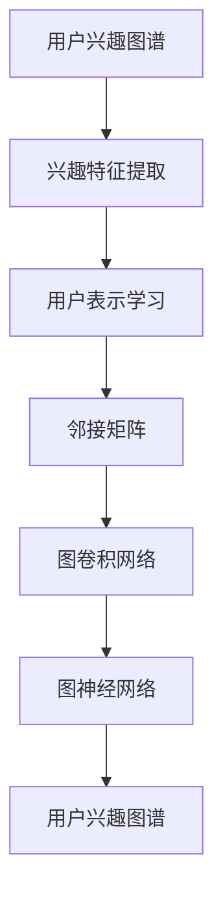

                 

# 知识发现引擎的用户兴趣图谱构建

## 1. 背景介绍

### 1.1 问题由来
在现代信息爆炸的时代，用户每天接触的海量信息源构成了他们复杂多变的知识图谱，如何从中挖掘和构建用户兴趣图谱，以驱动个性化推荐和智能搜索，成为了亟需解决的难题。传统的推荐系统往往依赖于用户的历史行为数据，但数据稀疏且缺乏跨域关联，难以全面把握用户真正的兴趣偏好。

### 1.2 问题核心关键点
构建用户兴趣图谱的核心在于如何从用户与信息源的交互行为中提取高质量的兴趣特征，并通过这些特征构建用户间以及用户与信息源间的关联网络，从而准确地描述用户的兴趣图谱。

### 1.3 问题研究意义
构建用户兴趣图谱对于个性化推荐和智能搜索系统具有重要意义：
- 提高推荐准确性。用户兴趣图谱能提供更全面、深层次的兴趣刻画，从而实现更高精度的个性化推荐。
- 提升搜索效果。准确的兴趣图谱能优化搜索结果排序，更好地满足用户需求。
- 促进知识发现。用户兴趣图谱能挖掘用户兴趣的共性和特性，揭示潜在的知识结构和关联。

## 2. 核心概念与联系

### 2.1 核心概念概述

为更好地理解用户兴趣图谱构建方法，本节将介绍几个关键概念：

- 用户兴趣图谱：用于描述用户与信息源的兴趣关联网络，由用户节点和信息源节点以及它们之间的边组成。
- 兴趣特征提取：通过分析用户与信息源的交互行为，提取描述用户兴趣的特征。
- 用户表示学习：通过机器学习模型，将用户兴趣特征映射为用户嵌入向量，用于构建用户兴趣图谱。
- 邻接矩阵：表示用户节点和信息源节点之间连接的矩阵，用于描述用户兴趣图谱的拓扑结构。
- 图卷积网络(Graph Convolutional Network, GCN)：一种特殊的神经网络，用于处理图结构数据，能够自动学习图的拓扑结构，提取图上的信息。
- 图神经网络(Graph Neural Network, GNN)：一种结合图结构与神经网络的模型，能够处理任意规模的图数据。

这些核心概念之间的逻辑关系可以通过以下Mermaid流程图来展示：



这个流程图展示了从用户兴趣图谱到兴趣特征提取、用户表示学习、邻接矩阵构建、图卷积网络处理、最终形成用户兴趣图谱的核心过程。

## 3. 核心算法原理 & 具体操作步骤
### 3.1 算法原理概述

用户兴趣图谱构建基于图结构数据，采用图神经网络模型进行处理。其核心思想是：将用户与信息源的交互行为作为图上的边，利用邻接矩阵描述它们之间的连接关系，通过图神经网络模型自动学习图上的信息，提取用户的兴趣特征，并构建用户兴趣图谱。

形式化地，设用户集合为 $U=\{u_1, u_2, ..., u_m\}$，信息源集合为 $I=\{i_1, i_2, ..., i_n\}$，用户与信息源之间的交互关系可以表示为邻接矩阵 $A \in \{0, 1\}^{m \times n}$。用户表示学习模型的输出为用户嵌入向量 $\mathbf{h}_u \in \mathbb{R}^d$，其中 $d$ 为向量维度。图神经网络模型根据邻接矩阵 $A$ 和用户嵌入向量 $\mathbf{h}_u$ 学习用户兴趣图谱 $\mathcal{G}=(U, I, A)$。

### 3.2 算法步骤详解

用户兴趣图谱构建通常包括以下几个关键步骤：

**Step 1: 构建邻接矩阵**

邻接矩阵 $A$ 描述了用户节点和信息源节点之间的连接关系，可以是稀疏矩阵，其中的元素 $A_{ui}$ 表示用户 $u$ 是否与信息源 $i$ 有交互行为。如果存在交互，则 $A_{ui}=1$，否则 $A_{ui}=0$。邻接矩阵的构建方式多种多样，可以根据具体场景和需求选择。

**Step 2: 提取用户兴趣特征**

用户兴趣特征可以通过分析用户与信息源的交互行为得到。常见的兴趣特征包括点击、浏览、评分、评论等。这些特征可以构成一个高维向量 $\mathbf{x}_u \in \mathbb{R}^{d'}$，其中 $d'$ 为特征维度。

**Step 3: 用户表示学习**

通过机器学习模型将用户兴趣特征 $\mathbf{x}_u$ 映射为用户嵌入向量 $\mathbf{h}_u$。用户表示学习模型的输入为邻接矩阵 $A$ 和用户兴趣特征 $\mathbf{x}_u$，输出为用户嵌入向量 $\mathbf{h}_u$。模型可以是单层神经网络、多层神经网络或图神经网络等。

**Step 4: 构建用户兴趣图谱**

利用用户嵌入向量 $\mathbf{h}_u$ 和邻接矩阵 $A$，可以构建用户兴趣图谱 $\mathcal{G}=(U, I, A)$。图谱中的每个用户节点对应一个用户嵌入向量，边权重可以表示为邻接矩阵 $A$ 的元素。

**Step 5: 模型训练与优化**

用户表示学习模型的训练过程通常采用交叉熵损失函数，最小化预测值与真实值之间的差异。模型参数的更新采用梯度下降等优化算法。

### 3.3 算法优缺点

用户兴趣图谱构建方法具有以下优点：
1. 全面描述用户兴趣。通过用户与信息源的连接关系，可以全面刻画用户的兴趣特征。
2. 动态适应用户兴趣变化。用户兴趣图谱能动态更新，随时捕捉用户兴趣的变化。
3. 提升推荐和搜索效果。准确的兴趣图谱能优化推荐和搜索的排序，提高用户体验。
4. 促进知识发现。用户兴趣图谱揭示了用户间以及用户与信息源间的关联，有助于知识发现。

同时，该方法也存在一定的局限性：
1. 数据获取成本高。构建邻接矩阵需要获取大量的用户与信息源的交互数据，这些数据的获取成本较高。
2. 特征维度高。用户兴趣特征的维度较高，可能导致模型训练复杂度高。
3. 模型计算量大。图神经网络模型的计算量较大，需要较强的计算资源。

尽管存在这些局限性，用户兴趣图谱构建方法仍是大数据时代个性化推荐和智能搜索的重要工具。未来相关研究的重点在于如何降低数据获取成本，提高特征维度降低的模型训练效率，同时兼顾计算资源的管理和优化。

### 3.4 算法应用领域

用户兴趣图谱构建技术在多个领域有着广泛的应用：

- 个性化推荐：通过用户兴趣图谱，可以生成个性化的推荐列表，满足用户的多样化需求。
- 智能搜索：利用用户兴趣图谱，可以优化搜索结果排序，提高搜索的准确性和效率。
- 社交网络：可以构建用户间兴趣的社交网络，发现用户间的兴趣交集和潜在关系。
- 信息过滤：通过用户兴趣图谱，可以过滤掉与用户兴趣不相关的信息，提高信息的相关性。
- 知识图谱：结合用户兴趣图谱，可以构建用户间的知识图谱，发现知识间的关联。

除了上述这些经典应用外，用户兴趣图谱构建技术还适用于更多场景，如情感分析、舆情监测、推荐系统评测等，为多领域的智能化发展提供了新的工具和方法。

## 4. 数学模型和公式 & 详细讲解  
### 4.1 数学模型构建

本节将使用数学语言对用户兴趣图谱构建过程进行更加严格的刻画。

记用户集合为 $U=\{u_1, u_2, ..., u_m\}$，信息源集合为 $I=\{i_1, i_2, ..., i_n\}$，邻接矩阵为 $A \in \{0, 1\}^{m \times n}$，用户兴趣特征为 $\mathbf{x}_u \in \mathbb{R}^{d'}$。

定义用户表示学习模型的输入为邻接矩阵 $A$ 和用户兴趣特征 $\mathbf{x}_u$，输出为用户嵌入向量 $\mathbf{h}_u \in \mathbb{R}^d$。用户表示学习模型的损失函数为 $\mathcal{L}(\mathbf{h}_u) = \frac{1}{m} \sum_{u=1}^m \|y_u - \mathbf{h}_u \|^2$，其中 $y_u$ 为用户的真实标签。

### 4.2 公式推导过程

以下我们以GraphSAGE模型为例，推导用户表示学习的公式。

GraphSAGE是一种图卷积神经网络，其公式如下：

$$
\mathbf{h}_u^{(l+1)} = \sigma(\mathbf{W}^{(l+1)} \sum_{v \in N(u)} \frac{1}{\text{deg}(v)} \mathbf{h}_v^{(l)} + \mathbf{b}^{(l+1)})
$$

其中 $\sigma$ 为激活函数，$\mathbf{W}^{(l+1)}$ 和 $\mathbf{b}^{(l+1)}$ 为第 $l+1$ 层的参数，$N(u)$ 表示与用户 $u$ 连接的邻居节点集合，$\text{deg}(v)$ 表示节点 $v$ 的度数。

在每一层中，GraphSAGE先对邻居节点的嵌入向量进行加权平均，再通过线性变换和激活函数，得到当前节点的嵌入向量。

### 4.3 案例分析与讲解

假设某电商平台的个性化推荐系统，收集了用户对商品的点击、浏览、评分、评论等行为数据。这些行为数据构成了邻接矩阵 $A$ 和用户兴趣特征 $\mathbf{x}_u$。通过GraphSAGE模型，可以学习用户嵌入向量 $\mathbf{h}_u$，构建用户兴趣图谱 $\mathcal{G}=(U, I, A)$。最终，利用用户嵌入向量 $\mathbf{h}_u$ 和邻接矩阵 $A$，可以生成个性化的推荐列表，满足用户的不同需求。

## 5. 项目实践：代码实例和详细解释说明
### 5.1 开发环境搭建

在进行用户兴趣图谱构建实践前，我们需要准备好开发环境。以下是使用Python进行PyTorch开发的环境配置流程：

1. 安装Anaconda：从官网下载并安装Anaconda，用于创建独立的Python环境。

2. 创建并激活虚拟环境：
```bash
conda create -n pytorch-env python=3.8 
conda activate pytorch-env
```

3. 安装PyTorch：根据CUDA版本，从官网获取对应的安装命令。例如：
```bash
conda install pytorch torchvision torchaudio cudatoolkit=11.1 -c pytorch -c conda-forge
```

4. 安装各类工具包：
```bash
pip install numpy pandas scikit-learn matplotlib tqdm jupyter notebook ipython
```

完成上述步骤后，即可在`pytorch-env`环境中开始用户兴趣图谱构建实践。

### 5.2 源代码详细实现

这里我们以GraphSAGE模型为例，使用PyTorch实现用户表示学习。

首先，定义GraphSAGE模型的网络结构：

```python
import torch
import torch.nn as nn
import torch.nn.functional as F

class GraphSAGE(nn.Module):
    def __init__(self, in_features, hidden_size, out_features):
        super(GraphSAGE, self).__init__()
        self.W = nn.Linear(in_features, hidden_size)
        self.linear = nn.Linear(hidden_size, out_features)
        self.activ = nn.ReLU()
    
    def forward(self, x, adj):
        x = self.W(x)
        x = self.linear(x)
        x = self.activ(x)
        return x
    
    def message_passing(self, x, adj):
        # 计算邻居节点的加权平均
        # 邻接矩阵转换为Tensor形式
        adj = adj.to_sparse().transpose(0, 1)
        # 对每个节点计算加权平均
        x_avg = torch.sparse.mm(adj, x)
        # 归一化邻接矩阵
        deg = torch.sum(adj, 1) + 1e-6
        x_avg = x_avg / deg.view(-1, 1)
        return x_avg
```

然后，定义用户表示学习模型的训练函数：

```python
import numpy as np
import torch
from scipy.sparse import coo_matrix
import pandas as pd

# 加载用户与商品的数据
user_item = pd.read_csv('user_item.csv')
user = pd.read_csv('user.csv')
item = pd.read_csv('item.csv')

# 构建邻接矩阵
A = coo_matrix((np.ones(user_item.shape[0]), (user_item['user_id'], user_item['item_id'])))
A = A.tocsr()

# 构建用户嵌入向量
num_users = user.shape[0]
num_items = item.shape[0]
hidden_size = 128
out_features = 64

G = GraphSAGE(in_features=num_items, hidden_size=hidden_size, out_features=out_features)
optimizer = torch.optim.Adam(G.parameters(), lr=0.001)

for epoch in range(100):
    # 随机采样一批数据
    u_idx = np.random.choice(num_users, batch_size)
    i_idx = user_item.loc[user_item['user_id'].isin(u_idx), 'item_id'].tolist()
    batch_user = user.iloc[u_idx].values
    batch_item = item.iloc[i_idx].values
    batch_adj = A[u_idx]
    
    # 前向传播
    G(batch_item, batch_adj)
    
    # 计算损失
    loss = G.loss(batch_user)
    
    # 反向传播
    optimizer.zero_grad()
    loss.backward()
    optimizer.step()
```

最后，启动用户兴趣图谱的构建流程：

```python
# 训练用户表示学习模型
G.train()

# 前向传播
G(batch_item, batch_adj)

# 计算损失
loss = G.loss(batch_user)

# 反向传播
optimizer.zero_grad()
loss.backward()

# 更新模型参数
optimizer.step()
```

在训练完成后，利用用户嵌入向量 $\mathbf{h}_u$ 和邻接矩阵 $A$，可以构建用户兴趣图谱 $\mathcal{G}=(U, I, A)$，并进行个性化推荐等应用。

### 5.3 代码解读与分析

让我们再详细解读一下关键代码的实现细节：

**GraphSAGE类**：
- `__init__`方法：初始化模型的线性变换层和激活函数。
- `forward`方法：实现模型的前向传播。
- `message_passing`方法：实现图卷积网络的消息传递过程。

**训练函数**：
- 加载用户与商品的数据，构建邻接矩阵 $A$。
- 定义用户嵌入向量 $\mathbf{h}_u$ 的维度，初始化模型参数和优化器。
- 循环训练模型，每个epoch中随机采样一批数据，前向传播计算损失，反向传播更新模型参数。

**前向传播和损失计算**：
- 随机采样一批用户 $u$ 和商品 $i$，计算邻接矩阵 $A$。
- 利用GraphSAGE模型计算用户嵌入向量 $\mathbf{h}_u$。
- 计算损失函数，用于衡量模型预测的用户嵌入向量与真实标签之间的差异。

通过以上代码，可以看出用户兴趣图谱构建过程涉及邻接矩阵构建、用户嵌入向量学习等多个环节，每个环节都需要精心设计和优化。

## 6. 实际应用场景
### 6.1 电商推荐系统

基于用户兴趣图谱的推荐系统可以广泛应用于电商平台的个性化推荐。传统的推荐系统往往依赖于用户的历史行为数据，难以全面捕捉用户的兴趣和需求。通过构建用户兴趣图谱，可以更全面地描述用户的兴趣特征，从而生成更精准的推荐结果。

在技术实现上，可以收集用户对商品的点击、浏览、评分、评论等行为数据，构建邻接矩阵 $A$ 和用户兴趣特征 $\mathbf{x}_u$。利用用户表示学习模型，可以学习用户嵌入向量 $\mathbf{h}_u$，构建用户兴趣图谱 $\mathcal{G}=(U, I, A)$。在推荐时，通过计算用户嵌入向量与商品嵌入向量之间的相似度，生成个性化的推荐列表。

### 6.2 新闻内容推荐

在新闻资讯类应用中，用户的兴趣变化非常快，需要动态更新用户兴趣图谱，以适应用户不断变化的需求。基于用户兴趣图谱的推荐系统，可以实时跟踪用户的新闻阅读行为，动态更新用户嵌入向量 $\mathbf{h}_u$，构建最新的用户兴趣图谱 $\mathcal{G}=(U, I, A)$。利用新的用户嵌入向量 $\mathbf{h}_u$ 和邻接矩阵 $A$，可以生成实时的新闻推荐列表，满足用户即时阅读的需求。

### 6.3 社交网络推荐

在社交网络中，用户的兴趣往往是多样化的，需要构建多层次的用户兴趣图谱，以涵盖不同领域的兴趣。基于用户兴趣图谱的推荐系统，可以分析用户在不同领域的兴趣特征，生成多层次的推荐列表，满足用户多样化的兴趣需求。例如，在构建用户兴趣图谱时，可以分别对音乐、书籍、电影等领域的兴趣进行建模，从而生成多维度的推荐结果。

### 6.4 未来应用展望

随着用户兴趣图谱构建技术的不断成熟，基于图神经网络的推荐系统将在更多领域得到应用，为传统行业带来变革性影响。

在智慧医疗领域，基于用户兴趣图谱的推荐系统可以推荐适合患者的医疗信息和资源，提高诊疗效率和效果。

在智能教育领域，用户兴趣图谱可以用于推荐适合学生的学习资源，个性化推荐学习路径，提升学习效果。

在智能城市治理中，用户兴趣图谱可以用于推荐适合市民的活动和事件，提高市民的参与度和满意度。

此外，在智能客服、智慧金融、智能安防等众多领域，用户兴趣图谱推荐系统也将不断涌现，为多领域的智能化发展提供新的动力。相信随着技术的进步，用户兴趣图谱构建方法将在更多领域得到应用，为用户带来更丰富、更个性化的体验。

## 7. 工具和资源推荐
### 7.1 学习资源推荐

为了帮助开发者系统掌握用户兴趣图谱构建的理论基础和实践技巧，这里推荐一些优质的学习资源：

1. GraphSAGE论文：论文详细介绍了GraphSAGE模型的原理和实现，是理解图神经网络模型的必读之作。

2. DeepLearning.ai NLP专项课程：由斯坦福大学教授Andrew Ng主讲，涵盖NLP领域的多个前沿主题，包括图神经网络、自然语言处理等。

3. PyTorch官方文档：提供了详细的PyTorch库的使用指南和代码示例，是学习深度学习模型的重要参考。

4. PyTorch Geometric库：专门用于处理图结构数据的库，提供了图神经网络的实现，支持高效的数据处理和模型训练。

5. GraphSAGE代码实现：GitHub上提供了GraphSAGE模型的代码实现，可以参考其实现过程，理解图神经网络的细节。

通过对这些资源的学习实践，相信你一定能够快速掌握用户兴趣图谱构建的精髓，并用于解决实际的推荐问题。

### 7.2 开发工具推荐

高效的开发离不开优秀的工具支持。以下是几款用于用户兴趣图谱构建开发的常用工具：

1. PyTorch：基于Python的开源深度学习框架，灵活动态的计算图，适合快速迭代研究。

2. TensorFlow：由Google主导开发的开源深度学习框架，生产部署方便，适合大规模工程应用。

3. PyTorch Geometric：专门用于处理图结构数据的库，提供了图神经网络的实现，支持高效的数据处理和模型训练。

4. NetworkX：Python中的图结构处理库，提供了丰富的图算法和分析工具，支持构建、处理和分析图数据。

5. Gephi：开源网络分析软件，支持可视化、分析和导出现有图数据，用于可视化用户兴趣图谱。

合理利用这些工具，可以显著提升用户兴趣图谱构建的开发效率，加快创新迭代的步伐。

### 7.3 相关论文推荐

用户兴趣图谱构建技术的发展源于学界的持续研究。以下是几篇奠基性的相关论文，推荐阅读：

1. GraphSAGE: GraphSAGE Network: A New Method for Training Graph Neural Networks：提出了GraphSAGE模型，用于处理图结构数据。

2. GAT: Graph Attention Networks：提出Graph Attention Network模型，用于处理图结构数据，具有自适应性强的优势。

3. GIN: Graph Isomorphism Network：提出Graph Isomorphism Network模型，用于处理图结构数据，具有高效计算的特点。

4. DGCNN: Dynamic Graph Convolutional Networks：提出Dynamic Graph Convolutional Network模型，用于处理动态图结构数据。

5. Graph Convolutional Networks：全面介绍了图卷积神经网络的原理和应用，是理解图神经网络模型的重要参考资料。

这些论文代表了大规模图结构数据的处理范式，为图神经网络模型的应用提供了理论支撑和实践经验。通过学习这些前沿成果，可以帮助研究者把握图神经网络的发展方向，激发更多的创新灵感。

## 8. 总结：未来发展趋势与挑战

### 8.1 总结

本文对基于图神经网络的用户兴趣图谱构建方法进行了全面系统的介绍。首先阐述了用户兴趣图谱构建的背景和意义，明确了构建方法在个性化推荐和智能搜索中的应用价值。其次，从原理到实践，详细讲解了用户兴趣图谱构建的数学模型和关键步骤，给出了用户兴趣图谱构建的代码实例。同时，本文还广泛探讨了用户兴趣图谱在电商、新闻、社交等多个领域的应用前景，展示了构建方法的巨大潜力。此外，本文精选了用户兴趣图谱构建的相关学习资源和开发工具，力求为开发者提供全方位的技术指引。

通过本文的系统梳理，可以看到，基于图神经网络的用户兴趣图谱构建方法已经成为推荐系统和智能搜索的重要工具，极大地拓展了用户兴趣描述的维度和深度，为个性化推荐和智能搜索系统带来了新的突破。未来，伴随图神经网络模型的不断演进，用户兴趣图谱构建技术必将走向更加成熟，为构建智能推荐和搜索系统提供更强大的数据支持和算法保障。

### 8.2 未来发展趋势

展望未来，用户兴趣图谱构建技术将呈现以下几个发展趋势：

1. 图神经网络模型的不断优化。图神经网络模型的计算效率和性能将在不断优化，以适应大规模图数据处理的需求。

2. 动态图结构的应用。未来的推荐系统将更关注动态图结构，以适应用户的实时行为变化。

3. 多层次兴趣建模。未来的用户兴趣图谱将更加丰富多样，涵盖不同领域的兴趣特征，提供多层次的推荐结果。

4. 结合其他AI技术。用户兴趣图谱将与自然语言处理、强化学习等AI技术结合，提升推荐系统的综合性能。

5. 隐私保护和安全性。随着用户数据的隐私保护越来越受到重视，用户兴趣图谱构建技术将更加注重数据的匿名化和隐私保护。

以上趋势凸显了用户兴趣图谱构建技术的广阔前景。这些方向的探索发展，必将进一步提升推荐系统的性能和应用范围，为用户的个性化需求提供更全面的支持。

### 8.3 面临的挑战

尽管用户兴趣图谱构建技术已经取得了瞩目成就，但在迈向更加智能化、普适化应用的过程中，它仍面临着诸多挑战：

1. 数据获取和标注成本高。构建用户兴趣图谱需要大量的用户行为数据，这些数据的获取和标注成本较高。

2. 模型计算量大。图神经网络模型的计算量较大，需要较强的计算资源，难以满足实时推荐的需求。

3. 特征维度高。用户兴趣特征的维度较高，可能导致模型训练复杂度高。

4. 模型鲁棒性不足。用户兴趣图谱可能受到异常数据的影响，模型鲁棒性需要进一步提升。

5. 隐私保护和安全性。用户数据的隐私保护和安全性问题，一直是用户兴趣图谱构建技术的难点。

尽管存在这些挑战，用户兴趣图谱构建技术仍是大数据时代个性化推荐和智能搜索的重要工具。未来相关研究的重点在于如何降低数据获取成本，提高模型训练效率，同时兼顾计算资源的管理和优化，确保数据和模型安全。

### 8.4 研究展望

面对用户兴趣图谱构建技术所面临的挑战，未来的研究需要在以下几个方面寻求新的突破：

1. 探索无监督和半监督学习范式。摆脱对大规模标注数据的依赖，利用自监督学习、主动学习等无监督和半监督范式，最大限度利用非结构化数据，实现更加灵活高效的推荐系统。

2. 开发更加高效的图神经网络模型。开发更加高效的图卷积神经网络模型，在保证模型性能的前提下，减少计算量，提高实时性。

3. 融合因果和对比学习范式。通过引入因果推断和对比学习思想，增强推荐系统建立稳定因果关系的能力，学习更加普适、鲁棒的用户兴趣图谱。

4. 引入更多先验知识。将符号化的先验知识，如知识图谱、逻辑规则等，与神经网络模型进行巧妙融合，引导推荐过程学习更准确、合理的用户兴趣图谱。

5. 结合因果分析和博弈论工具。将因果分析方法引入推荐系统，识别出推荐决策的关键特征，增强推荐输出的解释性和可信度。借助博弈论工具刻画用户行为，主动探索并规避推荐系统的脆弱点，提高系统稳定性。

6. 纳入伦理道德约束。在推荐系统训练目标中引入伦理导向的评估指标，过滤和惩罚有害的推荐结果，确保推荐内容符合人类价值观和伦理道德。

这些研究方向的探索，必将引领用户兴趣图谱构建技术迈向更高的台阶，为构建安全、可靠、可解释、可控的推荐系统提供更全面的解决方案。面向未来，用户兴趣图谱构建技术还需要与其他人工智能技术进行更深入的融合，多路径协同发力，共同推动推荐系统的进步。

## 9. 附录：常见问题与解答

**Q1：如何构建邻接矩阵？**

A: 邻接矩阵描述了用户与信息源之间的连接关系，可以通过以下步骤构建：
1. 收集用户与信息源的交互数据，如点击、浏览、评分等。
2. 将数据转换为稀疏矩阵形式，即邻接矩阵 $A$。
3. 将邻接矩阵 $A$ 转换为Tensor形式，便于在深度学习模型中使用。

**Q2：如何计算用户嵌入向量？**

A: 用户嵌入向量可以通过图神经网络模型学习，具体步骤如下：
1. 将邻接矩阵 $A$ 和用户兴趣特征 $\mathbf{x}_u$ 输入到图神经网络模型中。
2. 模型通过图卷积和激活函数，学习用户嵌入向量 $\mathbf{h}_u$。
3. 重复多次迭代，直至模型收敛，得到最终的用户的嵌入向量。

**Q3：用户兴趣图谱的应用场景有哪些？**

A: 用户兴趣图谱可以应用于多个领域，如个性化推荐、智能搜索、社交网络等。具体应用场景包括：
1. 电商推荐系统：通过用户兴趣图谱，生成个性化的推荐列表，满足用户的多样化需求。
2. 新闻内容推荐：动态更新用户嵌入向量 $\mathbf{h}_u$，生成实时的新闻推荐列表，满足用户即时阅读的需求。
3. 社交网络推荐：分析用户在不同领域的兴趣特征，生成多层次的推荐列表，满足用户多样化的兴趣需求。

**Q4：用户兴趣图谱如何保护用户隐私？**

A: 用户兴趣图谱在构建和应用过程中，需要注意用户隐私的保护，具体措施包括：
1. 数据匿名化：对用户行为数据进行匿名化处理，保护用户的隐私。
2. 差分隐私：在模型训练过程中加入差分隐私机制，限制模型对用户行为的过度学习。
3. 访问控制：对用户数据进行严格的访问控制，防止未经授权的访问。
4. 加密存储：对用户数据进行加密存储，防止数据泄露。

通过以上措施，可以在保护用户隐私的前提下，构建高质量的用户兴趣图谱，提升推荐系统的性能和应用效果。

**Q5：用户兴趣图谱构建的计算资源需求有哪些？**

A: 用户兴趣图谱构建需要大量的计算资源，主要包括以下几个方面：
1. 邻接矩阵构建：构建稀疏邻接矩阵需要大量的计算资源，尤其是在大规模数据集上。
2. 用户表示学习：图神经网络模型的计算量较大，需要较强的计算资源，尤其是在高维度和大规模图数据上。
3. 数据存储和传输：存储和传输大规模图数据需要大量的存储空间和网络带宽。

为了降低计算资源的需求，可以采用以下措施：
1. 数据降维：对用户兴趣特征进行降维处理，减少特征维度。
2. 图神经网络优化：开发高效的图神经网络模型，减少计算量。
3. 分布式计算：利用分布式计算框架，如Spark、Dask等，提高计算效率。

通过以上措施，可以在降低计算资源需求的同时，提高用户兴趣图谱构建的效率和性能。

---

作者：禅与计算机程序设计艺术 / Zen and the Art of Computer Programming

