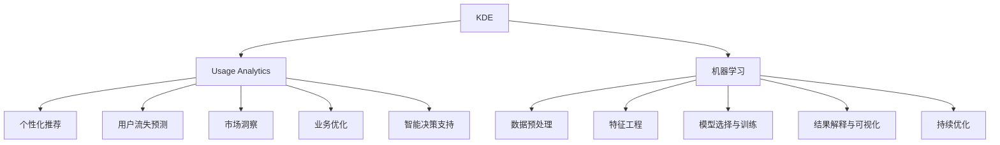

                 

# 知识发现引擎的用户行为分析

> 关键词：知识发现引擎,用户行为分析,机器学习,自然语言处理,NLP

## 1. 背景介绍

### 1.1 问题由来
随着信息技术的发展，知识发现(Knowledge Discovery in Databases, KDD)已经成为了数据挖掘和人工智能领域的重要研究方向。在KDD系统中，用户行为分析(Usage Analytics)是核心任务之一，用于提取和分析用户在平台上的活动轨迹，揭示用户偏好和需求，从而提供个性化的推荐和服务。然而，传统的用户行为分析方法主要依赖人工规则和静态特征，难以处理海量数据和复杂关系，无法捕捉用户行为的全貌。

近年来，随着深度学习和大数据分析技术的进步，基于数据驱动的机器学习方法被广泛应用于用户行为分析领域。其中，知识发现引擎(Knowledge Discovery Engine, KDE)作为一种智能化的数据挖掘工具，通过自动学习和模式发现，能够有效提升用户行为分析的效率和精度。

### 1.2 问题核心关键点
知识发现引擎的用户行为分析，是指通过机器学习算法，从用户历史行为数据中挖掘出隐含的关联规则、趋势和模式，用于预测用户未来的行为和需求。具体来说，用户行为分析的核心关键点包括：

1. **数据预处理**：清洗和处理原始数据，消除噪声和冗余信息，确保数据质量和一致性。
2. **特征工程**：设计和提取有意义的特征，构建特征空间，为模型学习提供有效信息。
3. **模型选择与训练**：选择合适的机器学习模型，并在训练数据上优化参数，提高模型的预测能力。
4. **结果解释与可视化**：解释模型预测结果，可视化行为模式和趋势，辅助业务决策。
5. **持续优化**：根据业务反馈和新数据，不断调整和优化模型，提高性能和鲁棒性。

这些关键点共同构成了知识发现引擎用户行为分析的核心流程，帮助企业更好地理解用户行为，优化用户体验，提升商业价值。

### 1.3 问题研究意义
通过知识发现引擎进行用户行为分析，具有以下重要意义：

1. **精准推荐**：能够根据用户的历史行为和兴趣，提供个性化的产品和服务，提升用户体验和满意度。
2. **用户流失预测**：通过分析用户行为变化趋势，预测潜在流失用户，及时采取挽留措施，提高用户留存率。
3. **市场洞察**：揭示用户需求的动态变化，帮助企业把握市场趋势，制定更精准的营销策略。
4. **业务优化**：通过数据分析发现业务流程中的瓶颈和问题，优化产品和服务设计，提升运营效率。
5. **智能决策支持**：为业务决策提供数据支持，辅助企业制定科学合理的战略规划。

总之，基于知识发现引擎的用户行为分析，不仅能够提升用户的个性化体验，还能够辅助企业做出更明智的决策，促进业务增长和创新。

## 2. 核心概念与联系

### 2.1 核心概念概述

为更好地理解基于知识发现引擎的用户行为分析方法，本节将介绍几个密切相关的核心概念：

- **知识发现引擎(KDE)**：一种智能化的数据挖掘工具，能够自动从海量数据中发现隐含的知识和规律，广泛应用于商业智能(BI)、推荐系统、自然语言处理(NLP)等领域。
- **用户行为分析(Usage Analytics)**：通过分析用户在平台上的行为数据，提取用户偏好和需求，揭示用户行为模式，为用户提供个性化推荐和服务。
- **机器学习(ML)**：一种从数据中学习规律和模型的方法，能够处理复杂数据，提供高效的预测和分类能力。
- **自然语言处理(NLP)**：涉及计算机理解和生成人类语言的技术，能够从文本数据中提取有价值的信息，辅助用户行为分析。
- **深度学习(Deep Learning)**：一种基于神经网络的机器学习方法，能够处理大规模数据，提供强大的特征提取和建模能力。

这些核心概念之间的逻辑关系可以通过以下Mermaid流程图来展示：



这个流程图展示了大语言模型的核心概念及其之间的关系：

1. KDE通过机器学习技术，从用户行为数据中发现知识。
2. 机器学习包括数据预处理、特征工程、模型训练和结果解释等步骤，辅助KDE完成用户行为分析。
3. NLP和深度学习技术，能够从文本数据中提取和处理语言信息，增强KDE对复杂数据处理的效率和精度。
4. 用户行为分析的结果，可用于个性化推荐、用户流失预测、市场洞察、业务优化和智能决策支持等业务场景。

这些核心概念共同构成了知识发现引擎用户行为分析的完整框架，为其应用提供了理论支撑和实践指导。

## 3. 核心算法原理 & 具体操作步骤
### 3.1 算法原理概述

基于知识发现引擎的用户行为分析，本质上是一个数据驱动的机器学习过程。其核心思想是：通过自动学习用户历史行为数据中的模式和规律，预测用户未来的行为和需求。

形式化地，假设用户行为数据为 $D=\{(x_i,y_i)\}_{i=1}^N$，其中 $x_i$ 表示用户行为序列，$y_i$ 表示用户行为标签。目标是找到一个模型 $M$，使得其在新数据上的预测精度 $P(y|x)$ 最大化。

基于知识发现引擎的用户行为分析方法，包括但不限于以下几种：

1. **关联规则学习**：通过频繁项集和关联规则，发现用户行为之间的关联关系。
2. **分类与回归**：利用监督学习方法，对用户行为进行分类或回归预测，揭示行为模式和趋势。
3. **聚类分析**：通过无监督学习方法，将用户行为分成不同的群体，提供群体行为特征的刻画。
4. **序列建模**：使用时间序列模型或递归神经网络(RNN)，捕捉用户行为的时序特性。
5. **情感分析**：通过自然语言处理技术，分析用户评论和反馈中的情感倾向，揭示用户满意度。

这些方法可以通过数据预处理、特征工程和模型训练等步骤，实现从用户行为数据中挖掘出有价值的信息。

### 3.2 算法步骤详解

基于知识发现引擎的用户行为分析一般包括以下几个关键步骤：

**Step 1: 数据准备与预处理**

- 收集用户历史行为数据，包括点击、浏览、购买、评价等。
- 对数据进行清洗和标准化，处理缺失值和异常值，确保数据质量和一致性。
- 划分训练集、验证集和测试集，用于模型训练、调参和性能评估。

**Step 2: 特征工程**

- 设计和提取有意义的特征，如用户属性、行为频率、行为持续时间等。
- 对特征进行编码和转换，构建特征空间，提高模型的可解释性和泛化能力。
- 利用降维技术，减少特征空间的维度，提高计算效率。

**Step 3: 模型选择与训练**

- 选择合适的机器学习算法，如关联规则、分类器、回归器、聚类算法等。
- 在训练集上优化模型参数，确保模型在验证集上的泛化能力。
- 使用交叉验证和网格搜索等方法，进行模型选择和调参。

**Step 4: 结果解释与可视化**

- 对模型预测结果进行解释，提供有意义的业务洞察。
- 利用可视化工具，展示用户行为模式和趋势，辅助业务决策。
- 结合用户行为数据，进行情景模拟和推断，预测用户未来行为。

**Step 5: 持续优化**

- 根据业务反馈和新数据，定期调整和优化模型，提高性能和鲁棒性。
- 利用在线学习技术，实时更新模型参数，适应数据分布的变化。
- 结合A/B测试等方法，验证模型效果，不断优化算法和策略。

以上是基于知识发现引擎的用户行为分析的一般流程。在实际应用中，还需要针对具体任务的特点，对各个环节进行优化设计，如改进数据预处理算法、选择更高效的特征表示、采用最新的模型算法等。

### 3.3 算法优缺点

基于知识发现引擎的用户行为分析方法具有以下优点：

1. **高效性**：能够自动处理大规模用户行为数据，发现隐藏模式和规律，提供高效的数据驱动分析。
2. **灵活性**：支持多种数据类型和业务场景，能够灵活应对复杂多变的用户需求。
3. **可解释性**：通过模型解释和可视化，提供有意义的业务洞察，辅助决策支持。
4. **自动化**：通过自动化数据挖掘和学习，减少人工干预，提高工作效率和准确性。

同时，该方法也存在一定的局限性：

1. **依赖高质量数据**：用户行为数据的准确性和完整性直接影响分析结果，数据清洗和预处理过程复杂且耗时。
2. **模型复杂度**：复杂模型容易过拟合，需要大量标注数据和计算资源进行调参。
3. **结果泛化性**：模型的泛化性能受到数据分布和特征选择的影响，需要不断优化和验证。
4. **算法复杂度**：部分算法如深度学习模型，训练复杂度和计算成本较高，需要高性能计算资源支持。

尽管存在这些局限性，但就目前而言，基于知识发现引擎的用户行为分析方法仍然是最主流的数据挖掘范式之一。未来相关研究的重点在于如何进一步降低数据依赖，提高模型的少样本学习和跨领域迁移能力，同时兼顾可解释性和算法复杂度等因素。

### 3.4 算法应用领域

基于知识发现引擎的用户行为分析，在多个领域得到了广泛应用，涵盖了金融、电商、社交媒体、教育等多个行业。以下是几个典型的应用场景：

- **金融风控**：分析用户的消费行为和信用记录，预测违约风险，进行信贷审批和风控。
- **电商推荐**：根据用户浏览和购买行为，推荐相关商品，提升用户体验和转化率。
- **社交媒体分析**：分析用户互动和内容生成行为，预测用户兴趣和需求，优化社区内容推荐。
- **教育推荐**：分析学生的学习行为和成绩记录，推荐个性化学习资源，提高学习效果。
- **医疗健康**：分析患者的健康记录和行为数据，预测疾病风险，提供个性化医疗建议。

除了上述这些经典应用外，用户行为分析技术还被创新性地应用于更多场景中，如智能交通、智慧城市、智能家居等，为各行各业带来了新的业务机遇和创新发展。

## 4. 数学模型和公式 & 详细讲解  
### 4.1 数学模型构建

本节将使用数学语言对基于知识发现引擎的用户行为分析过程进行更加严格的刻画。

记用户行为数据为 $D=\{(x_i,y_i)\}_{i=1}^N$，其中 $x_i$ 为行为序列，$y_i$ 为行为标签。假设选择分类器作为用户行为分析模型，记分类器为 $M_{\theta}(x)$，其中 $\theta$ 为模型参数。

定义模型 $M_{\theta}$ 在行为数据 $(x_i,y_i)$ 上的损失函数为 $\ell(M_{\theta}(x_i),y_i)$，则在数据集 $D$ 上的经验风险为：

$$
\mathcal{L}(\theta) = \frac{1}{N}\sum_{i=1}^N \ell(M_{\theta}(x_i),y_i)
$$

其中 $\ell$ 为分类器的损失函数，常用的包括交叉熵损失、均方误差损失等。

基于知识发现引擎的用户行为分析目标是最小化经验风险，即找到最优参数：

$$
\theta^* = \mathop{\arg\min}_{\theta} \mathcal{L}(\theta)
$$

在实践中，我们通常使用基于梯度的优化算法（如SGD、Adam等）来近似求解上述最优化问题。设 $\eta$ 为学习率，则参数的更新公式为：

$$
\theta \leftarrow \theta - \eta \nabla_{\theta}\mathcal{L}(\theta)
$$

其中 $\nabla_{\theta}\mathcal{L}(\theta)$ 为损失函数对参数 $\theta$ 的梯度，可通过反向传播算法高效计算。

### 4.2 公式推导过程

以下我们以二分类任务为例，推导交叉熵损失函数及其梯度的计算公式。

假设分类器 $M_{\theta}$ 在行为数据 $x$ 上的输出为 $\hat{y}=M_{\theta}(x) \in [0,1]$，表示样本属于正类的概率。真实标签 $y \in \{0,1\}$。则二分类交叉熵损失函数定义为：

$$
\ell(M_{\theta}(x),y) = -[y\log \hat{y} + (1-y)\log (1-\hat{y})]
$$

将其代入经验风险公式，得：

$$
\mathcal{L}(\theta) = -\frac{1}{N}\sum_{i=1}^N [y_i\log M_{\theta}(x_i)+(1-y_i)\log(1-M_{\theta}(x_i))]
$$

根据链式法则，损失函数对参数 $\theta_k$ 的梯度为：

$$
\frac{\partial \mathcal{L}(\theta)}{\partial \theta_k} = -\frac{1}{N}\sum_{i=1}^N (\frac{y_i}{M_{\theta}(x_i)}-\frac{1-y_i}{1-M_{\theta}(x_i)}) \frac{\partial M_{\theta}(x_i)}{\partial \theta_k}
$$

其中 $\frac{\partial M_{\theta}(x_i)}{\partial \theta_k}$ 可进一步递归展开，利用自动微分技术完成计算。

在得到损失函数的梯度后，即可带入参数更新公式，完成模型的迭代优化。重复上述过程直至收敛，最终得到适应用户行为数据的最优模型参数 $\theta^*$。

## 5. 项目实践：代码实例和详细解释说明
### 5.1 开发环境搭建

在进行用户行为分析实践前，我们需要准备好开发环境。以下是使用Python进行Scikit-learn开发的环境配置流程：

1. 安装Anaconda：从官网下载并安装Anaconda，用于创建独立的Python环境。

2. 创建并激活虚拟环境：
```bash
conda create -n sklearn-env python=3.8 
conda activate sklearn-env
```

3. 安装Scikit-learn：使用pip安装Scikit-learn库，可以从官方文档或科学计算库镜像下载。

```bash
pip install scikit-learn
```

4. 安装NumPy、pandas、matplotlib等常用库：
```bash
pip install numpy pandas matplotlib jupyter notebook ipython
```

完成上述步骤后，即可在`sklearn-env`环境中开始用户行为分析实践。

### 5.2 源代码详细实现

下面我们以用户流失预测为例，给出使用Scikit-learn进行用户行为分析的Python代码实现。

首先，定义数据处理函数：

```python
import pandas as pd
from sklearn.model_selection import train_test_split
from sklearn.preprocessing import LabelEncoder

def load_data():
    df = pd.read_csv('user_behavior_data.csv')
    features = ['age', 'gender', 'city', 'purchase_frequency', 'last_purchase_date']
    target = 'churn'
    
    # 编码分类特征
    le = LabelEncoder()
    for col in df.columns:
        if df[col].dtype == 'object':
            df[col] = le.fit_transform(df[col])
    
    return df[features], df[target]

# 加载数据
features, target = load_data()

# 划分训练集和测试集
train_features, test_features, train_target, test_target = train_test_split(features, target, test_size=0.2, random_state=42)
```

然后，定义模型和优化器：

```python
from sklearn.ensemble import RandomForestClassifier
from sklearn.metrics import accuracy_score, classification_report

# 随机森林分类器
model = RandomForestClassifier(n_estimators=100, max_depth=5, random_state=42)

# 训练模型
model.fit(train_features, train_target)

# 预测
train_pred = model.predict(train_features)
test_pred = model.predict(test_features)

# 评估
train_acc = accuracy_score(train_target, train_pred)
test_acc = accuracy_score(test_target, test_pred)
print(f"Train accuracy: {train_acc:.2f}")
print(f"Test accuracy: {test_acc:.2f}")

# 打印分类报告
print(classification_report(test_target, test_pred))
```

以上就是使用Scikit-learn进行用户行为分析的完整代码实现。可以看到，通过简单的数据预处理和模型训练，我们便能够在用户行为数据上构建一个简单的用户流失预测模型。

### 5.3 代码解读与分析

让我们再详细解读一下关键代码的实现细节：

**load_data函数**：
- 定义用户行为数据的数据路径，并加载数据到DataFrame中。
- 指定需要提取的特征和目标变量，并进行数据预处理，包括文本特征的编码和类别特征的编码。
- 使用train_test_split函数划分训练集和测试集。

**模型选择与训练**：
- 选择随机森林分类器作为用户行为分析的模型，设置相应的参数。
- 使用fit函数在训练集上训练模型，得到训练好的模型。
- 在测试集上使用predict函数进行预测，得到预测结果。
- 使用accuracy_score函数计算模型在训练集和测试集上的准确率，并打印结果。
- 使用classification_report函数打印详细的分类报告，包括精确度、召回率和F1值等指标。

**评估与分析**：
- 使用训练集和测试集上的准确率指标，评估模型的性能。
- 通过分类报告，了解模型在不同类别上的表现，找到模型的优势和不足。
- 结合实际业务场景，分析模型预测结果，提供有意义的业务洞察。

这些代码实现了基本的用户行为分析流程，展示了如何用Python和Scikit-learn进行数据预处理、模型训练和结果评估。

当然，工业级的系统实现还需考虑更多因素，如模型的保存和部署、超参数的自动搜索、更灵活的任务适配层等。但核心的用户行为分析范式基本与此类似。

## 6. 实际应用场景
### 6.1 智能客服系统

基于知识发现引擎的用户行为分析，可以广泛应用于智能客服系统的构建。传统客服往往需要配备大量人力，高峰期响应缓慢，且一致性和专业性难以保证。通过用户行为分析，智能客服系统能够自动理解用户意图，匹配最合适的回答，提供快速、一致的服务。

在技术实现上，可以收集企业内部的历史客服对话记录，将问题和最佳答复构建成监督数据，在此基础上对用户行为分析模型进行微调。微调后的模型能够自动理解用户意图，匹配最合适的答案模板进行回复。对于用户提出的新问题，还可以接入检索系统实时搜索相关内容，动态组织生成回答。如此构建的智能客服系统，能大幅提升客户咨询体验和问题解决效率。

### 6.2 金融风控

金融机构需要实时监测市场舆论动向，以便及时应对负面信息传播，规避金融风险。通过用户行为分析，金融风险预测模型能够识别出潜在的高风险用户，及时采取风险控制措施，减少损失。

在具体实现中，可以收集金融领域相关的新闻、评论、交易记录等数据，使用用户行为分析模型对用户行为进行建模，预测其未来的行为和风险。一旦发现用户行为出现异常，如频繁交易、异常交易金额等，系统便会自动预警，帮助金融机构及时采取措施，降低金融风险。

### 6.3 电商推荐

在电商平台上，用户行为分析能够帮助企业了解用户的购买偏好和行为习惯，从而提供个性化的推荐。通过分析用户的历史点击、浏览、购买等行为，电商推荐系统能够识别出用户的兴趣点，提供最相关的商品推荐。

具体实现中，可以将用户的行为数据作为输入，使用用户行为分析模型对用户的兴趣进行预测，然后结合商品特征进行推荐。随着用户行为数据的不断积累，推荐系统能够逐步提升推荐的精度，增强用户的购物体验。

### 6.4 未来应用展望

随着用户行为分析技术的不断进步，基于知识发现引擎的分析方法将得到更广泛的应用，为各行各业带来新的业务机遇和创新。

在智慧医疗领域，通过用户行为分析，能够掌握用户的健康状况和生活习惯，提供个性化的医疗建议和健康管理方案，提升用户的健康水平。

在智能教育领域，通过分析学生的学习行为，能够发现学习中的瓶颈和问题，提供个性化的学习资源和指导，提升学生的学习效果。

在智慧城市治理中，通过分析用户的出行行为和需求，能够优化城市的交通和资源配置，提高城市的运行效率和用户体验。

此外，在企业生产、社会治理、文娱传媒等众多领域，基于用户行为分析的智能系统将不断涌现，为传统行业数字化转型升级提供新的技术路径。相信随着技术的日益成熟，用户行为分析技术将成为人工智能落地应用的重要手段，推动人工智能技术在更多场景下的应用和发展。

## 7. 工具和资源推荐
### 7.1 学习资源推荐

为了帮助开发者系统掌握基于知识发现引擎的用户行为分析的理论基础和实践技巧，这里推荐一些优质的学习资源：

1. 《Python机器学习》系列书籍：由著名机器学习专家撰写的经典教材，涵盖机器学习基础、数据预处理、特征工程、模型训练等重要内容。

2. 《Scikit-learn官方文档》：官方提供的详细文档，包含丰富的示例代码和教程，适合入门学习和实践操作。

3. 《自然语言处理基础》课程：由斯坦福大学开设的NLP入门课程，介绍自然语言处理的基本概念和核心算法，适合NLP初学者。

4. 《机器学习实战》书籍：通过丰富的实例代码和项目实践，帮助读者掌握机器学习技术，并进行实际应用。

5. Kaggle竞赛平台：提供海量数据集和开源代码，适合进行数据挖掘和机器学习竞赛，提升实战能力。

通过对这些资源的学习实践，相信你一定能够快速掌握基于知识发现引擎的用户行为分析的精髓，并用于解决实际的业务问题。
### 7.2 开发工具推荐

高效的开发离不开优秀的工具支持。以下是几款用于用户行为分析开发的常用工具：

1. Python编程语言：一种高效灵活的编程语言，适合数据处理和算法开发。

2. Scikit-learn库：一个开源的机器学习库，提供了丰富的算法和工具，适合数据挖掘和建模任务。

3. Pandas库：一个强大的数据处理库，能够高效地处理和分析数据，支持数据清洗和预处理。

4. NumPy库：一个高效的数学库，适合数值计算和矩阵操作，提高计算效率。

5. Matplotlib库：一个常用的绘图库，适合数据可视化和结果展示，提高数据分析的直观性。

6. Jupyter Notebook：一个交互式编程环境，适合进行实验开发和数据分析，支持代码执行和结果展示。

合理利用这些工具，可以显著提升用户行为分析任务的开发效率，加快创新迭代的步伐。

### 7.3 相关论文推荐

用户行为分析技术的发展源于学界的持续研究。以下是几篇奠基性的相关论文，推荐阅读：

1. "Association Rules in Large Databases"（《大型数据库中的关联规则》）：提出了Apriori和FP-growth算法，用于发现大型数据库中的关联规则，奠定了关联规则学习的基础。

2. "Logistic Regression, Neural Networks, and Softmax"（《逻辑回归、神经网络和Softmax》）：介绍了逻辑回归、神经网络和Softmax等分类算法，提供了机器学习模型的基本选择。

3. "The Elements of Statistical Learning"（《统计学习要素》）：介绍了统计学习的基本概念和算法，适合深入学习机器学习理论。

4. "Deep Learning for NLP"（《深度学习在NLP中的应用》）：介绍了深度学习在自然语言处理中的应用，包括RNN、CNN、Transformer等模型。

5. "A Survey of Usage Analytics in Mobile E-commerce"（《移动电商中的用户行为分析综述》）：综述了移动电商中的用户行为分析技术，提供了丰富的应用实例和案例分析。

这些论文代表了大语言模型微调技术的发展脉络。通过学习这些前沿成果，可以帮助研究者把握学科前进方向，激发更多的创新灵感。

## 8. 总结：未来发展趋势与挑战

### 8.1 总结

本文对基于知识发现引擎的用户行为分析方法进行了全面系统的介绍。首先阐述了用户行为分析的研究背景和意义，明确了机器学习在大数据挖掘中的应用潜力。其次，从原理到实践，详细讲解了用户行为分析的数学模型和关键步骤，给出了用户行为分析任务开发的完整代码实例。同时，本文还广泛探讨了用户行为分析技术在智能客服、金融风控、电商推荐等多个行业领域的应用前景，展示了其广阔的应用前景。此外，本文精选了用户行为分析技术的各类学习资源，力求为读者提供全方位的技术指引。

通过本文的系统梳理，可以看到，基于知识发现引擎的用户行为分析技术已经广泛应用于商业智能、推荐系统、金融风控等多个领域，成为数据挖掘和人工智能的重要手段。未来，随着技术的发展和应用场景的扩展，用户行为分析技术必将进一步提升其对数据处理的效率和精度，为人工智能技术在更多场景下的应用提供有力支撑。

### 8.2 未来发展趋势

展望未来，用户行为分析技术将呈现以下几个发展趋势：

1. **数据自动化获取**：随着物联网技术的发展，用户行为数据的自动化获取成为可能，用户行为分析将更加实时、精准。

2. **多模态融合**：用户行为不仅包括文本数据，还涉及图像、视频、语音等多模态数据。未来的用户行为分析将更加注重多模态信息的融合，提升分析的深度和广度。

3. **深度学习模型的普及**：深度学习技术的发展，将使得用户行为分析模型更加强大，能够处理更加复杂的用户行为数据，提高预测精度。

4. **实时预测与优化**：未来的用户行为分析将更加注重实时预测与优化，通过在线学习技术，持续调整和优化模型，适应数据分布的变化。

5. **数据隐私与安全**：随着用户行为数据的广泛应用，数据隐私与安全问题将受到更多关注，用户行为分析技术将需要更多的隐私保护和安全措施。

6. **伦理与社会影响**：用户行为分析技术的广泛应用将带来更多的伦理和社会问题，如何平衡技术发展与社会责任，将是未来的重要研究方向。

以上趋势凸显了用户行为分析技术的广阔前景。这些方向的探索发展，必将进一步提升用户行为分析的效率和精度，为人工智能技术在更多场景下的应用提供有力支撑。

### 8.3 面临的挑战

尽管用户行为分析技术已经取得了一定的进展，但在迈向更加智能化、普适化应用的过程中，它仍面临着诸多挑战：

1. **数据质量和可靠性**：用户行为数据的准确性和完整性直接影响分析结果，数据清洗和预处理过程复杂且耗时。

2. **模型复杂度与可解释性**：复杂模型容易过拟合，需要大量标注数据和计算资源进行调参。同时模型的可解释性不足，难以解释其内部工作机制和决策逻辑。

3. **算法复杂度与效率**：部分算法如深度学习模型，训练复杂度和计算成本较高，需要高性能计算资源支持。

4. **数据隐私与安全**：用户行为数据涉及大量个人隐私信息，如何保护数据隐私，防止数据泄露和滥用，将是未来的重要课题。

5. **算法偏见与公平性**：用户行为分析模型可能会学习到有偏见的数据，导致预测结果不公平，需要更多的公平性分析和改进措施。

6. **伦理与社会影响**：用户行为分析技术的广泛应用将带来更多的伦理和社会问题，如何平衡技术发展与社会责任，将是未来的重要研究方向。

尽管存在这些挑战，但通过持续的研究和技术进步，用户行为分析技术必将克服这些难题，进一步推动人工智能技术在更多场景下的应用和发展。

### 8.4 研究展望

面对用户行为分析技术所面临的挑战，未来的研究需要在以下几个方面寻求新的突破：

1. **自动数据标注与清洗**：通过自动标注和清洗技术，减少人工干预，提高数据处理效率和数据质量。

2. **模型简化与压缩**：开发更加参数高效和计算高效的模型，在保持预测精度的同时，降低计算复杂度和内存占用。

3. **多模态融合与协同**：研究多模态数据的整合与协同建模，提升用户行为分析的深度和广度。

4. **实时预测与动态优化**：通过在线学习技术，实时更新模型参数，适应数据分布的变化，提高模型的灵活性和实时性。

5. **隐私保护与数据安全**：研究数据隐私保护技术，如差分隐私、联邦学习等，保护用户行为数据的隐私和安全。

6. **算法公平性与伦理审查**：研究算法的公平性和伦理审查机制，确保用户行为分析结果的公正性和透明性。

这些研究方向将引领用户行为分析技术迈向更高的台阶，为人工智能技术在更多场景下的应用提供有力支撑。面向未来，用户行为分析技术还需要与其他人工智能技术进行更深入的融合，如知识表示、因果推理、强化学习等，多路径协同发力，共同推动人工智能技术的进步。只有勇于创新、敢于突破，才能不断拓展用户行为分析技术的边界，推动人工智能技术在更广阔的领域取得新的突破。

## 9. 附录：常见问题与解答

**Q1：用户行为分析是否适用于所有业务场景？**

A: 用户行为分析在大多数业务场景中都能取得不错的效果，特别是对于数据量较大的场景。但对于一些特定领域的业务，如医疗、法律等，可能需要结合领域知识进行定制化建模，才能更好地适应。此外，对于一些需要高度实时性和个性化预测的业务，用户行为分析也需要针对性的改进优化。

**Q2：如何降低用户行为分析对标注数据的依赖？**

A: 数据标注是用户行为分析的一个重要环节，但也带来了标注成本高、标注数据质量不稳定等问题。为了降低对标注数据的依赖，可以考虑以下方法：

1. **自动化数据标注**：利用机器学习技术，自动标注数据，减少人工干预，提高数据标注的效率和质量。

2. **弱监督学习**：利用少量的标注数据和大量的未标注数据，进行弱监督学习，提升模型的泛化能力和鲁棒性。

3. **半监督学习**：利用少量的标注数据和大量的未标注数据，进行半监督学习，进一步提高模型的性能。

4. **主动学习**：利用主动学习技术，在数据集中选择最具代表性的样本进行标注，提高标注数据的代表性。

这些方法可以在一定程度上缓解用户行为分析对标注数据的依赖，提升模型的泛化能力和鲁棒性。

**Q3：用户行为分析结果的解释与可视化有哪些常用的工具？**

A: 用户行为分析结果的解释与可视化，是用户行为分析的重要环节，能够提供有意义的业务洞察。常用的工具包括：

1. **TensorBoard**：TensorFlow的可视化工具，可以实时监控模型训练过程，提供详细的图表和指标，辅助模型调试和优化。

2. **Scikit-learn内置可视化工具**：如plot_model、confusion_matrix等函数，可以生成特征重要性图、分类报告等，提供直观的模型解释。

3. **Python可视化库**：如matplotlib、seaborn、ggplot等，可以生成各种图表和可视化结果，展示用户行为模式和趋势。

4. **Jupyter Notebook**：交互式的编程环境，可以嵌入可视化代码，实时展示数据处理和模型训练结果。

这些工具能够有效帮助用户理解用户行为分析结果，提供有意义的业务洞察，辅助业务决策。

**Q4：如何确保用户行为分析模型的公平性与公正性？**

A: 确保用户行为分析模型的公平性与公正性，是确保模型应用效果和业务信誉的重要环节。以下是一些常用的方法：

1. **公平性评估**：使用公平性指标，如平衡准确率、灵敏度、特异度等，评估模型在不同群体上的表现。

2. **数据预处理**：通过数据清洗和特征工程，消除数据中的偏见，提高模型的泛化能力。

3. **算法优化**：选择公平性算法，如De-biasing算法、Fairness constraints等，优化模型预测结果。

4. **模型监控与反馈**：实时监控模型输出，发现潜在的偏见和异常，及时进行调整和优化。

5. **伦理审查与监管**：制定伦理审查机制，确保模型的使用符合法律法规和伦理道德标准。

这些方法能够在一定程度上确保用户行为分析模型的公平性与公正性，提高模型的可信度和业务信誉。

**Q5：用户行为分析在智能客服系统中的具体应用场景有哪些？**

A: 在智能客服系统中，用户行为分析可以应用于多个具体场景，包括但不限于：

1. **问题分类与解答**：通过分析用户的对话内容，识别出用户的问题类型，提供相应的解答模板。

2. **情感分析与情绪识别**：通过分析用户对话中的情感倾向，识别用户情绪状态，提供相应的服务调整。

3. **意图识别与上下文理解**：通过分析用户的历史对话和行为，识别用户的意图，提供个性化的服务建议。

4. **用户行为预测与个性化推荐**：通过分析用户的历史行为，预测用户未来的行为，提供个性化的推荐和服务。

5. **用户满意度分析与改进**：通过分析用户的反馈和评价，识别出服务中的不足和改进点，提升用户满意度。

这些应用场景展示了用户行为分析在智能客服系统中的广泛应用，能够提升客服系统的自动化水平和用户体验。

---

作者：禅与计算机程序设计艺术 / Zen and the Art of Computer Programming

