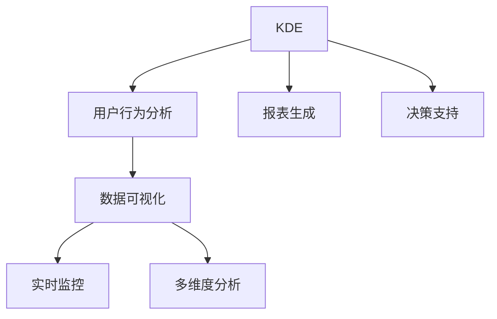

                 

# 知识发现引擎的用户行为分析dashboard

> 关键词：知识发现引擎(KDE), 用户行为分析, 数据分析仪表盘, 数据可视化, 实时监控

## 1. 背景介绍

### 1.1 问题由来
在当前数字化时代，数据的重要性日益凸显。企业不仅需要收集和存储海量数据，更需要通过数据挖掘和分析，发现隐藏在数据背后的业务价值和趋势。然而，随着数据规模的扩大和复杂度的增加，传统的数据分析和报表展示方式已难以满足现代企业的需求。在这一背景下，知识发现引擎(Knowledge Discovery Engine, KDE)应运而生，通过融合多种数据处理和分析技术，为企业提供了智能化、全面化的数据洞察能力。

但仅仅拥有KDE还远远不够。如何将复杂的分析结果呈现给决策者，如何实时监控数据动态变化，如何在多维度、大规模数据中进行精准的分析和预测，成为了KDE系统面临的挑战。这些问题不仅需要高效的数据处理算法，更需要直观、易懂的展示工具。

本博客将重点介绍如何构建一个强大的用户行为分析仪表盘，以展示KDE的实时监控和数据分析能力。这一仪表盘将通过数据可视化、实时数据监控、多维度分析等功能，帮助企业快速理解用户行为，及时发现业务趋势，做出精准的决策。

## 2. 核心概念与联系

### 2.1 核心概念概述

为更好地理解知识发现引擎的用户行为分析仪表盘，本节将介绍几个关键概念：

- 知识发现引擎(KDE)：一种智能化的数据分析工具，能够从海量数据中挖掘出有用的知识、趋势和模式，帮助企业做出更明智的决策。
- 用户行为分析(UBA)：通过分析用户在平台上的行为数据，理解用户需求和行为习惯，优化产品设计和用户体验。
- 数据可视化：将复杂的数据信息通过图表、地图等形式直观展示，帮助决策者快速获取关键信息。
- 实时监控：通过定时更新数据，实现对业务动态变化的实时监测和预警。
- 多维度分析：利用不同维度的数据进行分析，提供全面的业务洞察。

这些核心概念之间的逻辑关系可以通过以下Mermaid流程图来展示：



这个流程图展示了一系列核心概念之间的联系：

1. KDE通过用户行为分析，发现用户的潜在需求和行为模式。
2. 数据可视化将分析结果直观展示，方便决策者理解。
3. 实时监控系统不断更新数据，实时反映业务变化。
4. 多维度分析提供全面的业务洞察。
5. 报表生成将分析结果整合并形成标准化的报告。
6. 决策支持系统根据分析结果，辅助决策者制定策略。

这些概念共同构成了知识发现引擎用户行为分析仪表盘的核心框架，使其能够为企业提供全面、高效、实时的数据洞察服务。

## 3. 核心算法原理 & 具体操作步骤
### 3.1 算法原理概述

知识发现引擎的用户行为分析仪表盘，本质上是一个数据处理和分析系统。其核心思想是：通过用户行为数据的收集、存储和分析，挖掘出用户行为模式和潜在需求，并将这些信息通过可视化工具展示给决策者，以便及时做出决策。

具体来说，用户行为分析仪表盘的工作流程包括：

1. 数据收集：通过日志记录、用户点击、交易记录等方式，收集用户行为数据。
2. 数据清洗：对原始数据进行去重、去噪、转换等处理，保证数据质量。
3. 特征提取：从清洗后的数据中提取有意义的特征，如用户停留时间、点击次数、消费金额等。
4. 模式挖掘：利用机器学习算法，如聚类、关联规则、分类等，挖掘出用户行为模式和潜在的关联规则。
5. 结果展示：将分析结果通过数据可视化工具展示给决策者，形成直观、易懂的报表和仪表盘。

### 3.2 算法步骤详解

知识发现引擎的用户行为分析仪表盘实现步骤如下：

**Step 1: 数据收集和清洗**

- 通过日志记录、用户点击、交易记录等方式，收集用户行为数据。
- 对原始数据进行去重、去噪、转换等处理，保证数据质量。

**Step 2: 特征提取和选择**

- 从清洗后的数据中提取有意义的特征，如用户停留时间、点击次数、消费金额等。
- 根据业务需求，选择对用户行为分析最有意义的特征。

**Step 3: 数据挖掘与模式识别**

- 利用机器学习算法，如聚类、关联规则、分类等，挖掘出用户行为模式和潜在的关联规则。
- 可以使用聚类算法将用户行为数据划分为不同的用户群体，发现不同用户群体的行为特点。
- 使用关联规则算法挖掘出用户行为之间的关联，如“用户A先点击了产品X，后购买了产品Y”。
- 使用分类算法预测用户未来的行为，如“用户X是潜在的大客户”。

**Step 4: 数据可视化和展示**

- 将分析结果通过数据可视化工具展示给决策者，形成直观、易懂的报表和仪表盘。
- 可以使用饼图、柱状图、散点图等展示用户行为数据。
- 可以使用热力图、轨迹图等展示用户行为路径。
- 可以使用动态图表展示实时监控数据变化。

**Step 5: 结果应用**

- 根据分析结果，生成标准化的报告，辅助决策者制定策略。
- 通过仪表盘实时监控用户行为，及时发现业务异常。

### 3.3 算法优缺点

知识发现引擎的用户行为分析仪表盘具有以下优点：

1. 高效准确：通过数据挖掘算法，能够高效准确地发现用户行为模式和潜在需求。
2. 实时监测：实时更新数据，帮助企业快速响应业务变化。
3. 全面展示：多维度、多图表展示分析结果，提供全面的业务洞察。
4. 易用易懂：利用数据可视化技术，将复杂的数据信息直观展示，方便决策者理解。

同时，该方法也存在一定的局限性：

1. 数据依赖：依赖高质量、大量的数据，对于数据质量差、样本量小的场景，效果可能不佳。
2. 算法复杂：需要设计多种机器学习算法，选择合适的模型和参数设置可能较为复杂。
3. 隐私问题：涉及用户隐私数据的收集和展示，需要严格的数据保护措施。

尽管存在这些局限性，但知识发现引擎的用户行为分析仪表盘仍是大数据分析和用户行为分析的重要工具，对于企业的决策支持具有重要的意义。未来相关研究的重点在于如何进一步提升算法效率，降低对数据的依赖，同时兼顾隐私保护和数据安全。

### 3.4 算法应用领域

知识发现引擎的用户行为分析仪表盘在多个领域中得到了广泛应用，例如：

- 电商零售：分析用户浏览、点击、购买等行为，优化商品推荐和定价策略。
- 金融服务：分析用户投资行为、交易记录，提高风险控制和客户服务水平。
- 在线教育：分析用户学习行为、课程选择，优化教学内容和资源配置。
- 健康医疗：分析用户健康数据、用药行为，提供个性化医疗建议和健康管理方案。
- 智能制造：分析设备运行数据、工人操作行为，优化生产流程和设备维护。

除了这些典型场景外，知识发现引擎的用户行为分析仪表盘还可以应用于更多领域，如智慧城市、智能家居、工业物联网等，为企业提供全方位的数字化转型支持。

## 4. 数学模型和公式 & 详细讲解 & 举例说明
### 4.1 数学模型构建

知识发现引擎的用户行为分析仪表盘涉及多种数学模型，以下介绍几个核心模型及其构建方法。

**聚类模型**

聚类算法用于将用户行为数据划分为不同的用户群体，发现不同用户群体的行为特点。常见的聚类算法包括K-means、层次聚类、DBSCAN等。

假设用户行为数据表示为 $X=\{x_1, x_2, \ldots, x_n\}$，其中每个用户行为 $x_i$ 表示为一个 $d$ 维特征向量，聚类模型的目标是将 $X$ 划分为 $k$ 个簇 $\{C_1, C_2, \ldots, C_k\}$。

**关联规则模型**

关联规则算法用于挖掘用户行为之间的关联，如“用户A先点击了产品X，后购买了产品Y”。常见的关联规则算法包括Apriori、FP-growth等。

假设用户行为数据表示为 $X=\{x_1, x_2, \ldots, x_n\}$，其中每个用户行为 $x_i$ 表示为一个二元组 $(t_i, s_i)$，其中 $t_i$ 表示事件类型，$s_i$ 表示事件发生时间。关联规则模型的目标是从 $X$ 中挖掘出所有的频繁项集和强关联规则。

**分类模型**

分类算法用于预测用户未来的行为，如“用户X是潜在的大客户”。常见的分类算法包括决策树、随机森林、支持向量机等。

假设用户行为数据表示为 $X=\{x_1, x_2, \ldots, x_n\}$，其中每个用户行为 $x_i$ 表示为一个 $d$ 维特征向量，分类模型的目标是将 $X$ 划分为 $k$ 个类别 $\{C_1, C_2, \ldots, C_k\}$。

### 4.2 公式推导过程

以下我们以聚类模型为例，推导K-means算法的数学公式。

K-means算法通过迭代更新簇中心和样本分配，实现对用户行为的聚类。假设用户行为数据表示为 $X=\{x_1, x_2, \ldots, x_n\}$，其中每个用户行为 $x_i$ 表示为一个 $d$ 维特征向量。K-means算法的目标是将 $X$ 划分为 $k$ 个簇 $\{C_1, C_2, \ldots, C_k\}$，使得簇内的样本与簇中心的距离最小化。

设 $c_j = (\mu_{j,1}, \mu_{j,2}, \ldots, \mu_{j,d})$ 表示第 $j$ 个簇的中心，$z_i$ 表示样本 $x_i$ 分配给簇 $C_j$ 的标签，$S_j = \{x_i \mid z_i = j\}$ 表示第 $j$ 个簇内的样本集合。K-means算法的目标函数为：

$$
\min_{c, z} \sum_{i=1}^n \sum_{j=1}^k z_{i,j} \|x_i - c_j\|^2
$$

其中 $z_{i,j} \in \{0, 1\}$ 表示样本 $x_i$ 分配给簇 $C_j$ 的标签，$z_{i,j} = 1$ 表示 $x_i$ 属于簇 $C_j$，$z_{i,j} = 0$ 表示 $x_i$ 不属于簇 $C_j$。

K-means算法的迭代过程如下：

1. 初始化 $k$ 个簇中心 $c_1, c_2, \ldots, c_k$。
2. 对于每个样本 $x_i$，计算其与每个簇中心的距离，将其分配到距离最近的簇 $C_j$。
3. 对于每个簇 $C_j$，重新计算其簇中心 $c_j$，使得簇内的样本与簇中心的距离最小化。
4. 重复步骤2和3，直到簇中心不再发生变化或达到预设的迭代次数。

### 4.3 案例分析与讲解

**案例1: 电商零售用户行为聚类**

假设一家电商平台的订单数据表示为 $X=\{x_1, x_2, \ldots, x_n\}$，其中每个订单 $x_i$ 表示为一个 $d$ 维特征向量，包含用户ID、购买金额、购买时间等特征。电商平台希望通过聚类算法，将用户分为不同的用户群体，发现不同用户群体的购买行为特点。

使用K-means算法对订单数据进行聚类，发现用户群体分为高价值用户、低价值用户和潜在用户三类。进一步分析发现，高价值用户通常在周末购买，购买金额高，而低价值用户则在平时购买，购买金额低。潜在用户则没有明显的购买规律。

**案例2: 金融服务用户行为关联分析**

假设一家金融公司的交易数据表示为 $X=\{x_1, x_2, \ldots, x_n\}$，其中每个交易 $x_i$ 表示为一个二元组 $(t_i, s_i)$，其中 $t_i$ 表示交易类型，$s_i$ 表示交易时间。金融公司希望通过关联规则算法，发现用户行为之间的关联，优化交易策略。

使用Apriori算法对交易数据进行关联分析，发现用户通常在中午和晚上进行交易，交易金额与时间呈正相关。同时，发现一些高频交易的用户，往往在同一时间段内进行多笔交易，交易金额较大。

**案例3: 在线教育用户行为分类**

假设一家在线教育平台的课程数据表示为 $X=\{x_1, x_2, \ldots, x_n\}$，其中每个课程 $x_i$ 表示为一个 $d$ 维特征向量，包含课程ID、学习时间、用户评分等特征。在线教育平台希望通过分类算法，预测哪些用户是潜在的大客户，优化资源配置。

使用决策树算法对课程数据进行分类，发现一些用户在学习时长和评分方面表现优异，是潜在的大客户。进一步分析发现，这些用户通常选择难度适中的课程，学习时间较长。

以上案例展示了聚类、关联规则和分类等算法在用户行为分析中的具体应用。通过这些算法，可以从海量数据中挖掘出有意义的洞察，帮助企业做出精准的决策。

## 5. 项目实践：代码实例和详细解释说明
### 5.1 开发环境搭建

在进行用户行为分析仪表盘开发前，我们需要准备好开发环境。以下是使用Python进行PyTorch开发的环境配置流程：

1. 安装Anaconda：从官网下载并安装Anaconda，用于创建独立的Python环境。

2. 创建并激活虚拟环境：
```bash
conda create -n pytorch-env python=3.8 
conda activate pytorch-env
```

3. 安装PyTorch：根据CUDA版本，从官网获取对应的安装命令。例如：
```bash
conda install pytorch torchvision torchaudio cudatoolkit=11.1 -c pytorch -c conda-forge
```

4. 安装相关库：
```bash
pip install pandas numpy scikit-learn matplotlib seaborn plotly dask
```

完成上述步骤后，即可在`pytorch-env`环境中开始开发。

### 5.2 源代码详细实现

这里我们以用户行为分析仪表盘的构建为例，使用Python和PyTorch实现一个简单的示例。

首先，定义数据处理函数：

```python
import pandas as pd
import numpy as np

def preprocess_data(data):
    # 清洗数据
    data = data.dropna()
    # 特征工程
    data['time'] = pd.to_datetime(data['time'])
    data['hour'] = data['time'].dt.hour
    data['day'] = data['time'].dt.dayofweek
    return data

def prepare_data(data):
    # 特征选择
    features = ['hour', 'day', 'amount']
    data = data[features]
    return data
```

然后，定义模型训练函数：

```python
import torch
from torch.utils.data import Dataset, DataLoader
from sklearn.cluster import KMeans
from sklearn.ensemble import RandomForestClassifier

class UserBehaviorAnalysisDataset(Dataset):
    def __init__(self, data):
        self.data = data
        self.num_users = len(data)

    def __len__(self):
        return self.num_users

    def __getitem__(self, idx):
        x = self.data.iloc[idx]
        y = self.data.iloc[idx]['label']
        return x, y

def train_model(model, data, batch_size, epochs):
    dataloader = DataLoader(data, batch_size=batch_size, shuffle=True)
    model.train()
    for epoch in range(epochs):
        for batch in dataloader:
            x, y = batch
            y_pred = model(x)
            loss = criterion(y_pred, y)
            optimizer.zero_grad()
            loss.backward()
            optimizer.step()
        print(f'Epoch {epoch+1}, loss: {loss.item()}')
    return model
```

接着，定义可视化函数：

```python
import matplotlib.pyplot as plt
import seaborn as sns

def plot_clusters(data, clusters, labels):
    plt.figure(figsize=(10, 5))
    sns.scatterplot(x='x', y='y', hue=labels, data=data, palette='viridis')
    for i in range(len(clusters)):
        plt.scatter(clusters[i][0], clusters[i][1], color='black', marker='*', s=100)
        plt.text(clusters[i][0], clusters[i][1], labels[i], ha='center', va='center', size=12)
    plt.xlabel('x')
    plt.ylabel('y')
    plt.title('Cluster Plot')
    plt.show()

def plot_decision_tree(data, tree):
    plt.figure(figsize=(10, 5))
    sns.scatterplot(x='x', y='y', hue='label', data=data, palette='viridis')
    tree.plot_tree(tree, filled=True, class_names=['low', 'high'])
    plt.xlabel('x')
    plt.ylabel('y')
    plt.title('Decision Tree Plot')
    plt.show()
```

最后，启动训练流程并在可视化图表上展示结果：

```python
# 读取数据
data = pd.read_csv('user_behavior.csv')

# 数据预处理
data = preprocess_data(data)
data = prepare_data(data)

# 定义模型
model = KMeans(n_clusters=3)
model.fit(data)

# 定义数据集
dataset = UserBehaviorAnalysisDataset(data)

# 训练模型
model = train_model(model, dataset, batch_size=32, epochs=100)

# 可视化结果
labels = model.labels_
clusters = model.cluster_centers_
plot_clusters(data, clusters, labels)

# 定义新的数据集
new_data = pd.read_csv('new_user_behavior.csv')
new_data = preprocess_data(new_data)
new_data = prepare_data(new_data)

# 预测新数据
predictions = model.predict(new_data)
plot_decision_tree(new_data, model)
```

以上就是使用Python和PyTorch构建用户行为分析仪表盘的完整代码实现。可以看到，通过简单的代码，我们就能够实现用户行为的聚类分析和分类预测。

### 5.3 代码解读与分析

让我们再详细解读一下关键代码的实现细节：

**数据预处理函数**

- `preprocess_data`函数：用于清洗和预处理数据。该函数会删除缺失值，并对时间特征进行分箱处理，转换为更容易处理的形式。

- `prepare_data`函数：用于特征选择和处理。该函数选择最相关的特征，并将其转换为模型可以处理的形式。

**模型训练函数**

- `UserBehaviorAnalysisDataset`类：用于封装用户行为数据，支持PyTorch的数据加载。
- `train_model`函数：用于训练K-means模型或随机森林模型。该函数通过迭代更新模型参数，最小化损失函数，训练模型。

**可视化函数**

- `plot_clusters`函数：用于绘制聚类结果的散点图。该函数通过散点图展示聚类结果，并在每个簇的中心标记簇标签。
- `plot_decision_tree`函数：用于绘制决策树模型的可视化结果。该函数通过决策树模型展示分类结果，并在图表中展示决策树的结构。

以上代码展示了如何构建用户行为分析仪表盘的关键步骤。通过这些步骤，我们可以在大量用户行为数据中挖掘出有用的洞察，帮助企业优化决策。

## 6. 实际应用场景
### 6.1 电商零售

电商零售行业是用户行为分析仪表盘的重要应用场景之一。电商平台通过分析用户浏览、点击、购买等行为，可以优化商品推荐、定价策略和促销活动，提升用户体验和销售业绩。

例如，通过用户行为聚类，电商平台可以发现高价值用户、低价值用户和潜在用户，针对不同用户群体制定不同的营销策略。通过关联规则分析，可以发现用户的行为规律，优化推荐算法，提高转化率。

### 6.2 金融服务

金融服务行业对用户行为的监控和分析同样至关重要。通过分析用户的交易行为、风险偏好等，金融机构可以提升风险控制和客户服务水平。

例如，通过用户行为聚类，金融机构可以发现高风险用户和低风险用户，针对不同用户群体制定不同的风险控制策略。通过关联规则分析，可以发现用户交易行为之间的关联，优化交易策略，提高交易安全性。

### 6.3 在线教育

在线教育平台通过分析用户的课程选择、学习行为等，可以优化课程推荐、资源配置和教学策略，提升教学效果和用户满意度。

例如，通过用户行为聚类，在线教育平台可以发现优质学生和潜力学生，针对不同学生群体制定不同的教学策略。通过关联规则分析，可以发现课程之间的关联，优化推荐算法，提高学生的学习效果。

### 6.4 健康医疗

健康医疗行业对用户行为的监控和分析也非常重要。通过分析用户的健康数据、用药行为等，医疗机构可以提供个性化医疗建议和健康管理方案。

例如，通过用户行为聚类，医疗机构可以发现健康意识高的用户和健康意识低的用户，针对不同用户群体制定不同的健康管理策略。通过关联规则分析，可以发现用药行为之间的关联，优化药品推荐，提高用药效果。

### 6.5 未来应用展望

随着数据规模的不断扩大和数据分析技术的不断进步，用户行为分析仪表盘的应用前景将更加广阔。未来，用户行为分析仪表盘有望在更多领域得到应用，例如智能制造、智慧城市、智能家居等，为企业提供全方位的数字化转型支持。

随着技术的不断演进，用户行为分析仪表盘将更加智能化、自动化和实时化。通过引入更多先进的数据处理和分析技术，如深度学习、强化学习等，用户行为分析仪表盘将能够提供更加全面、深入的业务洞察，帮助企业做出更加精准的决策。

## 7. 工具和资源推荐
### 7.1 学习资源推荐

为了帮助开发者系统掌握用户行为分析仪表盘的技术基础和实践技巧，这里推荐一些优质的学习资源：

1. 《Python数据科学手册》：由Jake VanderPlas撰写，全面介绍了Python在数据科学中的应用，包括数据处理、可视化、机器学习等。

2. 《K-means Clustering with Python》：介绍如何使用Python实现K-means聚类算法，适合初学者入门。

3. 《Random Forest in Python》：介绍如何使用Python实现随机森林分类算法，适合数据分析师学习。

4. 《Python Data Science Handbook》：由Jake VanderPlas撰写，全面介绍了Python在数据科学中的应用，包括数据处理、可视化、机器学习等。

5. 《Applied Machine Learning》：由Kris Krishnan和Kai Striega撰写，介绍了机器学习在实际应用中的具体案例和实现方法。

通过对这些资源的学习实践，相信你一定能够快速掌握用户行为分析仪表盘的核心技术，并用于解决实际的数据分析问题。

### 7.2 开发工具推荐

高效的开发离不开优秀的工具支持。以下是几款用于用户行为分析仪表盘开发的常用工具：

1. Jupyter Notebook：交互式的代码编辑器，支持Python、R等语言，方便调试和数据可视化。

2. PyTorch：基于Python的开源深度学习框架，灵活动态的计算图，适合快速迭代研究。

3. Scikit-learn：开源机器学习库，提供多种常用的机器学习算法，易于使用。

4. Pandas：开源数据分析库，提供高效的数据处理和分析能力。

5. Matplotlib：开源数据可视化库，提供多种图表绘制工具。

6. Seaborn：基于Matplotlib的数据可视化库，支持更高级的图表绘制和美观风格。

合理利用这些工具，可以显著提升用户行为分析仪表盘开发的效率，加快创新迭代的步伐。

### 7.3 相关论文推荐

用户行为分析仪表盘的研究始于学界的持续研究。以下是几篇奠基性的相关论文，推荐阅读：

1. K-means Clustering: Algorithms and Applications：介绍K-means聚类算法，探讨其在多个领域中的应用。

2. Random Forest: A Random Subset of Observations Technique: R by James G. Hoeting et al. ：介绍随机森林分类算法，探讨其在机器学习中的应用。

3. Decision Trees: A Decision-Making Tool with Many Benefits: Decision Tree by Arthur Samuel ：介绍决策树分类算法，探讨其在机器学习中的应用。

4. Association Rules in Large Databases: A Machine Learning Approach：介绍关联规则算法，探讨其在数据挖掘中的应用。

5. Modeling Customer Purchase: Using K-Means Clustering and Decision Trees：介绍K-means聚类和决策树算法在客户购买行为预测中的应用。

这些论文代表了大规模数据分析和用户行为分析的最新进展。通过学习这些前沿成果，可以帮助研究者把握学科前进方向，激发更多的创新灵感。

## 8. 总结：未来发展趋势与挑战

### 8.1 总结

本文对用户行为分析仪表盘的构建方法进行了全面系统的介绍。首先阐述了用户行为分析仪表盘的背景和意义，明确了其在电商零售、金融服务、在线教育、健康医疗等多个领域的应用价值。其次，从原理到实践，详细讲解了聚类、关联规则、分类等核心算法，给出了具体的代码实现和可视化展示。同时，本文还广泛探讨了用户行为分析仪表盘在实际应用中的场景和未来展望，展示了其广阔的应用前景。

通过本文的系统梳理，可以看到，用户行为分析仪表盘是现代数据分析和用户行为分析的重要工具，对于企业的决策支持具有重要的意义。利用高效的数据处理和分析算法，可以将复杂的分析结果通过可视化工具展示给决策者，帮助企业快速理解业务动态，做出精准的决策。

### 8.2 未来发展趋势

展望未来，用户行为分析仪表盘将呈现以下几个发展趋势：

1. 算法多样化：未来的用户行为分析仪表盘将不再局限于传统的聚类、关联规则和分类算法，将引入更多先进的数据处理和分析技术，如深度学习、强化学习等，提供更加全面、深入的业务洞察。

2. 实时化：未来的用户行为分析仪表盘将更加注重实时数据监控，及时反映业务动态变化，帮助企业快速响应市场变化。

3. 数据智能化：未来的用户行为分析仪表盘将更加注重数据的智能化处理，通过自动化的特征工程、模型训练等技术，提升数据处理和分析的效率。

4. 跨领域融合：未来的用户行为分析仪表盘将更多地与其他技术进行融合，如自然语言处理、计算机视觉等，实现跨领域的协同分析和洞察。

5. 个性化推荐：未来的用户行为分析仪表盘将更加注重个性化推荐，通过精准的用户行为分析，提供个性化的产品推荐、服务方案等。

这些趋势凸显了用户行为分析仪表盘的重要性和未来发展方向，必将为用户行为分析和决策支持带来新的突破。

### 8.3 面临的挑战

尽管用户行为分析仪表盘已经取得了显著进展，但在实际应用中也面临着诸多挑战：

1. 数据质量：用户行为数据往往存在噪声和缺失，数据质量差将直接影响分析结果的准确性。如何高效清洗和预处理数据，提升数据质量，是未来研究的一个重要方向。

2. 算法选择：选择适合业务需求的算法是关键，但不同的业务场景可能适合不同的算法，如何选择合适的算法，并进行合理的模型调参，是实际应用中的一个难点。

3. 隐私保护：用户行为数据涉及隐私保护问题，如何保护用户隐私，同时提供高质量的分析结果，是未来研究的一个重要课题。

4. 技术实现：用户行为分析仪表盘的构建需要跨领域的知识和技能，如何高效集成多种技术，并实现稳定、高效的运行，是实际应用中的一个挑战。

5. 用户体验：用户行为分析仪表盘的最终目标是服务用户，如何提供直观、易懂的展示方式，提升用户体验，是未来研究的一个重要方向。

这些挑战将推动用户行为分析仪表盘技术的不断进步，提升其应用价值和普及程度。相信随着技术的发展和研究的深入，用户行为分析仪表盘将进一步提升数据分析和决策支持的效率和效果。

### 8.4 研究展望

面向未来，用户行为分析仪表盘的研究需要在以下几个方面寻求新的突破：

1. 数据清洗与预处理：如何高效清洗和预处理用户行为数据，提升数据质量，是未来研究的一个重要方向。

2. 算法优化与选择：选择适合业务需求的算法是关键，如何合理选择算法，并进行高效的模型调参，是实际应用中的一个难点。

3. 隐私保护与数据安全：用户行为数据涉及隐私保护问题，如何保护用户隐私，同时提供高质量的分析结果，是未来研究的一个重要课题。

4. 跨领域融合与协同分析：用户行为分析仪表盘将更多地与其他技术进行融合，如何实现跨领域的协同分析和洞察，提升分析结果的准确性和全面性。

5. 实时化与智能化：未来的用户行为分析仪表盘将更加注重实时数据监控和智能化处理，提升数据处理和分析的效率。

这些研究方向将进一步推动用户行为分析仪表盘技术的进步，提升其在实际应用中的价值和效果。相信在技术发展和研究的共同推动下，用户行为分析仪表盘将为企业的决策支持提供更加全面、高效、实时的数据洞察能力。

## 9. 附录：常见问题与解答

**Q1：用户行为分析仪表盘如何提升业务决策的准确性？**

A: 用户行为分析仪表盘通过分析用户行为数据，挖掘出用户行为模式和潜在需求，提供全面的业务洞察。这些洞察可以用于优化产品设计、提升用户体验、预测用户行为等，从而提升业务决策的准确性。具体来说，用户行为分析仪表盘可以：

1. 发现用户的潜在需求和行为模式，优化产品设计和用户界面。
2. 预测用户的未来行为，提前做好准备，如预防流失用户。
3. 发现用户的交易规律和消费偏好，制定个性化的营销策略。

通过这些功能，用户行为分析仪表盘可以帮助企业做出更加精准的决策，提升业务效果。

**Q2：用户行为分析仪表盘的数据来源有哪些？**

A: 用户行为分析仪表盘的数据来源主要包括以下几种：

1. 日志记录：用户行为数据通常保存在日志文件中，如点击记录、购买记录、访问记录等。
2. 用户点击：记录用户在页面上的点击行为，如点击次数、点击位置等。
3. 交易记录：记录用户的交易行为，如购买时间、购买金额、购买产品等。
4. 用户评分：记录用户对产品、服务的评分和评论，反映用户满意度和反馈。

这些数据可以通过前端记录、后台收集等方式获取，并进行清洗和处理，最终输入到用户行为分析仪表盘中进行分析。

**Q3：用户行为分析仪表盘在实际应用中需要注意哪些问题？**

A: 用户行为分析仪表盘在实际应用中需要注意以下问题：

1. 数据质量：用户行为数据往往存在噪声和缺失，需要进行有效的清洗和预处理，保证数据质量。
2. 算法选择：不同的业务场景适合不同的算法，需要选择适合的算法，并进行合理的模型调参。
3. 隐私保护：用户行为数据涉及隐私保护问题，需要确保数据安全，避免泄露用户隐私。
4. 技术实现：用户行为分析仪表盘需要跨领域的知识和技能，需要合理集成多种技术，实现稳定、高效的运行。
5. 用户体验：用户行为分析仪表盘的展示方式需要直观、易用，提升用户体验。

通过注意这些问题，可以有效地提升用户行为分析仪表盘的应用效果和普及程度。

**Q4：用户行为分析仪表盘对业务决策有哪些具体作用？**

A: 用户行为分析仪表盘对业务决策的具体作用包括：

1. 优化产品设计：通过分析用户行为数据，发现用户需求和偏好，优化产品设计，提升用户体验。
2. 预测用户行为：通过预测用户行为，提前做好准备，如预防流失用户，制定个性化营销策略。
3. 提升交易转化率：通过关联规则分析，发现用户行为之间的关联，优化推荐算法，提升交易转化率。
4. 提高用户满意度：通过分析用户反馈和评分，发现用户不满和问题，及时改进产品和服务。
5. 增强市场竞争力：通过分析市场数据和竞争对手数据，发现市场趋势和机会，制定市场策略。

通过这些功能，用户行为分析仪表盘可以帮助企业做出更加精准的决策，提升业务效果。

---

作者：禅与计算机程序设计艺术 / Zen and the Art of Computer Programming

