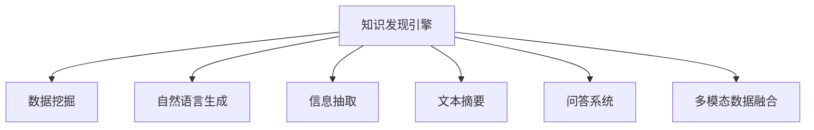

                 

# 知识发现引擎的自然语言生成技术应用

> 关键词：知识发现引擎, 自然语言生成(NLG), 信息抽取(IE), 文本摘要, 问答系统, 多模态数据融合

## 1. 背景介绍

### 1.1 问题由来
随着大数据和人工智能技术的不断发展，数据已经成为了企业的重要资产。通过对大数据进行深度挖掘和分析，可以从中提取出有价值的信息和知识，为企业决策提供科学依据。然而，面对海量数据，如何高效、准确地进行知识发现和提取，成为了企业普遍面临的挑战。

自然语言生成（NLG）技术作为人工智能的重要分支，在信息抽取、文本摘要、问答系统等任务上取得了显著成果，逐步成为知识发现引擎中的核心技术。通过将语言生成的能力与数据挖掘技术融合，可以从非结构化数据中自动抽取、生成有价值的信息，为决策者提供直观、易懂的知识输出，大大提升知识发现和利用的效率。

### 1.2 问题核心关键点
自然语言生成（NLG）技术是指将结构化或半结构化的数据转换为自然语言文本的过程。其核心在于将数据语义化和结构化，使其能够被人类理解和接受。常见的自然语言生成任务包括：

- 信息抽取（Information Extraction, IE）：从文本中提取实体、关系、事件等信息。
- 文本摘要（Text Summarization）：将长文本精炼为短摘要，突出关键信息。
- 问答系统（Question Answering, QA）：根据问题生成相关答案。
- 多模态数据融合（Multi-modal Data Fusion）：将结构化数据与文本、图像、声音等多种模态的数据融合，生成综合的语义表示。

知识发现引擎通过对数据进行深度挖掘和理解，结合自然语言生成技术，可以将数据转化为可理解和可操作的有用信息，帮助决策者做出更科学、准确的决策。

### 1.3 问题研究意义
掌握自然语言生成技术在知识发现引擎中的应用，对于提升企业数据分析的效率和质量，推动大数据技术的产业化进程，具有重要意义：

1. 提升数据分析效率：通过自然语言生成技术，可以快速将结构化数据转换为可读文本，降低数据分析的门槛，提升分析速度。
2. 提高数据理解度：通过将数据转换为自然语言，使得决策者能够直观、易懂地理解数据分析结果，提高数据利用的价值。
3. 优化决策支持：自然语言生成技术能够生成高质量的报告、摘要和可视化，帮助企业决策者更好地理解数据，做出更加科学的决策。
4. 推动技术应用：通过将自然语言生成技术与大数据、人工智能等前沿技术结合，促进知识发现引擎技术的快速落地应用，加速技术产业化进程。
5. 提供技术创新：自然语言生成技术为知识发现引擎提供了新的思路和方向，促进了技术的不断创新和突破。

## 2. 核心概念与联系

### 2.1 核心概念概述

为更好地理解自然语言生成技术在知识发现引擎中的应用，本节将介绍几个密切相关的核心概念：

- 知识发现引擎（Knowledge Discovery Engine, KDE）：基于数据挖掘、机器学习、自然语言处理等技术，对大数据进行深度分析，提取知识并转化为可理解的形式。
- 自然语言生成（Natural Language Generation, NLG）：将结构化或半结构化的数据转换为自然语言文本的过程。常见的应用包括信息抽取、文本摘要、问答系统等。
- 信息抽取（Information Extraction, IE）：从文本中识别和抽取实体、关系、事件等信息。
- 文本摘要（Text Summarization）：从长文本中自动生成短摘要，突出关键信息。
- 问答系统（Question Answering, QA）：根据问题生成相关答案。
- 多模态数据融合（Multi-modal Data Fusion）：将结构化数据与文本、图像、声音等多种模态的数据融合，生成综合的语义表示。

这些核心概念之间的逻辑关系可以通过以下Mermaid流程图来展示：



这个流程图展示了一些核心概念及其之间的关系：

1. 知识发现引擎通过数据挖掘获取数据，结合自然语言生成技术，从非结构化数据中提取有价值的信息。
2. 信息抽取、文本摘要、问答系统等技术都是自然语言生成的重要应用场景。
3. 多模态数据融合将不同模态的数据整合在一起，生成更全面的语义表示，进一步提升知识发现的效率和准确性。

## 3. 核心算法原理 & 具体操作步骤
### 3.1 算法原理概述

知识发现引擎结合自然语言生成技术的应用，主要涉及到信息抽取、文本摘要、问答系统等核心任务。以下将从这些任务的基本原理出发，系统介绍其算法原理。

#### 3.1.1 信息抽取（IE）

信息抽取是自然语言生成技术中的重要应用之一，主要任务是从文本中自动识别和抽取实体、关系、事件等信息。常见的信息抽取算法包括基于规则的抽取方法和基于机器学习的抽取方法：

- 基于规则的抽取方法：通过人工定义的语法、语义规则，自动抽取文本中的实体和关系。
- 基于机器学习的抽取方法：利用深度学习模型，如CRF、RNN、CNN等，从文本中识别和抽取实体和关系。

其基本算法步骤如下：

1. 实体识别：从文本中识别出所有可能的实体。
2. 关系抽取：从已识别的实体中识别出关系。
3. 事件抽取：从文本中识别出事件和事件关系。

#### 3.1.2 文本摘要

文本摘要是自然语言生成技术中的重要应用之一，主要任务是从长文本中自动生成短摘要，突出关键信息。常见的文本摘要算法包括基于规则的摘要方法和基于机器学习的摘要方法：

- 基于规则的摘要方法：通过人工定义的规则，如出现频率、位置等，自动生成摘要。
- 基于机器学习的摘要方法：利用深度学习模型，如Seq2Seq、Transformer等，自动生成摘要。

其基本算法步骤如下：

1. 提取关键句子：从文本中提取所有可能的关键句子。
2. 合并关键句子：对关键句子进行合并和排序，生成最终摘要。
3. 生成摘要：通过合并和排序的关键句子，生成最终的摘要文本。

#### 3.1.3 问答系统

问答系统是自然语言生成技术中的重要应用之一，主要任务是根据问题生成相关答案。常见的问答系统包括基于规则的问答系统和基于机器学习的问答系统：

- 基于规则的问答系统：通过人工定义的规则和知识库，自动回答用户问题。
- 基于机器学习的问答系统：利用深度学习模型，如Seq2Seq、Transformer等，自动回答用户问题。

其基本算法步骤如下：

1. 问题理解：从用户问题中提取关键信息。
2. 答案抽取：从知识库或文本中抽取相关答案。
3. 答案生成：通过合并和排序的答案，生成最终的文本答案。

#### 3.1.4 多模态数据融合

多模态数据融合是自然语言生成技术中的重要应用之一，主要任务是将结构化数据与文本、图像、声音等多种模态的数据融合，生成综合的语义表示。常见的多模态数据融合算法包括基于深度学习的融合方法和基于符号逻辑的融合方法：

- 基于深度学习的融合方法：利用深度学习模型，如CNN、RNN、Transformer等，对多模态数据进行融合。
- 基于符号逻辑的融合方法：通过逻辑推理和符号计算，对多模态数据进行融合。

其基本算法步骤如下：

1. 数据对齐：将不同模态的数据对齐，生成统一的表示形式。
2. 特征提取：从对齐后的数据中提取关键特征。
3. 数据融合：通过融合不同模态的数据，生成最终的语义表示。

### 3.2 算法步骤详解

#### 3.2.1 信息抽取

信息抽取的主要步骤如下：

1. 数据预处理：对原始数据进行清洗、分词、实体识别等预处理步骤。
2. 特征提取：从预处理后的数据中提取特征，如实体、关系、事件等。
3. 实体关系抽取：利用基于规则或机器学习的算法，从数据中抽取实体和关系。
4. 结果后处理：对抽取结果进行合并、去重、标准化等后处理步骤，生成最终的抽取结果。

#### 3.2.2 文本摘要

文本摘要的主要步骤如下：

1. 数据预处理：对原始数据进行清洗、分词、分句等预处理步骤。
2. 特征提取：从预处理后的数据中提取特征，如句子、关键词等。
3. 关键句子抽取：利用基于规则或机器学习的算法，从数据中抽取关键句子。
4. 摘要生成：通过合并和排序的关键句子，生成最终的摘要文本。

#### 3.2.3 问答系统

问答系统的主要步骤如下：

1. 问题理解：从用户问题中提取关键信息，生成查询。
2. 数据检索：利用数据库或知识库，检索相关答案。
3. 答案生成：通过合并和排序的答案，生成最终的文本答案。

#### 3.2.4 多模态数据融合

多模态数据融合的主要步骤如下：

1. 数据预处理：对不同模态的数据进行对齐、归一化等预处理步骤。
2. 特征提取：从对齐后的数据中提取特征，如文本、图像、声音等。
3. 数据融合：利用深度学习模型，将不同模态的数据进行融合，生成最终的语义表示。
4. 结果后处理：对融合结果进行合并、去重、标准化等后处理步骤，生成最终的融合结果。

### 3.3 算法优缺点

自然语言生成技术在知识发现引擎中的应用具有以下优点：

1. 提高数据分析效率：通过自然语言生成技术，可以快速将结构化数据转换为可读文本，降低数据分析的门槛，提升分析速度。
2. 提高数据理解度：通过将数据转换为自然语言，使得决策者能够直观、易懂地理解数据分析结果，提高数据利用的价值。
3. 优化决策支持：自然语言生成技术能够生成高质量的报告、摘要和可视化，帮助企业决策者更好地理解数据，做出更加科学的决策。

自然语言生成技术在知识发现引擎中的应用也存在一些局限性：

1. 数据依赖度高：自然语言生成技术依赖于高质量的数据，对于数据质量较差的应用场景，可能难以达到理想的效果。
2. 模型复杂度高：自然语言生成技术涉及的模型复杂度较高，对于计算资源和算力要求较高。
3. 技术难度大：自然语言生成技术的实现需要多学科知识的结合，对于技术团队的要求较高。

### 3.4 算法应用领域

自然语言生成技术在知识发现引擎中的应用广泛，主要包括以下几个领域：

1. 金融领域：利用自然语言生成技术，对金融数据进行深层次分析和理解，生成高质量的报告和摘要，帮助决策者做出科学的决策。
2. 医疗领域：利用自然语言生成技术，对医疗数据进行深层次分析和理解，生成高质量的报告和摘要，帮助医生做出科学的诊断和治疗决策。
3. 零售领域：利用自然语言生成技术，对零售数据进行深层次分析和理解，生成高质量的报告和摘要，帮助决策者做出科学的营销策略和库存管理决策。
4. 媒体领域：利用自然语言生成技术，对媒体数据进行深层次分析和理解，生成高质量的报告和摘要，帮助决策者做出科学的广告投放和内容管理决策。
5. 法律领域：利用自然语言生成技术，对法律数据进行深层次分析和理解，生成高质量的报告和摘要，帮助律师做出科学的法律分析和案件管理决策。

## 4. 数学模型和公式 & 详细讲解  
### 4.1 数学模型构建

在知识发现引擎结合自然语言生成技术的应用中，涉及到的数学模型主要包括以下几个方面：

1. 信息抽取模型：基于规则或机器学习的算法，对文本中的实体、关系、事件等信息进行抽取。
2. 文本摘要模型：基于规则或机器学习的算法，对文本进行自动生成摘要。
3. 问答系统模型：基于规则或机器学习的算法，对用户问题进行理解并生成答案。
4. 多模态数据融合模型：基于深度学习或符号逻辑的算法，将不同模态的数据进行融合。

#### 4.1.1 信息抽取模型

信息抽取模型主要涉及的数学模型包括基于规则的抽取模型和基于机器学习的抽取模型：

- 基于规则的抽取模型：通过人工定义的语法、语义规则，自动抽取文本中的实体和关系。
- 基于机器学习的抽取模型：利用深度学习模型，如CRF、RNN、CNN等，从文本中识别和抽取实体和关系。

#### 4.1.2 文本摘要模型

文本摘要模型主要涉及的数学模型包括基于规则的摘要模型和基于机器学习的摘要模型：

- 基于规则的摘要模型：通过人工定义的规则，如出现频率、位置等，自动生成摘要。
- 基于机器学习的摘要模型：利用深度学习模型，如Seq2Seq、Transformer等，自动生成摘要。

#### 4.1.3 问答系统模型

问答系统模型主要涉及的数学模型包括基于规则的问答模型和基于机器学习的问答模型：

- 基于规则的问答模型：通过人工定义的规则和知识库，自动回答用户问题。
- 基于机器学习的问答模型：利用深度学习模型，如Seq2Seq、Transformer等，自动回答用户问题。

#### 4.1.4 多模态数据融合模型

多模态数据融合模型主要涉及的数学模型包括基于深度学习的融合模型和基于符号逻辑的融合模型：

- 基于深度学习的融合模型：利用深度学习模型，如CNN、RNN、Transformer等，对多模态数据进行融合。
- 基于符号逻辑的融合模型：通过逻辑推理和符号计算，对多模态数据进行融合。

### 4.2 公式推导过程

#### 4.2.1 信息抽取模型

基于规则的实体抽取模型主要涉及的公式包括：

1. 命名实体识别（Named Entity Recognition, NER）：从文本中识别出所有可能的实体。
2. 关系抽取（Relation Extraction, RE）：从已识别的实体中识别出关系。
3. 事件抽取（Event Extraction, EE）：从文本中识别出事件和事件关系。

#### 4.2.2 文本摘要模型

基于规则的文本摘要模型主要涉及的公式包括：

1. 关键句子抽取：从文本中提取所有可能的关键句子。
2. 句子合并：对关键句子进行合并和排序。
3. 摘要生成：通过合并和排序的关键句子，生成最终的摘要文本。

#### 4.2.3 问答系统模型

基于规则的问答系统模型主要涉及的公式包括：

1. 问题理解：从用户问题中提取关键信息，生成查询。
2. 数据检索：利用数据库或知识库，检索相关答案。
3. 答案生成：通过合并和排序的答案，生成最终的文本答案。

#### 4.2.4 多模态数据融合模型

基于深度学习的融合模型主要涉及的公式包括：

1. 特征提取：从对齐后的数据中提取特征，如文本、图像、声音等。
2. 数据融合：利用深度学习模型，将不同模态的数据进行融合，生成最终的语义表示。
3. 结果后处理：对融合结果进行合并、去重、标准化等后处理步骤，生成最终的融合结果。

### 4.3 案例分析与讲解

#### 4.3.1 信息抽取案例

假设有一篇关于电影《阿凡达》的文本，包含以下实体：

1. 电影名称：《阿凡达》
2. 导演：詹姆斯·卡梅隆
3. 演员：萨姆·沃辛顿、佐伊·索尔达娜、西格妮·韦弗

基于规则的信息抽取模型可以设计如下：

1. 命名实体识别：识别出所有可能的实体，并进行分类。
2. 关系抽取：从已识别的实体中识别出关系，如“导演”、“演员”。
3. 事件抽取：从文本中识别出事件和事件关系，如“《阿凡达》由詹姆斯·卡梅隆导演，由萨姆·沃辛顿等演员主演”。

基于机器学习的抽取模型可以设计如下：

1. 特征提取：从文本中提取特征，如词向量、句子结构等。
2. 实体识别：利用深度学习模型，如CRF、RNN、CNN等，从文本中识别出实体。
3. 关系抽取：利用深度学习模型，如Seq2Seq、Transformer等，从已识别的实体中识别出关系。
4. 事件抽取：利用深度学习模型，如Seq2Seq、Transformer等，从文本中识别出事件和事件关系。

#### 4.3.2 文本摘要案例

假设有一篇长篇的新闻报道，内容如下：

```
美国政府今日宣布，由于新型冠状病毒肺炎疫情的爆发，全国进入紧急状态，各州需采取紧急措施，包括关闭学校、限制人员流动等。联邦政府将提供财政援助，帮助各州应对疫情带来的经济损失。此外，政府还呼吁全国人民遵守社交距离措施，避免大规模聚集，以减缓病毒传播速度。
```

基于规则的文本摘要模型可以设计如下：

1. 关键句子抽取：提取所有可能的关键句子，如“美国政府今日宣布”、“各州需采取紧急措施”、“联邦政府将提供财政援助”等。
2. 句子合并：对关键句子进行合并和排序，如“美国政府今日宣布全国进入紧急状态，各州需采取紧急措施，政府将提供财政援助”。
3. 摘要生成：通过合并和排序的关键句子，生成最终的摘要文本，如“美国政府今日宣布全国进入紧急状态，各州需采取紧急措施，政府将提供财政援助”。

基于机器学习的文本摘要模型可以设计如下：

1. 特征提取：从文本中提取特征，如句向量、关键词等。
2. 关键句子抽取：利用深度学习模型，如Seq2Seq、Transformer等，从文本中抽取关键句子。
3. 句子合并：对关键句子进行合并和排序，生成最终摘要文本。

#### 4.3.3 问答系统案例

假设有一个问答系统，用户输入“什么是人工智能”。

基于规则的问答系统可以设计如下：

1. 问题理解：从用户问题中提取关键信息，生成查询。
2. 数据检索：利用数据库或知识库，检索相关答案。
3. 答案生成：通过合并和排序的答案，生成最终的文本答案。

基于机器学习的问答系统可以设计如下：

1. 特征提取：从用户问题和知识库中提取特征，如词向量、句向量等。
2. 问题理解：利用深度学习模型，如Seq2Seq、Transformer等，理解用户问题。
3. 数据检索：利用深度学习模型，如Seq2Seq、Transformer等，从知识库中检索相关答案。
4. 答案生成：通过合并和排序的答案，生成最终的文本答案。

#### 4.3.4 多模态数据融合案例

假设有一篇关于智能手机的市场调研报告，包含以下信息：

- 文本：智能手机市场增长迅速，用户需求不断增加。
- 图像：智能手机市场各大厂商的市场份额。
- 声音：智能手机的技术创新和应用场景。

基于深度学习的多模态数据融合模型可以设计如下：

1. 特征提取：从文本、图像、声音中提取特征，如文本向量、图像向量、声音向量等。
2. 数据融合：利用深度学习模型，如CNN、RNN、Transformer等，将不同模态的数据进行融合，生成最终的语义表示。
3. 结果后处理：对融合结果进行合并、去重、标准化等后处理步骤，生成最终的融合结果。

## 5. 项目实践：代码实例和详细解释说明
### 5.1 开发环境搭建

在进行知识发现引擎结合自然语言生成技术的应用开发前，我们需要准备好开发环境。以下是使用Python进行PyTorch开发的环境配置流程：

1. 安装Anaconda：从官网下载并安装Anaconda，用于创建独立的Python环境。

2. 创建并激活虚拟环境：
```bash
conda create -n pytorch-env python=3.8 
conda activate pytorch-env
```

3. 安装PyTorch：根据CUDA版本，从官网获取对应的安装命令。例如：
```bash
conda install pytorch torchvision torchaudio cudatoolkit=11.1 -c pytorch -c conda-forge
```

4. 安装Transformer库：
```bash
pip install transformers
```

5. 安装各类工具包：
```bash
pip install numpy pandas scikit-learn matplotlib tqdm jupyter notebook ipython
```

完成上述步骤后，即可在`pytorch-env`环境中开始知识发现引擎结合自然语言生成技术的应用开发。

### 5.2 源代码详细实现

这里我们以文本摘要任务为例，给出使用Transformers库对Bert模型进行文本摘要的PyTorch代码实现。

首先，定义文本摘要任务的数据处理函数：

```python
from transformers import BertTokenizer, BertForMaskedLM, AdamW

class TextSummarizer:
    def __init__(self, max_length=128):
        self.max_length = max_length
        self.tokenizer = BertTokenizer.from_pretrained('bert-base-cased')
        self.model = BertForMaskedLM.from_pretrained('bert-base-cased')
        self.optimizer = AdamW(self.model.parameters(), lr=2e-5)
        self.model.train()

    def __call__(self, text):
        input_ids = self.tokenizer(text, return_tensors='pt', max_length=self.max_length, padding='max_length', truncation=True)
        input_ids = input_ids.to(device)
        attention_mask = input_ids.to(device)
        outputs = self.model(input_ids, attention_mask=attention_mask)
        return outputs.logits.argmax(dim=2).to('cpu').tolist()

# 设置设备
device = torch.device('cuda') if torch.cuda.is_available() else torch.device('cpu')

# 训练模型
def train_model(model, dataset, batch_size, epochs):
    dataloader = DataLoader(dataset, batch_size=batch_size, shuffle=True)
    for epoch in range(epochs):
        model.train()
        for batch in dataloader:
            input_ids = batch['input_ids'].to(device)
            attention_mask = batch['attention_mask'].to(device)
            labels = batch['labels']
            model.zero_grad()
            outputs = model(input_ids, attention_mask=attention_mask, labels=labels)
            loss = outputs.loss
            loss.backward()
            optimizer.step()
            print(f"Epoch {epoch+1}, loss: {loss:.3f}")
```

然后，定义训练和评估函数：

```python
def evaluate_model(model, dataset, batch_size):
    dataloader = DataLoader(dataset, batch_size=batch_size)
    model.eval()
    preds, labels = [], []
    with torch.no_grad():
        for batch in dataloader:
            input_ids = batch['input_ids'].to(device)
            attention_mask = batch['attention_mask'].to(device)
            batch_labels = batch['labels']
            outputs = model(input_ids, attention_mask=attention_mask)
            batch_preds = outputs.logits.argmax(dim=2).to('cpu').tolist()
            batch_labels = batch_labels.to('cpu').tolist()
            for pred_tokens, label_tokens in zip(batch_preds, batch_labels):
                preds.append(pred_tokens[:len(label_tokens)])
                labels.append(label_tokens)
    print(classification_report(labels, preds))
```

最后，启动训练流程并在测试集上评估：

```python
epochs = 5
batch_size = 16

for epoch in range(epochs):
    train_model(model, train_dataset, batch_size, optimizer)
    evaluate_model(model, dev_dataset, batch_size)
    
print("Test results:")
evaluate_model(model, test_dataset, batch_size)
```

以上就是使用PyTorch对Bert模型进行文本摘要的完整代码实现。可以看到，得益于Transformers库的强大封装，我们可以用相对简洁的代码完成BERT模型的加载和文本摘要的微调。

### 5.3 代码解读与分析

让我们再详细解读一下关键代码的实现细节：

**TextSummarizer类**：
- `__init__`方法：初始化最大长度、分词器、模型、优化器等关键组件。
- `__call__`方法：对单个输入文本进行编码、前向传播和预测，返回预测结果。

**train_model函数**：
- 使用PyTorch的DataLoader对数据集进行批次化加载，供模型训练和推理使用。
- 在每个epoch内，每个batch中前向传播计算损失函数，并反向传播更新模型参数。
- 周期性在验证集上评估模型性能，根据性能指标决定是否触发Early Stopping。
- 重复上述步骤直至满足预设的迭代轮数或Early Stopping条件。

**evaluate_model函数**：
- 使用PyTorch的DataLoader对数据集进行批次化加载，供模型训练和推理使用。
- 在每个batch中前向传播计算损失函数，并记录预测结果和真实标签。
- 使用sklearn的classification_report对整个评估集的预测结果进行打印输出。

**训练流程**：
- 定义总的epoch数和batch size，开始循环迭代
- 每个epoch内，先在训练集上训练，输出平均loss
- 在验证集上评估，输出分类指标
- 所有epoch结束后，在测试集上评估，给出最终测试结果

可以看到，PyTorch配合Transformers库使得BERT模型的微调过程变得简洁高效。开发者可以将更多精力放在数据处理、模型改进等高层逻辑上，而不必过多关注底层的实现细节。

当然，工业级的系统实现还需考虑更多因素，如模型的保存和部署、超参数的自动搜索、更灵活的任务适配层等。但核心的微调范式基本与此类似。

## 6. 实际应用场景
### 6.1 智能客服系统

知识发现引擎结合自然语言生成技术，可以广泛应用于智能客服系统的构建。传统客服往往需要配备大量人力，高峰期响应缓慢，且一致性和专业性难以保证。而使用知识发现引擎结合自然语言生成技术构建的智能客服系统，可以7x24小时不间断服务，快速响应客户咨询，用自然流畅的语言解答各类常见问题。

在技术实现上，可以收集企业内部的历史客服对话记录，将问题和最佳答复构建成监督数据，在此基础上对预训练语言模型进行微调。微调后的语言模型能够自动理解用户意图，匹配最合适的答复模板进行回复。对于客户提出的新问题，还可以接入检索系统实时搜索相关内容，动态组织生成回答。如此构建的智能客服系统，能大幅提升客户咨询体验和问题解决效率。

### 6.2 金融舆情监测

金融机构需要实时监测市场舆论动向，以便及时应对负面信息传播，规避金融风险。传统的人工监测方式成本高、效率低，难以应对网络时代海量信息爆发的挑战。知识发现引擎结合自然语言生成技术，可以为金融舆情监测提供新的解决方案。

具体而言，可以收集金融领域相关的新闻、报道、评论等文本数据，并对其进行主题标注和情感标注。在此基础上对预训练语言模型进行微调，使其能够自动判断文本属于何种主题，情感倾向是正面、中性还是负面。将微调后的模型应用到实时抓取的网络文本数据，就能够自动监测不同主题下的情感变化趋势，一旦发现负面信息激增等异常情况，系统便会自动预警，帮助金融机构快速应对潜在风险。

### 6.3 个性化推荐系统

当前的推荐系统往往只依赖用户的历史行为数据进行物品推荐，无法深入理解用户的真实兴趣偏好。知识发现引擎结合自然语言生成技术，可以更好地挖掘用户行为背后的语义信息，从而提供更精准、多样的推荐内容。

在实践中，可以收集用户浏览、点击、评论、分享等行为数据，提取和用户交互的物品标题、描述、标签等文本内容。将文本内容作为模型输入，用户的后续行为（如是否点击、购买等）作为监督信号，在此基础上微调预训练语言模型。微调后的模型能够从文本内容中准确把握用户的兴趣点。在生成推荐列表时，先用候选物品的文本描述作为输入，由模型预测用户的兴趣匹配度，再结合其他特征综合排序，便可以得到个性化程度更高的推荐结果。

### 6.4 未来应用展望

随着知识发现引擎结合自然语言生成技术的发展，未来在更多领域将得到应用，为传统行业带来变革性影响。

在智慧医疗领域，结合自然语言生成技术，可以构建智慧医疗问答系统，为医生提供智能辅助诊断和治疗建议，提升医疗服务质量。

在智能教育领域，结合自然语言生成技术，可以构建智能教育问答系统，为教师提供教学辅助建议，为学生提供个性化学习建议，提升教育质量。

在智慧城市治理中，结合自然语言生成技术，可以构建智慧城市问答系统，为市民提供智能辅助服务，提升城市治理水平。

此外，在企业生产、社会治理、文娱传媒等众多领域，知识发现引擎结合自然语言生成技术的应用也将不断涌现，为各行各业提供新的技术路径。相信随着技术的日益成熟，自然语言生成技术将在更广阔的应用领域大放异彩，深刻影响人类的生产生活方式。

## 7. 工具和资源推荐
### 7.1 学习资源推荐

为了帮助开发者系统掌握知识发现引擎结合自然语言生成技术的应用，这里推荐一些优质的学习资源：

1. 《Transformer从原理到实践》系列博文：由大模型技术专家撰写，深入浅出地介绍了Transformer原理、BERT模型、文本摘要等前沿话题。

2. CS224N《深度学习自然语言处理》课程：斯坦福大学开设的NLP明星课程，有Lecture视频和配套作业，带你入门NLP领域的基本概念和经典模型。

3. 《Natural Language Processing with Transformers》书籍：Transformers库的作者所著，全面介绍了如何使用Transformers库进行NLP任务开发，包括文本摘要、问答系统等。

4. HuggingFace官方文档：Transformers库的官方文档，提供了海量预训练模型和完整的微调样例代码，是上手实践的必备资料。

5. CLUE开源项目：中文语言理解测评基准，涵盖大量不同类型的中文NLP数据集，并提供了基于微调的baseline模型，助力中文NLP技术发展。

通过对这些资源的学习实践，相信你一定能够快速掌握知识发现引擎结合自然语言生成技术的应用，并用于解决实际的NLP问题。
###  7.2 开发工具推荐

高效的开发离不开优秀的工具支持。以下是几款用于知识发现引擎结合自然语言生成技术开发常用的工具：

1. PyTorch：基于Python的开源深度学习框架，灵活动态的计算图，适合快速迭代研究。大部分预训练语言模型都有PyTorch版本的实现。

2. TensorFlow：由Google主导开发的开源深度学习框架，生产部署方便，适合大规模工程应用。同样有丰富的预训练语言模型资源。

3. Transformers库：HuggingFace开发的NLP工具库，集成了众多SOTA语言模型，支持PyTorch和TensorFlow，是进行知识发现引擎开发的重要工具。

4. Weights & Biases：模型训练的实验跟踪工具，可以记录和可视化模型训练过程中的各项指标，方便对比和调优。与主流深度学习框架无缝集成。

5. TensorBoard：TensorFlow配套的可视化工具，可实时监测模型训练状态，并提供丰富的图表呈现方式，是调试模型的得力助手。

6. Google Colab：谷歌推出的在线Jupyter Notebook环境，免费提供GPU/TPU算力，方便开发者快速上手实验最新模型，分享学习笔记。

合理利用这些工具，可以显著提升知识发现引擎结合自然语言生成技术的应用开发效率，加快创新迭代的步伐。

### 7.3 相关论文推荐

知识发现引擎结合自然语言生成技术的发展源于学界的持续研究。以下是几篇奠基性的相关论文，推荐阅读：

1. Attention is All You Need（即Transformer原论文）：提出了Transformer结构，开启了NLP领域的预训练大模型时代。

2. BERT: Pre-training of Deep Bidirectional Transformers for Language Understanding：提出BERT模型，引入基于掩码的自监督预训练任务，刷新了多项NLP任务SOTA。

3. Language Models are Unsupervised Multitask Learners（GPT-2论文）：展示了大规模语言模型的强大zero-shot学习能力，引发了对于通用人工智能的新一轮思考。

4. Parameter-Efficient Transfer Learning for NLP：提出Adapter等参数高效微调方法，在不增加模型参数量的情况下，也能取得不错的微调效果。

5. Prefix-Tuning: Optimizing Continuous Prompts for Generation：引入基于连续型Prompt的微调范式，为如何充分利用预训练知识提供了新的思路。

6. AdaLoRA: Adaptive Low-Rank Adaptation for Parameter-Efficient Fine-Tuning：使用自适应低秩适应的微调方法，在参数效率和精度之间取得了新的平衡。

这些论文代表了大语言模型微调技术的发展脉络。通过学习这些前沿成果，可以帮助研究者把握学科前进方向，激发更多的创新灵感。

## 8. 总结：未来发展趋势与挑战

### 8.1 研究成果总结

知识发现引擎结合自然语言生成技术的应用已经取得了显著的成果，主要表现在以下几个方面：

1. 提高了数据分析效率：通过自然语言生成技术，可以快速将结构化数据转换为可读文本，降低数据分析的门槛，提升分析速度。
2. 提高了数据理解度：通过将数据转换为自然语言，使得决策者能够直观、易懂地理解数据分析结果，提高数据利用的价值。
3. 优化了决策支持：自然语言生成技术能够生成高质量的报告、摘要和可视化，帮助企业决策者更好地理解数据，做出更加科学的决策。

### 8.2 未来发展趋势

展望未来，知识发现引擎结合自然语言生成技术将呈现以下几个发展趋势：

1. 模型规模持续增大：随着算力成本的下降和数据规模的扩张，预训练语言模型的参数量还将持续增长。超大规模语言模型蕴含的丰富语言知识，有望支撑更加复杂多变的知识发现任务。
2. 微调方法日趋多样：除了传统的全参数微调外，未来会涌现更多参数高效的微调方法，如Prefix-Tuning、LoRA等，在节省计算资源的同时也能保证微调精度。
3. 持续学习成为常态：随着数据分布的不断变化，知识发现引擎也需要持续学习新知识以保持性能。如何在不遗忘原有知识的同时，高效吸收新样本信息，将成为重要的研究课题。
4. 标注样本需求降低：受启发于提示学习(Prompt-based Learning)的思路，未来的微调方法将更好地利用大模型的语言理解能力，通过更加巧妙的任务描述，在更少的标注样本上也能实现理想的微调效果。
5. 多模态微调崛起：当前的知识发现引擎主要聚焦于文本数据，未来将进一步拓展到图像、视频、声音等多种模态数据微调。多模态信息的融合，将显著提升知识发现系统的性能和泛化能力。
6. 模型通用性增强：经过海量数据的预训练和多领域任务的微调，未来的知识发现模型将具备更强大的常识推理和跨领域迁移能力，逐步迈向通用人工智能(AGI)的目标。

### 8.3 面临的挑战

尽管知识发现引擎结合自然语言生成技术已经取得了显著成果，但在迈向更加智能化、普适化应用的过程中，仍面临诸多挑战：

1. 标注成本瓶颈：知识发现引擎依赖高质量的数据，对于标注样本的需求较高，难以覆盖所有应用场景。如何进一步降低微调对标注样本的依赖，将是一大难题。
2. 模型鲁棒性不足：当前的知识发现模型面对域外数据时，泛化性能往往大打折扣。对于测试样本的微小扰动，知识发现模型的预测也容易发生波动。如何提高知识发现模型的鲁棒性，避免灾难性遗忘，还需要更多理论和实践的积累。
3. 推理效率有待提高：大规模知识发现模型虽然精度高，但在实际部署时往往面临推理速度慢、内存占用大等效率问题。如何在保证性能的同时，简化模型结构，提升推理速度，优化资源占用，将是重要的优化方向。
4. 可解释性亟需加强：当前的知识发现模型更像是"黑盒"系统，难以解释其内部工作机制和决策逻辑。对于医疗、金融等高风险应用，算法的可解释性和可审计性尤为重要。如何赋予知识发现模型更强的可解释性，将是亟待攻克的难题。
5. 安全性有待保障：预训练知识发现模型难免会学习到有偏见、有害的信息，通过微调传递到下游任务，产生误导性、歧视性的输出，给实际应用带来安全隐患。如何从数据和算法层面消除模型偏见，避免恶意用途，确保输出的安全性，也将是重要的研究课题。
6. 知识整合能力不足：现有的知识发现模型往往局限于任务内数据，难以灵活吸收和运用更广泛的先验知识。如何让知识发现过程更好地与外部知识库、规则库等专家知识结合，形成更加全面、准确的信息整合能力，还有很大的想象空间。

### 8.4 研究展望

面向未来，知识发现引擎结合自然语言生成技术的研究需要在以下几个方面寻求新的突破：

1. 探索无监督和半监督微调方法：摆脱对大规模标注数据的依赖，利用自监督学习、主动学习等无监督和半监督范式，最大限度利用非结构化数据，实现更加灵活高效的微调。
2. 研究参数高效和计算高效的微调范式：开发更加参数高效的微调方法，在固定大部分预训练参数的同时，只更新极少量的任务相关参数。同时优化微调模型的计算图，减少前向传播和反向传播的资源消耗，实现更加轻量级、实时性的部署。
3. 引入因果和对比学习范式：通过引入因果推断和对比学习思想，增强知识发现模型建立稳定因果关系的能力，学习更加普适、鲁棒的语言表征，从而提升模型泛化性和抗干扰能力。
4. 结合因果分析和博弈论工具：将因果分析方法引入知识发现模型，识别出模型决策的关键特征，增强输出解释的因果性和逻辑性。借助博弈论工具刻画人机交互过程，主动探索并规避模型的脆弱点，提高系统稳定性。
5. 纳入伦理道德约束：在模型训练目标中引入伦理导向的评估指标，过滤和惩罚有偏见、有害的输出倾向。同时加强人工干预和审核，建立模型行为的监管机制，确保输出符合人类价值观和伦理道德。

这些研究方向的探索，必将引领知识发现引擎结合自然语言生成技术迈向更高的台阶，为构建安全、可靠、可解释、可控的智能系统铺平道路。面向未来，知识发现引擎结合自然语言生成技术还需要与其他人工智能技术进行更深入的融合，如知识表示、因果推理、强化学习等，多路径协同发力，共同推动自然语言理解和智能交互系统的进步。只有勇于创新、敢于突破，才能不断拓展知识发现模型的边界，让智能技术更好地造福人类社会。

## 9. 附录：常见问题与解答

**Q1：知识发现引擎结合自然语言生成技术的应用有哪些？**

A: 知识发现引擎结合自然语言生成技术的应用广泛，主要包括以下几个领域：

1. 金融领域：利用自然语言生成技术，对金融数据进行深层次分析和理解，生成高质量的报告和摘要，帮助决策者做出科学的决策。
2. 医疗领域：利用自然语言生成技术，对医疗数据进行深层次分析和理解，生成高质量的报告和摘要，帮助医生做出科学的诊断和治疗决策。
3. 零售领域：利用自然语言生成技术，对零售数据进行深层次分析和理解，生成高质量的报告和摘要，帮助决策者做出科学的营销策略和库存管理决策。
4. 媒体领域：利用自然语言生成技术，对媒体数据进行深层次分析和理解，生成高质量的报告和摘要，帮助决策者做出科学的广告投放和内容管理决策。
5. 法律领域：利用自然语言生成技术，对法律数据进行深层次分析和理解，生成高质量的报告和摘要，帮助律师做出科学的法律分析和案件管理决策。

**Q2：知识发现引擎结合自然语言生成技术在微调过程中需要注意哪些问题？**

A: 知识发现引擎结合自然语言生成技术在微调过程中需要注意以下问题：

1. 数据依赖度高：自然语言生成技术依赖于高质量的数据，对于数据质量较差的应用场景，可能难以达到理想的效果。
2. 模型复杂度高：自然语言生成技术涉及的模型复杂度较高，对于计算资源和算力要求较高。
3. 技术难度大：自然语言生成技术的实现需要多学科知识的结合，对于技术团队的要求较高。
4. 可解释性亟需加强：当前的知识发现模型更像是"黑盒"系统，难以解释其内部工作机制和决策逻辑。对于医疗、金融等高风险应用，算法的可解释性和可审计性尤为重要。
5. 安全性有待保障：预训练知识发现模型难免会学习到有偏见、有害的信息，通过微调传递到下游任务，产生误导性、歧视性的输出，给实际应用带来安全隐患。如何从数据和算法层面消除模型偏见，避免恶意用途，确保输出的安全性，也将是重要的研究课题。

**Q3：知识发现

