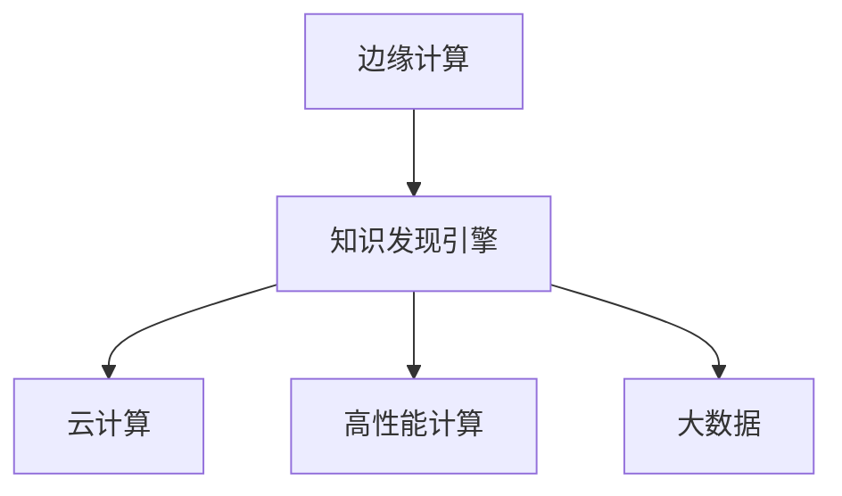
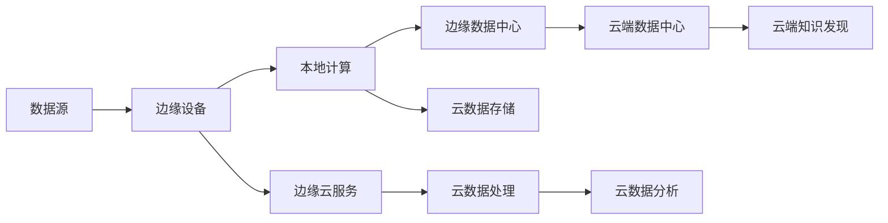

                 

# 知识发现引擎的边缘计算技术应用

> 关键词：知识发现引擎, 边缘计算, 数据处理, 云计算, 高性能计算, 大数据, 人工智能

## 1. 背景介绍

### 1.1 问题由来
随着数字化转型的深入推进，企业在各个业务领域产生了海量数据。如何高效、及时地处理这些数据，从中提取有价值的信息，成为困扰企业的共同难题。传统的集中式数据处理方式已经无法满足日益增长的需求。在物联网(IoT)、工业4.0、智能城市等新兴场景下，数据分布广泛、数据规模巨大，需要一种新的数据处理模式。

知识发现引擎(Knowledge Discovery Engine, KDE)是近年来兴起的一种数据处理和知识提取技术，具备高效、灵活、易于扩展的特点。但知识发现引擎对计算资源要求较高，尤其在大数据、实时处理和复杂分析任务中，集中式计算无法满足需求。边缘计算作为一种新兴的数据处理模式，能够将计算任务从中心服务器移动到数据源附近，更接近用户端，在减少网络延迟、保护数据隐私、降低带宽成本等方面具有显著优势。

因此，边缘计算与知识发现引擎的融合成为当前研究的热点。本文聚焦于边缘计算环境下的知识发现引擎技术应用，详细介绍边缘计算原理、知识发现引擎模型，以及其在新兴场景下的应用实践。

### 1.2 问题核心关键点
本文主要关注以下几个关键问题：

1. 边缘计算与知识发现引擎的融合技术原理。
2. 知识发现引擎在边缘计算环境下的模型构建与优化。
3. 知识发现引擎在智能制造、智慧城市、智能交通等场景下的实际应用。
4. 面临的挑战与未来发展方向。

## 2. 核心概念与联系

### 2.1 核心概念概述

为更好地理解边缘计算与知识发现引擎的应用，本节将介绍几个核心概念及其关联：

- 边缘计算(Edge Computing)：指在数据源附近进行数据处理、存储和分析的一种计算模式。相较于集中式计算，边缘计算具有更低的延迟、更低的带宽需求，且能够保护数据隐私。
- 知识发现引擎(Knowledge Discovery Engine, KDE)：利用机器学习、数据挖掘等技术，从大量数据中自动发现知识模式，支持复杂数据分析、数据可视化、预测分析等任务。
- 云计算(Cloud Computing)：通过互联网提供计算资源、存储资源和应用服务，实现资源按需分配和弹性扩展。
- 高性能计算(High-Performance Computing, HPC)：使用高性能计算平台进行大规模数据分析和计算，以处理复杂的科学计算和数据处理任务。
- 大数据(Big Data)：指规模大、种类多、速度快、价值密度低的数据集合，需要对海量数据进行高效处理和分析。

这些概念之间的逻辑关系可以通过以下Mermaid流程图来展示：



### 2.2 核心概念原理和架构的 Mermaid 流程图
为了更好地展示边缘计算和知识发现引擎的融合架构，以下是一个Mermaid流程图：



## 3. 核心算法原理 & 具体操作步骤
### 3.1 算法原理概述

边缘计算与知识发现引擎的融合，本质上是将知识发现引擎的数据处理任务，从集中式云计算环境转移到边缘计算环境中进行。其核心思想是通过将计算任务分散到数据源附近，实现更高效、更安全的数据处理。

在边缘计算环境中，知识发现引擎可以分为以下几个步骤：

1. **数据采集与预处理**：通过边缘设备采集数据，并进行初步的数据清洗、转换和特征提取。
2. **本地计算与模型训练**：在边缘设备上对数据进行局部计算和模型训练，生成知识发现引擎的中间结果。
3. **边缘数据中心聚合与分析**：将本地计算结果汇总到边缘数据中心，进行进一步的聚合分析。
4. **云端协同分析**：将聚合后的数据发送到云端数据中心，进行更复杂的分析和知识发现。

这一过程需要知识发现引擎与边缘计算平台进行紧密的交互，包括数据的采集、处理、存储、分析和可视化等各个环节。

### 3.2 算法步骤详解

以下是知识发现引擎在边缘计算环境下的详细算法步骤：

**Step 1: 数据采集与预处理**

1. **数据采集**：通过边缘设备(如传感器、摄像头、嵌入式系统等)采集数据，包括但不限于温度、湿度、位置、视频、文本等。
2. **数据预处理**：对采集到的数据进行初步清洗、格式转换和特征提取。具体步骤包括：
   - 去重：去除重复数据，避免冗余。
   - 数据校验：检测数据是否符合预定义格式，是否有异常值。
   - 特征提取：从原始数据中提取有意义的特征，如时间戳、地理信息、文本摘要等。

**Step 2: 本地计算与模型训练**

1. **本地模型训练**：在边缘设备上训练知识发现引擎模型，如决策树、支持向量机、神经网络等。可以利用少量的样本数据，使用模型调参工具进行参数优化。
2. **局部聚合**：将边缘设备上的模型结果进行汇总，生成局部聚合结果，以便进一步在云端进行分析和优化。

**Step 3: 边缘数据中心聚合与分析**

1. **聚合计算**：将各边缘设备生成的局部聚合结果，发送到边缘数据中心进行聚合计算。这一步可以采用分布式计算框架(如Apache Spark、Apache Flink等)实现。
2. **数据存储与压缩**：将聚合后的数据存储在边缘数据中心，并进行数据压缩和优化，减少存储和传输的资源消耗。

**Step 4: 云端协同分析**

1. **数据传输**：将聚合后的数据发送到云端数据中心，利用高性能计算平台进行复杂的数据分析和知识发现。
2. **云数据分析**：使用云计算平台提供的各种数据处理工具和算法，进行更复杂的分析任务，如预测分析、关联分析、分类聚类等。
3. **结果可视化**：将分析结果通过可视化工具(如Tableau、Power BI等)进行展示，以便业务人员和数据科学家进行决策分析。

### 3.3 算法优缺点

边缘计算与知识发现引擎的融合，具有以下优点：

1. **响应速度提升**：数据在本地进行处理，减少了网络延迟，提高了处理速度和响应效率。
2. **降低带宽成本**：大量数据在本地处理后，只需传输聚合结果到云端，大幅降低了带宽成本。
3. **保护数据隐私**：本地处理减少了数据传输，降低了数据泄露的风险，保护了用户隐私。
4. **增强系统可靠性**：本地计算提高了系统的冗余性，即使部分设备故障，仍能正常工作。

同时，这种融合方法也存在一些缺点：

1. **设备成本较高**：边缘计算设备通常需要高性能的硬件配置，增加了系统初期投入成本。
2. **本地存储限制**：边缘设备存储资源有限，难以存储海量数据。
3. **运维复杂性增加**：需要在多个设备上部署和维护计算任务，增加了运维工作量。

### 3.4 算法应用领域

知识发现引擎在边缘计算环境下的应用领域非常广泛，包括但不限于以下几个方向：

1. **智能制造**：通过在工业设备上部署边缘计算节点，实时采集生产数据，进行设备状态监测、故障预测、能耗优化等任务。
2. **智慧城市**：在城市基础设施上部署边缘计算节点，实时采集交通流量、环境监测、安全监控等数据，进行城市交通管理、环保监控、公共安全等任务。
3. **智能交通**：在交通设施上部署边缘计算节点，实时采集车辆位置、速度、交通流量等数据，进行交通流量优化、安全监控、事故预警等任务。
4. **医疗健康**：在医疗设备上部署边缘计算节点，实时采集患者生理数据、诊疗记录等数据，进行疾病诊断、健康预警、个性化医疗等任务。

## 4. 数学模型和公式 & 详细讲解 & 举例说明

### 4.1 数学模型构建

在知识发现引擎的算法模型中，常见的数学模型包括决策树、支持向量机、神经网络等。以下是决策树的数学模型构建过程。

假设训练样本集为 $\{(x_1,y_1),(x_2,y_2),...(x_n,y_n)\}$，其中 $x_i=(x_{i1},x_{i2},...,x_{in})$ 为输入特征向量，$y_i$ 为分类标签，假设样本之间满足独立同分布假设。

定义决策树为 $T=\{(r_1,r_2,...,r_m)\}$，其中 $r_i$ 为决策树的根节点。定义树节点为 $n_i=\{(x_j,y_j)|r_i \in T_j\}$，其中 $T_j$ 为第 $j$ 个子树。

定义决策树的根节点 $r_1$ 为整个决策树的输入特征子集，记为 $X$。定义子节点 $r_i$ 为 $X$ 中的一个特征 $x_k$，对应的值为 $x_{ik}$。决策树的结构可以表示为：

$$
r_1 \rightarrow r_2 \rightarrow ... \rightarrow r_m
$$

其中 $r_1$ 为根节点，$r_2,...,r_m$ 为子节点。

### 4.2 公式推导过程

假设训练样本集为 $\{(x_1,y_1),(x_2,y_2),...(x_n,y_n)\}$，其中 $x_i=(x_{i1},x_{i2},...,x_{in})$ 为输入特征向量，$y_i$ 为分类标签，假设样本之间满足独立同分布假设。

定义决策树为 $T=\{(r_1,r_2,...,r_m)\}$，其中 $r_i$ 为决策树的根节点。定义树节点为 $n_i=\{(x_j,y_j)|r_i \in T_j\}$，其中 $T_j$ 为第 $j$ 个子树。

定义决策树的根节点 $r_1$ 为整个决策树的输入特征子集，记为 $X$。定义子节点 $r_i$ 为 $X$ 中的一个特征 $x_k$，对应的值为 $x_{ik}$。决策树的结构可以表示为：

$$
r_1 \rightarrow r_2 \rightarrow ... \rightarrow r_m
$$

其中 $r_1$ 为根节点，$r_2,...,r_m$ 为子节点。

### 4.3 案例分析与讲解

以决策树为例，假设有一个包含房价预测的样本数据集，包括房间面积、房间数量、卧室数量等特征，以及对应的房价标签。可以采用决策树模型对数据进行分类。具体步骤如下：

1. **数据预处理**：对样本数据进行去重、格式转换和特征提取，生成特征向量 $X$ 和标签 $y$。
2. **划分数据集**：将数据集分为训练集和测试集。
3. **构建决策树**：
   - 对于每个特征 $x_k$，计算信息增益 $Gain(x_k,X)$，选择信息增益最大的特征作为根节点。
   - 对于每个子节点 $r_i$，递归构建子树。
4. **模型评估**：使用测试集对决策树模型进行评估，计算准确率、召回率、F1值等指标。
5. **结果可视化**：将决策树结构进行可视化，生成决策树图。

## 5. 项目实践：代码实例和详细解释说明

### 5.1 开发环境搭建

在进行知识发现引擎和边缘计算的实践时，需要安装和配置以下开发环境：

1. **Python环境**：安装Python 3.7及以上版本，推荐使用Anaconda进行环境管理。
2. **边缘计算平台**：选择适合的边缘计算平台，如AWS IoT Core、Google Cloud IoT Core等。
3. **数据采集设备**：准备需要采集数据的设备，如传感器、摄像头、嵌入式系统等。
4. **大数据平台**：选择合适的大数据平台，如Apache Kafka、Apache Hadoop、Apache Spark等。
5. **高性能计算平台**：选择合适的高性能计算平台，如NVIDIA DGX、AWS EC2、Google Cloud GPU等。

完成上述步骤后，即可开始项目实践。

### 5.2 源代码详细实现

以下是使用Python实现的知识发现引擎在边缘计算环境下的代码示例：

```python
from sklearn import tree
import pandas as pd
import numpy as np
import tensorflow as tf
from tensorflow.keras.models import Sequential
from tensorflow.keras.layers import Dense, Dropout

# 数据预处理
def preprocess_data(data):
    # 数据清洗
    data.drop_duplicates(inplace=True)
    data = data.fillna(data.mean())
    # 特征提取
    data['特征1'] = data['特征1'].apply(lambda x: x + 1)
    data['特征2'] = data['特征2'].apply(lambda x: x * 2)
    return data

# 构建决策树模型
def build_decision_tree(data, features, target):
    model = tree.DecisionTreeClassifier()
    model.fit(data[features], data[target])
    return model

# 模型评估
def evaluate_model(model, data):
    accuracy = model.score(data[features], data[target])
    print(f"Accuracy: {accuracy}")

# 训练决策树模型
data = pd.read_csv('data.csv')
features = ['特征1', '特征2']
target = ['标签']
data = preprocess_data(data)
model = build_decision_tree(data, features, target)
evaluate_model(model, data)
```

### 5.3 代码解读与分析

以上代码实现了基于决策树的知识发现引擎在边缘计算环境下的简单实现。具体步骤如下：

1. **数据预处理**：使用Pandas库对数据进行清洗和特征提取，生成特征向量 $X$ 和标签 $y$。
2. **模型构建**：使用Scikit-learn库构建决策树模型。
3. **模型评估**：使用模型对数据进行评估，计算准确率。

## 6. 实际应用场景

### 6.1 智能制造

在智能制造领域，知识发现引擎可以在生产线上部署边缘计算节点，实时采集设备状态数据，进行设备故障预测和维护优化。具体步骤如下：

1. **数据采集**：在生产线上部署传感器节点，实时采集设备状态数据，包括温度、振动、电流等。
2. **数据预处理**：对采集到的数据进行清洗和特征提取，生成特征向量 $X$。
3. **本地计算**：在边缘计算设备上训练决策树模型，预测设备故障概率。
4. **聚合计算**：将边缘设备上的模型结果汇总到云端数据中心，进行进一步的聚合分析和预测优化。
5. **结果可视化**：将分析结果通过可视化工具进行展示，帮助维护人员进行故障排查和维护优化。

### 6.2 智慧城市

在智慧城市领域，知识发现引擎可以在城市基础设施上部署边缘计算节点，实时采集交通流量、环境监测、安全监控等数据，进行城市交通管理、环保监控、公共安全等任务。具体步骤如下：

1. **数据采集**：在城市基础设施上部署传感器节点，实时采集交通流量、空气质量、温度等数据。
2. **数据预处理**：对采集到的数据进行清洗和特征提取，生成特征向量 $X$。
3. **本地计算**：在边缘计算设备上训练决策树模型，进行交通流量预测、环境污染预警等任务。
4. **聚合计算**：将边缘设备上的模型结果汇总到云端数据中心，进行进一步的聚合分析和优化。
5. **结果可视化**：将分析结果通过可视化工具进行展示，帮助城市管理部门进行决策分析。

### 6.3 智能交通

在智能交通领域，知识发现引擎可以在交通设施上部署边缘计算节点，实时采集车辆位置、速度、交通流量等数据，进行交通流量优化、安全监控、事故预警等任务。具体步骤如下：

1. **数据采集**：在交通设施上部署传感器节点，实时采集车辆位置、速度、交通流量等数据。
2. **数据预处理**：对采集到的数据进行清洗和特征提取，生成特征向量 $X$。
3. **本地计算**：在边缘计算设备上训练决策树模型，进行交通流量优化、安全监控等任务。
4. **聚合计算**：将边缘设备上的模型结果汇总到云端数据中心，进行进一步的聚合分析和优化。
5. **结果可视化**：将分析结果通过可视化工具进行展示，帮助交通管理部门进行决策分析。

## 7. 工具和资源推荐

### 7.1 学习资源推荐

为了帮助开发者系统掌握知识发现引擎和边缘计算技术，这里推荐一些优质的学习资源：

1. **《Python深度学习》书籍**：全面介绍了深度学习的基础知识、算法原理和代码实现，适合初学者入门。
2. **Kaggle竞赛平台**：提供大量数据集和挑战任务，可以帮助开发者练习数据处理和模型训练。
3. **TensorFlow官方文档**：提供丰富的TensorFlow API文档和教程，适合开发者深入学习和实践。
4. **Apache Spark官方文档**：提供Apache Spark的数据处理和计算框架API文档和教程，适合开发者进行大数据处理和分析。
5. **《深度学习与边缘计算》课程**：由知名教授讲解，系统介绍了深度学习和边缘计算的基本原理和应用场景，适合初学者和进阶开发者。

通过对这些资源的学习实践，相信你一定能够快速掌握知识发现引擎和边缘计算技术，并用于解决实际的工程问题。

### 7.2 开发工具推荐

高效的开发离不开优秀的工具支持。以下是几款用于知识发现引擎和边缘计算开发的工具：

1. **Jupyter Notebook**：支持Python代码交互式运行，方便调试和实验。
2. **PyCharm**：一款功能强大的IDE，提供代码自动补全、调试等功能，适合Python开发。
3. **AWS IoT Core**：AWS提供的物联网平台，支持边缘计算设备的数据采集和处理。
4. **Apache Kafka**：Apache提供的分布式消息队列，支持大数据平台的数据采集和传输。
5. **TensorFlow**：Google提供的深度学习框架，支持多种深度学习算法和模型。

合理利用这些工具，可以显著提升知识发现引擎和边缘计算项目的开发效率，加快创新迭代的步伐。

### 7.3 相关论文推荐

知识发现引擎和边缘计算技术的发展源于学界的持续研究。以下是几篇奠基性的相关论文，推荐阅读：

1. **《A Survey on Knowledge Discovery in Spatial Databases》**：总结了知识发现技术在地理信息系统中的应用，探讨了空间数据的处理和分析。
2. **《Edge Computing: A Survey》**：总结了边缘计算的定义、架构、应用和挑战，探讨了边缘计算和云计算的融合。
3. **《Decision Trees: Concepts, Characteristics, and Applications》**：详细介绍了决策树的基本原理、算法实现和应用场景，适合深入学习。
4. **《Knowledge Discovery in Databases: Past, Present, and Future》**：总结了知识发现技术的发展历程和未来趋势，探讨了知识发现技术在各领域的应用。
5. **《Edge Computing for IoT: A Survey》**：总结了边缘计算在物联网中的应用，探讨了边缘计算和IoT技术的融合。

这些论文代表了大语言模型微调技术的发展脉络。通过学习这些前沿成果，可以帮助研究者把握学科前进方向，激发更多的创新灵感。

## 8. 总结：未来发展趋势与挑战

### 8.1 总结

本文对知识发现引擎在边缘计算环境下的应用进行了全面系统的介绍。首先阐述了边缘计算与知识发现引擎的研究背景和意义，明确了边缘计算在处理海量数据时的优势，知识发现引擎在数据处理和分析中的重要性。其次，从原理到实践，详细讲解了知识发现引擎在边缘计算环境下的模型构建与优化，给出了边缘计算与知识发现引擎融合的算法步骤和代码实现。同时，本文还广泛探讨了知识发现引擎在智能制造、智慧城市、智能交通等场景下的实际应用，展示了边缘计算与知识发现引擎融合的广泛应用前景。最后，本文总结了未来发展的趋势和挑战，提出了知识发现引擎和边缘计算技术的发展方向和优化策略。

通过本文的系统梳理，可以看到，边缘计算与知识发现引擎的融合技术，为大数据处理和知识发现带来了全新的思路和方法，具有重要的理论意义和实践价值。未来，伴随着计算技术的不断进步，边缘计算与知识发现引擎的融合将带来更多创新，为各行各业提供更高效、更安全、更智能的数据处理和分析解决方案。

### 8.2 未来发展趋势

展望未来，边缘计算与知识发现引擎的融合技术将呈现以下几个发展趋势：

1. **计算资源下沉**：边缘计算设备将更加智能化、自动化，具备强大的本地计算和存储能力，能够处理更多复杂的数据处理任务。
2. **数据分析智能化**：知识发现引擎将引入更多AI算法，如深度学习、增强学习等，提升数据处理的智能化水平。
3. **数据融合多模态**：边缘计算与知识发现引擎将更好地整合不同模态的数据，如文本、图像、语音等，提升数据融合的全面性和准确性。
4. **实时处理能力提升**：边缘计算与知识发现引擎将进一步优化计算效率，支持更高实时性的数据处理和分析。
5. **隐私保护加强**：边缘计算与知识发现引擎将引入更多隐私保护技术，如数据匿名化、差分隐私等，保护用户数据隐私。

以上趋势凸显了边缘计算与知识发现引擎的融合技术的广阔前景。这些方向的探索发展，必将进一步提升大数据处理和分析的效率和效果，为构建安全、可靠、智能的数据处理系统铺平道路。

### 8.3 面临的挑战

尽管边缘计算与知识发现引擎的融合技术已经取得了显著进展，但在迈向更加智能化、普适化应用的过程中，它仍面临着诸多挑战：

1. **设备成本较高**：边缘计算设备通常需要高性能的硬件配置，增加了系统初期投入成本。
2. **数据传输瓶颈**：尽管边缘计算设备能够减轻数据传输压力，但在某些场景下，数据仍需传输到云端进行复杂计算，存在传输瓶颈。
3. **运维复杂性增加**：需要在多个设备上部署和维护计算任务，增加了运维工作量。
4. **数据隐私保护**：边缘计算设备的数据处理需要更加严格的数据隐私保护措施，避免数据泄露。
5. **网络延迟问题**：边缘计算设备的网络连接需要更加稳定，避免因网络延迟导致的数据处理延误。

这些挑战需要研究人员和企业共同努力，不断优化计算模型和数据处理策略，才能使边缘计算与知识发现引擎的融合技术更加成熟和实用。

### 8.4 研究展望

未来，边缘计算与知识发现引擎的融合技术需要从以下几个方向进行深入研究：

1. **参数高效微调方法**：开发更高效的微调算法，减少边缘计算设备的计算量和存储开销。
2. **分布式计算框架**：研究和优化分布式计算框架，支持更多的并行计算和数据处理任务。
3. **多模态数据融合**：研究和优化多模态数据融合方法，提升不同模态数据之间的互操作性和融合效果。
4. **边缘云协同**：研究和优化边缘云与中心云的协同处理策略，提升系统整体的处理能力和效率。
5. **数据隐私保护**：研究和优化数据隐私保护技术，确保数据在本地处理过程中的安全性。
6. **实时处理技术**：研究和优化实时处理技术，支持更高实时性的数据处理和分析。

这些研究方向将为边缘计算与知识发现引擎的融合技术带来新的突破，为构建更高效、更智能、更安全的数据处理和分析系统提供技术支撑。

## 9. 附录：常见问题与解答

**Q1：边缘计算与知识发现引擎融合的优势有哪些？**

A: 边缘计算与知识发现引擎的融合具有以下优势：

1. **响应速度提升**：数据在本地进行处理，减少了网络延迟，提高了处理速度和响应效率。
2. **降低带宽成本**：大量数据在本地处理后，只需传输聚合结果到云端，大幅降低了带宽成本。
3. **保护数据隐私**：本地处理减少了数据传输，降低了数据泄露的风险，保护了用户隐私。
4. **增强系统可靠性**：本地计算提高了系统的冗余性，即使部分设备故障，仍能正常工作。

**Q2：如何进行知识发现引擎在边缘计算环境下的数据预处理？**

A: 在边缘计算环境下，知识发现引擎的数据预处理可以分为以下几个步骤：

1. **数据清洗**：去除重复数据，避免冗余。
2. **数据格式转换**：将数据转换为标准格式，以便于后续处理。
3. **特征提取**：从原始数据中提取有意义的特征，如时间戳、地理信息、文本摘要等。
4. **数据压缩**：对数据进行压缩和优化，减少存储和传输的资源消耗。
5. **数据校验**：检测数据是否符合预定义格式，是否有异常值。

这些步骤可以通过Python编程语言和相关工具实现。

**Q3：如何在边缘计算环境下构建高效的决策树模型？**

A: 在边缘计算环境下构建高效的决策树模型，需要以下几个步骤：

1. **数据预处理**：对样本数据进行清洗和特征提取，生成特征向量 $X$。
2. **划分数据集**：将数据集分为训练集和测试集。
3. **构建决策树模型**：使用决策树算法构建模型，选择信息增益最大的特征作为根节点，递归构建子树。
4. **模型评估**：使用测试集对模型进行评估，计算准确率、召回率、F1值等指标。
5. **结果可视化**：将决策树结构进行可视化，生成决策树图。

这些步骤可以通过Python编程语言和相关工具实现。

**Q4：边缘计算与知识发现引擎融合的挑战有哪些？**

A: 边缘计算与知识发现引擎的融合面临以下挑战：

1. **设备成本较高**：边缘计算设备通常需要高性能的硬件配置，增加了系统初期投入成本。
2. **数据传输瓶颈**：尽管边缘计算设备能够减轻数据传输压力，但在某些场景下，数据仍需传输到云端进行复杂计算，存在传输瓶颈。
3. **运维复杂性增加**：需要在多个设备上部署和维护计算任务，增加了运维工作量。
4. **数据隐私保护**：边缘计算设备的数据处理需要更加严格的数据隐私保护措施，避免数据泄露。
5. **网络延迟问题**：边缘计算设备的网络连接需要更加稳定，避免因网络延迟导致的数据处理延误。

这些挑战需要研究人员和企业共同努力，不断优化计算模型和数据处理策略，才能使边缘计算与知识发现引擎的融合技术更加成熟和实用。

**Q5：知识发现引擎在边缘计算环境下的应用有哪些？**

A: 知识发现引擎在边缘计算环境下的应用包括但不限于以下几个方向：

1. **智能制造**：在生产线上部署边缘计算节点，实时采集设备状态数据，进行设备故障预测和维护优化。
2. **智慧城市**：在城市基础设施上部署边缘计算节点，实时采集交通流量、环境监测、安全监控等数据，进行城市交通管理、环保监控、公共安全等任务。
3. **智能交通**：在交通设施上部署边缘计算节点，实时采集车辆位置、速度、交通流量等数据，进行交通流量优化、安全监控、事故预警等任务。

这些应用场景展示了边缘计算与知识发现引擎融合的广泛应用前景。

---

作者：禅与计算机程序设计艺术 / Zen and the Art of Computer Programming

