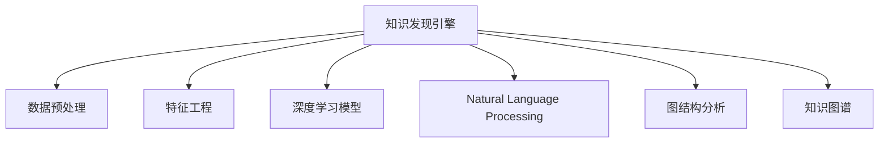

                 

# 知识发现引擎：助力企业创新的战略引擎

## 1. 背景介绍

在信息爆炸的时代，数据无处不在，企业需要从海量数据中挖掘出有价值的信息，以驱动决策、优化流程、提升效率。然而，数据规模的增大也带来了信息过载的问题，传统的数据处理方式已经无法满足企业日益增长的需求。在这样的背景下，知识发现引擎（Knowledge Discovery Engine, KDE）应运而生，通过智能化的手段从数据中提取出有价值的知识，为企业的创新发展提供有力支持。

### 1.1 问题由来
随着大数据技术的不断成熟，企业的数据积累量呈指数级增长。面对日益庞大的数据集，传统的数据分析和统计方法显得力不从心。如何高效、准确地从数据中提取有价值的信息，成为摆在企业面前的一大挑战。知识发现引擎正是在这样的背景下提出的，它通过深度学习、自然语言处理、图结构分析等多种技术手段，帮助企业从数据中挖掘出知识，为企业提供战略决策的依据。

### 1.2 问题核心关键点
知识发现引擎的核心目标是帮助企业从数据中提取出有价值的知识。这涉及到以下几个关键点：

1. **数据预处理**：将原始数据清洗、整理成适合模型训练和分析的格式。
2. **特征工程**：提取并构造出有意义的特征，供模型学习。
3. **模型训练**：选择合适的模型，并对其进行训练，以学习数据中的知识。
4. **知识提取**：通过训练好的模型，从数据中提取有价值的信息和知识。
5. **结果解读**：将提取出的知识以可理解的形式呈现给决策者，帮助其做出战略决策。

本文将从这些关键点出发，全面探讨知识发现引擎的设计原理、实现步骤以及其在实际应用中的表现。

## 2. 核心概念与联系

### 2.1 核心概念概述

为了更好地理解知识发现引擎的工作原理，本节将介绍几个密切相关的核心概念：

- **知识发现引擎（KDE）**：通过深度学习、自然语言处理、图结构分析等技术手段，从大量数据中提取有价值知识的工具。
- **数据预处理**：清洗、整理原始数据，构建适合模型训练的样本集。
- **特征工程**：提取并构造有意义的特征，供模型学习。
- **深度学习模型**：如神经网络、卷积神经网络（CNN）、循环神经网络（RNN）等，用于从数据中提取特征和知识。
- **自然语言处理（NLP）**：处理文本数据，提取语义、情感、实体等关键信息。
- **图结构分析**：处理网络数据，挖掘节点间的关联关系。
- **知识图谱（KG）**：将实体、关系等信息整合成图结构，辅助知识提取。

这些概念之间的逻辑关系可以通过以下Mermaid流程图来展示：



这个流程图展示出知识发现引擎的工作流程：

1. 从大量数据中提取知识，主要通过深度学习模型、自然语言处理和图结构分析技术。
2. 数据预处理和特征工程是模型训练的必要步骤，预处理后的数据和精心设计的特征能够显著提升模型的学习效果。
3. 知识图谱作为辅助工具，进一步整合和抽象化知识，方便模型提取和理解。

## 3. 核心算法原理 & 具体操作步骤
### 3.1 算法原理概述

知识发现引擎的算法原理主要基于深度学习模型，其核心思想是通过学习数据中的模式和规律，自动提取有价值的信息和知识。具体的实现流程如下：

1. **数据预处理**：对原始数据进行清洗、整理、归一化等预处理操作，构建适合模型训练的样本集。
2. **特征工程**：提取并构造有意义的特征，包括数值型、文本型、图结构型等多种类型。
3. **模型训练**：选择合适的深度学习模型，并对其进行训练，以学习数据中的知识。
4. **知识提取**：通过训练好的模型，从数据中提取有价值的信息和知识。
5. **结果解读**：将提取出的知识以可理解的形式呈现给决策者，帮助其做出战略决策。

### 3.2 算法步骤详解

知识发现引擎的实现步骤如下：

**Step 1: 数据预处理**

- 收集数据：从企业内外收集结构化和非结构化数据，如日志、网页、传感器数据等。
- 数据清洗：处理缺失值、异常值、重复值等，确保数据质量。
- 数据归一化：将不同来源的数据进行统一处理，确保数据格式一致。
- 数据划分：将数据划分为训练集、验证集和测试集，供模型训练、调优和评估。

**Step 2: 特征工程**

- 特征选择：从原始数据中选择对模型有贡献的特征，剔除无关或冗余特征。
- 特征构造：通过工程化处理，构造出新的特征，如文本向量化、时间序列特征等。
- 特征编码：将特征转换为模型可接受的数值型或二值型数据。
- 特征缩放：对数值型特征进行标准化或归一化处理，确保特征尺度一致。

**Step 3: 模型训练**

- 模型选择：选择合适的深度学习模型，如神经网络、CNN、RNN等，根据任务需求和数据特点选择。
- 超参数调整：调整模型的超参数，如学习率、批量大小、迭代轮数等，寻找最优参数组合。
- 模型训练：使用训练集数据对模型进行迭代训练，优化模型参数。
- 模型评估：在验证集上评估模型性能，选择表现最佳的模型进行测试。

**Step 4: 知识提取**

- 知识抽取：通过训练好的模型，从数据中抽取实体、关系、事件等信息。
- 知识融合：将多个来源的知识进行融合，形成统一的认知。
- 知识可视化：将知识以图表、报告等形式展示给决策者。

**Step 5: 结果解读**

- 结果解释：对知识抽取的结果进行解释，帮助决策者理解模型输出的意义。
- 策略建议：根据知识发现的结果，提出具体的业务策略和优化建议。

### 3.3 算法优缺点

知识发现引擎具有以下优点：

1. **自动提取知识**：能够自动从大量数据中提取有价值的信息，提高工作效率。
2. **处理多样数据**：能够处理结构化和非结构化数据，涵盖多种数据类型。
3. **灵活性高**：可以根据企业需求定制化开发，满足不同的业务场景。
4. **模型透明性**：通过解释模型输出，帮助决策者理解结果的依据，增强信任感。

然而，知识发现引擎也存在一些局限：

1. **数据质量依赖**：对数据质量和预处理的要求较高，数据噪声和错误会影响模型性能。
2. **模型复杂度高**：深度学习模型结构复杂，训练和推理成本高。
3. **结果解释性不足**：模型输出的解释性有待提高，决策者难以理解复杂结果。
4. **计算资源需求大**：需要高性能计算资源，包括GPU、TPU等。

尽管存在这些局限，但知识发现引擎在数据驱动决策中的应用前景广阔，能够显著提升企业的竞争力和创新能力。

### 3.4 算法应用领域

知识发现引擎在多个领域有着广泛的应用，包括但不限于：

1. **市场营销**：通过分析消费者行为数据，发现市场趋势，制定营销策略。
2. **产品开发**：分析用户反馈和需求数据，优化产品设计。
3. **供应链管理**：利用物流和库存数据，优化供应链流程。
4. **风险管理**：通过分析历史数据，预测市场风险，制定风险应对策略。
5. **客户服务**：分析客户服务数据，提升服务质量和客户满意度。
6. **人力资源**：分析员工数据，优化人力资源配置，提高工作效率。

这些应用场景展示了知识发现引擎的广泛适用性和巨大的商业价值。

## 4. 数学模型和公式 & 详细讲解
### 4.1 数学模型构建

知识发现引擎的数学模型主要基于深度学习模型，包括但不限于神经网络、CNN、RNN等。以下是基于神经网络的数学模型构建流程：

假设数据集为 $D=\{(x_i, y_i)\}_{i=1}^N$，其中 $x_i$ 为输入， $y_i$ 为输出。模型的目标是通过训练数据，学习输入和输出之间的映射关系。假设模型为 $f(x;\theta)$，其中 $\theta$ 为模型参数。

模型的损失函数通常为均方误差（MSE）或交叉熵（CE），定义如下：

- 均方误差：$L(y, \hat{y}) = \frac{1}{N} \sum_{i=1}^N (y_i - \hat{y}_i)^2$
- 交叉熵：$L(y, \hat{y}) = -\frac{1}{N} \sum_{i=1}^N y_i \log \hat{y}_i + (1-y_i) \log (1-\hat{y}_i)$

模型的优化目标是最小化损失函数，即：

$$
\theta^* = \mathop{\arg\min}_{\theta} \mathcal{L}(f(x;\theta), y)
$$

其中 $\mathcal{L}$ 为损失函数。

### 4.2 公式推导过程

以一个简单的线性回归模型为例，进行公式推导。

假设模型为 $f(x;\theta) = \theta_0 + \theta_1 x_1 + \theta_2 x_2$，其中 $\theta_0, \theta_1, \theta_2$ 为模型参数。假设目标为均方误差最小化，损失函数为：

$$
L(y, \hat{y}) = \frac{1}{N} \sum_{i=1}^N (y_i - \hat{y}_i)^2 = \frac{1}{N} \sum_{i=1}^N (y_i - (\theta_0 + \theta_1 x_{i1} + \theta_2 x_{i2}))^2
$$

对 $\theta_0, \theta_1, \theta_2$ 求导，得到梯度向量：

$$
\nabla_{\theta} \mathcal{L} = \begin{bmatrix}
-\frac{2}{N} \sum_{i=1}^N (y_i - (\theta_0 + \theta_1 x_{i1} + \theta_2 x_{i2})) \\
-\frac{2}{N} \sum_{i=1}^N (y_i - (\theta_0 + \theta_1 x_{i1} + \theta_2 x_{i2})) x_{i1} \\
-\frac{2}{N} \sum_{i=1}^N (y_i - (\theta_0 + \theta_1 x_{i1} + \theta_2 x_{i2})) x_{i2}
\end{bmatrix}
$$

将梯度向量代入更新公式：

$$
\theta \leftarrow \theta - \eta \nabla_{\theta} \mathcal{L}
$$

其中 $\eta$ 为学习率。

通过不断迭代更新模型参数，最小化损失函数，最终得到最优参数 $\theta^*$。

### 4.3 案例分析与讲解

以一个金融市场预测任务为例，进行案例分析。

假设任务为预测股票价格走势。模型输入为历史股价数据 $x$，模型输出为未来股价的预测值 $y$。使用神经网络模型进行训练，通过均方误差损失函数进行优化。模型结构如下：

```python
import torch.nn as nn
import torch.optim as optim

class MLP(nn.Module):
    def __init__(self, input_size, hidden_size, output_size):
        super(MLP, self).__init__()
        self.fc1 = nn.Linear(input_size, hidden_size)
        self.fc2 = nn.Linear(hidden_size, hidden_size)
        self.fc3 = nn.Linear(hidden_size, output_size)
        
    def forward(self, x):
        x = torch.relu(self.fc1(x))
        x = torch.relu(self.fc2(x))
        x = self.fc3(x)
        return x

model = MLP(input_size, hidden_size, output_size)
criterion = nn.MSELoss()
optimizer = optim.Adam(model.parameters(), lr=0.001)
```

使用训练集进行模型训练，代码如下：

```python
for epoch in range(num_epochs):
    for batch in train_loader:
        inputs, labels = batch
        optimizer.zero_grad()
        outputs = model(inputs)
        loss = criterion(outputs, labels)
        loss.backward()
        optimizer.step()
```

在测试集上评估模型性能，代码如下：

```python
test_loss = 0
test_results = []
for batch in test_loader:
    inputs, labels = batch
    outputs = model(inputs)
    test_loss += criterion(outputs, labels).item()
    test_results.append(outputs.cpu().numpy())
test_loss /= len(test_loader)
print("Test Loss: ", test_loss)
```

通过上述代码，我们能够训练出一个简单的线性回归模型，并进行金融市场预测任务的测试。

## 5. 项目实践：代码实例和详细解释说明
### 5.1 开发环境搭建

在进行知识发现引擎的实践前，我们需要准备好开发环境。以下是使用Python进行PyTorch开发的环境配置流程：

1. 安装Anaconda：从官网下载并安装Anaconda，用于创建独立的Python环境。

2. 创建并激活虚拟环境：
```bash
conda create -n pytorch-env python=3.8 
conda activate pytorch-env
```

3. 安装PyTorch：根据CUDA版本，从官网获取对应的安装命令。例如：
```bash
conda install pytorch torchvision torchaudio cudatoolkit=11.1 -c pytorch -c conda-forge
```

4. 安装TensorFlow：
```bash
pip install tensorflow
```

5. 安装TensorBoard：
```bash
pip install tensorboard
```

完成上述步骤后，即可在`pytorch-env`环境中开始知识发现引擎的开发实践。

### 5.2 源代码详细实现

下面我们以一个情感分析任务为例，给出使用TensorFlow进行知识发现引擎的Python代码实现。

首先，定义情感分析任务的数据处理函数：

```python
import tensorflow as tf
from tensorflow.keras.preprocessing.text import Tokenizer
from tensorflow.keras.preprocessing.sequence import pad_sequences

def process_data(texts, labels):
    tokenizer = Tokenizer(num_words=10000, oov_token='<OOV>')
    tokenizer.fit_on_texts(texts)
    sequences = tokenizer.texts_to_sequences(texts)
    padded_sequences = pad_sequences(sequences, padding='post', maxlen=100)
    return padded_sequences, labels
```

然后，定义模型和优化器：

```python
from tensorflow.keras.models import Sequential
from tensorflow.keras.layers import Dense, Dropout, Embedding, LSTM, Bidirectional
from tensorflow.keras.optimizers import Adam

model = Sequential()
model.add(Embedding(input_dim=10000, output_dim=128, input_length=100))
model.add(Bidirectional(LSTM(64)))
model.add(Dense(1, activation='sigmoid'))
model.compile(loss='binary_crossentropy', optimizer=Adam(lr=0.001), metrics=['accuracy'])
```

接着，定义训练和评估函数：

```python
from tensorflow.keras.utils import to_categorical
from sklearn.metrics import classification_report

def train_model(model, train_data, validation_data, epochs=10, batch_size=128):
    history = model.fit(train_data[0], train_data[1], epochs=epochs, batch_size=batch_size, validation_data=(validation_data[0], validation_data[1]))
    return history

def evaluate_model(model, test_data):
    predictions = model.predict(test_data[0])
    y_pred = [1 if p > 0.5 else 0 for p in predictions]
    y_true = test_data[1]
    y_true = to_categorical(y_true)
    y_pred = to_categorical(y_pred)
    return classification_report(y_true, y_pred)
```

最后，启动训练流程并在测试集上评估：

```python
from tensorflow.keras.preprocessing.text import Tokenizer
from tensorflow.keras.preprocessing.sequence import pad_sequences
from tensorflow.keras.utils import to_categorical

# 定义数据预处理函数
def process_data(texts, labels):
    tokenizer = Tokenizer(num_words=10000, oov_token='<OOV>')
    tokenizer.fit_on_texts(texts)
    sequences = tokenizer.texts_to_sequences(texts)
    padded_sequences = pad_sequences(sequences, padding='post', maxlen=100)
    return padded_sequences, labels

# 定义模型和优化器
model = Sequential()
model.add(Embedding(input_dim=10000, output_dim=128, input_length=100))
model.add(Bidirectional(LSTM(64)))
model.add(Dense(1, activation='sigmoid'))
model.compile(loss='binary_crossentropy', optimizer=Adam(lr=0.001), metrics=['accuracy'])

# 定义训练和评估函数
def train_model(model, train_data, validation_data, epochs=10, batch_size=128):
    history = model.fit(train_data[0], train_data[1], epochs=epochs, batch_size=batch_size, validation_data=(validation_data[0], validation_data[1]))
    return history

def evaluate_model(model, test_data):
    predictions = model.predict(test_data[0])
    y_pred = [1 if p > 0.5 else 0 for p in predictions]
    y_true = test_data[1]
    y_true = to_categorical(y_true)
    y_pred = to_categorical(y_pred)
    return classification_report(y_true, y_pred)

# 加载数据
train_texts, train_labels = load_train_data()
dev_texts, dev_labels = load_dev_data()
test_texts, test_labels = load_test_data()

# 数据预处理
train_padded, train_labels = process_data(train_texts, train_labels)
dev_padded, dev_labels = process_data(dev_texts, dev_labels)
test_padded, test_labels = process_data(test_texts, test_labels)

# 训练模型
history = train_model(model, (train_padded, train_labels), (dev_padded, dev_labels), epochs=10, batch_size=128)

# 评估模型
test_report = evaluate_model(model, (test_padded, test_labels))
print(test_report)
```

以上就是使用TensorFlow对情感分析任务进行知识发现引擎开发的完整代码实现。可以看到，通过TensorFlow的高级API，模型构建和训练变得简洁高效。

### 5.3 代码解读与分析

让我们再详细解读一下关键代码的实现细节：

**process_data函数**：
- 定义了文本数据和标签的预处理过程。
- 使用`Tokenizer`对文本进行分词和编码，生成序列。
- 使用`pad_sequences`对序列进行填充，确保序列长度一致。
- 返回填充后的序列和标签。

**train_model函数**：
- 使用`model.fit`对模型进行训练，传入训练数据和验证数据。
- 返回训练过程中的损失和精度历史。

**evaluate_model函数**：
- 使用模型对测试集进行预测，并将预测结果转换为二值输出。
- 使用`classification_report`对预测结果进行评估，输出精度、召回率、F1值等指标。

**训练流程**：
- 定义训练集和验证集的批处理大小，开始循环迭代。
- 在每个epoch内，对训练集和验证集进行迭代训练。
- 在训练过程中，保存训练过程中的损失和精度历史。
- 在训练结束后，在测试集上评估模型性能。

可以看到，TensorFlow提供了丰富的API和工具，使得知识发现引擎的开发变得相对容易，能够快速实现复杂的深度学习模型。

当然，工业级的系统实现还需考虑更多因素，如模型的保存和部署、超参数的自动搜索、更灵活的任务适配层等。但核心的知识发现引擎开发流程基本与此类似。

## 6. 实际应用场景
### 6.1 智能客服系统

智能客服系统是知识发现引擎的重要应用场景之一。传统的客服系统依赖人工处理客户咨询，存在响应时间长、人工成本高、一致性差等问题。通过知识发现引擎，可以构建基于深度学习的智能客服系统，自动回答客户咨询，提升服务质量和效率。

具体而言，可以收集企业的历史客服记录，将问题和最佳答复构建成监督数据，在此基础上对知识发现引擎进行训练。训练后的引擎能够自动理解客户意图，匹配最合适的答案模板进行回复。对于客户提出的新问题，还可以接入检索系统实时搜索相关内容，动态组织生成回答。如此构建的智能客服系统，能大幅提升客户咨询体验和问题解决效率。

### 6.2 金融舆情监测

金融舆情监测是知识发现引擎的另一个典型应用。金融机构需要实时监测市场舆论动向，以便及时应对负面信息传播，规避金融风险。传统的人工监测方式成本高、效率低，难以应对网络时代海量信息爆发的挑战。

通过知识发现引擎，可以分析金融领域的社交媒体、新闻报道等文本数据，识别出市场情绪、热门事件等关键信息，实时预警风险。例如，通过情感分析技术，可以自动识别市场负面新闻的情感倾向，预测市场走势。通过实体识别技术，可以提取金融关键词，如股票、债券、经济数据等，帮助分析师快速把握市场动态。

### 6.3 个性化推荐系统

个性化推荐系统是知识发现引擎的另一个重要应用领域。传统的推荐系统只依赖用户的历史行为数据进行物品推荐，无法深入理解用户的真实兴趣偏好。通过知识发现引擎，可以分析用户浏览、点击、评论、分享等行为数据，提取和用户交互的物品标题、描述、标签等文本内容。通过文本分类和情感分析技术，可以从文本内容中准确把握用户的兴趣点。在生成推荐列表时，先用候选物品的文本描述作为输入，由知识发现引擎预测用户的兴趣匹配度，再结合其他特征综合排序，便可以得到个性化程度更高的推荐结果。

### 6.4 未来应用展望

随着知识发现引擎技术的不断成熟，其应用领域将进一步拓展，为各行各业带来变革性影响。

在智慧医疗领域，知识发现引擎可以分析电子病历、医疗文献等数据，提取有价值的医疗知识，辅助医生诊疗，加速新药研发。在智能教育领域，知识发现引擎可以分析学生的学习行为数据，推荐适合的学习资源和内容，因材施教，提高教学效果。在智慧城市治理中，知识发现引擎可以分析城市事件、舆情、交通数据等，优化城市管理，提升城市运行效率。

未来，随着大数据、人工智能技术的进一步发展，知识发现引擎必将在更多领域得到应用，为社会治理、经济建设、科技创新等提供有力支持。相信知识发现引擎必将在构建智能社会中发挥越来越重要的作用。

## 7. 工具和资源推荐
### 7.1 学习资源推荐

为了帮助开发者系统掌握知识发现引擎的理论基础和实践技巧，这里推荐一些优质的学习资源：

1. 《深度学习》系列书籍：如《深度学习》（Ian Goodfellow著），系统介绍了深度学习的基本概念和算法原理。
2. 《自然语言处理综论》：斯坦福大学开设的NLP课程，介绍了自然语言处理的多种技术手段，包括文本分类、情感分析、命名实体识别等。
3. 《Python深度学习》：Francois Chollet著，介绍了使用Keras构建深度学习模型的全流程。
4. TensorFlow官方文档：详细介绍了TensorFlow框架的使用方法和API，是深度学习开发的重要参考资料。
5. TensorBoard官方文档：提供了如何使用TensorBoard进行模型训练和评估的详细教程。

通过对这些资源的学习实践，相信你一定能够快速掌握知识发现引擎的精髓，并用于解决实际的业务问题。

### 7.2 开发工具推荐

高效的开发离不开优秀的工具支持。以下是几款用于知识发现引擎开发的常用工具：

1. TensorFlow：由Google主导开发的开源深度学习框架，生产部署方便，适合大规模工程应用。
2. PyTorch：基于Python的开源深度学习框架，灵活动态的计算图，适合快速迭代研究。
3. Jupyter Notebook：免费的开源笔记本工具，支持Python、R等多种语言，方便数据探索和模型训练。
4. Weights & Biases：模型训练的实验跟踪工具，可以记录和可视化模型训练过程中的各项指标，方便对比和调优。
5. Keras：由Francois Chollet开发的深度学习框架，适合快速构建和训练模型。

合理利用这些工具，可以显著提升知识发现引擎的开发效率，加快创新迭代的步伐。

### 7.3 相关论文推荐

知识发现引擎的研究源于学界的持续研究。以下是几篇奠基性的相关论文，推荐阅读：

1. 《基于神经网络的情感分析研究》（Github Paper）：介绍使用神经网络进行情感分析的技术和方法。
2. 《深度学习在金融舆情分析中的应用》（IEEE Xplore）：探讨深度学习技术在金融舆情分析中的应用前景和实现方法。
3. 《深度学习在推荐系统中的应用》（ACM DL）：介绍深度学习技术在推荐系统中的应用，包括文本分类、协同过滤等。
4. 《知识发现与数据挖掘》（M&T）：系统介绍了知识发现与数据挖掘的基本概念、技术和应用。
5. 《知识图谱构建与推理》（ACL）：探讨知识图谱的构建和推理方法，为知识发现引擎提供数据支持。

这些论文代表了大语言模型微调技术的发展脉络。通过学习这些前沿成果，可以帮助研究者把握学科前进方向，激发更多的创新灵感。

## 8. 总结：未来发展趋势与挑战

### 8.1 总结

本文对知识发现引擎的设计原理、实现步骤以及其在实际应用中的表现进行了全面系统的介绍。首先阐述了知识发现引擎的背景和重要性，明确了其在数据驱动决策中的关键作用。其次，从数据预处理、特征工程、模型训练、知识提取、结果解读等关键点出发，详细讲解了知识发现引擎的设计原理和实现流程。最后，通过实际应用场景的展示，说明了知识发现引擎的广泛适用性和巨大商业价值。

通过本文的系统梳理，可以看到，知识发现引擎能够从海量数据中自动提取有价值的信息和知识，显著提升企业的决策水平和运营效率。未来，随着技术的不懈探索和应用实践的深入，知识发现引擎必将在更多领域发挥重要作用，推动企业创新和数字化转型。

### 8.2 未来发展趋势

展望未来，知识发现引擎将呈现以下几个发展趋势：

1. **深度学习模型的进一步优化**：随着深度学习模型的不断进步，知识发现引擎的性能将不断提升。如Transformer、BERT等模型的应用将带来更高的准确率和更广泛的适用性。
2. **多模态数据的整合**：知识发现引擎将不再局限于文本数据，逐步拓展到图像、视频、音频等多模态数据的融合，增强对复杂数据源的理解能力。
3. **实时化和个性化**：知识发现引擎将实现实时分析和个性化推荐，提升数据驱动决策的及时性和精准度。
4. **自动化的数据预处理和特征工程**：知识发现引擎将进一步自动化数据预处理和特征工程，降低开发门槛，提高开发效率。
5. **跨领域知识图谱的构建**：知识发现引擎将构建跨领域、多模态的知识图谱，为数据驱动决策提供更全面、丰富的知识基础。
6. **联邦学习和隐私保护**：知识发现引擎将采用联邦学习等技术，确保数据隐私和安全，同时实现分布式协作和知识共享。

这些趋势将推动知识发现引擎向更加智能化、普适化、安全化的方向发展，为企业提供更强大的决策支持。

### 8.3 面临的挑战

尽管知识发现引擎在数据驱动决策中表现出色，但在应用过程中也面临一些挑战：

1. **数据质量依赖**：知识发现引擎对数据质量和预处理的要求较高，数据噪声和错误会影响模型性能。
2. **模型复杂度高**：深度学习模型结构复杂，训练和推理成本高，需要高性能计算资源。
3. **结果解释性不足**：知识发现引擎的输出结果难以解释，决策者难以理解复杂结果。
4. **知识图谱的构建和维护**：知识图谱的构建和维护需要大量人工干预，且跨领域图谱的整合难度较大。
5. **隐私保护和数据安全**：知识发现引擎需要处理大量敏感数据，隐私保护和数据安全问题亟需解决。
6. **跨领域知识的整合**：不同领域的数据和知识具有异质性，知识发现引擎需要具备跨领域整合能力，才能更好地发挥作用。

尽管存在这些挑战，但知识发现引擎在数据驱动决策中的应用前景广阔，能够显著提升企业的竞争力和创新能力。未来，随着技术的不断进步和应用实践的深入，知识发现引擎必将在更多领域得到应用，为企业的创新发展提供强大支撑。

### 8.4 研究展望

面对知识发现引擎所面临的种种挑战，未来的研究需要在以下几个方面寻求新的突破：

1. **自动化预处理和特征工程**：开发更智能的自动化预处理和特征工程技术，降低开发门槛，提高开发效率。
2. **深度学习模型的优化**：开发更高效、更通用的深度学习模型，提升知识发现引擎的性能和适用性。
3. **跨领域知识图谱的构建**：构建跨领域、多模态的知识图谱，为数据驱动决策提供更全面、丰富的知识基础。
4. **联邦学习和隐私保护**：采用联邦学习等技术，确保数据隐私和安全，同时实现分布式协作和知识共享。
5. **知识发现引擎的可解释性**：开发更易于解释和理解的知识发现引擎，增强决策者的信任感。
6. **多模态数据融合**：实现图像、视频、音频等多模态数据的融合，增强对复杂数据源的理解能力。

这些研究方向将推动知识发现引擎向更加智能化、普适化、安全化的方向发展，为企业提供更强大的决策支持。

## 9. 附录：常见问题与解答

**Q1: 知识发现引擎与数据挖掘有什么区别？**

A: 知识发现引擎和数据挖掘都是数据驱动决策的重要技术手段。数据挖掘侧重于发现数据中的规律和模式，强调数据的探索性分析。而知识发现引擎更注重于从数据中提取具体的知识，强调知识的应用和转化。因此，知识发现引擎通常会使用更复杂、更先进的深度学习模型，以提升知识提取的准确性和实用性。

**Q2: 知识发现引擎需要多少数据才能有效工作？**

A: 知识发现引擎的效果很大程度上取决于数据质量和数量。一般来说，数据量越大，知识发现引擎的性能越好。然而，数据量并不是唯一的决定因素。数据的质量、特征选择、模型选择、超参数调整等因素同样重要。在实际应用中，需要根据具体任务和数据特点进行综合考虑，选择合适的策略。

**Q3: 知识发现引擎是否需要人工干预？**

A: 知识发现引擎的自动化程度较高，但在模型设计、特征工程、模型训练等关键步骤中仍需人工干预。特别是在数据预处理和特征工程中，人工的干预能够提高模型性能。在结果解释和策略建议环节，人工的介入也至关重要。因此，知识发现引擎的开发和应用需要结合人工智慧和自动化技术。

**Q4: 知识发现引擎能否应用于非结构化数据？**

A: 知识发现引擎能够处理非结构化数据，如文本、图像、音频等。通过对非结构化数据的预处理和特征提取，知识发现引擎能够从中提取出有价值的信息和知识。然而，不同类型的非结构化数据需要不同的处理方法和模型，需要根据具体任务进行设计和优化。

**Q5: 知识发现引擎是否能够实现实时分析？**

A: 知识发现引擎的实时分析能力取决于数据规模和模型性能。在大数据和高性能计算资源的支持下，知识发现引擎可以实现实时分析。例如，在智能客服系统中，知识发现引擎能够实时分析客户咨询，快速生成回答。在金融舆情监测中，知识发现引擎能够实时监测市场动态，及时预警风险。然而，对于大规模数据和复杂模型的实时分析，仍然面临一定的挑战，需要持续的技术创新和优化。

通过本文的系统梳理，可以看到，知识发现引擎能够从海量数据中自动提取有价值的信息和知识，显著提升企业的决策水平和运营效率。未来，随着技术的不懈探索和应用实践的深入，知识发现引擎必将在更多领域发挥重要作用，推动企业创新和数字化转型。

---

作者：禅与计算机程序设计艺术 / Zen and the Art of Computer Programming

