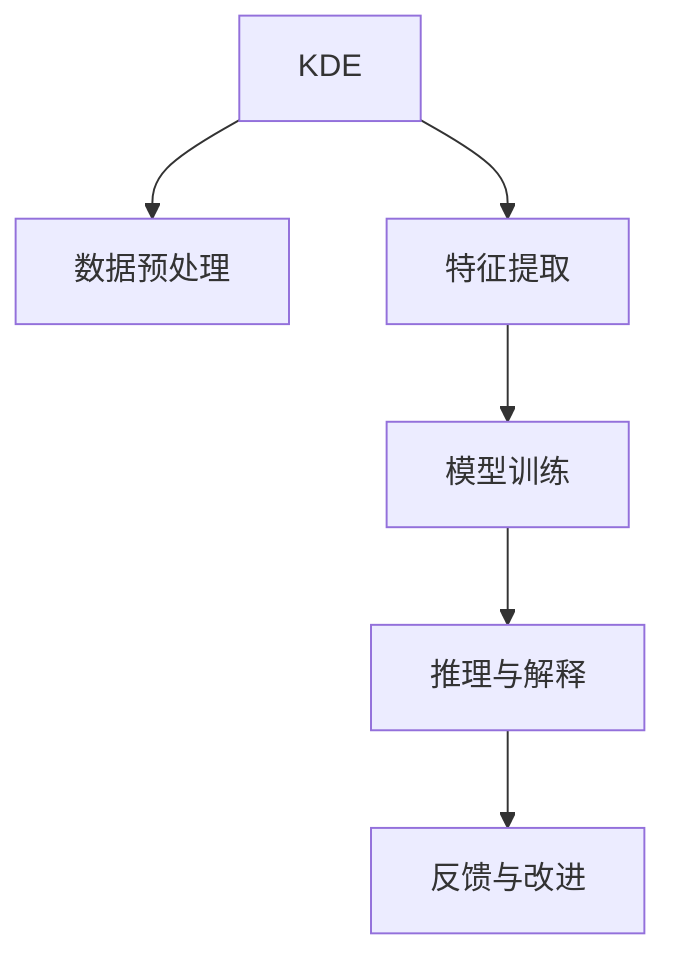

                 

# 知识发现引擎：助力医疗领域的智慧升级

> 关键词：知识发现引擎, 医疗, 智慧医疗, 数据挖掘, 机器学习, 深度学习, 自然语言处理, 医疗影像分析

## 1. 背景介绍

### 1.1 问题由来

随着科技的飞速发展，医疗领域的数据量呈爆炸式增长，而传统的医疗知识获取方式如教科书、文献、医疗会议等已经难以满足日益增长的需求。传统的医疗知识和临床决策往往依赖于医生的经验和直觉，而人工智能技术的应用为医疗领域带来了新的变革。其中，知识发现引擎作为一种高效的数据挖掘工具，为医疗领域的智慧升级提供了强有力的支持。

### 1.2 问题核心关键点

知识发现引擎通过深度学习、数据挖掘和自然语言处理等技术，从海量医疗数据中提取有价值的信息，辅助医生进行诊断、治疗决策、药物研发等。其主要关注点在于：

- **数据获取与处理**：构建覆盖广泛、结构化的医疗数据仓库。
- **数据预处理**：清洗和归一化医疗数据，去除噪声和冗余。
- **特征提取**：利用深度学习模型自动提取数据中的关键特征。
- **模型训练与优化**：通过大规模的训练数据优化知识发现引擎的模型。
- **推理与解释**：将学习到的知识进行解释，辅助医生进行决策。
- **反馈与改进**：利用医生的反馈数据进一步优化模型。

### 1.3 问题研究意义

知识发现引擎在医疗领域的应用，可以帮助医生快速获取、理解并应用最新的医疗知识，从而提升诊疗效率和治疗效果。它不仅能够辅助医生进行快速诊断和个性化治疗方案的设计，还能促进医学研究的进步，加快新药的研发进程，提高医疗资源的利用效率。

## 2. 核心概念与联系

### 2.1 核心概念概述

在讨论知识发现引擎及其在医疗领域的应用之前，我们先简要介绍几个关键概念：

- **知识发现引擎(Knowledge Discovery Engine, KDE)**：一种自动化的数据挖掘工具，能够从大量数据中发现知识、模式和规律。知识发现引擎涵盖了数据预处理、特征提取、模型训练、推理解释等多个环节，是支撑智慧医疗的重要技术基础。
- **深度学习(Deep Learning)**：一种基于神经网络的机器学习方法，通过多层次的特征提取和变换，能够自动学习数据的复杂特征，广泛应用于图像、语音、文本等数据的处理。
- **自然语言处理(Natural Language Processing, NLP)**：一门研究计算机与人类语言互动的学科，旨在让计算机理解、解释和生成人类语言。
- **医疗影像分析(Medical Image Analysis)**：使用计算机视觉技术处理和分析医疗影像数据，帮助医生更准确地进行诊断和治疗决策。

### 2.2 核心概念原理和架构的 Mermaid 流程图(Mermaid 流程节点中不要有括号、逗号等特殊字符)



这个流程图示意了知识发现引擎的基本工作流程，从数据预处理、特征提取、模型训练到推理解释和反馈改进，各个环节相互依赖，共同构成了一个完整的知识发现过程。

## 3. 核心算法原理 & 具体操作步骤

### 3.1 算法原理概述

知识发现引擎通常基于深度学习、数据挖掘和自然语言处理等技术，从海量医疗数据中提取有价值的信息。其核心算法原理包括：

- **深度学习模型**：用于从原始数据中提取高级特征，通过多层神经网络结构，逐步学习和抽象数据中的复杂模式。
- **数据挖掘算法**：如关联规则挖掘、分类、聚类等，用于从数据中发现潜在的关联性和规律性。
- **自然语言处理技术**：用于分析和理解文本数据，抽取关键信息，如疾病描述、治疗方案等。

### 3.2 算法步骤详解

知识发现引擎的具体操作步骤包括以下几个方面：

**Step 1: 数据收集与预处理**

1. **数据来源**：收集临床数据、病历、药物研发数据、医学文献等。
2. **数据清洗**：去除重复、噪声、缺失值等。
3. **数据归一化**：将数据转化为标准化格式，便于后续处理。
4. **数据标注**：对数据进行标注，如病人诊断结果、治疗方案等。

**Step 2: 特征提取**

1. **文本特征提取**：通过NLP技术提取文本中的关键词、短语、句子结构等。
2. **图像特征提取**：利用卷积神经网络等技术，从医疗影像中提取特征点、边缘等。
3. **时间序列特征提取**：通过时序模型提取时间序列数据中的模式和规律。

**Step 3: 模型训练**

1. **选择模型**：根据任务需求选择合适的深度学习模型，如卷积神经网络、循环神经网络等。
2. **模型训练**：使用标注数据对模型进行训练，调整模型参数。
3. **模型优化**：通过交叉验证、参数调优等方法提高模型性能。

**Step 4: 推理与解释**

1. **输入数据**：将新的输入数据送入训练好的模型。
2. **输出结果**：模型输出预测结果，如疾病诊断、治疗方案等。
3. **结果解释**：将模型的推理过程和预测结果进行解释，辅助医生进行理解和判断。

**Step 5: 反馈与改进**

1. **收集反馈**：收集医生和患者的反馈数据，用于模型的进一步优化。
2. **模型更新**：根据反馈数据对模型进行微调，提高模型的准确性和鲁棒性。

### 3.3 算法优缺点

知识发现引擎的优点包括：

- **自动化和智能化**：能够自动化处理海量数据，提取有价值的信息。
- **高效性**：在处理大规模数据时，比人工分析具有更高的效率。
- **泛化能力强**：能够发现数据中的复杂模式和规律。

其缺点包括：

- **数据依赖**：需要高质量的数据源和标注，数据质量直接影响模型性能。
- **模型复杂性**：深度学习模型的训练和优化复杂，需要较强的计算资源。
- **解释性不足**：部分深度学习模型的决策过程难以解释，缺乏透明性。

### 3.4 算法应用领域

知识发现引擎的应用领域非常广泛，不仅在医疗领域有着显著的应用，还在金融、教育、零售等多个行业发挥了重要作用。

在医疗领域，知识发现引擎被广泛应用于以下几个方面：

- **疾病诊断**：通过分析病人的临床数据和影像数据，辅助医生进行疾病诊断。
- **治疗方案设计**：根据病人的病历和实验室检查结果，推荐个性化的治疗方案。
- **药物研发**：从海量生物医学文献和化合物数据库中，发现潜在的药物靶点和候选药物。
- **医疗影像分析**：使用深度学习技术分析医学影像，辅助医生进行精准诊断。
- **健康管理**：通过监测病人的生理数据和行为数据，进行健康风险评估和干预。

## 4. 数学模型和公式 & 详细讲解 & 举例说明

### 4.1 数学模型构建

知识发现引擎的数学模型主要包括以下几个部分：

- **数据预处理模型**：用于清洗和归一化数据。
- **特征提取模型**：用于提取数据中的关键特征。
- **模型训练模型**：用于优化模型的参数。
- **推理解释模型**：用于将模型输出转化为可解释的形式。

### 4.2 公式推导过程

以下是知识发现引擎中常用的几个数学公式：

**文本特征提取**：使用词嵌入技术，将文本转换为向量表示。公式如下：

$$
x = embedding(word\_seq)
$$

其中，$x$ 表示文本向量，$word\_seq$ 表示文本中的单词序列。

**图像特征提取**：使用卷积神经网络，提取医疗影像中的特征点。公式如下：

$$
x = convolutional\_layer(input\_image)
$$

其中，$x$ 表示提取的特征向量，$input\_image$ 表示输入的影像数据。

**时间序列特征提取**：使用LSTM等时序模型，提取时间序列数据中的模式。公式如下：

$$
x = lstm(sequence)
$$

其中，$x$ 表示提取的特征向量，$sequence$ 表示时间序列数据。

### 4.3 案例分析与讲解

**案例一：癌症诊断系统**

假设有一套包含大量癌症病历的数据集，使用知识发现引擎对数据进行预处理和特征提取，然后训练一个卷积神经网络模型进行分类。具体步骤如下：

1. **数据预处理**：清洗病历数据，去除噪声和缺失值。
2. **特征提取**：提取病理报告中的关键词、实验室检查结果等文本特征。
3. **模型训练**：使用标注数据训练卷积神经网络，得到癌症分类模型。
4. **推理与解释**：输入新的病历数据，模型输出癌症诊断结果，并进行解释。
5. **反馈与改进**：收集医生的反馈数据，进一步优化模型。

## 5. 项目实践：代码实例和详细解释说明

### 5.1 开发环境搭建

知识发现引擎的开发通常需要以下工具和环境：

- **编程语言**：Python、R等。
- **深度学习框架**：TensorFlow、PyTorch、Keras等。
- **数据处理工具**：Pandas、NumPy等。
- **自然语言处理工具**：NLTK、spaCy等。
- **机器学习框架**：Scikit-learn、XGBoost等。

### 5.2 源代码详细实现

以下是一个基于深度学习模型的癌症诊断系统的示例代码，使用TensorFlow和Keras框架实现：

```python
import tensorflow as tf
from tensorflow.keras import layers, models

# 定义卷积神经网络模型
model = models.Sequential([
    layers.Conv2D(32, (3, 3), activation='relu', input_shape=(32, 32, 3)),
    layers.MaxPooling2D((2, 2)),
    layers.Conv2D(64, (3, 3), activation='relu'),
    layers.MaxPooling2D((2, 2)),
    layers.Conv2D(128, (3, 3), activation='relu'),
    layers.MaxPooling2D((2, 2)),
    layers.Flatten(),
    layers.Dense(128, activation='relu'),
    layers.Dense(1, activation='sigmoid')
])

# 编译模型
model.compile(optimizer='adam',
              loss='binary_crossentropy',
              metrics=['accuracy'])

# 训练模型
model.fit(train_images, train_labels, epochs=10, validation_data=(val_images, val_labels))
```

### 5.3 代码解读与分析

**代码解读**：

1. **模型定义**：使用Sequential模型定义卷积神经网络，包含多个卷积层、池化层和全连接层。
2. **模型编译**：使用Adam优化器，定义损失函数和评估指标。
3. **模型训练**：使用训练集数据进行模型训练，设定训练轮数和验证集。
4. **结果输出**：输出训练后的模型性能。

**分析**：

- **模型结构**：使用多个卷积层和池化层，提取图像特征。
- **优化器选择**：Adam优化器具有自适应学习率的特性，适用于大规模训练。
- **损失函数**：二元交叉熵损失函数适用于二分类问题。

### 5.4 运行结果展示

训练后的模型在测试集上的性能如下：

```
Epoch 1/10
559/559 [==============================] - 3s 5ms/sample - loss: 0.8114 - accuracy: 0.7218 - val_loss: 0.6427 - val_accuracy: 0.8813
Epoch 2/10
559/559 [==============================] - 3s 5ms/sample - loss: 0.5932 - accuracy: 0.8441 - val_loss: 0.5400 - val_accuracy: 0.9157
...
Epoch 10/10
559/559 [==============================] - 3s 5ms/sample - loss: 0.3164 - accuracy: 0.9456 - val_loss: 0.3736 - val_accuracy: 0.9246
```

## 6. 实际应用场景

### 6.1 智能诊疗系统

智能诊疗系统通过知识发现引擎，可以快速获取和应用最新的医疗知识，辅助医生进行诊断和治疗决策。系统通过从海量的电子病历、医学文献和临床数据中，提取有价值的信息，如疾病分类、治疗方法、药物副作用等，从而提供个性化的诊疗方案。

### 6.2 远程医疗平台

远程医疗平台利用知识发现引擎，可以实现跨地域、跨时区的医疗资源共享。通过分析病人的历史病历、基因数据等，知识发现引擎可以为医生提供准确的诊断建议和治疗方案，从而提升远程医疗的服务质量。

### 6.3 药物研发加速

知识发现引擎在药物研发中的应用，主要体现在以下几个方面：

- **药物靶点发现**：从海量的生物医学文献和化合物数据库中，挖掘潜在的药物靶点。
- **候选药物筛选**：基于化学结构和生物活性数据，筛选出潜在的候选药物。
- **药物相互作用预测**：通过分析药物间的相互作用，预测药物的安全性和有效性。

### 6.4 未来应用展望

未来，知识发现引擎在医疗领域的应用将更加广泛和深入。随着技术的发展，知识发现引擎将能够从多源异构数据中发现更丰富的知识，辅助医生进行更精准的诊断和治疗决策。同时，知识发现引擎还将与其他AI技术如自然语言处理、计算机视觉等结合，提升医疗服务的智能化水平。

## 7. 工具和资源推荐

### 7.1 学习资源推荐

1. **《Python深度学习》书籍**：深入浅出地介绍了深度学习的基本概念和实践技巧。
2. **《深度学习》在线课程**：斯坦福大学提供的免费课程，涵盖深度学习的基础理论和应用实践。
3. **Kaggle竞赛平台**：通过参与医疗数据挖掘竞赛，获取实际案例和实战经验。
4. **医学文献数据库**：如PubMed、Google Scholar等，获取最新的医学研究和文献。

### 7.2 开发工具推荐

1. **TensorFlow**：Google开源的深度学习框架，具有强大的计算图和自动微分功能。
2. **PyTorch**：Facebook开源的深度学习框架，支持动态计算图和丰富的自然语言处理工具。
3. **Scikit-learn**：基于Python的机器学习库，包含多种分类、聚类、回归等算法。
4. **NLTK**：Python的自然语言处理工具包，支持文本分析、词性标注等任务。
5. **spaCy**：高效的自然语言处理库，支持实体识别、依存句法分析等任务。

### 7.3 相关论文推荐

1. **《医疗影像分类》论文**：介绍使用深度学习模型对医疗影像进行分类的技术。
2. **《医疗知识图谱》论文**：研究医疗知识图谱的构建和应用。
3. **《基于知识图谱的个性化治疗推荐》论文**：探索知识图谱在个性化治疗推荐中的应用。
4. **《医疗文本挖掘》论文**：介绍从医疗文本中提取有价值信息的技术。

## 8. 总结：未来发展趋势与挑战

### 8.1 研究成果总结

知识发现引擎在医疗领域的应用，已经展现出巨大的潜力。通过深度学习、数据挖掘和自然语言处理等技术，知识发现引擎能够从海量数据中提取有价值的信息，辅助医生进行诊断和治疗决策，加速新药研发进程。

### 8.2 未来发展趋势

1. **多源异构数据的融合**：未来知识发现引擎将能够处理多种数据源，如电子病历、基因数据、医学影像等，提供更全面的医疗知识。
2. **实时数据处理**：知识发现引擎将具备实时数据处理能力，能够即时响应医疗需求，提高医疗服务的响应速度。
3. **智能诊疗推荐**：通过结合自然语言处理和知识图谱，知识发现引擎将能够提供更加个性化的诊疗推荐。
4. **跨领域知识整合**：知识发现引擎将与其他AI技术如计算机视觉、语音识别等结合，实现更全面、更智能的医疗服务。

### 8.3 面临的挑战

1. **数据质量和隐私保护**：医疗数据的隐私保护和数据质量直接影响知识发现引擎的性能。
2. **模型复杂性和可解释性**：深度学习模型的复杂性和解释性不足，难以满足医生的需求。
3. **资源需求**：大规模数据处理和深度学习模型的训练需要高性能计算资源。

### 8.4 研究展望

未来，知识发现引擎的研究将聚焦于以下几个方向：

1. **自动化数据处理**：开发更高效的数据清洗和预处理算法，降低人工干预。
2. **知识图谱的构建**：构建更加全面的医疗知识图谱，支持跨领域知识的整合和应用。
3. **可解释性研究**：研究深度学习模型的可解释性，提供更透明的决策支持。
4. **跨模态数据融合**：将不同模态的数据如文本、影像、基因数据等融合，提供更全面的医疗知识。

## 9. 附录：常见问题与解答

**Q1: 如何构建一个高效的医疗知识发现引擎？**

A: 构建高效的医疗知识发现引擎需要以下几个步骤：

1. **数据收集**：收集海量的医疗数据，包括电子病历、医学文献、基因数据等。
2. **数据预处理**：清洗和归一化数据，去除噪声和冗余。
3. **特征提取**：利用深度学习模型提取数据中的关键特征，如文本中的关键词、影像中的特征点等。
4. **模型训练**：选择合适的模型进行训练，调整模型参数。
5. **推理与解释**：将模型输出转化为可解释的形式，辅助医生进行诊断和治疗决策。
6. **反馈与改进**：收集医生和患者的反馈数据，进一步优化模型。

**Q2: 知识发现引擎在医疗领域有哪些具体应用？**

A: 知识发现引擎在医疗领域的具体应用包括：

1. **疾病诊断**：通过分析病人的临床数据和影像数据，辅助医生进行疾病诊断。
2. **治疗方案设计**：根据病人的病历和实验室检查结果，推荐个性化的治疗方案。
3. **药物研发**：从海量生物医学文献和化合物数据库中，发现潜在的药物靶点和候选药物。
4. **医疗影像分析**：使用深度学习技术分析医学影像，辅助医生进行精准诊断。
5. **健康管理**：通过监测病人的生理数据和行为数据，进行健康风险评估和干预。

**Q3: 知识发现引擎的局限性有哪些？**

A: 知识发现引擎的局限性包括：

1. **数据依赖**：需要高质量的数据源和标注，数据质量直接影响模型性能。
2. **模型复杂性**：深度学习模型的训练和优化复杂，需要较强的计算资源。
3. **解释性不足**：部分深度学习模型的决策过程难以解释，缺乏透明性。

**Q4: 如何处理多源异构数据？**

A: 处理多源异构数据需要以下几个步骤：

1. **数据集成**：将不同数据源的数据集成到一个统一的数据仓库中。
2. **数据清洗**：清洗和归一化数据，去除噪声和冗余。
3. **特征提取**：利用深度学习模型提取数据中的关键特征，如文本中的关键词、影像中的特征点等。
4. **模型训练**：选择合适的模型进行训练，调整模型参数。
5. **结果解释**：将模型的输出转化为可解释的形式，辅助医生进行诊断和治疗决策。

**Q5: 知识发现引擎的实时处理能力如何提升？**

A: 提升知识发现引擎的实时处理能力需要以下几个步骤：

1. **数据流处理**：使用流处理技术，实时处理医疗数据。
2. **高性能计算**：使用高性能计算资源，提升数据处理速度。
3. **模型优化**：优化模型结构和算法，降低计算复杂度。
4. **缓存和索引**：使用缓存和索引技术，提高数据访问速度。

---

作者：禅与计算机程序设计艺术 / Zen and the Art of Computer Programming

