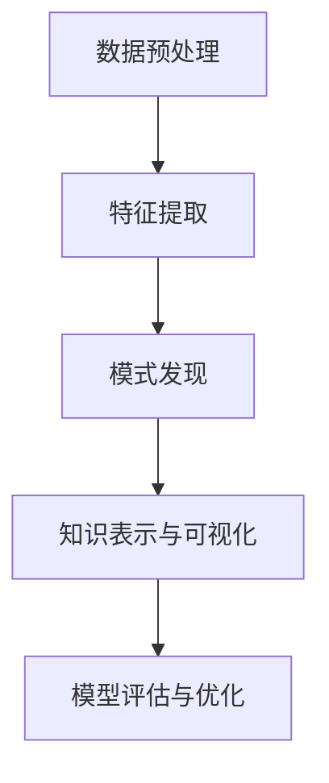

                 

# 知识发现引擎：知识与洞察力的互补与提升

在当今数据驱动的智能时代，如何从海量数据中提取有价值的知识和洞察力，成为一个至关重要的话题。本文将介绍一种基于知识发现引擎(Knowledge Discovery Engine, KDE)的方法，探讨其原理与操作步骤，并从数学模型、项目实践、应用场景等方面进行详细阐述。

## 1. 背景介绍

### 1.1 问题由来

随着互联网技术的飞速发展，各行各业产生了大量结构化与非结构化数据。传统的统计分析方法已无法满足快速、深入、准确地从数据中挖掘知识的需求。知识发现引擎正是在这样的背景下应运而生，旨在通过数据挖掘与分析，自动地从大数据中发现隐含的规律和知识。

知识发现引擎的应用覆盖了金融风险管理、市场行为分析、客户需求预测、社交媒体情感分析等众多领域。其核心在于利用先进的数据挖掘技术，如聚类分析、关联规则挖掘、深度学习等，从数据中挖掘出有价值的模式和知识，辅助决策者制定更为合理的决策。

### 1.2 问题核心关键点

知识发现引擎通常包括以下几个关键技术：

- **数据预处理**：清洗、整理、归一化数据，减少噪声和异常值，为后续分析奠定基础。
- **特征提取**：从原始数据中提取有意义的特征，便于后续建模和分析。
- **模式发现**：通过聚类、分类、关联规则挖掘等技术，发现数据中的潜在模式和规律。
- **知识表示与可视化**：将挖掘出的知识转化为图形、表格等形式，便于理解和应用。
- **模型评估与优化**：评估模型的性能，调整参数，优化模型效果。

这些技术环环相扣，构成知识发现引擎的核心功能模块。

### 1.3 问题研究意义

知识发现引擎的应用，可以帮助企业从海量数据中提取有价值的知识，提升决策效率和精准度，减少决策风险。通过自动化的知识发现，企业能够快速响应市场变化，优化资源配置，增强竞争力。

具体而言，知识发现引擎在金融风控、营销策略制定、产品推荐、社交媒体情感分析等领域具有重要作用。例如，通过分析历史交易数据，发现异常交易模式，预防金融诈骗；通过分析客户行为数据，发现潜在消费需求，提升销售转化率；通过分析社交媒体数据，了解公众情绪，优化品牌形象。

## 2. 核心概念与联系

### 2.1 核心概念概述

为更好地理解知识发现引擎的工作原理和应用，本节将介绍几个密切相关的核心概念：

- **知识发现(Knowledge Discovery)**：通过数据挖掘与分析，自动地从数据中发现隐含的规律和知识。
- **数据挖掘(Data Mining)**：利用统计学、机器学习等方法，从大量数据中提取有价值的信息和模式。
- **聚类(Clustering)**：将数据点划分为若干个组，使得同一组内的数据点相似度较高，不同组间的数据点相似度较低。
- **分类(Classification)**：将数据点划分到预定义的类别中，用于预测新数据的类别。
- **关联规则挖掘(Association Rule Mining)**：从数据集中发现频繁出现的项集和关联规则，用于发现潜在的规律和知识。
- **数据可视化(Data Visualization)**：将数据和分析结果转化为图形、表格等易于理解的可视化形式。
- **模型评估(Model Evaluation)**：评估模型的性能指标，如准确率、召回率、F1值等，优化模型效果。

这些核心概念之间的逻辑关系可以通过以下Mermaid流程图来展示：



这个流程图展示的知识发现引擎的核心概念及其之间的关系：

1. 数据预处理从原始数据中提取特征，为后续分析做准备。
2. 特征提取将原始数据转化为便于建模的特征集。
3. 模式发现从数据中挖掘出潜在的模式和规律。
4. 知识表示与可视化将发现的知识转化为易于理解的可视化形式。
5. 模型评估与优化评估模型效果，优化模型参数。

## 3. 核心算法原理 & 具体操作步骤

### 3.1 算法原理概述

知识发现引擎的原理可以概括为以下几个步骤：

1. **数据预处理**：清洗、整理、归一化数据，减少噪声和异常值，为后续分析奠定基础。
2. **特征提取**：从原始数据中提取有意义的特征，便于后续建模和分析。
3. **模式发现**：通过聚类、分类、关联规则挖掘等技术，发现数据中的潜在模式和规律。
4. **知识表示与可视化**：将挖掘出的知识转化为图形、表格等形式，便于理解和应用。
5. **模型评估与优化**：评估模型的性能，调整参数，优化模型效果。

知识发现引擎的算法原理主要基于数据挖掘与统计分析技术。常见的算法包括K-means聚类、决策树、支持向量机、朴素贝叶斯、关联规则挖掘等。这些算法在实际应用中通常需要根据具体任务进行选择和组合。

### 3.2 算法步骤详解

下面以基于决策树的分类算法为例，详细介绍知识发现引擎的核心操作步骤：

**Step 1: 数据预处理**

- 收集原始数据集，并进行清洗、整理和归一化处理。
- 处理缺失值、异常值，去除噪声。
- 将数据集划分为训练集和测试集。

**Step 2: 特征提取**

- 选择或构造有意义的特征，如年龄、性别、购买次数等。
- 对特征进行编码和标准化处理，如独热编码、归一化等。
- 构建特征向量，表示样本特征。

**Step 3: 模式发现**

- 使用决策树算法对特征向量进行建模。
- 通过信息增益或基尼指数等指标选择最优特征。
- 通过递归分裂构建决策树模型。

**Step 4: 知识表示与可视化**

- 将决策树模型转化为图形或表格形式。
- 通过可视化工具，展示决策树的结构和参数。

**Step 5: 模型评估与优化**

- 使用测试集评估模型性能，如准确率、召回率、F1值等。
- 调整决策树参数，如最大深度、最小样本数等，优化模型效果。

### 3.3 算法优缺点

知识发现引擎具有以下优点：

- **自动化程度高**：自动从数据中挖掘知识，减少人工干预。
- **适应性强**：适用于各种类型的数据和问题，具有较强的泛化能力。
- **可视化效果好**：挖掘出的知识可以直观展示，便于理解。

同时，知识发现引擎也存在一些局限性：

- **对数据质量依赖大**：数据质量直接影响到挖掘结果的准确性和可靠性。
- **模型解释性不足**：某些算法如神经网络等，其内部决策过程难以解释，可能导致“黑盒”问题。
- **对算法调参依赖大**：不同算法有不同的调参策略，需要根据具体问题进行调整。
- **计算资源消耗大**：某些算法如深度学习模型，计算资源消耗较高，对硬件要求较高。

### 3.4 算法应用领域

知识发现引擎的应用领域非常广泛，涵盖金融、医疗、零售、电子商务等多个行业。以下是几个典型应用场景：

**金融风险管理**

- 通过分析历史交易数据，发现异常交易模式，预防金融诈骗。
- 使用聚类和分类算法，对客户进行分类，评估信用风险。

**市场行为分析**

- 分析股票、商品等市场数据，发现价格波动趋势。
- 使用关联规则挖掘，发现潜在的市场机会。

**客户需求预测**

- 分析客户行为数据，预测客户未来的购买意愿。
- 使用决策树和神经网络，构建客户细分模型。

**社交媒体情感分析**

- 分析社交媒体数据，了解公众情绪。
- 使用情感分析算法，对评论、文章进行情感分类。

## 4. 数学模型和公式 & 详细讲解 & 举例说明

### 4.1 数学模型构建

本节将使用数学语言对知识发现引擎的各个环节进行更加严格的刻画。

记数据集为 $D=\{(x_i,y_i)\}_{i=1}^N$，其中 $x_i$ 为样本特征向量，$y_i$ 为标签。假设使用决策树算法进行分类，树的叶节点代表类别。

定义信息熵为 $H(y)=\sum_{k=1}^K p_k \log p_k$，其中 $p_k$ 为类别 $k$ 的概率。

定义信息增益为 $IG(y,A)=H(y)-H(y|A)$，其中 $H(y|A)$ 为条件熵。

决策树的生成过程可表示为：

$$
T=\mathop{\arg\min}_{t} H(T)
$$

其中 $T$ 为生成的决策树模型，$t$ 为决策树的参数。

### 4.2 公式推导过程

以下我们以决策树算法为例，推导信息增益的计算公式。

**信息熵的计算公式**：

$$
H(y)=\sum_{k=1}^K p_k \log p_k
$$

其中 $K$ 为类别数，$p_k$ 为类别 $k$ 的先验概率。

**条件熵的计算公式**：

$$
H(y|A)=\sum_{k=1}^K \frac{\sum_{i=1}^N 1(A_i=k)}{\sum_{i=1}^N 1(A_i \neq k)} \cdot \frac{1}{\sum_{j=1}^N 1(A_i=k,y_j=k)} \log \frac{1}{\sum_{j=1}^N 1(A_i=k,y_j=k)}
$$

其中 $A_i$ 为样本 $i$ 的特征 $A$，$y_j$ 为样本 $j$ 的标签。

**信息增益的计算公式**：

$$
IG(y,A)=H(y)-H(y|A)
$$

将信息熵和条件熵代入，得：

$$
IG(y,A)=-\sum_{k=1}^K p_k \log p_k - \sum_{k=1}^K \frac{\sum_{i=1}^N 1(A_i=k)}{\sum_{i=1}^N 1(A_i \neq k)} \cdot \frac{1}{\sum_{j=1}^N 1(A_i=k,y_j=k)} \log \frac{1}{\sum_{j=1}^N 1(A_i=k,y_j=k)}
$$

在得到信息增益后，即可带入决策树算法进行模型生成。重复上述过程直至收敛，最终得到适应当前数据集的最优决策树模型。

### 4.3 案例分析与讲解

假设有一组客户购买数据，特征包括年龄、性别、收入、购买次数等。目标是预测客户的购买行为，将客户分为高购买行为、中购买行为和低购买行为三类。

我们可以使用决策树算法对数据进行分类。首先，对数据进行预处理，去除缺失值和异常值。然后，选择年龄、性别、收入等特征，构建特征向量。接着，使用信息增益等指标选择最优特征，递归构建决策树。最后，通过测试集评估模型性能，调整决策树参数。

以年龄和收入为例，假设我们先选择年龄为决策树的根节点，根据年龄将数据集分为儿童、青年、中年、老年四组，分别计算信息增益。假设儿童、青年、中年、老年对应的先验概率分别为 $p_1, p_2, p_3, p_4$，且 $p_1+p_2+p_3+p_4=1$。

假设年龄为儿童的数据中，购买次数为 $c_1$，购买行为为高、中、低的人数分别为 $a_1^h, a_1^m, a_1^l$，对应的概率分别为 $p_1^h, p_1^m, p_1^l$。假设年龄为青年的数据中，购买次数为 $c_2$，购买行为为高、中、低的人数分别为 $a_2^h, a_2^m, a_2^l$，对应的概率分别为 $p_2^h, p_2^m, p_2^l$。以此类推，可以得到不同年龄组的购买行为分布。

假设信息熵和条件熵的计算公式分别为 $H(y)=\sum_{k=1}^K p_k \log p_k$ 和 $H(y|A)=\sum_{k=1}^K \frac{\sum_{i=1}^N 1(A_i=k)}{\sum_{i=1}^N 1(A_i \neq k)} \cdot \frac{1}{\sum_{j=1}^N 1(A_i=k,y_j=k)} \log \frac{1}{\sum_{j=1}^N 1(A_i=k,y_j=k)}$。

假设我们计算了年龄和收入两个特征的信息增益，其中年龄的信息增益大于收入的信息增益，因此选择年龄作为根节点，进行递归分裂。假设第一次分裂后，得到三个子节点，分别对应儿童、青年、中年，并根据不同年龄组的数据，递归计算每个子节点的信息增益，选择最优特征。最终生成一棵决策树模型，用于预测新客户的购买行为。

通过以上步骤，我们可以从数据中挖掘出有价值的知识，辅助决策者制定合理的策略，提升业务表现。

## 5. 项目实践：代码实例和详细解释说明

### 5.1 开发环境搭建

在进行知识发现引擎的实践前，我们需要准备好开发环境。以下是使用Python进行scikit-learn开发的环境配置流程：

1. 安装Anaconda：从官网下载并安装Anaconda，用于创建独立的Python环境。

2. 创建并激活虚拟环境：
```bash
conda create -n scikit-learn-env python=3.8 
conda activate scikit-learn-env
```

3. 安装scikit-learn：
```bash
conda install scikit-learn
```

4. 安装各类工具包：
```bash
pip install numpy pandas scikit-learn matplotlib tqdm jupyter notebook ipython
```

完成上述步骤后，即可在`scikit-learn-env`环境中开始知识发现引擎的开发实践。

### 5.2 源代码详细实现

下面我们以决策树算法为例，给出使用scikit-learn库对数据进行分类的PyTorch代码实现。

首先，定义决策树分类器：

```python
from sklearn.tree import DecisionTreeClassifier

clf = DecisionTreeClassifier(criterion='entropy', max_depth=3, min_samples_split=2, min_samples_leaf=1)
```

然后，准备训练集和测试集：

```python
from sklearn.model_selection import train_test_split
import pandas as pd

# 准备数据
data = pd.read_csv('data.csv')
X = data[['age', 'income']]
y = data['purchase_behavior']

# 划分训练集和测试集
X_train, X_test, y_train, y_test = train_test_split(X, y, test_size=0.2, random_state=42)
```

接着，进行模型训练和评估：

```python
# 训练模型
clf.fit(X_train, y_train)

# 预测测试集
y_pred = clf.predict(X_test)

# 评估模型
from sklearn.metrics import accuracy_score

acc = accuracy_score(y_test, y_pred)
print(f"模型准确率: {acc:.2f}")
```

最后，运行代码：

```bash
python decision_tree.py
```

以上就是使用scikit-learn对决策树模型进行分类的完整代码实现。可以看到，利用scikit-learn库，我们通过几行代码就能完成模型的训练和评估，简单易用。

### 5.3 代码解读与分析

让我们再详细解读一下关键代码的实现细节：

**数据准备**：
- 使用pandas库读取数据集，将数据集按照特征和标签进行划分。
- 对数据集进行归一化处理，避免不同特征之间的数值差异过大。

**模型定义**：
- 定义决策树分类器，选择合适的参数，如熵准则、最大深度等。
- 使用`fit`方法进行模型训练。

**模型评估**：
- 使用`predict`方法对测试集进行预测。
- 使用sklearn的`accuracy_score`函数计算模型准确率。
- 输出模型准确率。

可以看到，scikit-learn库提供了简单易用的接口，可以快速进行模型的训练和评估。在实际应用中，我们还需要考虑更多因素，如模型参数调优、特征选择等，以进一步提升模型效果。

## 6. 实际应用场景

### 6.1 智能推荐系统

基于知识发现引擎的推荐系统，可以自动分析用户行为数据，挖掘出用户兴趣和偏好，并根据这些信息推荐个性化的商品或服务。

在技术实现上，可以收集用户的历史行为数据，如浏览记录、购买记录、搜索记录等，并提取相关的特征。利用聚类、分类等算法，挖掘出用户群体和用户兴趣，构建推荐模型。通过测试集评估模型性能，优化模型参数，得到适合特定用户的推荐结果。

### 6.2 客户细分与忠诚度管理

知识发现引擎可以用于客户细分和忠诚度管理，通过分析客户行为数据，发现不同客户群体的特征和需求，制定针对性的营销策略，提升客户满意度和忠诚度。

在实际应用中，可以收集客户的历史购买数据、浏览数据、投诉数据等，进行数据预处理和特征提取。使用聚类算法，将客户划分为不同细分市场，并分析每个客户群体的特征和需求。根据分析结果，制定差异化的营销策略，提升客户满意度和忠诚度。

### 6.3 供应链管理

基于知识发现引擎的供应链管理系统，可以自动分析供应商、订单、库存等数据，挖掘出供应链中的瓶颈和优化点，优化供应链管理流程，提升供应链效率。

在实际应用中，可以收集供应链中的订单数据、库存数据、供应商数据等，进行数据预处理和特征提取。使用关联规则挖掘等算法，分析供应链中的瓶颈和优化点，优化供应链管理流程。通过测试集评估模型性能，优化模型参数，得到适合特定供应链的优化方案。

### 6.4 未来应用展望

随着知识发现引擎的不断发展，其在更多领域的应用将日益广泛。未来，知识发现引擎有望在智慧医疗、智能交通、智能制造等领域发挥更大作用，为各行各业提供智能决策支持。

在智慧医疗领域，知识发现引擎可以用于疾病预测、诊疗辅助、药物研发等。通过分析患者的历史诊疗数据、基因数据、环境数据等，挖掘出疾病发展规律，辅助医生进行疾病预测和治疗。通过分析药物的疗效和副作用，优化药物研发流程。

在智能交通领域，知识发现引擎可以用于交通流量预测、路况分析、智能导航等。通过分析交通流量数据、天气数据、车辆数据等，预测交通流量和路况，优化交通管理。通过分析交通事故数据，优化智能导航系统，提升交通安全性。

在智能制造领域，知识发现引擎可以用于设备维护预测、生产调度优化、质量检测等。通过分析设备运行数据、生产数据、质量数据等，预测设备故障和维护需求，优化生产调度。通过分析产品缺陷数据，优化质量检测流程，提升产品质量。

## 7. 工具和资源推荐

### 7.1 学习资源推荐

为了帮助开发者系统掌握知识发现引擎的理论基础和实践技巧，这里推荐一些优质的学习资源：

1. 《数据挖掘：概念与技术》（Witten和Frank著）：介绍数据挖掘的基本概念和技术，适合初学者入门。
2. 《机器学习实战》（Peter Harrington著）：介绍机器学习算法的实现，通过Python代码进行讲解，适合实战练习。
3. 《统计学习方法》（李航著）：介绍统计学习的基本理论和方法，适合深入学习。
4. 《Python数据科学手册》（Jake VanderPlas著）：介绍数据科学的工具和库，适合系统学习。
5. 《Scikit-learn官方文档》：scikit-learn的官方文档，包含丰富的实例和教程，适合深入学习。

通过对这些资源的学习实践，相信你一定能够快速掌握知识发现引擎的精髓，并用于解决实际的业务问题。

### 7.2 开发工具推荐

高效的开发离不开优秀的工具支持。以下是几款用于知识发现引擎开发的常用工具：

1. Python：Python是最常用的数据科学语言，拥有丰富的数据科学库和框架。
2. R：R是专门用于统计分析和数据科学的语言，拥有丰富的统计分析库。
3. Scikit-learn：Scikit-learn是Python中最流行的数据科学库，提供了丰富的机器学习算法和工具。
4. TensorFlow：TensorFlow是Google开源的深度学习框架，提供了丰富的深度学习算法和工具。
5. Jupyter Notebook：Jupyter Notebook是一种交互式的数据科学笔记本，支持Python、R等多种语言。
6. Tableau：Tableau是一种数据可视化工具，支持多种数据源和图表类型，适合进行数据可视化。

合理利用这些工具，可以显著提升知识发现引擎的开发效率，加快创新迭代的步伐。

### 7.3 相关论文推荐

知识发现引擎的发展得益于学界的持续研究。以下是几篇奠基性的相关论文，推荐阅读：

1. J.R. Quinlan. "Induction of Decision Trees". Machine Learning, 1986.
2. T.S. Dietterich. "Supervised learning: An overview". AI Magazine, 1995.
3. P. M. Brazdil and J. A. J. van Rijn. "Data Mining: Concepts and Techniques". Springer, 2013.
4. M. H. Kamber and J. Pei. "Data Mining: The Textbook". Morgan Kaufmann, 2015.
5. H. Zhang, M. Liu, and H. Li. "Decision tree learning and its applications: A review". ACM Computing Surveys, 2021.

这些论文代表了大规模数据挖掘和知识发现引擎的研究脉络。通过学习这些前沿成果，可以帮助研究者把握学科前进方向，激发更多的创新灵感。

## 8. 总结：未来发展趋势与挑战

### 8.1 总结

本文对知识发现引擎的原理与操作步骤进行了详细讲解，从数据预处理、特征提取、模式发现、知识表示与可视化、模型评估与优化等方面，系统介绍了知识发现引擎的核心算法和技术。

通过本文的系统梳理，可以看到，知识发现引擎在大数据时代的核心作用，可以帮助企业从海量数据中挖掘出有价值的知识和洞察力，提升决策效率和精准度，减少决策风险。知识发现引擎的应用覆盖了金融、医疗、零售、电子商务等多个领域，具有广泛的应用前景。

### 8.2 未来发展趋势

展望未来，知识发现引擎将呈现以下几个发展趋势：

1. **自动化程度进一步提升**：未来知识发现引擎将更加自动化，能够自动选择最优的算法和参数，减少人工干预。
2. **多模态融合能力增强**：未来知识发现引擎将能够处理多模态数据，如文本、图像、视频等，提升数据的整合和利用能力。
3. **实时性提升**：未来知识发现引擎将更加注重实时性，能够实时分析和预测数据，适应动态变化的业务场景。
4. **模型可解释性增强**：未来知识发现引擎将更加注重模型可解释性，能够自动解释和可视化模型的决策过程，提升信任度和可接受度。
5. **跨领域应用拓展**：未来知识发现引擎将能够应用于更多领域，如医疗、金融、教育等，解决更多实际问题。

这些趋势凸显了知识发现引擎的广泛应用前景和巨大潜力，为各行各业带来更深入、更精准、更智能的决策支持。

### 8.3 面临的挑战

尽管知识发现引擎已经取得了瞩目成就，但在迈向更加智能化、普适化应用的过程中，它仍面临诸多挑战：

1. **数据质量依赖大**：数据质量直接影响到挖掘结果的准确性和可靠性，如何在不同数据源、不同格式下进行高效的数据预处理和整合，是一个亟待解决的难题。
2. **模型复杂度高**：某些算法如深度学习模型，计算资源消耗较高，如何优化算法性能，降低计算资源消耗，是未来的研究方向。
3. **跨领域应用困难**：不同领域的数据特征和业务场景差异较大，如何将知识发现引擎应用到更多领域，是一个重要的挑战。
4. **可解释性不足**：某些算法如神经网络等，其内部决策过程难以解释，可能导致“黑盒”问题，如何增强模型可解释性，是一个重要的研究方向。

### 8.4 研究展望

面对知识发现引擎所面临的挑战，未来的研究需要在以下几个方面寻求新的突破：

1. **跨领域知识整合**：将符号化的先验知识，如知识图谱、逻辑规则等，与神经网络模型进行巧妙融合，引导知识发现过程学习更准确、合理的知识表示。同时加强不同模态数据的整合，实现视觉、语音等多模态信息与文本信息的协同建模。

2. **实时性优化**：引入实时流计算、增量学习等技术，增强知识发现引擎的实时处理能力，适应动态变化的业务场景。

3. **跨领域模型优化**：针对不同领域的特点，设计领域适应的算法和模型，提升知识发现引擎在不同领域的应用效果。

4. **模型可解释性提升**：引入可解释性技术，如因果推断、特征重要性分析等，增强模型的解释能力，提升信任度和可接受度。

这些研究方向的探索，必将引领知识发现引擎技术迈向更高的台阶，为构建智能决策系统铺平道路。面向未来，知识发现引擎还需要与其他人工智能技术进行更深入的融合，如知识图谱、因果推理、强化学习等，多路径协同发力，共同推动自然语言理解和智能交互系统的进步。只有勇于创新、敢于突破，才能不断拓展知识发现引擎的边界，让智能技术更好地造福人类社会。

## 9. 附录：常见问题与解答

**Q1：知识发现引擎与数据挖掘有什么区别？**

A: 知识发现引擎和数据挖掘是两个紧密相关的概念，但又有所不同。数据挖掘是一种从数据中挖掘出有用信息和模式的过程，侧重于算法的实现和数据的选择。而知识发现引擎则是一种综合性的工具，不仅包括数据挖掘技术，还包括数据预处理、特征提取、模型评估、可视化等多个环节。

**Q2：如何选择最优的算法和参数？**

A: 最优的算法和参数选择是一个关键的环节，通常需要结合具体问题和数据特点进行调参。可以使用交叉验证、网格搜索等方法进行调参，找到最优的算法和参数组合。同时，可以参考现有文献和实践经验，选择适合的算法和参数。

**Q3：知识发现引擎与机器学习的区别？**

A: 知识发现引擎和机器学习是两个不同的概念，但有一定的重叠。机器学习侧重于模型训练和预测，强调对数据的利用和预测能力的提升。而知识发现引擎侧重于数据的挖掘和分析，强调对数据背后的知识和规律进行探索和理解。

**Q4：如何在不同的数据源、不同格式下进行高效的数据预处理和整合？**

A: 数据预处理和整合是知识发现引擎的重要环节，需要根据不同数据源和格式进行灵活处理。可以使用ETL工具进行数据清洗、归一化和转换，使用数据标准化技术进行特征工程，使用数据可视化工具进行数据探索和分析。

**Q5：如何增强知识发现引擎的可解释性？**

A: 增强知识发现引擎的可解释性，可以通过引入因果推断、特征重要性分析等技术，解释模型的决策过程和特征选择逻辑。同时，可以通过可视化工具将模型结果转化为图形、表格等形式，方便理解和解释。

这些问题的解答，帮助我们更好地理解知识发现引擎的核心原理和操作步骤，希望通过本文的学习，能够为你在知识发现和决策支持中提供有益的参考。

---

作者：禅与计算机程序设计艺术 / Zen and the Art of Computer Programming

