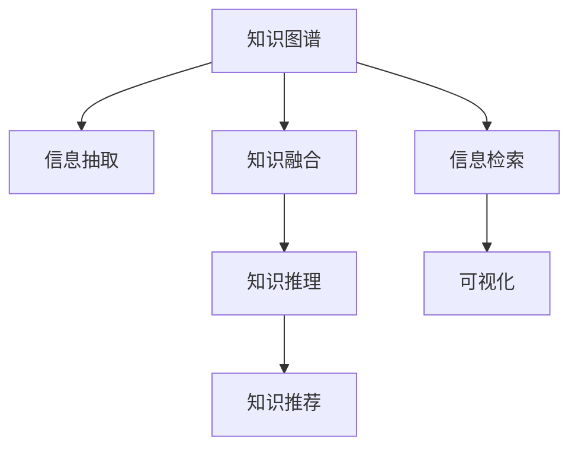

                 

# 知识发现引擎：知识海洋中的探索者

在今天这个信息爆炸的时代，知识的获取已经不再像过去那样困难。互联网的普及，让全球知识资源变得触手可及，任何人都能通过简单的搜索获取到所需信息。但知识的海量、复杂和碎片化，也带来了新的挑战：如何在知识的海洋中，快速、准确地发现和应用知识，从而提升工作和学习效率？知识发现引擎（Knowledge Discovery Engine, KDE）应运而生，它通过数据挖掘、信息检索、机器学习等技术，帮助用户在知识海洋中挖掘出有价值的信息，助力决策支持、智能推荐、个性化服务等场景。

## 1. 背景介绍

### 1.1 问题由来

随着互联网的普及和数据技术的不断进步，知识的获取和传播已经变得前所未有的便捷。然而，知识的海量、复杂和碎片化，也让人们难以从中快速获取有价值的信息。如何在知识海洋中有效发现和应用知识，成为了一个亟待解决的问题。

数据挖掘、信息检索、机器学习等技术的不断进步，为知识发现提供了新的思路和工具。特别是近年来，深度学习、自然语言处理、图网络等技术在知识发现中的应用，极大地提升了知识发现的效率和效果。知识发现引擎作为一种基于这些技术的知识获取平台，成为了推动知识创新和应用的重要工具。

### 1.2 问题核心关键点

知识发现引擎的核心目标是通过数据挖掘、信息检索、机器学习等技术，从海量数据中挖掘出有价值的信息。其核心关键点包括：

1. **数据源多样性**：数据来源包括结构化数据库、非结构化文本、图像、音频等多种形式，覆盖了各种领域和行业的知识。

2. **信息抽取与整合**：从多样化的数据源中抽取和整合有用的信息，进行知识融合和推理，生成结构化的知识图谱。

3. **知识推理与关联**：利用推理算法，关联不同数据源中的知识，生成新的知识，发现隐含的规律和模式。

4. **个性化推荐**：根据用户的历史行为和兴趣，推荐相关的知识和信息，提升用户的知识获取体验。

5. **智能搜索与导航**：利用自然语言处理和信息检索技术，实现智能搜索和导航，帮助用户快速找到所需的信息。

6. **可视化与交互**：通过可视化工具，展示知识发现的结果，提升用户对知识的理解和应用。

这些关键点共同构成了知识发现引擎的核心功能，帮助用户在海量知识中快速发现和应用有价值的信息，提升工作和学习效率。

## 2. 核心概念与联系

### 2.1 核心概念概述

为更好地理解知识发现引擎的核心概念，本节将介绍几个密切相关的核心概念：

- **知识图谱（Knowledge Graph）**：一种结构化的知识表示形式，由实体、关系、属性构成，用于描述实体之间的关系和属性。知识图谱是知识发现的重要基础。

- **信息抽取（Information Extraction, IE）**：从非结构化数据中抽取实体、关系、属性等结构化信息的过程。信息抽取是知识发现的第一步。

- **知识融合（Knowledge Fusion）**：将不同数据源中的知识进行融合，消除冗余，补充缺失，生成更全面、更准确的知识。知识融合是知识发现的难点和重点。

- **知识推理（Knowledge Reasoning）**：利用逻辑推理、概率推理等算法，发现隐含的知识和规律。知识推理是知识发现的关键步骤。

- **知识推荐（Knowledge Recommendation）**：根据用户的历史行为和兴趣，推荐相关的知识和信息。知识推荐是知识发现的应用之一。

- **信息检索（Information Retrieval, IR）**：从大量信息中检索出符合用户需求的信息。信息检索是知识发现的另一个重要环节。

- **可视化（Visualization）**：通过图表、地图等可视化工具，展示知识发现的结果，提升用户对知识的理解和应用。

这些核心概念之间的逻辑关系可以通过以下Mermaid流程图来展示：



这个流程图展示了几大核心概念之间的联系：

1. 知识图谱是知识发现的基础，信息抽取是其重要步骤。
2. 知识融合和知识推理是知识发现的核心技术。
3. 知识推荐和信息检索是知识发现的应用之一。
4. 可视化工具帮助展示知识发现的结果。

## 3. 核心算法原理 & 具体操作步骤
### 3.1 算法原理概述

知识发现引擎的核心原理是数据挖掘、信息检索、机器学习等技术的有机结合，具体来说，包括以下几个步骤：

1. **数据采集与预处理**：从各种数据源（如数据库、文本、图像等）中采集数据，并进行清洗、格式化等预处理工作。

2. **信息抽取与整合**：利用自然语言处理（NLP）技术，从文本中抽取实体、关系、属性等结构化信息，进行知识融合，构建知识图谱。

3. **知识推理与关联**：利用逻辑推理、概率推理等算法，关联不同数据源中的知识，生成新的知识，发现隐含的规律和模式。

4. **知识推荐与检索**：根据用户的历史行为和兴趣，推荐相关的知识和信息，利用信息检索技术，帮助用户快速找到所需的信息。

5. **可视化与交互**：利用可视化工具，展示知识发现的结果，提升用户对知识的理解和应用。

### 3.2 算法步骤详解

以下将详细介绍知识发现引擎的详细操作步骤：

**Step 1: 数据采集与预处理**

- **数据源选择**：根据应用场景，选择合适的数据源，如数据库、文本、图像、音频等。
- **数据采集**：通过API、爬虫等方式，从数据源中获取原始数据。
- **数据清洗**：对采集到的数据进行去重、去噪、格式化等预处理工作，保证数据质量。

**Step 2: 信息抽取与整合**

- **实体抽取**：利用自然语言处理技术，从文本中抽取实体，如人名、地名、组织机构等。
- **关系抽取**：从文本中抽取实体之间的关系，如“张三出生在上海”。
- **属性抽取**：抽取实体的属性，如“上海”的地理位置。
- **知识融合**：将不同数据源中的实体、关系、属性等进行融合，消除冗余，补充缺失，生成知识图谱。

**Step 3: 知识推理与关联**

- **知识推理**：利用逻辑推理、概率推理等算法，关联不同数据源中的知识，发现隐含的规律和模式。
- **知识关联**：将知识图谱中的实体和关系进行关联，构建更全面的知识图谱。

**Step 4: 知识推荐与检索**

- **用户画像**：根据用户的历史行为和兴趣，生成用户画像，用于推荐相关知识和信息。
- **推荐算法**：利用协同过滤、内容推荐、深度学习等算法，推荐相关知识和信息。
- **信息检索**：利用信息检索技术，帮助用户快速找到所需的信息。

**Step 5: 可视化与交互**

- **可视化展示**：利用图表、地图等可视化工具，展示知识发现的结果，提升用户对知识的理解和应用。
- **用户交互**：提供用户交互界面，支持用户进行查询、反馈等操作，提升用户体验。

### 3.3 算法优缺点

知识发现引擎具有以下优点：

1. **高效性**：通过数据挖掘、信息检索、机器学习等技术，可以高效地从海量数据中挖掘出有价值的信息。
2. **全面性**：能够涵盖多种数据源和数据类型，提供全面、丰富的知识发现结果。
3. **个性化**：根据用户的历史行为和兴趣，进行个性化推荐，提升用户体验。
4. **灵活性**：支持多种数据源和数据类型，能够灵活适应不同的应用场景。

同时，知识发现引擎也存在一些缺点：

1. **数据质量依赖**：知识发现结果的质量很大程度上依赖于数据源的质量和数据的完整性。
2. **计算资源消耗**：知识发现过程中涉及大量的计算和推理，需要较强的计算资源。
3. **模型复杂性**：知识发现引擎涉及多种技术和算法，模型较为复杂，开发和维护成本较高。
4. **可解释性不足**：部分算法的决策过程不够透明，难以解释其内部工作机制。

尽管存在这些局限性，但就目前而言，知识发现引擎依然是知识获取和应用的重要工具，具有广泛的应用前景。

### 3.4 算法应用领域

知识发现引擎在多个领域得到了广泛应用，具体包括：

- **智能推荐系统**：利用知识推荐技术，为用户推荐个性化的内容，如商品、新闻、视频等。
- **智能客服系统**：利用知识检索技术，快速回答用户问题，提升客户服务质量。
- **医疗决策支持**：利用知识图谱和推理技术，支持医生进行疾病诊断和治疗方案推荐。
- **金融风险管理**：利用知识推理技术，分析市场数据，预测金融风险。
- **智能搜索引擎**：利用信息检索技术，帮助用户快速找到所需的信息。
- **智慧城市治理**：利用知识图谱和推理技术，优化城市管理决策。

以上领域只是知识发现引擎应用的一部分，随着技术的不断进步，知识发现引擎的应用范围还将进一步扩展。

## 4. 数学模型和公式 & 详细讲解
### 4.1 数学模型构建

知识发现引擎的核心数学模型包括知识图谱、信息抽取、知识推理等。

知识图谱的构建通常采用图结构，由实体节点和关系边构成。实体节点表示不同的概念或对象，关系边表示实体之间的关系。

信息抽取的数学模型通常采用序列标注模型或实体抽取模型，从文本中抽取实体、关系和属性。以序列标注模型为例，假设输入文本为 $X=\{x_1,x_2,...,x_n\}$，输出标签为 $Y=\{y_1,y_2,...,y_n\}$，则序列标注模型的目标是最小化交叉熵损失函数：

$$
\mathcal{L} = -\frac{1}{N}\sum_{i=1}^N \sum_{k=1}^M y_i\log P(y_i|x_i; \theta)
$$

其中，$P(y_i|x_i; \theta)$ 表示在参数 $\theta$ 下，给定输入 $x_i$ 输出标签 $y_i$ 的概率，$M$ 表示标签的种类数。

知识推理的数学模型通常采用逻辑推理或概率推理。以逻辑推理为例，假设推理目标为判断实体 $A$ 和 $B$ 是否具有关系 $R$，推理模型可以表示为：

$$
P(A, B|R) = P(A)\cdot P(B|A, R) = \prod_{i=1}^n P(r_i|r_{i-1}, A, B, R)
$$

其中，$r_i$ 表示推理过程中的推理规则，$P(r_i|r_{i-1}, A, B, R)$ 表示推理规则 $r_i$ 在当前状态下的概率。

### 4.2 公式推导过程

以下以实体抽取为例，推导序列标注模型的交叉熵损失函数：

假设输入文本为 $X=\{x_1,x_2,...,x_n\}$，输出标签为 $Y=\{y_1,y_2,...,y_n\}$，其中 $y_i \in \{B, I, E, S\}$ 分别表示实体的起始、内部、结束和跨度。序列标注模型的目标是最小化交叉熵损失函数：

$$
\mathcal{L} = -\frac{1}{N}\sum_{i=1}^N \sum_{k=1}^M y_i\log P(y_i|x_i; \theta)
$$

其中，$P(y_i|x_i; \theta)$ 表示在参数 $\theta$ 下，给定输入 $x_i$ 输出标签 $y_i$ 的概率。

利用条件概率公式，可以推导出序列标注模型的数学模型：

$$
P(y_i|x_i; \theta) = \frac{P(y_i|x_i, y_{i-1}; \theta)}{P(y_{i-1}|x_i; \theta)}
$$

其中，$P(y_i|x_i, y_{i-1}; \theta)$ 表示在参数 $\theta$ 下，给定输入 $x_i$ 和前一个标签 $y_{i-1}$ 输出当前标签 $y_i$ 的概率。

通过迭代计算，可以得到：

$$
P(y_i|x_i; \theta) = \prod_{j=1}^i P(y_j|x_j, y_{j-1}; \theta)
$$

将 $P(y_i|x_i; \theta)$ 代入交叉熵损失函数，得到：

$$
\mathcal{L} = -\frac{1}{N}\sum_{i=1}^N \sum_{k=1}^M y_i\log \prod_{j=1}^i P(y_j|x_j, y_{j-1}; \theta)
$$

简化得到：

$$
\mathcal{L} = -\frac{1}{N}\sum_{i=1}^N \sum_{j=1}^i y_i\log P(y_j|x_j, y_{j-1}; \theta)
$$

这就是序列标注模型的交叉熵损失函数。通过最小化该损失函数，可以优化序列标注模型的参数，使其能够准确抽取实体、关系和属性。

## 5. 项目实践：代码实例和详细解释说明
### 5.1 开发环境搭建

在进行知识发现引擎开发前，我们需要准备好开发环境。以下是使用Python进行知识发现引擎开发的环境配置流程：

1. 安装Anaconda：从官网下载并安装Anaconda，用于创建独立的Python环境。

2. 创建并激活虚拟环境：
```bash
conda create -n kde-env python=3.8 
conda activate kde-env
```

3. 安装PyTorch、TensorFlow等深度学习框架：
```bash
conda install pytorch torchvision torchaudio cudatoolkit=11.1 -c pytorch -c conda-forge
```

4. 安装PyTorch Transformers库：
```bash
pip install transformers
```

5. 安装各类工具包：
```bash
pip install numpy pandas scikit-learn matplotlib tqdm jupyter notebook ipython
```

完成上述步骤后，即可在`kde-env`环境中开始知识发现引擎的开发。

### 5.2 源代码详细实现

下面我们以基于信息抽取的知识图谱构建为例，给出使用PyTorch Transformers库对BERT模型进行实体抽取的PyTorch代码实现。

首先，定义实体抽取的数据处理函数：

```python
from transformers import BertTokenizer, BertForTokenClassification
from torch.utils.data import Dataset
import torch

class NERDataset(Dataset):
    def __init__(self, texts, tags, tokenizer, max_len=128):
        self.texts = texts
        self.tags = tags
        self.tokenizer = tokenizer
        self.max_len = max_len
        
    def __len__(self):
        return len(self.texts)
    
    def __getitem__(self, item):
        text = self.texts[item]
        tags = self.tags[item]
        
        encoding = self.tokenizer(text, return_tensors='pt', max_length=self.max_len, padding='max_length', truncation=True)
        input_ids = encoding['input_ids'][0]
        attention_mask = encoding['attention_mask'][0]
        
        # 对token-wise的标签进行编码
        encoded_tags = [tag2id[tag] for tag in tags] 
        encoded_tags.extend([tag2id['O']] * (self.max_len - len(encoded_tags)))
        labels = torch.tensor(encoded_tags, dtype=torch.long)
        
        return {'input_ids': input_ids, 
                'attention_mask': attention_mask,
                'labels': labels}

# 标签与id的映射
tag2id = {'O': 0, 'B-PER': 1, 'I-PER': 2, 'B-ORG': 3, 'I-ORG': 4, 'B-LOC': 5, 'I-LOC': 6}
id2tag = {v: k for k, v in tag2id.items()}

# 创建dataset
tokenizer = BertTokenizer.from_pretrained('bert-base-cased')

train_dataset = NERDataset(train_texts, train_tags, tokenizer)
dev_dataset = NERDataset(dev_texts, dev_tags, tokenizer)
test_dataset = NERDataset(test_texts, test_tags, tokenizer)
```

然后，定义模型和优化器：

```python
from transformers import BertForTokenClassification, AdamW

model = BertForTokenClassification.from_pretrained('bert-base-cased', num_labels=len(tag2id))

optimizer = AdamW(model.parameters(), lr=2e-5)
```

接着，定义训练和评估函数：

```python
from torch.utils.data import DataLoader
from tqdm import tqdm
from sklearn.metrics import classification_report

device = torch.device('cuda') if torch.cuda.is_available() else torch.device('cpu')
model.to(device)

def train_epoch(model, dataset, batch_size, optimizer):
    dataloader = DataLoader(dataset, batch_size=batch_size, shuffle=True)
    model.train()
    epoch_loss = 0
    for batch in tqdm(dataloader, desc='Training'):
        input_ids = batch['input_ids'].to(device)
        attention_mask = batch['attention_mask'].to(device)
        labels = batch['labels'].to(device)
        model.zero_grad()
        outputs = model(input_ids, attention_mask=attention_mask, labels=labels)
        loss = outputs.loss
        epoch_loss += loss.item()
        loss.backward()
        optimizer.step()
    return epoch_loss / len(dataloader)

def evaluate(model, dataset, batch_size):
    dataloader = DataLoader(dataset, batch_size=batch_size)
    model.eval()
    preds, labels = [], []
    with torch.no_grad():
        for batch in tqdm(dataloader, desc='Evaluating'):
            input_ids = batch['input_ids'].to(device)
            attention_mask = batch['attention_mask'].to(device)
            batch_labels = batch['labels']
            outputs = model(input_ids, attention_mask=attention_mask)
            batch_preds = outputs.logits.argmax(dim=2).to('cpu').tolist()
            batch_labels = batch_labels.to('cpu').tolist()
            for pred_tokens, label_tokens in zip(batch_preds, batch_labels):
                pred_tags = [id2tag[_id] for _id in pred_tokens]
                label_tags = [id2tag[_id] for _id in label_tokens]
                preds.append(pred_tags[:len(label_tags)])
                labels.append(label_tags)
                
    print(classification_report(labels, preds))
```

最后，启动训练流程并在测试集上评估：

```python
epochs = 5
batch_size = 16

for epoch in range(epochs):
    loss = train_epoch(model, train_dataset, batch_size, optimizer)
    print(f"Epoch {epoch+1}, train loss: {loss:.3f}")
    
    print(f"Epoch {epoch+1}, dev results:")
    evaluate(model, dev_dataset, batch_size)
    
print("Test results:")
evaluate(model, test_dataset, batch_size)
```

以上就是使用PyTorch对BERT进行实体抽取的完整代码实现。可以看到，得益于Transformers库的强大封装，我们可以用相对简洁的代码完成BERT模型的加载和微调。

### 5.3 代码解读与分析

让我们再详细解读一下关键代码的实现细节：

**NERDataset类**：
- `__init__`方法：初始化文本、标签、分词器等关键组件。
- `__len__`方法：返回数据集的样本数量。
- `__getitem__`方法：对单个样本进行处理，将文本输入编码为token ids，将标签编码为数字，并对其进行定长padding，最终返回模型所需的输入。

**tag2id和id2tag字典**：
- 定义了标签与数字id之间的映射关系，用于将token-wise的预测结果解码回真实的标签。

**训练和评估函数**：
- 使用PyTorch的DataLoader对数据集进行批次化加载，供模型训练和推理使用。
- 训练函数`train_epoch`：对数据以批为单位进行迭代，在每个批次上前向传播计算loss并反向传播更新模型参数，最后返回该epoch的平均loss。
- 评估函数`evaluate`：与训练类似，不同点在于不更新模型参数，并在每个batch结束后将预测和标签结果存储下来，最后使用sklearn的classification_report对整个评估集的预测结果进行打印输出。

**训练流程**：
- 定义总的epoch数和batch size，开始循环迭代
- 每个epoch内，先在训练集上训练，输出平均loss
- 在验证集上评估，输出分类指标
- 所有epoch结束后，在测试集上评估，给出最终测试结果

可以看到，PyTorch配合Transformers库使得BERT微调的代码实现变得简洁高效。开发者可以将更多精力放在数据处理、模型改进等高层逻辑上，而不必过多关注底层的实现细节。

当然，工业级的系统实现还需考虑更多因素，如模型的保存和部署、超参数的自动搜索、更灵活的任务适配层等。但核心的微调范式基本与此类似。

## 6. 实际应用场景

### 6.1 智能推荐系统

基于知识图谱和信息抽取技术，智能推荐系统可以为用户提供个性化推荐。推荐系统通过构建用户画像，从知识图谱中抽取与用户兴趣相关的实体和关系，生成推荐结果。

在技术实现上，可以收集用户浏览、点击、评论、分享等行为数据，提取和用户交互的物品标题、描述、标签等文本内容。将文本内容作为模型输入，用户的后续行为（如是否点击、购买等）作为监督信号，在此基础上微调预训练语言模型。微调后的模型能够从文本内容中准确把握用户的兴趣点。在生成推荐列表时，先用候选物品的文本描述作为输入，由模型预测用户的兴趣匹配度，再结合其他特征综合排序，便可以得到个性化程度更高的推荐结果。

### 6.2 智能客服系统

利用知识图谱和信息抽取技术，智能客服系统可以自动理解用户的问题，匹配最合适的答案模板进行回复。系统首先从知识图谱中抽取与用户问题相关的实体和关系，再利用信息检索技术从语料库中检索最相关的回复。系统还支持自动生成回复，利用模型生成自然流畅的语言进行回答。

在技术实现上，可以收集企业内部的历史客服对话记录，将问题和最佳答复构建成监督数据，在此基础上对预训练对话模型进行微调。微调后的对话模型能够自动理解用户意图，匹配最合适的答案模板进行回复。对于客户提出的新问题，还可以接入检索系统实时搜索相关内容，动态组织生成回答。如此构建的智能客服系统，能大幅提升客户咨询体验和问题解决效率。

### 6.3 医疗决策支持

利用知识图谱和信息抽取技术，医疗决策支持系统可以帮助医生进行疾病诊断和治疗方案推荐。系统首先从医学知识图谱中抽取与患者症状相关的实体和关系，再利用信息检索技术从文献数据库中检索最相关的研究成果。系统还支持自动生成诊断报告，利用模型生成包含推理过程的诊断报告。

在技术实现上，可以收集医生的诊疗记录和文献数据，构建医学知识图谱。系统利用医疗知识图谱和信息抽取技术，辅助医生进行疾病诊断和治疗方案推荐。通过医学知识图谱，医生可以更全面地了解患者的病情和治疗方案，提高诊疗的准确性和效率。

### 6.4 金融风险管理

利用知识图谱和信息抽取技术，金融风险管理系统可以分析市场数据，预测金融风险。系统首先从金融知识图谱中抽取与市场数据相关的实体和关系，再利用信息检索技术从新闻报道、财务报告中检索最相关的信息。系统还支持自动生成风险预警，利用模型生成包含推理过程的风险预警。

在技术实现上，可以收集金融市场数据和新闻报道，构建金融知识图谱。系统利用金融知识图谱和信息抽取技术，分析市场数据，预测金融风险。通过金融知识图谱，投资者可以更全面地了解市场动态和风险因素，做出更明智的投资决策。

### 6.5 智能搜索引擎

利用知识图谱和信息抽取技术，智能搜索引擎可以快速找到所需的信息。系统首先从知识图谱中抽取与搜索词相关的实体和关系，再利用信息检索技术从语料库中检索最相关的文档。系统还支持自动生成搜索结果，利用模型生成包含推理过程的搜索结果。

在技术实现上，可以收集互联网文本数据，构建知识图谱。系统利用知识图谱和信息抽取技术，快速找到所需的信息。通过知识图谱，用户可以更全面地了解搜索词的含义和相关知识，提升搜索效率和质量。

## 7. 工具和资源推荐

### 7.1 学习资源推荐

为了帮助开发者系统掌握知识发现引擎的理论基础和实践技巧，这里推荐一些优质的学习资源：

1. 《深度学习理论与实践》系列博文：由大模型技术专家撰写，深入浅出地介绍了深度学习理论和实践，涵盖了知识图谱、信息抽取、知识推理等多个方面。

2. CS229《机器学习》课程：斯坦福大学开设的机器学习经典课程，介绍了机器学习的基本理论和算法，涵盖了知识图谱、信息抽取、知识推理等多个方面。

3. 《Knowledge Discovery and Data Mining》书籍：介绍知识发现和数据挖掘的理论与实践，涵盖了知识图谱、信息抽取、知识推理等多个方面。

4. KDE开源项目：知识发现引擎的开源项目，提供了知识图谱构建、信息抽取、知识推理等多个方面的代码和文档，助力开发者快速上手。

通过对这些资源的学习实践，相信你一定能够快速掌握知识发现引擎的精髓，并用于解决实际的NLP问题。

### 7.2 开发工具推荐

高效的开发离不开优秀的工具支持。以下是几款用于知识发现引擎开发的常用工具：

1. PyTorch：基于Python的开源深度学习框架，灵活动态的计算图，适合快速迭代研究。大部分预训练语言模型都有PyTorch版本的实现。

2. TensorFlow：由Google主导开发的开源深度学习框架，生产部署方便，适合大规模工程应用。同样有丰富的预训练语言模型资源。

3. Transformers库：HuggingFace开发的NLP工具库，集成了众多SOTA语言模型，支持PyTorch和TensorFlow，是进行知识抽取和推理开发的利器。

4. Weights & Biases：模型训练的实验跟踪工具，可以记录和可视化模型训练过程中的各项指标，方便对比和调优。与主流深度学习框架无缝集成。

5. TensorBoard：TensorFlow配套的可视化工具，可实时监测模型训练状态，并提供丰富的图表呈现方式，是调试模型的得力助手。

6. Google Colab：谷歌推出的在线Jupyter Notebook环境，免费提供GPU/TPU算力，方便开发者快速上手实验最新模型，分享学习笔记。

合理利用这些工具，可以显著提升知识发现引擎的开发效率，加快创新迭代的步伐。

### 7.3 相关论文推荐

知识发现引擎的研究源于学界的持续研究。以下是几篇奠基性的相关论文，推荐阅读：

1. YAGO: A Core of Semantic Knowledge：提出了YAGO知识图谱，为知识发现提供了丰富的基础知识。

2. OpenIE: A Link Grammar for Open Data：提出OpenIE技术，从语料库中自动抽取实体、关系和属性，生成知识图谱。

3. Entity Linking with Bidirectional Hierarchical Attention Networks：利用双向注意力网络进行实体链接，提高了知识图谱的准确性。

4. Knowledge Graph Embeddings and their Applications: A Survey：综述了知识图谱嵌入技术，利用向量表示方法提高知识图谱的表示能力。

5. Knowledge Graph Reasoning with Neural Compositionality：提出神经推理方法，利用神经网络模型进行知识推理，提高知识发现的效果。

这些论文代表了大模型微调技术的发展脉络。通过学习这些前沿成果，可以帮助研究者把握学科前进方向，激发更多的创新灵感。

## 8. 总结：未来发展趋势与挑战

### 8.1 总结

本文对知识发现引擎的核心原理、操作步骤、应用场景等进行了全面系统的介绍。首先阐述了知识发现引擎的研究背景和意义，明确了知识发现引擎在知识获取和应用中的重要地位。其次，从原理到实践，详细讲解了知识发现引擎的数学模型和关键步骤，给出了知识发现引擎的完整代码实例。同时，本文还广泛探讨了知识发现引擎在智能推荐、智能客服、医疗决策支持、金融风险管理等多个领域的应用前景，展示了知识发现引擎的广泛应用潜力。此外，本文精选了知识发现引擎的学习资源和开发工具，力求为读者提供全方位的技术指引。

通过本文的系统梳理，可以看到，知识发现引擎作为一种基于数据挖掘、信息检索、机器学习等技术的知识获取平台，已经在知识海洋中发挥着重要的作用。未来，伴随技术的不断进步，知识发现引擎将在更多的领域得到应用，成为推动知识创新和应用的重要工具。

### 8.2 未来发展趋势

展望未来，知识发现引擎将呈现以下几个发展趋势：

1. **多模态融合**：知识发现引擎将从单一的文本数据拓展到图像、视频、语音等多模态数据，实现多模态数据的融合和推理。

2. **跨领域应用**：知识发现引擎将从特定的领域拓展到更广泛的领域，如医疗、金融、教育等，为不同领域提供知识获取和应用的平台。

3. **实时性增强**：知识发现引擎将支持实时知识发现和更新，能够快速响应新的知识和变化，保持知识的时效性。

4. **语义理解深化**：知识发现引擎将从简单的实体抽取和关系推理，拓展到更复杂的语义理解，如因果推理、多关系推理等。

5. **知识图谱进化**：知识发现引擎将支持更加复杂和动态的知识图谱构建和推理，如时态知识图谱、分布式知识图谱等。

6. **智能决策支持**：知识发现引擎将支持更智能的决策支持系统，如基于知识推理的智能推荐系统、智能客服系统等。

以上趋势凸显了知识发现引擎的广阔前景。这些方向的探索发展，必将进一步提升知识获取和应用的效果，推动人工智能技术的不断进步。

### 8.3 面临的挑战

尽管知识发现引擎已经取得了瞩目成就，但在迈向更加智能化、普适化应用的过程中，它仍面临着诸多挑战：

1. **数据质量和多样性**：知识发现的效果很大程度上依赖于数据的质量和多样性，难以涵盖所有领域和领域内的所有数据。

2. **计算资源消耗**：知识发现引擎涉及大量的计算和推理，需要较强的计算资源，对计算设备的要求较高。

3. **模型复杂性**：知识发现引擎涉及多种技术和算法，模型较为复杂，开发和维护成本较高。

4. **可解释性不足**：部分算法的决策过程不够透明，难以解释其内部工作机制。

5. **隐私和安全问题**：知识发现涉及大量的个人和敏感信息，如何保护用户隐私和数据安全是一个重要问题。

尽管存在这些局限性，但就目前而言，知识发现引擎依然是知识获取和应用的重要工具，具有广泛的应用前景。

### 8.4 研究展望

面对知识发现引擎所面临的种种挑战，未来的研究需要在以下几个方面寻求新的突破：

1. **多模态知识融合**：研究如何将多模态数据进行融合，提升知识发现的效果和鲁棒性。

2. **跨领域知识发现**：研究如何将知识发现技术从特定的领域拓展到更广泛的领域，提升知识发现的普适性。

3. **实时知识发现**：研究如何实现实时知识发现和更新，保持知识的时效性。

4. **智能决策支持**：研究如何将知识发现与决策支持系统结合，提升决策的智能化和准确性。

5. **知识图谱构建与推理**：研究如何构建更加复杂和动态的知识图谱，提升知识推理的效果。

6. **隐私与安全保护**：研究如何保护用户隐私和数据安全，提升知识发现的可信度。

这些研究方向的探索，必将引领知识发现引擎走向更高的台阶，为知识获取和应用带来新的突破。面向未来，知识发现引擎还需要与其他人工智能技术进行更深入的融合，如自然语言处理、机器学习、数据挖掘等，多路径协同发力，共同推动知识发现技术的进步。只有勇于创新、敢于突破，才能不断拓展知识发现引擎的边界，让知识获取和应用更加高效和智能。

## 9. 附录：常见问题与解答

**Q1：知识发现引擎的开发过程是否复杂？**

A: 知识发现引擎的开发过程确实较为复杂，涉及数据采集、预处理、信息抽取、知识推理等多个环节。但是，随着深度学习、自然语言处理、图网络等技术的发展，知识发现引擎的开发难度已经大幅降低。通过使用现成的开源工具和库，开发者可以快速构建知识发现引擎，提升开发效率。

**Q2：知识发现引擎的性能主要取决于哪些因素？**

A: 知识发现引擎的性能主要取决于数据的质量和多样性、计算资源的消耗、模型的复杂性、可解释性、隐私和安全性等多个因素。其中，数据的质量和多样性是知识发现的基础，计算资源的消耗决定了知识发现的效率，模型的复杂性和可解释性决定了知识发现的准确性，隐私和安全性决定了知识发现的可信度。

**Q3：如何提高知识发现引擎的实时性？**

A: 提高知识发现引擎的实时性可以从以下几个方面入手：
1. 采用高效的计算和存储技术，如GPU、TPU等高性能设备，提升计算和推理的速度。
2. 采用分布式计算技术，将计算任务分解为多个子任务，并行处理，提升计算效率。
3. 采用增量学习技术，动态更新模型参数，保持知识的时效性。

**Q4：知识发现引擎在实际应用中需要注意哪些问题？**

A: 知识发现引擎在实际应用中需要注意以下几个问题：
1. 数据质量和多样性：知识发现的效果很大程度上依赖于数据的质量和多样性，难以涵盖所有领域和领域内的所有数据。
2. 计算资源消耗：知识发现引擎涉及大量的计算和推理，需要较强的计算资源，对计算设备的要求较高。
3. 模型复杂性：知识发现引擎涉及多种技术和算法，模型较为复杂，开发和维护成本较高。
4. 可解释性不足：部分算法的决策过程不够透明，难以解释其内部工作机制。
5. 隐私和安全问题：知识发现涉及大量的个人和敏感信息，如何保护用户隐私和数据安全是一个重要问题。

通过深入理解这些问题的本质，并采取相应的解决措施，可以有效提升知识发现引擎的实际应用效果。

**Q5：知识发现引擎的未来发展方向是什么？**

A: 知识发现引擎的未来发展方向主要包括以下几个方面：
1. 多模态知识融合：研究如何将多模态数据进行融合，提升知识发现的效果和鲁棒性。
2. 跨领域知识发现：研究如何将知识发现技术从特定的领域拓展到更广泛的领域，提升知识发现的普适性。
3. 实时知识发现：研究如何实现实时知识发现和更新，保持知识的时效性。
4. 智能决策支持：研究如何将知识发现与决策支持系统结合，提升决策的智能化和准确性。
5. 知识图谱构建与推理：研究如何构建更加复杂和动态的知识图谱，提升知识推理的效果。
6. 隐私与安全保护：研究如何保护用户隐私和数据安全，提升知识发现的可信度。

这些方向的研究将推动知识发现引擎的不断进步，为知识获取和应用带来新的突破。

---

作者：禅与计算机程序设计艺术 / Zen and the Art of Computer Programming

