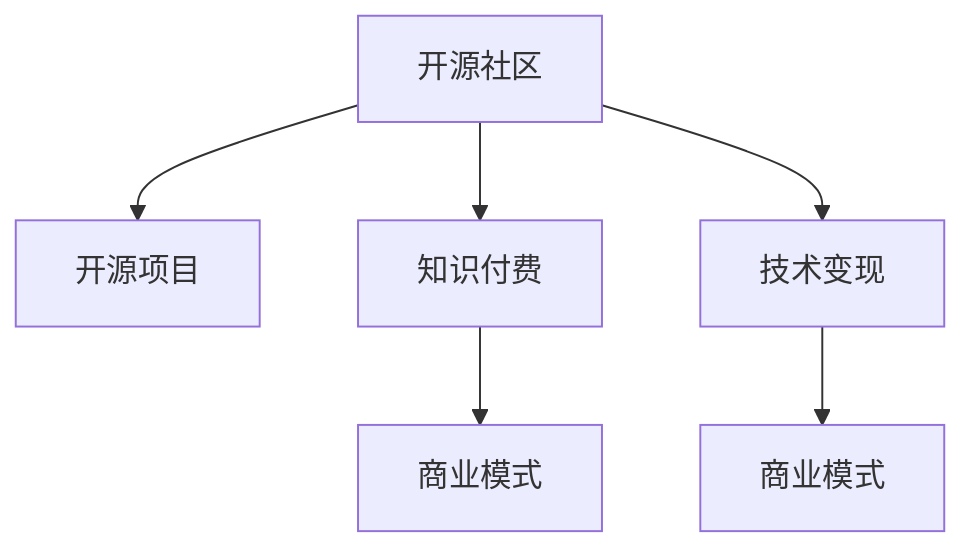

                 

# 知识变现的100种方法

> 关键词：知识变现, 开源社区, 开源项目, 知识付费, 商业模式, 技术变现

## 1. 背景介绍

### 1.1 问题由来
随着互联网的普及和知识爆炸，越来越多的人开始追求知识变现。从博客、视频、到线下课程，从技术博客、开源项目、到知识付费，知识变现的方式多种多样。但如何更高效地将知识变现，始终是许多专业人士和创业者关注的问题。

### 1.2 问题核心关键点
本文将围绕如何高效地将知识变现，探讨100种不同的方法和策略。我们将从开源社区、开源项目、知识付费、商业模式、技术变现等几个方面，详细阐述知识变现的多种途径，以期为那些渴望通过知识赚钱的从业者提供一份全面的指南。

### 1.3 问题研究意义
在信息过载的时代，知识变现已成为一种趋势。掌握高效的知识变现方法，不仅能为自己带来收益，还能为社会创造价值，推动知识的普及和创新。本文旨在深入探讨知识变现的多种模式，为读者提供更多的思路和灵感，帮助他们实现知识变现的梦想。

## 2. 核心概念与联系

### 2.1 核心概念概述

- **开源社区**：基于共同的兴趣和目标，人们通过分享代码、经验和知识来协作开发软件和技术工具的在线平台。开源社区中的项目往往以社区驱动和贡献者为主导。
- **开源项目**：指公开源代码的软件项目，项目开发者基于开源许可证，允许其他开发者自由使用、修改和分发项目。开源项目促进了技术交流和创新。
- **知识付费**：用户为获取专业知识和技能，向知识提供者支付费用。这种模式强调知识的价值和专业性。
- **商业模式**：指企业为实现其价值主张而设计的商业模式框架，包括盈利模式、营销策略等。商业模式直接影响到知识变现的方式和效率。
- **技术变现**：利用技术产品或服务，通过销售、广告、会员订阅等形式获取收入。

这些核心概念之间的逻辑关系可以通过以下Mermaid流程图来展示：



这个流程图展示了一系列与知识变现相关的核心概念及其之间的关系：

1. 开源社区为开源项目的开发者提供了交流和协作的平台。
2. 开源项目提供了技术交流和创新的环境，吸引更多的贡献者。
3. 知识付费模式强调了知识的专业性和价值。
4. 技术变现则是一种利用技术产品或服务获取收入的方式。
5. 商业模式决定了这些变现方式的应用和效率。

## 3. 核心算法原理 & 具体操作步骤
### 3.1 算法原理概述

知识变现的核心在于提供有价值的产品或服务，满足特定用户的需求。这通常涉及两个关键步骤：

1. **市场分析**：通过分析目标市场的需求，确定最有价值的知识产品或服务。
2. **产品开发**：根据市场需求，开发相应的产品或服务，并通过商业模型变现。

### 3.2 算法步骤详解

基于上述原理，知识变现的具体操作步骤包括：

1. **市场调研**：通过调查问卷、访谈、数据分析等方式，了解目标用户需求，确定最有可能成功变现的知识内容。
2. **内容定位**：确定目标用户群体，明确知识内容的主题和形式，例如技术博客、视频教程、课程等。
3. **产品设计**：设计满足用户需求的产品或服务，如开发开源项目、编写技术博客、制作视频教程等。
4. **市场推广**：通过社交媒体、博客、视频平台等渠道，宣传和推广产品，吸引潜在用户。
5. **定价和销售**：根据市场需求和成本，确定产品或服务的定价策略，并通过订阅、广告、销售等方式进行变现。
6. **用户反馈**：收集用户反馈，不断优化和改进产品或服务，提升用户满意度和忠诚度。

### 3.3 算法优缺点

**优点**：
- **成本低**：相对于传统的商业模式，知识变现的成本较低，尤其是对于有技术背景的专业人士。
- **灵活性高**：知识变现的方式和渠道灵活多样，可以针对不同用户群体进行定制化开发。
- **社交效应**：通过社区和网络平台，知识变现还可以带来更多的社交效益，如增加知名度和影响力。

**缺点**：
- **时间和精力投入大**：知识变现通常需要投入大量的时间和精力进行市场调研、内容创作和产品推广。
- **风险高**：市场需求变化快，技术更新迅速，知识变现的风险较高。
- **用户粘性不足**：如果内容单一或更新不及时，用户流失率较高。

### 3.4 算法应用领域

知识变现的方法广泛应用于多个领域，包括但不限于：

- **技术博客**：通过分享技术文章和经验，吸引技术爱好者和开发者。
- **开源项目**：开发和维护开源软件，通过社区贡献和商业赞助获取收益。
- **视频教程**：制作技术教程，通过视频平台和付费课程销售变现。
- **技术讲座**：举办技术讲座和研讨会，通过门票、赞助和培训费用变现。
- **在线课程**：通过在线教育平台，提供系统化的课程培训。
- **技术咨询**：提供技术咨询和解决方案，收取项目费用。

## 4. 数学模型和公式 & 详细讲解 & 举例说明

### 4.1 数学模型构建

假设我们有一项技术产品，需要量化其市场价值和收益。令 $C$ 表示产品开发成本，$P$ 表示产品价格，$D$ 表示产品销量。设 $R = P \times D - C$ 为产品收益。

目标是最小化成本 $C$ 并最大化收益 $R$。我们可以建立以下数学模型：

$$
\min C \quad \text{s.t.} \quad R \geq \rho \cdot C
$$

其中 $\rho$ 为预期收益与成本的比率。

### 4.2 公式推导过程

对于上述模型，我们可以使用线性规划方法求解。令 $x$ 为产品销量，则有：

$$
R = P \times x - C
$$

根据收益和成本的关系，可以推导出最优的 $x$ 和 $P$：

$$
P = \frac{C + \rho \cdot C}{x} = C \cdot \left(\frac{1 + \rho}{x}\right)
$$

当 $x = \frac{1 + \rho}{P}$ 时，收益 $R$ 达到最大值。

### 4.3 案例分析与讲解

假设我们要开发一款在线编程课程，成本为 $C = 5000$ 元，预期收益与成本的比率 $\rho = 0.8$。为了计算最优价格 $P$ 和销量 $x$，我们可以代入上述公式：

$$
x = \frac{1 + 0.8}{P}
$$

假设最优价格 $P = 500$ 元，则最优销量为：

$$
x = \frac{1 + 0.8}{500} = 0.00032
$$

这意味着，为了实现 $\rho = 0.8$ 的收益，我们需要销售约 $32$ 门课程。

## 5. 项目实践：代码实例和详细解释说明
### 5.1 开发环境搭建

进行知识变现的开发实践，需要准备一定的开发环境和工具。以下是使用Python进行知识变现开发的环境配置流程：

1. **安装Python**：从官网下载并安装Python 3.x版本。
2. **安装Django**：使用pip安装Django框架，方便构建网站和博客。
3. **安装Flask**：使用pip安装Flask框架，用于构建API和微服务。
4. **安装Jupyter Notebook**：用于数据科学和机器学习开发。
5. **安装Git**：使用git进行版本控制和代码托管。

完成上述步骤后，即可在本地搭建一个完整的知识变现开发环境。

### 5.2 源代码详细实现

下面以技术博客为例，给出使用Django进行知识变现开发的PyTorch代码实现。

首先，定义博客文章的数据模型：

```python
from django.db import models

class BlogPost(models.Model):
    title = models.CharField(max_length=200)
    content = models.TextField()
    author = models.CharField(max_length=100)
    date_published = models.DateTimeField(auto_now_add=True)
    views = models.IntegerField(default=0)
```

然后，定义博客文章的视图函数：

```python
from django.shortcuts import render
from .models import BlogPost

def blog_post(request):
    post = BlogPost.objects.get(id=request.POST.get('post_id'))
    return render(request, 'blog_post.html', {'post': post})
```

最后，启动博客网站的开发：

```python
from django.contrib import admin
from django.urls import path, include

urlpatterns = [
    path('blog/', include('blog.urls')),
    path('admin/', admin.site.urls),
]
```

以上就是使用Django进行技术博客开发的完整代码实现。可以看到，Django框架提供了强大的Web开发功能，可以方便地构建博客网站，实现知识变现。

### 5.3 代码解读与分析

让我们再详细解读一下关键代码的实现细节：

**BlogPost模型**：
- 定义了博客文章的基本属性，包括标题、内容、作者、发布时间和浏览量等。

**博客文章视图函数**：
- 获取指定id的博客文章，并将其渲染到HTML模板中，展示给用户。

**URL配置**：
- 将博客网站的URL路径映射到相应的视图函数，确保网站可以正常访问和运行。

**Django框架**：
- 使用Django框架可以快速构建Web应用，无需繁琐的HTML编写和后端开发，极大提升了开发效率。

## 6. 实际应用场景

### 6.1 开源社区

开源社区是知识变现的重要渠道之一。许多开发者通过开源项目获得广泛的关注和社区支持，并利用开源社区的资源进行商业变现。以下是几种常见的开源社区变现方式：

1. **商业赞助**：通过在开源项目中嵌入广告或提供商业赞助，吸引企业投资。
2. **服务化**：将开源项目封装为商业服务或插件，供企业客户使用。
3. **开源平台**：搭建开源平台，提供项目托管和社区交流服务，收取平台使用费。
4. **培训和咨询**：提供开源项目的技术培训和咨询服务，收取培训费用。

### 6.2 开源项目

开源项目是知识变现的另一个重要来源。通过开发高质量的开源项目，吸引贡献者和用户，并利用项目产生的商业价值进行变现。以下是几种常见的开源项目变现方式：

1. **企业合作**：与企业合作，提供定制化开发和解决方案，收取项目费用。
2. **商业化**：将开源项目商业化，推出商业版本或插件，收取软件销售费用。
3. **开源基金会**：建立开源基金会，通过捐赠和赞助获得资金支持。
4. **众筹和奖励**：通过众筹平台或社区奖励机制，获得资金支持和技术反馈。

### 6.3 知识付费

知识付费是一种直接通过专业知识变现的方式。通过提供有价值的内容和知识服务，吸引用户付费订阅或购买。以下是几种常见的知识付费变现方式：

1. **在线课程**：通过视频或文字形式，提供系统化课程培训，收取学费。
2. **技术咨询**：提供技术咨询和解决方案，收取项目费用。
3. **技术讲座**：举办技术讲座和研讨会，通过门票、赞助和培训费用变现。
4. **电子书和文档**：编写和销售电子书、技术文档和手册，收取版权费用。

### 6.4 未来应用展望

随着知识经济的蓬勃发展，知识变现的方式将越来越多样化。未来，知识变现可能融合更多的技术和创新手段，如区块链、人工智能、云计算等，为从业者提供更多的机会和平台。

1. **区块链技术**：利用区块链的去中心化和透明性，保护知识产权和版权，提供安全的知识交易平台。
2. **人工智能**：利用AI技术进行内容推荐和个性化定制，提升用户粘性和满意度。
3. **云计算**：利用云平台进行知识共享和协作，提供高效、低成本的知识服务。

## 7. 工具和资源推荐
### 7.1 学习资源推荐

为了帮助开发者系统掌握知识变现的理论基础和实践技巧，这里推荐一些优质的学习资源：

1. **《知识变现的艺术》**：深入剖析知识变现的多种模式，提供丰富的案例和策略。
2. **《开源社区入门指南》**：介绍开源社区的基本概念、运作机制和发展趋势，帮助从业者更好地参与和贡献。
3. **《知识付费模式分析》**：分析知识付费的成功案例，探讨其商业模式的可行性和实施方法。
4. **《技术变现的策略》**：从技术产品的开发到市场推广，全面解析技术变现的各个环节。

### 7.2 开发工具推荐

高效的工具是知识变现成功的关键。以下是几款常用的知识变现开发工具：

1. **Django**：Python的Web框架，支持快速构建网站和博客，适合知识分享和社区交流。
2. **Flask**：Python的轻量级Web框架，适合构建API和微服务，提供灵活的开发环境。
3. **Jupyter Notebook**：Python的交互式开发环境，适合数据分析和机器学习研究。
4. **Git**：版本控制系统，适合代码托管和版本管理，提高团队协作效率。
5. **Github**：代码托管平台，支持开源项目管理和社区交流，吸引用户和贡献者。

### 7.3 相关论文推荐

知识变现技术的不断发展，离不开学界的持续研究。以下是几篇奠基性的相关论文，推荐阅读：

1. **《开源社区的社会网络分析》**：利用社交网络分析方法，研究开源社区的组织结构和演化规律。
2. **《知识付费模式的经济性分析》**：从经济学角度，探讨知识付费的市场需求和定价策略。
3. **《技术变现的创新路径》**：探讨技术变现的多种路径和策略，提供实际案例和操作指南。
4. **《区块链在知识变现中的应用》**：研究区块链技术在知识版权保护和交易中的应用，提升知识变现的安全性和可信度。

## 8. 总结：未来发展趋势与挑战

### 8.1 总结

本文对知识变现的多种方法和策略进行了详细探讨，从开源社区、开源项目、知识付费、商业模式、技术变现等各个方面，系统性地阐述了知识变现的多种途径。通过本文的系统梳理，可以看到，知识变现的方法多种多样，且各有优势和局限性。

### 8.2 未来发展趋势

展望未来，知识变现将呈现以下几个发展趋势：

1. **多样化**：知识变现的方式将更加多样化，融合更多的技术和创新手段，如区块链、人工智能、云计算等。
2. **个性化**：通过AI技术进行内容推荐和个性化定制，提升用户粘性和满意度。
3. **社区化**：社区化将成为知识变现的重要平台，吸引更多用户和贡献者参与。
4. **国际化**：知识变现的范围将进一步扩展，跨国界、跨文化的内容交流和合作将更加频繁。

### 8.3 面临的挑战

尽管知识变现的前景广阔，但在实现过程中仍面临诸多挑战：

1. **内容质量**：高质量的内容是知识变现的基础，如何保证内容的专业性和原创性，需要持续投入时间和精力。
2. **市场竞争**：知识变现领域竞争激烈，如何在众多平台中脱颖而出，需要差异化和创新。
3. **用户需求**：用户需求多变，如何及时响应和满足用户需求，需要灵活的调整和优化策略。
4. **技术门槛**：知识变现涉及多种技术和工具，如何高效地进行技术学习和应用，需要持续的学习和提升。
5. **法律法规**：知识变现涉及知识产权和版权，如何合法合规地运营，需要遵守相关法律法规。

### 8.4 研究展望

未来的知识变现研究需要在以下几个方面寻求新的突破：

1. **内容生成与推荐**：利用AI技术进行内容生成和推荐，提升内容质量和用户体验。
2. **社区建设与管理**：建立高效、活跃的社区平台，促进用户互动和知识共享。
3. **商业模型创新**：探索新的商业模式和盈利模式，提升知识变现的可持续性和盈利能力。
4. **法律与伦理**：加强知识产权保护和版权管理，确保知识变现的合法合规。

这些研究方向将推动知识变现技术不断进步，为知识从业者提供更多创新的思路和工具，助力知识变现的全面发展。

## 9. 附录：常见问题与解答

**Q1：知识变现的最佳策略是什么？**

A: 知识变现的最佳策略需要根据自身优势和市场需求进行综合考虑。一般来说，以下策略较为有效：

1. **定位明确**：明确自身专长和优势，提供有价值的内容和服务。
2. **多渠道布局**：利用多种渠道进行知识传播和变现，如博客、视频、课程等。
3. **品牌建设**：建立个人或品牌知名度，提升用户信任度和忠诚度。
4. **用户反馈**：关注用户反馈，不断优化和改进产品或服务，提升用户满意度。

**Q2：知识变现过程中如何保护知识产权？**

A: 保护知识产权是知识变现的重要保障。以下是几种常见的方法：

1. **版权注册**：在相关机构注册版权，获得法律保护。
2. **数字水印**：在作品中加入数字水印，防止盗版和侵权。
3. **许可证协议**：制定明确的版权许可证协议，规范用户使用和传播行为。
4. **法律维权**：一旦发现侵权行为，及时采取法律手段进行维权。

**Q3：知识变现如何吸引更多用户？**

A: 吸引用户是知识变现的关键。以下是几种常见的方法：

1. **优质内容**：提供高质量、有价值的内容，吸引用户关注和订阅。
2. **社交媒体**：通过社交媒体平台进行宣传和推广，扩大用户群体。
3. **社区互动**：建立社区平台，促进用户之间的交流和互动，提升用户粘性。
4. **用户反馈**：收集用户反馈，不断优化和改进产品或服务，提升用户满意度。

**Q4：知识变现的盈利模式有哪些？**

A: 知识变现的盈利模式多样，以下是几种常见的盈利方式：

1. **订阅制**：通过订阅模式，收取定期费用，提供持续的知识服务。
2. **单次购买**：通过单次购买模式，销售有价值的内容或服务，收取一次性费用。
3. **广告和赞助**：通过广告和赞助，获得稳定的收入来源。
4. **课程和培训**：提供系统化的课程培训，收取学费或培训费用。

**Q5：知识变现是否需要大量的初始投资？**

A: 知识变现的初始投资主要包括以下几个方面：

1. **内容创作**：高质量的内容创作需要投入大量时间和精力。
2. **技术开发**：技术产品的开发和推广需要一定的资金和技术支持。
3. **市场推广**：市场推广和品牌建设需要一定的宣传和运营费用。

然而，知识变现一旦成功，其收益往往能覆盖初始投资，并获得持续增长的潜力。因此，初始投资是知识变现的重要基础，但通过持续的内容创作和市场推广，可以逐步实现盈利。

---

作者：禅与计算机程序设计艺术 / Zen and the Art of Computer Programming

