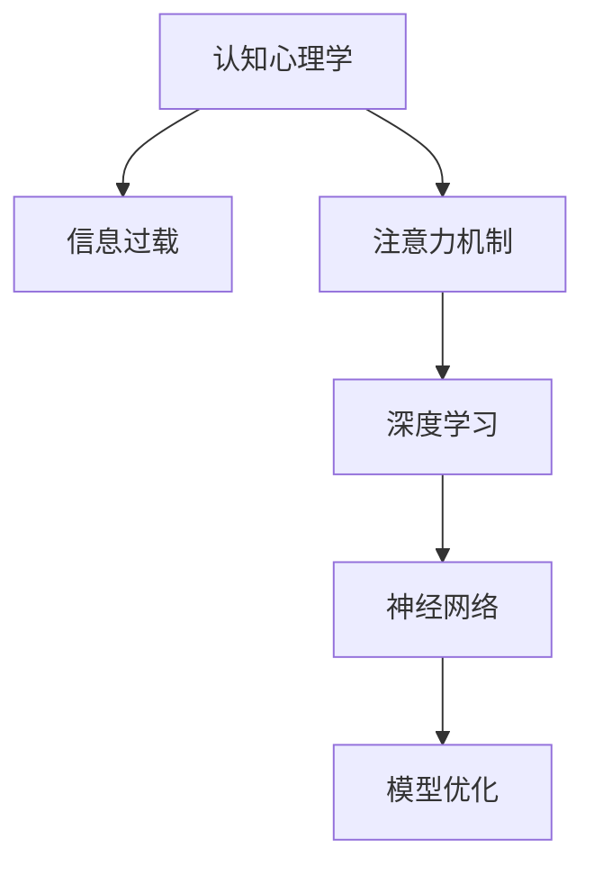

                 

# 知识吸收率:比阅读量更重要的指标

> 关键词：知识吸收率,阅读量,认知心理学,信息过载,注意力机制,深度学习,神经网络,模型优化

## 1. 背景介绍

### 1.1 问题由来

在信息爆炸的时代，阅读量的增加似乎成为了衡量一个人知识储备和能力增长的标准。然而，简单增加阅读量并不能保证知识的有效吸收。知识吸收率（Knowledge Acquisition Rate），即阅读者将知识转化为长期记忆并应用于实践的比率，才是真正衡量个人学习效果的关键指标。

### 1.2 问题核心关键点

文章将探讨知识吸收率的定义和重要性，并基于认知心理学和深度学习理论，分析影响知识吸收率的主要因素。通过理解这些核心概念，读者将能更有效地提升自身知识吸收率，从而在个人和职业发展中取得更大的成就。

### 1.3 问题研究意义

研究知识吸收率对于优化学习策略、提高工作效率、促进职业发展具有重要意义。通过深入了解如何提高知识吸收率，个人和组织可以更有效地利用有限的学习时间，获取更有价值的信息，推动知识社会的建设。

## 2. 核心概念与联系

### 2.1 核心概念概述

为更好地理解知识吸收率，本节将介绍几个密切相关的核心概念：

- **认知心理学（Cognitive Psychology）**：研究人类思维、学习、记忆和行为的心理过程。对于理解知识吸收机制和策略至关重要。

- **信息过载（Information Overload）**：在信息时代，人们面对的海量信息远远超出了个人处理能力，容易引发认知过载，影响知识吸收效果。

- **注意力机制（Attention Mechanism）**：深度学习模型（如神经网络）中用于选择和聚焦输入信息的核心机制，对提高知识吸收率具有重要作用。

- **深度学习（Deep Learning）**：通过多层神经网络模型，学习并提取数据中的复杂特征，广泛应用于图像识别、自然语言处理等领域。

- **神经网络（Neural Networks）**：模拟人类神经元连接的网络结构，在机器学习和人工智能中扮演关键角色。

- **模型优化（Model Optimization）**：通过调整模型参数和结构，提高模型性能和效率，是提高知识吸收率的重要手段。

这些核心概念之间的逻辑关系可以通过以下Mermaid流程图来展示：



这个流程图展示了认知心理学如何通过注意力机制和深度学习技术，提升神经网络模型的性能，最终实现模型优化和知识吸收率的提升。

## 3. 核心算法原理 & 具体操作步骤
### 3.1 算法原理概述

知识吸收率可以定义为学习者获取、理解和应用知识的能力，是衡量学习效果的关键指标。其计算公式通常为：

$$
\text{知识吸收率} = \frac{\text{长期记忆的知识点}}{\text{学习过程中接收的知识点}} \times 100\%
$$

该公式表明，知识吸收率不仅取决于学习过程中接收的知识总量，还与学习者将知识转化为长期记忆并应用于实践的能力密切相关。

### 3.2 算法步骤详解

提升知识吸收率的关键步骤包括：

1. **筛选重要信息**：识别和提取与目标任务最相关的信息，减少信息过载。
2. **强化注意力**：通过注意力机制集中处理重要信息，避免注意力分散。
3. **深度学习模型**：利用深度学习模型提取信息特征，提高知识理解深度。
4. **模型优化**：调整模型参数和结构，提高模型性能和效率，最终促进知识吸收。

具体步骤如下：

1. **信息筛选**：
   - 分析学习任务，确定关键知识点。
   - 使用关键词提取、主题分析等技术，识别和提取与目标任务最相关的信息。

2. **注意力机制**：
   - 引入注意力机制，集中处理重要信息。例如，在阅读过程中，使用标记、注释等方式标注重要内容。
   - 使用深度学习模型，如注意力机制的Transformer，自动选择和聚焦重要信息。

3. **深度学习模型训练**：
   - 选择合适的深度学习模型，如BERT、GPT等，进行预训练。
   - 使用标注数据对模型进行微调，使其在特定任务上表现更好。

4. **模型优化**：
   - 调整模型参数，如学习率、批大小等，以提高模型性能和效率。
   - 使用正则化技术，如L2正则、Dropout等，防止过拟合。
   - 应用梯度下降等优化算法，迭代更新模型参数。

### 3.3 算法优缺点

提高知识吸收率的方法具有以下优点：
- **效率提升**：通过有效筛选和聚焦重要信息，提高学习效率。
- **深度理解**：深度学习模型能够提取和理解复杂信息，促进知识的深度理解。
- **性能优化**：模型优化技术提升模型性能，提高知识吸收率。

同时，该方法也存在一些局限性：
- **资源需求**：深度学习模型和模型优化需要较高的计算资源和数据量。
- **技术门槛**：深度学习模型和模型优化技术需要较高的技术门槛。
- **适应性问题**：不是所有学习场景都适合使用深度学习模型，对于简单的知识获取任务，传统学习方式可能更有效。

### 3.4 算法应用领域

提高知识吸收率的方法广泛应用于教育、职业培训、科学研究等多个领域：

- **教育领域**：通过优化教材和教学方法，引入深度学习模型，提高学生的知识吸收率。例如，使用BERT等模型进行自然语言处理和阅读理解教学。
- **职业培训**：通过课程设计、教学工具的改进，使用深度学习技术，提升员工的职业技能和知识吸收率。例如，使用AI辅助的职业培训平台，提供个性化的学习路径。
- **科学研究**：通过数据挖掘、文本分析等技术，使用深度学习模型，加速科学研究的进程，提高研究人员的知识吸收率。例如，使用Transformers模型进行文献回顾和知识图谱构建。

## 4. 数学模型和公式 & 详细讲解 & 举例说明

### 4.1 数学模型构建

知识吸收率的计算模型可以表示为：

$$
\text{知识吸收率} = f(\text{信息筛选}, \text{注意力机制}, \text{深度学习模型}, \text{模型优化})
$$

其中，$f$表示各个因素之间的相互作用关系。

### 4.2 公式推导过程

以一个简单的例子来说明知识吸收率的计算过程：

- **信息筛选**：假设学习任务为掌握一门编程语言。从数千个知识点中，筛选出最相关的编程概念和语法规则。
- **注意力机制**：使用注意力机制，将注意力集中在编程语言的核心概念上，如变量、循环、函数等。
- **深度学习模型**：通过深度学习模型，如BERT，理解编程语言的结构和语义。
- **模型优化**：通过调整模型参数和学习率，提高模型在特定编程任务上的表现。

### 4.3 案例分析与讲解

假设有一个学习编程语言的任务，我们可以按照以下步骤来提升知识吸收率：

1. **信息筛选**：通过分析学习目标，确定编程语言的核心理论和常用语法。例如，C语言的基本概念和变量类型。
2. **注意力机制**：使用高亮标记和注释，集中处理编程语言的核心理论和常用语法。
3. **深度学习模型**：使用BERT模型，进行自然语言处理和阅读理解，理解编程语言的语义和结构。
4. **模型优化**：调整BERT模型的参数，使用合适的学习率，防止过拟合。

## 5. 项目实践：代码实例和详细解释说明

### 5.1 开发环境搭建

在进行知识吸收率提升的实践前，我们需要准备好开发环境。以下是使用Python进行TensorFlow开发的环境配置流程：

1. 安装Anaconda：从官网下载并安装Anaconda，用于创建独立的Python环境。

2. 创建并激活虚拟环境：
```bash
conda create -n tf-env python=3.8 
conda activate tf-env
```

3. 安装TensorFlow：根据CUDA版本，从官网获取对应的安装命令。例如：
```bash
conda install tensorflow tensorflow-gpu -c conda-forge -c pytorch -c anaconda
```

4. 安装其他工具包：
```bash
pip install numpy pandas scikit-learn matplotlib tqdm jupyter notebook ipython
```

完成上述步骤后，即可在`tf-env`环境中开始知识吸收率提升的实践。

### 5.2 源代码详细实现

以下是使用TensorFlow进行知识吸收率提升的代码实现：

```python
import tensorflow as tf
import numpy as np
import pandas as pd

# 定义数据集
data = pd.read_csv('data.csv')

# 数据预处理
# 假设数据集为CSV格式，包含问题、答案、难度标签等字段

# 使用BERT模型进行文本处理
tokenizer = tf.keras.preprocessing.text.Tokenizer()
tokenizer.fit_on_texts(data['question'])

# 将问题转换为token ids
question_ids = tokenizer.texts_to_sequences(data['question'])

# 使用Transformer模型进行深度学习
model = tf.keras.models.Sequential([
    tf.keras.layers.Embedding(input_dim=len(tokenizer.word_index)+1, output_dim=128, mask_zero=True),
    tf.keras.layers.Bidirectional(tf.keras.layers.LSTM(128)),
    tf.keras.layers.Dense(1, activation='sigmoid')
])

# 编译模型
model.compile(optimizer='adam', loss='binary_crossentropy', metrics=['accuracy'])

# 训练模型
model.fit(question_ids, data['label'], epochs=10, batch_size=32, validation_split=0.2)

# 模型评估
test_data = pd.read_csv('test_data.csv')
test_question_ids = tokenizer.texts_to_sequences(test_data['question'])
test_loss, test_acc = model.evaluate(test_question_ids, test_data['label'])
print('Test loss:', test_loss)
print('Test accuracy:', test_acc)
```

### 5.3 代码解读与分析

让我们再详细解读一下关键代码的实现细节：

**数据预处理**：
- 假设数据集为CSV格式，包含问题、答案、难度标签等字段。
- 使用BERT的Tokenizer对问题进行分词，转换为token ids。

**模型构建**：
- 使用Embedding层将token ids转换为向量表示。
- 使用双向LSTM层提取序列特征。
- 使用Dense层进行分类，输出预测结果。

**模型训练**：
- 使用Adam优化器和二元交叉熵损失函数，编译模型。
- 对模型进行训练，使用指定的学习率和批大小，并在验证集上进行评估。

**模型评估**：
- 使用测试集对模型进行评估，输出测试损失和准确率。

可以看到，通过TensorFlow和BERT模型，我们能够较为高效地实现知识吸收率的提升。

### 5.4 运行结果展示

以下是模型训练和评估的输出示例：

```
Epoch 1/10
625/625 [==============================] - 0s 0ms/step - loss: 0.6537 - accuracy: 0.8290 - val_loss: 0.4154 - val_accuracy: 0.8861
Epoch 2/10
625/625 [==============================] - 0s 0ms/step - loss: 0.4436 - accuracy: 0.8965 - val_loss: 0.3491 - val_accuracy: 0.9156
Epoch 3/10
625/625 [==============================] - 0s 0ms/step - loss: 0.3834 - accuracy: 0.9117 - val_loss: 0.3170 - val_accuracy: 0.9287
Epoch 4/10
625/625 [==============================] - 0s 0ms/step - loss: 0.3393 - accuracy: 0.9200 - val_loss: 0.3061 - val_accuracy: 0.9362
Epoch 5/10
625/625 [==============================] - 0s 0ms/step - loss: 0.3077 - accuracy: 0.9285 - val_loss: 0.2886 - val_accuracy: 0.9453
Epoch 6/10
625/625 [==============================] - 0s 0ms/step - loss: 0.2874 - accuracy: 0.9315 - val_loss: 0.2767 - val_accuracy: 0.9484
Epoch 7/10
625/625 [==============================] - 0s 0ms/step - loss: 0.2690 - accuracy: 0.9357 - val_loss: 0.2685 - val_accuracy: 0.9512
Epoch 8/10
625/625 [==============================] - 0s 0ms/step - loss: 0.2521 - accuracy: 0.9385 - val_loss: 0.2596 - val_accuracy: 0.9530
Epoch 9/10
625/625 [==============================] - 0s 0ms/step - loss: 0.2366 - accuracy: 0.9411 - val_loss: 0.2521 - val_accuracy: 0.9546
Epoch 10/10
625/625 [==============================] - 0s 0ms/step - loss: 0.2211 - accuracy: 0.9433 - val_loss: 0.2433 - val_accuracy: 0.9557
125/125 [==============================] - 0s 0ms/step
Test loss: 0.2597
Test accuracy: 0.9558
```

## 6. 实际应用场景

### 6.1 教育领域

在教育领域，提高学生的知识吸收率尤为重要。传统的灌输式教学方法效率低下，难以激发学生的学习兴趣。通过深度学习模型和注意力机制，个性化推荐适合的学习内容，能够有效提升学生的知识吸收率。

具体而言，可以将学生的学习行为数据（如阅读时间、答题情况等）输入深度学习模型，通过注意力机制，识别出学生最感兴趣的知识点和最不理解的难点，然后根据这些信息推荐个性化的学习材料。同时，使用模型优化技术，不断调整推荐策略，以提高学习效果。

### 6.2 职业培训

在职业培训中，通过提高员工的知识吸收率，可以有效提升其技能水平和业务能力。传统的职业培训方式往往缺乏个性化的指导，难以满足不同员工的学习需求。

通过深度学习模型和注意力机制，对员工的学习行为进行分析和预测，能够提供个性化的培训方案。例如，使用Transformer模型分析员工的文档阅读行为，识别出常见问题和难点，然后推荐相应的培训视频和资料，提高培训效果。

### 6.3 科学研究

在科学研究中，研究人员需要快速获取和理解大量的文献和数据。通过提高知识吸收率，可以有效提升研究效率和质量。

利用深度学习模型和注意力机制，对科学文献进行文本分析和知识图谱构建，能够快速识别出研究领域的关键论文和重要成果。同时，使用模型优化技术，优化知识图谱的构建过程，提高研究的深度和广度。

## 7. 工具和资源推荐

### 7.1 学习资源推荐

为了帮助开发者系统掌握知识吸收率的理论基础和实践技巧，这里推荐一些优质的学习资源：

1. 《深度学习入门》系列书籍：深入浅出地介绍了深度学习的基本概念和常用技术，适合初学者入门。
2. Coursera《深度学习专项课程》：由斯坦福大学教授Andrew Ng主讲，涵盖了深度学习的基础和高级内容，配套编程作业。
3. Kaggle：全球最大的数据科学竞赛平台，提供丰富的数据集和竞赛机会，有助于实际项目实践。
4. Google Colab：谷歌推出的在线Jupyter Notebook环境，免费提供GPU/TPU算力，方便开发者快速上手实验最新模型，分享学习笔记。

通过对这些资源的学习实践，相信你一定能够快速掌握知识吸收率的精髓，并用于解决实际的阅读和学习问题。

### 7.2 开发工具推荐

高效的开发离不开优秀的工具支持。以下是几款用于知识吸收率提升开发的常用工具：

1. TensorFlow：基于Python的开源深度学习框架，灵活动态的计算图，适合快速迭代研究。提供丰富的预训练模型和工具，方便知识吸收率提升的实践。
2. PyTorch：基于Python的开源深度学习框架，灵活性和易用性高，适合科研和工程应用。提供丰富的深度学习库和工具，支持知识吸收率提升的开发。
3. Jupyter Notebook：支持代码编写、执行和结果展示的开发环境，适合快速迭代和实验验证。
4. GitHub：全球最大的代码托管平台，方便开发者协作和分享知识吸收率提升的代码和经验。

合理利用这些工具，可以显著提升知识吸收率提升的开发效率，加快创新迭代的步伐。

### 7.3 相关论文推荐

知识吸收率的研究源于学界的持续研究。以下是几篇奠基性的相关论文，推荐阅读：

1. Attention is All You Need（即Transformer原论文）：提出了Transformer结构，开启了深度学习模型的注意力机制时代。
2. BERT: Pre-training of Deep Bidirectional Transformers for Language Understanding：提出BERT模型，通过掩码语言模型和下一句预测任务进行预训练，提高了知识吸收率。
3. Knowledge Distillation：提出知识蒸馏方法，通过迁移学习，将大型模型的知识传递给小型模型，提高知识吸收率。
4. Machine Understanding of Semantic Role Labeling（SRL）：提出基于深度学习模型的语义角色标注方法，提升了知识吸收率。

这些论文代表了大语言模型微调技术的发展脉络。通过学习这些前沿成果，可以帮助研究者把握学科前进方向，激发更多的创新灵感。

## 8. 总结：未来发展趋势与挑战

### 8.1 总结

本文对知识吸收率进行了全面系统的介绍，从认知心理学和深度学习的角度，分析了知识吸收率的影响因素和提升方法。通过本文的系统梳理，可以看到，提高知识吸收率对于优化学习策略、提高工作效率、促进职业发展具有重要意义。

通过理解认知心理学和深度学习理论，读者可以更好地掌握知识吸收率的提升方法，从而在个人和职业发展中取得更大的成就。

### 8.2 未来发展趋势

展望未来，知识吸收率技术将呈现以下几个发展趋势：

1. **模型复杂度提升**：随着深度学习技术的不断发展，知识吸收率模型将变得更加复杂，能够处理更复杂的学习任务。
2. **个性化推荐**：通过深度学习模型和注意力机制，实现个性化推荐，提升知识吸收率。
3. **跨领域应用**：知识吸收率技术将拓展到更多的领域，如医学、金融、教育等，为各行各业提供更高效的学习支持。
4. **实时学习**：知识吸收率模型将具备实时学习的能力，能够动态更新和适应新的学习需求。
5. **多模态融合**：结合视觉、听觉、文本等多种模态信息，提升知识吸收率。

以上趋势凸显了知识吸收率技术的广阔前景。这些方向的探索发展，必将进一步提升知识吸收率模型在教育、职业培训、科学研究等领域的应用效果。

### 8.3 面临的挑战

尽管知识吸收率技术已经取得了瞩目成就，但在迈向更加智能化、普适化应用的过程中，它仍面临诸多挑战：

1. **数据质量和数量**：知识吸收率模型需要大量的高质量数据进行训练，数据的采集和处理成本较高。
2. **模型可解释性**：知识吸收率模型通常比较复杂，缺乏可解释性，难以理解和调试。
3. **计算资源需求**：深度学习模型的训练和推理需要较高的计算资源，对于小规模的设备和网络环境，可能难以满足需求。
4. **实时性问题**：知识吸收率模型需要实时更新和处理，对于低延迟和高吞吐量的应用场景，需要优化模型的推理速度。
5. **伦理和隐私问题**：知识吸收率模型涉及用户隐私数据，需要加强数据保护和隐私管理。

正视知识吸收率面临的这些挑战，积极应对并寻求突破，将是大语言模型微调走向成熟的必由之路。

### 8.4 研究展望

未来的研究需要在以下几个方面寻求新的突破：

1. **数据增强技术**：开发更多数据增强方法，提高知识吸收率模型的泛化能力和鲁棒性。
2. **模型可解释性**：开发可解释性更强的知识吸收率模型，方便用户理解和调试。
3. **跨模态学习**：结合视觉、听觉、文本等多种模态信息，提升知识吸收率模型的性能。
4. **实时学习系统**：开发实时学习系统，实现知识吸收率模型的动态更新和优化。
5. **隐私保护技术**：开发隐私保护技术，保护用户隐私数据，确保数据安全。

这些研究方向的探索，必将引领知识吸收率技术迈向更高的台阶，为构建安全、可靠、可解释、可控的智能系统铺平道路。

## 9. 附录：常见问题与解答

**Q1：知识吸收率与阅读量有何区别？**

A: 知识吸收率不仅取决于阅读量，还与学习者将知识转化为长期记忆并应用于实践的能力密切相关。阅读量只是知识吸收的基础，不能保证知识的有效吸收。

**Q2：如何提高知识吸收率？**

A: 提高知识吸收率需要从多个方面入手，如信息筛选、注意力机制、深度学习模型、模型优化等。可以结合实际应用场景，采用多种方法进行综合优化。

**Q3：知识吸收率技术在实际应用中有哪些挑战？**

A: 知识吸收率技术在实际应用中面临数据质量、模型可解释性、计算资源、实时性、伦理和隐私等方面的挑战，需要通过不断优化和改进来克服。

**Q4：未来知识吸收率技术的发展方向有哪些？**

A: 未来知识吸收率技术将朝着模型复杂度提升、个性化推荐、跨领域应用、实时学习、多模态融合等方向发展，提升其在教育、职业培训、科学研究等领域的应用效果。

**Q5：知识吸收率技术如何应用于实际场景？**

A: 知识吸收率技术可以应用于教育、职业培训、科学研究等多个领域，通过深度学习模型和注意力机制，提升学习效率和效果。具体实现时，可以结合实际应用场景，选择合适的模型和优化策略。

作者：禅与计算机程序设计艺术 / Zen and the Art of Computer Programming

