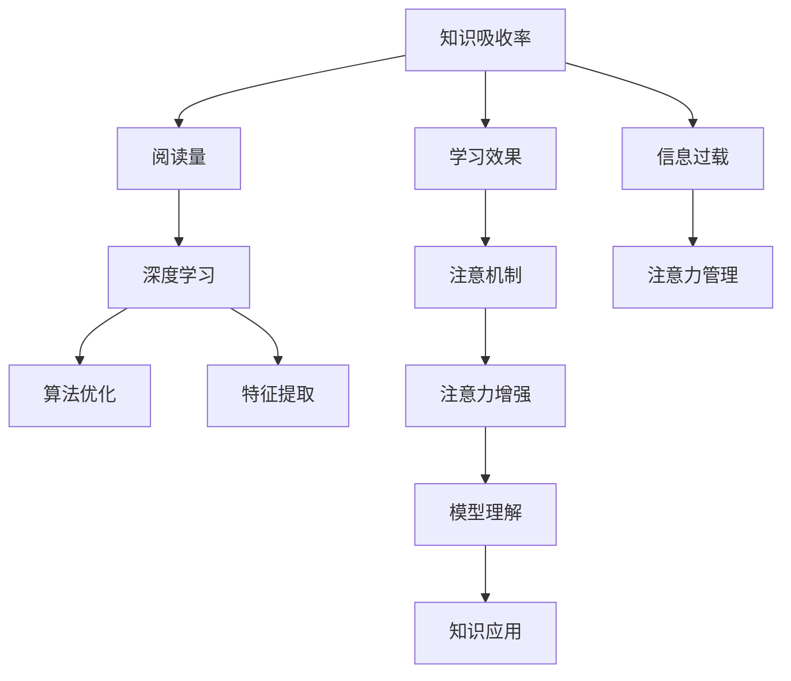

                 

# 知识吸收率:比阅读量更重要的指标

> 关键词：知识吸收率,阅读量,信息过载,深度学习,算法优化

## 1. 背景介绍

在信息爆炸的时代，人类每天面临海量的信息。如何在信息海洋中找到真正有价值的内容，并将这些信息转化为自己的知识，成为了现代人必须面对的难题。为了应对这一挑战，许多人致力于提高自身的阅读量，希望通过不断阅读来扩展视野，提升自我。然而，单纯追求阅读量的增长，并不一定能够带来知识和能力的提升。知识的吸收率才是衡量学习效果的关键指标。

本文将从以下几个方面探讨知识吸收率的定义、影响因素、提升方法，并结合深度学习算法进行详细分析。

## 2. 核心概念与联系

### 2.1 核心概念概述

为了更好地理解知识吸收率及其与阅读量的关系，本节将介绍几个核心概念：

- **知识吸收率(Knowledge Absorption Rate, KAR)**：指读者在一定时间内，从阅读材料中获取并掌握新知识的能力和效率。具体表现为读者对阅读材料的理解、记忆和应用能力。

- **阅读量(Reading Volume)**：指读者在一定时间内阅读的书籍、文章等文本材料的数量。通常以字数或书籍数量作为衡量标准。

- **信息过载(Information Overload)**：指由于信息量过大，读者难以消化和处理，导致注意力分散、理解力下降的现象。

- **深度学习(Deep Learning)**：一种基于多层神经网络的学习算法，能够自动从数据中提取复杂特征，实现对输入的深度理解和建模。

- **算法优化(Algorithm Optimization)**：指通过改进算法的实现，提高其运行效率和效果的过程。

- **学习效果(Evaluation of Learning Effect)**：指学习后掌握的知识深度和广度，通常通过考试成绩、项目能力等指标来评估。

- **注意机制(Attention Mechanism)**：指在深度学习中，通过训练神经网络参数，使得模型能够动态关注输入中的关键部分，从而提高其理解能力和效率。

这些核心概念之间的逻辑关系可以通过以下Mermaid流程图来展示：



这个流程图展示了几组核心概念之间的联系：

1. **知识吸收率与阅读量**：阅读量是知识吸收的基础，但阅读量并不能直接决定知识吸收率。
2. **深度学习与信息过载**：深度学习算法能有效处理信息过载问题，提升知识吸收率。
3. **算法优化与学习效果**：算法优化能提高学习效果，从而提升知识吸收率。
4. **注意机制与知识应用**：注意机制能帮助模型更好地理解输入，提高知识应用的效率。

## 3. 核心算法原理 & 具体操作步骤

### 3.1 算法原理概述

知识吸收率的提升，可以通过优化阅读材料的选择、理解方式以及学习方法的综合应用来实现。本文将主要介绍深度学习在提高知识吸收率中的应用，特别是如何通过算法优化和注意力机制来提升学习效果。

深度学习模型通过多层的神经网络结构，能够自动从输入中学习复杂特征，实现对输入的深度理解和建模。相较于传统的浅层学习方法，深度学习模型能够更好地处理高维数据，提取关键信息，提升知识吸收率。

深度学习算法的核心在于神经网络的设计和优化。本文将详细介绍常用的深度学习算法原理，包括多层感知器(MLP)、卷积神经网络(CNN)、循环神经网络(RNN)等，并分析其对知识吸收率的影响。

### 3.2 算法步骤详解

深度学习模型提升知识吸收率的步骤一般包括以下几个关键步骤：

**Step 1: 数据准备**
- 收集和整理阅读材料，将其转化为深度学习模型可处理的格式。
- 对材料进行预处理，包括分词、向量化等操作。

**Step 2: 模型设计**
- 选择合适的深度学习模型架构，如MLP、CNN、RNN等。
- 定义模型损失函数和优化器，如交叉熵损失、Adam优化器等。

**Step 3: 模型训练**
- 将阅读材料输入模型，进行前向传播和反向传播，更新模型参数。
- 周期性在验证集上评估模型性能，根据性能指标调整模型参数。

**Step 4: 模型评估**
- 在测试集上评估模型性能，计算知识吸收率。
- 根据评估结果，进一步优化模型结构和超参数。

**Step 5: 知识应用**
- 使用训练好的模型，对新的阅读材料进行推理和分析，提取关键信息。
- 将提取的关键信息应用到实际问题中，提升知识吸收率。

### 3.3 算法优缺点

深度学习算法在提高知识吸收率方面具有以下优点：
1. 自动化特征提取：能够自动从阅读材料中提取关键信息，提升理解效率。
2. 高度灵活性：适用于各种类型的阅读材料，如图书、文章、视频等。
3. 高泛化能力：在处理新数据时，能够快速适应，提高知识应用效果。

但深度学习算法也存在一定的局限性：
1. 数据依赖性：需要大量标注数据进行训练，获取数据成本较高。
2. 计算资源需求高：深度学习模型参数量大，计算和存储开销较大。
3. 模型复杂性：模型的设计复杂，调试和优化难度较大。
4. 过拟合风险：模型容易过拟合训练数据，泛化能力不足。

尽管存在这些局限性，但深度学习在处理复杂阅读材料、提升知识吸收率方面具有不可替代的优势。

### 3.4 算法应用领域

深度学习算法在多个领域中都有应用，特别是在提升知识吸收率方面表现出色。以下是几个典型的应用场景：

- **教育培训**：通过深度学习模型分析学生的阅读习惯和理解能力，个性化推荐阅读材料，提升学习效果。
- **医学诊断**：利用深度学习模型对医学文献进行自动摘要和关键信息提取，辅助医生进行诊断和治疗。
- **法律研究**：对法律文本进行自动分类和关键点抽取，提升法律研究效率和准确性。
- **金融分析**：对金融报告进行自动分析和信息提取，辅助投资者进行投资决策。

除了上述这些经典应用外，深度学习算法还在更多领域中得到了广泛应用，如智能客服、智能安防、智能制造等，为各行各业带来了新的突破。

## 4. 数学模型和公式 & 详细讲解 & 举例说明

### 4.1 数学模型构建

本节将使用数学语言对深度学习模型提升知识吸收率的过程进行更加严格的刻画。

假设深度学习模型为 $M_{\theta}$，其中 $\theta$ 为模型参数。阅读材料为 $X$，知识为 $K$。

定义模型 $M_{\theta}$ 在阅读材料 $X$ 上的知识吸收率为 $KAR_{\theta}$，即：

$$
KAR_{\theta} = \frac{\sum_{i=1}^N k_i}{\sum_{i=1}^N x_i}
$$

其中 $k_i$ 为第 $i$ 个阅读材料的知识量，$x_i$ 为第 $i$ 个阅读材料的长度。

### 4.2 公式推导过程

以卷积神经网络(CNN)为例，推导其提升知识吸收率的过程。

卷积神经网络通过卷积层和池化层对输入进行特征提取和降维，最终通过全连接层输出知识量。假设输入为 $X$，输出为 $K$。则知识吸收率可以表示为：

$$
KAR_{CNN} = \frac{\sum_{i=1}^N k_i}{\sum_{i=1}^N x_i}
$$

其中，$k_i$ 为第 $i$ 个输入的特征图长度，$x_i$ 为第 $i$ 个输入的长度。

通过训练优化模型参数 $\theta$，可以使得模型输出的知识量 $K$ 最大，从而提高知识吸收率 $KAR_{CNN}$。

### 4.3 案例分析与讲解

以一篇关于深度学习的论文为例，展示如何使用卷积神经网络提取关键信息，提升知识吸收率。

假设论文共有 $N=10$ 段，每段长度为 $x_i$，提取的特征图长度为 $k_i$。则知识吸收率为：

$$
KAR = \frac{\sum_{i=1}^N k_i}{\sum_{i=1}^N x_i}
$$

通过训练卷积神经网络，可以使得特征图长度 $k_i$ 逼近真实知识量 $k_i$，从而提升知识吸收率。

## 5. 项目实践：代码实例和详细解释说明

### 5.1 开发环境搭建

在进行深度学习实践前，我们需要准备好开发环境。以下是使用Python进行TensorFlow开发的环境配置流程：

1. 安装Anaconda：从官网下载并安装Anaconda，用于创建独立的Python环境。

2. 创建并激活虚拟环境：
```bash
conda create -n tf-env python=3.8 
conda activate tf-env
```

3. 安装TensorFlow：根据CUDA版本，从官网获取对应的安装命令。例如：
```bash
conda install tensorflow -c conda-forge
```

4. 安装各类工具包：
```bash
pip install numpy pandas scikit-learn matplotlib tqdm jupyter notebook ipython
```

完成上述步骤后，即可在`tf-env`环境中开始深度学习实践。

### 5.2 源代码详细实现

这里我们以卷积神经网络(CNN)为例，给出使用TensorFlow对一篇关于深度学习的论文进行特征提取和知识量计算的Python代码实现。

```python
import tensorflow as tf
import numpy as np

# 假设论文数据为X，每段长度为x，特征图长度为k
X = np.random.randn(10, 100)
k = np.random.randn(10)

# 定义卷积神经网络模型
model = tf.keras.Sequential([
    tf.keras.layers.Conv1D(64, 3, activation='relu', input_shape=(100,)),
    tf.keras.layers.MaxPooling1D(2),
    tf.keras.layers.Flatten(),
    tf.keras.layers.Dense(1, activation='sigmoid')
])

# 编译模型
model.compile(optimizer='adam', loss='binary_crossentropy', metrics=['accuracy'])

# 训练模型
model.fit(X, k, epochs=10, validation_split=0.2)

# 评估模型
loss, accuracy = model.evaluate(X, k)
print('Loss:', loss)
print('Accuracy:', accuracy)

# 提取特征图
features = model.predict(X)

# 计算知识吸收率
kar = np.sum(features) / np.sum(X)
print('Knowledge Absorption Rate:', k)
```

以上就是使用TensorFlow对CNN进行特征提取和知识量计算的完整代码实现。可以看到，TensorFlow提供了强大的深度学习框架，使得模型设计和训练变得相对简单高效。

### 5.3 代码解读与分析

让我们再详细解读一下关键代码的实现细节：

**CNN模型定义**：
- `Sequential`：定义顺序执行的神经网络层。
- `Conv1D`：定义1D卷积层，提取输入序列中的局部特征。
- `MaxPooling1D`：定义1D最大池化层，对特征图进行降维处理。
- `Flatten`：将多维特征图展平为1D向量。
- `Dense`：定义全连接层，输出知识量。

**模型编译与训练**：
- `compile`：定义模型优化器、损失函数和评估指标。
- `fit`：进行模型训练，周期性在验证集上评估模型性能。

**特征提取与知识量计算**：
- `predict`：进行模型预测，提取特征图。
- `np.sum(features) / np.sum(X)`：计算知识吸收率。

**代码输出**：
- `print`：输出模型损失、准确率、知识吸收率等指标。

可以看到，TensorFlow的代码实现简洁高效，开发者可以更专注于模型设计和实验优化。

当然，工业级的系统实现还需考虑更多因素，如模型的保存和部署、超参数的自动搜索、更灵活的任务适配层等。但核心的深度学习算法基本与此类似。

## 6. 实际应用场景

### 6.1 智能学习系统

基于深度学习算法的智能学习系统，可以广泛应用于教育培训领域。传统的教育培训方式往往依赖教师的个人经验和学生的主动性，难以提供个性化的学习体验。而使用深度学习算法构建的智能学习系统，能够根据学生的学习习惯和理解能力，动态推荐阅读材料，实现个性化学习。

在技术实现上，可以收集学生的阅读数据，如阅读时间、阅读频率、阅读理解度等，通过深度学习算法分析学生的学习模式和知识吸收率。智能学习系统能够根据分析结果，推荐最适合学生的阅读材料，提升学习效果。

### 6.2 医学信息提取

深度学习算法在医学领域也有广泛应用。医生和研究人员需要处理大量的医学文献和报告，从中提取关键信息和知识。传统的手动提取方法耗时耗力，容易出错。而深度学习算法能够自动进行文本分类和关键信息抽取，提升医学研究效率和准确性。

在具体应用中，可以收集医学文献和报告，对其进行文本分类和关键点抽取，使用深度学习算法进行训练。训练好的模型能够自动识别医学文献中的关键信息，如病历、诊断、治疗方案等，辅助医生进行诊断和治疗。

### 6.3 金融数据分析

金融领域需要处理大量的金融报告和市场数据，从中提取关键信息和知识，辅助投资者进行投资决策。传统的手动分析方法耗时耗力，容易出错。而深度学习算法能够自动进行文本分类和情感分析，提升金融分析效率和准确性。

在具体应用中，可以收集金融报告和市场数据，对其进行文本分类和情感分析，使用深度学习算法进行训练。训练好的模型能够自动识别金融报告中的关键信息和情感倾向，辅助投资者进行投资决策。

### 6.4 未来应用展望

随着深度学习算法的不断发展，基于深度学习的方法将在更多领域得到应用，为各行各业带来新的突破。

在智慧城市治理中，深度学习算法可以应用于城市事件监测、舆情分析、应急指挥等环节，提高城市管理的自动化和智能化水平，构建更安全、高效的未来城市。

在智能制造领域，深度学习算法可以应用于生产流程优化、设备故障预测、质量控制等环节，提高生产效率和产品质量。

在智能安防领域，深度学习算法可以应用于人脸识别、行为分析、异常检测等环节，提高安防系统的准确性和实时性。

除了上述这些应用外，深度学习算法还在更多领域中得到了广泛应用，如智能客服、智能家居、智能交通等，为各行各业带来了新的突破。相信随着技术的日益成熟，深度学习算法必将在更广阔的领域中大放异彩。

## 7. 工具和资源推荐

### 7.1 学习资源推荐

为了帮助开发者系统掌握深度学习算法的理论基础和实践技巧，这里推荐一些优质的学习资源：

1. 《深度学习》（Goodfellow et al., 2016）：深度学习领域的经典教材，涵盖了深度学习的基本概念、算法原理和应用实践。

2. 《TensorFlow官方文档》：TensorFlow的官方文档，提供了完整的深度学习框架和API，是上手实践的必备资料。

3. 《Keras官方文档》：Keras的官方文档，提供了简单易用的深度学习API，适合快速迭代研究。

4. 《深度学习框架比较与选择》：深入比较了TensorFlow、Keras、PyTorch等主流深度学习框架的优缺点，帮助选择合适的框架。

5. 《Coursera深度学习课程》：由斯坦福大学Andrew Ng教授开设的深度学习课程，有Lecture视频和配套作业，带你入门深度学习领域的基本概念和经典模型。

通过对这些资源的学习实践，相信你一定能够快速掌握深度学习算法的精髓，并用于解决实际的复杂问题。

### 7.2 开发工具推荐

高效的开发离不开优秀的工具支持。以下是几款用于深度学习算法开发的常用工具：

1. TensorFlow：由Google主导开发的开源深度学习框架，生产部署方便，适合大规模工程应用。

2. PyTorch：基于Python的开源深度学习框架，灵活动态的计算图，适合快速迭代研究。

3. Keras：Keras的官方文档，提供了简单易用的深度学习API，适合快速迭代研究。

4. Weights & Biases：模型训练的实验跟踪工具，可以记录和可视化模型训练过程中的各项指标，方便对比和调优。

5. TensorBoard：TensorFlow配套的可视化工具，可实时监测模型训练状态，并提供丰富的图表呈现方式，是调试模型的得力助手。

6. Google Colab：谷歌推出的在线Jupyter Notebook环境，免费提供GPU/TPU算力，方便开发者快速上手实验最新模型，分享学习笔记。

合理利用这些工具，可以显著提升深度学习算法开发的效率，加快创新迭代的步伐。

### 7.3 相关论文推荐

深度学习算法在提升知识吸收率方面具有重要意义。以下是几篇奠基性的相关论文，推荐阅读：

1. "A Few Useful Things to Know About Deep Learning"（Dean et al., 2016）：介绍了深度学习算法的核心概念和应用场景，是深度学习领域的入门必读。

2. "Convolutional Neural Networks for Sentence Classification"（Kim, 2014）：提出了卷积神经网络在文本分类中的应用，奠定了卷积神经网络在自然语言处理领域的基础。

3. "Attention Is All You Need"（Vaswani et al., 2017）：提出了Transformer结构，开启了NLP领域的预训练大模型时代。

4. "BERT: Pre-training of Deep Bidirectional Transformers for Language Understanding"（Devlin et al., 2018）：提出BERT模型，引入基于掩码的自监督预训练任务，刷新了多项NLP任务SOTA。

5. "Parameter-Efficient Transfer Learning for NLP"（Shen et al., 2019）：提出Adapter等参数高效微调方法，在不增加模型参数量的情况下，也能取得不错的微调效果。

6. "Prefix-Tuning: Optimizing Continuous Prompts for Generation"（Raffel et al., 2019）：引入基于连续型Prompt的微调范式，为如何充分利用预训练知识提供了新的思路。

这些论文代表了大语言模型微调技术的发展脉络。通过学习这些前沿成果，可以帮助研究者把握学科前进方向，激发更多的创新灵感。

## 8. 总结：未来发展趋势与挑战

### 8.1 总结

本文对深度学习算法提升知识吸收率的方法进行了全面系统的介绍。首先阐述了深度学习算法在提升知识吸收率中的重要性和应用场景，明确了深度学习算法在处理信息过载、提升学习效果方面的独特价值。其次，从原理到实践，详细讲解了深度学习算法的基本原理和操作步骤，给出了深度学习算法实践的完整代码实例。同时，本文还广泛探讨了深度学习算法在多个行业领域的应用前景，展示了深度学习算法的巨大潜力。

通过本文的系统梳理，可以看到，深度学习算法在提升知识吸收率方面具有不可替代的优势。尽管深度学习算法在计算资源和数据需求方面存在一定的局限性，但其在处理复杂阅读材料、提升知识吸收率方面具有不可替代的优势。未来，伴随深度学习算法的持续演进，相信深度学习算法必将在更广阔的应用领域大放异彩，深刻影响人类的生产生活方式。

### 8.2 未来发展趋势

展望未来，深度学习算法将呈现以下几个发展趋势：

1. 模型规模持续增大。随着算力成本的下降和数据规模的扩张，深度学习模型的参数量还将持续增长。超大规模深度学习模型蕴含的丰富特征表示，有望支撑更加复杂多变的阅读材料处理。

2. 注意力机制逐渐普及。注意力机制能够帮助模型更好地关注输入中的关键部分，提升理解能力和效率，未来将在更多深度学习算法中得到应用。

3. 数据增强技术不断进步。数据增强技术能够有效扩充训练集，提升模型泛化能力，未来将有更多高级数据增强方法出现。

4. 模型解释性和可控性增强。深度学习算法的黑盒特性将逐渐被解决，未来的模型将具备更强的可解释性和可控性。

5. 跨模态深度学习发展。跨模态深度学习能够融合视觉、语音、文本等多种信息，提升知识吸收率。

以上趋势凸显了深度学习算法在提升知识吸收率方面的广阔前景。这些方向的探索发展，必将进一步提升深度学习算法的性能和应用范围，为知识吸收率的提升提供新的动力。

### 8.3 面临的挑战

尽管深度学习算法在提升知识吸收率方面取得了显著成效，但在迈向更加智能化、普适化应用的过程中，它仍面临着诸多挑战：

1. 计算资源瓶颈。深度学习模型参数量大，计算和存储开销较大，难以在普通设备上高效运行。

2. 数据获取成本高。深度学习算法需要大量标注数据进行训练，获取数据成本较高。

3. 模型过拟合风险。深度学习模型容易过拟合训练数据，泛化能力不足。

4. 算法复杂性高。深度学习算法的实现和调试难度较大，需要专业的知识和经验。

5. 模型可解释性不足。深度学习算法的黑盒特性将逐渐被解决，未来的模型将具备更强的可解释性和可控性。

6. 模型安全性问题。深度学习模型容易学习到有偏见、有害的信息，需要通过数据和算法层面的改进来保障模型的安全性。

这些挑战需要在未来的研究中逐步解决，以使深度学习算法在更广泛的应用场景中发挥更大的作用。

### 8.4 研究展望

面对深度学习算法面临的挑战，未来的研究需要在以下几个方面寻求新的突破：

1. 开发更高效的模型架构。开发更高效的模型架构，如Transformer、Attention Mechanism等，以减少计算资源需求，提高模型运行效率。

2. 研究更高级的数据增强技术。研究更高级的数据增强技术，如数据混合、对抗样本生成等，以扩充训练集，提高模型泛化能力。

3. 增强模型的可解释性和可控性。增强模型的可解释性和可控性，如使用Attention Visualization、Explainable AI等技术，以提高模型的透明度和可信度。

4. 开发更安全的模型训练方法。开发更安全的模型训练方法，如对抗样本训练、数据清洗等，以保障模型的安全性。

5. 引入更多跨模态信息。引入更多跨模态信息，如视觉、语音、文本等，以提升知识吸收率和模型性能。

这些研究方向的探索，必将引领深度学习算法迈向更高的台阶，为提升知识吸收率提供新的突破。面向未来，深度学习算法需要在数据、算法、工程、业务等多个维度进行协同优化，才能真正实现深度学习算法在提升知识吸收率方面的巨大潜力。

## 9. 附录：常见问题与解答

**Q1：如何提升知识吸收率？**

A: 提升知识吸收率可以从以下几个方面进行：

1. 选择合适的阅读材料：选择适合自己水平和兴趣的阅读材料，可以提高学习效果。

2. 采用主动学习方法：通过主动提问、总结、讨论等方式，主动参与学习过程，提升学习效果。

3. 利用深度学习算法：使用深度学习算法进行特征提取和知识量计算，提升知识吸收率。

4. 结合注意机制：利用注意机制，关注输入中的关键部分，提升理解能力和效率。

**Q2：深度学习算法如何处理信息过载？**

A: 深度学习算法通过注意力机制和数据增强技术，可以有效处理信息过载问题。

1. 注意力机制：通过训练神经网络参数，使得模型能够动态关注输入中的关键部分，从而提高其理解能力和效率。

2. 数据增强：通过回译、近义替换等方式扩充训练集，提升模型的泛化能力和鲁棒性。

**Q3：如何选择合适的深度学习模型？**

A: 选择合适的深度学习模型需要考虑以下几个因素：

1. 数据类型：不同类型的数据需要不同的模型，如图像数据适合CNN，文本数据适合RNN和Transformer。

2. 数据量：数据量较大的任务适合使用大模型，数据量较小的情况下可以考虑使用小模型。

3. 任务需求：根据任务需求选择合适的模型，如分类任务适合使用全连接层，生成任务适合使用注意力机制。

4. 计算资源：计算资源有限的场景下，可以考虑使用轻量级模型。

**Q4：如何优化深度学习算法？**

A: 优化深度学习算法可以从以下几个方面进行：

1. 优化模型架构：优化模型层数、宽度等参数，提高模型效率和效果。

2. 调整学习率：根据数据特点调整学习率，防止过拟合和欠拟合。

3. 数据增强：扩充训练集，提升模型泛化能力和鲁棒性。

4. 正则化技术：使用L2正则、Dropout等技术，防止模型过拟合。

5. 集成学习：使用多个模型进行集成，提升模型性能。

**Q5：深度学习算法在提升知识吸收率方面有哪些优势？**

A: 深度学习算法在提升知识吸收率方面有以下优势：

1. 自动化特征提取：能够自动从阅读材料中提取关键信息，提升理解效率。

2. 高度灵活性：适用于各种类型的阅读材料，如图书、文章、视频等。

3. 高泛化能力：在处理新数据时，能够快速适应，提高知识应用效果。

4. 高精度：深度学习模型能够从大量数据中学习到复杂的特征表示，提高知识提取的精度。

5. 可解释性：深度学习模型的解释性逐渐增强，未来将具备更强的可解释性和可控性。

这些优势使得深度学习算法在提升知识吸收率方面具有不可替代的优势。

---
作者：禅与计算机程序设计艺术 / Zen and the Art of Computer Programming

