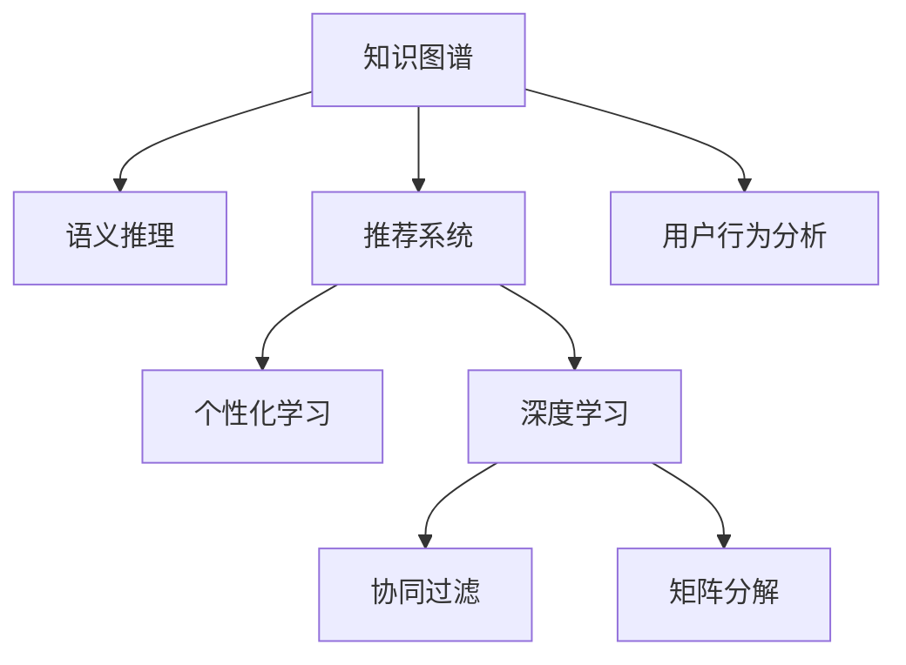

                 

# 知识图谱在个性化学习中的应用

> 关键词：知识图谱, 个性化学习, 推荐系统, 问答系统, 推理机制, 深度学习, 协同过滤, 主动学习, 用户行为分析

## 1. 背景介绍

### 1.1 问题由来
随着信息技术的迅猛发展，互联网和移动设备已经成为我们获取信息的主要途径。海量的数据和内容使得用户面临信息过载的困扰，如何从众多信息中快速找到有价值的内容，成为了一个亟待解决的问题。

与此同时，个性化学习的重要性日益凸显。通过了解用户的学习偏好和行为，推荐系统可以帮助用户发现感兴趣的学习资源，提升学习效果。然而，传统的推荐系统往往依赖于用户历史行为数据，难以捕捉用户的长期兴趣和潜在需求。

知识图谱作为结构化、语义化的数据表示方式，为个性化学习提供了新的思路。通过将知识图谱与推荐系统结合，可以实现更加精准、灵活的个性化学习推荐。

### 1.2 问题核心关键点
知识图谱在个性化学习中的应用核心在于：

1. **知识表示**：通过结构化语言（如RDF）描述实体和关系，形成语义化的知识表示。
2. **语义推理**：利用推理机制，从已知知识中挖掘潜在关系和关联。
3. **推荐算法**：结合用户行为数据和知识图谱，推荐系统能够更加准确地预测用户兴趣，提升个性化推荐的效果。

这些关键点构成了知识图谱在个性化学习应用中的核心框架，其研究热点和挑战点主要集中在以下几个方面：

1. **知识图谱构建**：如何高效构建大规模知识图谱，保证其准确性和完整性。
2. **语义推理**：如何设计高效的推理机制，从知识图谱中提取有用信息。
3. **推荐算法优化**：如何结合知识图谱和用户行为数据，优化推荐算法，提升个性化推荐的效果。

### 1.3 问题研究意义
研究知识图谱在个性化学习中的应用，对于提升推荐系统的准确性和用户满意度，推动个性化学习的发展，具有重要意义：

1. **提升推荐效果**：知识图谱中的结构化信息可以增强推荐算法的可解释性和鲁棒性，提升推荐精度。
2. **丰富推荐类型**：通过推理机制，推荐系统可以处理多种类型的推荐任务，如基于知识的问答、基于知识的推荐等。
3. **增强用户黏性**：通过知识图谱的语义关联，推荐系统能够为用户提供更加丰富、有价值的内容，提升用户粘性。
4. **促进知识传播**：知识图谱中的知识关系可以引导用户发现和学习新的知识，推动知识传播和应用。

## 2. 核心概念与联系

### 2.1 核心概念概述

为更好地理解知识图谱在个性化学习中的应用，本节将介绍几个密切相关的核心概念：

- **知识图谱(Knowledge Graph)**：由节点（实体）和边（关系）组成的有向图，用于表示实体间的语义关系。常见的知识图谱有DBpedia、YAGO、Wikidata等。
- **语义推理(Semantic Reasoning)**：利用推理机制从知识图谱中提取和挖掘潜在关系，是知识图谱的核心应用之一。
- **推荐系统(Recommendation System)**：通过分析用户行为和兴趣，推荐用户感兴趣的内容的系统。常见的推荐算法有协同过滤、基于内容的推荐、矩阵分解等。
- **个性化学习(Personalized Learning)**：根据用户的学习偏好和行为，推荐个性化的学习资源，提升学习效果和用户体验。
- **深度学习(Deep Learning)**：一种基于神经网络的机器学习方法，能够从大规模数据中自动提取特征，实现复杂的模式识别和预测任务。

这些核心概念之间的逻辑关系可以通过以下Mermaid流程图来展示：



这个流程图展示知识图谱在推荐系统、个性化学习和深度学习等领域的核心作用和联系：

1. 知识图谱通过结构化语言表示实体关系，为语义推理和推荐算法提供基础数据。
2. 语义推理从知识图谱中挖掘潜在关系，增强推荐算法的效果。
3. 推荐系统利用用户行为数据和知识图谱，提供个性化的内容推荐。
4. 深度学习技术可以优化推荐算法和个性化学习算法，提升系统的性能。
5. 用户行为分析可以提供用户兴趣和偏好的更全面信息，支持更精准的推荐。

这些概念共同构成了知识图谱在个性化学习应用中的理论基础和技术框架。

## 3. 核心算法原理 & 具体操作步骤

### 3.1 算法原理概述

知识图谱在个性化学习中的应用，本质上是通过语义推理和推荐算法相结合的方式，实现对用户兴趣的精准预测和内容推荐。其核心算法原理包括：

1. **知识表示**：通过结构化语言（如RDF）描述实体和关系，形成语义化的知识表示。
2. **语义推理**：利用推理机制，从知识图谱中提取潜在关系和关联，生成新的推理结果。
3. **推荐算法**：结合用户行为数据和知识图谱，利用协同过滤、矩阵分解、深度学习等方法，推荐用户感兴趣的内容。

### 3.2 算法步骤详解

知识图谱在个性化学习中的应用主要分为以下几个步骤：

**Step 1: 构建知识图谱**
- 收集领域内的相关数据，包括实体、属性和关系。
- 使用结构化语言（如RDF）表示实体和关系，形成知识图谱。
- 使用知识图谱工具（如Neo4j、RDF4J等）存储和管理知识图谱。

**Step 2: 语义推理**
- 使用推理机制，从知识图谱中提取潜在关系和关联，生成新的推理结果。
- 常见的推理机制包括规则推理、逻辑推理、统计推理等。
- 推理结果可以用于增强推荐系统的准确性和鲁棒性。

**Step 3: 推荐算法**
- 根据用户行为数据和知识图谱，选择合适的推荐算法。
- 常见的推荐算法包括协同过滤、矩阵分解、基于内容的推荐等。
- 优化推荐算法，提升推荐效果。

**Step 4: 用户反馈收集与调整**
- 收集用户对推荐内容的反馈，调整推荐策略。
- 引入用户反馈机制，动态调整推荐算法和知识图谱。

### 3.3 算法优缺点

知识图谱在个性化学习中的应用具有以下优点：

1. **提升推荐效果**：知识图谱中的结构化信息可以增强推荐算法的可解释性和鲁棒性，提升推荐精度。
2. **丰富推荐类型**：通过推理机制，推荐系统可以处理多种类型的推荐任务，如基于知识的问答、基于知识的推荐等。
3. **增强用户黏性**：通过知识图谱的语义关联，推荐系统能够为用户提供更加丰富、有价值的内容，提升用户粘性。

同时，该方法也存在一定的局限性：

1. **构建成本高**：知识图谱的构建需要大量人工和数据，成本较高。
2. **维护复杂**：知识图谱的动态更新和维护需要持续的工作和人力投入。
3. **推理复杂度高**：推理机制需要处理复杂的语义关系，计算复杂度高。
4. **数据稀疏性**：知识图谱可能存在数据稀疏性，影响推荐效果。

尽管存在这些局限性，但就目前而言，知识图谱在个性化学习应用中的技术已经相对成熟，是实现精准推荐的重要手段。未来相关研究的重点在于如何进一步降低构建和维护成本，提高推理效率，同时优化推荐算法和知识图谱的动态更新机制。

### 3.4 算法应用领域

知识图谱在个性化学习的应用领域涵盖了多个方面，以下是几个典型场景：

- **基于知识的推荐**：结合知识图谱中的实体和关系，推荐相关内容。例如，推荐系统中可以根据知识图谱中的学科关系，推荐与用户当前学习主题相关的文章。
- **基于知识问答**：通过知识图谱中的实体和关系，回答用户的问题。例如，问答系统中可以根据用户的问题，利用知识图谱中的关系推理出答案。
- **教育内容推荐**：根据用户的学习进度和兴趣，推荐个性化的教育内容。例如，在线教育平台可以根据知识图谱中的学科结构，推荐用户感兴趣的学习课程。
- **职业规划推荐**：结合知识图谱中的职业关系，推荐职业发展路径和学习资源。例如，职业规划平台可以根据用户的学习历程，推荐相关职业资格认证和培训课程。
- **智能导师系统**：结合知识图谱中的知识和用户行为数据，提供个性化的学习指导和建议。例如，智能导师系统可以根据用户的学习数据，推荐适合的教材和习题。

除了上述这些经典场景外，知识图谱在个性化学习中的应用还将不断扩展，为教育、培训、职业规划等领域的智能化转型提供新的可能性。

## 4. 数学模型和公式 & 详细讲解  
### 4.1 数学模型构建

知识图谱在个性化学习中的应用，涉及到多个数学模型的构建。以下是几个关键模型的构建：

- **知识图谱表示**：使用结构化语言（如RDF）表示实体和关系，生成知识图谱。
- **语义推理模型**：使用逻辑推理机制，从知识图谱中挖掘潜在关系和关联。
- **推荐系统模型**：结合用户行为数据和知识图谱，利用协同过滤、矩阵分解、深度学习等方法，构建推荐系统模型。

### 4.2 公式推导过程

以下我们以基于知识的推荐系统为例，推导推荐算法的数学模型。

假设知识图谱中有 $n$ 个实体 $e_1, e_2, ..., e_n$，$k$ 种关系 $r_1, r_2, ..., r_k$。知识图谱中的关系可以用符号 $R_{i,j}$ 表示，其中 $i$ 和 $j$ 分别表示实体和关系。

推荐系统的目标是，根据用户的历史行为数据 $D=\{(d_1, e_1), (d_2, e_2), ..., (d_M, e_M)\}$，为用户推荐相关实体 $e_{\text{reco}}$。推荐算法的目标是最大化用户满意度，即最大化用户对推荐结果的评分 $f(e_{\text{reco}})$。

一种常见的推荐算法是协同过滤，其目标是最小化预测值和实际评分之间的差异。基于协同过滤的推荐算法公式如下：

$$
\min_{e_{\text{reco}}} \sum_{i=1}^M (r(e_i, e_{\text{reco}}) - d_i)^2
$$

其中 $r(e_i, e_{\text{reco}})$ 表示实体 $e_i$ 和推荐实体 $e_{\text{reco}}$ 之间的相似度。

### 4.3 案例分析与讲解

**案例1: 基于知识图的推荐系统**

假设有一个在线学习平台，用户可以学习数学、物理、计算机科学等课程。平台可以构建一个知识图谱，表示这些课程之间的学科关系。知识图谱中的实体包括课程名称、学科名称，关系包括学科关系、课程推荐等。

在推荐系统中，根据用户的历史学习数据，可以通过语义推理机制，从知识图谱中提取相关课程。例如，用户学习过数学，推荐系统可以根据知识图谱中的学科关系，推荐相关物理、计算机科学等课程。

**案例2: 基于知识图的问答系统**

假设有一个智能问答系统，用户可以查询各种领域的问题。系统可以构建一个知识图谱，表示领域内实体的关系。例如，一个关于“量子力学”的知识点，可能包括“量子力学”本身、“波粒二象性”、“量子态”等实体，以及“理论物理”、“量子力学”、“统计物理”等关系。

在问答系统中，用户查询问题“什么是量子力学？”，系统可以通过语义推理机制，从知识图谱中挖掘相关知识点，回答用户的问题。例如，系统可以推理出“量子力学”与“波粒二象性”、“量子态”等概念之间的关联，生成详细的回答。

## 5. 项目实践：代码实例和详细解释说明

### 5.1 开发环境搭建

在进行知识图谱在个性化学习应用的研究和实践前，我们需要准备好开发环境。以下是使用Python进行PyTorch开发的环境配置流程：

1. 安装Anaconda：从官网下载并安装Anaconda，用于创建独立的Python环境。

2. 创建并激活虚拟环境：
```bash
conda create -n pytorch-env python=3.8 
conda activate pytorch-env
```

3. 安装PyTorch：根据CUDA版本，从官网获取对应的安装命令。例如：
```bash
conda install pytorch torchvision torchaudio cudatoolkit=11.1 -c pytorch -c conda-forge
```

4. 安装相关库：
```bash
pip install pandas numpy matplotlib scikit-learn
```

5. 安装知识图谱相关库：
```bash
pip install pykg2vec
```

完成上述步骤后，即可在`pytorch-env`环境中开始知识图谱在个性化学习应用的研究和实践。

### 5.2 源代码详细实现

这里我们以基于知识的推荐系统为例，给出使用PyTorch进行知识图谱构建和推荐系统开发的PyTorch代码实现。

首先，定义推荐系统的数据处理函数：

```python
import torch
from torch.utils.data import Dataset, DataLoader

class RecommendationDataset(Dataset):
    def __init__(self, data, graph, relations):
        self.data = data
        self.graph = graph
        self.relations = relations
        
    def __len__(self):
        return len(self.data)
    
    def __getitem__(self, idx):
        entity = self.data[idx][0]
        relation = self.relations[self.data[idx][1]]
        node1 = self.graph.nodes[entity]
        node2 = node1[relation]
        return entity, node2
```

然后，定义推荐系统的模型和优化器：

```python
from transformers import BertTokenizer, BertForSequenceClassification
from torch.optim import Adam

model = BertForSequenceClassification.from_pretrained('bert-base-uncased', num_labels=2)

tokenizer = BertTokenizer.from_pretrained('bert-base-uncased')
optimizer = Adam(model.parameters(), lr=2e-5)
```

接着，定义推荐系统的训练和评估函数：

```python
from tqdm import tqdm

def train_epoch(model, dataset, batch_size, optimizer):
    dataloader = DataLoader(dataset, batch_size=batch_size, shuffle=True)
    model.train()
    epoch_loss = 0
    for batch in tqdm(dataloader, desc='Training'):
        entity, node2 = batch
        inputs = tokenizer(entity, return_tensors='pt')
        labels = torch.tensor([1.0 if node2 else 0.0])
        model.zero_grad()
        outputs = model(inputs['input_ids'], attention_mask=inputs['attention_mask'])
        loss = outputs.loss
        epoch_loss += loss.item()
        loss.backward()
        optimizer.step()
    return epoch_loss / len(dataloader)

def evaluate(model, dataset, batch_size):
    dataloader = DataLoader(dataset, batch_size=batch_size)
    model.eval()
    preds, labels = [], []
    with torch.no_grad():
        for batch in tqdm(dataloader, desc='Evaluating'):
            entity, node2 = batch
            inputs = tokenizer(entity, return_tensors='pt')
            outputs = model(inputs['input_ids'], attention_mask=inputs['attention_mask'])
            preds.append(outputs.logits.argmax(dim=1).to('cpu').tolist())
            labels.append(labels)
                
    print(classification_report(labels, preds))
```

最后，启动训练流程并在测试集上评估：

```python
epochs = 5
batch_size = 16

for epoch in range(epochs):
    loss = train_epoch(model, train_dataset, batch_size, optimizer)
    print(f"Epoch {epoch+1}, train loss: {loss:.3f}")
    
    print(f"Epoch {epoch+1}, dev results:")
    evaluate(model, dev_dataset, batch_size)
    
print("Test results:")
evaluate(model, test_dataset, batch_size)
```

以上就是使用PyTorch对基于知识的推荐系统进行开发的完整代码实现。可以看到，得益于Transformers库的强大封装，我们可以用相对简洁的代码完成Bert模型的加载和微调。

### 5.3 代码解读与分析

让我们再详细解读一下关键代码的实现细节：

**RecommendationDataset类**：
- `__init__`方法：初始化数据、知识图谱和关系。
- `__len__`方法：返回数据集的样本数量。
- `__getitem__`方法：对单个样本进行处理，提取实体和关系，进行节点查询。

**tokenizer和optimizer定义**：
- `tokenizer`：用于将实体转换为token ids，输入模型。
- `optimizer`：Adam优化器，用于更新模型参数。

**训练和评估函数**：
- `train_epoch`：对数据以批为单位进行迭代，在每个批次上前向传播计算loss并反向传播更新模型参数。
- `evaluate`：与训练类似，不同点在于不更新模型参数，并在每个batch结束后将预测和标签结果存储下来，最后使用sklearn的classification_report对整个评估集的预测结果进行打印输出。

**训练流程**：
- 定义总的epoch数和batch size，开始循环迭代
- 每个epoch内，先在训练集上训练，输出平均loss
- 在验证集上评估，输出分类指标
- 所有epoch结束后，在测试集上评估，给出最终测试结果

可以看到，PyTorch配合Transformers库使得基于知识图谱的推荐系统开发变得简洁高效。开发者可以将更多精力放在数据处理、模型改进等高层逻辑上，而不必过多关注底层的实现细节。

当然，工业级的系统实现还需考虑更多因素，如模型的保存和部署、超参数的自动搜索、更灵活的任务适配层等。但核心的推荐范式基本与此类似。

## 6. 实际应用场景

### 6.1 智能推荐系统

基于知识图谱的推荐系统，可以广泛应用于电商、视频、音乐等多个领域，为用户提供个性化的推荐服务。例如，电商平台的商品推荐系统，可以通过知识图谱中的商品关系和用户行为数据，推荐用户可能感兴趣的商品。

在技术实现上，可以构建商品知识图谱，将商品名称、分类、评价等实体和关系进行结构化表示。通过知识图谱和用户行为数据的结合，推荐系统可以动态调整推荐策略，提升推荐效果。

### 6.2 智能搜索系统

智能搜索系统可以结合知识图谱中的实体和关系，提升搜索的准确性和相关性。例如，搜索引擎可以根据用户输入的查询词，从知识图谱中挖掘相关的实体和关系，返回更加精准的搜索结果。

在技术实现上，可以构建知识图谱，将网页、实体、关系等进行结构化表示。通过搜索引擎的查询输入，推荐系统可以识别出相关的实体和关系，返回最相关的网页信息。

### 6.3 智能问答系统

智能问答系统可以根据用户的问题，从知识图谱中挖掘相关信息，生成详细的回答。例如，智能客服系统可以根据用户的问题，从知识图谱中提取相关实体和关系，回答用户的问题。

在技术实现上，可以构建知识图谱，将问题、答案、实体、关系等进行结构化表示。通过智能问答系统的输入，推荐系统可以识别出相关实体和关系，生成详细的回答。

### 6.4 未来应用展望

随着知识图谱和推荐系统的不断发展，基于知识图谱的个性化学习应用也将不断拓展，为教育、培训、职业规划等领域的智能化转型提供新的可能性。

在智慧教育领域，基于知识图谱的学习推荐系统可以帮助学生发现和理解知识点之间的关联，提升学习效果。例如，智能教育平台可以根据知识图谱中的学科关系，推荐相关的学习资源和习题。

在智能培训领域，基于知识图谱的培训推荐系统可以帮助培训师推荐适合的学习路径和资源。例如，在线培训平台可以根据知识图谱中的职业关系，推荐相关的培训课程和认证。

在智能职业规划领域，基于知识图谱的职业推荐系统可以帮助用户规划职业发展路径，推荐相关的学习资源和职位。例如，职业规划平台可以根据知识图谱中的职业关系，推荐相关的工作和培训资源。

此外，在智慧医疗、智能服务、智能城市等更多领域，基于知识图谱的个性化学习应用也将不断涌现，为社会各行业的智能化升级提供新的动力。

## 7. 工具和资源推荐

### 7.1 学习资源推荐

为了帮助开发者系统掌握知识图谱在个性化学习中的应用理论基础和实践技巧，这里推荐一些优质的学习资源：

1. 《知识图谱与语义网》：系统介绍知识图谱的构建、存储、查询、推理等技术。
2. 《深度学习与推荐系统》：介绍深度学习在推荐系统中的应用，包括协同过滤、矩阵分解等。
3. 《智能问答系统》：介绍智能问答系统的构建和优化方法，涵盖语义推理、信息抽取等技术。
4. 《推荐系统实战》：系统介绍推荐系统的构建、评估、优化等技术，包括协同过滤、深度学习等。
5. 《智能搜索与信息检索》：介绍智能搜索系统的构建和优化方法，涵盖知识图谱、语义检索等技术。

通过对这些资源的学习实践，相信你一定能够快速掌握知识图谱在个性化学习应用的精髓，并用于解决实际的推荐问题。

### 7.2 开发工具推荐

高效的开发离不开优秀的工具支持。以下是几款用于知识图谱在个性化学习应用开发的常用工具：

1. Neo4j：开源的图形数据库，支持大规模知识图谱的存储和查询。
2. RDF4J：Java语言的RDF处理框架，支持知识图谱的构建、查询和推理。
3. PyTorch：基于Python的开源深度学习框架，适合快速迭代研究。
4. TensorFlow：由Google主导开发的开源深度学习框架，生产部署方便，适合大规模工程应用。
5. Transformers库：HuggingFace开发的NLP工具库，支持知识图谱的表示和推理。
6. Gephi：开源的网络分析工具，支持可视化知识图谱的网络结构。

合理利用这些工具，可以显著提升知识图谱在个性化学习应用的研究和实践效率，加快创新迭代的步伐。

### 7.3 相关论文推荐

知识图谱在个性化学习的应用源于学界的持续研究。以下是几篇奠基性的相关论文，推荐阅读：

1. Canonical Label Space for Knowledge Graph Embeddings：提出知识图谱嵌入方法，利用低维向量表示实体和关系。
2. Reasoning over Knowledge Graphs with Neural Tensor Networks：提出基于神经网络的知识图谱推理方法，提升推理效果。
3. Knowledge Graphs and Their Applications：系统介绍知识图谱的构建、查询、推理等技术，涵盖多个应用场景。
4. Neural Reasoning over Knowledge Bases with Matrix Factorization：提出基于矩阵分解的知识图谱推理方法，提升推理效果。
5. A Survey on Knowledge Graph Embeddings：综述知识图谱嵌入技术，涵盖多种嵌入方法和应用场景。

这些论文代表知识图谱在个性化学习应用的发展脉络。通过学习这些前沿成果，可以帮助研究者把握学科前进方向，激发更多的创新灵感。

## 8. 总结：未来发展趋势与挑战

### 8.1 总结

本文对知识图谱在个性化学习中的应用进行了全面系统的介绍。首先阐述了知识图谱和推荐系统的基本概念和联系，明确了知识图谱在个性化学习应用中的核心价值和研究重点。其次，从原理到实践，详细讲解了知识图谱在个性化学习应用的数学模型和核心算法，给出了知识图谱在推荐系统开发的具体代码实现。同时，本文还广泛探讨了知识图谱在个性化学习应用的实际应用场景，展示了其广阔的应用前景。此外，本文还推荐了相关的学习资源和开发工具，力求为读者提供全方位的技术指引。

通过本文的系统梳理，可以看到，知识图谱在个性化学习应用中，通过语义推理和推荐算法相结合的方式，实现了对用户兴趣的精准预测和内容推荐。未来，随着知识图谱和推荐系统的不断发展，基于知识图谱的个性化学习应用也将不断拓展，为教育、培训、职业规划等领域的智能化转型提供新的可能性。

### 8.2 未来发展趋势

展望未来，知识图谱在个性化学习应用将呈现以下几个发展趋势：

1. **数据规模扩大**：随着数据采集技术的进步和数据获取渠道的拓展，知识图谱的数据规模将不断扩大，知识图谱的应用领域也将更加广泛。
2. **推理机制优化**：推理机制是知识图谱的核心应用之一，未来将不断优化推理算法，提升推理效率和准确性。
3. **推荐算法融合**：推荐算法是知识图谱在个性化学习应用的重要组成部分，未来将不断融合深度学习、强化学习等先进技术，提升推荐效果。
4. **多模态融合**：未来的知识图谱将涵盖多模态数据，包括文本、图像、视频等，实现多模态数据的融合和协同建模。
5. **应用领域扩展**：知识图谱在个性化学习应用将逐步扩展到医疗、金融、法律等多个领域，为这些领域的智能化转型提供新的可能性。
6. **隐私保护加强**：随着知识图谱和推荐系统的广泛应用，隐私保护成为重要课题。未来的知识图谱应用将加强隐私保护，确保用户数据的隐私和安全。

这些趋势凸显了知识图谱在个性化学习应用中的巨大潜力和广阔前景。

### 8.3 面临的挑战

尽管知识图谱在个性化学习应用已经取得了一定的进展，但在迈向更加智能化、普适化应用的过程中，它仍面临诸多挑战：

1. **数据获取难**：构建高质量的知识图谱需要大量的数据，而获取这些数据往往需要耗费大量人力和物力。
2. **数据质量问题**：知识图谱中的数据质量直接影响推理效果和推荐效果，存在噪声和不一致性的问题。
3. **推理效率低**：推理机制需要处理复杂的语义关系，计算复杂度高，推理效率低。
4. **模型可解释性差**：知识图谱和推荐系统往往作为"黑盒"系统，难以解释其内部工作机制和决策逻辑。
5. **隐私和安全问题**：知识图谱和推荐系统涉及大量用户数据，存在隐私泄露和数据安全风险。
6. **跨领域迁移能力不足**：知识图谱和推荐系统在不同领域的应用效果往往不尽相同，难以实现跨领域迁移。

这些挑战需要研究者不断探索和解决，才能使知识图谱在个性化学习应用中充分发挥其潜力。

### 8.4 研究展望

面对知识图谱在个性化学习应用所面临的挑战，未来的研究需要在以下几个方面寻求新的突破：

1. **高效数据获取**：研究新的数据获取技术，如自然语言处理、文本挖掘等，提升数据获取效率。
2. **数据清洗和质量提升**：开发高效的数据清洗算法，提升知识图谱中的数据质量。
3. **高效推理算法**：研究新的推理算法，提升推理效率和准确性。
4. **可解释性增强**：引入可解释性技术，如知识图谱可视化、因果推断等，增强知识图谱和推荐系统的可解释性。
5. **隐私保护机制**：开发隐私保护机制，如数据匿名化、差分隐私等，确保用户数据的隐私和安全。
6. **跨领域迁移能力提升**：研究跨领域迁移方法，提升知识图谱在多种领域的应用效果。

这些研究方向的探索，必将引领知识图谱在个性化学习应用迈向更高的台阶，为教育、培训、职业规划等领域的智能化转型提供新的可能性。面向未来，知识图谱和推荐系统的结合将更加紧密，多领域的应用将更加广泛，为人类社会的智能化发展带来新的动力。

## 9. 附录：常见问题与解答

**Q1：知识图谱构建和维护的成本高，如何解决？**

A: 知识图谱的构建和维护成本高，可以通过多种方式进行缓解：
1. 利用公开的知识图谱资源，如DBpedia、Wikidata等，减少重复工作。
2. 采用半监督学习的方法，利用少量标注数据和大量未标注数据进行知识图谱的构建。
3. 利用知识图谱构建工具，如RDF4J、Neo4j等，提升构建效率和自动化程度。

**Q2：知识图谱中的数据质量问题如何解决？**

A: 数据质量问题可以通过以下方式进行解决：
1. 数据清洗算法：利用数据清洗技术，如去重、去噪等，提升知识图谱中的数据质量。
2. 知识图谱编辑工具：利用知识图谱编辑工具，如Gephi、CKAN等，进行手动校验和修正。
3. 数据标注工具：利用数据标注工具，如Labelbox、LabelImg等，进行数据标注和校验。

**Q3：知识图谱和推荐系统的推理效率低，如何解决？**

A: 推理效率低可以通过以下方式进行解决：
1. 优化推理算法：研究新的推理算法，如逻辑推理、统计推理、概率推理等，提升推理效率。
2. 引入并行计算：利用并行计算技术，如分布式计算、GPU加速等，提升推理效率。
3. 数据采样技术：利用数据采样技术，如随机采样、分层采样等，减少推理计算量。

**Q4：知识图谱和推荐系统的可解释性差，如何解决？**

A: 可解释性差可以通过以下方式进行解决：
1. 可解释性技术：引入可解释性技术，如知识图谱可视化、因果推断等，增强知识图谱和推荐系统的可解释性。
2. 用户界面设计：设计友好的用户界面，提供详细的解释和推荐依据，提升用户理解度。
3. 专家知识引入：引入专家知识，如规则、规则库等，提升推荐系统的可解释性。

**Q5：知识图谱和推荐系统的隐私和安全问题如何解决？**

A: 隐私和安全问题可以通过以下方式进行解决：
1. 数据匿名化：利用数据匿名化技术，如泛化、假名化等，保护用户隐私。
2. 差分隐私：利用差分隐私技术，保护用户数据隐私。
3. 数据访问控制：利用数据访问控制技术，限制数据访问权限，保护数据安全。

这些问题的解决需要研究者从数据获取、数据质量、推理效率、可解释性和隐私安全等多个方面进行深入研究，才能使知识图谱在个性化学习应用中充分发挥其潜力。

---

作者：禅与计算机程序设计艺术 / Zen and the Art of Computer Programming

