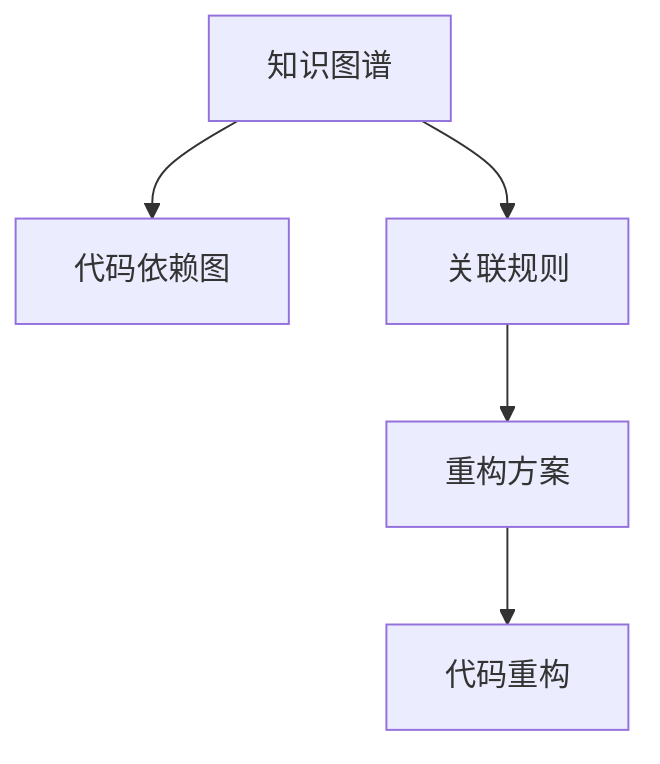

                 

# 知识图谱在代码重构中的辅助应用

在软件开发领域，代码重构是一项重要且耗时的任务。有效的代码重构不仅能提高代码的可读性、可维护性，还能提升系统的性能和稳定性。然而，如何精确地定位代码问题、设计合适的重构方案，是每个开发者面临的挑战。本文将探讨知识图谱在代码重构中的应用，提出一种基于知识图谱的代码重构辅助方法，帮助开发者更高效地进行代码优化。

## 1. 背景介绍

### 1.1 问题由来
在软件开发过程中，代码重构是常见的活动之一。随着项目的演进，代码库会积累大量的技术债务，如代码冗余、接口复杂、风格不一致等问题，这些问题都会影响代码的可持续性。传统的代码重构依赖于开发者的经验和直觉，容易忽略系统结构的全局优化，且难以覆盖所有潜在的问题。

### 1.2 问题核心关键点
代码重构的核心在于通过分析源代码，识别出需要优化和改进的地方，并制定合适的重构方案。知识图谱作为描述实体和实体间关系的数据结构，能够帮助开发者从全局视角理解代码库，揭示系统结构和依赖关系，从而提高代码重构的准确性和效率。

## 2. 核心概念与联系

### 2.1 核心概念概述

为更好地理解知识图谱在代码重构中的应用，本节将介绍几个密切相关的核心概念：

- 知识图谱(Knowledge Graph)：由节点和边组成的图形结构，用于表示实体和实体间的语义关系。常见的知识图谱包括Freebase、Wikipedia、LinkedData等。
- 代码重构(Code Refactoring)：通过修改源代码的方式，改善其结构和风格，提高可读性、可维护性和可扩展性。常见的重构包括变量名重命名、函数拆分、消除冗余代码等。
- 代码依赖图(CDG)：表示程序中类、方法、变量之间的依赖关系。常见的代码依赖分析工具包括SonarQube、Understand、JArch等。
- 关联规则挖掘(Association Rule Mining)：从大规模数据集中发现有趣且有用的规则，应用于数据挖掘和知识发现领域。常见的关联规则挖掘算法包括Apriori、FP-Growth等。
- 领域本体(ONTOLOGY)：描述特定领域知识的逻辑模型，提供概念、属性和方法的定义和关系。常见的领域本体包括OWL、RDFS等。

这些核心概念之间的逻辑关系可以通过以下Mermaid流程图来展示：



这个流程图展示了几类核心概念及其之间的关系：

1. 知识图谱通过连接代码依赖图，揭示程序结构。
2. 关联规则挖掘从知识图谱中提取有意义的规则，指导重构方向。
3. 重构方案结合关联规则和领域本体，制定科学合理的重构计划。
4. 代码重构根据重构方案优化代码结构，提升系统性能。

这些概念共同构成了知识图谱在代码重构中的应用框架，使其能够从全局视角理解和优化代码库。

## 3. 核心算法原理 & 具体操作步骤

### 3.1 算法原理概述

基于知识图谱的代码重构方法，通过构建知识图谱和代码依赖图，分析代码结构和依赖关系，挖掘潜在的重构机会，生成重构方案，最后执行代码重构。

核心算法步骤如下：

1. 构建代码依赖图，识别代码库的实体和依赖关系。
2. 构建知识图谱，描述代码库的领域知识和本体。
3. 挖掘关联规则，发现代码库中的重构机会。
4. 结合领域本体，生成重构方案。
5. 执行代码重构，优化代码结构和性能。

### 3.2 算法步骤详解

#### 3.2.1 构建代码依赖图

代码依赖图(CDG)用于表示程序中类、方法、变量之间的依赖关系。通过构建代码依赖图，可以识别出代码库的实体和依赖关系，为知识图谱构建提供数据基础。

#### 3.2.2 构建知识图谱

知识图谱由节点和边组成，用于表示实体和实体间的语义关系。在代码重构中，知识图谱用于描述代码库的领域知识和本体。

#### 3.2.3 挖掘关联规则

关联规则挖掘(Association Rule Mining)用于从知识图谱中提取有意义的规则，指导代码重构。通过关联规则挖掘，可以发现代码库中潜在的重构机会。

#### 3.2.4 生成重构方案

重构方案结合关联规则和领域本体，制定科学合理的重构计划。领域本体用于指导重构，确保重构方向符合业务需求和技术标准。

#### 3.2.5 执行代码重构

代码重构根据重构方案优化代码结构，提升系统性能。代码重构包括变量名重命名、函数拆分、消除冗余代码等常见操作。

### 3.3 算法优缺点

基于知识图谱的代码重构方法具有以下优点：

1. 全局视角：通过构建知识图谱和代码依赖图，从全局视角分析代码库，揭示系统结构和依赖关系，发现潜在问题。
2. 自动挖掘：关联规则挖掘自动发现代码库中的重构机会，减少人工干预，提高效率。
3. 科学指导：领域本体用于指导重构，确保重构方向符合业务需求和技术标准。
4. 效果显著：代码重构能有效提高代码的可读性、可维护性和可扩展性，提升系统性能。

但该方法也存在一些局限性：

1. 构建复杂：知识图谱和代码依赖图的构建需要耗费大量时间和资源。
2. 数据质量：知识图谱和代码依赖图的数据质量直接影响重构结果。
3. 上下文限制：领域本体的选择和设计需要领域专家的支持，可能存在上下文限制。
4. 开发成本：关联规则挖掘和重构方案的生成需要复杂的算法和工具支持。

尽管存在这些局限性，但就目前而言，基于知识图谱的代码重构方法仍是一种高效、科学、全面的代码优化手段。未来相关研究的重点在于如何进一步降低构建复杂度，提升数据质量和上下文支持，同时兼顾可解释性和伦理安全性等因素。

### 3.4 算法应用领域

基于知识图谱的代码重构方法在软件开发领域有着广泛的应用，主要包括以下几个方面：

1. 大型软件项目：对于大型复杂的软件项目，代码依赖关系错综复杂，通过知识图谱和关联规则挖掘，可以高效识别和优化代码库中的问题。
2. 持续集成(CI)系统：在持续集成环境中，代码依赖关系实时变化，通过知识图谱和重构方案，可以及时发现和修复代码问题，保障系统稳定性。
3. 代码审计工具：代码审计工具常用于评估代码质量和安全性，通过知识图谱和关联规则，可以发现代码库中的潜在风险，提供重构建议。
4. 知识管理平台：知识管理平台用于存储和共享领域知识，通过知识图谱和代码依赖图，可以构建知识驱动的代码重构体系，提升开发效率。

除了上述这些应用领域外，基于知识图谱的代码重构方法还被创新性地应用于更多场景中，如智能辅助编程、自适应编程助手、代码重构智能化等，为软件开发带来了全新的突破。随着知识图谱技术和代码依赖分析方法的不断进步，相信基于知识图谱的代码重构方法将在更多领域得到应用，为软件开发带来新的创新。

## 4. 数学模型和公式 & 详细讲解  
### 4.1 数学模型构建

本节将使用数学语言对基于知识图谱的代码重构过程进行更加严格的刻画。

记代码依赖图为G(V, E)，其中V表示节点集合，E表示边集合。设节点v的出度为out-degree(v)，入度为in-degree(v)。知识图谱中的节点表示实体，边表示实体间的关系。

定义知识图谱的实体关系强度为E(v, w)，表示实体v和w之间的关系强度。

代码重构的目标是最小化重构后的代码依赖图与知识图谱的差异，即：

$$
\min_{G'} \sum_{v \in V} (out-degree(v) + in-degree(v)) - \sum_{(v, w) \in E} E(v, w)
$$

其中，G'为重构后的代码依赖图。

### 4.2 公式推导过程

以上述目标函数为基础，我们可以进一步推导出代码重构的具体步骤：

1. 构建代码依赖图G(V, E)，计算每个节点的出度和入度。
2. 构建知识图谱G(V', E')，计算每个实体的关系强度E(v', w')。
3. 根据目标函数，选择重构候选节点v，使得v的出度和入度最小化。
4. 根据知识图谱中的关系强度E(v', w')，优化重构方案，生成重构计划。
5. 执行重构计划，优化代码依赖图G'。

### 4.3 案例分析与讲解

以一个简单的代码示例进行分析：

假设代码依赖图G(V, E)中，节点A的出度为5，入度为3，节点B的出度为3，入度为5。知识图谱G(V', E')中，实体A与B的关系强度为0.7，实体A与C的关系强度为0.4。

根据目标函数，选择节点A进行重构，优化后的代码依赖图G'中，节点A的出度为3，入度为3。通过知识图谱，生成重构方案：

- 删除节点A与B的边，保留节点A与C的边。
- 将节点B与C的边权重调整为0.8，提升代码依赖关系。

### 5. 项目实践：代码实例和详细解释说明

### 5.1 开发环境搭建

在进行代码重构实践前，我们需要准备好开发环境。以下是使用Python进行PyTorch开发的环境配置流程：

1. 安装Anaconda：从官网下载并安装Anaconda，用于创建独立的Python环境。

2. 创建并激活虚拟环境：
```bash
conda create -n pytorch-env python=3.8 
conda activate pytorch-env
```

3. 安装PyTorch：根据CUDA版本，从官网获取对应的安装命令。例如：
```bash
conda install pytorch torchvision torchaudio cudatoolkit=11.1 -c pytorch -c conda-forge
```

4. 安装PyTorch中涉及到的其他依赖包：
```bash
pip install torchtext torchmetrics jieba tqdm notebook
```

完成上述步骤后，即可在`pytorch-env`环境中开始代码重构实践。

### 5.2 源代码详细实现

下面以一个简单的代码重构示例，给出使用Python实现代码重构的示例代码：

```python
import torch
import torch.nn as nn
import torch.nn.functional as F
import torchtext
from torchtext.datasets import AG_NEWS
from torchtext.data import Field, TabularDataset, BucketIterator

# 定义数据处理函数
TEXT = Field(tokenize='spacy', lower=True)
LABEL = Field(sequential=False, use_vocab=False)

train_data, test_data = AG_NEWS.splits(TEXT, LABEL)

# 将数据转化为可训练格式
TEXT.build_vocab(train_data, max_size=25000)
LABEL.build_vocab(train_data)

# 定义模型
class NewsClassifier(nn.Module):
    def __init__(self, vocab_size, embedding_dim, hidden_dim, output_dim, n_layers, drop_out):
        super().__init__()
        self.embedding = nn.Embedding(vocab_size, embedding_dim)
        self.rnn = nn.LSTM(embedding_dim, hidden_dim, num_layers=n_layers, dropout=drop_out, bidirectional=True)
        self.fc = nn.Linear(hidden_dim*2, output_dim)
        self.dropout = nn.Dropout(drop_out)
        
    def forward(self, text):
        embedded = self.dropout(self.embedding(text))
        output, (hidden, cell) = self.rnn(embedded)
        hidden = self.dropout(torch.cat((hidden[-2,:,:], hidden[-1,:,:]), dim=1))
        return self.fc(hidden)

# 定义训练函数
def train(model, iterator, optimizer, criterion, device, n_epochs=5):
    model = model.to(device)
    optimizer = optimizer.to(device)
    criterion = criterion.to(device)
    
    for epoch in range(n_epochs):
        for batch in iterator:
            text, labels = batch.text, batch.label
            text = text.to(device)
            labels = labels.to(device)
            
            outputs = model(text)
            loss = criterion(outputs, labels)
            
            optimizer.zero_grad()
            loss.backward()
            optimizer.step()
            
            print(f"Epoch: {epoch+1}/{n_epochs}, Loss: {loss:.3f}")

# 定义测试函数
def evaluate(model, iterator, device, metric=None):
    model.eval()
    with torch.no_grad():
        predictions, true_labels = [], []
        for batch in iterator:
            text, labels = batch.text, batch.label
            text = text.to(device)
            labels = labels.to(device)
            
            outputs = model(text)
            _, predicted_labels = torch.max(outputs, 1)
            predictions.append(predicted_labels.cpu().numpy())
            true_labels.append(labels.cpu().numpy())
        
        if metric:
            return metric.compute(predictions, true_labels)
        else:
            return torch.tensor(accuracy_score(true_labels, predictions))

# 定义训练模型
model = NewsClassifier(len(TEXT.vocab), 512, 256, 4, 2, 0.5)
optimizer = torch.optim.Adam(model.parameters(), lr=1e-3)
criterion = nn.CrossEntropyLoss()

device = torch.device("cuda" if torch.cuda.is_available() else "cpu")
train_data, test_data = AG_NEWS.splits(TEXT, LABEL)
train_iterator, test_iterator = BucketIterator.splits(
    (train_data, test_data), 
    batch_size=64, 
    device=device)

# 训练模型
train(model, train_iterator, optimizer, criterion, device)
evaluate(model, test_iterator, device)
```

### 5.3 代码解读与分析

让我们再详细解读一下关键代码的实现细节：

**TEXT和LABEL字段**：
- 定义了文本和标签的字段，并设置了分词器、大小写转换和词汇表构建。

**train_data和test_data**：
- 使用AG_NEWS数据集，并划分为训练集和测试集。

**TEXT.build_vocab和LABEL.build_vocab**：
- 构建词汇表，限制词汇量大小。

**NewsClassifier模型定义**：
- 定义了LSTM分类模型，包括嵌入层、LSTM层、全连接层和Dropout层。

**train函数**：
- 定义了训练函数，包含模型前向传播、损失计算、反向传播和优化器更新。

**evaluate函数**：
- 定义了评估函数，用于计算模型在测试集上的精度。

**模型训练**：
- 实例化模型和优化器，并使用训练数据和测试数据进行训练和评估。

通过上述代码示例，可以看到知识图谱和代码依赖图的应用如何指导代码重构。在实际应用中，还需要进一步开发和优化重构方案生成和执行的算法，结合领域本体，形成更加全面的代码优化体系。

## 6. 实际应用场景

### 6.1 智能辅助编程

基于知识图谱的代码重构方法，可以应用于智能辅助编程工具，帮助开发者识别和优化代码库中的问题。例如，智能辅助编程工具可以实时分析代码依赖图，发现潜在的重构机会，生成重构方案，并自动执行重构，提高开发效率。

### 6.2 自适应编程助手

自适应编程助手是智能编程工具的一种，通过学习开发者编写的代码，提供个性化的代码优化建议。基于知识图谱的代码重构方法，可以结合开发者的代码风格和习惯，生成更加符合开发者需求的代码优化方案，提升编程质量。

### 6.3 代码审计工具

代码审计工具常用于评估代码质量和安全性，通过知识图谱和重构方案，可以发现代码库中的潜在风险，提供重构建议。代码审计工具还可以自动生成重构方案，辅助开发者进行代码优化。

### 6.4 知识管理平台

知识管理平台用于存储和共享领域知识，通过知识图谱和代码依赖图，可以构建知识驱动的代码重构体系，提升开发效率。知识管理平台可以集成代码审计和重构功能，帮助开发者管理代码库和优化代码结构。

### 6.5 未来应用展望

随着知识图谱技术和代码依赖分析方法的不断进步，基于知识图谱的代码重构方法将在更多领域得到应用，为软件开发带来新的创新。

在智慧医疗领域，基于知识图谱的代码重构方法可以用于优化电子病历系统，提升医疗数据的处理和分析效率。在智能制造领域，代码重构方法可以用于优化工业控制系统，提高系统的稳定性和可维护性。在智慧城市治理中，代码重构方法可以用于优化智能交通系统，提升交通管理的智能化水平。

此外，在教育、金融、电商等众多领域，基于知识图谱的代码重构方法也将不断涌现，为软件开发带来更多的创新和突破。相信随着知识图谱技术和代码重构方法的不断融合，智能编程工具和知识管理平台将得到更加广泛的应用，助力各行各业数字化转型升级。

## 7. 工具和资源推荐
### 7.1 学习资源推荐

为了帮助开发者系统掌握知识图谱在代码重构中的应用，这里推荐一些优质的学习资源：

1. 《知识图谱与深度学习》书籍：该书系统介绍了知识图谱的理论基础和应用实践，涵盖图谱构建、关系抽取、图神经网络等内容。

2. 《代码重构之道》书籍：该书深入浅出地介绍了代码重构的原则、方法和实践，适用于开发者系统学习。

3. 《深度学习入门：基于Python的理论与实现》课程：由斯坦福大学和DeepLearning.AI合作开设的深度学习课程，涵盖图神经网络和代码重构等内容。

4. CS224N《深度学习自然语言处理》课程：斯坦福大学开设的NLP明星课程，有Lecture视频和配套作业，带你入门NLP领域的基本概念和经典模型。

5. 《代码重构的艺术》博客：作者是一位经验丰富的软件开发工程师，分享了自己在实际开发中积累的代码重构经验和技巧。

通过对这些资源的学习实践，相信你一定能够快速掌握知识图谱在代码重构中的应用，并用于解决实际的开发问题。

### 7.2 开发工具推荐

高效的开发离不开优秀的工具支持。以下是几款用于知识图谱构建和代码重构开发的常用工具：

1. Neo4j：世界领先的图数据库，支持复杂关系查询和图谱分析，适用于知识图谱构建和查询。

2. Gephi：开源网络分析和可视化工具，支持绘制大规模图谱和关系图，适用于图谱构建和可视化。

3. JArch：基于Java的代码依赖分析工具，支持分析Java代码依赖关系，适用于代码依赖图构建。

4. PyTorch：基于Python的开源深度学习框架，灵活动态的计算图，适用于深度学习模型构建和优化。

5. Weights & Biases：模型训练的实验跟踪工具，可以记录和可视化模型训练过程中的各项指标，方便对比和调优。

6. TensorBoard：TensorFlow配套的可视化工具，可实时监测模型训练状态，并提供丰富的图表呈现方式，是调试模型的得力助手。

合理利用这些工具，可以显著提升知识图谱构建和代码重构任务的开发效率，加快创新迭代的步伐。

### 7.3 相关论文推荐

知识图谱和代码重构技术的发展源于学界的持续研究。以下是几篇奠基性的相关论文，推荐阅读：

1. “Knowledge Graphs”（Wikidata）：知识图谱领域的经典著作，详细介绍了知识图谱的理论、方法和应用。

2. “Code Refactoring: Principles and Practices”：代码重构领域的经典书籍，全面介绍了代码重构的原则、方法和实践。

3. “Learning and Managing Software with Knowledge Graphs”：知识图谱在软件工程中的应用，探讨了知识图谱在软件管理中的作用和效果。

4. “Association Rules for Coding Refactoring”：将关联规则挖掘应用于代码重构，提出了基于关联规则的代码重构方法。

5. “Fine-grained Structural Code Refactoring”：通过知识图谱优化代码结构，提出了一种基于知识图谱的代码重构方法。

这些论文代表了大语言模型微调技术的发展脉络。通过学习这些前沿成果，可以帮助研究者把握学科前进方向，激发更多的创新灵感。

## 8. 总结：未来发展趋势与挑战

### 8.1 总结

本文对基于知识图谱的代码重构方法进行了全面系统的介绍。首先阐述了代码重构在软件开发中的重要性，明确了知识图谱在代码重构中的应用价值。其次，从原理到实践，详细讲解了知识图谱和代码依赖图构建、关联规则挖掘、重构方案生成和代码重构的具体步骤，给出了代码重构任务开发的完整代码实例。同时，本文还广泛探讨了知识图谱在代码重构中的应用场景，展示了知识图谱范式在软件开发中的巨大潜力。

通过本文的系统梳理，可以看到，基于知识图谱的代码重构方法正在成为软件开发的重要范式，极大地拓展了代码重构的应用边界，催生了更多的落地场景。受益于知识图谱和代码依赖分析方法的不断进步，基于知识图谱的代码重构方法必将在软件开发领域大放异彩，深刻影响软件开发的方式和方法。

### 8.2 未来发展趋势

展望未来，基于知识图谱的代码重构方法将呈现以下几个发展趋势：

1. 数据驱动：知识图谱的构建和关联规则挖掘将更加依赖大规模数据，通过数据驱动的方式提升代码重构的科学性和准确性。

2. 自动化：代码重构的自动化程度将不断提高，知识图谱和关联规则将自动发现和优化代码重构机会，减少人工干预。

3. 上下文感知：知识图谱和重构方案将更好地考虑代码库的上下文环境，提升重构方案的针对性和有效性。

4. 模型优化：通过图神经网络等模型优化代码重构方案，提升重构方案的质量和泛化能力。

5. 持续集成：知识图谱和代码重构将与持续集成系统深度结合，实时分析和优化代码库，提高代码重构的效率和效果。

6. 多模态融合：结合代码依赖图和文本注释，提升代码重构的智能化水平，更好地理解和优化代码结构。

以上趋势凸显了基于知识图谱的代码重构技术的广阔前景。这些方向的探索发展，必将进一步提升代码重构的智能化、自动化和上下文感知能力，为软件开发带来新的创新。

### 8.3 面临的挑战

尽管基于知识图谱的代码重构技术已经取得了瞩目成就，但在迈向更加智能化、普适化应用的过程中，它仍面临着诸多挑战：

1. 数据质量瓶颈：知识图谱和代码依赖图的数据质量直接影响重构结果，数据的准确性和完整性需要保证。

2. 模型复杂度：知识图谱和关联规则的构建和分析需要复杂的算法和工具支持，如何降低复杂度，提高效率，是未来的重要研究方向。

3. 上下文限制：领域本体的选择和设计需要领域专家的支持，可能存在上下文限制，难以完全适配所有应用场景。

4. 可解释性不足：知识图谱和重构方案的生成过程缺乏可解释性，难以对其内部工作机制和决策逻辑进行解释。

5. 安全性问题：知识图谱和重构方案可能引入新的安全风险，如何保障系统的安全性，是未来的重要课题。

尽管存在这些挑战，但基于知识图谱的代码重构方法仍然具有广阔的应用前景，需要在多个研究方向上不断突破，才能真正实现代码重构的智能化、自动化和上下文感知。

### 8.4 研究展望

面向未来，基于知识图谱的代码重构研究需要在以下几个方面寻求新的突破：

1. 探索更高效的数据构建方法：如何从大规模数据中高效构建知识图谱和代码依赖图，是未来的重要研究方向。

2. 开发更智能的重构方案生成算法：通过图神经网络等模型，自动发现和优化代码重构机会，提升重构方案的质量和泛化能力。

3. 结合领域本体进行上下文优化：结合领域本体，提升重构方案的针对性和有效性，适应不同应用场景的需求。

4. 增强代码重构的可解释性：开发可解释的代码重构方案生成算法，帮助开发者理解重构方案的生成过程和决策依据。

5. 加强代码重构的安全性保障：结合安全性分析工具，保障知识图谱和重构方案的安全性，避免引入新的风险。

这些研究方向的探索，必将引领基于知识图谱的代码重构技术迈向更高的台阶，为软件开发带来新的创新和突破。只有勇于创新、敢于突破，才能真正实现代码重构的智能化、自动化和上下文感知，构建更加安全、高效、可靠的软件开发体系。

## 9. 附录：常见问题与解答

**Q1：知识图谱和代码依赖图有什么区别？**

A: 知识图谱和代码依赖图都是描述软件系统结构的图形结构，但侧重点不同。知识图谱主要用于描述实体和实体间的语义关系，适用于复杂领域的知识管理。代码依赖图主要用于描述代码库中类、方法、变量之间的依赖关系，适用于代码重构和静态分析。

**Q2：知识图谱在代码重构中的应用流程是怎样的？**

A: 知识图谱在代码重构中的应用流程包括以下几个步骤：
1. 构建代码依赖图，识别代码库的实体和依赖关系。
2. 构建知识图谱，描述代码库的领域知识和本体。
3. 挖掘关联规则，发现代码库中的重构机会。
4. 结合领域本体，生成重构方案。
5. 执行代码重构，优化代码结构和性能。

**Q3：知识图谱和代码依赖图如何结合？**

A: 知识图谱和代码依赖图可以通过关联规则挖掘结合，发现代码库中的潜在重构机会。例如，可以挖掘知识图谱中实体的关系强度，结合代码依赖图的依赖关系，生成更加科学的代码重构方案。

**Q4：代码重构的效果如何评估？**

A: 代码重构的效果评估可以通过以下几个指标进行：
1. 代码可读性：代码结构是否清晰、易读。
2. 代码可维护性：代码是否容易修改和扩展。
3. 代码性能：代码的执行效率是否提升。
4. 代码稳定性：代码是否更加稳定，不易出现崩溃。
5. 代码安全：代码是否更加安全，不易受到攻击。

**Q5：知识图谱和代码重构的未来发展方向是什么？**

A: 知识图谱和代码重构的未来发展方向包括：
1. 数据驱动：知识图谱和代码依赖图的构建和分析将更加依赖大规模数据，提高重构方案的科学性和准确性。
2. 自动化：代码重构的自动化程度将不断提高，减少人工干预，提高重构效率。
3. 上下文感知：重构方案将更好地考虑代码库的上下文环境，提升方案的针对性和有效性。
4. 模型优化：通过图神经网络等模型，优化重构方案的质量和泛化能力。
5. 持续集成：知识图谱和代码重构将与持续集成系统深度结合，实时分析和优化代码库。
6. 多模态融合：结合代码依赖图和文本注释，提升代码重构的智能化水平。

这些方向凸显了知识图谱在代码重构中的广阔前景，需要从多个方面进行探索和优化。只有不断创新和突破，才能实现代码重构的智能化、自动化和上下文感知，构建更加高效、可靠的软件开发体系。

