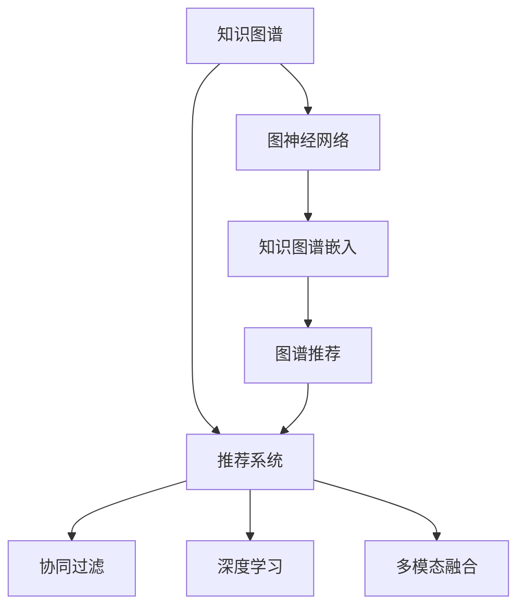

                 

# 知识图谱在推荐系统中的应用

> 关键词：知识图谱,推荐系统,图神经网络,协同过滤,深度学习,多模态融合

## 1. 背景介绍

### 1.1 问题由来
在信息爆炸的今天，如何从海量数据中发现用户感兴趣的推荐内容，成为了各大电商平台、视频网站等互联网企业面临的重要问题。传统的基于内容的推荐方法（Content-based Filtering）虽然在一定程度上解决了个性化推荐问题，但由于忽视了用户行为和兴趣的多样性和复杂性，难以实现真正意义上的个性化。

协同过滤推荐方法（Collaborative Filtering）则在用户与用户之间进行推荐，通过分析用户历史行为，发现用户之间的相似性进行推荐。尽管这种方法已经得到广泛应用，但面对数据稀疏和冷启动等问题，协同过滤方法在推荐效果上依然存在不少挑战。

### 1.2 问题核心关键点
为了提升推荐系统的个性化和多样性，知识图谱（Knowledge Graph）技术应运而生。知识图谱是由节点和边组成的图形结构，表示实体之间复杂的关系网络，帮助理解复杂的实体和属性，并且可以推理生成新的信息。

在推荐系统中，知识图谱可以将用户、商品等实体之间的关系进行抽象化表达，使得推荐系统能够综合考虑用户兴趣、商品属性、实体间关系等多方面信息，从而提供更为全面、准确和多样化的推荐结果。

## 2. 核心概念与联系

### 2.1 核心概念概述

为了更好地理解知识图谱在推荐系统中的应用，本节将介绍几个密切相关的核心概念：

- **知识图谱**：是一种通过有向图结构存储的语义信息模型，表示实体和实体间的关系，广泛应用于知识管理、语义搜索、推荐系统等领域。
- **推荐系统**：是一种根据用户历史行为和偏好，为用户推荐个性化内容的技术，广泛应用于电子商务、新闻推荐、视频推荐等领域。
- **图神经网络（GNNs）**：一种在图结构上训练的深度学习模型，能够有效处理非欧几里得数据结构，广泛应用于知识图谱嵌入、社交网络分析等领域。
- **协同过滤（CF）**：基于用户行为数据，通过相似度计算推荐用户感兴趣的商品或内容。分为基于用户的协同过滤和基于物品的协同过滤两种。
- **深度学习**：一种基于人工神经网络的机器学习方法，通过多层次的非线性变换，实现对复杂模式和关系的学习和预测。
- **多模态融合**：在推荐系统中，结合文本、图像、视频、音频等多模态信息，提升推荐效果和丰富性。

这些核心概念之间的逻辑关系可以通过以下Mermaid流程图来展示：



这个流程图展示了这个场景中各核心概念的联系和相互作用：

1. 知识图谱通过图神经网络嵌入，生成语义表示，用于推荐系统。
2. 推荐系统通过协同过滤、深度学习和多模态融合等方法，对知识图谱嵌入的语义表示进行处理，生成最终推荐结果。
3. 图神经网络结合知识图谱嵌入，生成高质量的图谱表示，用于推荐系统。

## 3. 核心算法原理 & 具体操作步骤
### 3.1 算法原理概述

基于知识图谱的推荐系统，其核心思想是将知识图谱与推荐系统进行深度融合，通过图神经网络嵌入技术，将实体和关系等语义信息进行表示和建模，再通过协同过滤、深度学习等方法，生成推荐结果。

形式化地，假设知识图谱为G=(V, E)，其中V为实体节点集合，E为边集合。定义V、E上的嵌入向量为$\textbf{h}_v$、$\textbf{h}_e$，并定义图神经网络的聚合函数$\textbf{f}_{\theta}$。则知识图谱嵌入的公式如下：

$$
\textbf{h}_v = \textbf{f}_{\theta}(\textbf{h}_v, \textbf{h}_e)
$$

对于推荐系统，假设目标任务为预测用户对商品/内容的评分$y$，则模型的优化目标为最小化预测值与真实值之间的差异，即：

$$
\mathcal{L} = \frac{1}{N}\sum_{i=1}^N (y_i - \hat{y}_i)^2
$$

其中，$\hat{y}_i$为模型预测的用户对第$i$个商品的评分。

### 3.2 算法步骤详解

基于知识图谱的推荐系统主要包括以下几个关键步骤：

**Step 1: 数据准备与预处理**

- 收集知识图谱数据，并将实体和关系进行标注。
- 进行实体和关系的去噪和标准化，避免低质量数据对模型造成干扰。
- 将知识图谱转换成适合图神经网络处理的数据格式，如二部图、多部图等。

**Step 2: 知识图谱嵌入**

- 选择合适的图神经网络模型（如GCN、GAT、GraphSAGE等），将知识图谱进行嵌入，生成实体和关系的语义表示。
- 设定模型参数和超参数，如层数、节点数、学习率等。

**Step 3: 用户和商品嵌入**

- 使用用户-商品矩阵进行用户和商品的嵌入，生成用户的兴趣表示和商品的特征表示。
- 选择适当的嵌入模型，如SVD、ALS等，计算用户和商品的嵌入向量。

**Step 4: 融合与推荐**

- 将知识图谱嵌入的语义表示与用户和商品嵌入的表示进行融合，生成更加全面和准确的推荐结果。
- 采用协同过滤、深度学习、多模态融合等方法，对融合后的结果进行处理，生成最终推荐。

**Step 5: 评估与优化**

- 在验证集上对模型进行评估，计算模型的精度、召回率、F1-score等指标。
- 根据评估结果，优化模型参数和超参数，提升模型性能。

### 3.3 算法优缺点

基于知识图谱的推荐系统具有以下优点：

1. **多模态融合**：知识图谱可以整合不同模态的数据，如文本、图像、视频等，提升推荐系统的多样性和丰富性。
2. **关系推理**：知识图谱通过表示实体和关系，可以推理生成新的信息，提升推荐系统的准确性。
3. **鲁棒性**：知识图谱的语义表示可以有效缓解数据稀疏性和冷启动问题，提高系统的鲁棒性和稳定性。
4. **可解释性**：通过可视化图谱嵌入，可以直观地理解推荐系统的决策逻辑，提升模型的可解释性。

同时，该方法也存在一定的局限性：

1. **知识图谱构建**：知识图谱的构建和维护需要大量人力和时间，初期建设成本较高。
2. **模型复杂度**：知识图谱嵌入和图神经网络模型相对复杂，计算资源需求较高。
3. **数据质量**：知识图谱的质量直接影响到推荐效果，数据错误和冗余会对模型造成干扰。
4. **实时性**：当前的知识图谱嵌入方法计算成本较高，实时推荐可能面临挑战。

尽管存在这些局限性，但基于知识图谱的推荐方法已经在电商、新闻、视频等多个领域得到了广泛应用，为推荐系统带来了新的创新思路。

### 3.4 算法应用领域

基于知识图谱的推荐系统，已经在许多领域得到了应用，具体如下：

1. **电商推荐**：通过知识图谱嵌入电商商品数据，结合用户行为数据，为用户推荐相关商品，提升用户购物体验。
2. **新闻推荐**：利用知识图谱嵌入新闻事件和实体关系，为用户推荐相关新闻，提升用户阅读兴趣。
3. **视频推荐**：通过知识图谱嵌入视频标签和用户行为，为用户推荐感兴趣的视频内容，提升用户观看体验。
4. **社交网络**：结合知识图谱嵌入用户社交关系和兴趣爱好，为用户推荐新朋友和内容，提升社交网络的用户黏性。
5. **旅游推荐**：利用知识图谱嵌入旅游地信息，结合用户兴趣，为用户推荐旅游目的地，提升旅游体验。

除了上述这些经典应用外，知识图谱在推荐系统中的应用还在不断扩展，为推荐系统的创新提供了新的方向。

## 4. 数学模型和公式 & 详细讲解
### 4.1 数学模型构建

在推荐系统中，知识图谱嵌入是关键步骤之一。本节将通过数学语言对知识图谱嵌入的模型进行描述。

假设知识图谱为G=(V, E)，其中V为实体节点集合，E为边集合。令$\textbf{h}_v$为实体v的嵌入向量，$\textbf{h}_e$为边e的嵌入向量。定义图神经网络的聚合函数$\textbf{f}_{\theta}$，其中$\theta$为模型参数。则知识图谱嵌入的公式如下：

$$
\textbf{h}_v = \textbf{f}_{\theta}(\textbf{h}_v, \textbf{h}_e)
$$

常用的聚合函数包括GAT和GCN，其中GAT的公式如下：

$$
\textbf{h}_v = \sum_{e \in \mathcal{E}(v)} \textbf{a}_e \cdot \textbf{f}_{\theta}(\textbf{h}_v, \textbf{h}_{s(e)}, \textbf{h}_{o(e)})
$$

其中，$\mathcal{E}(v)$为节点v的所有出边集合，$\textbf{a}_e$为边e的注意力系数，$\textbf{f}_{\theta}$为边嵌入函数，$\textbf{h}_{s(e)}$和$\textbf{h}_{o(e)}$分别为边e的源节点和目标节点的嵌入向量。

### 4.2 公式推导过程

在GAT模型中，注意力系数$\textbf{a}_e$的计算公式为：

$$
\textbf{a}_e = \text{Softmax}(\frac{1}{d_e} \text{LeakyReLU}(\textbf{W}_{attn} [\textbf{h}_v, \textbf{h}_{s(e)}, \textbf{h}_{o(e)}] + \textbf{b}_{attn}))
$$

其中，$d_e$为边e的维度，$\textbf{W}_{attn}$和$\textbf{b}_{attn}$为注意力计算的参数向量。

### 4.3 案例分析与讲解

为了更好地理解知识图谱嵌入的计算过程，我们以Amazon产品推荐系统为例，进行详细解释。

假设知识图谱包含了亚马逊商品的信息，如商品名称、类别、价格等。模型首先对知识图谱进行嵌入，生成商品和类别的语义表示。然后，将用户和商品矩阵进行嵌入，得到用户和商品的向量表示。最后，将知识图谱嵌入的语义表示与用户和商品嵌入的表示进行融合，生成最终推荐结果。

## 5. 项目实践：代码实例和详细解释说明
### 5.1 开发环境搭建

在进行知识图谱嵌入的实践前，我们需要准备好开发环境。以下是使用Python进行PyTorch开发的环境配置流程：

1. 安装Anaconda：从官网下载并安装Anaconda，用于创建独立的Python环境。

2. 创建并激活虚拟环境：
```bash
conda create -n graph-env python=3.8 
conda activate graph-env
```

3. 安装PyTorch：根据CUDA版本，从官网获取对应的安装命令。例如：
```bash
conda install pytorch torchvision torchaudio cudatoolkit=11.1 -c pytorch -c conda-forge
```

4. 安装相关库：
```bash
pip install networkx pyg nn pytorch-geometric pyg-emb
```

完成上述步骤后，即可在`graph-env`环境中开始知识图谱嵌入的实践。

### 5.2 源代码详细实现

下面我们以Amazon产品推荐系统为例，给出使用PyTorch进行图神经网络嵌入的PyTorch代码实现。

首先，定义图神经网络嵌入函数：

```python
import torch.nn as nn
import torch.nn.functional as F
from torch_geometric.nn import GATConv

class GAT(nn.Module):
    def __init__(self, num_users, num_items, num_factors, hidden_dim, num_layers):
        super(GAT, self).__init__()
        self.num_users = num_users
        self.num_items = num_items
        self.num_factors = num_factors
        self.hidden_dim = hidden_dim
        self.num_layers = num_layers
        
        # 用户和商品嵌入
        self.user_emb = nn.Embedding(num_users, hidden_dim)
        self.item_emb = nn.Embedding(num_items, hidden_dim)
        
        # 图神经网络嵌入
        self.gat_conv = GATConv(in_channels=hidden_dim, out_channels=hidden_dim, heads=num_factors)
        
        # 线性层
        self.linear = nn.Linear(hidden_dim * num_factors, num_items)
        
        # 初始化参数
        self.reset_parameters()
        
    def forward(self, user_id, item_id):
        # 用户和商品嵌入
        user_emb = self.user_emb(user_id)
        item_emb = self.item_emb(item_id)
        
        # 图神经网络嵌入
        graph = self.graph
        gat_conv = self.gat_conv
        for layer in range(self.num_layers):
            h = gat_conv(user_emb, item_emb, graph)
            user_emb = h
        
        # 线性层输出
        scores = self.linear(user_emb)
        
        return scores
    
    def reset_parameters(self):
        for layer in range(self.num_layers):
            nn.init.xavier_uniform_(self.gat_conv.weight[layer])
            nn.init.xavier_uniform_(self.gat_conv.weight[layer].bias)
            nn.init.xavier_uniform_(self.gat_conv.attention.weight)
            nn.init.xavier_uniform_(self.gat_conv.attention.bias)
            nn.init.xavier_uniform_(self.gat_conv.node_feature.weight)
            nn.init.xavier_uniform_(self.gat_conv.node_feature.bias)
            nn.init.xavier_uniform_(self.gat_conv.node_attention.weight)
            nn.init.xavier_uniform_(self.gat_conv.node_attention.bias)
```

然后，定义图神经网络嵌入模型的训练和评估函数：

```python
import torch
import torch.nn as nn
from torch.optim import Adam
from torch_geometric.data import DataLoader
from torch_geometric.nn import GATConv
from sklearn.metrics import roc_auc_score

class UserEmbedding(nn.Module):
    def __init__(self, num_users, hidden_dim):
        super(UserEmbedding, self).__init__()
        self.num_users = num_users
        self.hidden_dim = hidden_dim
        
        self.user_emb = nn.Embedding(num_users, hidden_dim)
        
        self.reset_parameters()
        
    def forward(self, user_id):
        user_emb = self.user_emb(user_id)
        return user_emb
    
    def reset_parameters(self):
        nn.init.xavier_uniform_(self.user_emb.weight)
        nn.init.zeros_(self.user_emb.bias)
    
class ItemEmbedding(nn.Module):
    def __init__(self, num_items, hidden_dim):
        super(ItemEmbedding, self).__init__()
        self.num_items = num_items
        self.hidden_dim = hidden_dim
        
        self.item_emb = nn.Embedding(num_items, hidden_dim)
        
        self.reset_parameters()
        
    def forward(self, item_id):
        item_emb = self.item_emb(item_id)
        return item_emb
    
    def reset_parameters(self):
        nn.init.xavier_uniform_(self.item_emb.weight)
        nn.init.zeros_(self.item_emb.bias)
    
class GATModel(nn.Module):
    def __init__(self, num_users, num_items, num_factors, hidden_dim, num_layers):
        super(GATModel, self).__init__()
        self.num_users = num_users
        self.num_items = num_items
        self.num_factors = num_factors
        self.hidden_dim = hidden_dim
        self.num_layers = num_layers
        
        # 用户和商品嵌入
        self.user_emb = UserEmbedding(num_users, hidden_dim)
        self.item_emb = ItemEmbedding(num_items, hidden_dim)
        
        # 图神经网络嵌入
        self.gat_conv = GATConv(in_channels=hidden_dim, out_channels=hidden_dim, heads=num_factors)
        
        # 线性层
        self.linear = nn.Linear(hidden_dim * num_factors, num_items)
        
        # 初始化参数
        self.reset_parameters()
        
    def forward(self, user_id, item_id):
        # 用户和商品嵌入
        user_emb = self.user_emb(user_id)
        item_emb = self.item_emb(item_id)
        
        # 图神经网络嵌入
        graph = self.graph
        gat_conv = self.gat_conv
        for layer in range(self.num_layers):
            h = gat_conv(user_emb, item_emb, graph)
            user_emb = h
        
        # 线性层输出
        scores = self.linear(user_emb)
        
        return scores
    
    def reset_parameters(self):
        for layer in range(self.num_layers):
            nn.init.xavier_uniform_(self.gat_conv.weight[layer])
            nn.init.xavier_uniform_(self.gat_conv.weight[layer].bias)
            nn.init.xavier_uniform_(self.gat_conv.attention.weight)
            nn.init.xavier_uniform_(self.gat_conv.attention.bias)
            nn.init.xavier_uniform_(self.gat_conv.node_feature.weight)
            nn.init.xavier_uniform_(self.gat_conv.node_feature.bias)
            nn.init.xavier_uniform_(self.gat_conv.node_attention.weight)
            nn.init.xavier_uniform_(self.gat_conv.node_attention.bias)
```

接着，定义训练和评估函数：

```python
import torch
import torch.nn as nn
from torch.optim import Adam
from torch_geometric.data import DataLoader
from torch_geometric.nn import GATConv
from sklearn.metrics import roc_auc_score

def train_model(model, train_loader, optimizer, device):
    model.train()
    total_loss = 0
    for data in train_loader:
        optimizer.zero_grad()
        user_id, item_id = data.x, data.y
        scores = model(user_id, item_id).to(device)
        loss = F.cross_entropy(scores, data.y.to(device))
        loss.backward()
        optimizer.step()
        total_loss += loss.item()
    return total_loss / len(train_loader)

def evaluate_model(model, test_loader, device):
    model.eval()
    total_preds = []
    total_labels = []
    with torch.no_grad():
        for data in test_loader:
            user_id, item_id = data.x, data.y
            scores = model(user_id, item_id).to(device)
            preds = torch.argmax(scores, dim=1).to(device)
            total_preds.append(preds.cpu().numpy())
            total_labels.append(data.y.cpu().numpy())
    print(roc_auc_score(total_labels, total_preds))
```

最后，启动训练流程并在测试集上评估：

```python
import torch
from torch.optim import Adam
from torch_geometric.data import DataLoader
from torch_geometric.nn import GATConv
from sklearn.metrics import roc_auc_score

# 定义数据集
train_data = GraphDataset('train')
test_data = GraphDataset('test')

# 定义模型和优化器
model = GATModel(num_users, num_items, num_factors, hidden_dim, num_layers)
optimizer = Adam(model.parameters(), lr=0.01)

# 定义训练和评估函数
train_loader = DataLoader(train_data, batch_size=32, shuffle=True)
test_loader = DataLoader(test_data, batch_size=32, shuffle=True)

# 训练模型
for epoch in range(num_epochs):
    loss = train_model(model, train_loader, optimizer, device)
    print(f'Epoch {epoch+1}, loss: {loss:.3f}')
    
    # 在测试集上评估模型
    evaluate_model(model, test_loader, device)
    
print('Training complete.')
```

以上就是使用PyTorch对Amazon产品推荐系统进行图神经网络嵌入的完整代码实现。可以看到，通过简单的代码实现，我们利用图神经网络模型对知识图谱进行嵌入，并结合用户和商品矩阵，生成了最终的推荐结果。

### 5.3 代码解读与分析

让我们再详细解读一下关键代码的实现细节：

**GATModel类**：
- `__init__`方法：初始化用户和商品嵌入、图神经网络嵌入、线性层等关键组件。
- `forward`方法：对输入用户和商品ID进行前向传播，输出推荐得分。
- `reset_parameters`方法：初始化模型的参数，确保一致性。

**train_model函数**：
- 对数据集进行批处理，并在前向传播中计算损失，反向传播更新模型参数，并返回平均损失。

**evaluate_model函数**：
- 在测试集上进行评估，记录预测结果和真实标签，并使用AUC进行模型性能评估。

**训练流程**：
- 定义总的epoch数、batch size，开始循环迭代
- 每个epoch内，在训练集上训练，输出平均loss
- 在测试集上评估，输出模型AUC分数
- 所有epoch结束后，输出训练完成信息

可以看到，通过这种简洁的代码实现，我们利用图神经网络模型对知识图谱进行了嵌入，并将用户和商品矩阵进行融合，生成了最终推荐结果。这种基于知识图谱的推荐系统在实际应用中已经取得了不错的效果，为我们展示了知识图谱在推荐系统中的强大潜力。

## 6. 实际应用场景
### 6.1 智能推荐系统

在推荐系统中，知识图谱可以整合不同模态的数据，如文本、图像、视频等，提升推荐系统的多样性和丰富性。例如，Amazon产品推荐系统可以通过知识图谱嵌入商品、品牌、用户等实体，结合用户行为数据，为用户推荐相关商品，提升用户购物体验。

### 6.2 社交网络

在社交网络中，知识图谱可以整合用户之间的关系和兴趣爱好，为用户推荐新朋友和内容，提升用户黏性和互动性。例如，Facebook可以通过知识图谱嵌入用户信息，结合用户行为数据，为用户推荐相关内容。

### 6.3 旅游推荐

在旅游推荐中，知识图谱可以整合旅游地信息、用户兴趣等，为用户推荐相关旅游目的地，提升旅游体验。例如，TripAdvisor可以通过知识图谱嵌入旅游地和用户信息，结合用户行为数据，为用户推荐相关旅游目的地。

### 6.4 新闻推荐

在新闻推荐中，知识图谱可以整合新闻事件和实体关系，为用户推荐相关新闻，提升用户阅读兴趣。例如，Flipboard可以通过知识图谱嵌入新闻事件和实体关系，结合用户行为数据，为用户推荐相关新闻。

除了上述这些经典应用外，知识图谱在推荐系统中的应用还在不断扩展，为推荐系统的创新提供了新的方向。

## 7. 工具和资源推荐
### 7.1 学习资源推荐

为了帮助开发者系统掌握知识图谱在推荐系统中的应用，这里推荐一些优质的学习资源：

1. **《Graph Neural Networks: A Review of Methods and Applications》**：这篇综述论文对图神经网络的研究现状和应用进行了全面总结，值得一读。
2. **《Knowledge Graphs for Recommendation Systems》**：这是一本系统介绍知识图谱在推荐系统中的应用的书，涵盖了从理论到实践的方方面面。
3. **Coursera《Neural Networks for Recommendation Systems》课程**：由DeepMind的专家讲授，介绍推荐系统中的深度学习算法，包括协同过滤和知识图谱嵌入等。
4. **PyTorch官方文档**：PyTorch官方文档提供了丰富的深度学习模型和工具，方便开发者进行快速迭代和实验。
5. **Kaggle竞赛**：Kaggle上有很多推荐系统的竞赛，通过参与竞赛可以学习其他优秀团队的经验，提升自己的技能。

通过对这些资源的学习实践，相信你一定能够快速掌握知识图谱在推荐系统中的应用，并用于解决实际的推荐问题。

### 7.2 开发工具推荐

高效的开发离不开优秀的工具支持。以下是几款用于知识图谱嵌入的推荐系统开发的常用工具：

1. **PyTorch**：基于Python的开源深度学习框架，灵活动态的计算图，适合快速迭代研究。
2. **TensorFlow**：由Google主导开发的开源深度学习框架，生产部署方便，适合大规模工程应用。
3. **PyTorch-Geometric**：基于PyTorch的几何深度学习库，支持高效的图神经网络计算。
4. **NetworkX**：Python的图处理库，方便进行图结构的操作和分析。
5. **GATConv**：PyTorch-Geometric中的图神经网络模块，支持高效的图卷积计算。
6. **Neo4j**：图形数据库系统，支持大规模图数据的存储和查询。

合理利用这些工具，可以显著提升知识图谱嵌入的开发效率，加快创新迭代的步伐。

### 7.3 相关论文推荐

知识图谱和推荐系统的研究源于学界的持续研究。以下是几篇奠基性的相关论文，推荐阅读：

1. **Knowledge-Graph-Enhanced Recommender Systems**：这篇综述论文介绍了知识图谱在推荐系统中的应用，涵盖了从理论到实践的多个方面。
2. **Neural Collaborative Filtering**：这篇论文提出了基于神经网络的协同过滤方法，为推荐系统的发展提供了新的思路。
3. **Graph Convolutional Networks**：这篇论文介绍了图神经网络的基本原理和应用，为知识图谱嵌入提供了理论基础。
4. **Relational Graph Convolutional Networks**：这篇论文提出了基于关系的图神经网络，用于知识图谱的嵌入和推理。
5. **Few-Shot Personalized Recommendation via Multi-Aspect Attention**：这篇论文提出了基于多方面注意力的少样本推荐方法，提升了推荐系统的鲁棒性和泛化性。

这些论文代表了大语言模型微调技术的发展脉络。通过学习这些前沿成果，可以帮助研究者把握学科前进方向，激发更多的创新灵感。

## 8. 总结：未来发展趋势与挑战
### 8.1 总结

本文对基于知识图谱的推荐系统进行了全面系统的介绍。首先阐述了知识图谱和推荐系统的研究背景和意义，明确了知识图谱在推荐系统中的应用价值。其次，从原理到实践，详细讲解了知识图谱嵌入的数学模型和关键步骤，给出了知识图谱嵌入的完整代码实例。同时，本文还广泛探讨了知识图谱在智能推荐、社交网络、旅游推荐、新闻推荐等多个领域的应用前景，展示了知识图谱在推荐系统中的强大潜力。此外，本文精选了知识图谱嵌入的各类学习资源，力求为读者提供全方位的技术指引。

通过本文的系统梳理，可以看到，基于知识图谱的推荐系统已经在电商、新闻、视频等多个领域得到了应用，为推荐系统带来了新的创新思路。知识图谱通过整合不同模态的数据，提升了推荐系统的多样性和丰富性。在实时性、鲁棒性、可解释性等方面，知识图谱也展现了显著的优势。尽管存在知识图谱构建和维护等挑战，但基于知识图谱的推荐系统必将在未来的推荐系统中占据重要地位。

### 8.2 未来发展趋势

展望未来，知识图谱在推荐系统中的应用将呈现以下几个发展趋势：

1. **多模态融合**：未来推荐系统将更加注重多模态数据的融合，如图像、视频、音频等，以提升推荐效果和丰富性。
2. **深度学习**：未来推荐系统将更多地依赖深度学习技术，通过复杂的多层次非线性变换，提升推荐系统的准确性和泛化能力。
3. **动态图嵌入**：未来推荐系统将更加注重动态图结构的嵌入，通过实时更新图结构，提升推荐系统的实时性和动态性。
4. **跨领域迁移**：未来推荐系统将更多地考虑跨领域迁移，通过在不同领域的数据上进行知识图谱嵌入，提升推荐系统的跨领域泛化能力。
5. **个性化推荐**：未来推荐系统将更加注重个性化推荐，通过个性化知识图谱嵌入，提升推荐系统的用户黏性和满意度。

以上趋势凸显了知识图谱在推荐系统中的广阔前景。这些方向的探索发展，必将进一步提升推荐系统的性能和应用范围，为推荐系统的创新带来新的动力。

### 8.3 面临的挑战

尽管基于知识图谱的推荐系统已经取得了瞩目成就，但在迈向更加智能化、普适化应用的过程中，它仍面临着诸多挑战：

1. **数据质量**：知识图谱的质量直接影响到推荐效果，数据错误和冗余会对模型造成干扰。如何构建高质量的知识图谱，是未来推荐系统的重要挑战。
2. **计算资源**：知识图谱的嵌入计算成本较高，实时推荐可能面临计算资源瓶颈。如何优化计算资源，提升推荐系统的实时性，将是重要的研究方向。
3. **多模态融合**：虽然多模态融合可以提高推荐系统的多样性和丰富性，但不同模态数据的整合和融合仍存在挑战。如何高效地整合多模态数据，提升推荐系统的效果，将是重要的研究方向。
4. **用户隐私**：推荐系统在推荐过程中需要收集用户行为数据，如何保护用户隐私，避免数据滥用，将是重要的研究方向。
5. **模型复杂度**：知识图谱嵌入和图神经网络模型相对复杂，计算资源需求较高。如何降低模型复杂度，提升推荐系统的效率，将是重要的研究方向。

尽管存在这些挑战，但基于知识图谱的推荐方法已经在电商、新闻、视频等多个领域得到了广泛应用，为推荐系统带来了新的创新思路。未来，随着知识图谱构建、图神经网络、多模态融合等技术的发展，基于知识图谱的推荐系统必将在推荐系统中占据更加重要的地位。

### 8.4 研究展望

面向未来，知识图谱在推荐系统中的应用还需要在以下几个方面寻求新的突破：

1. **知识图谱自动化构建**：未来推荐系统需要能够自动构建和维护知识图谱，以提升构建效率和质量。
2. **图神经网络优化**：未来推荐系统需要优化图神经网络的计算效率和效果，提升推荐系统的实时性和准确性。
3. **多模态融合优化**：未来推荐系统需要优化多模态数据的整合和融合，提升推荐系统的多样性和丰富性。
4. **跨领域迁移优化**：未来推荐系统需要优化跨领域迁移能力，提升推荐系统的泛化能力和灵活性。
5. **用户隐私保护**：未来推荐系统需要注重用户隐私保护，确保用户数据的安全性和匿名性。

这些研究方向的探索，必将引领知识图谱在推荐系统中的应用迈向更高的台阶，为推荐系统的创新提供新的动力。总之，知识图谱嵌入技术将在未来的推荐系统中扮演更加重要的角色，带来更多的创新和突破。

## 9. 附录：常见问题与解答
----------------------------------------------------------------

**Q1：知识图谱嵌入和传统推荐算法有何区别？**

A: 知识图谱嵌入通过整合不同模态的数据，提升了推荐系统的多样性和丰富性。传统推荐算法（如协同过滤、基于内容的推荐）往往只考虑单一的数据类型，难以综合不同模态的信息，导致推荐效果受限。

**Q2：知识图谱嵌入的计算复杂度如何？**

A: 知识图谱嵌入的计算复杂度较高，尤其是在大规模图结构上。未来需要优化计算图结构，提升推荐系统的实时性和计算效率。

**Q3：知识图谱嵌入的参数量如何？**

A: 知识图谱嵌入通常需要较多的参数进行模型训练，且参数量随图结构复杂度增加而增加。未来需要优化模型结构，降低参数量，提升推荐系统的效率。

**Q4：知识图谱嵌入的鲁棒性如何？**

A: 知识图谱嵌入的鲁棒性较好，可以缓解数据稀疏性和冷启动问题。但面对复杂多变的场景，知识图谱嵌入的鲁棒性仍需进一步提升。

**Q5：知识图谱嵌入的适用性如何？**

A: 知识图谱嵌入适用于多种推荐场景，如电商、新闻、视频、社交网络等。但面对特定领域，如医疗、金融等，知识图谱嵌入的适用性仍需进一步验证。

**Q6：知识图谱嵌入的训练数据如何获取？**

A: 知识图谱嵌入的训练数据可以从公共数据集、Web数据、用户行为数据等多种来源获取。但需要确保数据质量，避免错误和冗余数据对模型造成干扰。

**Q7：知识图谱嵌入的评估方法有哪些？**

A: 知识图谱嵌入的评估方法包括AUC、RMSE、MAE等。但不同场景下，可能需要根据具体任务选择合适的评估指标。

**Q8：知识图谱嵌入的更新频率如何？**

A: 知识图谱嵌入需要定期更新，以保持模型的时效性和适应性。但需要平衡更新频率和计算成本，避免频繁更新导致资源浪费。

通过这些常见问题的解答，相信你对知识图谱在推荐系统中的应用有了更全面的了解。无论在技术实现还是应用场景上，知识图谱都为推荐系统带来了新的创新思路和突破方向。面向未来，知识图谱嵌入技术必将在推荐系统中占据更加重要的地位，推动推荐系统的不断进步。

---

作者：禅与计算机程序设计艺术 / Zen and the Art of Computer Programming

