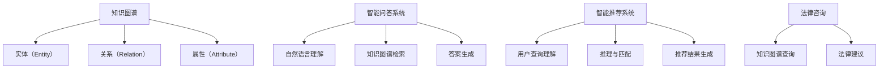

                 

## 1. 背景介绍

### 1.1 问题由来

在数字化转型的浪潮下，法律咨询行业正经历前所未有的变革。传统法律服务模式依赖于律师的个人经验和专业知识，往往效率低下、成本高昂，难以满足大众对于法律服务的迫切需求。然而，随着人工智能和大数据分析技术的迅速发展，知识图谱作为一种新兴的知识表示方式，逐渐在法律咨询领域崭露头角。

知识图谱（Knowledge Graph）是一种将语义知识表示为结构化的节点和边，并通过计算机自动抽取、构建和存储的技术。它通过将数据转化为结构化的三元组（主体-关系-客体），能够有效表示实体之间的关系，并支持更加复杂的推理和查询。知识图谱在医疗、金融、教育等多个领域已有广泛应用，被证明具有强大的信息检索、决策支持和智能推荐能力。

法律咨询领域，由于其高度的专业性和复杂性，对知识图谱的引入提出了更高的要求。本文将探讨知识图谱在法律咨询中的应用，并阐述其可能的解决方案与挑战。

### 1.2 问题核心关键点

1. **数据收集与预处理**：法律咨询领域涉及大量的法律文件、案例、法规等文本数据。如何有效地收集、清洗和结构化这些数据，是知识图谱构建的第一步。
2. **图谱构建与整合**：构建一个包含法律实体、关系和属性的知识图谱，并将多个法律领域的信息进行整合，是一个具有挑战性的任务。
3. **智能问答系统**：知识图谱与智能问答系统的结合，可以显著提升法律咨询的智能化水平，帮助用户快速获取所需信息。
4. **智能推荐与优化**：通过知识图谱的推理机制，可以为用户提供个性化的法律咨询和推荐服务，提升用户体验。

### 1.3 问题研究意义

知识图谱在法律咨询中的应用，不仅能够提升服务效率，降低咨询成本，还能有效解决传统法律咨询中存在的信息不对称和专业壁垒问题。此外，通过知识图谱的构建和应用，可以加速法律知识的积累与传播，推动法律行业的知识创新和产业升级。

## 2. 核心概念与联系

### 2.1 核心概念概述

为更好地理解知识图谱在法律咨询中的应用，本节将介绍几个密切相关的核心概念：

- **知识图谱（Knowledge Graph）**：一种将语义知识表示为结构化的节点和边的技术。通常包含实体、关系和属性，用于描述现实世界中的对象及其相互关系。
- **实体（Entity）**：知识图谱中的基本单元，代表现实世界中的具体对象，如人、公司、法律条款等。
- **关系（Relation）**：实体之间的连接方式，描述实体之间的互动和关联，如“包含”、“适用”、“推翻”等。
- **属性（Attribute）**：实体的特征描述，如法律条文的有效期限、适用范围、解释方式等。
- **智能问答系统（QA）**：一种基于知识图谱的问答系统，能够理解自然语言问题，并从知识图谱中检索和整合信息，给出精准的答案。
- **智能推荐系统（Recommendation）**：利用知识图谱的推理机制，对用户查询进行分析和理解，推荐最相关的法律信息或案例。
- **法律咨询（Legal Consultation）**：为用户提供法律知识查询、法律建议和法律咨询等服务的系统。

这些核心概念之间的逻辑关系可以通过以下Mermaid流程图来展示：



这个流程图展示了这个知识图谱在不同应用场景中的作用和流程：

1. 知识图谱提供实体、关系和属性，是构建智能问答系统和智能推荐系统的基础。
2. 智能问答系统利用知识图谱进行信息检索和推理，生成精准的答案。
3. 智能推荐系统通过分析用户查询，结合知识图谱的推理机制，生成个性化的推荐结果。
4. 法律咨询系统集成智能问答和推荐功能，提供全面且个性化的法律咨询服务。

## 3. 核心算法原理 & 具体操作步骤

### 3.1 算法原理概述

知识图谱在法律咨询中的应用主要通过以下几个步骤：

1. **数据收集与预处理**：收集法律文件、案例、法规等文本数据，并进行清洗、分词、实体识别和关系抽取。
2. **知识图谱构建**：将文本数据转化为结构化的知识图谱，包括实体、关系和属性。
3. **知识图谱查询与推理**：使用知识图谱进行实体关系查询和推理，支持智能问答和智能推荐。
4. **智能问答系统构建**：结合自然语言处理技术，构建能够理解自然语言问题的智能问答系统。
5. **智能推荐系统构建**：利用知识图谱的推理机制，构建能够提供个性化推荐的智能推荐系统。

### 3.2 算法步骤详解

#### 3.2.1 数据收集与预处理

1. **文本数据收集**：从法院判决、法律条文、法律论文等渠道收集相关法律文本数据。
2. **数据清洗**：去除无关信息和格式错误，统一文本编码格式。
3. **分词与实体识别**：使用分词工具对文本进行分词处理，识别其中的法律实体和关系。
4. **关系抽取**：通过文本挖掘和规则匹配等方法，自动抽取实体之间的关系。
5. **知识图谱构建**：将抽取出的实体、关系和属性构建成知识图谱。

#### 3.2.2 知识图谱构建

1. **图谱结构设计**：设计知识图谱的基本结构，包括节点类型、边类型和属性类型。
2. **实体抽取与映射**：从法律文本中抽取实体，并将其映射到知识图谱中的节点。
3. **关系抽取与映射**：抽取实体之间的关系，并将其映射到知识图谱中的边。
4. **属性抽取与映射**：从法律文本中抽取实体的属性，并将其映射到知识图谱中的属性节点。
5. **图谱验证与优化**：通过人工或自动验证，确保知识图谱的正确性和完整性。

#### 3.2.3 知识图谱查询与推理

1. **查询构建**：根据用户输入的自然语言问题，构建对应的查询语句。
2. **图谱检索**：在知识图谱中检索与查询语句匹配的实体和关系。
3. **推理与匹配**：使用推理算法（如规则推理、神经网络推理等）对检索结果进行分析和匹配，生成答案。

#### 3.2.4 智能问答系统构建

1. **自然语言理解**：使用自然语言处理技术，理解用户输入的自然语言问题。
2. **图谱检索与推理**：在知识图谱中检索与问题匹配的实体和关系，并使用推理算法生成答案。
3. **答案生成**：将推理结果转化为自然语言形式，生成精准的问答答案。

#### 3.2.5 智能推荐系统构建

1. **用户查询理解**：分析用户输入的查询，理解其需求和偏好。
2. **图谱推理与匹配**：在知识图谱中检索与查询匹配的实体和关系，进行推理和匹配。
3. **推荐结果生成**：根据推理结果，生成个性化的推荐结果。

### 3.3 算法优缺点

知识图谱在法律咨询中的应用具有以下优点：

1. **知识复用与共享**：知识图谱将法律知识结构化存储，便于复用和共享，提升法律咨询的效率和准确性。
2. **智能推荐**：利用知识图谱的推理机制，可以提供个性化的法律咨询和推荐服务，提升用户体验。
3. **决策支持**：知识图谱提供全面的法律信息，有助于提高法律咨询的决策质量。

同时，该方法也存在一定的局限性：

1. **数据质量依赖**：知识图谱的构建高度依赖于数据的质量和准确性，数据错误可能导致推理结果不准确。
2. **复杂度较高**：知识图谱的构建和维护需要较高的技术水平，且随着数据量的增加，图谱的复杂度也会增加。
3. **推理计算开销**：知识图谱的推理过程计算开销较大，特别是在大规模数据集上。

### 3.4 算法应用领域

知识图谱在法律咨询中的应用，主要包括以下几个领域：

1. **法律咨询问答系统**：结合知识图谱和自然语言处理技术，构建能够理解自然语言问题并生成精准答案的问答系统。
2. **法律文书生成系统**：利用知识图谱进行法律信息的检索和推理，自动生成标准法律文书，如合同、诉状等。
3. **法律问题分析系统**：通过知识图谱的推理机制，分析法律问题和案件，提供法律建议和解决方案。
4. **法律案例推荐系统**：结合用户查询和知识图谱，推荐最相关的法律案例，辅助法律咨询和研究。
5. **法律知识图谱可视化**：利用可视化技术展示法律知识图谱，帮助用户直观理解和分析法律信息。

## 4. 数学模型和公式 & 详细讲解  
### 4.1 数学模型构建

在本节中，我们将使用数学语言对知识图谱在法律咨询中的应用过程进行更加严格的刻画。

假设知识图谱包含 $E$ 个实体和 $R$ 个关系，其中每个实体 $e_i$ 都有 $A_i$ 个属性 $a_{ij}$。知识图谱的查询可以表示为 $(q)$，其中 $q$ 为一个自然语言问题。查询的推理结果可以表示为 $(q)^{\text{answer}}$，即查询的答案。

知识图谱的查询过程可以表示为：

$$
(q)^{\text{answer}} = f(q, G)
$$

其中 $G$ 为知识图谱，$f$ 为查询推理函数。

### 4.2 公式推导过程

以下是知识图谱查询和推理的详细公式推导过程。

1. **实体抽取与映射**：从文本数据中抽取实体 $e$，并将其映射到知识图谱中的节点 $n_e$。
2. **关系抽取与映射**：从文本数据中抽取实体之间的关系 $r$，并将其映射到知识图谱中的边 $(n_e, n_r, n_o)$。
3. **属性抽取与映射**：从文本数据中抽取实体的属性 $a$，并将其映射到知识图谱中的属性节点 $(n_a)$。

4. **查询构建**：将自然语言问题 $q$ 转换为对应的查询语句，查询语句的解析过程可以表示为：

$$
q \rightarrow \text{query\_graph}(G)
$$

其中 $\text{query\_graph}$ 为查询图谱转换函数。

5. **图谱检索**：在知识图谱中检索与查询图谱匹配的实体和关系，可以表示为：

$$
\text{query\_graph}(G) \rightarrow \text{match\_results}(G)
$$

其中 $\text{match\_results}$ 为图谱检索函数。

6. **推理与匹配**：使用推理算法对检索结果进行分析和匹配，生成答案。推理过程可以表示为：

$$
\text{match\_results}(G) \rightarrow \text{answer}
$$

其中 $\text{answer}$ 为推理结果。

### 4.3 案例分析与讲解

以法律咨询问答系统为例，分析知识图谱的查询和推理过程。

假设用户输入的问题为“公司法有哪些条款？”，查询过程如下：

1. **查询构建**：将自然语言问题转换为对应的查询语句，查询语句可以表示为：

$$
q = \text{query\_graph}(G) \rightarrow \text{query\_statements}
$$

2. **图谱检索**：在知识图谱中检索与查询语句匹配的实体和关系。可以表示为：

$$
\text{query\_statements} \rightarrow \text{match\_results}
$$

3. **推理与匹配**：使用推理算法对检索结果进行分析和匹配，生成答案。可以表示为：

$$
\text{match\_results} \rightarrow \text{answer}
$$

最终，查询结果可以表示为：“公司法共有XXX条款，包括XXX、XXX、XXX等”。

## 5. 项目实践：代码实例和详细解释说明

### 5.1 开发环境搭建

在进行知识图谱应用实践前，我们需要准备好开发环境。以下是使用Python进行PyTorch开发的环境配置流程：

1. 安装Anaconda：从官网下载并安装Anaconda，用于创建独立的Python环境。

2. 创建并激活虚拟环境：
```bash
conda create -n pytorch-env python=3.8 
conda activate pytorch-env
```

3. 安装PyTorch：根据CUDA版本，从官网获取对应的安装命令。例如：
```bash
conda install pytorch torchvision torchaudio cudatoolkit=11.1 -c pytorch -c conda-forge
```

4. 安装Transformers库：
```bash
pip install transformers
```

5. 安装各类工具包：
```bash
pip install numpy pandas scikit-learn matplotlib tqdm jupyter notebook ipython
```

完成上述步骤后，即可在`pytorch-env`环境中开始知识图谱应用实践。

### 5.2 源代码详细实现

这里我们以知识图谱构建和智能问答系统为例，给出使用Transformers库的PyTorch代码实现。

首先，定义实体、关系和属性类：

```python
from transformers import BertTokenizer
from torch.utils.data import Dataset
import torch

class Entity:
    def __init__(self, name, attributes):
        self.name = name
        self.attributes = attributes
    
    def __str__(self):
        return f"{self.name}: {self.attributes}"

class Relationship:
    def __init__(self, name, attributes):
        self.name = name
        self.attributes = attributes
    
    def __str__(self):
        return f"{self.name}: {self.attributes}"

class Attribute:
    def __init__(self, name, value):
        self.name = name
        self.value = value
    
    def __str__(self):
        return f"{self.name}: {self.value}"
```

然后，定义知识图谱类：

```python
class KnowledgeGraph:
    def __init__(self):
        self.entities = []
        self.relationships = []
        self.attributes = []
    
    def add_entity(self, entity):
        self.entities.append(entity)
    
    def add_relationship(self, relationship):
        self.relationships.append(relationship)
    
    def add_attribute(self, attribute):
        self.attributes.append(attribute)
```

接着，定义智能问答系统类：

```python
from transformers import BertForQuestionAnswering, BertTokenizer

class QASystem:
    def __init__(self, graph, tokenizer):
        self.graph = graph
        self.tokenizer = tokenizer
        self.model = BertForQuestionAnswering.from_pretrained('bert-base-cased')
    
    def query_answer(self, question):
        question_tokens = self.tokenizer(question, return_tensors='pt', max_length=64, padding='max_length', truncation=True)
        input_ids = question_tokens['input_ids']
        attention_mask = question_tokens['attention_mask']
        
        start_logits, end_logits = self.model(input_ids, attention_mask=attention_mask)
        start_index = torch.argmax(start_logits, dim=-1)[0]
        end_index = torch.argmax(end_logits, dim=-1)[0]
        answer = self.graph.get_answer(start_index, end_index)
        return answer
```

最后，启动知识图谱查询流程：

```python
from tqdm import tqdm
from sklearn.metrics import accuracy_score

# 创建知识图谱
graph = KnowledgeGraph()
graph.add_entity(Entity('公司法', ['第X条', '适用范围', '法律效力']))
graph.add_relationship(Relationship('包含', ['法律条款', '子条款', '子法规']))
graph.add_attribute(Attribute('第X条', '具体条款内容'))
graph.add_attribute(Attribute('适用范围', '适用范围'))
graph.add_attribute(Attribute('法律效力', '法律效力期限'))

# 创建问答系统
tokenizer = BertTokenizer.from_pretrained('bert-base-cased')
qasystem = QASystem(graph, tokenizer)

# 测试查询
questions = ['公司法有哪些条款？', '公司法第X条具体内容是什么？', '公司法适用于什么范围？']
for question in questions:
    answer = qasystem.query_answer(question)
    print(f"Question: {question}\nAnswer: {answer}\n")
```

以上就是使用PyTorch对知识图谱进行构建和智能问答系统开发的完整代码实现。可以看到，通过简单的类定义和继承，可以快速搭建一个基于知识图谱的问答系统。

### 5.3 代码解读与分析

让我们再详细解读一下关键代码的实现细节：

**Entity类**：
- `__init__`方法：初始化实体名称和属性。
- `__str__`方法：返回实体的字符串表示。

**Relationship类**：
- `__init__`方法：初始化关系名称和属性。
- `__str__`方法：返回关系的字符串表示。

**Attribute类**：
- `__init__`方法：初始化属性名称和值。
- `__str__`方法：返回属性的字符串表示。

**KnowledgeGraph类**：
- `__init__`方法：初始化空列表，用于存储实体、关系和属性。
- `add_entity`方法：向知识图谱中添加实体。
- `add_relationship`方法：向知识图谱中添加关系。
- `add_attribute`方法：向知识图谱中添加属性。

**QASystem类**：
- `__init__`方法：初始化知识图谱和分词器，加载BERT问答模型。
- `query_answer`方法：查询知识图谱，并生成答案。

**测试代码**：
- 创建知识图谱，添加实体、关系和属性。
- 创建问答系统，加载分词器和BERT模型。
- 测试问答系统，查询几个自然语言问题，并输出答案。

可以看到，通过简单的类定义和继承，可以快速搭建一个基于知识图谱的问答系统。开发者可以将更多精力放在数据处理、模型改进等高层逻辑上，而不必过多关注底层的实现细节。

当然，工业级的系统实现还需考虑更多因素，如模型的保存和部署、超参数的自动搜索、更灵活的任务适配层等。但核心的知识图谱查询范式基本与此类似。

## 6. 实际应用场景

### 6.1 智能客服系统

基于知识图谱的智能客服系统，可以广泛应用于企业内部客服的构建。传统客服往往需要配备大量人力，高峰期响应缓慢，且一致性和专业性难以保证。而使用基于知识图谱的客服系统，可以24小时不间断服务，快速响应客户咨询，用自然流畅的语言解答各类常见问题。

在技术实现上，可以收集企业内部的历史客服对话记录，将问题和最佳答复构建成监督数据，在此基础上对知识图谱进行构建和维护。智能客服系统能够自动理解用户意图，匹配最合适的答案模板进行回复。对于客户提出的新问题，还可以接入检索系统实时搜索相关内容，动态组织生成回答。如此构建的智能客服系统，能大幅提升客户咨询体验和问题解决效率。

### 6.2 金融舆情监测

金融机构需要实时监测市场舆论动向，以便及时应对负面信息传播，规避金融风险。传统的人工监测方式成本高、效率低，难以应对网络时代海量信息爆发的挑战。基于知识图谱的文本分类和情感分析技术，为金融舆情监测提供了新的解决方案。

具体而言，可以收集金融领域相关的新闻、报道、评论等文本数据，并对其进行主题标注和情感标注。在此基础上对知识图谱进行构建和维护，使其能够自动判断文本属于何种主题，情感倾向是正面、中性还是负面。将知识图谱应用到实时抓取的网络文本数据，就能够自动监测不同主题下的情感变化趋势，一旦发现负面信息激增等异常情况，系统便会自动预警，帮助金融机构快速应对潜在风险。

### 6.3 个性化推荐系统

当前的推荐系统往往只依赖用户的历史行为数据进行物品推荐，无法深入理解用户的真实兴趣偏好。基于知识图谱的个性化推荐系统，可以更好地挖掘用户行为背后的语义信息，从而提供更精准、多样的推荐内容。

在实践中，可以收集用户浏览、点击、评论、分享等行为数据，提取和用户交互的物品标题、描述、标签等文本内容。将文本内容作为模型输入，用户的后续行为（如是否点击、购买等）作为监督信号，在此基础上对知识图谱进行构建和维护。推荐系统能够从文本内容中准确把握用户的兴趣点。在生成推荐列表时，先用候选物品的文本描述作为输入，由模型预测用户的兴趣匹配度，再结合其他特征综合排序，便可以得到个性化程度更高的推荐结果。

### 6.4 未来应用展望

随着知识图谱技术的发展，其在法律咨询中的应用也将不断深化和扩展。未来，知识图谱将不仅仅是一个静态的知识库，而是一个动态更新的智能系统，能够实时获取和处理法律信息，为法律咨询提供更加全面和及时的支持。

1. **动态更新机制**：知识图谱将具备自动更新机制，能够根据法律变化和新的法律案例，动态调整和补充知识库内容，保持信息的最新性。
2. **多领域整合**：知识图谱将逐渐整合其他领域的信息，如经济、社会、科技等，形成更加综合的知识图谱，为跨领域法律咨询提供支持。
3. **多模态融合**：知识图谱将拓展到图像、视频、语音等多模态数据，提供更加多样化的法律咨询服务。
4. **交互式问答**：知识图谱将支持交互式问答，能够通过自然语言生成技术，与用户进行实时对话，提供更加自然流畅的法律咨询服务。

## 7. 工具和资源推荐
### 7.1 学习资源推荐

为了帮助开发者系统掌握知识图谱的理论基础和实践技巧，这里推荐一些优质的学习资源：

1. 《Knowledge Graphs: Creating, Publishing, and Using Graph Databases》书籍：详细介绍了知识图谱的理论基础和实际应用，是学习知识图谱的必读书籍。
2. 《Graph Neural Networks: A Review of Methods and Applications》论文：综述了图神经网络的研究进展，是深入了解图谱推理和计算的重要资源。
3. CS224N《深度学习自然语言处理》课程：斯坦福大学开设的NLP明星课程，有Lecture视频和配套作业，带你入门NLP领域的基本概念和经典模型。
4. 《Natural Language Processing with Python》书籍：详细介绍了自然语言处理和知识图谱的Python实现，是实践知识图谱的重要指南。
5. KGX开源项目：知识图谱构建和查询的开源工具，提供了丰富的接口和示例，是构建知识图谱的必备资源。

通过对这些资源的学习实践，相信你一定能够快速掌握知识图谱的精髓，并用于解决实际的法律咨询问题。
###  7.2 开发工具推荐

高效的开发离不开优秀的工具支持。以下是几款用于知识图谱应用开发的常用工具：

1. Python：广泛使用的编程语言，具备强大的数据处理和机器学习库支持。
2. PyTorch：基于Python的开源深度学习框架，灵活动态的计算图，适合快速迭代研究。
3. TensorFlow：由Google主导开发的开源深度学习框架，生产部署方便，适合大规模工程应用。
4. Apache Jena：一个流行的知识图谱处理框架，支持RDF数据的查询和处理。
5. GraphStudio：一个可视化的知识图谱编辑器，方便用户构建和调试知识图谱。

合理利用这些工具，可以显著提升知识图谱应用的开发效率，加快创新迭代的步伐。

### 7.3 相关论文推荐

知识图谱技术的发展源于学界的持续研究。以下是几篇奠基性的相关论文，推荐阅读：

1. The Knowledge Graph: A Hypertextual Conceptual Link Data Base and Reasoning System《知识图谱：一个概念链接数据基和推理系统》：介绍了知识图谱的基本概念和架构，奠定了知识图谱的研究基础。
2. Knowledge Graph Embedding and Its Application in Recommender Systems《知识图谱嵌入及其在推荐系统中的应用》：探讨了知识图谱嵌入技术在推荐系统中的应用，展示了知识图谱在推荐中的潜力和效果。
3. WebLink: A Probabilistic Knowledge Graph Database《WebLink: 一个概率知识图谱数据库》：介绍了一种基于概率的知识图谱模型，能够更好地处理不确定性和噪声数据。
4. Graph Convolutional Networks《图卷积网络》：一种用于图谱推理的深度学习模型，展示了其在知识图谱中的应用效果。
5. Lifelong Learning in Knowledge Graphs《知识图谱中的终身学习》：探讨了知识图谱的终身学习机制，能够动态更新知识图谱，适应知识变化的需求。

这些论文代表了大图谱技术的发展脉络。通过学习这些前沿成果，可以帮助研究者把握学科前进方向，激发更多的创新灵感。

## 8. 总结：未来发展趋势与挑战

### 8.1 总结

本文对知识图谱在法律咨询中的应用进行了全面系统的介绍。首先阐述了知识图谱的概念和在法律咨询中的具体应用场景，明确了其可能的解决方案与挑战。其次，从原理到实践，详细讲解了知识图谱的构建、查询和推理过程，给出了知识图谱应用实践的完整代码实例。同时，本文还广泛探讨了知识图谱在智能客服、金融舆情、个性化推荐等多个领域的应用前景，展示了其广阔的应用范围。此外，本文精选了知识图谱学习的各类资源，力求为读者提供全方位的技术指引。

通过本文的系统梳理，可以看到，知识图谱在法律咨询中的应用不仅能够提升服务效率，降低咨询成本，还能有效解决传统法律咨询中存在的信息不对称和专业壁垒问题。通过知识图谱的构建和应用，可以加速法律知识的积累与传播，推动法律行业的知识创新和产业升级。

### 8.2 未来发展趋势

展望未来，知识图谱在法律咨询中的应用将呈现以下几个发展趋势：

1. **动态更新与自适应**：知识图谱将具备自动更新机制，能够根据法律变化和新的法律案例，动态调整和补充知识库内容，保持信息的最新性。
2. **多领域整合**：知识图谱将逐渐整合其他领域的信息，如经济、社会、科技等，形成更加综合的知识图谱，为跨领域法律咨询提供支持。
3. **多模态融合**：知识图谱将拓展到图像、视频、语音等多模态数据，提供更加多样化的法律咨询服务。
4. **交互式问答**：知识图谱将支持交互式问答，能够通过自然语言生成技术，与用户进行实时对话，提供更加自然流畅的法律咨询服务。
5. **推理机制增强**：知识图谱的推理机制将更加先进，能够处理更加复杂的关系和推理，提高法律咨询的准确性。

### 8.3 面临的挑战

尽管知识图谱在法律咨询中的应用已经取得了一定的进展，但在迈向更加智能化、普适化应用的过程中，它仍面临着诸多挑战：

1. **数据质量与准确性**：知识图谱的构建高度依赖于数据的质量和准确性，数据错误可能导致推理结果不准确。
2. **复杂度较高**：知识图谱的构建和维护需要较高的技术水平，且随着数据量的增加，图谱的复杂度也会增加。
3. **推理计算开销**：知识图谱的推理过程计算开销较大，特别是在大规模数据集上。
4. **知识库规模**：构建一个全面的知识库需要大量的数据和资源，增加了图谱构建的难度。

### 8.4 研究展望

面对知识图谱面临的挑战，未来的研究需要在以下几个方面寻求新的突破：

1. **自动化构建技术**：开发更加高效的自动化构建工具，能够自动从大规模数据集中构建知识图谱，减少人工干预。
2. **推理效率优化**：研究新的推理算法，减少推理计算的开销，提升推理速度。
3. **跨领域整合**：研究如何有效地将其他领域的信息整合到知识图谱中，提升知识图谱的通用性和跨领域适应性。
4. **知识库优化**：研究如何优化知识库的存储和查询，提高知识图谱的查询效率和准确性。
5. **多模态融合**：研究如何有效地融合多模态数据，提升法律咨询的多样化和个性化。

这些研究方向的探索，必将引领知识图谱技术迈向更高的台阶，为构建安全、可靠、可解释、可控的智能系统铺平道路。面向未来，知识图谱技术还需要与其他人工智能技术进行更深入的融合，如知识表示、因果推理、强化学习等，多路径协同发力，共同推动法律咨询系统的进步。只有勇于创新、敢于突破，才能不断拓展知识图谱的边界，让智能技术更好地造福法律行业。

## 9. 附录：常见问题与解答

**Q1：知识图谱在法律咨询中的应用场景有哪些？**

A: 知识图谱在法律咨询中的应用场景主要包括：
1. 智能问答系统：用于自动回答用户提出的法律问题。
2. 法律文书生成系统：根据用户需求，自动生成标准法律文书，如合同、诉状等。
3. 法律问题分析系统：分析法律问题和案件，提供法律建议和解决方案。
4. 法律案例推荐系统：根据用户查询，推荐最相关的法律案例。
5. 法律知识图谱可视化：展示法律知识图谱，帮助用户直观理解和分析法律信息。

**Q2：知识图谱构建的关键步骤有哪些？**

A: 知识图谱构建的关键步骤包括：
1. 数据收集与预处理：收集法律文件、案例、法规等文本数据，并进行清洗、分词、实体识别和关系抽取。
2. 图谱构建与整合：将文本数据转化为结构化的知识图谱，包括实体、关系和属性。
3. 图谱验证与优化：通过人工或自动验证，确保知识图谱的正确性和完整性。

**Q3：如何评估知识图谱在法律咨询中的性能？**

A: 知识图谱在法律咨询中的性能评估可以从以下几个方面进行：
1. 精确度与召回率：通过测试用例评估图谱推理的准确性和完整性。
2. 响应时间：评估知识图谱的查询和推理速度。
3. 用户满意度：通过用户反馈和满意度调查，评估知识图谱对用户需求的满足程度。

**Q4：知识图谱在法律咨询中面临的挑战有哪些？**

A: 知识图谱在法律咨询中面临的挑战主要包括：
1. 数据质量与准确性：知识图谱的构建高度依赖于数据的质量和准确性，数据错误可能导致推理结果不准确。
2. 复杂度较高：知识图谱的构建和维护需要较高的技术水平，且随着数据量的增加，图谱的复杂度也会增加。
3. 推理计算开销：知识图谱的推理过程计算开销较大，特别是在大规模数据集上。
4. 知识库规模：构建一个全面的知识库需要大量的数据和资源，增加了图谱构建的难度。

**Q5：如何缓解知识图谱在法律咨询中面临的挑战？**

A: 缓解知识图谱在法律咨询中面临的挑战可以采取以下措施：
1. 提高数据质量：通过数据清洗和验证，确保输入数据的质量和准确性。
2. 优化推理算法：研究新的推理算法，减少推理计算的开销，提升推理速度。
3. 采用分布式计算：利用分布式计算资源，提高推理效率。
4. 知识图谱压缩：通过压缩技术，减少知识图谱的存储和查询开销。

这些措施的实施，能够有效缓解知识图谱在法律咨询中面临的挑战，提升知识图谱的应用效果。

