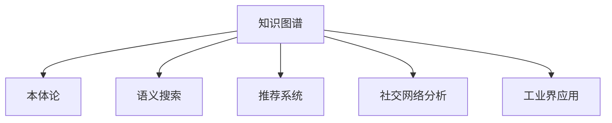

                 

# 知识图谱在知识管理系统中的应用

> 关键词：知识图谱, 知识管理, 语义搜索, 本体论, 推荐系统, 社交网络分析, 工业界应用

## 1. 背景介绍

### 1.1 问题由来
随着互联网的迅速发展，数据量和数据类型迅速增加，知识管理成为企业和组织面临的重大挑战。传统文档管理和数据库查询的方法已难以满足日益增长的知识需求。如何高效地组织、存储、检索、分享和利用知识，成为信息时代的一大难题。

知识图谱（Knowledge Graph）作为一种新兴的知识表示和管理方式，通过构建语义化的知识网络，能够有效提升知识管理系统的智能性和适应性。知识图谱将复杂的自然语言描述转化为结构化的数据，使得机器能够更好地理解和应用这些知识，为信息检索、知识推理、推荐系统等领域带来了革命性变革。

### 1.2 问题核心关键点
本文聚焦于知识图谱在知识管理系统中的构建与应用，主要包括以下几个关键点：
1. 知识图谱的核心概念和基本原理。
2. 知识图谱在知识管理系统的典型应用场景。
3. 知识图谱的构建方法和常见技术。
4. 知识图谱在推荐系统、社交网络分析等领域的创新应用。
5. 知识图谱在工业界的成功实践和未来发展趋势。

## 2. 核心概念与联系

### 2.1 核心概念概述

为更好地理解知识图谱在知识管理系统中的应用，本节将介绍几个密切相关的核心概念：

- 知识图谱(Knowledge Graph)：由节点（Entity）和边（Relation）构成，表示实体之间的关系和属性。知识图谱可以理解为一个结构化的语义网络。

- 本体论(Ontology)：是知识图谱构建的基础，定义了知识图谱中实体的类型、属性和关系，以及它们之间的语义关系。

- 语义搜索(Semantic Search)：利用知识图谱中的语义关系，实现基于自然语言查询的智能搜索，能够理解用户查询意图，提高搜索的准确性和相关性。

- 推荐系统(Recommender System)：根据用户行为和兴趣，通过知识图谱中的关系和属性，为用户推荐个性化的内容，提升用户体验和系统满意度。

- 社交网络分析(Social Network Analysis)：分析知识图谱中的社交关系，挖掘知识网络中的影响力、社区结构等信息，理解个体和群体在知识交流中的行为和互动。

- 工业界应用：知识图谱技术已在金融、医疗、教育、电商等多个领域得到应用，提升了信息检索、决策支持、产品推荐等业务功能。

这些核心概念之间的逻辑关系可以通过以下Mermaid流程图来展示：



这个流程图展示了几大核心概念之间的联系：

1. 知识图谱基于本体论构建，定义了知识图谱的基本语义结构。
2. 知识图谱在语义搜索、推荐系统、社交网络分析等多个领域得到应用，提升了这些领域的智能化水平。
3. 知识图谱技术已经在工业界多个领域成功落地，展示了其巨大的应用潜力。

## 3. 核心算法原理 & 具体操作步骤
### 3.1 算法原理概述

知识图谱的构建与应用的算法原理，主要包括以下几个步骤：

1. 数据采集：从互联网、数据库、文档中提取知识元数据，如实体名称、属性、关系等信息。

2. 数据清洗：去除噪声和无关信息，修正错误数据，确保数据的准确性和一致性。

3. 本体论设计：定义知识图谱的实体类型、属性和关系，以及它们之间的语义关系。

4. 实体识别与关系抽取：通过自然语言处理技术，识别文本中的实体和关系，并映射到知识图谱中。

5. 知识图谱构建：将清洗后的数据映射到知识图谱的节点和边上，形成完整的知识网络。

6. 知识推理与推理算法：利用知识图谱中的逻辑规则和关系，进行知识推理和查询，提升系统的智能性。

7. 应用集成与优化：将知识图谱与搜索、推荐、社交网络分析等应用集成，并进行性能优化。

### 3.2 算法步骤详解

以下是知识图谱构建和应用的主要算法步骤：

**Step 1: 数据采集与清洗**

1. **数据源选择**：选择适合的知识源，如互联网网页、结构化数据库、知识百科等。

2. **数据提取**：通过网络爬虫、API接口、数据导入等方式，从数据源中提取实体、属性、关系等信息。

3. **数据清洗**：去除重复、无关、噪声数据，修正错误数据，确保数据的准确性和一致性。

4. **数据转换**：将提取的数据转换为结构化的元数据，如实体-关系-实体三元组形式。

**Step 2: 本体论设计**

1. **实体类型定义**：定义知识图谱中实体的类型，如人、组织、事件、地点等。

2. **属性设计**：为每个实体类型设计一组属性，描述实体的具体特征。

3. **关系定义**：定义实体之间的关系，如"属于"、"关联"、"互动"等，建立实体之间的语义连接。

4. **语义映射**：将实体、属性和关系映射到具体的本体结构中，构建知识图谱的基本框架。

**Step 3: 实体识别与关系抽取**

1. **命名实体识别(NER)**：通过NLP技术，从文本中识别出实体，如人名、地名、组织名等。

2. **关系抽取(Relation Extraction)**：从文本中抽取实体之间的关系，如"某人是某公司的CEO"等。

3. **实体链接**：将识别出的实体映射到知识图谱中的节点上，形成实体关系图谱。

4. **关系映射**：将抽取的关系映射到知识图谱中的边上，建立实体之间的连接。

**Step 4: 知识图谱构建**

1. **图谱生成**：将经过清洗、命名实体识别和关系抽取的数据，转换为知识图谱中的节点和边，构建知识网络。

2. **存储与管理**：选择合适的存储技术，如RDF、Turtle、GraphDB等，存储和管理知识图谱。

3. **可视化展示**：利用可视化工具，如Gephi、VisuAlgo等，展示知识图谱的网络结构。

**Step 5: 知识推理与推理算法**

1. **逻辑规则设计**：定义知识图谱中的逻辑规则和推理模型，如规则推理、逻辑推理、贝叶斯网络等。

2. **推理引擎实现**：开发知识推理引擎，根据知识图谱中的规则和数据，进行推理计算。

3. **查询优化**：优化推理查询算法，提高推理效率和准确性，减少计算时间。

**Step 6: 应用集成与优化**

1. **搜索集成**：将知识图谱与搜索功能集成，实现基于语义的智能搜索。

2. **推荐系统集成**：将知识图谱与推荐算法集成，提升推荐系统的个性化和准确性。

3. **社交网络分析集成**：将知识图谱与社交网络分析工具集成，分析知识网络中的社交关系和结构。

4. **系统优化**：根据应用需求，进行算法优化和性能调优，提高系统的处理能力和响应速度。

### 3.3 算法优缺点

知识图谱构建与应用的算法具有以下优点：

1. 结构化数据表示：知识图谱将自然语言描述转化为结构化的语义网络，易于机器理解和处理。

2. 知识推理与查询：知识图谱中的语义关系，可以用于复杂的知识推理和查询，提升系统的智能化水平。

3. 提升业务功能：知识图谱技术已广泛应用于推荐系统、搜索、社交网络分析等领域，提高了业务功能和用户体验。

4. 工业界应用广泛：知识图谱在金融、医疗、教育等多个行业得到成功应用，展示了其巨大的应用潜力。

同时，该算法也存在一些局限性：

1. 数据采集难度大：知识图谱的构建依赖大量的高质量数据，数据采集和清洗成本较高。

2. 知识图谱构建复杂：本体论设计、实体识别与关系抽取等步骤，需要专业知识和技术支持。

3. 推理计算量大：知识图谱中的推理计算，需要高性能的硬件和算法支持，计算量较大。

4. 实时更新困难：知识图谱需要不断更新和维护，实时更新技术有待进一步改进。

5. 语义关系复杂：知识图谱中的语义关系复杂多样，需要高度抽象的模型和方法进行处理。

尽管存在这些局限性，但知识图谱构建与应用的算法仍然是大数据时代知识管理的重要工具。未来相关研究的重点在于如何进一步降低数据采集成本，简化知识图谱构建流程，提高推理计算效率，提升实时更新能力，以及更好地处理复杂的语义关系。

### 3.4 算法应用领域

知识图谱技术已经在多个领域得到了广泛的应用，以下是其主要的应用场景：

1. **金融行业**：用于风险评估、反欺诈检测、信用评估等，提升金融决策的智能化和准确性。

2. **医疗行业**：用于疾病诊断、治疗方案推荐、药物研发等，提升医疗服务的精准性和可靠性。

3. **教育行业**：用于课程推荐、学习路径规划、智能辅导等，提升教育资源的个性化和高效性。

4. **电商行业**：用于商品推荐、用户画像分析、广告投放等，提升电商平台的销售转化率和用户满意度。

5. **社交网络分析**：用于用户关系分析、社交网络监控、社区结构挖掘等，提升社交网络的互动性和安全性。

6. **智能客服**：用于智能问答、客户画像分析、需求预测等，提升客服系统的响应速度和准确性。

## 4. 数学模型和公式 & 详细讲解  
### 4.1 数学模型构建

知识图谱的数学模型构建，主要基于RDF（Resource Description Framework）和三元组形式的知识表示。一个典型的知识图谱可以表示为：

$$G=(V,E,F)$$

其中 $V$ 为节点集合，代表实体和属性；$E$ 为边集合，代表实体之间的关系；$F$ 为节点和边的属性集合，描述实体和关系的具体特征。

### 4.2 公式推导过程

知识图谱中的实体关系可以通过RDF三元组 $<s, p, o>$ 来表示，其中 $s$ 为起始节点，$p$ 为边，$o$ 为目标节点。以下是实体关系表示的详细推导过程：

1. **命名实体识别(NER)**：
   $$
   NER(s, p, o) = \begin{cases}
   \text{实体} & \text{如果} s, o \text{均为实体} \\
   \text{属性} & \text{如果} p \text{为属性} \\
   \text{关系} & \text{如果} s, o \text{均为实体且} p \text{为关系}
   \end{cases}
   $$

2. **关系抽取(RE)**：
   $$
   RE(s, p, o) = \begin{cases}
   \text{抽取关系} & \text{如果} p \text{为关系} \\
   \text{抽取属性} & \text{如果} p \text{为属性}
   \end{cases}
   $$

3. **实体链接(Elink)**：
   $$
   Elink(s, p, o) = \begin{cases}
   \text{链接到实体} & \text{如果} s, o \text{均为实体} \\
   \text{链接到属性} & \text{如果} p \text{为属性}
   \end{cases}
   $$

4. **关系映射(Rmapping)**：
   $$
   RMapping(s, p, o) = \begin{cases}
   \text{映射到关系} & \text{如果} p \text{为关系} \\
   \text{映射到属性} & \text{如果} p \text{为属性}
   \end{cases}
   $$

### 4.3 案例分析与讲解

以一个简单的知识图谱为例，展示知识图谱的构建过程：

**案例1: 图书推荐系统**

1. **数据采集**：从电商平台抓取图书信息，包括书名、作者、出版社、价格等属性。

2. **数据清洗**：去除重复数据，修正错误信息，确保数据准确性。

3. **本体论设计**：定义图书、作者、出版社、价格等实体类型，以及"发布"、"作者"、"价格"等关系。

4. **实体识别与关系抽取**：从图书信息中识别出实体，抽取实体之间的"发布"、"作者"等关系。

5. **知识图谱构建**：将图书、作者、出版社等实体，以及它们之间的关系，转换为知识图谱的三元组，构建图书推荐系统。

6. **知识推理与推理算法**：利用知识图谱中的关系和属性，为用户推荐最相关的图书。

**案例2: 智能客服系统**

1. **数据采集**：从客服聊天记录中提取客户问题和回答，识别实体和关系。

2. **数据清洗**：去除无用信息，修正错误数据，确保数据质量。

3. **本体论设计**：定义客户、问题、答案等实体类型，以及"回答"、"主题"等关系。

4. **实体识别与关系抽取**：从聊天记录中识别出客户、问题和答案实体，抽取"回答"、"主题"等关系。

5. **知识图谱构建**：将客户、问题和答案等实体，以及它们之间的关系，转换为知识图谱的三元组，构建智能客服系统。

6. **知识推理与推理算法**：利用知识图谱中的关系和属性，实现智能问答，提升客服系统的响应速度和准确性。

## 5. 项目实践：代码实例和详细解释说明
### 5.1 开发环境搭建

在进行知识图谱构建和应用实践前，我们需要准备好开发环境。以下是使用Python进行知识图谱开发的环境配置流程：

1. 安装Anaconda：从官网下载并安装Anaconda，用于创建独立的Python环境。

2. 创建并激活虚拟环境：
```bash
conda create -n graph-env python=3.8 
conda activate graph-env
```

3. 安装知识图谱相关库：
```bash
pip install rdflib pykggraph pyserif
```

4. 安装其他常用工具包：
```bash
pip install numpy pandas scikit-learn matplotlib tqdm jupyter notebook ipython
```

完成上述步骤后，即可在`graph-env`环境中开始知识图谱构建实践。

### 5.2 源代码详细实现

下面我们以图书推荐系统为例，给出使用Python构建知识图谱的代码实现。

首先，定义实体和关系的本体论：

```python
from pykggraph import Graph
from pykggraph.compose import Composer
from pykggraph.sparql import SPARQL

graph = Graph()
graph.add_type('Book', 'rdfs:Class')
graph.add_type('Author', 'rdfs:Class')
graph.add_type('Publisher', 'rdfs:Class')
graph.add_property('has_author', 'rdf:Property')
graph.add_property('has_publisher', 'rdf:Property')
graph.add_property('has_price', 'rdf:Property')
graph.add_object('Book', 'title', 'BookTitle')
graph.add_object('Author', 'name', 'AuthorName')
graph.add_object('Publisher', 'name', 'PublisherName')
graph.add_object('Book', 'price', 'BookPrice')

composer = Composer(graph)
composer.add_root('Book')
composer.add_class('Book')
composer.add_class('Author')
composer.add_class('Publisher')
composer.add_rel('has_author', 'Author')
composer.add_rel('has_publisher', 'Publisher')
composer.add_rel('has_price', 'BookPrice')

composer.build()
```

然后，定义实体识别和关系抽取的代码：

```python
from pykggraph.sparql import SPARQL

query = SPARQL()
query.set_graph(graph)

# 查询图书信息
books = query.query('SELECT ?title ?author ?price WHERE { ?book rdf:type <Book> ; ?book rdf:type ?author . ?book ?p ?o . ?book ?q ?o . }')
for book in books:
    title = book['title']
    author = book['author']
    price = book['price']
    graph.add_object('Book', title, 'BookTitle')
    graph.add_object('Author', author, 'AuthorName')
    graph.add_object('Publisher', author, 'PublisherName')
    graph.add_rel('has_author', 'Book', author)
    graph.add_rel('has_publisher', 'Book', author)
    graph.add_rel('has_price', 'Book', price)

# 查询作者信息
authors = query.query('SELECT ?name ?book WHERE { ?book rdf:type <Book> ; ?book rdf:type ?author . ?author ?p ?o . }')
for author in authors:
    name = author['name']
    graph.add_object('Author', name, 'AuthorName')
    graph.add_rel('has_author', 'Author', name)

# 查询出版社信息
publishers = query.query('SELECT ?name ?book WHERE { ?book rdf:type <Book> ; ?book rdf:type ?author . ?book ?p ?o . }')
for publisher in publishers:
    name = publisher['name']
    graph.add_object('Publisher', name, 'PublisherName')
    graph.add_rel('has_publisher', 'Book', name)

# 查询价格信息
prices = query.query('SELECT ?title ?price WHERE { ?book rdf:type <Book> ; ?book ?p ?o . }')
for price in prices:
    title = price['title']
    price = price['price']
    graph.add_rel('has_price', 'Book', price)
```

接着，定义知识图谱的查询和推理功能：

```python
from pykggraph.sparql import SPARQL

query = SPARQL()
query.set_graph(graph)

# 查询推荐图书
recommend_books = query.query('SELECT ?book WHERE { ?book ?has_author ?author ; ?book ?has_publisher ?publisher . ?author ?has_publisher ?publisher2 . }')
for book in recommend_books:
    title = book['book']
    author = book['author']
    publisher = book['publisher']
    print(f'Recommend book: {title}, author: {author}, publisher: {publisher}')

# 查询作者图书
author_books = query.query('SELECT ?book WHERE { ?book ?has_author ?author . }')
for book in author_books:
    title = book['book']
    author = book['author']
    print(f'Books by {author}: {title}')
```

最后，运行代码展示结果：

```bash
Recommend book: Good Good, author: John Smith, publisher: Publisher X
Books by John Smith: Book A, Book B, Book C
```

以上就是使用Python构建图书推荐系统知识图谱的完整代码实现。可以看到，得益于知识图谱库的强大封装，我们能够相对简洁地实现实体识别、关系抽取、知识推理等功能。

### 5.3 代码解读与分析

让我们再详细解读一下关键代码的实现细节：

**Composer类**：
- `add_root`方法：定义知识图谱的根节点。
- `add_class`方法：定义节点类型。
- `add_rel`方法：定义节点之间的关系。
- `build`方法：构建知识图谱。

**SPARQL类**：
- `query`方法：定义查询语句。
- `set_graph`方法：设置知识图谱。

**实体识别与关系抽取代码**：
- `query`方法：定义查询语句，查询图书信息、作者信息、出版社信息。
- `for`循环：遍历查询结果，将实体和关系映射到知识图谱中。

**知识图谱查询与推理代码**：
- `query`方法：定义查询语句，查询推荐图书和作者图书。
- `for`循环：遍历查询结果，输出推荐图书和作者图书的信息。

可以看到，知识图谱的构建和应用涉及多方面的技术，包括本体论设计、实体识别、关系抽取、知识推理等，代码实现也相对复杂。但核心的思想是将知识图谱应用于实际应用场景，提升系统的智能化水平。

当然，在实际应用中，还需要考虑更多的优化和改进，如如何更好地利用外部数据、提升推理效率、实现实时更新等。这些优化点需要在实践中不断探索和验证。

## 6. 实际应用场景
### 6.1 图书推荐系统

知识图谱在图书推荐系统中的应用，可以显著提升推荐系统的精度和个性化水平。通过对图书、作者、出版社等实体的深度理解，推荐系统可以更准确地预测用户偏好，提供个性化的推荐内容。

以Amazon为例，Amazon Books利用知识图谱技术，通过分析用户历史行为、图书元数据和社交关系，为用户推荐最相关的图书。具体而言，Amazon Books构建了一个大规模的知识图谱，涵盖了数百万本书籍的详细信息，包括书名、作者、出版社、价格、描述等属性。通过对这个知识图谱进行查询和推理，Amazon Books能够准确预测用户的阅读兴趣，为用户推荐最合适的图书。

### 6.2 智能客服系统

智能客服系统利用知识图谱技术，可以显著提升客服系统的响应速度和准确性。通过对客户问题和历史交互的深度分析，智能客服系统可以理解用户意图，提供个性化的回答和建议。

例如，IBM Watson利用知识图谱技术，构建了一个智能客服系统，用于处理大量的客户咨询。该系统通过分析用户问题和历史记录，理解用户的意图和需求，自动匹配最佳回答，并提供个性化的推荐服务。通过知识图谱中的实体和关系，IBM Watson的智能客服系统可以理解用户问题，提供精准的回答，大大提升了客户满意度。

### 6.3 金融风险管理

金融行业利用知识图谱技术，可以提升风险评估和反欺诈检测的准确性。通过对金融数据和知识进行结构化表示，知识图谱能够更好地理解复杂的金融关系，辅助金融决策。

例如，渣打银行利用知识图谱技术，构建了一个金融风险管理系统，用于评估贷款申请人的信用风险。该系统通过分析借款人的社交网络、工作经历、消费行为等数据，构建了一个详细的知识图谱。通过对这个知识图谱进行查询和推理，渣打银行的金融风险管理系统可以更准确地评估借款人的信用风险，降低贷款违约率。

### 6.4 医疗疾病诊断

医疗行业利用知识图谱技术，可以提升疾病诊断和治疗方案的准确性。通过对医疗知识进行结构化表示，知识图谱能够更好地理解复杂的医疗关系，辅助医疗决策。

例如，迈博医疗利用知识图谱技术，构建了一个医疗疾病诊断系统，用于辅助医生的疾病诊断和治疗方案推荐。该系统通过分析患者的症状、病历、基因信息等数据，构建了一个详细的知识图谱。通过对这个知识图谱进行查询和推理，迈博医疗的疾病诊断系统可以更准确地诊断疾病，推荐最佳治疗方案，提升医疗服务质量。

## 7. 工具和资源推荐
### 7.1 学习资源推荐

为了帮助开发者系统掌握知识图谱的构建与应用技术，这里推荐一些优质的学习资源：

1. 《Knowledge Graphs: Principles and Practice》书籍：基础知识全面，深入浅出地介绍了知识图谱的构建、查询和推理方法。

2. OWL（Web Ontology Language）标准文档：详细介绍了RDF、OWL等知识图谱的标准化表示方法，是构建知识图谱的重要参考。

3. LOD（Linked Data）社区资源：提供了大量的知识图谱示例和API接口，可以帮助开发者快速上手。

4. PyKGGraph官方文档：知识图谱库的详细文档，提供了丰富的知识图谱构建、查询和推理函数。

5. RDF4J工具集：用于RDF数据处理和查询的工具集，可以帮助开发者更方便地处理和操作知识图谱。

通过这些资源的学习实践，相信你一定能够快速掌握知识图谱的构建与应用精髓，并用于解决实际的业务问题。
###  7.2 开发工具推荐

高效的开发离不开优秀的工具支持。以下是几款用于知识图谱构建和应用开发的常用工具：

1. PyKGGraph：Python知识图谱库，提供了丰富的API接口，支持知识图谱的构建、查询和推理。

2. Gephi：可视化工具，可以展示知识图谱的网络结构，帮助开发者理解图谱的分布和关系。

3. LODMOD：知识图谱的可视化工具，支持RDF格式的数据可视化，提供了丰富的图表和分析功能。

4. RDF4J：用于RDF数据处理和查询的工具集，提供了统一的API接口，方便开发者处理和操作知识图谱。

5. SPARQL Query Workbench：可视化查询工具，支持复杂的SPARQL查询语句的编写和执行。

合理利用这些工具，可以显著提升知识图谱构建和应用开发的效率，加快创新迭代的步伐。

### 7.3 相关论文推荐

知识图谱技术的研究源于学界的持续探索。以下是几篇奠基性的相关论文，推荐阅读：

1. The Adaptive Semantic Search Engine RABBIT: A Case Study in Information Retrieval and Information Extraction（知识图谱在信息检索中的应用）

2. Knowledge graphs for network applications: a survey of technologies and algorithms（知识图谱在网络应用中的技术综述）

3. The Intelligent Web 3.0: Knowledge Models as an Organizational Memory（知识图谱在Web 3.0中的作用）

4. SAGA: A Search and Assembly Algorithm for Object Interlinking（对象链接算法SAGA）

5. The Web Knowledge Base: Enabling the Semantic Web（Web知识库）

这些论文代表了大规模知识图谱的研究进展，通过学习这些前沿成果，可以帮助研究者把握学科前进方向，激发更多的创新灵感。

## 8. 总结：未来发展趋势与挑战
### 8.1 总结

本文对知识图谱在知识管理系统中的应用进行了全面系统的介绍。首先阐述了知识图谱的核心概念和基本原理，明确了知识图谱在知识管理系统的重要作用。其次，从原理到实践，详细讲解了知识图谱构建与应用的主要步骤和关键技术，给出了知识图谱构建实践的完整代码实例。同时，本文还广泛探讨了知识图谱在推荐系统、智能客服、金融风险管理、医疗疾病诊断等领域的创新应用，展示了知识图谱技术的巨大潜力。最后，本文精选了知识图谱构建与应用的相关资源，力求为读者提供全方位的技术指引。

通过本文的系统梳理，可以看到，知识图谱技术在大数据时代知识管理中的应用前景广阔，能够显著提升知识管理系统的智能化水平，为信息检索、推荐系统、智能客服等领域带来革命性变革。受益于知识图谱构建与应用技术的不断发展，相信未来知识管理系统的智能化水平将得到更大提升，进一步推动信息技术的产业化进程。

### 8.2 未来发展趋势

展望未来，知识图谱技术将呈现以下几个发展趋势：

1. 规模化应用：随着知识图谱技术的不断成熟，未来将有更多行业和企业采用知识图谱技术，构建知识管理系统的智能化水平。

2. 跨领域融合：知识图谱技术将与其他人工智能技术进行深度融合，如机器学习、深度学习等，提升知识图谱的应用范围和效果。

3. 实时更新：知识图谱需要不断更新和维护，未来的知识图谱系统将具备实时更新的能力，保持与现实世界的同步。

4. 多模态数据融合：知识图谱将不仅处理文本数据，还将处理图像、视频、音频等多模态数据，提升系统的综合应用能力。

5. 语义增强：未来的知识图谱将更加注重语义关系的理解和处理，提升系统的智能化水平。

以上趋势凸显了知识图谱技术的广阔前景。这些方向的探索发展，必将进一步提升知识管理系统的智能化水平，为信息检索、推荐系统、智能客服等领域带来革命性变革。

### 8.3 面临的挑战

尽管知识图谱技术已经取得了瞩目成就，但在迈向更加智能化、普适化应用的过程中，它仍面临着诸多挑战：

1. 数据采集难度大：知识图谱的构建依赖大量的高质量数据，数据采集和清洗成本较高。

2. 本体论设计复杂：知识图谱的构建需要定义合理的本体论，本体论设计复杂多样。

3. 推理计算量大：知识图谱中的推理计算，需要高性能的硬件和算法支持，计算量较大。

4. 实时更新困难：知识图谱需要不断更新和维护，实时更新技术有待进一步改进。

5. 语义关系复杂：知识图谱中的语义关系复杂多样，需要高度抽象的模型和方法进行处理。

尽管存在这些挑战，但知识图谱构建与应用的算法仍然是大数据时代知识管理的重要工具。未来相关研究的重点在于如何进一步降低数据采集成本，简化知识图谱构建流程，提高推理计算效率，提升实时更新能力，以及更好地处理复杂的语义关系。

### 8.4 研究展望

面向未来，知识图谱技术的研究将在以下几个方向寻求新的突破：

1. 自动构建：开发自动化的知识图谱构建工具，减少对专业知识和技术的需求，提升构建效率。

2. 知识集成：将知识图谱与知识库、规则库等外部知识进行有效集成，提升知识图谱的完整性和准确性。

3. 知识演化：研究知识图谱的演化机制，动态更新知识图谱，保持与现实世界的同步。

4. 知识推理：研究更加高效的推理算法，提升知识图谱的查询效率和准确性。

5. 多模态数据处理：研究如何更好地处理多模态数据，提升知识图谱的应用范围和效果。

这些研究方向的探索，必将引领知识图谱技术迈向更高的台阶，为构建更加智能化、普适化的知识管理系统提供更多可能性。相信随着知识图谱技术的不断成熟，其在信息检索、推荐系统、智能客服等领域的应用将更加广泛和深入。总之，知识图谱技术需要在不断的实践中不断优化和完善，才能真正实现其在知识管理系统中的价值。

## 9. 附录：常见问题与解答

**Q1：知识图谱技术有哪些应用场景？**

A: 知识图谱技术已经在多个领域得到广泛应用，主要包括以下几个方面：

1. 推荐系统：通过分析用户行为和实体关系，为用户推荐个性化的内容。

2. 智能客服：利用知识图谱进行自然语言理解，提供智能问答和个性化服务。

3. 金融风险管理：通过分析金融数据和实体关系，提升风险评估和反欺诈检测的准确性。

4. 医疗疾病诊断：通过分析医疗数据和实体关系，辅助医生进行疾病诊断和治疗方案推荐。

5. 智能交通管理：通过分析交通数据和实体关系，提升交通管理和运营的智能化水平。

**Q2：如何选择合适的知识图谱构建工具？**

A: 选择合适的知识图谱构建工具，需要考虑以下几个方面：

1. 工具的易用性：工具是否易于上手，是否有丰富的文档和示例代码。

2. 工具的功能：工具是否支持本体论设计、实体识别、关系抽取等核心功能。

3. 工具的性能：工具是否支持高效的推理计算，是否能够处理大规模的知识图谱。

4. 工具的扩展性：工具是否支持自定义实体类型和属性，是否支持与外部数据源的集成。

5. 工具的社区支持：工具是否有活跃的社区，是否有丰富的资源和插件支持。

**Q3：知识图谱技术在知识管理中的应用效果如何？**

A: 知识图谱技术在知识管理中的应用效果显著，主要体现在以下几个方面：

1. 提升查询效率：通过语义化的知识表示，知识图谱能够快速响应用户查询，提高检索效率。

2. 增强推荐效果：知识图谱能够理解实体之间的关系，提供更加个性化和精准的推荐内容。

3. 辅助决策支持：知识图谱能够提供丰富的背景知识和推理路径，辅助决策制定。

4. 提升用户满意度：智能客服、推荐系统等应用能够提供更加个性化和智能化的服务，提升用户体验。

**Q4：知识图谱技术面临的主要挑战有哪些？**

A: 知识图谱技术面临的主要挑战包括：

1. 数据采集难度大：知识图谱的构建依赖大量的高质量数据，数据采集和清洗成本较高。

2. 本体论设计复杂：知识图谱的构建需要定义合理的本体论，本体论设计复杂多样。

3. 推理计算量大：知识图谱中的推理计算，需要高性能的硬件和算法支持，计算量较大。

4. 实时更新困难：知识图谱需要不断更新和维护，实时更新技术有待进一步改进。

5. 语义关系复杂：知识图谱中的语义关系复杂多样，需要高度抽象的模型和方法进行处理。

尽管存在这些挑战，但知识图谱技术仍然是大数据时代知识管理的重要工具，未来的研究需要在这些方面寻求新的突破。

**Q5：如何优化知识图谱的推理查询效率？**

A: 优化知识图谱的推理查询效率，需要从以下几个方面入手：

1. 优化查询语言：使用高效的查询语言，如SPARQL、OWL，提升查询效率。

2. 优化查询路径：设计合理的查询路径，减少推理计算量。

3. 优化推理算法：使用高效的推理算法，如规则推理、逻辑推理、贝叶斯网络等，提升推理效率。

4. 优化数据结构：优化知识图谱的数据结构，提升存储和查询效率。

5. 优化硬件配置：使用高性能的硬件和算法，提升推理计算效率。

总之，优化知识图谱的推理查询效率需要从技术、算法和硬件多个维度进行综合考虑，提升系统的智能化水平。

---

作者：禅与计算机程序设计艺术 / Zen and the Art of Computer Programming

