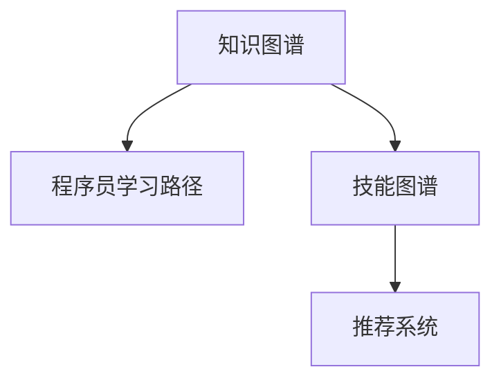

                 

# 知识图谱在程序员学习路径规划中的应用

> 关键词：知识图谱, 程序员学习路径, 图谱构建, 学习推荐, 技能图谱, 编程语言

## 1. 背景介绍

### 1.1 问题由来
随着编程语言和开发工具的不断更新迭代，程序员需要不断学习新知识以保持竞争力。然而，由于语言种类繁多、工具更新迅速，程序员常常感到学习压力巨大，难以系统规划学习路径。这不仅影响了学习效率，也限制了技能提升的进展。

### 1.2 问题核心关键点
构建一个全面、系统的程序员学习路径，使其能够帮助程序员系统规划学习目标，提升学习效率，是一个重要且紧迫的问题。知识图谱作为一种表示复杂领域知识的图结构化方式，为解决这个问题提供了新的可能。

### 1.3 问题研究意义
利用知识图谱来构建程序员学习路径，不仅能有效规划学习路线，提高学习效率，还能促进程序员技能系统化发展，提升团队整体技术水平。这对于加速技术迭代、推动产业升级具有重要意义。

## 2. 核心概念与联系

### 2.1 核心概念概述

为更好地理解知识图谱在程序员学习路径规划中的应用，本节将介绍几个关键概念：

- **知识图谱**：以图结构化的方式描述和存储实体与实体间的关系，通过节点和边来表示不同知识元素之间的关系，常用于表示和组织复杂领域知识。

- **程序员学习路径**：根据程序员当前技能水平和未来发展目标，构建的学习目标序列，包括所需要学习的内容、步骤和时间安排。

- **技能图谱**：描述程序员所需掌握的技能及其相互之间的关系，通过节点和边来表示不同技能之间的关系，常用于表示和组织编程技能和工具。

- **推荐系统**：利用用户行为数据和知识图谱构建模型，为用户推荐个性化内容的技术，常用于推荐书籍、课程等。

这些概念之间的逻辑关系可以通过以下Mermaid流程图来展示：



这个流程图展示出知识图谱如何通过技能图谱和推荐系统，与程序员学习路径建立联系。

## 3. 核心算法原理 & 具体操作步骤
### 3.1 算法原理概述

利用知识图谱规划程序员学习路径的基本思路是：构建一个覆盖广泛编程技能和工具的完整知识图谱，使用推荐算法为用户推荐个性化的学习路径。

具体步骤如下：

1. **构建技能图谱**：通过分析编程语言、开发框架、工具等领域的知识，构建一个全面的技能图谱，描述技能间的关系。
2. **匹配用户技能**：根据用户当前技能水平，匹配相应的学习路径节点。
3. **个性化推荐**：利用推荐算法为用户推荐后续学习路径的节点。
4. **动态调整**：根据用户学习进度和反馈，动态调整学习路径，确保路径的合理性和实用性。

### 3.2 算法步骤详解

构建程序员学习路径的过程可以分为以下几个关键步骤：

**Step 1: 构建技能图谱**

构建技能图谱的主要步骤如下：

1. **定义实体和关系**：定义技能、编程语言、框架、工具等实体，以及它们之间的关系，如“使用”、“掌握”、“依赖”等。
2. **数据收集**：从编程社区、技术文档、培训课程等渠道收集数据，构建知识图谱的基本框架。
3. **知识图谱构建**：使用图数据库（如Neo4j、OrientDB）或图计算框架（如Neo4j GraphAlgo）构建技能图谱，并对其进行优化和验证。

**Step 2: 匹配用户技能**

匹配用户技能的过程包括：

1. **技能评估**：通过调查问卷、测试等方式，评估用户当前技能水平。
2. **节点匹配**：将用户当前技能与技能图谱中的节点进行匹配，确定当前所处的技能节点。

**Step 3: 个性化推荐**

个性化推荐过程主要通过以下步骤实现：

1. **特征提取**：提取用户的学习历史、兴趣、反馈等特征。
2. **模型训练**：使用协同过滤、深度学习等算法训练推荐模型。
3. **路径推荐**：根据用户当前技能节点和模型预测，为用户推荐后续学习路径节点。

**Step 4: 动态调整**

动态调整学习路径的步骤包括：

1. **反馈收集**：收集用户对推荐路径的反馈，包括学习进度、效果等。
2. **路径调整**：根据反馈调整推荐算法参数和路径节点，确保路径的适应性和合理性。

### 3.3 算法优缺点

知识图谱在程序员学习路径规划中的优点包括：

1. **全面覆盖**：能够涵盖编程领域广泛的技能和工具，提供全面的学习路径。
2. **个性化推荐**：根据用户特征和反馈，提供个性化学习路径，提高学习效率。
3. **灵活调整**：能够根据用户反馈动态调整学习路径，确保路径的实用性。

同时，该方法也存在一定的局限性：

1. **数据收集难度**：技能图谱构建需要大量数据，收集和整理工作量大。
2. **模型复杂度**：推荐算法需要处理复杂的关系图结构，模型设计复杂。
3. **用户反馈问题**：用户反馈的质量和数量直接影响路径调整效果，反馈收集和管理难度大。

尽管存在这些局限性，但知识图谱在程序员学习路径规划中的应用仍显示出巨大的潜力，值得深入研究和推广。

### 3.4 算法应用领域

基于知识图谱的程序员学习路径规划方法，已经在多个领域得到了应用：

- **编程教育**：帮助学生系统规划学习路径，提升学习效果。
- **企业培训**：为技术人员提供技能提升和学习路径规划，提升企业技术水平。
- **个人职业发展**：帮助程序员规划职业发展路径，提高职业竞争力。
- **开源社区**：构建开源社区的技能图谱，为开发者提供学习指导和资源共享。

随着知识图谱和推荐算法技术的不断进步，基于知识图谱的程序员学习路径规划方法将有更广阔的应用前景。

## 4. 数学模型和公式 & 详细讲解 & 举例说明

### 4.1 数学模型构建

构建知识图谱的数学模型主要包括以下几个关键步骤：

1. **实体和关系定义**：定义技能、编程语言、框架等实体，以及它们之间的关系，如“使用”、“掌握”、“依赖”等。
2. **数据收集**：从编程社区、技术文档、培训课程等渠道收集数据，构建知识图谱的基本框架。
3. **图谱构建**：使用图数据库（如Neo4j、OrientDB）或图计算框架（如Neo4j GraphAlgo）构建技能图谱，并对其进行优化和验证。

### 4.2 公式推导过程

构建知识图谱的基本步骤可以形式化表示为：

1. **定义实体集 $V$ 和关系集 $R$**：
   $$
   V = \{v_1, v_2, ..., v_n\}
   $$
   $$
   R = \{r_1, r_2, ..., r_m\}
   $$

2. **数据收集和预处理**：
   $$
   D = \{(v_i, r_j, v_k)\}
   $$

3. **构建图谱**：
   $$
   G = (V, R, E)
   $$
   其中 $E$ 为边集，表示实体之间的关系。

### 4.3 案例分析与讲解

以构建Python编程技能图谱为例，具体步骤包括：

1. **定义实体和关系**：定义Python编程语言、Pandas库、NumPy库等实体，以及它们之间的关系，如“使用”、“掌握”、“依赖”等。
2. **数据收集**：从Python官方文档、Stack Overflow问答、编程教程等渠道收集数据，构建知识图谱的基本框架。
3. **图谱构建**：使用Neo4j图数据库构建Python编程技能图谱，并对其进行优化和验证。

## 5. 项目实践：代码实例和详细解释说明

### 5.1 开发环境搭建

在进行程序员学习路径规划的实践前，我们需要准备好开发环境。以下是使用Python进行PyTorch开发的环境配置流程：

1. 安装Anaconda：从官网下载并安装Anaconda，用于创建独立的Python环境。

2. 创建并激活虚拟环境：
```bash
conda create -n pytorch-env python=3.8 
conda activate pytorch-env
```

3. 安装PyTorch：根据CUDA版本，从官网获取对应的安装命令。例如：
```bash
conda install pytorch torchvision torchaudio cudatoolkit=11.1 -c pytorch -c conda-forge
```

4. 安装Python Graph工具库：
```bash
pip install networkx
```

完成上述步骤后，即可在`pytorch-env`环境中开始实践。

### 5.2 源代码详细实现

这里我们以构建Python编程技能图谱为例，给出使用Python Graph工具库进行知识图谱构建的代码实现。

首先，定义实体和关系：

```python
import networkx as nx

# 定义实体和关系
entities = ["Python", "Pandas", "NumPy", "SciPy", "Jupyter Notebook", "Django"]
relationships = ["uses", "has", "depends"]

# 创建图谱
G = nx.DiGraph()

# 添加节点
for entity in entities:
    G.add_node(entity)

# 添加边
for i in range(len(entities)-1):
    G.add_edge(entities[i], entities[i+1], type=relationships[i])
```

然后，进行数据收集和图谱构建：

```python
# 数据收集
# 假设已经从多个渠道收集到Python编程相关的数据，存储为字典格式
data = {
    "Python": ["Pandas", "NumPy", "SciPy", "Jupyter Notebook"],
    "Pandas": ["NumPy", "SciPy", "Matplotlib"],
    "NumPy": ["SciPy"],
    "SciPy": [],
    "Jupyter Notebook": [],
    "Django": ["Python"]
}

# 根据数据构建图谱
for entity, dependencies in data.items():
    for dependency in dependencies:
        G.add_edge(dependency, entity, type="uses")
```

最后，进行图谱优化和验证：

```python
# 进行图谱优化和验证
# 这里使用Dijkstra算法计算最短路径
shortest_path = nx.shortest_path(G, "Python", "Matplotlib")
print("最短路径:", shortest_path)
```

以上就是使用Python Graph工具库进行知识图谱构建的完整代码实现。可以看到，使用Python Graph工具库可以很方便地构建知识图谱，并进行最短路径等计算。

### 5.3 代码解读与分析

让我们再详细解读一下关键代码的实现细节：

**entities和relationships定义**：
- `entities`列表定义了知识图谱中的实体，如Python、Pandas、NumPy等。
- `relationships`列表定义了实体之间的关系，如“使用”、“掌握”、“依赖”等。

**创建图谱和添加节点、边**：
- 使用`nx.DiGraph()`创建有向图谱。
- 使用`G.add_node()`添加节点，如Python、Pandas等。
- 使用`G.add_edge()`添加边，表示实体之间的关系，如“Python使用Pandas”。

**数据收集和图谱构建**：
- `data`字典存储了各实体的依赖关系，如Python依赖Pandas、NumPy、SciPy等。
- 使用`G.add_edge()`根据依赖关系添加边，构建完整的图谱。

**图谱优化和验证**：
- 使用Dijkstra算法计算最短路径，验证图谱的合理性。
- `nx.shortest_path()`计算Python到Matplotlib的最短路径，可以用于展示技能间的依赖关系。

可以看到，构建知识图谱的过程相对简单，但需要根据具体场景进行灵活调整。合理的图谱构建和优化，对于后续的推荐和路径规划具有重要意义。

## 6. 实际应用场景

### 6.1 智能编程教育

知识图谱在智能编程教育中的应用，可以帮助学生系统规划学习路径，提高学习效果。通过构建完整的技能图谱，学生可以清晰了解学习目标和路径，避免盲目学习，提高学习效率。

在技术实现上，可以将技能图谱与推荐系统结合，根据学生的学习进度和反馈，动态调整学习路径。此外，还可以引入虚拟编程助教，通过交互式问答等方式，实时解答学生问题，提高学习体验。

### 6.2 企业培训

对于企业而言，利用知识图谱进行技能培训规划，可以帮助技术人员系统提升技能水平。通过构建公司内部的技能图谱，结合员工的技能评估和培训反馈，动态调整培训路径，确保培训效果。

在实际应用中，可以构建企业内部的知识图谱，涵盖各种编程语言、开发工具和技术框架。同时，结合员工的实际需求和反馈，动态调整培训路径，提高培训效果和满意度。

### 6.3 个人职业发展

对于个人程序员而言，利用知识图谱进行职业发展规划，可以帮助其系统规划职业目标，提升职业竞争力。通过构建技能图谱，程序员可以清晰了解所需掌握的技能和工具，避免职业发展中的盲目选择。

在实际应用中，可以利用知识图谱进行技能匹配和路径规划，帮助程序员识别自身技能的不足和提升方向。同时，结合个人职业规划，动态调整学习路径，确保职业发展目标的实现。

### 6.4 开源社区

对于开源社区而言，构建技能图谱可以帮助开发者系统了解社区内的技术生态，便于资源共享和学习指导。通过构建技能图谱，开发者可以快速查找所需的技术资料和工具，提升开发效率。

在实际应用中，可以利用技能图谱进行技术推荐和社区导航，帮助开发者快速找到所需资源。同时，通过技能图谱的持续更新，保持社区技术的先进性和多样性。

## 7. 工具和资源推荐

### 7.1 学习资源推荐

为了帮助开发者系统掌握知识图谱在程序员学习路径规划中的应用，这里推荐一些优质的学习资源：

1. **《知识图谱理论与实践》**：介绍知识图谱的基本概念、构建方法及应用场景，适合入门学习。
2. **《推荐系统设计与优化》**：深入讲解推荐系统的设计与优化方法，包括协同过滤、深度学习等技术。
3. **Neo4j官方文档**：Neo4j图数据库的官方文档，提供详细的图谱构建和查询方法。
4. **NetworkX官方文档**：Python Graph工具库NetworkX的官方文档，提供图谱构建和分析功能。
5. **PyTorch Graph工具库**：结合PyTorch和Graph工具库，构建复杂图结构的代码实现和应用场景。

通过对这些资源的学习实践，相信你一定能够快速掌握知识图谱在程序员学习路径规划中的精髓，并用于解决实际的NLP问题。

### 7.2 开发工具推荐

高效的开发离不开优秀的工具支持。以下是几款用于知识图谱构建和程序员学习路径规划的常用工具：

1. **Neo4j**：功能强大的图数据库，支持复杂的图谱构建和查询。
2. **OrientDB**：开源的分布式图数据库，支持大规模图谱存储和处理。
3. **NetworkX**：Python Graph工具库，支持图谱构建和分析。
4. **Gephi**：开源的图谱可视化工具，支持复杂图谱的可视化展示。
5. **PyTorch Graph工具库**：结合PyTorch和Graph工具库，构建复杂图结构的代码实现和应用场景。

合理利用这些工具，可以显著提升知识图谱构建和程序员学习路径规划的开发效率，加快创新迭代的步伐。

### 7.3 相关论文推荐

知识图谱和推荐系统的发展源于学界的持续研究。以下是几篇奠基性的相关论文，推荐阅读：

1. **《知识图谱构建方法综述》**：综述了知识图谱的构建方法和应用场景，适合全面了解知识图谱技术。
2. **《协同过滤推荐算法》**：介绍协同过滤算法的原理和实现方法，适合推荐系统学习的入门读物。
3. **《深度学习在推荐系统中的应用》**：介绍深度学习在推荐系统中的应用，包括神经网络、强化学习等技术。
4. **《Graph Neural Networks: A Review of Methods and Applications》**：综述了图神经网络的应用方法，适合深度学习与图结构结合的进阶学习。
5. **《Graph-Based Recommender Systems》**：介绍基于图结构的推荐系统，包括图谱构建、特征提取和推荐算法等。

这些论文代表了大规模知识图谱构建和推荐系统的发展脉络。通过学习这些前沿成果，可以帮助研究者把握学科前进方向，激发更多的创新灵感。

## 8. 总结：未来发展趋势与挑战

### 8.1 总结

本文对利用知识图谱进行程序员学习路径规划的方法进行了全面系统的介绍。首先阐述了知识图谱和程序员学习路径规划的基本概念和应用背景，明确了知识图谱在技能图谱构建和路径规划中的重要作用。其次，从原理到实践，详细讲解了知识图谱构建和路径规划的数学模型、算法步骤和具体操作步骤，给出了完整的代码实现和详细解释。同时，本文还广泛探讨了知识图谱在智能编程教育、企业培训、个人职业发展等多个行业领域的应用前景，展示了知识图谱范式的广泛价值。

通过本文的系统梳理，可以看到，知识图谱在程序员学习路径规划中的应用前景广阔，能够系统规划学习路径，提升学习效率，促进技能发展。随着知识图谱和推荐算法技术的不断进步，基于知识图谱的学习路径规划方法将有更广阔的应用前景。

### 8.2 未来发展趋势

展望未来，知识图谱在程序员学习路径规划中的应用将呈现以下几个发展趋势：

1. **技能图谱覆盖更广**：随着技能图谱的数据收集和构建技术不断成熟，未来将覆盖更多编程语言、开发工具和技术框架，为程序员提供更全面的学习路径。
2. **推荐算法更加精准**：随着推荐算法技术的不断进步，未来将实现更精准、更个性化的学习路径推荐，提升学习效果。
3. **动态调整更加灵活**：通过引入更多反馈机制和动态调整算法，未来将能够实时调整学习路径，确保路径的合理性和实用性。
4. **多模态数据融合**：将文本、图像、音频等多模态数据融合到技能图谱中，构建更加丰富和全面的学习路径。
5. **企业内部定制**：为不同的企业、团队和部门定制化构建技能图谱，提供更贴合实际需求的培训和规划方案。

这些趋势凸显了知识图谱在程序员学习路径规划中的巨大潜力，未来将进一步推动NLP技术在教育、培训、职业发展等领域的应用。

### 8.3 面临的挑战

尽管知识图谱在程序员学习路径规划中展现了巨大的潜力，但在迈向更加智能化、普适化应用的过程中，它仍面临诸多挑战：

1. **数据收集难度大**：构建技能图谱需要大量数据，数据收集和整理工作量大。
2. **算法复杂度高**：推荐算法需要处理复杂的关系图结构，算法设计复杂。
3. **用户反馈问题**：用户反馈的质量和数量直接影响路径调整效果，反馈收集和管理难度大。
4. **技能图谱动态更新**：技能图谱需要随着技术的变化进行动态更新，更新频率高且工作量大。

尽管存在这些挑战，但知识图谱在程序员学习路径规划中的应用仍显示出巨大的潜力，值得深入研究和推广。

### 8.4 研究展望

面对知识图谱在程序员学习路径规划中面临的挑战，未来的研究需要在以下几个方面寻求新的突破：

1. **自动化数据收集**：开发自动化数据收集工具，从网络爬虫、API接口等渠道自动获取数据，减少人工干预。
2. **高效图谱构建**：研究高效图谱构建算法，如分布式图谱构建、图谱压缩等，提高构建效率。
3. **精准推荐算法**：开发精准推荐算法，如基于图结构的推荐算法、深度学习推荐算法等，提升推荐效果。
4. **动态路径调整**：研究动态路径调整算法，如基于强化学习的路径优化算法，提高路径调整的灵活性和精度。
5. **多模态融合**：研究多模态数据融合技术，将文本、图像、音频等多模态数据融合到技能图谱中，提升学习路径的全面性和多样性。

这些研究方向的探索，将进一步推动知识图谱在程序员学习路径规划中的应用，为程序员提供更加系统、高效的学习路径，促进其技能发展。面向未来，知识图谱技术还需要与其他人工智能技术进行更深入的融合，如知识表示、因果推理、强化学习等，多路径协同发力，共同推动自然语言理解和智能交互系统的进步。只有勇于创新、敢于突破，才能不断拓展知识图谱的边界，让智能技术更好地造福人类社会。

## 9. 附录：常见问题与解答

**Q1: 知识图谱构建需要哪些步骤？**

A: 知识图谱构建的主要步骤包括：
1. 定义实体和关系。
2. 数据收集和预处理。
3. 图谱构建和优化。
4. 验证和评估。

其中，数据收集和预处理是构建知识图谱的重要环节，需要大量数据和仔细的预处理工作。图谱构建和优化可以通过各种工具和算法实现，如Neo4j、NetworkX等。最后，需要验证和评估图谱的质量，确保其合理性和实用性。

**Q2: 推荐算法有哪些？**

A: 常用的推荐算法包括：
1. 协同过滤算法：基于用户行为和物品属性进行推荐。
2. 基于内容的推荐算法：基于物品属性和用户偏好进行推荐。
3. 基于深度学习的推荐算法：如基于神经网络的推荐算法。
4. 混合推荐算法：结合多种推荐方法，提升推荐效果。

其中，协同过滤算法和基于内容的推荐算法较为传统，深度学习推荐算法和混合推荐算法则近年来发展迅速，具有较好的推荐效果。

**Q3: 知识图谱在程序员学习路径规划中如何应用？**

A: 知识图谱在程序员学习路径规划中的应用主要包括以下步骤：
1. 构建技能图谱，描述技能间的关系。
2. 匹配用户技能，确定当前所处的技能节点。
3. 个性化推荐后续学习路径节点。
4. 动态调整学习路径，确保路径的合理性和实用性。

通过构建完整的技能图谱，结合推荐算法，可以为程序员提供个性化的学习路径，提升学习效率和效果。

**Q4: 如何处理知识图谱的稀疏性问题？**

A: 知识图谱中的实体和关系通常具有稀疏性，可以通过以下方法进行处理：
1. 图谱嵌入技术：使用图谱嵌入算法，将稀疏图谱转换为稠密向量表示。
2. 图谱压缩技术：使用图谱压缩算法，减少图谱存储和处理的复杂度。
3. 图谱融合技术：将多个稀疏图谱进行融合，提高图谱的完整性和稠密度。

这些方法可以帮助处理知识图谱的稀疏性问题，提升图谱构建和分析的效率。

**Q5: 如何优化知识图谱构建和推荐算法？**

A: 知识图谱构建和推荐算法的优化主要包括以下方面：
1. 高效图谱构建算法：研究分布式图谱构建、图谱压缩等算法，提高构建效率。
2. 精准推荐算法：开发精准推荐算法，如基于图结构的推荐算法、深度学习推荐算法等，提升推荐效果。
3. 动态路径调整算法：研究动态路径调整算法，如基于强化学习的路径优化算法，提高路径调整的灵活性和精度。
4. 多模态融合技术：研究多模态数据融合技术，将文本、图像、音频等多模态数据融合到技能图谱中，提升学习路径的全面性和多样性。

这些优化方法可以帮助提升知识图谱构建和推荐算法的效率和效果，进一步推动其在程序员学习路径规划中的应用。

---

作者：禅与计算机程序设计艺术 / Zen and the Art of Computer Programming

